# Cute Fantasy World Sim

A 2.5D cute-fantasy RPG whose world is a simulation, and whose player is one
element of that simulation. This repository currently holds the skeleton and the
first layers of the world: an endless, seed-determined landscape that is built in
chunks around whoever is walking on it, the named biomes that decide what that
landscape looks like, the water carved into it, the islands floating over it, the
villages and roads laid across it, the grass blowing over all of it, and the
lighting and atmosphere that make it read as a cosy glowing diorama. There is no
gameplay yet — no combat, items, characters or language-model agents.

## The layer split

The project is two layers, and the arrow between them only points one way.

```
render/  the engine shell — window, camera, meshes, keyboard
   |
   |  reads snapshots, calls step()
   v
sim/     the simulation — seeded world state and the rules that move it
```

* **`sim/`** is the simulation core. It holds the world's state, the arithmetic
  that advances it, and all of world generation — the ground is part of the
  world, not part of the picture of it. It never mentions the render layer, and
  it never reaches for the engine's presentation facilities — no nodes, no scene
  tree, no meshes, no window. It does not even use the engine's random number generator:
  `sim/rng.gd` is a few lines of integer arithmetic written out by hand, so that
  the same seed gives the same world regardless of what is running it.
* **`render/`** is the engine shell. It owns no world state. Every frame it
  advances the simulation, copies positions onto visuals, and turns the chunks
  the simulation has built into something the graphics card understands.
  Deleting the whole directory would leave the simulation fully runnable.

This is a constraint, not an observation: `./run_tests.sh --layers-only` fails
if any file under `sim/` names a render-layer path or an engine presentation
type, and fails again if it names a scene, an asset file or an asset pack (see
*Asset tags*). Headless mode is a core requirement of this project, and
rendering must never be able to affect the simulation.

The arrow points one way in the other direction too: what the render layer is
handed cannot be written back through. The state it reads each frame is a copy
(`SimWorld.snapshot()`), and the ground it draws is a copy as well — the
streamer's `geometry()` hands out a detached duplicate of a chunk, while the
simulation's own `live_geometry()` reaches the chunk itself. Whatever the shell
does to what it is given, the world is unchanged, and a test writes into a
handed-over chunk and checks that the world's fingerprint does not move.

Supporting directories: `bin/` holds the entry-point scripts, `tests/` holds the
suites and the structure-check rules, `assets/` holds the installed asset packs
and the per-tag wrapper scenes (see *Asset tags*), and `tools/` holds the engine
binary (not in git — see *Requirements*) alongside the fetch, measure and
demonstration scripts, which are. `tools/.gitignore` excludes only `godot/` and
`godot-home/`; a fresh clone needs `tools/fetch_kaykit.sh` to get a world that
renders as art at all.

## The ground

The landscape is built as a stack of layers, each one sampled per world
position and assembled per chunk. Six layers exist so far — the height of the
ground, the biome it belongs to, the water carved out of it, the islands
floating above it, the villages and roads laid across it, and the flora and
props scattered over all of that. The grass over the top of it is a seventh
layer that lives in the render shell rather than in the simulation, for a reason
written down below; the lighting stack is a later one:

* **`ValueNoise`** — fractal value noise, sampled per world position: a few
  layers of smoothly interpolated random values, each half as tall and twice as
  fine as the one before. Every layer's value is drawn from a *hash of the
  position* rather than from a random stream, because a stream's numbers depend
  on how many were drawn before them — two chunks covering the same ground would
  then disagree about it. Every continuous field in the stack is made of this.
* **`TerrainSurfaceField`** — how high the land is at a world position, before
  water is cut out of it. It is a pure function of that position and the world
  seed: it stores nothing that sampling changes, it does not know that chunks
  exist, and it never looks at a clock.
* **`TerrainQuery`** — the one surface the rest of the project reads the ground
  through. It composes the fields and answers the questions anything actually
  has: how high the ground is *after* the water has carved it, which biome this
  is, whether this is water, whether it is a bank, what surfaces are stacked over
  a position, what you would be standing on coming from a given height, and
  whether there is anything there at all. It decides nothing; every answer is a
  field's answer, forwarded or combined.
* **`TerrainChunkMesher`** — turns a square of those fields into triangles. It
  carries nothing between chunks, so a chunk's geometry is the same whether it
  was the first built or the thousandth. Corner positions are computed from the
  world origin rather than from a neighbour, so two chunks meet exactly along
  their shared edge. Triangles do not share vertices, which gives the flat
  faceted look this world is aiming at. Every corner also carries the ground
  colour of the biome blend there, so a biome border is a gradient inside the
  geometry itself.
* **`TerrainStreamer`** — keeps the chunks near an observer built and drops the
  rest. Anything within the load radius of any observer is built; anything
  beyond the unload radius of every observer is dropped. The two radii differ so
  that walking back and forth across the boundary does not rebuild the same
  chunk every step. Because a chunk's geometry depends only on its coordinate
  and the seed, ground that is dropped and later walked back to comes back
  byte-identical, and generation never has to be serialised to stay
  reproducible.

## The ground you can see, past the ground you can stand on

The streamer keeps a disc of ground about forty units in radius meshed at a
two-unit cell, because that is the ground a character walks on, collides with and fights
on. The camera sees nine hundred. **`DistantGround`** fills the difference: five
rings of tiles at a cell that doubles each ring — 4, 8, 16, 32, 64 units — out to
at least 1024 units, which is where ground straight ahead meets the camera's far
plane.

It lives in `render/`, and that placement is the point. The world's height at a
position is one function, `TerrainQuery.ground_height_at`, and the coarse tiles
only read it: collision, the terrain query, the combat lattice and the world's
own fingerprint are exactly what they were before, and a headless process, which
never loads a file under `render/`, meshes none of it. Level of detail is a
drawing choice, structurally rather than by care.

The rings are exactly complementary, so there is neither a hole nor an overlap: a
level-1 tile is 2×2 simulation chunks and a chunk is 4×4 level-1 cells, so level
1 omits precisely the cells inside chunks the simulation has loaded; each coarser
ring's edges fall on four cells of the ring outside it. Where a coarse cell has no
neighbour it drops a vertical apron in the ground's own colour, deeper than the
worst two levels can disagree by, so a boundary can never be seen through. Every
tile is a square of the world lattice rather than of the observer, so its geometry
never changes as the observer moves — only which tiles are drawn.

The radius grew 25.6× and the pieces drawn grew 4.9×; the same reach meshed at the
near cell would have been 82× more pieces and 80× the geometry — 212 MiB against
2.6. The write-up,
with the radius derived from the playing camera and the cost measured, is
[reports/terrain-lod.md](reports/terrain-lod.md).

## The biomes

What a place looks like is a fact about the place, so the biomes live in the
simulation next to the ground's height, and the render shell only reads them.

Three continuous fields are sampled per world position — how wooded the land is,
how rocky, how wet — plus a fourth, sparse field that carves out twilight marsh
pockets. `BiomeField` resolves them into the five named biomes of the design:
meadow, deep forest, highland, blossom grove and twilight marsh. Each name
carries a **profile** (`BiomeProfile`): ground, tree and rock tint, fog colour
and density, a sky gradient, ambient colour, foliage density, and the set of prop
tags allowed there. A profile is plain numbers — no meshes, no materials, nothing
the renderer owns.

Nothing in the resolution is a threshold, so nothing snaps. A biome's share of a
position is a smooth kernel of how far the position is from that biome's home in
field space, and the profile you get back is the weighted average of all of them.
Walk across a border and the ground colour, the fog, the sky and the fill light
slide from one biome's numbers to the next together. The marsh is laid over the
top of the other four rather than competing with them, so a pocket can sit
anywhere — including in the middle of a bright meadow — and its rim blends like
any other border. There is no distance-from-spawn term anywhere in the file: mood
is biome-driven, and difficulty will be carried by enemy level instead.

The same border, from either side. Standing in the meadow, the light is bright
and the sky pale, with the marsh's teal creeping up the near edge of the view:

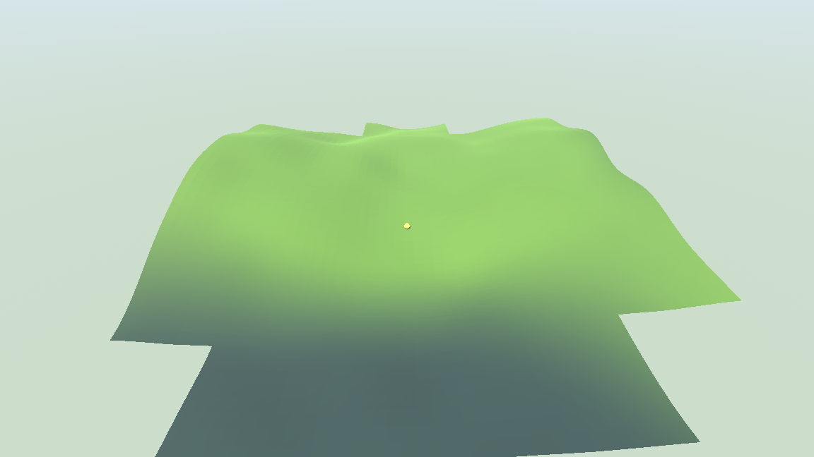

Forty-five ticks later the observer has walked into the pocket. The mood has come with
it — dark teal ambient, denser fog, an indigo sky — while the meadow it came from
is still bright across the border:

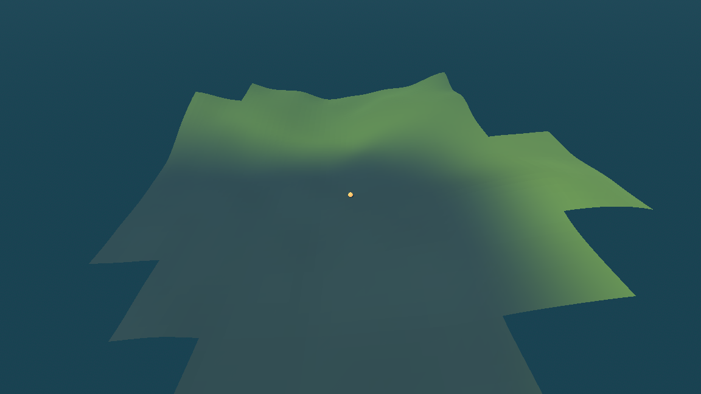

Both images are the same seed and the same walk, captured at two moments; the
commands are under *Running it*. The thresholds and blend weights behind all of
this, and the reasoning for them, are written down in
[reports/biome-resolution.md](reports/biome-resolution.md).

The render shell draws all of this and generates none of it. It asks the streamer
for the geometry of the chunks the snapshot says are loaded, and hands those
numbers to the graphics card. What it gets back is a copy, made once per chunk
when the chunk first appears and never again while it stays on screen — about a
microsecond against the ~810 microseconds of building the chunk in the first
place. The colours are read the same way: the per-vertex ground tints arrive
inside the chunk, and the fog, sky and ambient light are read each frame off the
blended profile where the observer is standing. The shell picks none of those
values; it only decides which knob each one is turned into.

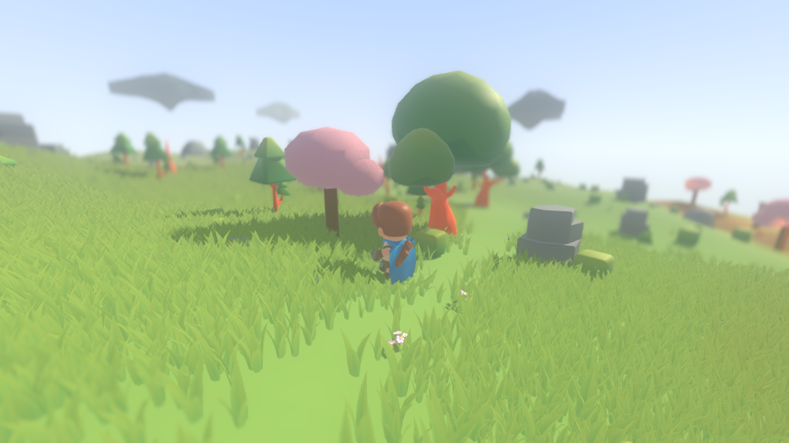

## The water

Rivers, ponds and lakes, carved out of the height field rather than laid on top
of it. Two surfaces are computed per world position: the **bed**, which is the
ground with the water's channels and basins cut into it, and the **water
surface**. The depth is one above the other, and being water is having any depth
at all — so the shoreline is where the two surfaces cross rather than a
threshold anyone chose.

Rivers are the ridge of a noise field, which in two dimensions is a long sinuous
band; along it the ground is cut into a gully and the water follows the land
downhill, so a stream reads right however the ground tilts. Ponds and lakes are
wherever the land has fallen below a broad, slow water table, which stands higher
in wet country — the one place the biome map reaches into the water. About a
twelfth of the world is wet.

All of it is drawn as **one sheet**, not a tile per chunk. Its corners sit on a
lattice fixed to the world origin, so a given world position is always the same
corner at the same height, and there is no boundary of anything inside the sheet
for a seam to appear on. The ripples are a function of world position and time
for the same reason: rebuilding the sheet around a walking viewer does not shift
them.

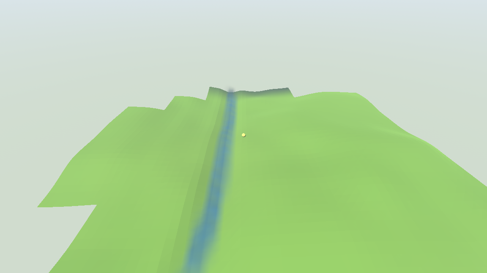

The colour comes from the biome, per vertex, the same way the ground's does —
pale grey-blue in the highland, near-black teal in a twilight marsh pocket:

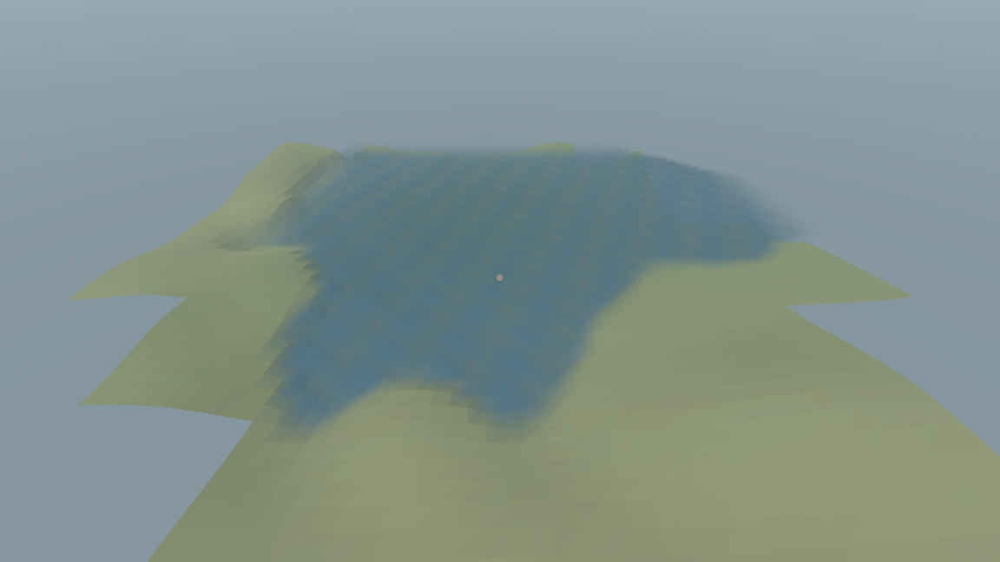
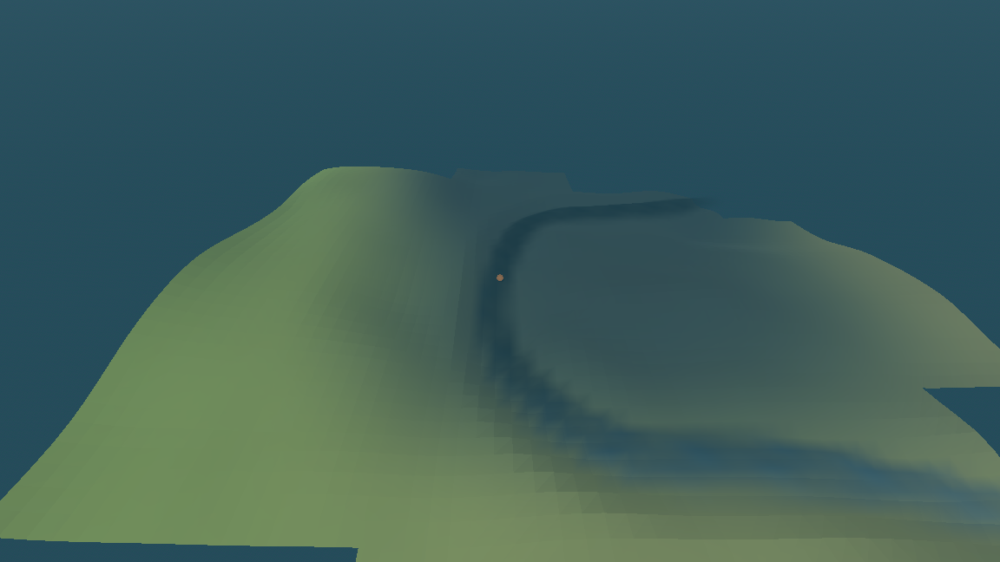

Anything can ask `TerrainQuery` whether a position is water, whether it is a
bank (dry ground with water within reach), how deep the water is, and whether
ordinary movement can cross it — water is impassable, which is the same answer
the tactical layer will read as a hole in its board. Bridges and bank flora are
later layers and will ask these questions rather than recompute them.

The full reasoning, the numbers, and a map of the water against the chunk grid
are in [reports/water.md](reports/water.md).

## The floating islands

A fourth layer, in the air. Most of the world has nothing over it; here and
there a piece of land hangs above the ground with its own small heightfield, a
cliff round its rim and a keel narrowing to a point underneath — a little
diorama in the colours of the biome below it. Islands are ground, not scenery:
`TerrainQuery` hands out their surface like any other, an observer walks onto
one and stands on it, and the air off the edge is a hole in the world.

Where they are is not a field sampled per position but a **sparse** one: the
world is divided into cells, each cell either holds an island or does not, and
that is a hash of the cell and the seed. There is exactly one condition for an
island existing, and it is geometric — there has to be room under it for a keel
that clears the land. So flat country has almost none and broken country has
them, which is both where they look best and where the ground falls away enough
for the float to read.

**How you get up there** was the layer's real design question, and the answer
decides the altitude too. An island has to look airborne and be routine to walk
onto, and those pull against each other. The way out is that "floating" is about
the land an island hangs *over* while "reachable" is about the land it hangs
*nearest*: an island's rim goes one hop above the highest ground inside its own
footprint, so you step up onto it from the ridge it overhangs. The same rule
then applies again with the island itself as the ground — an **upper storey**
sits a hop above the lower island it laps over. Two hops from the land you are
ten or more units up with sky under both plates, and you got there by walking.
No jump check, no bridge, no lift; bridges will link islands to each other
later, rather than being the only way onto one.

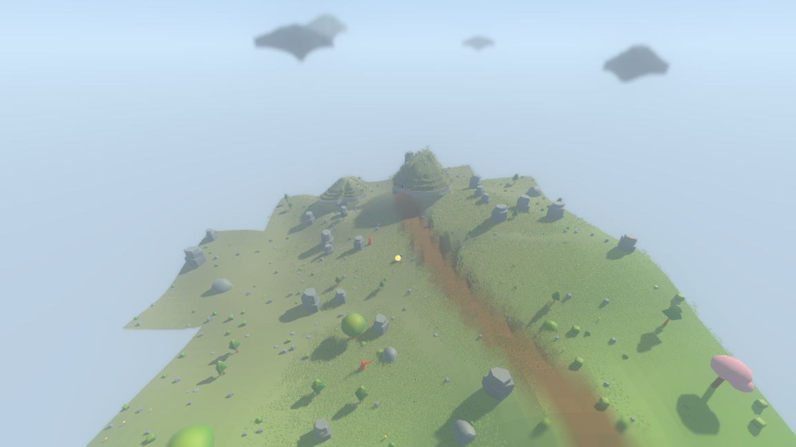

A second, separate band hangs in the far sky purely for depth — big islands,
tens of units up, hundreds of units out, never walkable and never part of any
answer about the surface. Those drift. The walkable ones deliberately do not:
moving ground is a later idea. The drift is placement data hashed out of the
island's cell like everything else, and the render shell only turns the clock —
the same split the water's ripples use.

Islands stream the way the ground does, with the same two radii so that walking
back and forth across the boundary does not rebuild anything, except that the
unit is one island rather than one square: an island *is* the natural piece,
and cutting it into squares would put a seam down the middle of a cliff for no
gain. An island dropped and later returned to comes back byte-identical.

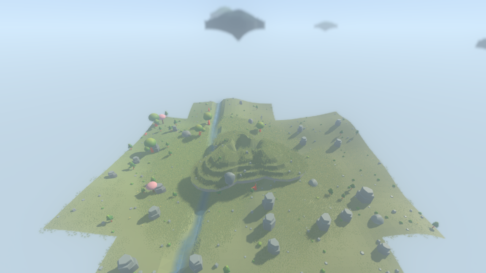

The layer also gave the terrain query the vocabulary the tactical layer will
need. `surfaces_at` lists every surface stacked over a position, `support_at`
says which of them you would be standing on coming from a given height,
`is_void_at` says when the answer is none, and `drop_from` says how far the
fall is. Both of the design's board-holes answer through the same call: water is
a hole because water is not a surface, and the air off an island's rim is a hole
because the ground is out of reach below it. Whether ordinary movement can cross
a position is now that same question asked from the ground, so the overworld and
the board cannot drift apart about where the world is solid.

The altitude band, the density, the traversal decision, the alternatives that
were rejected and the measured distributions are all in
[reports/islands.md](reports/islands.md).

## The villages and the roads

The fifth layer places villages, levels the ground under them, and strings a
graph of roads between them.

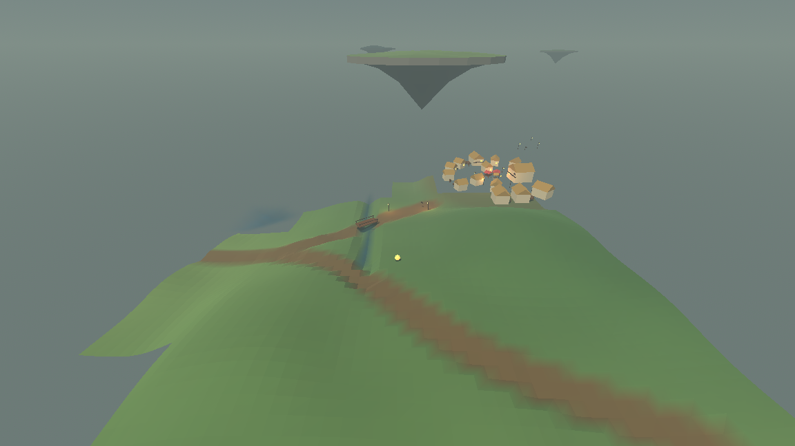

A village stands at most one per 260-unit cell. Most cells want one; the biome
under the candidate scales the threshold that wish is compared against — a meadow
keeps almost every wish, a twilight marsh keeps none — and the ground then has a
veto: the whole pad must be dry, level enough to cut without leaving a bank, and
clear of any floating island overhead. About one cell in five ends up with a
village, which is one every 610 units of walking. The cell holding the world
origin always wants one, and its candidates go on a ring 62 to 104 units around
the origin, so a world always starts a short walk from a village and never inside
one.

The ground under a village is levelled to the average height across its own core
and eased back into the land by its rim, so a village sits *in* the country
rather than on a plinth cut out of it. Buildings are whole placed units named by
tag: the layout puts a well and a campfire on a green, rings slots around it,
turns every building to face the green, and drops any candidate whose footprint —
widened by the spacing rule — touches one already placed. That test is the
separating-axis theorem on two oriented rectangles rather than a bounding circle,
because the buildings are turned and a circle round a long tavern would refuse
most of its ring. Each building **reserves** its ground, which is the contract
with the scatter layer that comes next: it asks `TerrainQuery.building_at()`
before it puts a fern down.

The roads are a **relative neighbourhood graph** over the villages and the
landmarks between them: two places are joined exactly when no third place is
closer to both of them than they are to each other. That rule is local — the
region it asks about sits inside the circle round either end — so the same road
appears whichever end of it you are standing at, without any global graph
existing anywhere. Along a road the ground is levelled across the roadway and
worn 0.30 units into the land, and the ground colour is mixed most of the way to
bare earth, so a road is part of the world's own description of itself rather
than a decal. Where a road's line crosses water the carving stops — a road never
cuts a river's bed — and a bridge tag spans the crossing instead.

Every building except the well carries one or two **lit windows** — a
`window_glow` tag on its facade, drawn as a small warm emissive pane with a point
light behind it. That is the settlement layer's part in the art direction's warm
pinpoints against cool ambient, and it is about 21 point lights per village.
Where a window is comes from the building's own reserved rectangle and facing,
because the simulation has never seen a model; the asset table, which has, slides
the pane onto the wall the model really has there before drawing it.

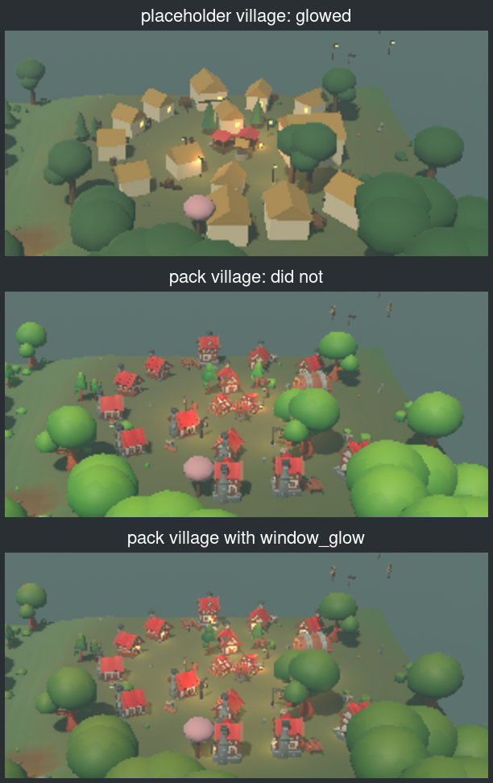

The placement rule, the reasoning behind every number in it, the measured
densities and what is still open are in
[reports/settlements.md](reports/settlements.md); the windows have their own
write-up in [reports/window-glow.md](reports/window-glow.md).

## The flora and the props

The sixth layer dresses everything the first five built: trees, undergrowth,
waterside flora, loose stone and a catalog of made props, scattered one cell at
a time and gated by both the biome and what is already there.

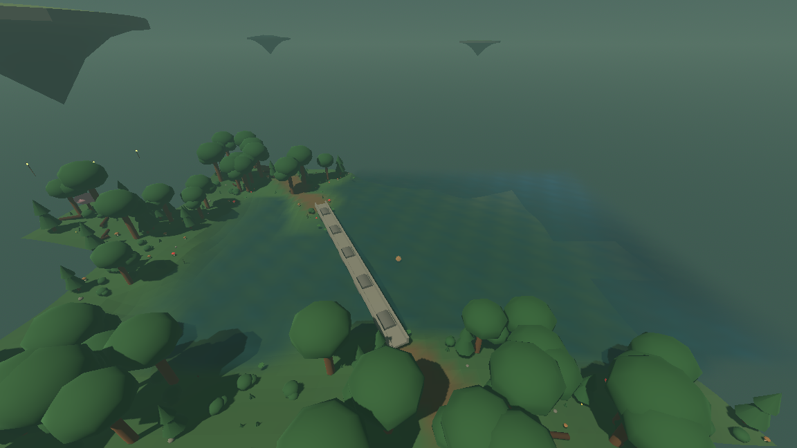

The world is covered by two lattices of square cells — a fine one two units
across for flora, a coarse one eight units across for boulders, stone circles
and made things — and **each cell decides alone**. One roll, hashed from the
cell's own coordinates and the seed, is compared against the weights of
everything the biome and the context there allow: it lands inside one of them
and that thing is placed, or falls off the end and the cell stays empty. A cell
never looks at its neighbours and nothing accumulates between them, so a chunk's
dressing is the same whether it was built first, built after its neighbours, or
built again after being dropped — the same argument the ground itself makes, one
layer up. Both cell sizes divide the chunk exactly, so no cell straddles a
border.

A weight is a probability rather than a ratio, which means the table reads as
densities: `canopy_tree` at 0.072 in deep forest is about one cell in fourteen.
The same row also carries a **size** per biome, in world units, and that is
where the biomes really separate. A `fir` is five to seven and a half units tall
under canopy and a stunted two and a half up on the tops; a `boulder` is
knee-high in the woods and two to four units on the moor. Measured over a
survey of a thousand-unit square, a deep-forest tree runs 1.9 times a highland
one at the median and highland stone averages 2.1 times deep forest's — the two
distributions the layer exists to produce.

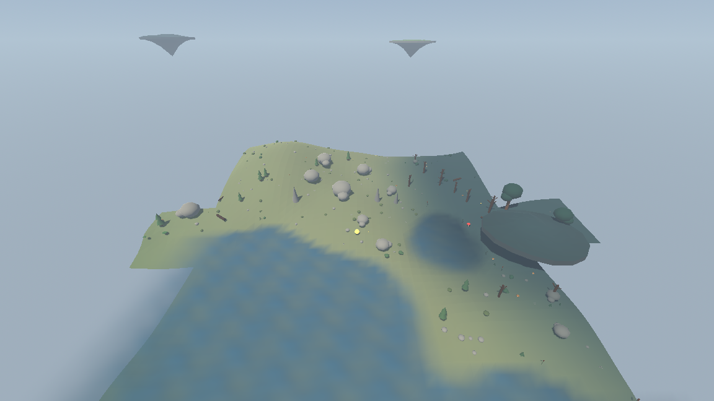

Context is what keeps a prop from reading as sprinkled. Every question the layer
asks is one `TerrainQuery` already answers for somebody else, so nothing here can
disagree with the layer that owns it: **nothing at all** stands inside a
building's reserved footprint, in a cart track, or on a cliff face; reeds,
cattails and toadstools need wet or bank ground and lily pads need water of a
workable depth; fences, lantern posts and carts stand in the band between the
wheel ruts and the edge of the verge and line up with the road; crates and
barrels stand in the yard outside a wall; and a stone circle needs a clearing —
level ground, no road, no village, nothing overhead — which is why the highland
grows one alone on the moor rather than one in every thicket. Inside a village
the flora thins to a third, so the pad reads as trodden rather than swept.

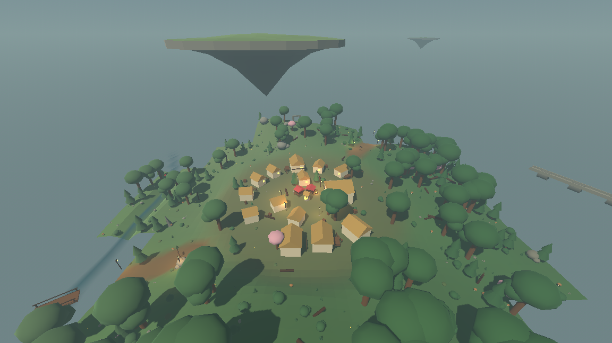

Size travels as a world-unit height rather than as a scale factor, because
generation has no idea what any of this looks like; the render shell divides by
what the thing is as drawn to get its scale, so a fir the simulation wanted
seven units tall is seven units tall whether it is currently a placeholder or a
bought model.

The catalog, every weight with the reasoning behind it, the context rules, the
measured distributions and what is still open are in
[reports/scatter.md](reports/scatter.md).

## The grass

The seventh layer, and the first one that is not part of the world at all.

Every layer before it lives in `sim/`, because what is in a place is a fact about
the place: a character can walk into a tree, shelter behind a boulder, cross a
bridge. Grass is the first thing that fails that test — nothing collides with a
blade of grass, nothing picks one up, no rule will ever read one, and the world
is the same world whether or not a blade is drawn. So the grass is a property of
the picture, it lives in `render/grass_layer.gd`, and that is what makes "a
headless run creates no grass" true by construction rather than by a flag: a
headless process never loads a single file under `render/`, so it does not have a
grass layer switched off, it has no grass layer. A test runs the headless entry
point as a subprocess and reads that off the engine's own resource cache, and a
second one runs the same seed three ways — the shell with grass, the shell with
`--no-grass`, and a simulation with no renderer at all — and requires one
fingerprint from all three.

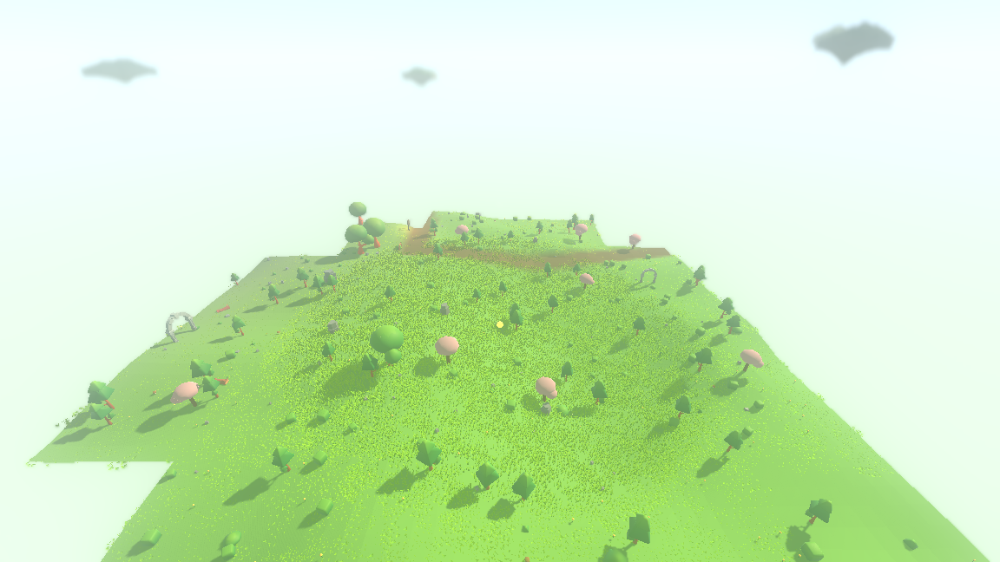

A chunk of grass is one instanced draw. A lattice of 28 by 28 candidates is laid
over the chunk, each one jittered off its cell and kept or dropped by a hash
against the blended biome's **foliage density**, and what survives becomes an
instance in a single multimesh. Nothing about it is invented here: how high the
ground is, which way it faces and what colour it is are read off the very
triangles the shell is already drawing, so a blade sits exactly on the ground
rather than a finger above or below it, and only what the triangles cannot answer
— how thickly this biome grows, what colour its foliage is, where the water and
the roads are — is asked of the simulation, on coarse grids and interpolated. A
blade's colour is the ground colour *under it* carried half way to the biome's
foliage tint, so grass beside a cart track is the colour of the track, and grass
in a marsh is marsh-coloured.

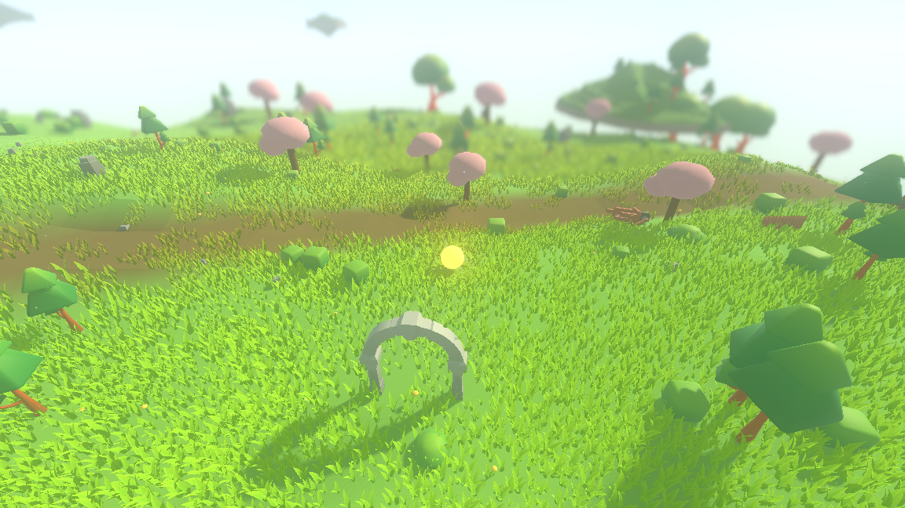

A wind shader runs two waves downwind at different scales — a long gust rolling
at seven units a second, pushed through a smoothstep so that most of its cycle is
calm and the crest arrives as a front, and a fast per-blade ripple that never
stops — crossed by a third at right angles so a front is a ragged band rather
than a straight line. Every quantity is a function of world position and time,
never of anything belonging to a chunk, which is the same rule the water's
ripples follow and for the same reason: a chunk that streams in beside one
already on screen is part of the same gust rather than starting its own.

The characters reach the shader too, as eight slots of position and reach, and
the grass bends radially away from whoever is standing in it and flattens under
their feet:

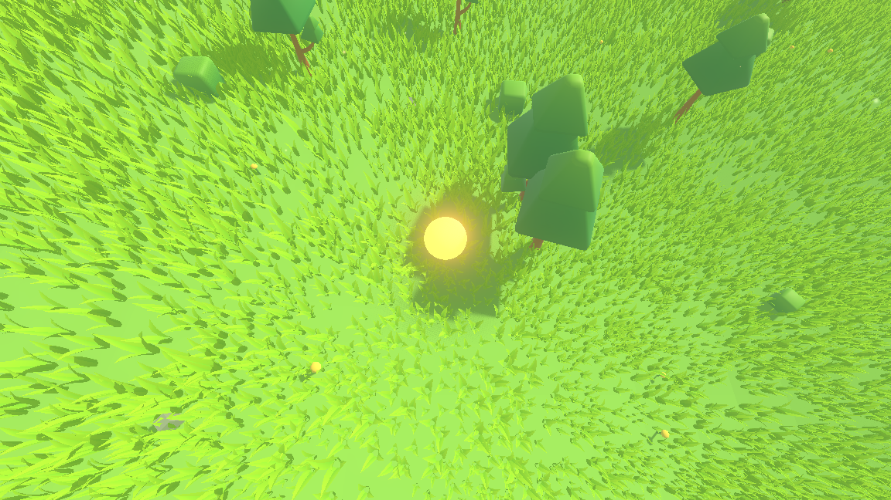

That push is deliberately **stateless** — a pure function of where a blade is and
where the characters are now — rather than a trail worn into the ground. A trail
is memory, and there are only two places to keep it: in the simulation, where
decoration would start moving the world's fingerprint, or in the render shell,
where it would die every time the chunk streamed out and reappear wrong when you
walked back. Level of detail is the same kind of decision made the same way: a
chunk is built once at full density and *how many* of its tufts are drawn is a
single integer on the multimesh, changed as the observer moves, because thinning
by rebuilding would pay two milliseconds to save something almost free. The
lattice is walked in a fixed shuffled order so that hiding the tail hides a
uniform sample of the chunk rather than one corner of it.

Measured rather than assumed, on the scene the game actually draws
(`tools/measure_grass.sh`): a meadow at the streaming radius holds **8 667 tufts
over 30 chunks, 6 342 of them drawn — 266 364 triangles in 30 instanced draw
calls** — and growing a chunk of grass costs about a fifth to a third of what
meshing the chunk of ground under it already costs. Frame times on this machine
are software rasterisation and are reported as such.

The two questions section 13 of the design left open against this layer — how
faithful the interaction should be, and what the level-of-detail strategy is —
are both answered with their reasoning, along with the full cost table, in
[reports/grass.md](reports/grass.md).

## The lighting and atmosphere

The eighth layer, and the second one that is not part of the world. It is the
whole of what makes the world *look* the way section 9 of the design describes:
a cool ambient base with warm pinpoints of light in it, per-biome fog and sky,
bloom on every emissive, floating glowing motes, wandering orbs in the twilight
pockets, a miniature depth of field and long soft shadows.

It lives in `render/atmosphere.gd` and `render/mote_field.gd` for the same reason
the grass does, only more so: no rule reads the fog, nothing collides with a
firefly, no combat lattice cares which way the shadows fall, and the world is the
same world in the dark. So a headless process has no environment, no light, no
bloom and no mote to switch off — those files are never loaded. A test reads that
off the engine's resource cache from outside (`render-scripts found=7 loaded=0`),
and a second runs the same seed three ways — the shell with the stack, the shell
with `--no-atmosphere`, and a simulation with no renderer — and requires one
fingerprint from all three while also requiring the two shell runs to differ in
the ways they should (934 motes and 29 warm lights against none of either).

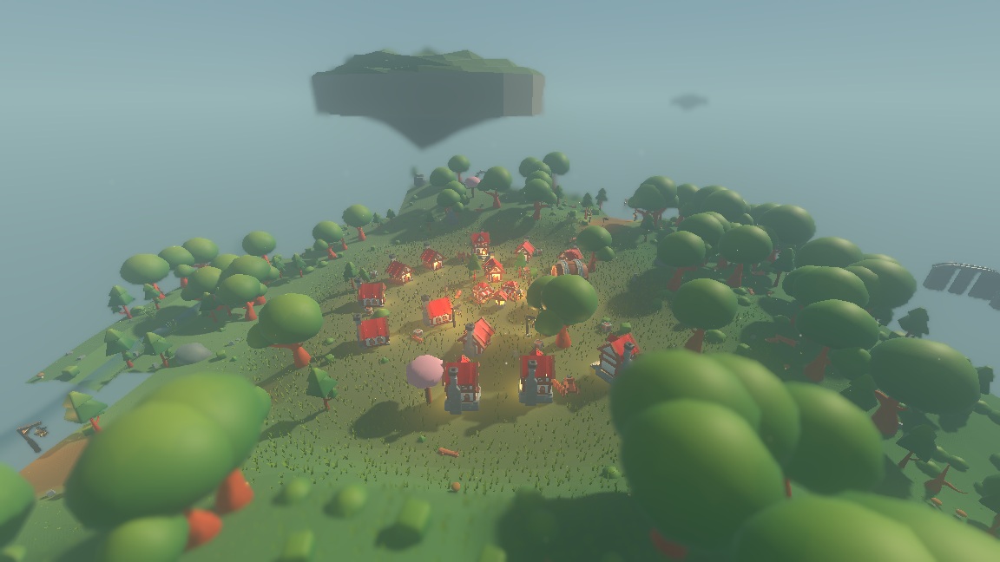

**Nothing about the mood is chosen here.** The fog colour and density, the sky
gradient and the colour of the fill light are read every frame off the blended
biome profile for wherever the observer is standing, so crossing a border slides
all of them from one biome's numbers to the next. What the layer chooses is which
knob each one becomes.

The fill light is a **warm-neutral colour rather than the sky**, which is the one
line of the grade that is easy to get wrong and invisible when it is: an ambient
sampled from the sky pours blue into every shadow until shadowed stone reads as
slate. Stone lit by the biome's fill shifts at most 0.12 towards blue; the same
stone filled from its own sky shifts by 0.45 to 0.97.

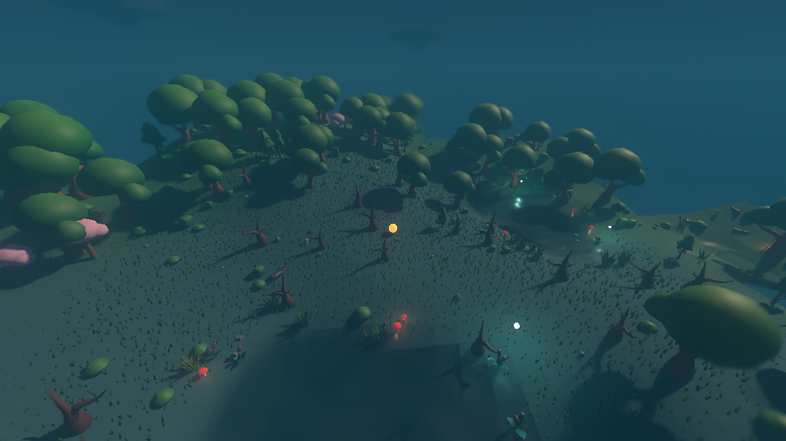

**Six tags carry a warm point light** — lantern posts, hanging lanterns,
campfires, lit windows, glowing orbs and glowing toadstools — hung on the node
the simulation placed, because an emissive surface lights itself and nothing
else. Five are warm; the orb is the deliberately cool one, the marsh's
witch-light. The toadstool only *casts* where the biome is gloomy enough for it
to read, because a marsh view holds a dozen of them and a light each is a real
cost. Bloom takes everything brighter than white and nothing dimmer.

**The motes are one instanced cloud** of 1 500 quads in a box that follows the
view, wrapped back around it in the shader — so walking a hundred units builds
nothing and the only per-frame work is one uniform. How many are drawn comes from
two numbers the biome profile already carries, and is one integer on the
multimesh, the same trick the grass uses: 335 in a bare highland, 945 in a
twilight marsh, per thousand pooled.

Measured on the scene the game draws (`tools/measure_atmosphere.sh`), at the
streaming radius, with the stack taken apart one piece at a time: the whole thing
is **12–13% of the frame**, of which the motes are free (0.1 ms for 1 418 of
them) and the two full-screen passes — bloom and depth of field — are almost all
of it. Frame times on this machine are software rasterisation and are reported as
such.

The four reference beats of section 9.1, each with an honest note on where it
falls short of the written target, are in
[reports/atmosphere.md](reports/atmosphere.md).

## The tactical board

The first thing here that is not generation. It reads a rectangle of the ground
eight layers of generation have already made as a **board**: a square lattice
whose cells answer whether a piece may stand there, how high it is, whether it is
a hole, whether it stops a line, whether it is an edge a piece can be shoved off,
and which storey of the world it belongs to. It lives in `sim/combat_board.gd`
and `sim/combat_board_builder.gd`, and it adds nothing to the world — every
answer is one terrain-query call or another, forwarded.

It is deliberately the **only** spatial discretisation the simulation has.
Section 3.2 of the design wants a soft square grid for combat and section 10
wants a small local grid of walkability around a character, and says the second
must converge with the first rather than becoming a third representation. So
there is one lattice, and the language-model layer's observation grid will later
be a window onto it.

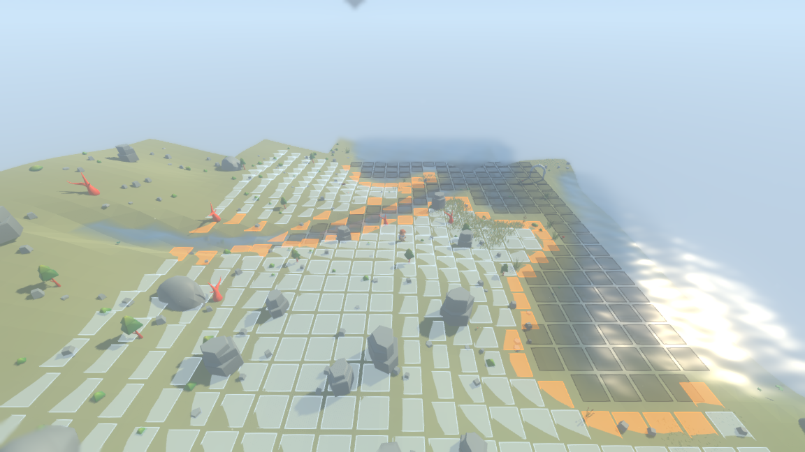

**The cell is 3 world units and its centres are fixed to the world origin** — cell
$(i, j)$ is centred at $((i + 0.5) \cdot 3, (j + 0.5) \cdot 3)$ and nowhere else,
whoever asked and whatever else is loaded. Two boards over overlapping ground
therefore share their cells exactly, the same arithmetic that makes the water
sheet seamless. It is coarser than the 2-unit generation lattice and does not
divide the 16-unit chunk, so the two grids cannot quietly become one.

**The size was measured, not guessed.** Over 81 rectangles spread across 1 100
units of world, graded against the terrain query's own answers on a half-unit
grid: at 3.0 a fight spans 21 squares, every cottage, house, tavern and tower in
162 buildings is on the lattice and one water obstacle of 46 is missed; at 4.0
seven cottages of ninety-two fall between the cells; at 6.0 two-fifths of the
village is off the board and a tenth of all standable ground is flagged a cliff
edge, which is the flag ceasing to mean anything.

**Water, the void under a floating island and an island's basin pond are all
holes**, and no rule about any of them is written in this layer: all three come
back through `TerrainQuery.is_void_at`, which the water and island layers already
made true. What a piece may step up and down is `TerrainQuery.HOP_HEIGHT` and
`TerrainQuery.DROP_REACH` taken rather than restated, so what a piece may climb is
the same fact as what a walker may climb.

The reasoning, the cell-size sweep and a board read on a floating island's top
are in [reports/combat-board.md](reports/combat-board.md).

**The overlay is painted on the ground, not laid over it.** A square is bounded
in $x$ and $z$ by its cell exactly as the lattice says, and its height is read
from the terrain at every one of its corners: a cell comes out as $2 \times 2$
quads whose nine corners are nine `support_at` answers, so a square on a hillside
neither cuts into the hill nor floats off it, and its outline is walked round the
same sub-vertices the fill is built from. Two cuts because the ground under a
square is meshed at 2.0 units and a square is 2.58 across, so 1.29-unit steps
already resolve everything the ground has; the flat plate it replaced sat 0.340
units off the surface on average and this sits 0.0045. A hole keeps the anchor
height, because there is no surface under water to follow. The sampled surface of
a cell is kept between rebuilds — the lattice is fixed to the world, so a height
once read is a height for good — which is what turns a 780 ms board into a 34 ms
step. And the grass gives way over it: the board's rectangle and lattice are four
more per-frame uniforms on the material every grass chunk already shares, so a
blade standing on a painted square stands short and the lattice reads through the
meadow. See [reports/board-overlay.md](reports/board-overlay.md).

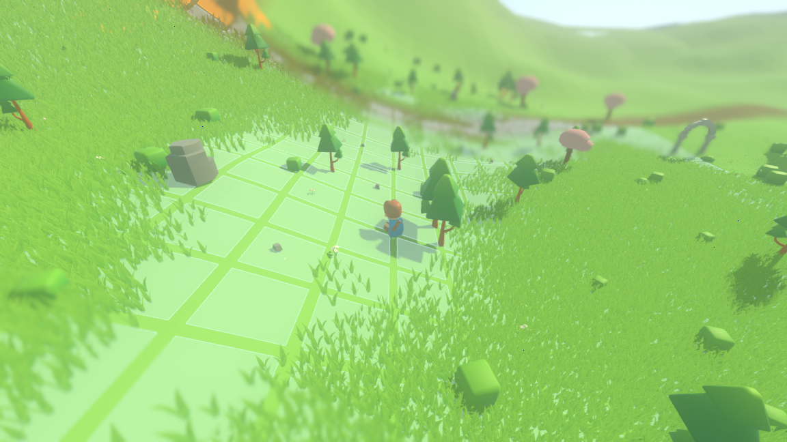

## The two-tier army

What stands on that board. Ten files under `sim/` — from `piece_geometry.gd` to
`legal_moves.gd` — answer one question: **what may this piece legally do?**
Nothing here has hit points, a damage number or a notion of whose turn it is.

**Four minions, no facing.** The Toadstool moves one cardinal cell and captures
one diagonal; the Cat rides its diagonals and the Ent its cardinals until
something stops them; the Frog arrives on an L-hop with everything in between
ignored. The Toadstool is the one whose two patterns differ, and it differs
*without* a facing — a chess pawn walks forwards because it has a front, this one
walks on all four cardinals because it does not.

**A commander wears its movement, and the item's power budget pays for it.** The
base is one cardinal step; boots add the diagonal, leggings the knight's hop, a
chestplate a queen-like slide of up to two cells, and the pattern is the union.
All three at once is 21 cells in a shape chess has no name for — and 21 of the
fixture's 154 standable cells, so the task's stop condition about a loadout that
reaches everywhere is asked and answered rather than assumed. *Which* of those a
loadout actually grants is bought by the cell out of the item's movement axis:
four points for the diagonal, eight for the hop, eight per cell of queen. What is
not spent on moving is what stops a blow, so movement and defence are the same
points twice — see [reports/loadout.md](reports/loadout.md).

**A step and a jump are the same rule.** There were nearly three kinds of
movement grant and there are two, because a king's step and a knight's leap
differ only in how long the offset is: neither reads anything between where it
started and where it lands. A knight "jumps over" pieces not because it has a
power the king lacks but because it is a landing pattern with a long enough
offset. The mutation check below is what found that; swapping the Frog's grant
from `hop` to `step` changed nothing the suite could see, because it changed
nothing at all.

**An attack is a pattern of cells and a cooldown in turns**, written for a
wielder facing north and rotated by its facing. The design's spear, dagger,
sword, bow, fireball and flail are each one call to one of three generators and a
number, and no branch anywhere asks which weapon it is holding. Whether a weapon
has a front is a fact about its pattern — a bow's ring and a flail's sweep rotate
onto themselves — rather than a flag anybody set. Turning is free, and cannot be
otherwise: `face()` takes no turn number and touches no cooldown.

**A commander owns itself**, so killing one removes it and every piece owned by
it in a single call, with no moment in between in which a dead commander's
minions are still standing.

The four minions, the loadout table, the weapon catalogue and the mutation check
are in [reports/combat-pieces.md](reports/combat-pieces.md).

## Real time, and the snap onto the board

The overworld runs in real time: characters walk on floating-point positions
while the ground streams in and out around them. The instant two commanders of
different bands come within nine world units of each other, the local area
**snaps** onto that lattice — the combatants stop walking and stand on the cells
they were standing over, a turn-based match is played out one turn per world
tick, and when it resolves every survivor is put back down at the world position
its last cell corresponds to and walks on.

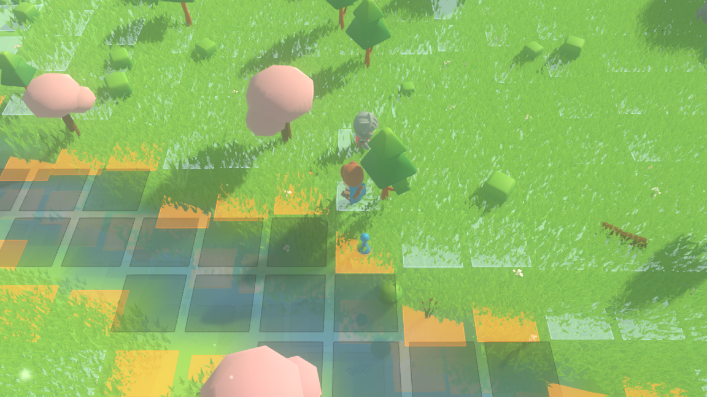

*Tick 19 of seed 1234: the knight and the barbarian adjacent on cells, a Cat on
the cell below them, the lattice drawn over a meadow and the stream running
through it. The same fight before the snap and after it resolves is in
[reports/combat-snap.md](reports/combat-snap.md).*

**The two directions are one file and they compose.** `sim/combat_snap.gd` turns
a world position into a cell and a cell back into a world position, and the
lattice is fixed to the world origin, so `cell_of(centre_of(c)) == c` for every
cell exactly — not approximately. That is the round trip the whole layer stands
on, and the suite asks it of every cell of a typed-out board, three boards read
off the ground, and one read off a floating island's top. The other direction
cannot compose, because a cell is three units across and a position is a point:
the most a snap ever moves anybody is half a cell's diagonal, 2.12 units.

**Local is one number.** Everything within 24 world units of the commander that
triggered the fight joins it, with one stated exception — a minion joins only if
its commander did, because a minion with no king on the board is a piece the king
rule cannot remove. Everything outside is untouched: not paused, not slowed, not
consulted. The demonstration scenario carries a third band 70 units away that
walks straight through the whole fight, and the suite checks its positions
afterwards are exactly what walking for that many ticks gives.

**The world does not stop.** A fight takes one turn per tick, and that tick is
the same tick that walks everybody else, streams the terrain, rebuilds the water
sheet and moves the observer. The trace carries the chunk count and the world
fingerprint on every line, including the ones inside the fight.

**A fight is held wherever a character can stand.** Nothing in the encounter code
tests for floating islands — it hands the board layer the commander's position
and the height it was standing at, and the storey follows. A fight begun on an
island's top is held on that island's board, with 291 of its 441 cells being the
void off the rim.

**Something has to choose the moves**, or the world could never come back out of
a fight. `sim/combat_policy.gd` is the dullest possible chooser: close, turn,
swing, send one minion, in that order, every tie broken by a stated ordering,
nothing remembered between turns and no random input anywhere. It is not the
minion AI of the design's §3.9 and it is not a player's action interface — both
are later work.

**The render layer draws it and holds none of it.** `./run_tests.sh
--layers-only` now runs a third structure rule: no file under `render/` may name
any class of the combat simulation except `CombatBoard`, which it is handed as a
detached copy. That is why the shell asks for a *named* scenario —
`--scenario encounter` becomes `Simulation.begin_scenario("encounter")` — rather
than calling into the scenario file.

The whole of it, with the numbers and the screenshots, is in
[reports/combat-snap.md](reports/combat-snap.md).

## The control loop, and a world that never waits for a decision

Section 2.2 of the design is three sentences: an action is *in progress* over
time, the character re-evaluates at some frequency while it runs and is biased
toward continuing, and it re-evaluates immediately when the action finishes or
is interrupted. `sim/control_loop.gd` is those three sentences and nothing else.

**An action costs ticks, and the cost is in the one action table.** Every row of
`ActionCatalog.ROWS` carries an `occupies` column beside its section 2.1 wording
and its section 10 call names — a walk is twenty ticks, a shout five, a drop
two. It is there rather than beside the loop because a cost written beside the
loop would be a second list of the actions beside the table, and two lists of
one thing drift. `ActionCatalog.faults()` refuses a row that costs nothing. A wait
is the one action that names its own duration, because section 2.1 spells it
"wait (duration)".

A committed action has not happened yet. The engine resolves it when its span
runs out, so an interrupted character *did not do the thing* — a walker struck
halfway is still standing where it started. That keeps an atomic action atomic:
one call, one answer, one place it is decided.

**The cadence is one constant and the bias is one number.**
`ControlLoop.REVIEW_EVERY` is 5 ticks and `ControlLoop.CONTINUE_BIAS` is 0.85 —
the chance a character stays with what it is doing when a re-evaluation proposes
something else. The bias is consulted in exactly one line of the whole
simulation, and the suite checks that by reading the source. It is a chance
rather than a margin because a decision function returns a choice and not a
score, and inventing a score would put a rule about preferences inside the loop.

The bias is measured rather than asserted. A deliberately restless character —
one that wants somewhere else every single time it is asked — is run for 1200
ticks at the bias and again with the bias deleted:

| continue bias | reviews | changes | changed |
| --- | --- | --- | --- |
| 0.85 | 193 | 31 | 16.1% |
| 0.00 (broken) | 239 | 239 | 100.0% |

The number the loop draws is *hashed* from the seed, the character and the tick
rather than taken off a stream — the discipline `sim/damage.gd` already keeps
with the die, and for the same reason: a stream would make the answer depend on
how many questions came before it.

**All four of section 2.2's interruptions are read off the world**, not reported
into it: a health score that fell, a fight that was not under way a tick ago, a
word addressed by name. Each has its own headless case in `./run_loop.sh` and
its own check in the suite. Being shouted at is deliberately not one of them — a
shout is the one kind of speech nobody has to answer.

**A decision that takes arbitrarily long does not stall anybody else.** Section
12 requires that the simulation never waits on a decision; the character waits
in the world instead. `DecisionSource.deliberate(inner, ticks)` is the scripted
stand-in for that — no model anywhere — and it counts its slowness in ticks,
because nothing under `sim/` may read a clock and the suite scans every file to
check it. A decision function with no answer yet returns null, the character
stands there with nothing committed, and everybody else is serviced in the same
tick. Three characters, eighty ticks, one of them taking forty ticks to think:

```
run                           Ash ticks/actions  Bryn ticks/actions Cass ticks/actions
everybody answers at once     80 / 3             80 / 2             80 / 2
Ash takes 40 ticks to think   80 / 1             80 / 2             80 / 2
```

Bryn was serviced for 80 ticks either way, and so was Cass; all 42 lines of
their journals are identical across the two runs.

```
./run_loop.sh                   # the whole transcript
./run_loop_suite.sh             # just the suite
```

The whole of it, with the transcript and the numbers, is in
[reports/control-loop.md](reports/control-loop.md).

**A walk happens over the ticks it costs.** Every action but the walk lands at
a point, so the span the loop charges for them is time spent getting there and
nothing moves until the engine answers. A walk is a journey, so it is taken a
stride at a time while the span runs and the resolution finishes whatever is
left — the same `Walk.stride` calls in the same order either way, which is why
the arrival point is exactly what it was when the whole walk happened at once.
A character under a `go_to` covers 0.9 units on every tick of its span instead of
18 on one tick in twenty, so `CombatantRoster.snapshot` reports motion, the
animated view picks its walk clip on 98.5% of ticks rather than none, and the
follow camera crosses the distance rather than cutting to the end of it.
[reports/walk-motion.md](reports/walk-motion.md) has the traces, the frames and
the scan that finds the project's two movement implementations and no third.

## Five characters, one seeded run

`./run_scenario.sh` is the end-to-end proof of everything above: one headless run
in which five characters on the meadow at seed 1234 greet each other, walk, pick
something up, trade coins for a cloak, fall into a quarrel that snaps onto the
tactical board, and come back to real time when it resolves — in 160 ticks, from
one seed, printing the same bytes in two processes.

**None of the five is privileged.** All five are `Character`s on one sheet in one
`ActionScene`, reached only through `ActionEngine.resolve`. The only difference
between them is the `Callable` on `Character.decide`: Wren's is a list of choices
written down in advance — a person's turns, which is the only shape a person can
take in a headless run — and the other four are rules that read the world they
are handed. The suite calls all five directly with the same two arguments and
requires the same answer shape from each.

**The trade moved both halves.** Wren's money went 30 → 18 and Rook's 8 → 20, and
the silk cloak changed hands in the same all-or-nothing exchange. **The fight was
local**: `joined=2` of five, and the three who were 46 world units away went on
being serviced on every one of the 160 ticks while it ran.


The run also reported two things the code could not yet do, rather than working
around them: a recorded list of a person's turns was *drained* by the loop asking
whether they have changed their mind, and an atomic `attack` cost more ticks than
a fight left between blows, so a blow chosen through the action surface was
always interrupted before its span ran out. Both are measured in
`tests/test_scenario.gd` rather than noted, and both have since been settled —
see the two sections below.

```
./run_scenario.sh               # the whole transcript
./run_scenario_suite.sh         # just the suite
```

The whole of it, with the transcript, the pictures and the two findings, is in
[reports/scenario.md](reports/scenario.md).

## A written-down plan is not drained by being asked

A character's next action comes from one `Callable` on its sheet, and a person's
turns reach it as a list written down in advance. `ControlLoop` asks that list
again every five ticks while an action runs — to find out whether the character
has changed its mind — and a *queue* answers the question by handing over the
next entry, which is then gone. A `go_to` costs twenty ticks, so any list with a
walk in it was being drained by being asked.

**The rule that settles it.** `DecisionSource.plan(choices)` offers the choice at
the index of how many actions the character has actually had *carried out*, which
the world itself counts (`ActionScene.actions_taken`, written by the one path
every action takes). Being asked spends nothing: asked part-way through, it
offers the action already running back; asked after one was abandoned, it offers
that action again, because an interrupted walk was not taken; asked after one
resolved, it moves on. `DecisionSource.recorded` is still there as the queue —
right under `DecisionSource.drive`, where one call is one resolution.

**Measured.** The same ten choices in the five-character run, counted both by
what the loop resolved and by what the source has left:

```
[10 of 10 resolved, 0 left in the source, 10 accounted for]  as a plan
[ 4 of 10 resolved, 0 left in the source,  4 accounted for]  as a queue
```

Six of the ten were spent answering questions. The world did not move:
`./run_headless.sh` and `./run_scenario.sh` print the bytes they printed before.
The rule, the reason both shapes were kept, and the argument against what a
human-input layer will need are in
[reports/decision-plan.md](reports/decision-plan.md).

## A turn lasts as long as the weapon action that spends it

A commander on the board used to be a spectator in its own fight. An atomic
`attack` occupies 6 ticks, the fight took a whole turn every tick, being hit ends
what you were doing, and a blow may only be struck on the actor's own turn — so
every chosen blow was abandoned and `CombatPolicy`, the board's stand-in chooser,
fought the whole quarrel by itself.

**The rule that settles it.** While the commander whose turn it is is part-way
through an `attack` it committed to, the board plays no turn at all; the tick
that span runs out the blow is resolved — still on its own turn — and spends that
turn's one weapon action. Only an attack holds a turn, because only an attack is
spent out of one, so a commander that has committed nothing when its turn comes
up holds nothing: its turn is played the tick it comes up and it has passed. A
commander chooses on its own turn and once on it, and the board's stand-in swings
for nobody who chooses for itself.

**Measured.** In the five-character run's quarrel, the eight weapon actions the
match resolves are now the two commanders' own eight chosen blows, where before
they were eight of the board's and none of theirs. A turn is held for at most one
attack's span — 7 ticks against a bound of 7, computed off the catalogue — and
never at all for a decision that has not been made: run with one side wrapped in
`DecisionSource.deliberate`, the fight plays *more* turns in the same ticks than
the run where both answer, because turns nobody answered cost a single tick each.

```
./run_turn.sh                   # both blows land, a turn nobody answered, what the board waits for
```

The rule, the two rejected alternatives and what each was rejected on, is in
[reports/turn-action-seam.md](reports/turn-action-seam.md).

## What a character can see

`./run_observation.sh` assembles section 10's **local, structured observation**
for a character: the packet a language model will later be handed so it can pick
an atomic action. It is built and tested headless with no language model, no
prompt, no network call and no new dependency — producing what a model reads must
not itself require one.

**The terrain in it is the combat lattice, not a third grid.** Section 13 listed
the representation as open and said it had to converge with the board a fight is
played on. It does, by *being* it: the observation carries a `CombatBoard` built
by the world's own `CombatBoardBuilder`, and the suite builds a board for a fight
at the same place and compares fingerprints. Line of sight is traced across that
same board, cell by cell, stopped by exactly what stops a line there.

**Every field is present with a value or absent with a stated reason.** A name
appears only if this character knows it, an action only if it is in sight, health
and equipment only if they are visible:

```
    #4   commander  ?        (+12.0, +1.2, +0.0)  12.00 seen   doing go_to you      health unhurt     wearing boots=common boots hand=common spear
         not shown: name (this character has not met it)
```

**It is local.** No weather, no clock, no tick, no seed, no region summary and
nobody further off than 40 world units. And no *player*: section 10 writes the
entity type as "NPC/player/monster/object", and that distinction cannot be made
from this side and must not be — `Character` has no field saying who is driving
it, so an observation is available to a character a person drives on exactly the
terms it is available to one a program drives.

**The recent changes are a diff, not a report.** `ObservationTrail` snapshots each
character once a tick and writes the difference in words — "moved 0.9m
north-east", "gained brass lantern", "spent 12 coins". Nothing under `sim/` was
changed to make that work and nothing reports to it, which is also why the wording
never claims to know *how*: an item that arrives says `gained`, not `picked up`,
because a trade and a pick-up look the same from outside.

**It can hear.** The packet carries the last six lines of speech the character
could hear, oldest first, saying who spoke, what was said, and whether it was
said to this character or shouted — its own words among them, written as `you`,
so a character can tell it has already spoken. Who heard a line is not decided
here: `ActionEngine._say` already works that out and writes it into
`ActionScene.said` as `heard_by`, and the observation filters by that list and
nothing else.

```
  heard      3 lines of speech, oldest first
    you said to #2 "good morning"
    #2 Rook said to you "what will it be?"
    you shouted "a fair bargain"
```

**The window of ground says what its marks mean.** A legend goes with it, in the
packet, generated from the same table the marks come from: `@ where you stand; ~
a hole with nothing to stand on; x a building; # a face of ground too tall to
climb; ! the edge of a drop; . ground to walk on; ? not read`. It says what a
mark *is* and never what may be done about it.

**Measured, because it has to fit in a context.** Fifteen observations off the
shipped scenario at seed 1234, at ticks 1, 66 and 80: **a typical one is 1,113
characters and 51 entries**, 859 at the smallest and 1,225 at the largest — 250
characters more than before the legend and the speech, which is what those two
cost. Its 7×7 window of ground with its legend is 558 of those characters;
printing the whole 28×28 board the observation was read from would cost 4,608,
for cells nobody is going to step on this turn. Two processes on one seed print
identical bytes.

```
./run_observation.sh            # fifteen packets, and how big each one came to
./run_observation_suite.sh      # just the observation suite
```

The whole of it, with the tables and the ground picture, is in
[reports/observation.md](reports/observation.md).

## Every non-player character deciding through a language model

`./run_agent.sh` plays the same seeded run as `./run_scenario.sh`, with one more
character standing in the market and with **five of the six deciding through a
language model**. Each has its own `ModelMind` on `Character.decide`, put there
the same way a person's written-down plan is; the same control loop drives all
six, and `ActionEngine` resolves what any of them chooses. Six rows of one shape,
differing in one column:

```
Wren  #1 driven by a person   (a list of choices, written down in advance)
Rook  #2  Bram #3  Sable #4  Odo #5  Pell #7   driven by a model
```

Nothing in the run is scripted any more except where people stand. The four
written rules the earlier version had — a stall to mind, a quarrel from tick 55,
a walk away — are gone, and what happens after tick 0 is what five models chose.
In the shipped run Pell walks to Rook and then asks Rook once and Wren three
times, over ninety ticks, where a brass lantern is to be found, and is offered the
wrong thing — *"I don't have a brass lantern, Pell, but I do have a silk cloak I'd
sell for 9 coins."*; Wren, the one character a person drives, takes that lantern
out of the market pile at tick 54 and offers Rook twelve coins for its silk cloak;
and Bram and Sable introduce themselves, agree to travel together, and close
within nine units of each other, at which
point the tactical
board snaps in under them because that is the engagement rule and not anybody's
decision. Pell reaches afterwards for a pile that is no longer
there — *"there is nothing with id 6"*, the engine's own sentence, because Wren
emptied it and nothing told it — and that line costs its character one
turn and no more.

**The model chooses and never resolves.** Its prompt is the actions of the
one list, read out of `ActionCatalog.ROWS`, the observation packet above, what the
character remembers, and what it is after — and no rule about distance, reach,
cost, damage or possibility. The suite searches a real prompt for all of those and
finds none. Eleven of the run's seventy-four resolutions are refusals, in the
engine's own words, and they read the same for the person as for a model.

**Several answers are outstanding at once, and none of them queue.** 68 of the
run's 160 ticks had more than one question pending, five at the most. Across every
wait each of the other five characters was serviced for exactly the wait's ticks.
The longest span, grouped by how many other answers were outstanding across it, is
`0:3 1:4 2:4 3:4 4:3` — a channel serving questions in turn would make one put
with five others pending take about eighteen ticks.

**What it costs, which is the number the milestone turns on.** 71 model calls over
160 ticks — 0.444 a tick. `ControlLoop` steps the world at twenty ticks a second,
so an hour of play is 72,000 ticks and comes to **31,950 calls an hour for five
characters, about 6,390 each**. Section 12's distance-based back-off and
speculative next action are still deferred: at this cast size the run is
recordable and replayable without either.

**Being asked again mid-action is not a new call.** The loop asks a decision
function again every five ticks while an action runs. Of 335 asks across the five
minds, 71 put a question (21.2%): 61 were answered out of the choice the mind was
already holding — section 2.2's bias toward continuing — and 203 were polls of a
question already outstanding. 52 mid-action re-evaluations against 71 calls.

**No credential, and no network, anywhere but one command.** `./run_tests.sh`,
`./run_agent.sh`, `./run_lesson.sh`, `./run_goal.sh`, `./run_check.sh` and
`./run_world.sh` replay a
recorded exchange, so two processes print the same bytes. The 87 replies of the
first three, the 4 of the difficulty-class run and the 10 of the orchestrator run
were all put to **`z-ai/glm-5.3-flash`** over `openrouter.ai` and are checked in
verbatim; the character-run tables were re-put on 2026-09-06, when three actions
were added to the one list and the prompt they are keyed to changed, and the
other two were written back unchanged from the pass of 2026-09-05. **Not one of
the hundred and one was declined, and not one came back empty** — every question
either pass put was answered with something, and nothing in the shipped
transcript is a silence.

That is a fact about this provider and this draw rather than about the prompt.
It is not a fact about the provider before it: the model that answered every
recording made before 2026-09-05 declined nine of *that* pass's character-run
questions under its own content policy, so the machinery for a silence stays and
the suite still exercises it — an answer a provider declines
closes its own question rather than stranding the character, which at a hundred
and one questions a pass is the difference between a recording that can be made
and one that cannot. A replayed reply is matched to its question by the prompt's
fingerprint rather than by position, because a recording is written in the order
answers *arrive* and a character in a fight is not serviced every tick.

**What a call costs, in seconds and in money.** Those hundred and one calls took a
median of **1.874 seconds** each — 0.574 at the fastest, 56.894 at the slowest — and
this model is priced at **$0.075 per million prompt tokens and $0.25 per million
completion tokens**, against **$10 and $50 per million** for the model the project
called before it. A character's answer is one line of 7 to 18 completion tokens.
Which model answers, why the request has to tell it not to think, and the
three-model comparison the choice came out of, are in
[reports/model.md](reports/model.md).

**The simulation itself calls nothing, and holds nothing a model said.** Nothing
under `sim/` may read a clock — every duration in the world is a count of ticks —
and nothing under `sim/` may name what sort of character it is holding, a scan
that reads string literals as code. The connection, the worker thread, the timeout
and the credential live in `net/model_call.gd`, and the recorded replies in
`net/model_recording.gd`, outside the simulation; what crosses the line is a
`Callable` that is asked a question, a `Callable` that either has an answer or has
not, and a dictionary of replies handed in.

The whole of it, with the tables and the transcript, is in
[reports/agent-cast.md](reports/agent-cast.md); the first, one-character step is
[reports/agent.md](reports/agent.md).

**Every number in this section is a fact about one draw, and something checks
it.** A re-recording is a new draw, so every count, timing and quotation in this
section and the six that follow moves with it; `./tools/readme_model_numbers.sh`
reads each of them back out of the artifact that holds it — the five transcripts
under `reports/` and `net/model_recording.gd`'s own tables — and fails on any
this page still quotes from an older pass. So a future re-recording has to touch
`README.md` as well as `reports/`, and this is what says so out loud.

```
./run_agent.sh                  # six characters, five of them models, and the tables
./run_agent_suite.sh            # just this suite
./tools/readme_model_numbers.sh # this page's numbers, read back off the transcripts
OPENROUTER_API_KEY=... ./run_record.sh --live          # remake the whole recording
OPENROUTER_API_KEY=... ./run_record.sh --live --cast   # remake the three character-run tables alone
```

### A small model running on the same machine

There is a second endpoint, and it is named in the environment rather than in the
tree. `net/model_call.gd` ships one host, port 443, TLS and a bearer header; a
small model running beside the game is plain HTTP on a loopback port with no
credential at all. Setting two variables sends every `--live` call there instead,
and nothing else changes — not a flag, not a script, and nothing under `sim/`,
which learns no more about the second endpoint than it does about the first.

```
LOCAL_MODEL_ENDPOINT=http://127.0.0.1:11435/v1/chat/completions \
LOCAL_MODEL=qwen3:4b-instruct ./run_agent.sh --live
```

With neither variable set, `--live` means exactly what it has always meant: the
paid endpoint, and without a key for it the recorded exchange replayed instead.
The key is never sent to a local endpoint even when one is set, and an address
that will not parse is refused and named rather than quietly falling back to the
paid endpoint, which would be a typo that spends money.

**The shipped recording stays a cloud recording.** A local model answers this
run's questions in a fifth of a second and for nothing, which makes it right for
soaks, for long runs and for shaking out a prompt change before paying for a
pass — and wrong for `net/model_recording.gd`, whose replies are quoted across
these reports as what a capable model chose. So a recording made against a local
model says so in its own provenance line, printed at the head of every run that
replays it, and no report can quote it as the other thing:

```
recording  recorded ... from a local model, qwen3:4b-instruct at http://127.0.0.1:11435/v1/chat/completions, N replies
recording  recorded 2026-09-06 from z-ai/glm-5.3-flash at https://openrouter.ai/api/v1/chat/completions, 87 replies
```

**Two things about the server that will otherwise cost an hour.** They are facts
about running `ollama`, not about this repository, and both were found the hard
way:

* it writes a key into `$HOME/.ollama` at startup and dies with "read-only file
  system" where the home directory is not writable, so `HOME` and
  `OLLAMA_MODELS` have to point somewhere that is;
* its default context length of 32768 tokens makes a 3.6 GiB KV cache for a 3B
  model, which pushes layers off the GPU and costs **28 seconds a call** against
  **0.15 seconds** with `OLLAMA_CONTEXT_LENGTH=4096`. The run's prompt measures
  about 1100 tokens and the replies 6 to 14, so 4096 is ample.

```
HOME=/somewhere/writable OLLAMA_MODELS=/somewhere/writable/models \
OLLAMA_CONTEXT_LENGTH=4096 OLLAMA_HOST=127.0.0.1:11435 ollama serve
```

**A local model is sent one field the paid endpoint is not: the thinking, turned
off.** The fastest arms that run here are thinking models, and through the seam
with nothing said about it `qwen3.5:0.8b` spends all 1,200 tokens of the ceiling
thinking and hands back an empty string, three times of three, while
`nemotron-3-nano:4b` answers only because its thought happens to fit. So a local
call carries `reasoning_effort: "none"` — the local endpoint's word for what
`reasoning` says to the paid one — and the same question then comes back as
`go_to target=(12.5, -4.0)` in 15 tokens and 190 milliseconds. Two arms with no
thinking to turn off, `gemma3n:e2b` and `gemma3n:e4b`, answer identically with
the field and without it. A server that has never heard of the field refuses the
whole call over it, and that refusal is said back with the field named, never
retried against the paid endpoint.

What one live run against a local model measured, beside the numbers of the
recording it replaced, is in
[reports/local-endpoint-evidence.txt](reports/local-endpoint-evidence.txt); the
three levers tried, the arm-by-arm table with and without the field and the two
whole runs it separates are in
[reports/local-thinking-field-evidence.txt](reports/local-thinking-field-evidence.txt).

The whole of it, with the exchange in full and the three things the run found, is
in [reports/agent.md](reports/agent.md).

## What a character remembers

Until this step a character forgot everything between one decision and the next,
so the same surroundings got the same answer forever. It now carries section 10's
two segments on its own sheet, and both survive every decision it makes:

* **a first-person log of experiences and facts** — *"I saw Rook (#2), a
  commander, about 6m away"*, *"Wren (#1) shouted: a fair bargain"*, *"I moved
  4.5m north"*;
* **durable lessons** — sentences it keeps and is biased by afterwards.

**Nothing gets in that the character could not perceive, and that is a fact about
the code rather than a promise.** `sim/character_memory.gd` names exactly one
world type — `Observation` — and every function in it that writes into either
segment takes one. Both are scans over the source in `tests/test_memory.gd`, and
both are then shown to fire on lines written to break them. The consequence, in
the world: Rook says *"a word in your ear"* to Wren while Odo stands one unit
away, and afterwards Wren remembers being told, Rook remembers saying it, and Odo
remembers nothing about it at all. Nothing in the store measures a position; who
heard a line is `ActionEngine`'s answer, and the packet carries it through.

**Recent goes in; older is asked for.** Every prompt carries all of the lessons
and the last eight lines of the log. Reaching the rest is a *tool*, and there are
two — `recall about=…` and `learn text=…`. Neither is an atomic action and
neither is a row of `ActionCatalog`: the catalogue is the one list of what
changes the world, and a tool touches the character's own memory instead.
A reply naming one costs an exchange, changes nothing, and the next prompt carries
what it did. `recall` reads the same two segments the context is written out of —
no index, no embedding, no consolidation pass, which is section 10's own order of
work.

**A lesson measurably changes what is chosen.** `./run_lesson.sh` asks one
character the same question in one moment four times, with the *only* difference
being what it remembers: the observation fingerprints match across all four arms,
and the prompts are identical outside their `What you remember` block.

| what it had kept | what it chose |
|---|---|
| nothing | `say(text=then let us trade target=1)` |
| *"…I have been slow to go and look at what is lying on the ground here…"* | `recall about=pile #6` — a tool, so *— nothing readable —* |
| *"…Rook is the only one here who has ever actually traded with me."* | `trade_propose(target=2 give_money=9)` |
| *"…the one who shouted had already turned away…"* | `wait(ticks=1)` |

All three lessons changed the choice, and the run reports *which action* and *the
choice at all* as two columns because they are two claims. On this draw all three
also changed which action: with nothing kept the character proposed trading to
Wren, the one who shouts; having kept that Rook is the only one who actually
trades, it put its coins to Rook instead; having kept that answering a shout
leaves you talking to nobody, it waited; and having kept that the ground does not
wait, it answered with a *tool* rather than an action. A `recall` is a look back
through its own memory, which this harness puts one question and reads one action
back from, so that arm shows nothing readable and the run says so rather than
scoring it as a choice.

**How much memory there is, measured rather than guessed.** Across the shipped
160-tick run the character whose store the run prints in full — Pell — came to
hold **27 things in 1,247 characters**, of which a packet carries **483 (39%)** —
every lesson and the last eight events. The last question put was 4,988
characters, **628 of them (13%)** what it remembers. Nothing here is near needing
an index.

**And every character remembers, not only the ones a model drives.** Both stores
the sheet declares — the memory and the goal set — are maintained by
`sim/character_upkeep.gd`, on the path every character passes: `ControlLoop.step`
runs it for everybody it services and `DecisionSource.drive` runs it before every
choice it asks for, in both cases before `Character.decide` is read and with
nothing to branch on if either wanted to. `ModelMind` reads both stores and fills
neither. In the shipped run the character a person drives ends with **23
remembered events**, against 6 to 26 for the five whose minds are models; before
this it ended with none, because the only call site was inside the model layer.

A character takes in its surroundings **once for every action the world has
carried out for it** — `ActionScene.actions_taken`, the count `ActionEngine`
writes on the one path every action goes through — with its first servicing
counting as one. Deliberately not once per question: a mind waiting for a model is
asked again every tick, a plan is asked again every five ticks while its character
walks, and a person will be asked whenever a person looks at the screen, so a
cadence keyed to questions would make what a character remembers a readout of
which driver it has.

```
./run_lesson.sh                 # one moment, four memories, four answers
./run_memory_suite.sh           # just this suite
```

The whole of it, including what the model did and did not do with the two tools,
is in [reports/agent-memory.md](reports/agent-memory.md).

## What an ask that costs the world no time costs

All but three of the things a mind may answer with are actions, and every one
costs the character a span of ticks. The three tools — `recall`, `learn`, `done`
— cost **nothing**: they answer on the tick they are asked and the world
afterwards is the world before, so the next question is the same question. A
cheap local model walked into that. On a 3,000-tick soak of the shipped world
`qwen2.5:3b-instruct` spent **5,417 of its 6,158 turns on `recall`**, made
**2.053 model calls a tick**, and four of its five characters resolved **not one
action** in the whole run.

The guard is a rule of the world, not of the model layer:

> A character may make **two** asks of that kind between the *actions* it takes
> (`ToolBudget.FREE`). One past that is refused in the world's own words, and
> that one costs it a turn: the world counts the turn — the same
> `ActionScene.note_action` a refused action moves — and the character stands
> **four ticks** before it may choose again. The free ones come back when it
> acts, and not when it pays.

Neither number is invented. Four ticks is what the catalogue already charges for
`examine`, the action that is looking at something. Two is a stated choice:
enough to look something up and follow it up, few enough that a mind that only
looks cannot outrun the world. The other shape — feeding a recall's own result
back so a repeat is visibly the same answer — was **considered and not built**,
because half of it already exists and the looping run is what it looks like when
that is not enough: three of the four stuck characters were shown `0 things` and
asked again, 1,357 times each.

The same soak with the guard in: **3,009 turns, 1.003 calls a tick** — half the
bill — and of 2,281 `recall`s asked, **2,260 were refused** and never ran. The
honest other half: it prices the loop, it does not cure the model. Four of five
still resolved nothing.

`./run_asks.sh` is the claim that it is the world's rule and not one mind's, put
as a run rather than as a reading of the source: a person (`DecisionSource.live`),
a program (`DecisionSource.scripted`) and a language model
(`DecisionSource.model`) at the same door under one `ControlLoop`, one sentence
between them, one turn each, and each asked again and acting when its span ran
out.

```
./run_asks.sh                   # three minds, one door
./run_budget_suite.sh           # just this suite (58 checks)
```

The whole of it, including the before-and-after soak and what the wall clock
turned out to be made of, is in [reports/tool-budget.md](reports/tool-budget.md).

## What a character is after

The sheet used to carry one line of prose called `goal` that nothing read, and
the prompt named no outcome at all. Section 10 asks for something that line could
not be, and this is it: **several structured goals at once**, over a long and a
short horizon, each completable, replaceable and reprioritisable. The single
string is **retired** rather than kept beside them — two places saying what a
character wants drift, and nothing could tell you which was current. Nothing
expressive went with it: a goal still carries the character's own words for
itself, and now something reads them.

A goal is a **wanted state of the world and never a route to one**: *be beside
#2*, *be carrying a brass lantern*, *have traded with #2*, *be 20 clear of #4*.
No kind names a step, an order of steps, or a verb out of the action list — the
suite searches every line of a written goals block for each catalogue action
names and fails on a hit, because a goal that named an action would be an
instruction.

**The model chooses; the world says whether a goal is met.** Seven of the eight
kinds name something the engine holds — a position, an inventory, a money count,
the trades it has honoured, a standing, whether somebody is still in the world —
and `GoalCheck` reads the answer off the scene before every question, without
asking anybody. The eighth is the character's own words for something the engine
holds no state for (*"be thought well of in this market"*): there is no field in
the simulation that is being thought well of, inventing a proxy would be the
check making up its own answer, so it says so and that goal is the character's to
close with a third tool, `done goal=N`. `done` on any of the other seven is
refused with the world named as the reason, and the run tries both hands and
prints what each did.

**A goal measurably changes what is chosen.** `./run_goal.sh` puts one character
the same question in one moment four times, with the only difference being what
it is after — same observation fingerprint in all four arms, same memory, prompts
identical outside the `What you are after` block.

| what it was after | what it chose |
|---|---|
| nothing | `recall about=bargain` — a tool, so *— nothing readable —* |
| be at (-471.0, 416.0) | `go_to(target=(-471.000, 416.000))` |
| have traded with #2 | `trade_propose(target=2 want_money=9)` |
| be thought well of in this market | `say(text=a fair bargain indeed, friend Wren target=1)` |

All three changed *which action* was chosen and all three changed the choice. The
position arm stood at `(-476.0, 422.0)`, was after `(-471.0, 416.0)` — `7.8`
away, as the world told it — and answered by naming that exact position; the
trade arm proposed to the one character the goal named. The arm with no goal
reached for a *tool* instead of an action, so there is no action there to compare
against and the run says so.

**And in the shipped run, unprompted.** Pell starts after three things, stated as
scenario setup. Its first move is to walk to the character its most pressing goal
names, and the world closes that goal out of its own state twenty-five ticks in:

```
turn 1   go_to target=#2      go_to ok at=(-477.423, 417.731) walked=4.5 steps=5
t= 10    be beside #2         closed by the world: #2 is 1.8 away
```

The second — carrying the brass lantern — it chased for the rest of the run and
did not get. Wren took that lantern out of the market pile and the pile went out
of the world with it, so Pell's reach for it came back `examine refused: there is
nothing with id 6`, the engine's own sentence. Nothing told Pell that and nothing
hinted where the lantern went, so it asked after one out loud and looked at the
pile four separate times before the ground under the market turned into a
tactical board and `go_to refused: the board decides where a fighter goes` took
even walking to it away. The goal is still open at the end and the table says so.

**The world closes goals for every character, not only for the ones a model
drives.** Wren, the character a person drives through choices written down in
advance, is set out after one thing — *be carrying 1 money or more* — while
carrying thirty coins, so the world already answers it true before anything has
happened. It closes at Wren's very first servicing, in the world's own words:

```
t= 1     be carrying 1 money or more   closed by the world: 30 money in the pack
```

Before the settling moved onto the shared servicing path that goal stayed open for
all 160 ticks, because the only thing that ever asked the world was inside the
model layer. Closing a goal the world *cannot* answer is one shared function too —
`GoalCheck.close_by_hand`, which the model prompt's `done` tool is one caller of —
so a person's character will reach it the same way, be refused the same seven
kinds with the world named as the reason, and leave the same record.

**Nothing hard-codes a story.** The suite reads every file under `sim/` with
comments and string literals stripped and collects the ones that construct a
`Goal`; the answer must be exactly two, both scenario setup — the shipped run's
own character and the comparison's four arms. The machinery makes none. There is
no quest, no giver, no chain, no reward and no step anywhere in it.

```
./run_goal.sh                   # one moment, four goals, four answers
./run_goal_suite.sh             # just this suite
```

The whole of it is in [reports/goals.md](reports/goals.md).

## What the world records between characters

Section 10 asks for relationships to live *"on edges between entities, not inside
any single NPC's memory"*. They do. One `RelationshipGraph` per world, one edge
per pair of entity ids, and `graph.between(a, b)` and `graph.between(b, a)` hand
back the same object rather than two equal ones. The character sheet's empty
`sentiment` handle is retired: a pair of per-sheet dictionaries would be two
accounts of one history, and two accounts of one thing drift.

An edge carries **trust**, **fear**, **respect** and **familiarity** — once per
*end*, because a blow has a striker and a struck — and a short summary of the
interactions that made it, written in the world's voice.

**Nothing moves an edge but something the engine carried out.** Three writers,
each folded from one of the world's own records: a line heard (`ActionScene.said`),
a trade honoured (`.trades`), a blow struck (`.blows`). A proposed trade moves
nothing, a denied one moves nothing, a refused action moves nothing. Every rule
is one of two shapes — raise closes a share of what is left to 1, lower gives up
a share of what is there — so none can leave $[0, 1]$ and each is worth most the
first time it applies.

| happening | end | field | rule |
|---|---|---|---|
| any of the three | both | familiarity | +0.25 of what is left |
| words heard | either | trust, fear, respect | **unmoved** — section 6 makes talk an ability check, and that is the next item |
| trade honoured | both | trust / respect | +0.20 / +0.10 of what is left |
| gift (nothing came back) | receiver | trust | a further +0.35 of what is left |
| blow struck | the struck one | fear / respect | + the share of its full health taken / +0.25 |
| blow struck | the struck one | trust | − half of what is there |

**Section 13's first open question is closed.** The raw sentiment term the
ownership maths will read is

$$s(A \to B) = \mathrm{familiarity} \times (\mathrm{trust} - \mathrm{fear}) \in [-1, 1]$$

and it is the only number the graph offers — the suite reads the class's method
list and requires `sentiment` to be the sole public method returning a float.
Respect is left out because it reads capability rather than welcome, and section
6 already weighs capability twice, by status and by level. Familiarity multiplies
rather than adds, so an opinion about somebody barely met cannot decide who owns
ground.

**The world maintains them, whoever is deciding.** The three writers are called
from `sim/character_upkeep.gd` and from no other file under `sim/` — the same
shared servicing path that already witnesses memory and settles goals, which
names no decision function and so has nothing to branch on. What is folded is the
world's records rather than each character's share of them, and the mark saying
how far the graph has read lives on the graph, so one thing that happened is one
move of one edge however many upkeeps a run makes. On the shipped six-character
run the character a person drives sits in the same table as the five whose minds
are models, with numbers of the same order:

```
who    driven by with     trust    fear   respect   familiarity  sentiment
Wren   a person  Rook      0.00    0.00      0.00          0.92      +0.00
Wren   a person  Pell      0.00    0.00      0.00          0.25      +0.00
Rook   a model   Wren      0.00    0.00      0.00          0.92      +0.00
Bram   a model   Sable     0.00    0.00      0.00          0.92      +0.00
Odo    a model   nothing has passed between it and anybody
```

That run is all talk, so only familiarity moves. `./run_scenario.sh` shows a
trade (`+0.15` both ways) beside a quarrel (`−0.70` and `−0.42`, asymmetric
because one of the two took more damage than it dealt), and `./run_turn.sh` shows
five blows and the fear and respect they leave.

**A model may not write one.** There is no operation in the orchestrator's table
that names a relationship, so a line naming one reads as no operation at all and,
put through the engine anyway, is refused as `there is no such operation` — shown
on `./run_world.sh`. A source scan requires that no file of the model-facing
layers contains `RelationshipGraph`, `RelationshipEdge` or `relationships`.

**What a character may see is its own edges only.** The observation packet
reaches the graph through `knows(self_id, …)` and `edges_of(self_id)`, both keyed
by the looking character's own id, so what two other people are to each other is
not addressable from where it stands. The four numbers are not in the packet
today: they are what the ownership maths reads and what the diplomacy check will
move, and neither exists yet.

```
./run_relationships_suite.sh    # just this suite
```

The whole of it is in [reports/relationships.md](reports/relationships.md).

## Ability checks: the difficulty-class agent

The second shape of language-model call in this game, and the opposite of a
character agent. A character agent **loops**. This one is **one-off and
hook-triggered**: it sits idle until something in the world raises a check, deals
with that one check, and goes quiet again. A run in which nobody attempts
anything unusual makes no call from it at all.

**One hook, and the suite reads the source to prove it.** `raise_check(` appears
in exactly one file under `sim/`, and `AbilityCheck.HOOK` names it:
`ActionEngine._interact`, section 2.1's generic interaction. Of the four ways an
interaction with a shut thing can go, exactly one changed — the one where the
character offers an item it is carrying that is *not* what the thing opens with.
Bare hands are still a flat refusal, the right item still just works, and nothing
that ran before this step raises a check, so every fingerprint in the repository
is what it was.

**The agent picks two things and decides nothing.** Shown the attempt and the
character's own ability scores, it answers with a difficulty class and the
ability score to test against — `dc=12 ability=str` — and the prompt tells it in
its first line that whether the attempt works is not its to say. Then the engine
does all of the arithmetic, in three functions:

```
bounded(said)                        -> clampi(said, 1, 30)   # what the engine accepts
rolled(roll_seed, check_id, context) -> 1 + hash_ints(...) % 20
beats(score, roll, difficulty)       -> score + roll >= difficulty
```

The die is **hashed from the check, never drawn out of a stream** — the same
discipline the combat layer keeps for a blow, and enforced across this layer by
the same scan. A stream's numbers depend on how many were drawn before them, and
a check settled out of memory draws none, so a streamed die would make whether an
attempt worked depend on what the character happened to have tried earlier.

**A model's words are not a resolution**, checked two ways. The same reply run at
twelve roll seeds gives both verdicts — so the die decides, not the answer. And a
reply whose prose says *"the lid splinters and the chest flies open"* leaves the
chest shut at every seed where the roll fails, records no operations, and costs
one call rather than two, because the second call is only ever made on the
success branch.

**On a success, a second call with a different system prompt** — a scoped
orchestrator in section 8's sense. It may name only four operations, and the
engine is the one that carries them out:

```
open   target=#<id>           -- a shut thing comes open
shut   target=#<id>           -- an open thing falls shut
move   target=#<id> to=(<x>, <z>) -- a thing is shoved, at most 4.0 units, onto ground that carries it
spill  target=#<id>           -- everything inside an open thing ends up on the ground beside it
```

It answered `open target=#2`. A line that is not one of the four —
`delete target=#2`, `chest.shut = false`, a sentence of prose — is not read as an
operation at all and changes nothing; an operation that does not apply is refused
and says why; more than three has the rest refused.

**And the triggering context is stored, so a similar attempt is not rolled
again.** A check carries a context — `interact:<kind of thing>:<what was
offered>` — and two attempts are *similar* when that string is the same. When a
check settles it goes into a third segment of the character's memory, through the
same door every other write into that store uses. Taking a check up, the agent
looks there first: a shape already in there is settled from the stored row, with
no call and no roll, and on a stored success the operations that worked the first
time are carried out again against the thing in front of the character now.

`./run_check.sh` walks one character past four shut things nothing it carries
opens:

| # | context | settled by | arithmetic | verdict |
|---|---|---|---|---|
| 1 | `interact:oak chest:iron pry bar` | rolled | str 5 + roll 15 = 20 vs dc 12 | passed → `open target=#2` |
| 2 | `interact:oak chest:iron pry bar` | **remembered** | the same, reused | passed → `open target=#3` |
| 3 | `interact:hazel crate:whittling knife` | rolled | dex 4 + roll 6 = 10 vs dc 10 | passed → `open   target=#4` |
| 4 | `interact:hazel crate:whittling knife` | **remembered** | the same, reused | passed → `open   target=#5` |

**Four checks, four model calls, two rolls.** The recording is four rows long —
two judgements and the two resolutions they earned — and the two checks settled
out of memory are the ones that are *not* in it, which is itself the evidence
that they were never asked about. Both verdicts are reused whichever way they
went: on the draw this table was first taken from, the crate check came back
`dc=12` and failed, and the failure was remembered as firmly as this draw's
`dc=10` success.

**The model never resolves**, read off the source. Three scans over the layer,
comments and string literals stripped, each shown to have teeth on a line that
would break it: the die is drawn on exactly one line and nowhere out of a stream,
a difficulty class is compared by magnitude on exactly one line, and nothing
outside the operations table writes the world at all.

```
./run_check.sh                  # four attempts, two rolled, two remembered
./run_check_suite.sh            # just this suite
OPENROUTER_API_KEY=... ./run_record.sh --live --checks   # remake this one table
```

The whole of it is in [reports/checks.md](reports/checks.md).

## The orchestrator: the world's dungeon master

The third and last shape of language-model call in this layer, and it is the one
that is **polled over the world** rather than looping over a character or waiting
on a hook. Every thirty ticks it is shown the world as it stands and asked what
changes, out of a fixed list of operations the engine exposes. Section 8 gives it
two duties: spawn characters, and resolve world events through tools.

**A spawn happens in section 8's stated order, and the order is the shape of the
code.** `sim/spawn_roll.gd` rolls the sheet -- six ability scores out of bands
set by the unit role and lifted by the local region difficulty -- and *has no way
to see an answer*: the suite reads its source and requires that `reply`,
`channel`, `prompt` and `ask(` appear nowhere in it. The character then stands in
the world with those six numbers and no name of its own, and only then is a
second call, with a different system prompt, asked who that makes them. The run's
third spawn is the example section 8 itself gives:

```
rolled at tick 64   str 7 con 8 cha 15 dex 7 wis 6 int 11    highest cha, lowest wis
answered at tick 67 name        Veylin Brightvoice
                    traits      silver-tongued, charismatic, tactless
                    tendencies  talks first, wins strangers over, misses the obvious
                    backstory   Born in the outer ninth ring, Veylin learned early
                                that a charming word opens more doors than any
                                sword arm. But a lifetime of being applauded for
                                pretty speeches left no room for learning when to
                                stay quiet.
```

A charming fool, and the six numbers afterwards are the six numbers before: a
persona reply whose second line reads `str=18 con=18 cha=18 ...` moves none of
them.

**The local region difficulty is section 5's own gradient, read from the world.**
`SpawnRoll.difficulty_at(x, z)` is `ItemFrontier.level_at` of the distance from
the origin and nothing else, so a spawned character's level *is* the ring's
level; its ability bands rise more slowly, one point every four rings, which is
this agent's own conversion and is stated as one. Its gear is forged by
`ItemFrontier.carried_at` at the same level.

**What it may do is a list of world operations, not a list of narrative beats.**
Seven: `place`, `remove`, `spawn` -- and `open`, `shut`, `move`, `spill`, which
are the difficulty-class agent's four, read and carried out by that file rather
than by a second copy of it. Each is refusable. A source scan requires that no
`quest`, `story`, `plot`, `narrative`, `ending`, `villain` or `hero` appears
anywhere in the layer -- in code or in a string literal, because a quest written
into a prompt is a quest -- and another requires that nothing in it names
`.decide`, `.goals`, `.memory`, `relationships`, `RelationshipGraph` or an
`Action`: it changes the world, never a mind. Of the thirteen operations the
run's five looks named, the engine carried out eleven and refused two, each with
its reason — both for a thing that was not what the answer took it for: an `open`
on a stone, where *"the stone is already open"*, and an `open` on an id nothing
stood at yet, where *"there is nothing with id 9 to change"*.

**Nothing waits for it.** Handed a channel that never answers, a world steps all
60 of its ticks and the character acts throughout. On the shipped run the
orchestrator had a question outstanding on 30 of 150 ticks, the longest run of
them six ticks, and the character was part-way through an action on all 30 and
stood idle on none of them.

```
./run_world.sh                  # five looks, five spawns, thirteen operations
./run_world_suite.sh            # just this suite
OPENROUTER_API_KEY=... ./run_record.sh --live --world     # remake this one table
```

The whole of it is in [reports/orchestrator.md](reports/orchestrator.md).

## The character sheet

The first player-facing interface: one panel, in the Sprout Lands pixel pack,
showing a live character's six ability scores, level, status, health, inventory
and equipment.

```
./run_render.sh --sheet --scenario encounter    # the panel over the world
./run_render.sh --sheet --scenario quarrel      # ...over five named characters and a fight
```

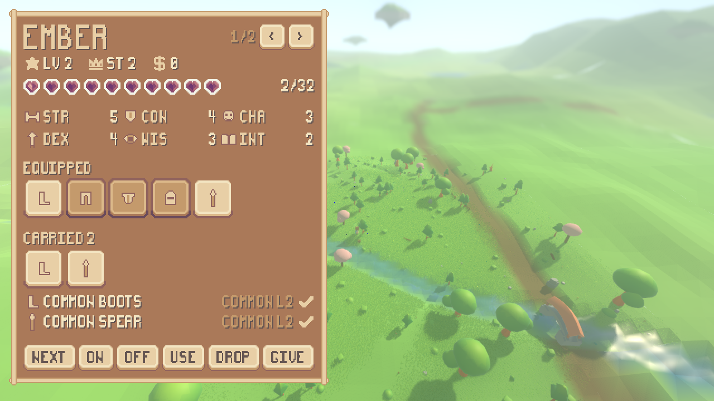

**It is a view and it holds nothing.** The panel keeps a reference to the
`Character` the simulation is holding and reads every number off it on every
frame. There is no cached level, no copy of the scores, no snapshot of the
inventory and no signal to keep in step — a blow landed on a tick is on the
panel on the next frame because the panel is looking at the object the blow was
struck against. `tests/test_ui_panel.gd` writes on the character after the panel
is built and reads the panel back, and separately asserts the panel has no field
of its own called `level`, `health`, `scores`, `money`, `inventory` or
`equipment`.

**The whole interface is render-side**, in `render/ui/`, and
`./run_tests.sh --layers-only` now runs a fourth rule over it:

```
layer check:     OK -- res://sim references nothing in the render layer
combat check:    OK -- res://render draws the fight and holds none of it
interface check: OK -- res://render/ui names its art through sprout_pack.gd alone
asset check:     OK -- res://sim names asset tags and no asset
```

The first rule grew the vocabulary of an interface — `Control`, `CanvasLayer`,
`Theme`, `Font`, `Label`, `Button`, and the rest — so a simulation file that
started naming what a character *looks* like fails the same way one naming a
model does. The fourth is about the interface itself: the pack is named in
`render/ui/sprout_pack.gd` and in no other file, and nothing anywhere reaches
for the engine's own theme or typeface, which is the silent way a pixel
interface ends up half grey.

**Whole pixels, measured rather than asserted.** The world is 3D low-poly and
the panel is 16-pixel art; that pairing holds only while one pixel of the art is
a whole number of pixels on screen. So the interface is laid out in the art's
own pixels and multiplied by an integer taken from the window height, the
project draws 2D with a nearest-neighbour filter
(`textures/canvas_textures/default_texture_filter`), the pack's font is loaded
with antialiasing and hinting *off* and its oversampling pinned to 1, and every
font size is a multiple of the font's own 14-pixel cell. `tools/measure_ui.sh`
then renders a real frame and asks it two questions:

```
$ xvfb-run -a ./tools/measure_ui.sh
panel          at 16,16 size 520x604, interface scale 2
distinct       16 colours over 274912 pixels
off-palette    0 of 274912 = 0.0000%
off-grid       0 of 25634 = 0.0000%
```

*Off-palette* is the share of pixels whose colour is in neither the pack's own
files nor this project's three — antialiasing of any kind invents in-between
colours, and this finds them. *Off-grid* is the share of colour changes along
rows and columns that do not fall on a multiple of the interface scale. Both are
zero, which is what "integer scale with nearest-neighbour filtering" means when
it is true. [reports/ui.md](reports/ui.md) is the write-up, with every icon in
the panel accounted for one by one.

## Asset tags

Nothing in world generation knows what anything looks like. The layers that
decide *what goes where* name a **tag** — `fir`, `boulder`, `bridge_wood`,
`lantern_post` — and the render layer keeps the one table that turns a tag into
a model. That table is `render/asset_library.gd`, and it is the only file in the
project allowed to name a scene, a file path or an asset pack.

The point of the indirection is the swap, and the swap has happened. Eight free
**KayKit** packs are installed under `assets/` beside the JustCreate and Mistage
ones, and fifty-four of the fifty-eight rows name a model out of one of them.
The four that do not -- `petal_drift`, `blossom_tree`, `hanging_root` and
`glowing_orb` -- keep the placeholder primitives every row still carries
underneath, so a checkout without the packs draws the old coloured world rather
than an empty one. Installing them cost one
row per tag and nothing else. That is only true if generation never learned a
path in the first place, so it is enforced rather than intended:
`./run_tests.sh --layers-only` fails if any file under `sim/` names a scene, a
file extension, a resource loader or a pack by name.


### The catalog

`sim/asset_tags.gd` holds the vocabulary — strings and nothing else, in eight
categories. Fifty-eight tags:

| Category | Tags |
| --- | --- |
| `flora` | `grass` `flower` `fern` `bush` `hardy_shrub` `reed` `cattail` `lily_pad` `mushroom` `toadstool` `petal_drift` `fir` `canopy_tree` `blossom_tree` `dead_tree` `fallen_log` |
| `rocks` | `pebble` `gravel` `boulder` `rock_spire` `stone_henge` |
| `props` | `fence` `cart` `signpost` `barrel` `crate` `market_stall` `water_wheel` `crafting_bench` |
| `buildings` | `house` `cottage` `tavern` `workshop` `tower` `well` |
| `bridges` | `bridge_wood` `bridge_stone` `rope_ladder` |
| `lanterns` | `lantern_post` `hanging_lantern` `campfire` `glowing_orb` `window_glow` |
| `characters` | `barbarian` `knight` `mage` `ranger` `rogue` `hooded_rogue` |
| `creatures` | `minion_toadstool` `minion_cat` `minion_ent` `minion_frog` `skeleton_warrior` `skeleton_rogue` `skeleton_mage` `skeleton_minion` |

The last two categories are people rather than scenery, and they are tags on
exactly the same terms: a `knight` is a row in the table like a `well` is, and
nothing under `sim/` knows it is a rigged model or which animation it is playing.
They are not scattered by generation — the world places one character, the
observer — and `render/character_view.gd` is what draws one. See
[`reports/characters.md`](reports/characters.md).

The biome catalog names tags from it — a meadow may grow a `fir` and a
`flower`, a highland a `boulder` and a `stone_henge` — and the settlement, path
and scatter layers name the rest, and `grass` is named by the instanced grass
layer, which bakes its row down to one mesh and draws thousands of copies of it.
A tag that is not in the catalog is not a tag: the suite fails if the simulation ever names one, and fails if the table
ever leaves one without a visual.

To see what everything currently resolves to:

```
./run_assets.sh          # one line per tag; exits 1 if any tag has no visual
./run_asset_sheet.sh     # the same thing, drawn (needs a display)
./run_item_sheet.sh      # generated items across every rarity tier, drawn (needs a display)
```

### The palette is still the simulation's

A placeholder part either keeps its own colour — a trunk is brown everywhere —
or carries a **tint role** (`tree`, `rock`, `ground`, `water`), in which case its
colour comes from the blended biome profile where the thing stands. So the same
`fir` is bright green in the meadow and deep green under canopy, and the table
knows neither colour. The palette lives in `sim/biome_catalog.gd`, exactly as it
does for the ground.

### Dropping in the real asset packs

When a pack is available, this is the whole procedure. Nothing under `sim/`
changes, and neither does the world.

1. **Put the pack in the project.** `assets/` is the expected home
   (`AssetLibrary.PACK_ROOT`), one directory per pack —
   `assets/kaykit_forest_nature/`, `assets/mistage_village/`. Let the engine
   import it once (`godot --headless --path . --import`). For the KayKit packs
   `./tools/fetch_kaykit.sh` does all of this.
2. **Find the row.** Every tag has one line in the table in
   `render/asset_library.gd`, of the form
   `_row(rows, AssetTags.FIR, "", [ ...placeholder parts... ])`.
3. **Fill in the scene path** — the path string is the only thing that changes:
   `_row(rows, AssetTags.FIR, "res://assets/kaykit_forest_nature/.../Tree_4_A_Color1.gltf", [ ... ])`.
   Leave the placeholder parts where they are; they cost nothing and are what a
   checkout without the pack still draws if the path ever fails to load.
   For anything the scatter layer sizes — trees, rocks, most flora — also say
   how tall the model stands, by setting `scene_height` on the row: generation
   asks for a fir seven units tall and the shell needs to know what one of these
   firs is before it can scale it. A row that does not say is drawn at the
   model's own size. `./tools/measure_models.sh` prints that number for every
   installed model rather than leaving it to be guessed, and
   `./tools/inventory_pack.sh <dir>` prints it alongside the triangle count, the
   y of the model's lowest point and the x,z of its box centre — the numbers
   that decide *which* model rather than only how to scale it. A model whose box
   sits off its own origin (a house with a wing, a lamp post with an arm) wants
   that offset written into its wrapper scene, or it stands off its plot.
4. **Say which biome colour it follows**, if it is something that grows or is
   made of stone: two more optional arguments on the row, a tint role and a mix,
   as in `..., 5.274, AssetVisual.TINT_TREE, 0.75)`. The render layer then shifts
   the model towards the blended biome colour where it stands, so the same fir is
   deep green under canopy and bright green in a meadow. Mirror whatever role the
   row's placeholder parts already carry; leave both off for wood, plaster and
   cloth, which are the same in every biome.
   [reports/model-tint.md](reports/model-tint.md) is the write-up.
5. **Repeat per tag.** A pack usually covers a category at a time; there is no
   ordering constraint and no partial state to manage — an un-repointed tag goes
   on resolving to its placeholder.
6. **Check it.** `./run_assets.sh` shows each repointed tag now reading
   `scene res://...`; `./run_asset_sheet.sh` draws them; `./run_tests.sh` must
   still pass, including the headless-loads-no-visual-asset check.

### Where the art comes from

Eight CC0 packs by Kay Lousberg — forest nature, medieval hexagon, medieval
builder, dungeon remastered, adventurers, halloween bits, city builder bits and
resource bits. 982 glTF models, 111 MB. Every pack's licence, source URL and
model count is in [reports/asset-packs.md](reports/asset-packs.md), along with
the row-by-row mapping.

**The pack binaries are not in git.** `.gitignore` excludes `/assets/kaykit_*/`.
They are 111 MB, and they are reproducible exactly by a committed script that
needs no itch.io account and no sign-in — so a fresh clone runs:

```
./tools/fetch_kaykit.sh     # ~111 MB from itch.io, a few minutes
./run_render.sh             # imports on first run, then draws
```

Skipping the fetch is a supported state, not a broken one: every row falls back
to its primitives.

What *is* committed is the part nobody else can reproduce — the table, the
eighteen per-tag wrapper scenes under `assets/tag_scenes/`, and the two tools:

```
./tools/fetch_kaykit.sh        # download and install the free packs
./tools/extract_justcreate.sh  # unpack the paid village pack the user provided
./tools/extract_mistage.sh     # ...and the two paid Mistage packs
./tools/extract_armoury.sh     # ...and the three paid Mistage armoury packs
./tools/bake_mistage.sh        # merge, scale and budget the Mistage models used
./tools/fbx_texture_map.py     # what an FBX asks for, read out of the binary
./tools/measure_models.sh      # print the size of each installed model, as drawn
./tools/inventory_pack.sh      # ...and its triangles, floor, box centre and texture
./tools/model_sheet.sh         # lay candidate models side by side, to choose by eye
./tools/measure_village.sh     # what a village is made of, and what it costs
```

A row points either straight at a pack model, for the tags the scatter layer
sizes (all flora and rocks, plus `barrel` — the row says `scene_height` and the
shell divides), or at a wrapper scene in `assets/tag_scenes/`, for the
placements the shell does *not* scale (buildings, bridges, lanterns, most
props). A wrapper is six lines: instance the model, apply one transform that
puts it exactly where the placeholder stood, so the village layout it was laid
out around still fits.

One paid pack the user bought and dropped into `assets/` — *JustCreate Fantasy
Village*, 224 FBX models, 12 MB — now carries the village. Twenty tags resolve to
it: every building, most props, both lanterns, the campfire, and `flower`,
`mushroom`, `toadstool`, `cattail` and `fallen_log`.
[reports/justcreate-village.md](reports/justcreate-village.md) is the write-up,
with the triangle count, the measured size and one sentence of reasoning for
every one of the twenty, and the list of what it does not cover.

It goes in with a script rather than by hand, and the reason is worth knowing:
every FBX in that pack names its texture by an absolute Windows path, so Godot
falls back to the file's basename *next to the model* — and the pack ships its
one atlas at the archive root instead. So the extractor copies the atlas into
each model directory, which is the entire fix. No material path is edited.

```
./tools/extract_justcreate.sh                          # unpack, atlas beside each model
./tools/inventory_pack.sh assets/justcreate_village \
    --require-textures --except Landscape/Water.fbx    # prove the textures bound
```

The archives themselves stay exactly where the user put them and are ignored by
git, as is `assets/justcreate_village/` and the `:Zone.Identifier` marks WSL
writes beside a downloaded file. They are paid art, they are not fetchable by any
script, and the extracted copy is reproducible from the archive beside it.

Two more paid packs the user bought — Daniel Mistage's *STYLIZED Fantasy
Village* (808 models) and *STYLIZED Fantasy Market* (548) — now carry the
village's hero geometry: `house`, `tavern`, `workshop`, `market_stall`, and the
`window_glow` tag's first real model. They are timber-framed townhouses with
teal shingle roofs and windows the pack lights itself, which is what the design's
amber-on-blue night beat wanted a subject for.
[reports/mistage-packs.md](reports/mistage-packs.md) is the write-up.

They arrive with three defects and each is fixed once, by a step rather than by
hand. **Textures**: the FBX name absolute Windows paths, and Godot's basename
fallback searches parent directories, so putting the five shipped atlases at the
pack root under the names the models ask for binds all 1356 of them.
**Scale**: both packs are at true metres — a 2.204 door, a 0.956 barrel — and
this world is a toy diorama, so each baked model carries one factor, which for a
building is the largest that still fits the plot the simulation reserves.
**Mesh nodes**: a building arrives as 149 to 302 separate `MeshInstance3D`
nodes, and the bake merges every surface into one per material, so the streamer
instantiates one node with two surfaces and *fewer* draw calls than before.

```
./tools/extract_mistage.sh                             # unpack, five atlas names mapped
./tools/fbx_texture_map.py assets/mistage_village      # what the binaries ask for
./tools/inventory_pack.sh assets/mistage_village --require-textures --every-material \
    --except-material SFV_GLOW_ --except-material SFV_TRANSPARENT \
    --except-material SFV_DOUBLE_SIDED_MATERIAL        # prove every material bound
./tools/bake_mistage.sh                                # merge, scale, budget
```

`cottage` deliberately stays on the JustCreate model, and the reason is three
numbers rather than a preference: cottages are 7.7 of a village's 12.6 buildings
so the Mistage one would cost a village 116 312 triangles against 55 381, no
Mistage shell fits a cottage plot without coming down to 2.62 m against 3.53,
and at that height its eaves leave the lit-window fit no flat wall.

Three more paid packs the user bought — Daniel Mistage's *STYLIZED Battle Pack*
(672 models), *STYLIZED Forge & Armory* (435) and *STYLIZED The Alchemist's
Workshop* (823) — are unpacked, imported and catalogued, and the gear rows now
draw from them. They are the armoury: 293 of their 1 930 models are weapons,
shields, arrows, potions and bags. All 1 930 import in Godot's built-in ufbx
importer with no external converter and no failures, in 12.7 s, 9.0 s and 13.7 s
respectively, for 155 MB of import cache; the only fix needed is the same
basename-atlas copy the village and market packs wanted, nine files this time.
[reports/armoury-packs.md](reports/armoury-packs.md) is the write-up, and it
carries the one thing the next item spends: a 43-row table from every gear shape
the game needs to a candidate model, covering the twelve `gear_*` tags, the
shapes the three packs add, and the 25 weapon and armour models that were sitting
unnamed in the adventurer pack all along — including `arrow_bow.gltf` and
`arrow_crossbow.gltf`, the two projectile models.

Nine of the thirteen `gear_*` names are now drawn by a pack model, against five
of twelve before: `gear_spear` takes the market pack's straight-pointed spear
(the forge pack's eighteen "spears" are all ornate glaives), `gear_flail` a
morningstar out of the battle pack, `gear_bundle` a tied sack out of the village
pack, and a thirteenth name, `gear_dagger`, was added because a dagger is a
catalogue weapon in its own right and was being drawn as the 1.775-unit
two-handed sword. **Four stay on their primitives, and they are a real gap:** no
pack on this machine ships worn armour as a separate model at all, so
`gear_boots`, `gear_leggings`, `gear_chestplate` and `gear_helmet` keep shapes
that are at least the right thing. The nearest misses are measured in
[reports/gear-models.md](reports/gear-models.md), which also lists five weapon
silhouettes the packs have and the simulation cannot yet be — an axe, a
two-handed sword, a crossbow, a wand and a spellbook, each of which needs an
attack pattern in the combat catalogue before a tag would mean anything.

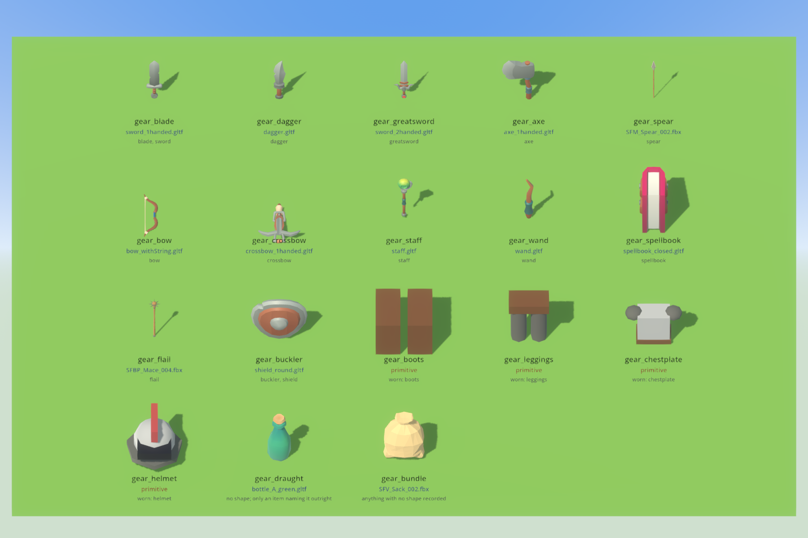

```
./tools/extract_armoury.sh                             # unpack, nine atlas names mapped
./tools/fbx_texture_map.py assets/mistage_battle \
    assets/mistage_forge assets/mistage_alchemy        # what the binaries ask for
./tools/inventory_pack.sh assets/mistage_forge         # tris, size, floor, texture
xvfb-run -a ./run_item_sheet.sh --gear                 # the picture above
```

The forest is still KayKit's, deliberately. The village pack has trees, rocks and
grass, and the dedicated forest pack's do the same job for a fraction of the
triangles at the sizes those are scattered at — 42 against 82 for a grass tuft,
108 against 1378 for a bush. The table above the flora rows in
`render/asset_library.gd` says so row by row.

Three tags no installed pack covers — `petal_drift`, `blossom_tree` and
`hanging_root` — keep their placeholders. `glowing_orb` keeps its too, as an
emissive shape rather than a model. `window_glow` no longer does: the Mistage
village pack draws its lit windows as their own material, and one model in it is
nothing but that material, so the tag now resolves to the pack's own leaded pane
with this project's amber emission applied to it.

The interface is not models at all, and its pack is the one with the strictest
licence in the project. **Sprout Lands – UI Pack (Basic)** by *Cup Nooble* is
2D pixel art on a 16-pixel cell with a bundled pixel font on an 8x14 cell:
nine-sliceable frames, buttons, inventory slots, hearts, a generic icon sheet
and cursors. It is what the character sheet is drawn from, and its `read_me.txt`
says, in as many words:

> - You can modify the assets.
> - You can not redistribute or resale, even if modified.
> - You can only use these assets in non-commercial projects.

Four consequences, all of them acted on rather than noted:

* **Non-commercial only.** A commercial release of this game could not ship this
  pack. It would need the paid *Premium* version, bought from the author.
* **No redistribution, even when modified.** Neither the zip nor the unpacked
  copy nor anything derived from a file in it is committed here, and none of it
  is ever attached to a report as a downloadable asset. `.gitignore` excludes
  `/assets/*.zip` and `/assets/sprout_lands_ui/`. A *screenshot of the running
  game* showing the interface in use is not redistribution, and there is one in
  [reports/ui.md](reports/ui.md).
* **Not fetchable by any script.** There is deliberately no
  `tools/fetch_sprout_lands.sh` beside `tools/fetch_kaykit.sh`; the pack is the
  user's own download from
  [cupnooble.itch.io](https://cupnooble.itch.io/sprout-lands-ui-pack), and
  `tools/extract_sprout_lands.sh` only unpacks the zip they put in `assets/`.
* **The icons the pack does not have are this project's own.** Six ability
  scores and five equipment slots have no equivalent on the pack's generic icon
  sheet, so they are drawn on the same 16-pixel cell in the pack's own three
  colours, as sixteen rows of source in `render/ui/pixel_icons.gd` rather than
  as a binary. They are not derived from any pack file, so nothing about them
  touches the redistribution line. [reports/ui.md](reports/ui.md) accounts for
  every icon in the panel, one by one.

```
./tools/extract_sprout_lands.sh   # unpack, six flat aliases at the pack root
./run_render.sh --sheet --scenario encounter   # draw the character sheet over the world
xvfb-run -a ./tools/measure_ui.sh              # ...and measure whether it is crisp
```

`assets/example_well.tscn` is a hand-made scene sitting exactly where an
installed model would, so the scene half of the table is a path that really
loads rather than a promise. Nothing points at it by default; the suite points
the `well` tag at it, builds it and puts the table back.

`tools/repoint_tag_demo.sh` does that on disk and shows what it costs. It edits
the one row for `well`, then compares before and after:

```
=== before ===
  well resolves to placeholder cylinder:rock+box+box+prism h=2.95
  sim/ sources     6a7542f4a0f4e64dd7a66ab982fd6ae002fd3f40...
  world            1cc1b83210c28a5a
=== after ===
  well resolves to scene res://assets/example_well.tscn
  sim/ sources     6a7542f4a0f4e64dd7a66ab982fd6ae002fd3f40...
  world            1cc1b83210c28a5a

OK    'well' now resolves to a different visual
OK    every file under sim/ is unchanged
OK    the headless world fingerprint is unchanged
OK    the whole edit is 1 line(s) in render/asset_library.gd
```

### Headless loads none of it

A headless run never loads a scene, a texture or one script of the render layer,
and `--assets` says so from the outside — it walks the project for every file
that only exists to be looked at, and asks the engine's own resource cache which
of them the process has loaded:

```
$ ./run_headless.sh --seed 1234 --ticks 100 --assets
...
assets visual-files found=3390 loaded=0
assets render-scripts found=19 loaded=0
assets sim-scripts found=77 loaded=71 -> res://sim/water_sheet_builder.gd,...
```

The third line is the control: without it, two zeros would be indistinguishable
from a probe that never worked. The test suite runs exactly this as a
subprocess and fails on any of the four claims.

"Only exists to be looked at" now includes type: `.ttf`, `.otf`, `.woff`,
`.woff2` and `.fnt` are counted with the models and the textures, so "a headless
run loads no font" is a claim this report answers rather than one it is silent
about.

## Requirements

Godot 4.7 or newer, at `tools/godot/godot4`, or anywhere else if you point the
`GODOT` environment variable at it. The binary is 140 MB and is deliberately not
committed. The run scripts point the engine's `HOME` at `tools/godot-home` so
its cache and settings stay inside the project; the first run imports the
project, which takes a few seconds, and later runs do not.

## Running it

**Headless — no rendering at all:**

```
./run_headless.sh                        # 100 ticks, seed 1234
./run_headless.sh --seed 7 --ticks 500
./run_headless.sh --chunks               # ...and list every loaded chunk
./run_headless.sh --biomes               # ...and the biome map on a fixed lattice
./run_headless.sh --water                # ...and the water map on its own lattice
./run_headless.sh --islands              # ...and every island in a square of the world
./run_headless.sh --settlements          # ...and every village, road and bridge in one
./run_headless.sh --scatter              # ...and everything grown or stood on the ground
./run_headless.sh --enemies              # ...and every enemy the field places, ring by ring
./run_headless.sh --scenario market      # ...with a named cast set out and lived forward
./run_headless.sh --scenario market --frozen   # ...or photographed at a stated tick
./run_headless.sh --board                # ...and the tactical lattice, cell by cell
./run_headless.sh --snap                 # ...and where in the world a fight can be held
./run_headless.sh --board-sweep          # ...and what each candidate cell size costs
./run_headless.sh --assets               # ...and what visual material the run loaded
```

**Headless — one whole fight, from real time and back to it:**

```
./run_encounter.sh                       # 60 ticks, seed 1234
./run_encounter.sh --ticks 200
./run_encounter.sh --island              # the same cycle on a floating island's top
```

One line per tick in one shape whether or not a fight is on, with whatever the
fight wrote that tick indented beneath it:

```
tick 15 real-time chunks=34 islands=11 props=424 begun=0 ended=0 standing=8 ...
tick 16 fighting  chunks=34 islands=11 props=424 begun=1 ended=0 standing=8 ...
    snap-in around #1 at (-484.400, -2.816, 420.000) radius=24.0 span=30.0 storey=0 joined=6
    snap-in #1 (-484.400, 420.000) -> cell (-162,139) centre (-484.500, 418.500) moved 1.503 rings=1
...
tick 21 real-time chunks=34 islands=11 props=424 begun=1 ended=1 standing=5 ...
    over turns=5 rounds=3 ending=decided survivors=3 fallen=3
    snap-out #1 cell (-161,138) -> (-481.500, -2.404, 415.500) back to cell (-161,138) hp=18/32
```

`rings=` on a snap-in line is how far the search had to go from the cell the
combatant was standing over: 0 whenever that cell would take it, and anything
above 0 says the cell was water, or built on, or already spoken for. The
`snap-out` line prints the cell, the world position it became, and the cell that
position snaps back to — the round trip, in the record rather than asserted.
Nothing in that command chooses anything: the positions and headings are
constants in `sim/scripted_encounter.gd` and every move is
`sim/combat_policy.gd`'s. Two processes print the same bytes.

It prints one line per traced tick and exits 0. Each line carries a short digest
of the whole world, which is what makes runs comparable:

```
seed 1234
tick 0 chunks=32 islands=9 villages=1 roads=3 props=390 biome=deep_forest water=1404 on_island=0 on_path=0.00 ...
tick 10 chunks=33 islands=9 villages=1 roads=4 props=414 biome=deep_forest water=1404 on_island=0 on_path=0.00 ...
...
done ticks=20 chunks=38 built=38 final=b570092df8466dea
```

`chunks=` is how much ground is built right now, `built=` how much has been
built in total including reloads, `islands=` how many floating islands are built,
`villages=` and `roads=` how many villages and stretches of road are loaded,
`props=` how many scattered things are standing on the loaded ground,
`biome=` is the biome the observer is standing in, `water=` is how many cells of
the water sheet around it are wet, `on_island=` is whether the observer is
standing on an island rather than on the ground, and `on_path=` is how much of a
road it is standing on. With
`--chunks`, the run then prints one line per loaded chunk — its coordinate and a
fingerprint of its geometry — which is what lets two separate runs be compared
chunk by chunk. With `--biomes` it prints the biome, its share and the
fingerprint of the blended profile at each point of a fixed lattice around the
origin; with `--water` it prints, on its own fixed lattice, whether each point is
water, whether it is a bank, how deep it is and how high the ground is. Both are
what let two runs be compared position by position rather than only world by
world. `--islands` and `--settlements` do the same job for the two sparse
layers: each prints, in cell order over a fixed square of the world, one line per
island, or one line per village with its roads and bridges — so those can be
compared one at a time as well. `--scatter` does it for the dressing: one line
per thing standing in a fixed nine-by-nine square of chunks, with what it is,
where it stands and how big it came out, and then a survey of a hundred and
sixty-nine chunks spread over about eleven hundred units, biome by biome — which
is where the densities and size distributions in the write-up come from.

**With rendering — the same simulation, in a window:**

```
./run_render.sh                          # seed 1234
./run_render.sh --seed 7
./run_render.sh --sheet --scenario encounter    # ...with the character sheet on screen
./run_render.sh --play                          # drive one of the characters yourself
./run_render.sh --play --journal                # ...and print what everybody chose
```

Needs a display. Escape quits, Space pauses, R restarts on the next seed along.

`--play` hands the character the camera is following over to you. From then on
it is yours: **WASD** or the arrow keys walk it a step, **G** sends it to the
nearest place the world has a name for, **J** hops and **K** leaps further than
an ordinary DEX reaches, so the engine refuses it and says why on screen. Every
one of those is an action out of the same catalogue every other character
chooses from -- a key press puts an `Action` in a holder, and the world's own
control loop picks it up on its next tick. On every tick you have not chosen
anything your character waits in the world while everybody else carries on,
which is the same "no answer yet" a character driven by a language model gets.
Nothing else about the character changes: same sheet, same roster, same loop,
same engine, which is section 1's no-preferential-treatment principle being one
replaced `Callable` rather than a promise.

`--journal` prints the control loop's own account of who chose what on which
tick. `--input "20:w,60:g"` presses the keys for you at the ticks it names,
through the engine's own input queue, which is how the shell is driven on a
machine with no keyboard at it:

```
xvfb-run -a ./run_render.sh --seed 1234 --play --journal --sheet \
        --input "2:w,24:g,46:j,52:k" \
        --screenshot "$PWD/reports/assets/player-input-refusal.png" \
        --screenshot-tick 62
```

which walks a step, goes to the nearest landmark, hops, and then leaps too far:

```
render-shell play t=2  chose go_to(target=(0.000, -3.600))
render-shell play t=23 go_to(target=(0.000, -3.600)) -> go_to ok at=(0.000, -3.600) walked=3.6 steps=4
render-shell play t=24 place landmark l0,0 at 57.4 away
render-shell play t=45 go_to(target=(38.136, 39.269)) -> go_to ok at=(38.136, 39.269) walked=57.377 steps=64
render-shell play t=51 jump(target=(38.136, 36.269)) -> jump ok at=(38.136, 36.269) gap=3.0 reach=3.75 dex=3
render-shell play t=57 jump(target=(38.136, 24.269)) -> jump refused: 12.00 is further than DEX 3 jumps (3.75)
```

That last sentence is the engine's, and it is what the panel on screen says --
the interface quotes the refusal rather than writing one of its own.

**The rest of the verbs.** Movement needs no target, because a position is one.
The other nine of section 2.1's twelve actions are aimed at something, so there
is an aim list and it is not the interface's: **Tab** walks along what your
character can actually make out, which is `Observation` -- the same packet a
language-model mind is handed -- and nothing else is in it. **F** picks up and
puts down what is in your hands (or nothing, which is a real choice), **C**
picks one of the things you can see inside whatever you have aimed at, **B**
picks something to say and **-** / **=** dial the coins in your next offer.
Then, all of it at what you have aimed at: **P** go to it, **E** examine it,
**L** look at what you are holding, **Q** take, **X** drop, **V** put in,
**T** say, **Y** shout, **O** offer a trade, **U** accept, **I** deny,
**H** interact with what you are holding, **N** attack with it, **M** wait. The
shell prints the whole list at boot.

There is nothing to do most of that *to* in the ordinary world -- three
wanderers on an empty meadow -- so `--scenario play` sets out the smallest world
that holds one of each:

```
./run_render.sh --scenario play --play          # a trader, a brawler, a pile, a locked chest
./tools/play_actions.sh                         # ...every verb performed from a key press, headless
```

[reports/player-actions.md](reports/player-actions.md) has the whole table --
every verb performed, with the engine's own words for what it refused -- and the
frames it was photographed from.

**The wardrobe.** Section 2.1's twelve are what a character does to the *world*.
Three more are what it does to its own kit, and without them what a character
wears could only be set out when the world was built: **1** puts on what you are
holding, **2** takes it off, **3** uses it up. They are rows of the same table as
the other twelve, with the same one constructor and one resolver, so an NPC
reaches them by the path a person does. Putting boots on is a way of moving your
character did not have a moment ago (section 3.4), and taking a sword out of your
hand takes its attacks with it.

`--sheet` puts the character-sheet panel over the world, and **Z** opens and
shuts it while you play. The sheet is where the wardrobe is operated from: the
row it marks is what is in your hands, and the buttons along its bottom press the
same keys. The two buttons at the top page through whichever characters the
scenario put in the world.

```
./run_render.sh --scenario play --play           # Z opens the sheet
./tools/play_inventory.sh                        # ...the whole wardrobe, headless
```

[reports/player-inventory.md](reports/player-inventory.md) has the frames, the
before-and-after of what the gear changed, and the three attempts the rules
turned down.

**The fight.** The tactical layer was built before anyone could reach it: a fight
snapped onto the ground and every turn in it was played by `sim/combat_policy.gd`
because there was nothing else to play them with. `--scenario battle` puts you in
one — the encounter scenario with the camera looking through one of the two
commanders, so there is somebody to hand over — and the board then **waits** for
you:

```
./run_render.sh --scenario battle --play --readout --board   # play a fight
./tools/play_combat.sh                                       # ...a whole one, headless
```

On your turn `[` picks the next cell you may step onto and `]` steps onto it;
`;` picks one of your minions, `'` picks where it goes and `\` sends it;
`4` `5` `6` `7` use the first to fourth weapon action; `8` and `9` turn you a
quarter left or right, which is free; `0` ends your turn and passes the board on.
That is section 3.6's turn economy exactly — a move, one weapon action, one
minion, and as much turning as you like — and it is written once, in
`sim/combat_match.gd`, as three flags and the refusals they produce. The
interface does not restate it: `sim/board_turn.gd` asks, and every answer is
`LegalMoves`', the commander's or the match's. Where you may step is painted
green over the lattice, what your weapons cover from where you stand is painted
rose, where the picked minion may go is blue, and what you have picked is a
bright plate — four lists of cells the simulation handed over, coloured.

A choice the board does not offer comes back in the match's own words
(`refused: (-155,146) is not reachable`), and an action still on its cooldown is
drawn with the pack's prohibition sign and the number of turns left rather than
quietly doing nothing. Turning is free and moves the pattern, which is a pair of
frames six ticks apart.

[reports/player-combat.md](reports/player-combat.md) has the frames, the whole
fight as a trace, and the two things it changed underneath: a fight waits for a
person and only for a person (`ActionScene.hands`), and a transcript written
across ticks needed one seam to reach the world's
(`Encounter.unreported()`).

`--start X Z` and `--paused` work here too: the first aims the camera at a place,
the second holds the world still so a capture can wait for the renderer to settle
without the observer walking away underneath it.
The camera follows the observer, and chunks appear and disappear around it as it
walks. To capture the view to a file instead of watching it — which is how the
image above was made, on a machine with no screen:

```
xvfb-run -a ./run_render.sh --seed 1234 \
	--screenshot "$PWD/reports/assets/terrain-slice.png" --screenshot-frame 150
```

`--screenshot-frame` waits for a frame, which depends on how fast the machine
drew it; `--screenshot-tick` waits for the world to reach a tick instead, so the
same command always captures the same moment. `--screenshot-ticks
"4:one.png,32:two.png"` names several moments of *one* run and photographs each
of them, which is how a story is shown without a reader having to be told that
six pictures came from the same run. The two biome images above were
made that way — the same seed and walk, from either side of one border:

```
xvfb-run -a ./run_render.sh --seed 13 \
	--screenshot "$PWD/reports/assets/biome-border-meadow.png" --screenshot-tick 25
xvfb-run -a ./run_render.sh --seed 13 \
	--screenshot "$PWD/reports/assets/biome-border.png" --screenshot-tick 70
```

`--paused` holds the world still, which is how the village images above were
taken — the observer is put down beside the village and never walks off:

```
xvfb-run -a ./run_render.sh --seed 1234 --start -126 56 --paused \
	--screenshot "$PWD/reports/assets/village-path-bridge.png" --screenshot-frame 120
xvfb-run -a ./run_render.sh --seed 1234 --start -100 34 --paused \
	--screenshot "$PWD/reports/assets/village-green.png" --screenshot-frame 120
```

`--board` draws the tactical lattice over the ground the observer is standing on
— pale squares for ground a piece may stand on, a paler cool tint one storey up,
amber for a cliff edge, dull red for something built on, and a dark plate at the
board's own height for a hole. It reads the board out of the simulation and draws
it; the world's fingerprint is the same with it and without it, which the stop
line shows by carrying `board=441/139` against `board=0/0` beside an unchanged
digest. The three board images above were taken with it:

```
xvfb-run -a ./run_render.sh --seed 29 --start 196 182 --paused --board \
	--camera 0 30 38 --aim 3 \
	--screenshot "$PWD/reports/assets/combat-board-shore.png" --screenshot-frame 120
xvfb-run -a ./run_render.sh --seed 1234 --start -379.5 331.5 --paused --board \
	--camera 0 26 34 --aim 2 \
	--screenshot "$PWD/reports/assets/combat-board-island.png" --screenshot-frame 120
```

An ordinary run reports the world *and the people living in it*: a `cast` header
naming everybody and which of them the world is looking through, then everything
the control loop asked and everything the engine answered, at the tick it
happened on, and -- indented under it -- everything the fights in the world wrote
down.

```
cast 4 following #1
  Pip     #1 commander band=1 at (0.000, 22.792, 0.000) hp=26/26 walking  <- followed
  Scholar(-1,-1) #4 commander band=-1 at (-23.279, 34.340, -35.501) hp=26/26 walking
  ...
  t=  1  Pip    began go_to(target=(17.566, 3.927)), 20 ticks
  t= 21  Pip    finished go_to(target=(17.566, 3.927)) -> go_to ok at=(17.566, 3.927) walked=18.0 steps=20
```

The fourth of them is an enemy. Nobody mustered it: `sim/enemy_field.gd` places
one at most per 64-unit cell as a function of the cell and the seed,
`sim/enemy_streamer.gd` stands up the ones near you and drops the ones you have
walked away from -- at most nine at once -- and `sim/enemy_mind.gd` decides for
it through the same `Character.decide` seam the rest of the cast uses. A blow
struck when no fight is on now begins one, so a fight can start because somebody
chose to start it. See [reports/enemies.md](reports/enemies.md) for the level
table, the bound, what the layer costs a tick, and a trace of a fight that began
that way.

`--scenario encounter` sets a whole fight out in the world before the first
frame, and `--scenario encounter-island` puts the same cycle on a floating
island's top. `--scenario play` sets out the stage a person can reach
every atomic action from -- a trader, a brawler, a pile and a locked chest -- and
is what `--play` is meant to be pointed at (see
[reports/player-actions.md](reports/player-actions.md)). `--scenario market` and
`--scenario quarrel` set the five
characters of the character walkthrough out *where the run starts* and let the
world's own control loop live them forward in front of the camera; `--frozen`
asks for the old behaviour instead -- the run is played headless to a stated tick
and the cast is stood where it left them, which is what a still of one particular
moment wants. The name goes straight to the simulation, which is what keeps every
combat class on that side of the layer line. The three images in
[reports/combat-snap.md](reports/combat-snap.md) came from one command with three
different ticks:

```
xvfb-run -a ./run_render.sh --seed 1234 --scenario encounter --board \
	--camera 0 20 15 --aim 0 --fov 42 --focus 25 \
	--screenshot "$PWD/reports/assets/snap-during.png" --screenshot-tick 19
```

`--no-distant-ground` draws only the ground the simulation streams — the
forty-unit disc of chunks and nothing beyond it. `--lod-levels` washes each
coarse ring in its own colour so a capture can show where the boundaries between
them are, and `--lod-centre X Z` puts those rings somewhere other than under the
observer, which is how the same ground gets photographed at two different levels
from one place. All three change the picture and nothing about the world.

`--no-grass` draws the same world with no grass layer at all — nothing baked,
nothing instanced, no shader — `--no-atmosphere` draws it with no lighting or
atmosphere stack at all — no environment, no key light, no fog, no bloom, no
depth of field, no warm point lights and no motes — and `--no-reflection` draws it
with the water flat, no second viewport and no mirror camera. All three exist so
that the grass, atmosphere and reflection suites can run the shell each way and
show that the world's fingerprint does not depend on any of them, and
`--no-distant-ground` is there for the same reason.

`--focus` and `--fov` are the two other capture dials, beside `--camera` and
`--aim`. `--focus` says how far away the miniature depth of field is sharp,
instead of "however far the camera is from the observer", which is what a shot
whose subject is a reflection in the water in front of the observer wants.
`--fov` narrows or widens the lens, which is how a shot gets a distant subject
*and* its reflection at a readable size in one frame. Like the camera, both move
the picture and nothing about the world.

**What things cost, and moving pictures of them:**

```
./tools/measure_board.sh
xvfb-run -a ./tools/measure_lod.sh --seed 1234
xvfb-run -a ./tools/measure_grass.sh --seed 1234 --start 228 -60
xvfb-run -a ./tools/measure_atmosphere.sh --seed 1234 --start -88.8 4.7 --camera 0 26 44 --aim 4
xvfb-run -a ./tools/measure_reflection.sh --seed 1234 --start -10 -466 --camera 19 0.33 37.6
./tools/measure_shore.sh --seed 1234 --span 1100
xvfb-run -a ./tools/grass_film.sh --out /tmp/walk --frames 36 --stride 2 --warm 60 \
	--seed 1234 --start 228 -60 --camera 0 9 6 --aim 0
```

`measure_lod.sh` prices the coarse distant ground: what a tile costs to build at
each ring, how many tiles and triangles the whole view comes to, what the same
reach would have cost meshed at the near cell, how much walking rebuilds, and
then the render shell's frame time with the layer and without it. The next runs
the render shell, holds the world still, and samples frames with
the grass and again without it, so the two differ by exactly the grass; it then
rebuilds every chunk of grass from scratch and times that against meshing the
ground under it. The second does the same for the atmosphere, taking the stack
apart one piece at a time and putting it back, so each row prices one piece of
it. The third prices the water's mirror the same way, at five resolutions and
against a frame with no mirror at all. The fourth needs no display: it enumerates
every village in a square of the world and walks outwards from each until it meets
water, which is how "a stated share of villages stand on a shore" is a measurement
rather than a claim. The last saves a numbered sequence of frames, because two of
the things the grass does are motion and a screenshot cannot show motion. All of
them pass everything after their own arguments straight through to the shell.

## Seeds and determinism

The seed lives on the world (`SimWorld.world_seed`) and every random decision
descends from it through named sub-streams, so that adding a new consumer of
randomness cannot shift the numbers an existing one sees. Two runs of the same
seed produce identical output; two runs of different seeds do not. Both halves
of that are asserted by the test suite, which runs the headless command itself
as a subprocess and compares what it printed.

The ground works the other way round, and deliberately so. A stream is the wrong
tool for something sampled per position, because its numbers depend on how many
were drawn before them — so the height at a point is *hashed* from that point
and the seed instead. Nothing about the ground depends on which chunk asked, in
what order chunks were built, or in which process, which is why chunk generation
never has to be serialised for the world to be reproducible.

## Running the tests

```
./run_tests.sh                  # every suite, headless, exits 0 when all pass
./run_tests.sh --layers-only    # just the three structure checks
./run_pieces.sh                 # just the combat-piece suite
./run_resolution.sh             # just the combat-resolution suite
./run_snap.sh                   # just the real-time-to-board snap suite
./run_match.sh                  # play the scripted three-commander match
./run_encounter.sh              # play the whole real-time-fight-real-time cycle
./run_items.sh                  # the item layer's own tables: budgets, the trade, the gate
./run_drops.sh                  # what a kill leaves behind, and the frontier ahead of your gear
./tools/ground_items_probe.sh   # the gear table, the fallback count, one seeded drop, one round trip
./run_loadout.sh                # what a loadout is worth on a board: grants, defence, damage
./run_effects.sh                # the composable effect base's own tables
./run_effect_suite.sh           # just the composable-effect suite
./run_sheet.sh                  # the character sheet: two characters of one type, status, a level-up
./run_inventory.sh              # one inventory per character: equipment as a view, the ground, money
./run_actions.sh                # every atomic action, each called once, and what came of it
./run_loop.sh                   # the control loop: the cadence, the four interruptions, the bias, a slow decider
./run_loop_suite.sh             # just the control-loop suite
./run_scenario.sh               # five characters living one seeded run, end to end
./run_scenario_suite.sh         # just the character-scenario suite
./run_skirmish.sh               # a patrol of two and one stranger: the scene drives its own fight
./run_turn.sh                   # a turn lasts as long as the weapon action that spends it
./run_observation.sh            # what each of five characters can see, and how big the packet is
./run_observation_suite.sh      # just the observation suite
./run_agent.sh                  # every non-player character deciding through a model, in the same run
./run_agent_suite.sh            # just the model-agent suite
./run_lesson.sh                 # does a lesson change what is chosen? one moment, four memories
./run_memory_suite.sh           # just the memory suite
./run_goal.sh                   # does a goal change what is chosen? one moment, four goals
./run_goal_suite.sh             # just the goal suite
./run_upkeep_suite.sh           # just the suite for the path every character's memory and goals are maintained on
./run_asks.sh                   # what an ask that costs the world no time costs: a person, a program and a model at one door
./run_budget_suite.sh           # just the tool-budget suite
./run_check.sh                  # ability checks: four attempts, two rolled, two remembered
./run_check_suite.sh            # just the difficulty-class suite
./run_world.sh                  # the orchestrator: five looks at a world, five spawns rolled before they were written
./run_world_suite.sh            # just the orchestrator suite
./tools/readme_model_numbers.sh # this page's model-layer numbers, read back off the transcripts
```

Fifty suites: the random number generator; determinism; the terrain field
and mesher; chunk streaming; the coarse ground drawn past it; the biomes; the water; the floating islands; what
grows on them; the villages and roads; the flora and prop scatter; the tactical
board; the pieces that stand on it; what happens when they act; the snap between
real time and the board; the layer split; the asset tags; the characters; the
character sheet a player and an NPC share; the one inventory a character
carries and the equipment view onto it; the
items, their power budget and the ability-score gate; what a defeated character
drops and the distance gradient that keeps the frontier ahead of it; the composable effect
base every attack, projectile and spell is built out of; the atomic
actions and the one surface a person and a program both drive them through; the
control loop that gives an action a length in ticks, re-evaluates on a cadence
while it runs, and lets a character wait in the world for a decision that is not
ready; the local observation a character is given of its surroundings; the
end-to-end run of five characters through all of it; the whole non-player cast whose
decision functions are language models, five answers outstanding at once, which
the loop and the engine cannot tell from the one person among them; the two segments of memory that character carries and the
scans that say nothing can get into them it did not perceive; the structured
goals it holds several of at once and the world's own answer to which are
finished; the one path both of those stores are maintained on, which every
character passes whoever is deciding for it; the price the world puts on an ask
that costs it no time, charged to every character alike; the difficulty-class agent that judges one attempt the rules have no
answer for and never resolves it; the orchestrator that is polled over the world,
spawns characters rolls first and changes nothing except through the operations
the engine exposes; the one driver a
fight has, wherever it is held; the turn that lasts as long as the weapon action
it spends; the lit windows; the grass; the lighting and atmosphere; the water's mirror; the
anti-aliasing; and a smoke test that boots the render shell at a fixed frame rate
and checks it reaches exactly the same world a headless run of the same seed
reaches.

`--layers-only` runs three structure rules rather than two. The first two are
unchanged: nothing under `sim/` may name the render layer, and nothing under
`sim/` may name a scene, an asset file or an asset pack. The third is the other
direction, for one thing only — no file under `render/` may name a class of the
combat simulation except `CombatBoard`, which it is handed as a detached copy. It
is why the render shell asks for a *named* scenario rather than calling into the
scenario file.

The terrain suite asks the field the same questions in different orders and with
unrelated samples in between, builds one chunk before and after a pile of
others, and runs the headless command twice as a real subprocess to compare the
two runs chunk by chunk. The streaming suite walks an observer along a path and,
after every step, checks the loaded set against the rule it is meant to follow,
then compares the final set with one worked out from the path rather than read
back from the streamer — and walks away until a chunk unloads, walks back, and
checks that it returned identical. The terrain-level-of-detail suite asks whether
the coarse ground past the streamed disc is exactly complementary to it: over
240 000 positions around each of three standpoints, every position must be drawn
by exactly one thing — no hole to see the sky through, no two surfaces fighting
for the same pixels — and it is asked again after every one of two hundred steps
of a walk, while the ring boundaries move underneath. It then checks that level of
detail is only a drawing choice: 252 positions, a wide sweep plus every ring's
edge a hair either side, must give the same ground height from three standpoints
that put them under different levels; every vertex of every near-level tile must
be the world's own height at its position; two tiles of a level must meet on
identical numbers; a tile must come out the same however much was built before
it; and the apron under every seam must be at least three times deeper than the
worst the two sides of it can disagree by, measured over a three-thousand-unit
sweep. Finally it runs the shell twice as real subprocesses, with the layer and
without, and requires the same fingerprint from both and from a bare simulation
while the two shell runs differ in the one way they should.
The water suite asks the same positions from
fresh fields, from fields whose mesher has built forty chunks, from a world
thirty ticks into its walk and from two separate processes, and builds two
overlapping windows of the water sheet to check that they agree on every corner
they share, which is the seamlessness stated as arithmetic. The island suite asks the same
cells of the island lattice from a fresh field, from one that has already been
asked hundreds of unrelated questions, from cells walked in the other order with
the two storeys asked in the other order too, and from a second process; it then
checks on a dense grid the placement rule never sampled that no island's
underside reaches below the land, that every island has somewhere on its rim
within one hop of what is beneath it, that an observer put on one stays on it and
comes back down when it walks off, and that an island dropped and reloaded comes
back byte-identical. The settlement suite finds a village whose levelled ground
crosses a chunk border and meshes those two chunks in both orders on two
independent stacks, walks two worlds into the same village from opposite sides,
compares every pair of building footprints with the separating-axis test, checks
that the relief across a levelled village collapses while the land six units
outside it is untouched, that points inside a building are reserved and points on
the green are not, that a road is agreed on from both of its ends and is worn
into the land about as deep as it is meant to be, that a bridge stands wherever a
road crosses water with the river bed under it uncarved, and — over a grid of
several thousand positions — that this whole layer never creates or destroys a
drop of water. The scatter suite asks the same cells from a fresh field and from
one with hundreds of unrelated questions behind it, in the other order and with
the two lattices asked the other way round; dresses one chunk on its own and
again after the forty around it; drops a chunk by walking four hundred units away
and checks that what comes back when the observer returns is byte-identical; and
runs the headless report twice as real subprocesses to compare the two worlds
thing by thing. It then measures rather than assumes: that a deep forest's trees
really do run half again a highland's at the median and that its stone really is
smaller, that nothing at all stands inside a footprint or in a cart track, that
every piece of waterside flora stands on wet or bank ground and every road prop
beside a road, that a stone circle stands in a clearing, and that a headless
process places hundreds of things while loading no visual asset at all. The
grass suite checks the layer from both ends: that a tuft stands on the triangle
it is drawn on to within a millimetre, against an independent search over the
chunk's triangles; that none stands in water, on a cliff or inside a building,
each asked of the simulation rather than of the layer; that the share of the
lattice that grows really is the biome's own foliage density and the colour
really is its foliage tint, on synthetic flat chunks where everything else is
held still; that thinning a chunk changes the visible count and not one byte of
its instance buffer, and leaves tufts spread over the whole chunk rather than
heaped in a corner; that a chunk of grass is the same grass built again in the
other order and different grass under a different seed; that a headless process
loads no file of the render layer at all; and that the shell with grass, the
shell with `--no-grass` and a bare simulation all reach the same fingerprint,
while differing in the one way they should — thousands of tufts against none. The
combat-board suite checks the lattice from both ends: that a cell's centre is
arithmetic on its coordinate either side of the world origin, that three pairs of
overlapping boards agree on every field of every cell they share, that a board
built after twenty-four unrelated ones is the same board and a board read in a
second world of the same seed is too; then that the board's own answer about a
hole agrees with `is_passable_at` at 2 205 cell centres, that water and the void
off an island's rim and the pond in an island's basin all come back as holes,
that a shoreline cell is a cliff edge with an unbounded fall, that every cell
flagged a cliff edge really has a neighbour more than a step below it and every
step between neighbours is exactly what the walking constants say, that a board
on an island's top is read on the island while the same position asked for on the
ground stays on the ground, and that a copy handed out shares no storage with the
board it came from. The combat-piece suite stands its pieces on a board typed out
by hand — a chasm across one row, a building, a hole, ground too high to climb and
a step down, the last four placed on the four diagonals out of one cell so that a
single Cat meets all of them — and writes out every pattern as an exact cell list:
the four minions moving and capturing, the same four ringed by enemies where three
are stuck and only the Frog gets out, nothing climbing more than the board's step
whether it walks or leaps, each piece of armour added and taken off again, the
full loadout's twenty-one cells, every weapon in the catalogue, an attack turned
through four facings, a cooldown asked about a turn early and a turn late, and a
commander's death taking its three minions and leaving the other side's two. Every
one of those is paired with a run in which the rule's own premise is broken and
the same list is required to stop holding; and `./tools/piece_mutations.sh` goes
further by editing `sim/` instead — seventeen rules broken one at a time, each of
which must make the suite fail.

The combat-resolution suite covers what happens when a piece does what it may:
the turn economy played out with two, three and five commanders; a second move, a
second weapon action and a second minion each refused with the board checked to
be untouched; minion-against-minion capture across a level gap of thirty-nine in
both directions and with the taker on one hit point; the three player-facing
pairings with every number written out; nine minions standing in one fireball and
still standing afterwards; the three facing and terrain multipliers each paired
with the target turned to face its attacker; a commander shoved into a chasm and
over a cliff and, over plain ground, merely stepping; all six ordered pairs of
three commanders capturing each other; and the scripted match run twice in
separate processes and compared byte for byte.
`./tools/resolution_mutations.sh` breaks thirty-six rules of `sim/` one at a
time. See [reports/combat.md](reports/combat.md).

The snap suite covers the seam between real time and the board: the round trip
through every cell of a typed-out board, three boards read off the ground and one
read off a floating island's top, paired with a run of the same comparison that
is required to fail; the nearest cell checked against every cell of the board by
brute force over 361 sampled positions, with the half-a-cell-diagonal bound
asserted alongside; the search stepping outwards only for a hole, a building or
an occupied cell, and by exactly as many rings as those need; the whole scenario
walked to the instant of the snap with every combatant's seat checked against an
independent walk of the board; every survivor put back at its last cell's
position and that position snapping back to that same cell; the third band's
positions during the fight required to be exactly ten ticks of walking; the chunk
counter required to rise *while* a fight is on; a fight on an island required to
be on the island's storey; the two shapes of "nobody can be seated", which refuse
the fight rather than nudge anyone; and the whole cycle run twice as a subprocess
and compared byte for byte. See
[reports/combat-snap.md](reports/combat-snap.md). The
asset-tag suite builds every tag in the catalog and
checks something drawable comes out, checks that everything the simulation names
is a catalog tag with a visual, repoints a tag and checks that neither the
world's fingerprint nor one byte of the simulation's sources moved, exercises
the checker on offending lines that exist nowhere on disk, and runs a headless
process to confirm it loaded no visual asset at all.

## What is here so far

The ground, drawn out to the horizon at a cell that coarsens with distance, the
biomes that colour it, the water carved into it, the islands
floating above it, the villages and roads laid across it, the flora and props
scattered over all of it, the grass moving in the wind on top of that, the
lighting and atmosphere stack that makes it look like a lit diorama, the tactical
board any rectangle of it can be read as, the two-tier army that stands on it,
the turn economy and damage matrix that play a match to its end, the snap that
takes a real-time overworld onto that board and back again, and one *observer*
walking through the lot — a placeholder for a character, with no gameplay
meaning, which exists so that the streaming has someone to follow. On top of all
that: items and their power budget, the one character sheet a player and an NPC
share, the atomic actions they both act through, and the control loop
that gives an action a length in ticks, re-evaluates on a cadence while it runs,
and lets a character wait in the world for a decision that is not ready yet.
And the first player-facing interface: the Sprout Lands pixel pack as a working
Godot theme, proved by one panel — a character sheet reading a live `Character`
off the simulation, drawn at a whole-number scale with a nearest-neighbour
filter, measured crisp rather than assumed so.
Everything a village, a road or the scatter puts down is named by tag, so the
art drop is an edit to one table. Still to come: the rest of the language-model
layer — every non-player character deciding through a model at once, the
difficulty-class agent and the orchestrator — and the relationship graph the
world keeps between its characters, which is the first half of the world they
will be measured on. Still to come: the other half, territory and who owns it.
