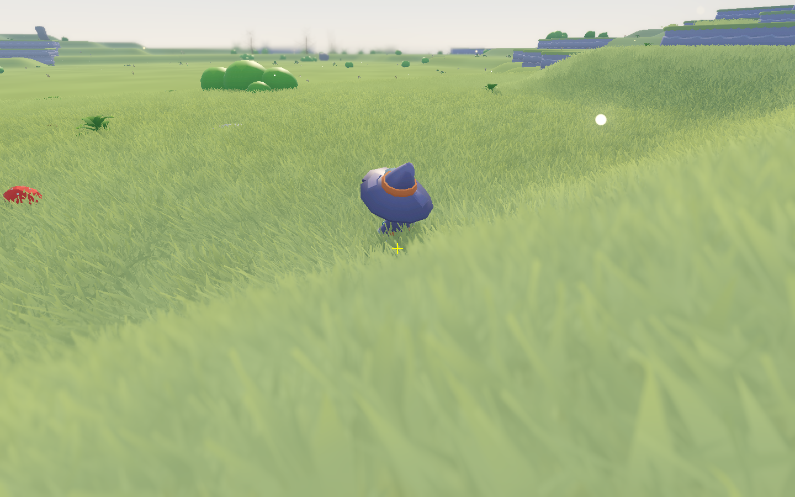
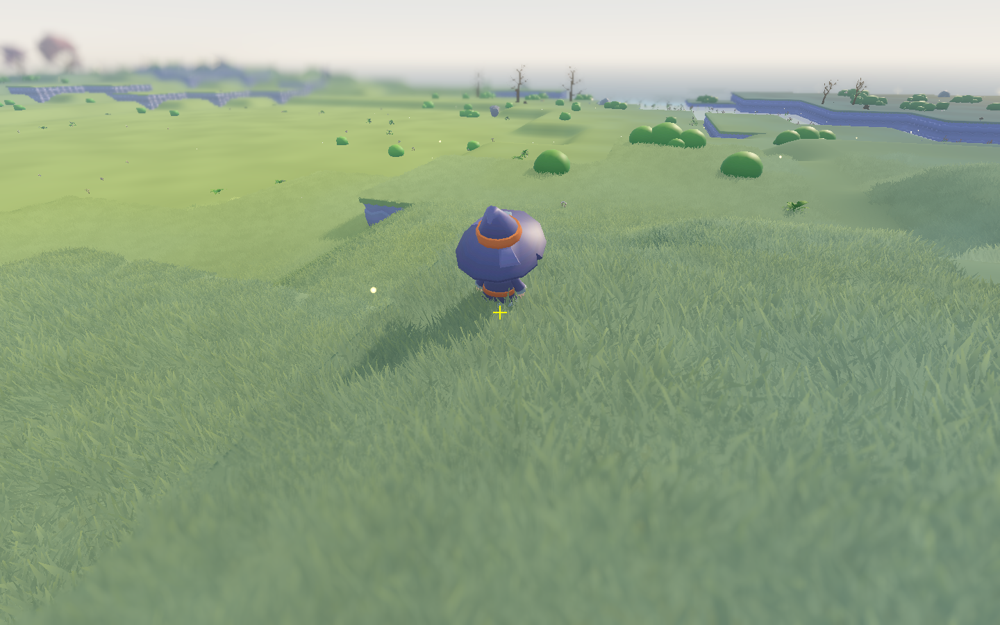
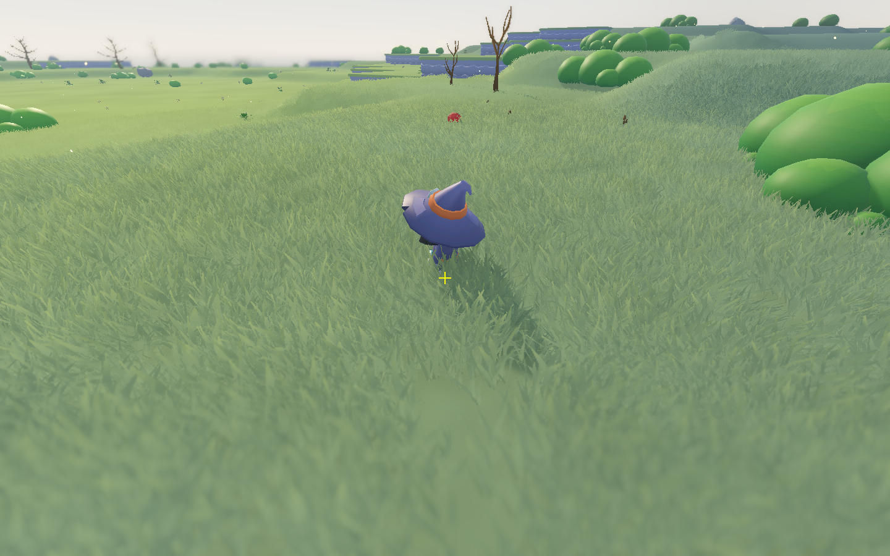
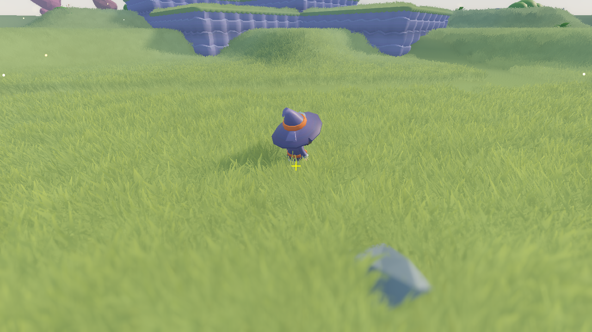

# Water and sustained-travel investigation — September 7, 2026

The large floating water planes came from a terminal lake raising an already-descended river. Queue churn was real, but most of it was repeated sorting of unchanged requests, rather than repeatedly generating the same chunk. Expensive terrain subdivision and main-thread collision commits remain separate bottlenecks.

## Reproduction and water correction

Production seed **2697992464**, amplitude **32 m**, current geological field. The initial 6 × 6 chunk survey compared 72 east/north borders at 3 m intervals (4,680 paired samples). It found eleven broken borders, including a complete 11 m water plane on one side of the origin and dry ground on the other.

The terminal pond for source `(0, 1)` had a natural surface of 11 m while the river ended at a hydraulic bed of −0.5 m. Pond reconciliation raised 249 of its 252 river samples. Source `(0, 0)` similarly raised 257 of 287 samples toward a 7 m pond. A terminal pond now uses the lesser of its natural basin level and its incoming river datum; its carved bed follows the same datum. Standalone pools retain their storey-aligned height.

The remaining two seams disagreed by up to 0.108 m because separate chunk flood windows omitted different downstream seeds. The fill now includes complete source extents and projects the result into each small chunk window before the existing smoothing and shoreline reconstruction. A bounded cache shares these solves. The same survey then reported **zero mismatched borders**, as did the 72-border survey on seed 991177. Historical screenshot fixtures remain separate from current-world regressions.

A separate meshing defect dropped a completely flooded chunk whenever it contained no shoreline. Such chunks now emit their interior water sheet; genuinely dry chunks still return no mesh.

The source extent is a finite hydraulic approximation, not a proof of globally enclosed drainage. The secondary-seed diagnostic still found wet samples at some source-domain outer edges, although all surveyed chunk borders agreed. `water_border_survey.gd` exposes those counts so future seeds can be checked without concealing this remaining boundary risk.

## Reported September 7 views

`tests/fixtures/september7_reported_water.json` records the three owner-supplied F3 player/crosshair readouts. The review harness uses seed 2697992464 and the current production scene, waits for each surrounding 3 × 3 neighborhood and its feature commits, then recovers the camera azimuth from those readouts. The original overlay is rounded to 0.1 m, so the recovered azimuth is approximate; character facing and animation are not reconstructed.

All three standing columns are dry in the corrected field. The matched views show the former overhead/floating water sheets removed. This is a hydraulic correction: the terminal lake no longer floods upstream dry meadows at its unrelated natural elevation. Valid water elsewhere remains governed by the shared water field.





## Travel and queue measurements

Godot 4.5.1, Apple M1 Pro, 1280 × 720 window, VSync disabled. The harness sends real character movement and jump input, logs every second, and records wall-clock frame intervals, worker phases, queue ownership, current distance, terrain readiness, draw calls, primitives, and memory. Headless runs are useful for streaming correctness, not FPS claims.

Initial three-minute walking run:

- Distance: **812.8 m**; waiting for ground: **76.0 s**.
- Walk frame time: **15.20 ms mean**, **25.62 ms p95**, **33.26 ms p99**, **172.32 ms maximum**.
- **389,619 queue sorts**, consuming **108.44 seconds** on the main thread.
- **One duplicate job start**; 118 chunk enqueues. This was not an endless loop rebuilding every request.
- 33 completed terrain payloads; mesh work consumed 135.71 s, with a 36.05 s worst mesh phase.
- Terrain commits averaged 48.56 ms, peaking at 117.76 ms. Frame budgets cannot interrupt one large collision cook.

The queue correction skips unchanged requests, retains ownership while a completed result awaits hand-off, recalculates priorities during travel, cancels abandoned queued terrain, and separates an urgent feature dependency from a distant terrain build. Diagnostic counters are opt-in through `PROFILE_STREAMING`.

The repeat run covered **1,337.9 m**, with **43.7 s** waiting for ground. Queue sorts fell to **796**, costing **0.375 s** in total. The mean walking frame was **9.84 ms**, p95 **18.38 ms**, and p99 **24.48 ms**. These are observations from the same seed and input duration, not a matched-camera graphics A/B: the improved streamer reaches different, more distant terrain.

One newly reached graded chunk produced a **609 ms terrain commit**, and the maximum frame was **632.72 ms**. This remains a visible hitch. The mesh subphase counters attributed **73.84 s of 80.64 s of surface construction** to path/graded subdivision (the worst such phase was 28.17 s). The run built 5,657 finely subdivided graded quads. No duplicate starts were recorded in the repeat run.

Cold startup increased from about **122 s to 144 s** while the corrected water solve included complete source extents. Correct water coverage has a real first-use cost; the steady travel improvement should not be presented as a startup improvement. Nested field-miss timers are included to make that remaining cost visible in later runs.

## Whole-sweep attribution

The standard 49-chunk sweep now includes the same sealed terrain grading as production. Previously the harness measured ungraded terrain even though the live streamer used graded terrain.

| Worker phase | Total |
| --- | ---: |
| Terrain mesh | 235.86 s |
| Feature context, including nested field/route work | 125.63 s |
| Water skin | 14.84 s |
| Environmental dressing | 8.50 s |
| Direct water-context calls | 4.06 s |
| Direct heightfield calls | 0.40 s |
| **All worker work** | **389.28 s** |

Average worker cost was 7.94 s/chunk; the coldest chunk took 80.69 s. Commits added 4.84 s, of which 4.57 s was terrain. There were **zero world-field cache evictions** during this sweep. Feature-context time includes lazy water and terrain work, so it should not be attributed entirely to towns. The town counters separately recorded about 1.35 s of urban construction and 5.40 s of outskirts construction.

The sweep deliberately warms every demanded asset: 865 assets added approximately 1.82 GiB during preparation; peak tracked static memory was 2.93 GiB. This is distinct from the live streamer's deferred loading and is not proof that all those assets are drawn each frame.

## Rendering methodology

The initial travel run ended beside unbuilt terrain. Its fixed-camera ablations showed a repeatable 9.7–9.8 ms full frame and roughly 6.9 ms with grass, shadows, or half the render resolution, but that incomplete view is not representative of a fully populated scene. It is retained in the raw report, not used as the primary graphics benchmark.

The dedicated graphics mode waits for a complete 3 × 3 neighborhood and its feature dependencies, holds the character and camera, stops commits, measures the active worker, then drains that worker before comparing unchanged geometry with individual rendering features disabled. Repeated full-quality samples bracket the comparisons. A value of zero from Metal's GPU-time monitor is treated as unavailable; wall-clock frame intervals are the reported measurement.

Completed-neighborhood results at `(96, 8, 96)`:

| Same camera and geometry | Mean frame | Approx. FPS |
| --- | ---: | ---: |
| Full quality, worker active | 21.59 ms | 46 |
| Full quality, worker idle | 21.45 ms | 47 |
| Grass hidden | 6.90 ms | 145 |
| Atmospheric effects disabled | 18.84 ms | 53 |
| Nature dressing hidden | 21.09 ms | 47 |
| Water hidden and ripple updates stopped | 21.25 ms | 47 |
| Sun shadows disabled | 17.68 ms | 57 |
| Half render resolution on each axis | 15.67 ms | 64 |
| Full quality, repeated at end | 21.70 ms | 46 |

The full view drew **8.74 million primitives** in **450 draw calls**; hiding grass reduced this to **1.29 million primitives** while still issuing **428 draw calls**. Grass accounts for most of the visible geometry and a large rendering cost; the count of loaded decoration objects alone is not the explanation. Reducing resolution helped less than hiding grass, so both geometry/overdraw and pixel work deserve attention. Disabling nature removed 158 draw calls with only a small frame-time change. The active-worker and idle-worker frames were nearly identical once main-thread commits and scheduling were held constant.

The measurements precede the concurrent graded-cliff changes subsequently brought into the main workspace. They are evidence about this captured revision, not a benchmark of every later terrain edit.

These are temporary diagnostic ablations, not shipped quality changes. They describe this grassy view, not every biome, cave, town, or water-dominated camera.



The field-miss counters in this run also exposed **70.07 s of water-context construction** and **11.12 s of heightfield construction**, including calls nested inside feature planning. That explains why a worker can spend a long time in `feature_context` even when town construction itself is comparatively short.

## Next optimizations to evaluate

1. **Ground subdivision and sampling.** Profile fine graded/path quads separately; reuse shared corner samples and limit fine subdivision to the true construction influence while preserving exact slope and path seams. Keep geometry-equivalence regressions before changing this code.
2. **Bound individual terrain commits.** Split large terrain/collision payloads into independently committed sections. A per-frame count of one chunk still allows a large single cook to stall a frame.
3. **Cold field and route preparation.** Time nested cache misses and warm only the next required spatial region. More worker threads would require separate ownership of the currently mutable caches; adding threads alone is not a safe shortcut.
4. **Grass and shadows.** Compare distant blade simplification and a smaller shadow range in a completed scene, preserving the nearby carpet and atmosphere. Avoid reducing every biome's dressing density before measuring this tradeoff.
5. **Asset residency.** Track memory over long travel and inspect which deferred assets remain resident. The measured field cache did not thrash; reducing its capacity would risk making generation slower.

## Validation

102 distinct tests pass across the water plan, field, context, skin, field cache, terminal datum, production seam, full-basin and streaming queue suites. This includes 34 water-skin tests with 19,642 assertions. The combined initial regression process hit a native mutex error during shutdown after its summary; the corrected focused suites and the standalone water-skin suite exited cleanly. Both three-minute travel runs and the completed-scene rendering comparison finished. The final queued/follow-up priority refinements and full-basin meshing fix were covered by focused regressions after the timed runs; the timings are not reruns of those final edits.

## Reproduce

```sh
godot --path . res://tests/harness/travel_profile.tscn -- --seconds 180 --report /tmp/travel.json
godot --path . res://tests/harness/travel_profile.tscn -- --render-only --x 96 --z 96 --report /tmp/render.json
godot --headless --path . res://tests/harness/travel_profile.tscn -- --mode traverse --seconds 180 --report /tmp/traverse.json
godot --headless --path . -s res://tests/harness/water_border_survey.gd -- --seed 2697992464 --report /tmp/water.json
godot --headless --path . -s res://tests/harness/profile_terrain.gd
godot --path . res://tests/harness/water_floating_review.tscn -- --report /tmp/water-reported
```

`traverse` deliberately bypasses physical obstacles to stress chunk scheduling over a long distance; it is reported separately from real walking. The JSON report includes bounded detailed timing samples and recent starts; its companion `.jsonl` file preserves progress if a run is interrupted.
