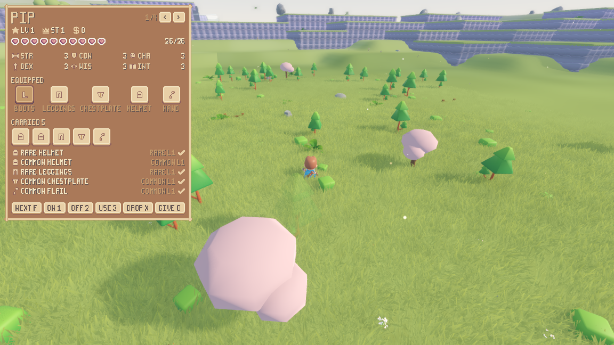
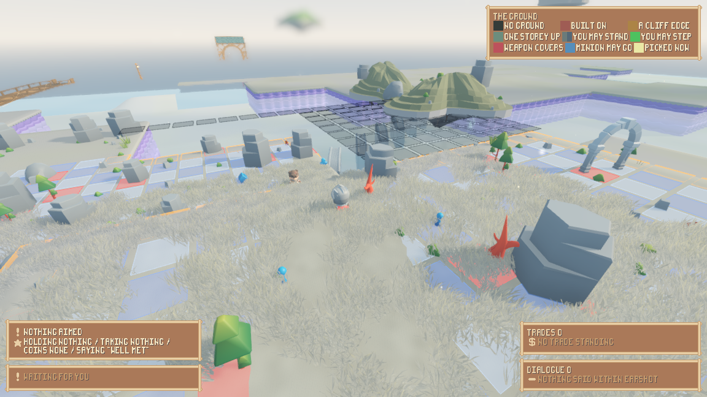
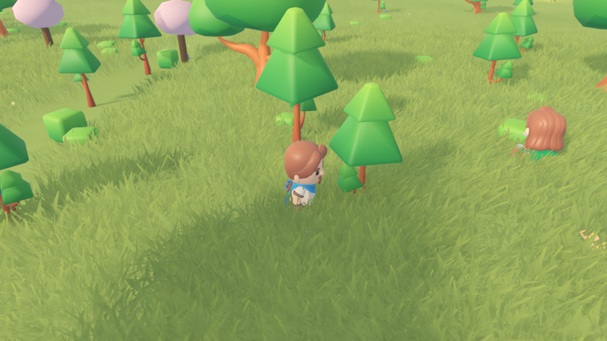

# Their world on screen, this game's board and interface over it

The render shell no longer draws a world of this project's own. It *is* the
adopted base's world scene, with this game's shell script on its root and this
game's conventions built as children of it. This is the write-up of that seam:
what moved, what left the tree, what is named as an exception and why, and the
evidence that the simulation still knows nothing about any of it.

Every command below is one anybody can type. The engine is `tools/godot/godot4`
(Godot 4.7.2); a run with a window needs a display, so on this machine every
capture is `xvfb-run -a`.

## 1. The shell is their scene, inherited

`render/main.tscn` used to be six lines: one `Node3D` with `render/main.gd` on
it, and everything else built in code. It is now an **inherited scene** whose
parent is `res://scenes/world.tscn` — the world scene this repository adopted:

```
[node name="Main" instance=ExtResource("1_world")]
script = ExtResource("2_main")
```

So the nodes that draw the world are theirs, at their own paths, doing their own
work: `FieldTerrain` (their `FieldTerrainStreamer`) streams the ground, its
water, its villages, its dressing and its grass; `AtmosphereDirector` grades the
sun, the sky, the fog, the bloom, the fill and the depth of field; `WaterRipples`
is their `WaterRippleSim`; `Camera3D` carries their follow camera; and
`Characters/Character` is their rigged character scene. Nothing of this project
wraps any of it.

**The two halves meet at one number.** `sim/adopted_ground.gd` builds its plans
with `TerrainWorldTuning.make_water(seed)` and
`TerrainWorldTuning.make_heightfield(seed, water)`, and so does
`FieldTerrainStreamer._ready`. Handing the streamer the simulation's seed is
therefore the whole of making the ground drawn the ground the simulation is
reading. That happens in `render/main.gd`'s `_enter_tree`, which exists for this
timing reason: a node's `_ready` runs *before* its parent's, so by the time the
shell's `_ready` could speak the streamer would already have planned the wrong
world and started its worker thread on it.

Two of their nodes are taken back off in the same place. `ReviewTeleporter` and
`CoordOverlay` are the base's own in-world development tools, drawn over the
picture; they belong to somebody building terrain, not to somebody playing or
photographing a frame.

## 2. Nothing steps until the ground exists

`FieldTerrainStreamer` builds one chunk a frame and emits
`startup_loading_completed` when the chunks it holds a run back for have landed.
The base waits on exactly this — that is what `ui/loading_screens/` is — and this
shell waits on it too, for the same reason and one more. A character cannot
stand on ground that has not been built, and a capture wants a reproducible
tick: with the wait, `--screenshot-tick N` photographs a world with ground under
it however long the machine took to mesh it. The run says so on its own line:

    render-shell ground ready frames=597 seed=1234

A run with no display skips the wait. The wait is about the picture, and
`tests/test_render_shell.gd` runs the shell headless on purpose, to ask whether
drawing the world changes it; making that run sit through ten minutes of meshing
would price the ground rather than answer the question.

## 3. What left the tree

The acceptance line names four duplicate draw paths. All four are gone, not kept
beside theirs:

| Retired | What draws it now |
|---|---|
| `sim/terrain_streamer.gd` | `scripts/terrain/field/FieldTerrainStreamer.gd` |
| `sim/terrain_chunk_mesher.gd` | `scripts/terrain/field/TerrainChunkMesher.gd` |
| `render/grass_layer.gd` (1665 lines) | `scripts/terrain/grass/` (GrassField, GrassStreamer, GrassProgram, TrampleField) |
| `sim/water_sheet_builder.gd` | `scripts/terrain/water/WaterSurfaceBuilder.gd`, over `WaterPlan` |

Two more went with them, because both existed only to draw one of the four:
`render/distant_ground.gd` (the coarse rings past this project's forty-unit disc
— the adopted streamer fills its own distance) and `render/water_reflection.gd`
(the mirror under the retired water sheet).

Two files were renamed rather than deleted, and that is the one exception, named
with its reason. `sim/terrain_chunk_geometry.gd` and `sim/water_sheet.gd` are now
`sim/island_geometry.gd` (`IslandGeometry`) and `sim/island_water.gd`
(`IslandWater`): **the adopted base has no aerial layer at all**, so there is
nothing of theirs to build a floating island on, and the island layer is the one
piece of ground this project still generates. Its geometry container and its
pond surface are named for what they are now rather than left carrying the
ground's old names.

The streaming lattice moved to the thing it still divides up. `ScatterPatch` now
owns `PATCH_SIZE` (16.0), `LOAD_RADIUS` (40.0), `UNLOAD_RADIUS` (56.0),
`patch_at()` and `distance_to_patch()` — the same numbers the dressing was
streamed by when it was loaded with the ground it stands on, so the same observer
loads the same set as before. The adopted streamer's own lattice is far coarser
(`TerrainChunkMesher.CHUNK_WORLD` is 192 against this 16), which is why the two
could not share one.

## 4. The characters are built on theirs

`render/character.tscn` is an inherited scene of `characters/character.tscn`, and
`render/character_view.gd` extends `res://characters/character.gd`. The body, its
collision capsule and ground ray, the `Body` mount, the `AnimationPlayer` and
`AnimationTree` above it, the two hand sockets and the spine socket with its
hitbox are all the base's, at the base's own node paths.

One thing of theirs is switched off, and this is the reason. Their
`_physics_process` is a walk: it reads a `CharacterController`, applies gravity,
accelerates, turns, steps up ledges, swims and calls `move_and_slide`. In this
game nothing on screen decides where a character is — the simulation does, and
the render layer is forbidden from holding any of it — so the view turns the
physics process off and is placed, tick by tick, at the position the snapshot
reports. Everything about their body that is *about the character* rather than
about who moves it is kept.

The base's four pre-mounted adventurers come off the `Body` mount, because this
game chooses a model by tag out of its own asset table, which reaches further
than their four — to the skeletons and the minions. Their animation library is
not yet the clip source; `render/character_rig.gd` still assembles one per rig,
because it answers for rigs their library does not. That is named here as
something left rather than something decided.

**The asset-path collision ADOPTION.md left open is closed.** Thirteen of their
files referenced `res://assets/KayKitAdventurers/…`; this repo carries the same
CC0 pack at `assets/kaykit_adventurers/KayKit_Adventurers_2.0_FREE/`. Their files
are repointed at it, which is what makes their character scene load at all.

## 5. The atmosphere: theirs grades, ours adds

Two layers cannot own one `Environment`, and the one that ships with the world
the shell draws is the one that keeps it. `AtmosphereDirector` owns the sun, the
sky, the fog, the bloom, the ambient fill, the ambient occlusion and the depth of
field. `render/atmosphere.gd` was rewritten down to what theirs has no
equivalent for: the warm point lights on lanterns, windows, campfires and glowing
toadstools; the wander of the twilight pockets' orbs; the drifting motes; and the
mist that pools in the low ground, written onto *their* Environment.

Two of this project's old claims are deliberately dropped, and both are the
base's call on the base's world. Their director states its own rule — "Local
biome mood belongs to world-space fog, vegetation and ground, so walking cannot
relight distant scenery" — so the sky and the fog no longer slide from one
biome's numbers to the next as the observer crosses a border; and their fill is a
cool `bacede` rather than this project's warm-neutral one.

The mist is a **multiple of the adopted Environment's own fog density**, read off
it at `attach()`, rather than an absolute number of this project's. That is not
tidiness: this project's biome profiles carry densities chosen against an
Environment this layer used to build itself, one to two orders of magnitude above
the `0.00035` their director sets, and writing one straight into their height fog
whited out a whole frame the first time it was photographed.

`--no-atmosphere` now means "none of this project's layer", not "no lighting":
the adopted world still lights itself.

## 6. The frames

**The adopted terrain, this game's rigged character on it, the interface over
it.** One seeded run, the command in full:

    xvfb-run -a ./run_render.sh --seed 1234 --sheet \
      --screenshot-tick 30 --screenshot reports/assets/adopted-world-interface.png



That run's own closing line, which says the streamer was on the simulation's
seed, that the interface was drawn at whole-pixel scale, and that the warm point
lights were hung:

    render-shell stop tick=34 frames=607 views=9 handles=27 ground=1234 islands=9
      motes=571 lights=29 orbs=0 board=0/0 pieces=4 ... digest=ccd15d5040ebdbb4
    render-shell sheet scale=1 x=8 y=8 w=353 h=408 sheets=4 showing=0

**The board conventions, in a fight on their ground.**

    xvfb-run -a ./run_render.sh --seed 1234 --scenario battle --play --readout --board \
      --screenshot-tick 12 --screenshot reports/assets/adopted-board-fight.png



and the numbers the same run printed:

    render-shell legend scale=1 x=791 y=8 w=353 h=91 colours=9
    render-shell stop tick=15 ... board=441/89 pieces=8 ...

Nine legend rows drawn; 441 board cells painted, 89 of them holes; eight pieces
standing on them. In the frame the squares follow the ground rather than lying
flat across it — the overlay samples the same height function the adopted mesher
does — and the dark lattice over the water is the hole read.

**The capture flags, on the adopted world.**

    xvfb-run -a ./run_render.sh --seed 1234 --paused --camera 0 6 8 --aim 1.5 --fov 50 \
      --screenshot-frame 700 --screenshot reports/assets/adopted-capture-flags.png



`--camera` is handed to the adopted camera as its height and its distance, which
is the pair that camera is steered by; `--aim` needed one addition in their own
idiom (`aim_lift` on `scripts/camera/camera.gd`, defaulting to 0, which is what
they had); `--fov` is set on their `Camera3D`; and `--paused` now also asks that
camera for its settled pose outright (`snap()`), because a held frame has no
later frames to ease into place over. `run_render.sh`'s header records all of
that, and what became of every flag that is gone.

## 7. Headless purity, re-derived rather than assumed

The check got **stronger**, not weaker, and it had to. Before the adoption
"the simulation loads nothing of the render layer" could be answered by a
directory name. It cannot now: the base's `scripts/` holds both the fields the
simulation legitimately reads (its ground *is* their heightfield) and the code
that draws the world. So the question is answered by what a file *is*: a script
that `extends` a scene-tree type only exists inside a running tree, so a headless
process that has loaded one has loaded a piece of the picture.

    ./run_headless.sh --seed 1234 --ticks 20 --assets

    assets visual-files          found=16837 loaded=0
    assets render-scripts        found=37    loaded=0
    assets adopted-scene-scripts found=11    loaded=0
    assets sim-scripts           found=123   loaded=98

and the eleven, named one by one so a count of zero cannot be a count of nothing:

    assets adopted-scene-script res://scripts/camera/camera.gd cached=0
    assets adopted-scene-script res://scripts/terrain/tools/CoordOverlay.gd cached=0
    assets adopted-scene-script res://scripts/terrain/tools/ReviewTeleporter.gd cached=0
    assets adopted-scene-script res://scripts/terrain/biome/SpiritOrb.gd cached=0
    assets adopted-scene-script res://scripts/terrain/biome/AtmosphereDirector.gd cached=0
    assets adopted-scene-script res://scripts/terrain/field/FieldTerrainStreamer.gd cached=0
    assets adopted-scene-script res://scripts/terrain/grass/TrampleField.gd cached=0
    assets adopted-scene-script res://scripts/terrain/water/WaterRippleSim.gd cached=0
    assets adopted-scene-script res://ui/loading_screens/MythosLoadingScreen.gd cached=0
    assets adopted-scene-script res://ui/loading_screens/MythosTaperedProgressBar.gd cached=0
    assets adopted-scene-script res://characters/character.gd cached=0

The `visual-files` group is every scene, model, texture, material, shader and
font in the project — 16,837 of them, the adopted base's included. None loaded.
The transcript is `assets/adopted-render-seam-headless.log`.

Writing that group exposed a bug in the scan itself, which is recorded here
rather than quietly fixed: its excluded-directory list matched *any* directory
called `tools` at any depth, and the adopted base has a `scripts/terrain/tools/`
of its own — so two of its scene scripts (`CoordOverlay`, `ReviewTeleporter`)
were invisible to the scan until this seam came to lean on it.

The other half is the layer scan, now a command of its own:

    ./tools/layer_scan.sh

    layer-scan sim names the render layer             violations=0
    layer-scan render holds the fight                 violations=0
    layer-scan the interface names its own art        violations=0
    layer-scan the keyboard invents no sentence       violations=0
    layer-scan total=0

Nothing under `sim/` names a render type or a resource path. The transcript is
`assets/adopted-render-seam-layer-scan.log`.

## 8. What this changed in the simulation, and what it did not

The simulation no longer streams or meshes ground, and no longer builds a water
sheet. `SimWorld` lost `chunk_mesher`, `terrain_streamer`, `water_sheet_builder`,
`water_sheet()`, `live_water_sheet()` and `water_sheet_version`; its snapshot
lost `loaded_chunks`, `water_sheet_version` and `chunk_size` (and gained
`patch_size`); and `--chunks` / `Simulation.chunk_report()` are gone, because
there is no chunk for the simulation to report.

**The world fingerprint therefore changed, and that is stated rather than
hidden.** `SimWorld.digest()` used to fold in every loaded chunk's geometry
digest and the water sheet's, both of which were artefacts of a draw path. Seed
1234 at tick 0 was `1e91d845fbe592c7` before this work and is `a6a1cc2ab68d02d0`
after; at tick 5, `7f9b690f90f93658` before and `ae8554727f0a4d13` after. The
trace line changed shape with it — `chunks=32 built=32` is now
`patches=32 built=32`, the same number for the same reason, because the dressing
is streamed on the same lattice by the same two radii.

What did **not** change: the cast, where they start, what they decide, and every
per-tick line of the trace above the fingerprint. The observer still starts at
the origin with the same three companions and the same scholar at
`(-23.279, 0.000, -35.501)`, and the same four `go_to` decisions are taken on
tick 1.

## 9. The suites that answer for this

Thirteen suites were run on the changed tree, as one supervised job:

    ./run_tests.sh test_layering test_terrain test_water test_streaming test_biomes \
      test_render_shell test_atmosphere test_anti_aliasing test_board_overlay \
      test_combat_board test_determinism test_characters test_held_items

It took 106.0 min and ended on its own summary line:

    4 of 13 suites failed (11 failed checks of 35357)

The transcript is `assets/adopted-render-seam-suites.log`. Suite by suite:

| Suite | Verdict | |
|---|---|---|
| `test_layering` | `PASS  layering 0.3 s, 63 checks` | the sim/render split holds |
| `test_terrain` | `PASS  terrain 0.9 s, 53 checks` | the field's purity, on the adopted heightfield |
| `test_water` | `FAIL  water 1594.0 s, 5313 checks, 4 failed` | **inherited** — see below |
| `test_streaming` | `PASS  streaming 949.2 s, 4679 checks` | the streaming rule, repointed onto `ScatterStreamer` |
| `test_biomes` | `PASS  biomes 177.9 s, 206 checks` | |
| `test_render_shell` | `FAIL  render shell 601.3 s, 40 checks, 2 failed` | **this seam's own; fixed** — see below |
| `test_atmosphere` | `FAIL  atmosphere 790.2 s, 90 checks, 2 failed` | **inherited** — see below |
| `test_anti_aliasing` | `PASS  anti-alias 590.4 s, 50 checks` | |
| `test_board_overlay` | `PASS  board overlay 132.8 s, 12 checks` | the board still hugs the ground it reads |
| `test_combat_board` | `FAIL  combat board 428.5 s, 23362 checks, 3 failed` | two inherited, one this seam's own and fixed |
| `test_determinism` | `PASS  determinism 825.0 s, 15 checks` | |
| `test_characters` | `PASS  characters 75.3 s, 1315 checks` | the rig on the adopted character scene |
| `test_held_items` | `PASS  held items 103.5 s, 159 checks` | the hand sockets at the base's own node paths |

**The two reds this seam caused, and what they were.** `test_render_shell` failed
on exactly the two checks the repointing got wrong, and both are fixed:

    - the handle sweep covered 3 of the 7 handle kinds; something the world hands out
      was not loaded to test
    - the shell asked for 30 copies to draw 10 islands, which is not the four an
      island costs: something is copying an island it already had

The first is the check working: the sweep named a fixed island cell, and that
cell holds no island on the adopted ground, so four of the seven handle kinds
were never reached. It now asks the streamer which island it actually has in
view, which cannot go stale that way. The second was an arithmetic error of mine
— three of `IslandStreamer`'s four accessors touch the handle counter and
`island()` deliberately does not, so an island costs three copies, not four.

`test_combat_board`'s third failure is the same kind of thing:

    - the board's cell must not divide the chunk, got 64.0000 cells per chunk

That claim was about *this project's retired* chunk, which was 16 units wide. The
adopted chunk is 192, and 192 / 3.0 is exactly 64, so the claim as written is
false about the ground that is actually drawn. What it was protecting is the
sampling grid — the board's cell must not line up with the corners the ground is
sampled at — and `TerrainChunkMesher.STEP` is 2.0, which 3.0 does not divide
(1.5 cells). The check is made about that instead.

Re-run after the fixes, as a second supervised job
(`assets/adopted-render-seam-suites-refix.log`, 17.6 min):

    PASS  render shell    617.6 s, 52 checks
    FAIL  combat board    425.9 s, 23362 checks, 2 failed
    1 of 2 suites failed (2 failed checks of 23414)

`test_render_shell` is green. `test_combat_board` is down from three failures to
two, and the two that remain are the inherited ones below — neither mentions a
cell, a chunk or a lattice:

    - the four sample boards should hold both holes and ground, got 0 and 1634
    - expected at least one thing standing on a cell the board reads as a hole
      or an island

**The reds this seam did not cause.** `test_water`'s four, `test_atmosphere`'s
two and `test_combat_board`'s other two are all one shape, and it is the shape
the ground rebuild already filed in `reports/terrain-seam-sim-suites.md`: a
suite names a fixed world position that was chosen against the retired ground
and means something else on the adopted one.

    test_water        - expected banks around the water of seed 19, found 0
    test_atmosphere   - the spot this check stands in is not a twilight marsh any more
                        expected: twilight_marsh   actual: deep_forest
    test_combat_board - the four sample boards should hold both holes and ground,
                        got 0 and 1634

`test_water` was already red before this work — the earlier reading recorded
`FAIL  water 1971.8 s, 5320 checks, 7 failed`, all of the form "expected water in
view of seed 19, found 0 wet samples". It is **smaller** now, at 4 of 5313,
because two of the seven belonged to the retired water sheet and went with it.
The same report names `test_combat_board`'s `WATER_SAMPLE_AT` as a spot that is
dry on the adopted ground. Re-choosing those constants belongs with the suite
certification (`W-adopt-suites`), not here.

Several suites had to be repointed rather than merely re-run, because they were
testing code that no longer exists, and each repointing keeps the *claim* and
moves it to the layer that still makes it:

| Suite | What changed |
|---|---|
| `test_streaming` | the whole suite now streams `ScatterStreamer` on `ScatterPatch`'s lattice — the same rule, on the layer that still follows it |
| `test_terrain` | the four mesher claims go; the field's purity stays. The base's own `test_terrain_chunk_mesher` answers for the mesh |
| `test_water` | the two sheet claims go; the field's claims stay. The base's `test_water_plan`/`test_water_skin` answer for the surface |
| `test_render_shell` | the isolation claims move from chunk geometry to the scatter patch, and the copy-cost claim to the islands |
| `test_atmosphere` | the grade claims are asked of `AtmosphereDirector` instead; the two the base's own rule contradicts are dropped with the reason; the headless check now names the adopted director as a file that must stay uncached |
| `test_biomes`, `test_settlements`, `test_combat_board`, `test_combat_snap`, `test_scatter`, `test_drops`, `test_determinism`, `test_board_overlay`, `test_anti_aliasing` | repointed off the retired names |

Four suites were retired outright, because the layer each tested is out of the
tree: `test_grass`, `test_reflection`, `test_terrain_lod`, and the two grass
probes. The base ships `test_grass_field` and `test_grass_streamer` for the grass
that draws now.

## 10. Known, and not fixed here

**The floating islands read badly against the adopted terrain.** The aerial band
was placed against this project's retired ground, which was far lower and flatter
than the adopted storey-quantised heightfield; in a wide shot the far-sky islands
now stack along the horizon instead of sitting in open sky. Nothing about the
simulation is wrong — an island is where the island field says it is, and the
board still reads the void under one as a hole — but the altitude band wants
re-choosing against the ground that is actually drawn. That is a look decision on
the island layer rather than a render-seam one.

**A cold run is slow.** The adopted streamer needed 597–645 frames to finish its
startup chunks on this machine, and its worker thread reports single chunks
taking tens of seconds under `feature_context`. That is the base's own cost, not
something this seam added, and it is why every capture here is a background job.
