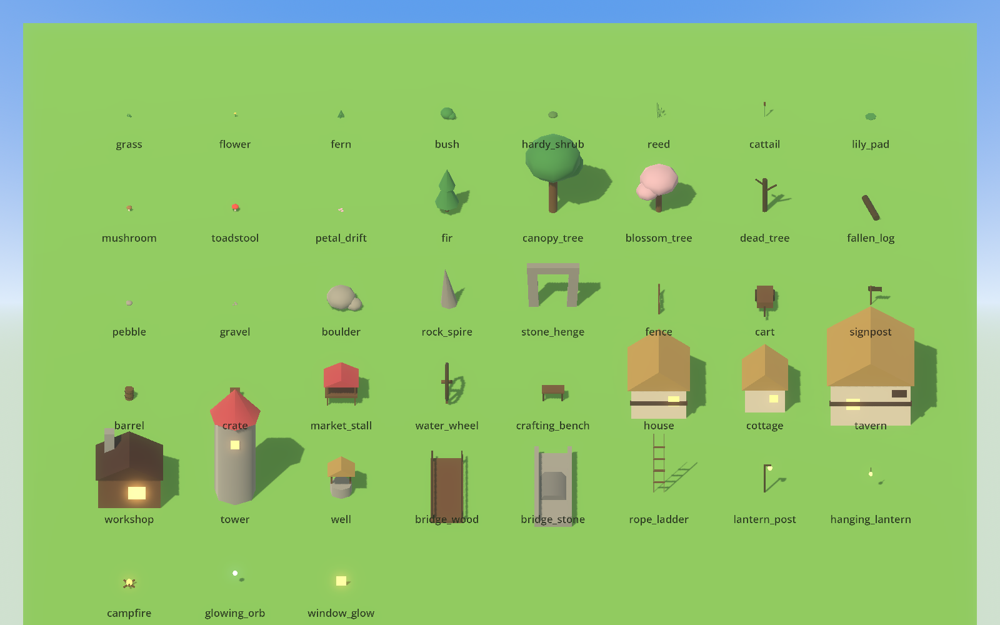
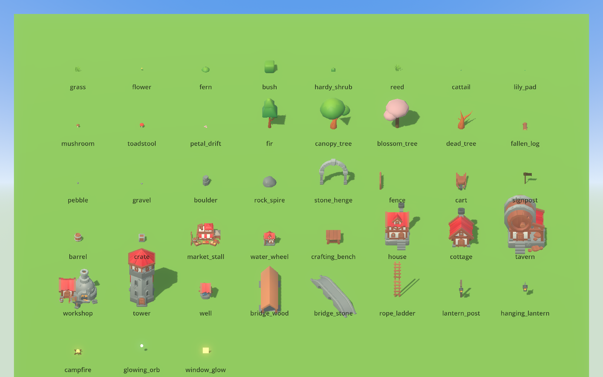
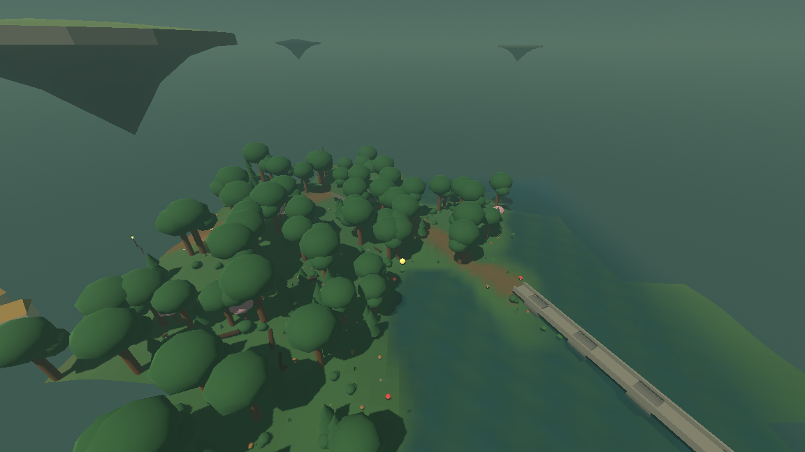
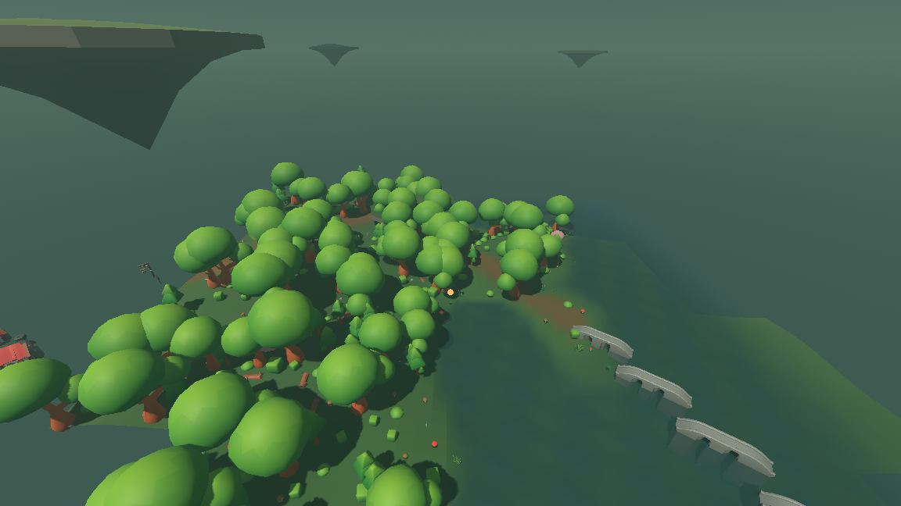
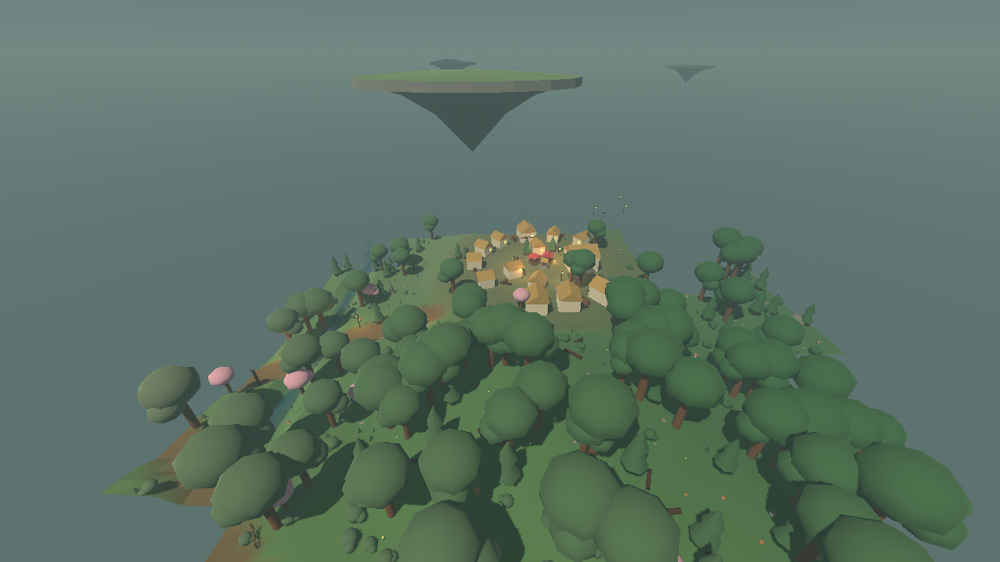
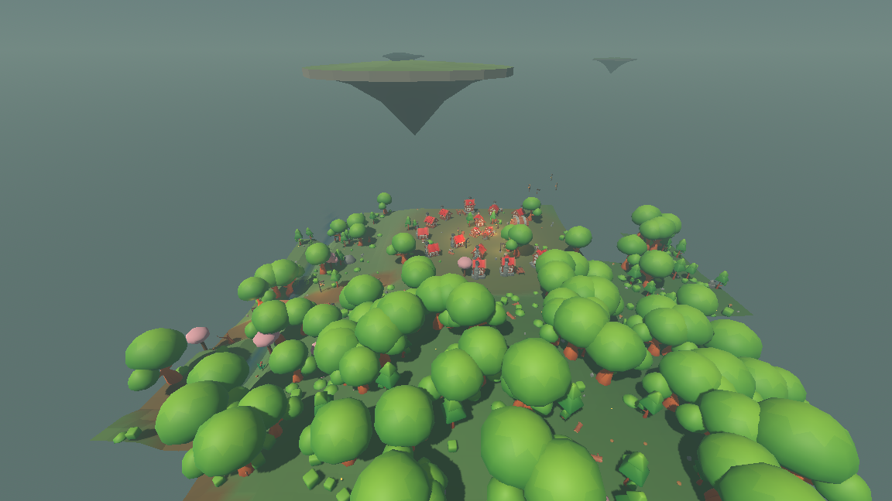

# Real asset packs behind the tags

The world was drawn with coloured primitives. It is now drawn with models from
eight free KayKit packs, and the change is one column of one table plus the
files that column points at. Nothing under `sim/` moved and the headless world
is byte-identical.

## What the change is, in one sentence

`render/asset_library.gd` is a table with one row per asset tag, and each row is
a **scene path first, placeholder primitives second**. Thirty-four of the
forty-three rows now name a scene. The other nine still name nothing and fall
back to their primitives; they are listed by name below.

> Later: those numbers are this task's. The catalog has since grown to
> **seventy** tags and **fifty-nine** of them name a model -- the JustCreate and
> Mistage packs closed five of the nine gaps, `W-character-visuals` added
> fourteen character and creature rows, all of which name one, and
> `W-ground-items` added the twelve `gear_*` rows, five of which name one. Eleven
> rows are still placeholders: `petal_drift`, `blossom_tree`, `hanging_root`,
> `glowing_orb`, and the seven pieces of gear no free pack holds --
> `gear_spear`, `gear_flail`, `gear_boots`, `gear_leggings`, `gear_chestplate`,
> `gear_helmet` and `gear_bundle`, which is not a shape anything forges.
> `./run_assets.sh` is always the current answer.





## The packs

All eight are by Kay Lousberg and all eight are **CC0** (Creative Commons Zero,
public domain): free to use in personal, educational and commercial projects,
with credit appreciated but not required. Each pack's own `License.txt` ships
inside its directory and says so.

| Directory under `assets/` | Pack | Source | Licence | glTF models |
| --- | --- | --- | --- | ---: |
| `kaykit_forest_nature` | KayKit Forest Nature Pack 1.0 (free tier) | https://kaylousberg.itch.io/kaykit-forest | CC0 | 105 |
| `kaykit_medieval_hexagon` | KayKit Medieval Hexagon Pack 1.0 (free tier) | https://kaylousberg.itch.io/kaykit-medieval-hexagon | CC0 | 221 |
| `kaykit_medieval_builder` | KayKit Medieval Builder Pack 1.0 | https://kaylousberg.itch.io/kaykit-medieval-builder-pack | CC0 | 226 |
| `kaykit_dungeon_remastered` | KayKit Dungeon Pack Remastered 1.1 (free tier) | https://kaylousberg.itch.io/kaykit-dungeon-pack | CC0 | 211 |
| `kaykit_adventurers` | KayKit Adventurers 2.0 (free tier) | https://kaylousberg.itch.io/kaykit-adventurers | CC0 | 39 |
| `kaykit_halloween_bits` | KayKit Halloween Bits 1.0 (free tier) | https://kaylousberg.itch.io/halloween-bits | CC0 | 63 |
| `kaykit_city_builder_bits` | KayKit City Builder Bits 1.0 (free tier) | https://kaylousberg.itch.io/city-builder-bits | CC0 | 41 |
| `kaykit_resource_bits` | KayKit Resource Bits 1.0 (free tier) | https://kaylousberg.itch.io/resource-bits | CC0 | 76 |

982 glTF files, 111 MB. Duplicate FBX/OBJ/Blend copies of the same models are
deleted on install: Godot imports glTF, and the other formats are only weight in
the import cache.

`kaykit_adventurers` is the rigged-character pack — six animated characters
(Barbarian, Knight, Mage, Ranger, Rogue, Rogue Hooded) plus two animation
libraries and a weapon set. Nothing in the tag catalog names a character yet,
because characters are §4 of the build order and the tag catalog is scenery, so
it is installed and unused rather than wired up. `kaykit_city_builder_bits` is
likewise mostly modern-city content; it came down with the batch and only its
props are on-theme.

### How they were fetched

`./tools/fetch_kaykit.sh`, with no account and no sign-in. The itch.io flow it
reproduces, which is what the site's own javascript does when you click "No
thanks, just take me to the downloads" on a name-your-own-price page:

1. `GET` any page on the site, which sets the `itchio_token` cookie. That cookie
   value *is* the CSRF token the site posts back.
2. `POST <game>/download_url` with that token. Answers with a short-lived
   download-page URL and puts a download key in the session.
3. `GET` that page and read the upload ids off the download buttons, skipping
   any row that carries a `data-min_price` (those are the paid tiers).
4. `POST <game>/file/<upload_id>` with the token. Answers with a signed storage
   URL; follow it and unzip.

The one dead end worth recording, so nobody repeats it: `POST` to
`<download-page-url>/file/<upload_id>` — the path that includes the session
download key — returns **404**. The endpoint is at the game path, not the
download path. The stop condition for this task allowed two attempts at the
download flow before giving up and asking the user; the first shape 404'd, the
second worked, and no interactive sign-in was needed at any point.

## Where the art comes from, and what a fresh clone runs

**The pack binaries are not committed.** `.gitignore` excludes
`/assets/kaykit_*/`. The reasoning:

* They are 111 MB. Committing them puts that in every clone, and in every future
  clone, forever — git keeps history even after a later deletion.
* They are exactly reproducible by a script that needs no account, no token and
  no sign-in, so the usual argument for vendoring ("the upstream might vanish or
  need credentials") is weak here, and the script itself is committed.
* CC0 means redistribution *would* be allowed. This is a size decision, not a
  licence one.

**What is committed** is the part nobody else can reproduce: the table, the
eighteen per-tag wrapper scenes under `assets/tag_scenes/`, the fetch script,
and the measuring tool.

A fresh clone needs two commands to get a world that renders as art:

```
./tools/fetch_kaykit.sh     # ~111 MB from itch.io, a few minutes
./run_render.sh             # imports on first run, then draws
```

Skip the first and everything still runs — every row keeps its placeholder
primitives underneath, so a checkout without the packs draws the old coloured
world rather than an empty one. That is the whole reason a row is a path *and* a
set of primitives instead of one or the other.

## Direct paths and wrapper scenes

A row points at one of two things.

**Straight at the pack model**, when the model's own size is already the right
size for the tag. This is every flora and rock tag plus `barrel`. These are the
tags the scatter layer *sizes*: generation says "a fir seven units tall here",
the row says how tall this fir is as drawn, and the render shell divides. So for
these rows the only two numbers that matter are the path and `scene_height`.

**At a small wrapper scene** under `assets/tag_scenes/`, when the model has to
be scaled, lifted or repeated to stand where the placeholder stood. This is
every building, bridge, lantern and most props — the placements the render shell
does *not* scale, because a village reserves a footprint in world units and the
model has to fit it. A wrapper is six lines: instance the pack model, apply one
transform. For example `assets/tag_scenes/house.tscn` is
`building_home_B_red.gltf` at scale 3.828, which is exactly the number that
makes it 4.90 units tall — the height the placeholder house stood at, and so the
height the settlement layout was laid out around.

The rule for picking a wrapper's scale: **match the placeholder's height**,
except where that would burst the building footprint `sim/settlement_field.gd`
reserves, in which case clamp to the footprint. Four buildings hit the clamp:

| Tag | Footprint (full, world units) | Height matched | Actual |
| --- | --- | --- | --- |
| `workshop` | 5.8 × 5.0 | 5.30 would be 6.9 × 6.7 | clamped to 5.17 × 5.00, height 3.96 |
| `tower` | 4.2 × 4.2 | 10.60 would be 4.8 × 5.6 | clamped to 3.61 × 4.20, height 7.99 |
| `well` | 2.6 × 2.2 | 2.95 would be 2.3 × 2.7 | clamped to 1.91 × 2.20, height 2.42 |
| `market_stall` | (no reserved footprint) | 2.75 would be 5.0 wide | scaled to 2.16 tall, 4.0 wide |

Every size in this document was measured, not guessed. `./tools/measure_models.sh`
loads each installed model, walks its meshes and prints the box it fills plus the
height of its lowest point — that last number matters, because a model whose
origin is not at its feet stands sunk into or floating above the ground.

## The table, row by row

Thirty-four rows now name a scene.

| Tag | Resolves to | Height as drawn |
| --- | --- | ---: |
| `grass` | forest `Grass_2_B_Singlesided_Color1` | 0.919 |
| `fern` | forest `Bush_3_A_Color1` | 0.485 |
| `bush` | forest `Bush_2_C_Color1` | 1.320 |
| `hardy_shrub` | forest `Bush_4_A_Color1` | 0.434 |
| `reed` | forest `Grass_2_C_Color1` | 0.935 |
| `cattail` | hexagon `waterplant_C` | 0.247 |
| `lily_pad` | hexagon `waterlily_A` | 0.017 |
| `fir` | forest `Tree_4_A_Color1` | 5.274 |
| `canopy_tree` | forest `Tree_1_B_Color1` | 4.930 |
| `dead_tree` | forest `Tree_Bare_1_B_Color1` | 3.251 |
| `fallen_log` | resource bits `Wood_Log_A` | 1.350 |
| `pebble` | forest `Rock_2_A_Color1` | 0.216 |
| `gravel` | hexagon `rock_single_A` | 0.069 |
| `boulder` | forest `Rock_1_D_Color1` | 1.130 |
| `rock_spire` | forest `Rock_3_I_Color1` | 2.109 |
| `stone_henge` | wrapper → halloween `arch` ×0.906 | 4.000 |
| `fence` | wrapper → hexagon `fence_wood_straight` ×2.251 | 1.238 |
| `cart` | wrapper → hexagon `wheelbarrow` ×5.731 | 1.077 |
| `barrel` | dungeon `barrel_small` | 1.018 |
| `crate` | wrapper → dungeon `box_small` ×0.800 | 0.800 |
| `market_stall` | wrapper → hexagon `building_market_red` ×2.200 | 2.160 |
| `water_wheel` | wrapper → hexagon `building_watermill_red` ×1.531 | 2.401 |
| `crafting_bench` | wrapper → dungeon `table_medium` ×0.980 | 0.980 |
| `house` | wrapper → hexagon `building_home_B_red` ×3.828 | 4.900 |
| `cottage` | wrapper → hexagon `building_home_A_red` ×4.301 | 4.000 |
| `tavern` | wrapper → hexagon `building_tavern_red` ×4.653 | 6.500 |
| `workshop` | wrapper → hexagon `building_blacksmith_red` ×4.016 | 3.956 |
| `tower` | wrapper → hexagon `building_tower_A_red` ×3.643 | 7.986 |
| `well` | wrapper → hexagon `building_well_red` ×2.930 | 2.420 |
| `bridge_wood` | wrapper → builder `bridge_roofed` ×3.826, turned onto +Z | 3.161 |
| `bridge_stone` | wrapper → hexagon `building_bridge_A` ×4.678 | 1.170 |
| `rope_ladder` | wrapper → hexagon `ladder` ×3.896, two copies stacked | 6.000 |
| `lantern_post` | wrapper → halloween `post_lantern` ×0.848 | 2.798 |
| `hanging_lantern` | wrapper → halloween `lantern_hanging` ×1.0, lifted 2.40 | 2.500 |

A bridge is the one tag the shell stretches: it scales the span along +Z by
`span / BRIDGE_UNIT`, so a wrapper has to be `BRIDGE_UNIT` long at scale 1 —
8.0 for `bridge_wood`, 9.0 for `bridge_stone`. `hanging_lantern` is lifted
because the model hangs *below* its origin, as a ceiling fitting does.

## The nine tags no installed pack covers

These keep their placeholder primitives. Stated rather than hidden:

| Tag | Why |
| --- | --- |
| `flower` | No pack has a flower. The forest pack's free tier ships one texture atlas, `forest_texture.png`, with no flower geometry. |
| `mushroom` | No pack has a mushroom. |
| `toadstool` | Same. This one stings: glowing toadstools are named in the art direction and share a name with a combat minion, so it is worth a targeted pack. |
| `petal_drift` | A scatter of fallen petals on the ground; no pack has one. |
| `blossom_tree` | The shape exists (round canopy trees) but not the colour. The free forest pack has a single palette and it is green. The placeholder's canopy is *deliberately* barely tinted so a blossom grove reads pink whatever biome it sits in; repointing it at a green tree would make the world read worse, not better, so it stays. |
| `signpost` | No pack has one. Landmarks in the meadow are signposts, so this one shows up on roads. |
| `campfire` | No pack has one. Dungeon torches are not campfires. |
| `glowing_orb` | Not a gap. It is an emissive sphere with a light on it — a drifting marsh orb has no model to be. |
| `window_glow` | Not a gap either, for the same reason: an emissive quad. Nothing places it yet. |

So seven real gaps and two tags that were never going to be models.

## What this cost, measured

| Claim | Evidence |
| --- | --- |
| No file under `sim/` changed | `git diff --numstat -- sim/` prints nothing |
| The structure check still holds | `asset check: OK -- res://sim names asset tags and no asset` |
| The headless world did not move | seed 1234 / 100 ticks: `3fe6b0a686f7e81b` before and after; seed 7 / 50 ticks: `f7cf6841b777071a` before and after |
| A headless run still loads no visual asset | `assets visual-files found=1401 loaded=0`, with `sim-scripts found=28 loaded=28` as the control |
| Repointing is still a one-line edit | `./tools/repoint_tag_demo.sh`: *the whole edit is 1 line(s)* |
| Every suite passes | 12 suites, 23412 checks |

`found=1401` rather than the old `found=3` is the packs arriving: the probe now
walks 1401 visual files and a headless run touches none of them.

## What it looks like

Same seed, same camera, before and after.









Two things are honestly worse and worth naming.

**The canopy lost its biome tint.** A placeholder part can carry a tint role, so
the same fir was deep green under canopy and bright green in the meadow, with
the colour coming from `sim/biome_catalog.gd`. A pack model brings its own
texture and ignores the profile, so the forest is now one bright green
everywhere. The palette rule still governs the ground, the water and the fog —
it just no longer reaches the models. Fixing it means tinting the pack material
per biome in the render layer, which is a change to how a scene row is built,
not to the table.

**The village lost its lit windows.** Every placeholder building carried an
emissive amber window, because warm pinpoints against cool ambient is the
signature the art direction is built around. The pack buildings have windows
modelled but not lit. The catalog already has a `window_glow` tag with nothing
placing it; wiring the settlement layer to place one per building is a change
under `sim/`, which this task may not make.

Neither is a reason to go back — the world reads as stylized fantasy art now and
did not before — but both should be picked up before the lighting stack lands.

## The paid packs

The Daniel Mistage STYLIZED Fantasy series is paid Unity Asset Store content. An
agent can neither buy nor download it. The specific ask to the user is recorded
as an inbox request; in the meantime the KayKit rows cover every building,
bridge, prop and lantern tag except the seven listed above.
