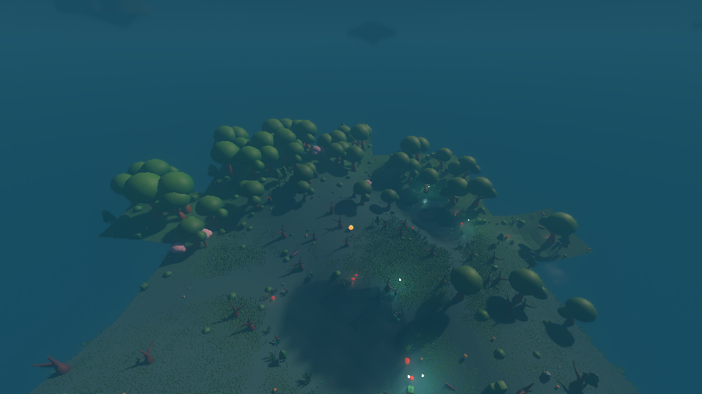
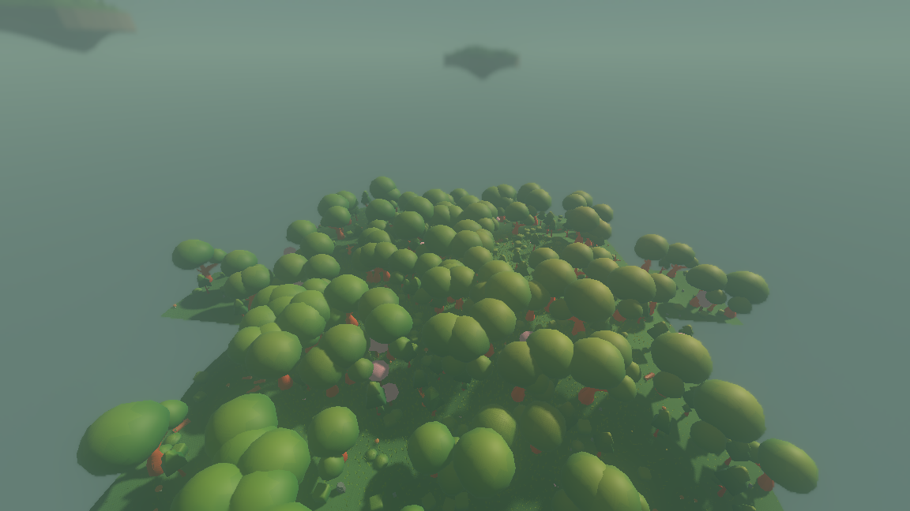
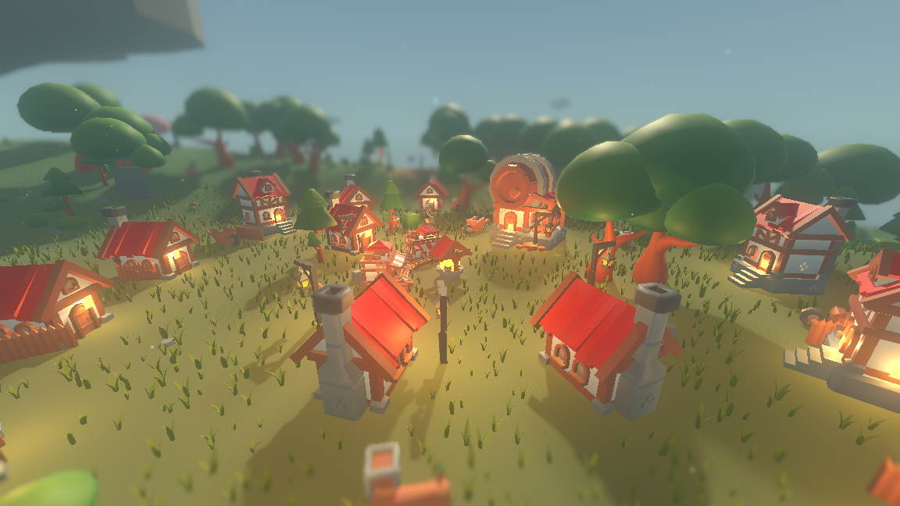
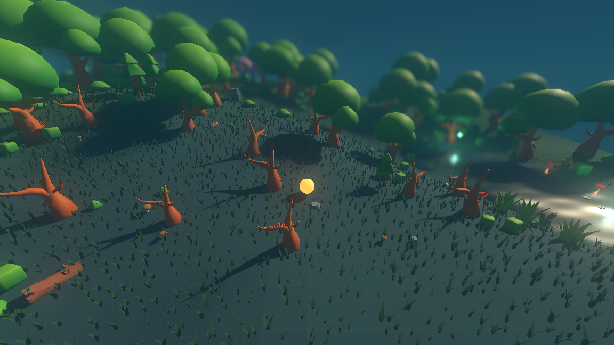
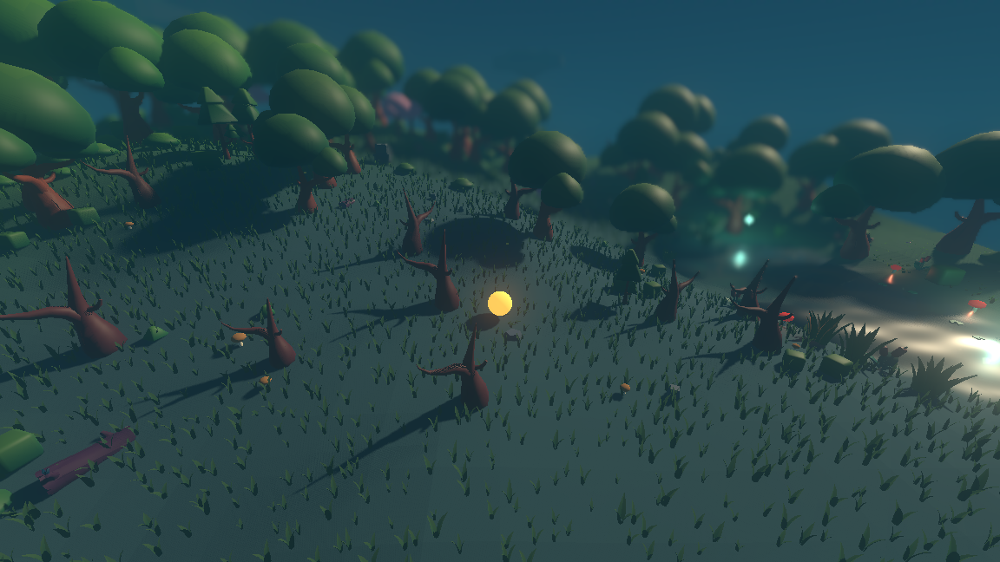

# The lighting and atmosphere stack

*Section 9.9 of the design: cool ambient base, warm pinpoint light, per-biome fog
and sky, bloom on every emissive, drifting motes, glowing orbs in the twilight
pockets, miniature depth of field, and soft long shadows — with the whole thing
absent from a headless run.*

Two new files carry it, both in the render shell and neither in the simulation:

| file | what it is |
| --- | --- |
| `render/atmosphere.gd` | the key light, the sky, the fog and the ground mist, the warm-neutral fill, the bloom, the miniature depth of field, the warm point light on every glowing tag, and the wandering of the orbs |
| `render/mote_field.gd` | the floating glowing particles: one instanced cloud that follows the view and never runs out |

`render/main.gd` lost its `GLOWING_TAGS` table, its `Environment`, its
`DirectionalLight3D` and its `_apply_atmosphere()` to the first of those, and
gained one flag, `--no-atmosphere`, that builds none of it.

---

## 1. Why the whole stack sits in the render shell

Every layer of the world up to the grass lives in `sim/`, on the rule that what
is in a place is a fact about the place: a character can walk into a tree,
shelter behind a boulder, cross a bridge. The grass was the first thing to fail
that test — nothing collides with a blade, picks one up, or will ever read one —
and so `render/grass_layer.gd` owns it outright.

Light fails the same test harder. No rule reads the fog, nothing collides with a
firefly, no combat lattice cares which way the shadows fall, and the world is the
same world in the dark. So the whole stack is in `render/`, and that is what
makes "headless skips the render stack" true **by construction** rather than by a
flag: a headless process never loads a single file under `render/`, so there is
no environment, no light, no bloom, no depth of field and no mote there to switch
off. They do not exist.

`tests/test_atmosphere.gd` checks that from both ends:

* **From outside.** A headless run reports the engine's own resource cache:
  `assets render-scripts found=7 loaded=0`. Seven files of the render layer exist
  — `atmosphere.gd` and `mote_field.gd` among them, checked by name — and the
  headless process loaded none of them.
* **From inside.** The same seed is run three ways — the shell with the whole
  stack, the shell with `--no-atmosphere`, and a bare `Simulation` with no
  renderer at all — and all three must reach one world fingerprint at tick 30.
  The two shell runs must also differ in the ways they are supposed to (one draws
  hundreds of motes and hangs dozens of warm lights, the other draws and hangs
  none), or a matching fingerprint would be a statement about two runs that did
  the same thing.

Measured, seed 5, tick 30:

| run | motes drawn | warm lights | world fingerprint |
| --- | ---: | ---: | --- |
| render shell, full stack | 934 | 29 | `2d8476c0c60239d2` |
| render shell, `--no-atmosphere` | 0 | 0 | `2d8476c0c60239d2` |
| render shell, `--no-grass --no-atmosphere` | 0 | 0 | `2d8476c0c60239d2` |
| bare `Simulation`, no renderer | — | — | `2d8476c0c60239d2` |

---

## 2. The mood is the biome's, not this layer's

Nothing about *what colour* anything is is decided in the render shell. The fog
colour and density, the sky gradient and the colour of the fill light are read
every frame off the blended `BiomeProfile` the simulation produced for wherever
the observer is standing. Because a profile is a blend rather than a lookup,
crossing a border slides all of them from one biome's numbers to the next over
the width of the border instead of switching them.

Two shots from **the same seed** (1234) on either side of one border, along the
line x = −216, with the same camera:



*z = −504, twilight marsh. Fog `(0.10, 0.26, 0.32)` at density 0.0090, sky top
`(0.06, 0.10, 0.20)`, fill `(0.28, 0.38, 0.46)`. Seventeen warm point lights are
in shot — five glowing orbs and twelve toadstools.*



*z = −580, seventy-six units further along the same line, deep forest. Fog
`(0.20, 0.32, 0.28)` at density 0.0042, sky top `(0.14, 0.26, 0.30)`, fill
`(0.42, 0.50, 0.44)`. No warm lights at all: nothing here glows.*

The suite reads those values back off the `Environment` and the
`ProceduralSkyMaterial` for all five biomes rather than taking the file's word
for it, and separately checks that the five carry five *distinct* moods — a table
of identical rows would otherwise pass.

### The fill light is warm-neutral, not the sky

This is the one line of the global grade that is easy to get wrong and invisible
when it is: taking the ambient from the sky is the engine default, and it pours
blue into every shadow until shadowed stone reads as shadowed slate. The
environment is set to `AMBIENT_SOURCE_COLOR` and given the biome's own
warm-neutral ambient.

Checked per unit of brightness, because the marsh's sky is nearly black and a raw
blue-minus-red against it would flatter any ambient at all. Writing
$b(c) = (c_B - c_R) / Y(c)$ where $Y$ is luminance:

| biome | fill $b$ | sky $b$ | stone lit by fill | stone lit by sky |
| --- | ---: | ---: | ---: | ---: |
| meadow | −0.03 | 1.00 | 0.02 | 0.97 |
| deep forest | 0.04 | 0.67 | 0.04 | 0.64 |
| highland | 0.12 | 0.91 | 0.12 | 0.92 |
| blossom grove | −0.05 | 0.45 | 0.06 | 0.45 |
| twilight marsh | 0.49 | 1.42 | 0.49 | 1.48 |

The last two columns are the same statement made about a thing rather than about
a light: stone in shadow is the rock tint multiplied by the fill, and its colour
has to still be stone's colour. In the four daylight biomes the shift is 0.12 or
less; filling from the sky instead would shift it by 0.45 to 0.97. The twilight
marsh is the deliberate exception — it is the eerie pocket, and stone in it is
*supposed* to go cold — so there the suite asks only the relative claim, which
still holds by a factor of three.

---

## 3. Warm pinpoints

Six tags carry a point light, hung on the node the simulation placed. What
glows is the simulation's decision; how brightly is this layer's.

| tag | height | colour | energy | reach | where |
| --- | ---: | --- | ---: | ---: | --- |
| `lantern_post` | 2.5 | `(1.00, 0.74, 0.40)` | 3.2 | 12.0 | everywhere |
| `hanging_lantern` | 1.9 | `(1.00, 0.74, 0.40)` | 2.4 | 9.0 | everywhere |
| `campfire` | 0.5 | `(1.00, 0.60, 0.28)` | 4.0 | 14.0 | everywhere |
| `window_glow` | 1.25 | `(1.00, 0.76, 0.42)` | 2.0 | 8.0 | everywhere |
| `glowing_orb` | 1.3 | `(0.62, 0.94, 0.86)` | 2.6 | 10.0 | everywhere |
| `toadstool` | 0.42 | `(0.95, 0.55, 0.42)` | 1.1 | 3.2 | gloom ≥ 0.40 |

Five of the six are warm, checked as $r > g > b$. The orb is the deliberate
exception and is checked for being the exception — it is the marsh's cold
witch-light and the one cool pinpoint in the palette.

Every one of them is also checked against the asset table: the tag has to be one
the simulation can place, and its row has to carry at least one emissive part. A
light on a matte object would be a glow with no source hanging in the air over
something dark.

**The toadstool is gated, and that is a cost decision.** The glowing mushroom of
section 9.1 shares a name with the Toadstool minion and is the design's own
ground-level light for the eerie pockets — but a marsh view holds a dozen of
them, a meadow view holds a few, and in an open meadow a toadstool's cap is a
cute detail that lights nothing anyone can see. So it glows everywhere (the
emissive cap is in the asset table) and only *casts* where casting reads. The
gate is the biome's own gloom — its fog density as a share of the marsh's, the
same number the motes are counted by, so "dark enough for a toadstool to be a
light source" and "dark enough for fireflies to be thick" are one number rather
than two that can drift apart.

### Bloom

`glow_enabled`, additive, threshold at **1.0** — white. Nothing below white
blooms, which is the difference between a cosy glow and a hazy smear over the
whole frame; the emissive parts in the asset table run from 2.4 (a lit window
pane) to 5.0 (an orb), all far above it. The suite checks the threshold against
the brightest emissive the world actually holds, so a table edit that dimmed
every light would fail rather than quietly stop blooming.

---

## 4. The motes

`MoteField` is a fixed pool of **1500** instances of one quad, laid out once in a
box 92 units across and 26 tall, drawn as one draw call. Everything that moves is
a function of the mote's own base position and of time inside the shader: each
one wanders on three circles of unrelated periods, rises slowly, breathes, and is
wrapped back into the box around wherever the view is centred. Walking a hundred
units builds nothing — the motes behind you come round in front of you — and the
only thing written per frame is the one uniform saying where the middle of the
box now is. A mote fades to nothing at 42 units from the centre, well inside the
46-unit half-box, so the wrap happens where nothing is drawn.

They are always warm — amber, pale gold, ember, spore — never the colour of the
biome. The whole signature is warm pinpoints against a cool ground, and a teal
firefly in a teal marsh would disappear into it.

**Density is biome-tuned, and it is read off two numbers the profile already
carries.** No new field was added anywhere in the simulation. Writing
$g = \min(1, \text{fog\_density} / 0.009)$ for how gloomy a biome is (0.009 is
the marsh's own fog density, so the marsh scores 1) and $f$ for its foliage
density:

$$d = 0.15 + 0.55\,g + 0.35\,f$$

Both halves already mean the right thing. The design asks for the most fireflies
in the gloomy enclosed hollow, which is also the biome with the thickest fog, and
the fewest on the bare windswept tops, which is also the one that grows almost
nothing.

| biome | $g$ | $f$ | density | motes drawn |
| --- | ---: | ---: | ---: | ---: |
| meadow | 0.13 | 0.45 | 0.381 | 571 |
| deep forest | 0.47 | 0.95 | 0.739 | 1109 |
| highland | 0.22 | 0.18 | 0.335 | 503 |
| blossom grove | 0.28 | 0.60 | 0.513 | 769 |
| twilight marsh | 1.00 | 0.70 | 0.945 | 1418 |

Brightness rides on the same $g$, from 0.55 in the clearest air to 1.60 in the
thickest, so a firefly is a hint in an open meadow and the light source in a
twilight hollow.

Changing the count **rebuilds nothing**: it is one integer on the multimesh, the
same trick the grass uses for its level of detail, and it matters more here
because the biome under a walking observer changes continuously. The suite checks
that the instance buffer is byte-identical before and after a change — if it were
re-hashed, every mote on screen would jump as the observer crossed a border. The
pool is laid out in hashed rather than stepped order so that drawing a prefix of
it thins the whole box evenly instead of clearing one side of the view; that is
checked too, by requiring the first tenth of the pool to span at least 85% of the
box.

---

## 5. The orbs — and one change to the simulation

A glowing orb is a prop the **scatter layer** places on wet ground in the
twilight marsh. This layer's whole part in it is to hang a light on it and make
it wander: two circles of unrelated periods around the point the simulation put
it on, 0.85 units of reach at 0.11 radians per second, so a full circuit takes
the better part of a minute. It is exactly the split the far-sky islands already
use — the simulation says where the thing is, the picture breathes around that
point — and the suite checks both halves: that the node moves, that it never
leaves the neighbourhood of its anchor, and that the world's fingerprint is
unchanged while it wanders.

**The one simulation change in this task.** The acceptance line asks that
twilight pockets carry orbs that light their surroundings, and they did not. The
orb was on the *prop* lattice — four times the cell size, for large things meant
to be noticed one at a time — while also demanding wet ground, which is a thin
ring of cells rather than a stretch of country. The two conditions almost never
met. Surveyed over thirty-one twilight-marsh views across two seeds:

| | orbs per marsh view | most in one view |
| --- | ---: | ---: |
| before (prop lattice, weight 0.140) | 0.03 | 1 |
| after (flora lattice, weight 0.030) | 0.81 | 5 |

An orb is the size of a cattail and grows where a cattail grows, so it was moved
into the waterside flora it belongs with, rarer than the cattails and toadstools
it stands among because it is the one thing in the pocket that gives off light.

The weight is capped from above by something outside the row: the biome catalog
advertises a foliage density per biome, and `tests/test_scatter.gd` requires the
flora of the marsh (0.70) to add up to less than the flora of the deep forest
(0.95) or the two catalogs are telling different stories. 0.030 is what fits
under the deep forest's total without moving any other row. A denser scattering
of orbs would need that trade made deliberately — trimming another marsh row —
and that is a scatter-layer decision rather than a lighting one.

**This changed the world fingerprint**, because it changed what the world
contains. Seed 1234 over 100 ticks moves from `6d2f2a19a21f9381` to
`d43c66e5293d8e29`. Determinism is unaffected: that new value reproduces byte for
byte in two separate headless processes, and every fingerprint comparison in the
suites is between runs of the same code. Fingerprints quoted in reports written
before this task no longer reproduce, and that is the cost of the change.

---

## 6. Depth of field and shadows

**Miniature depth of field.** A `CameraAttributesPractical` with *both* sides on
— near blur inside the subject and far blur beyond it. One-sided background blur
is a landscape photograph; blurring both ends is what a real lens focused this
close does, and reproducing it on a landscape is what makes the landscape read as
a model of one. The band is set as fractions of how far the camera is from what
it is looking at (0.46 and 1.80, transition 1.10, amount 0.06) rather than as
fixed distances, so a report that moves the camera in for a detail shot gets a
correspondingly tight band instead of a frame that has gone entirely soft.

**Soft long shadows.** The sun sits 36° above the horizon, so a thing throws a
shadow 1.38 times its own height. Its apparent width is 1.2° — a little over
twice the real sun's 0.53° — which turns a hard stencil edge into a penumbra that
widens with distance from whatever cast it, and `shadow_blur` is 1.2 on top of
that. Much softer than this and a tree's shadow stops being a shadow and becomes
a smudge.

Two things were tuned against real pictures rather than reasoned about:

* **Shadow azimuth.** At the yaw first chosen, tree and building shadows fell
  away from the diorama camera and were hidden behind the things casting them —
  the wide village shot had no visible shadow anywhere in it. The sun was turned
  to 122°, a three-quarter back-light, so shadows rake toward the viewer while
  faces still catch the key. This is the single change that made the shadows
  visible at all in a wide shot.
* **Shadow bias.** `shadow_normal_bias` pushes the depth comparison along the
  surface normal, and at a low sun that shrinks every shadow by roughly
  $\text{bias}/\tan(\text{elevation})$ — at 36° the 2.0 that had been inherited
  from the old high-sun setup ate 2.8 units from every edge, which erases a
  tree's shadow entirely. It is 0.7 now, with `shadow_bias` 0.035, and the
  shadow map reaches 110 units rather than 160 so its resolution is spent on the
  diorama rather than on the horizon.

---

## 7. The four reference beats

Section 9.1 anchors the mood on four beats. **The reference images themselves are
not on this machine** — the folder the design names, `~/Desktop/game visual
inspiration`, was searched for across the Linux home and both mounted Windows
drives and does not exist here — so each of these is measured against the
*written* description of the beat, and each note below says where it falls short
of that description rather than of a picture nobody here has seen.

All four are seed 1234, held still with `--paused` and captured at frame 150 so
the shadow atlas has settled.

### Beat 1 — cozy daytime village


`--start -88.8 4.7 --camera 0 26 44 --aim 4`

*Written target: bright saturated low-poly meadow, warm dirt paths, stone/wood
bridges, cone-firs and pebble-rocks, banner-hung timber houses, strong tilt-shift
so it reads as a toy set.*

**Where it falls short.** The tilt-shift reads and the warm windows read, but
the ground is not *bright saturated* — the meadow's fog and the warm-neutral fill
together pull it towards a hazy olive, and the hillside a hundred units off is
half gone. Nothing on screen is banner-hung, because there is no banner in the
prop catalog. The village sits in deep forest rather than in an open meadow, so
its palette is a shade darker than the beat asks for; the settlement layer does
not currently prefer meadow sites. And the shadows here are visible mainly under
the buildings — at this camera distance a tree's shadow is soft enough to read as
shading rather than as a cast shadow.

### Beat 2 — misty twilight forest


`--start -216 -504 --camera 0 20 34 --aim 2`

*Written target: teal-blue gloom, tall silhouetted firs, drifting yellow
fireflies, one warm lantern on a stump, cattails and lily pads. The eerie-but-cute
pocket.*

**Where it falls short.** The teal-blue gloom is right, the cattails are there,
and the orbs are doing what the beat's lantern does. But the firs are not tall
and not silhouetted — the marsh's own tree weights favour dead trees and the
canopy on the ridge is deep-forest green rather than a dark silhouette, so the
skyline reads as a hedge rather than as a stand of firs. The fireflies are
present but sparse-looking at this distance: a mote is a fraction of a pixel at
thirty units, and what carries is the orb glow rather than the drift. The dead
trees used to read bright orange against the teal, which was a model-tint
problem rather than a lighting one; they now take the biome's foliage colour at
full strength and sit in the gloom as dark plum silhouettes. Section 7.1 below
shows the pair. There is no lantern on a stump because nothing places one in
wild marsh.

### Beat 3 — night pond-house


`--start -2 -462 --camera 19 0.33 37.6 --aim -3.5 --focus 16 --fov 40`

*Written target: amber windows and hanging lanterns mirrored in still water,
fireflies, deep-blue ambient. The "amber-on-blue" signature at its purest.*

This beat had no subject in this world and now has one. Both halves of what it
was missing were built. The settlement layer learned to like a shore, so about
one village in six now stands with a pond or a lake lapping its pad — the rule is
in reports/settlements.md, section "Villages that want a shore", and the
enumeration that found the nearest water to any village 46 units away is in
reports/shore-survey-evidence.txt, re-run there after the change. And the water
learned to mirror what stands beside it, which is section 9 below.

The village photographed here is `s0,-2` on seed 1234, at (-15.8, -467.7) in open
meadow, with the lake touching the rim of its levelled ground. The frame is taken
from out on the lake with a narrow lens — `--fov 40`, and `--focus` puts the sharp
band on the reflection rather than on the observer. Both are new capture dials
and move the picture only.

**Where it falls short.** The mill, the water wheel, the bank, the blossom trees
and the hanging lantern are all clearly mirrored, and the lantern's amber lamp
reads as amber in the water. What is missing is the *night*, for the same reason
beat 4 is missing it: there is no time of day in this world, by the decision
recorded on 2026-08-26 — "no clock for now, just biome-specific lighting". So this
is amber-on-blue in the middle of the afternoon. The lake is a pale daylight blue
rather than the deep blue the beat asks for, and the windows are warm points
rather than the only light in the frame. Everything structural the beat needs is
now in the world; what remains is a clock, and there is deliberately not one.

The lit windows are also small, and that is the siting rule rather than the
framing. A village's buildings stand inside its levelled core, and the shore rule
keeps a band of dry ground outside that core, so there are always about ten units
of bank between the nearest house and the water. The mill and the water wheel are
the two buildings that stand closest to it, and they are what this frame is built
around.

### Beat 4 — torch-lit cinematic warmth



`--start -88.8 4.7 --camera -13 8 12 --aim 1.5`

*Written target: a knot of warm torchlight against a cool night gradient; how key
moments should feel.*

**Where it falls short.** The knot of warm light is there — a dozen lit windows,
a lantern post, blooming — and this is the shot where the long raking shadows do
their job. What is missing is the *night*: there is no time of day in this world
at all. Light level is a property of the biome, not of a clock, so "a cool night
gradient" can only be approached by standing in a dark biome, and this village is
not in one. Against a genuinely dark sky these same lights would carry the frame;
against a pale afternoon one they are warm pools on a lit ground. A day/night
cycle is the missing ingredient and it is not in the design's build order yet.

### 7.1 The one tint the marsh was missing

The beat-2 note used to say the dead trees read bright orange. They did, and it
was a tinting miss rather than a lighting one: the pack's bare tree is a single
mesh of warm orange-brown bark, and its row in the asset table named no tint role
at all, so it kept the colour the pack drew it in whatever biome it stood in. A
bare tree is the one model where that is fatal — there is no canopy to take the
biome's green, so the warm bark *is* the whole model.

It now takes the foliage role at full strength, and so does the fallen log, which
is the same bare bark from the same packs lying in the same ground. Full strength
rather than the living trees' 0.75 for the reason the blossom tree already uses
it: a fir's green is most of the way to any biome's green and only needs nudging,
while nothing about this model belongs to the marsh until the tint puts it there.
The gain is the biome's foliage colour over the reference green, so in the marsh
it is (0.40, 0.40, 0.93) — the red comes out and the blue stays — and in the
meadow, whose foliage colour *is* the reference, it is exactly white and the bark
is the brown the pack drew.

| the pack's own colours (`--no-model-tint`) | with the biome tint |
| --- | --- |
|  |  |

`--start -216 -504 --camera 0 9 16 --aim 2`, with and without `--no-model-tint`.

tests/test_asset_tags.gd holds the claim as arithmetic rather than as a look: the
row takes the foliage role, its gain in the marsh has less red than blue and
keeps under 55% of its red, and its gain in the meadow is white to within the
tint cache's quantisation.

"Named no tint role" is the shallow half of the reason. The deep half is that a
row *could* name none by saying nothing: the tint role was an optional trailing
argument defaulting to the same value a fence carries on purpose, so a repoint
that filled in the model and stopped was indistinguishable from a decision. That
step is now closed — a silent row inherits its placeholder's role, and a row that
contradicts its placeholder fails `./run_assets.sh`. reports/model-tint.md, "The
step the tint failed at, and why only there".

---

## 8. What it costs

Measured with `./tools/measure_atmosphere.sh`, which runs the render shell
itself — so what is priced is the frame the game actually draws, with the
terrain, the islands, the village, the props and the grass already in it. The
world is held still for the whole measurement, so every row prices the same view;
the tool prints the tick count to prove it. Each row is 120 frames after 30
frames of settling, and the pieces are switched off one at a time and put back.

**The streaming radius** is the terrain streamer's: chunks load out to 40 world
units and are dropped past 56, and the grass covers 38 of that. Both scenes below
are at that radius with everything streamed in.

**Deep-forest village**, `--start -88.8 4.7 --camera 0 26 44 --aim 4`.
34 chunks loaded, 802 motes drawn, 31 warm point lights.

| row | mean ms | median ms | vs full | omni lights | draw calls |
| --- | ---: | ---: | ---: | ---: | ---: |
| full | 247.59 | 247.11 | — | 31 | 1069 |
| − motes | 247.35 | 247.25 | +0.14 | 31 | 1068 |
| − warm lights | 240.92 | 240.60 | −6.52 | 0 | 1069 |
| − depth of field | 237.49 | 237.09 | −10.02 | 31 | 1069 |
| − bloom | 232.48 | 232.29 | −14.83 | 31 | 1069 |
| bare (all four off) | 216.16 | 215.59 | −31.53 | 0 | 1068 |

**Twilight marsh**, `--start -216 -504 --camera 0 20 34 --aim 2`.
29 chunks loaded, 1418 motes drawn, 17 warm point lights.

| row | mean ms | median ms | vs full | omni lights | draw calls |
| --- | ---: | ---: | ---: | ---: | ---: |
| full | 236.83 | 236.96 | — | 17 | 900 |
| − motes | 236.61 | 236.47 | −0.48 | 17 | 899 |
| − warm lights | 232.04 | 231.91 | −5.04 | 0 | 899 |
| − depth of field | 228.19 | 228.05 | −8.90 | 17 | 900 |
| − bloom | 221.85 | 221.65 | −15.31 | 17 | 899 |
| bare (all four off) | 207.70 | 207.68 | −29.28 | 0 | 900 |

The four pieces separately account for 31.2 ms and 29.7 ms; switched off together
they save 31.5 ms and 29.3 ms. The pieces are additive to within the noise, which
is what says the rows are measuring what they claim to.

**How to read these numbers.** This machine has no GPU: the engine is running on
`llvmpipe` under `xvfb`, so every millisecond is software rasterisation and the
absolute frame time — a quarter of a second — is not the game's frame rate and
never will be. What carries across to real hardware is the shape:

* **The whole stack is 12–13% of the frame**, and it is a bounded cost, not one
  that grows with how far you can see. Bloom and depth of field are full-screen
  passes whose cost depends on resolution, not on the world; the motes are a
  single draw call of a fixed 1500 instances however far the streamer reaches;
  and the point lights are bounded by how much lit content is inside a 40-unit
  radius, which is 31 at the densest village in this world.
* **The motes are free** — 0.14 ms and −0.48 ms, both inside the noise, on a
  software rasteriser drawing 1418 of them. That is the payoff of building them
  as one instanced cloud that the shader moves, rather than as a particle system
  the processor steps.
* **The two full-screen passes are the cost**, 10 ms and 15 ms here. On a GPU
  these are the two cheapest things in the list, which reverses the ordering
  above; on software rasterisation they dominate because every pixel is touched
  several times.
* **A warm point light is about 0.21 ms** (6.52 ms over 31 lights) on this
  rasteriser. That is the number the toadstool gate was set against: without it
  a marsh view would carry a dozen more, and the gate is what keeps the light
  count in the low tens rather than the low hundreds.

---

## 9. The water's reflection

Until this cycle the water shader animated ripples and a little sparkle and
reflected nothing at all. Half of what makes section 9.1's third beat is a
reflection, so this is the other half of that beat, and it is also the thing that
makes a marsh pond and an island's basin read as water rather than as coloured
glass.

### The technique, and the two it was chosen over

Three techniques were on the table. Two of them cannot draw this beat:

* **Screen-space reflections.** Godot's SSR traces the depth buffer, and the
  depth buffer only holds what is already on screen. The lit window reflected in
  the pond in front of a house is very often a window above the top of the frame,
  and SSR has nothing to trace for it — it fades the reflection out exactly where
  the beat needs it. It also does not apply to transparent surfaces in Forward+,
  and this water is transparent by construction: its alpha is its depth, which is
  what makes a shore fade out instead of ending at a line.
* **A reflection probe.** A cube map is cheap and is the right answer for a
  rough, curved, incidental reflection. It is the wrong answer for a flat mirror:
  a probe is one point sample of the surroundings, so a pond twenty units across
  reflects the same cube map at both ends and the house does not move as you walk
  past it. What a probe gives is a glow on the water, not a mirrored window.
* **A planar mirror** — what was built. The scene is drawn a second time from the
  camera reflected through the water's plane, and the water samples that image
  where it lands on screen. It is the only one of the three that puts a
  *recognisable* window in the water, which is what the beat is.

### The plane is the water table

A planar mirror needs one plane, and the world's water is not one surface — a
river follows the ground downhill. Standing water is, by construction: the water
layer defines a pond as ground that has fallen below a broad, slowly wandering
water table, so every pond and lake is exactly level with that table. So the
mirror plane is `WaterField.table_level_at()` under the viewer. Where there is
standing water that plane is the water's own surface and the reflection is exact;
on a river it is out by however far the river has cut below the table, which is
where a mirror matters least — a stream in a gully reflects the sky.

### Handedness, and why the shader flips u

Reflecting a camera's basis through a plane flips its handedness, and a
left-handed camera reverses the winding of every triangle, so back-face culling
would cull the fronts and the ground would vanish from the mirror. The mirror
camera is therefore *not* built by reflecting a basis. It is aimed from the
reflected position at the reflected target with the reflected up vector, which is
right-handed and draws the world correctly — and which differs from the true
mirror by a left-right flip. The water shader undoes that flip by sampling at
`1.0 - u`, which costs one subtraction per water fragment.

tests/test_reflection.gd checks that this really is a mirror as arithmetic rather
than as a look: the camera stands directly over the main camera's position, as far
under the plane as the main camera is over it, looking back up at the negative of
its pitch, along the same bearing, through the same lens.

### What it costs

Measured with `./tools/measure_reflection.sh`, which runs the render shell itself
and holds the world still, so every row prices the same view. Each row is 120
frames after 30 frames of settling. The `off` row disables the mirror's viewport
and sets the shader's strength to zero, which is exactly what `--no-reflection`
does at start-up — so it is the frame the game drew before this feature existed.

**Lakeside village**, `--start -10 -466 --camera 19 0.33 37.6`. 30 chunks loaded,
window 1152×648.

| row | mean ms | median ms | vs off | mirror px | draw calls |
| --- | ---: | ---: | ---: | ---: | ---: |
| off | 156.82 | 156.78 | — | — | 641 |
| quarter | 245.67 | 245.70 | +88.92 | 288×162 | 1353 |
| **half (shipped)** | **255.71** | **255.54** | **+98.76** | 576×324 | 1350 |
| three-quarter | 268.17 | 268.15 | +111.37 | 864×486 | 1351 |
| full | 286.55 | 286.70 | +129.92 | 1152×648 | 1352 |

**Deep-forest village with a river in view**, `--start -88.8 4.7 --camera 0 26 44
--aim 4`. 34 chunks loaded.

| row | mean ms | median ms | vs off | mirror px | draw calls |
| --- | ---: | ---: | ---: | ---: | ---: |
| off | 247.29 | 247.08 | — | — | 1072 |
| quarter | 414.21 | 414.11 | +167.02 | 288×162 | 2496 |
| **half (shipped)** | **427.86** | **427.51** | **+180.43** | 576×324 | 2492 |
| three-quarter | 443.10 | 442.91 | +195.83 | 864×486 | 2486 |
| full | 458.78 | 458.50 | +211.41 | 1152×648 | 2480 |

**Highland village with no water in the streamed window**, `--start 6.39
-1035.36 --camera 0 26 44 --aim 4`. 30 chunks loaded.

| row | mean ms | median ms | vs off | mirror px | draw calls |
| --- | ---: | ---: | ---: | ---: | ---: |
| off | 151.41 | 151.46 | — | — | 580 |
| quarter | 151.37 | 151.21 | −0.26 | 288×162 | 580 |
| half | 151.87 | 151.68 | +0.22 | 576×324 | 580 |
| three-quarter | 152.07 | 152.12 | +0.66 | 864×486 | 580 |
| full | 151.62 | 151.79 | +0.33 | 1152×648 | 580 |

**How to read these numbers.** The same caveat as section 8: this machine has no
GPU, so every millisecond is `llvmpipe` software rasterisation under `xvfb` and
the absolute frame time is not the game's frame rate. What carries is the shape,
and the shape here is blunt.

* **A planar mirror is a second view of the world, and it costs like one.** The
  draw calls roughly double in both wet scenes — 641 → 1350 and 1072 → 2492 — and
  the frame goes up by 63% and 73%. This is the honest price of the technique and
  no amount of tuning removes it; it is why the two cheaper techniques were
  weighed at all, and why neither was chosen only after establishing that neither
  can draw the beat.
* **Resolution is the small half of the bill.** Between a quarter and full
  resolution the frame moves by 41 ms and 44 ms, against the 89 ms and 167 ms the
  first mirrored frame costs at any size. Most of the cost is walking and
  submitting the scene a second time, which is resolution-independent. On a GPU
  that ordering reverses — geometry submission is cheap and pixels are the bill —
  which is exactly why the mirror is drawn at half the window per side: it is the
  dial that matters on the hardware this will actually run on, and half is where
  softening starts to show on the straight edge of a roof.
* **Where there is no water it is free.** The third table is the gate working: the
  mirror is not drawn at all unless the water sheet is on screen, so the cost is
  ±0.7 ms — inside the noise — at every resolution, and the mirror frame counter
  reads zero. 8.3% of this world is water, so most of a walk pays nothing.
* **Everything else that could be cut, is.** The mirror sees 220 units where the
  camera sees 900, so the far-sky islands are not drawn twice. It has no MSAA, no
  temporal anti-aliasing, no debanding and no shadow atlas of its own. It never
  draws the water — the sheet and the island ponds are on their own visual layer,
  which the mirror camera's cull mask excludes, so water cannot reflect water.
  And it is skipped entirely when the camera is under the plane.

### What the shader does with it

Four things, and each is there because its absence was visible in a capture:

* **The lookup is warped by the ripple's own slope**, so a reflected roof wobbles
  instead of sitting on the water like a decal. In screen widths, so it has to be
  small: at 0.055 a roof was dragged sixty pixels sideways and arrived as a smear;
  it ships at 0.012.
* **Fresnel is squared, not cubed, over a floor of 0.40.** Physical water is
  barely a mirror until it is seen almost along the surface — a pond photographed
  from a bank at twenty degrees returns about a fifth of what hits it, which is a
  milky veil over the village rather than a reflection of it. This is a stylised
  pond, so the curve is opened up until a reflection reads at the angles the
  diorama camera actually stands at.
* **The mirror is scaled by the water's own alpha, which is its depth.** Without
  that, a shore that fades out because there is barely any water there still
  carried a film of reflected sky, and the sheet read as overlapping the bank.
* **The analytic specular is turned down where the mirror is strong**, from 0.55
  to 0.12. The renderer's specular highlight is its guess at the reflection of the
  key light; where there is a real reflection that light is already in the
  mirrored image, and leaving both on counted the sun twice and burned a white
  hole in the water. The mirrored colour is also held below 0.72 with its hue
  intact, because the mirror arrives with its own bloom already in it.

---

## 10. How to reproduce every picture and number here

```bash
# the four beats and the border pair
xvfb-run -a ./run_render.sh --seed 1234 --start -88.8 4.7 --paused \
	--camera 0 26 44 --aim 4 \
	--screenshot "$PWD/reports/assets/atmosphere-beat-1-village.png" --screenshot-frame 150
xvfb-run -a ./run_render.sh --seed 1234 --start -216 -504 --paused \
	--camera 0 20 34 --aim 2 \
	--screenshot "$PWD/reports/assets/atmosphere-beat-2-twilight.png" --screenshot-frame 150
xvfb-run -a ./run_render.sh --seed 1234 --start -2 -462 --paused \
	--camera 19 0.33 37.6 --aim -3.5 --focus 16 --fov 40 \
	--screenshot "$PWD/reports/assets/atmosphere-beat-3-pond.png" --screenshot-frame 150
xvfb-run -a ./run_render.sh --seed 1234 --start -88.8 4.7 --paused \
	--camera -13 8 12 --aim 1.5 \
	--screenshot "$PWD/reports/assets/atmosphere-beat-4-warmth.png" --screenshot-frame 150
xvfb-run -a ./run_render.sh --seed 1234 --start -216 -504 --paused \
	--screenshot "$PWD/reports/assets/atmosphere-border-marsh.png" --screenshot-frame 150
xvfb-run -a ./run_render.sh --seed 1234 --start -216 -580 --paused \
	--screenshot "$PWD/reports/assets/atmosphere-border-forest.png" --screenshot-frame 150

# the dead-tree tint pair
xvfb-run -a ./run_render.sh --seed 1234 --start -216 -504 --paused --camera 0 9 16 --aim 2 \
	--screenshot "$PWD/reports/assets/dead-tree-tinted.png" --screenshot-frame 150
xvfb-run -a ./run_render.sh --seed 1234 --start -216 -504 --paused --camera 0 9 16 --aim 2 \
	--no-model-tint \
	--screenshot "$PWD/reports/assets/dead-tree-untinted.png" --screenshot-frame 150

# the frame cost
xvfb-run -a ./tools/measure_atmosphere.sh --seed 1234 --start -88.8 4.7 --camera 0 26 44 --aim 4
xvfb-run -a ./tools/measure_atmosphere.sh --seed 1234 --start -216 -504 --camera 0 20 34 --aim 2

# what the mirror costs, wet and dry
xvfb-run -a ./tools/measure_reflection.sh --seed 1234 --start -10 -466 --paused \
	--camera 19 0.33 37.6 --aim -3.5 --focus 16 --fov 40
xvfb-run -a ./tools/measure_reflection.sh --seed 1234 --start -88.8 4.7 --paused \
	--camera 0 26 44 --aim 4
xvfb-run -a ./tools/measure_reflection.sh --seed 1234 --start 6.39 -1035.36 --paused \
	--camera 0 26 44 --aim 4

# the villages and how near the water they stand, before and after the shore rule
./tools/measure_shore.sh --seed 1234 --span 1100

# the suites, including the atmosphere one
./run_tests.sh
```

To see it moving rather than in stills, `./run_render.sh --seed 1234 --start -216 -504`
and watch the orbs wander and the motes drift; `--no-atmosphere` on the same seed
draws the identical world with the lights out, and `--no-reflection` draws it with
the water flat.
