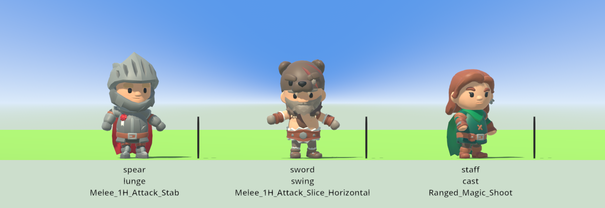
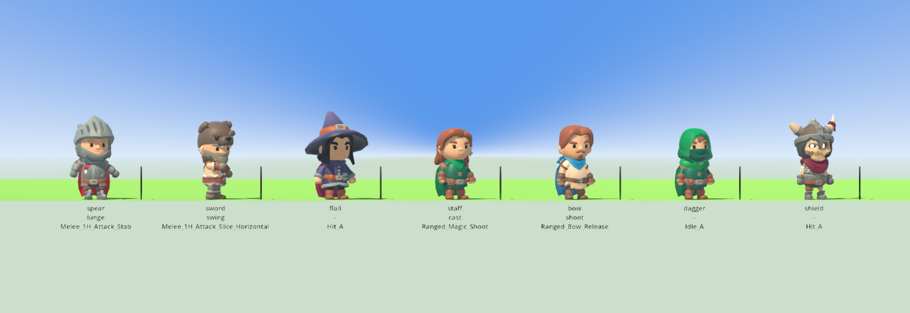
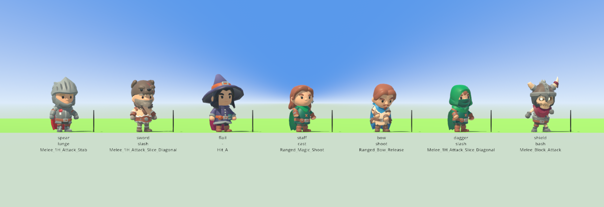

# A motion per item

The simulation has been able to say *which motion* a blow is since the composable
effect base landed. `sim/attack.gd` carries an animation tag on every attack and
`sim/asset_tags.gd` names the seven there are — `lunge`, `slash`, `swing`,
`shoot`, `cast`, `spin`, `bash` — and every weapon in the catalogue sets one. The
render layer could not draw any of them: `render/character_rig.gd` loaded two of
its eight clip files, and its own comment said the combat, tool, special and
advanced-movement libraries were unloaded "because nothing yet produces the state
that would choose one". The widened blow record produces exactly that state.

This is the render half: the two combat clip files, the table from the seven tags
to the clips that play them, and the branch of the animation rule that picks one.

## The two files, and what they cost

`CharacterRig.CLIP_FILES` now names four `Rig_Medium` files instead of two.
`CombatMelee` (22 clips) and `CombatRanged` (20) join `General` and
`MovementBasic`, and the one shared library goes from 24 clips to 64.

Measured with `./tools/measure_clips.sh`, one process per set so the engine's own
cache of a file it has already opened cannot flatter the second measurement:

| what | files | clips | assembled in | static memory |
|---|---|---|---|---|
| what was loaded before | 2 | 24 | 9.4 ms | +1.04 MiB |
| what was added | 2 | 40 | 10.6 ms | +1.46 MiB |
| what is loaded now | 4 | 64 | 19.4 ms | +2.18 MiB |

(The memory figures repeat exactly between runs; the times move by a
millisecond or so.)

So the two combat files cost about **10 ms and 1.1 MiB more than the two that
were already there**, and both numbers are paid once. The same tool times three
characters being mounted in a row:

```
when it is paid
  character 1 mounted in   25.2 ms, libraries assembled so far: 1
  character 2 mounted in    0.3 ms, libraries assembled so far: 1
  character 3 mounted in    0.3 ms, libraries assembled so far: 1
```

The library is assembled on the first ask and the same object is handed back
after, so the second character on the same skeleton pays nothing. In the game the
first ask is the observer's model being mounted in the shell's setup — before a
frame is drawn — and every commander that appears when a fight starts gets the
library that is already there. **The stop condition did not fire:** nothing was
loaded inside a drawn frame, and even if it had been, ten milliseconds is under
one frame at sixty a second.

The four files that stay unloaded — Tools, Simulation, Special,
MovementAdvanced — stay unloaded for the reason all six used to: nothing produces
the state that would choose one. `tests/test_attack_clips.gd` opens each of them
and requires it to hold at least one clip the library does not, so this is
checked against the files rather than asserted in a comment.

## The table

One row per motion tag, beside the list of files the clips come out of, because
the clip a row names has to be in one of those files:

| tag | clip | seconds | ticks | why this clip |
|---|---|---|---|---|
| lunge | Melee_1H_Attack_Stab | 1.600 | 32 | the spear's thrust: one hand, straight ahead |
| slash | Melee_1H_Attack_Slice_Diagonal | 1.000 | 20 | the dagger's and the sword's cut |
| swing | Melee_1H_Attack_Slice_Horizontal | 1.367 | 28 | the sword's cleave: a sweep across the arc it covers |
| shoot | Ranged_Bow_Release | 1.333 | 27 | the bow, loosing rather than drawing |
| cast | Ranged_Magic_Shoot | 0.933 | 19 | the staff's fireball, thrown rather than summoned |
| spin | Melee_2H_Attack_Spin | 2.400 | 48 | the flail's sweep, all the way round like its pattern |
| bash | Melee_Block_Attack | 1.067 | 22 | the shield's shove: a strike made from behind a guard |
| *(no row)* | Melee_Unarmed_Attack_Punch_A | 1.167 | 24 | the fallback: plainly a blow, plainly not a weapon's own |

Four things are checked rather than trusted, and a typo in any of them is a
failing suite rather than a character standing still in a fight:

* every **key** is one of `AssetTags.ANIMATIONS` — a tag this table invented
  would fail;
* every one of the **seven tags** has a row — a tag with no clip would fail;
* every **clip name** is in the assembled library — a misspelt clip would fail;
* every row's **ticks** is that clip's own length at the shell's twenty ticks a
  second, rounded up — a length that drifts from the pack would fail.

`ticks` is how long the motion lasts, and it is the only number the render layer
adds to what the simulation said. The simulation says which motion and which tick
it began on; the clip says how many seconds it runs for; the subtraction is in
`CombatDiorama`.

## The branch

`CharacterView.clip_for()` gained one branch and stayed a pure function of the
state handed to it:

```
dead        -> Death_A
striking    -> the motion's clip, or the punch
hurt        -> Hit_A
jumped/rise -> Jump_Full_Short
speed       -> Idle_A / Walking_A / Running_A
```

Striking sits **above** being hurt, and that ordering is the one judgement in the
rule: a blow being struck is something happening on this tick, said by a record
that names the tick it began on, while `hurt` on a board is a wound already
taken. A character that is swinging swings.

What fills `attack` is `CombatDiorama.striking()`, which walks the snapshot's own
blow rows backwards for the striker's most recent blow in the fight now on the
board and compares the world's clock with the tick that blow began on. Everything
it reads is in the dictionary handed to it. The suite holds the new branch to the
same test the six before it are held to — the same state gives the same clip
whatever was drawn before, checked against a deliberately broken rule that has to
fail the same comparison.

## Seven weapons, one seeded run

`tests/test_attack_clips.gd` stands the catalogue's seven weapons on one board —
one commander each, seed 1234, 240 ticks — and steps it, putting every tick's
snapshot through `CombatDiorama.placements()` and `CharacterView.clip_for()`: the
same two calls `render/main.gd` makes. `./tools/measure_swings.sh` prints that
run and the suite asserts over it, so the trace and the claim cannot disagree.

All seven motions are struck. The first five ticks alone use four different
weapons:

```
   tick by       weapon   attack     motion  clip                                ticks
      1 Ash      spear    thrust     lunge   Melee_1H_Attack_Stab                   32
      2 Bryn     sword    cleave     swing   Melee_1H_Attack_Slice_Horizontal       28
      4 Dell     staff    fireball   cast    Ranged_Magic_Shoot                     19
      5 Esk      bow      loose      shoot   Ranged_Bow_Release                     27
     13 Finn     dagger   stab       slash   Melee_1H_Attack_Slice_Diagonal         20
     14 Gale     shield   shove      bash    Melee_Block_Attack                     22
```

Photographed at tick 12 of that run — `xvfb-run -a ./tools/swing_sheet.sh --only
spear,sword,staff --cell 4.0 --screenshot-ticks "12:reports/assets/swings-three-tick-12.png"`,
seed 1234:



The same run at tick 6 and tick 16, all seven commanders on one sheet:





The characters are laid out in a row at a fixed angle rather than where the board
says they stand, because the question a frame answers is which motion each is
playing. Everything else — which clip, how far into it, when it starts, when it
stops — is the shell's own calculation, and the fight behind it is the fight.

## It runs while the blow does

Timed against the tick the record names, not by eye. For every blow the run
landed, the striker's frames are checked on the tick it began, on the last tick
its clip should still be running, and on the tick after:

```
every motion timed
  117 comparisons against the tick the record names, 0 wrong
```

One blow followed the whole way, printed by the same tool — Dell's fireball,
struck on tick 143, whose clip lasts 19 ticks:

```
   tick motion  clip                               began on
    142 -       Hit_A                              -
    143 cast    Ranged_Magic_Shoot                 143
     ...
    161 cast    Ranged_Magic_Shoot                 143
    162 -       Hit_A                              -
```

It begins on the tick the record names and ends nineteen ticks later, which is
the length of the clip and not a number chosen for it.

**One honest limit, found by this run and reported rather than smoothed over.**
Six of the 123 comparisons were skipped, because the snapshot carries the last
eight blows *of the whole world* and in a seven-commander brawl a blow can be
pushed out of it while its motion is still meant to be running. A render layer
reading only the snapshot has nothing left to draw from, so the motion stops
early. Seven commanders swinging at once is well past what that window holds; a
duel is nowhere near it. The frames therefore record which of a striker's blows
the snapshot still carried, and a blow that had been dropped is counted rather
than checked — `dropped` in `TestAttackClips.timings()`, printed by
`./tools/measure_swings.sh`.

## The fallback

A motion tag with no row plays `Melee_Unarmed_Attack_Punch_A`: a punch. An attack
whose tag this table has never heard of still happened, and the one thing it must
not look like is nothing at all — a character standing perfectly still while
somebody loses hit points is a bug that reads as a missing feature.

**Nothing shipped takes it: 0 of the catalogue's 8 attacks.** All seven tags of
the simulation's vocabulary have a row, which is why the number is zero and why
the suite asserts that it is — the day somebody composes an eighth motion, the
count moves and the suite says so.

## What the simulation gained

Nothing. `sim/` names no clip: the suite scans every file under it for each of
the fifteen clip names this table can return and finds none, which is the half of
the rule `tests/asset_check.gd` cannot see — a clip name is not a path, so a
simulation that named `Melee_1H_Attack_Stab` would pass the asset check and still
know what a swing looks like. All four structure checks pass.
