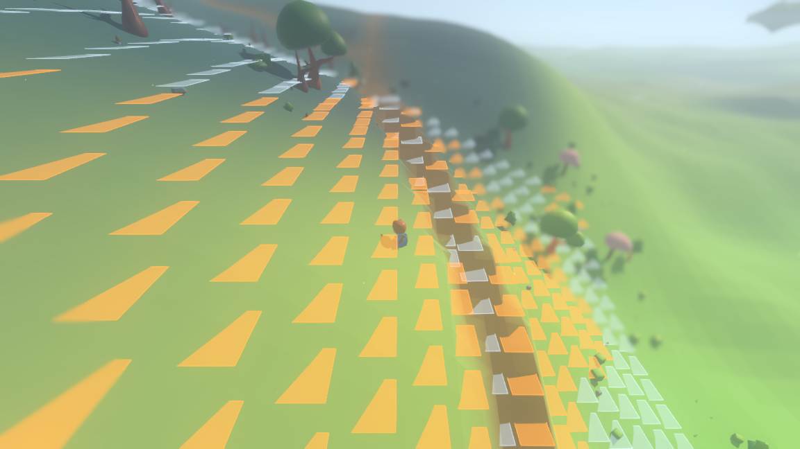
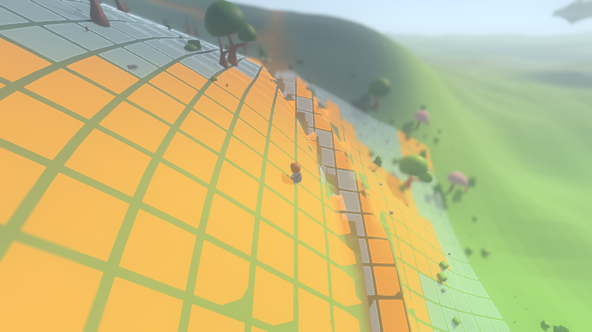
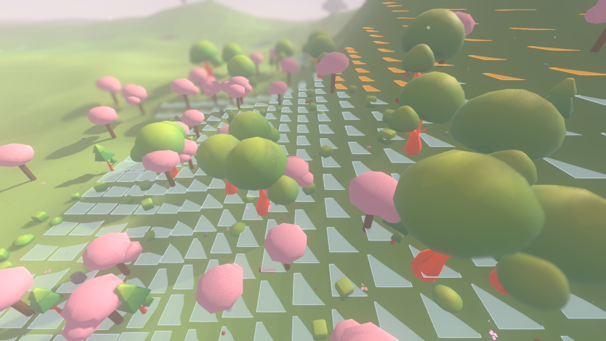
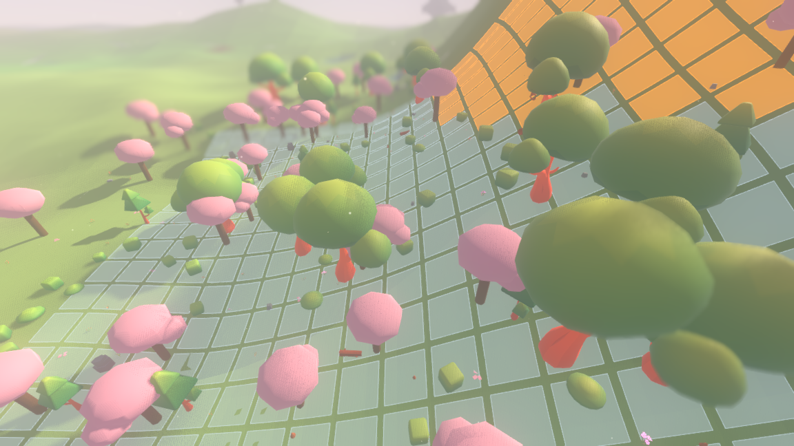
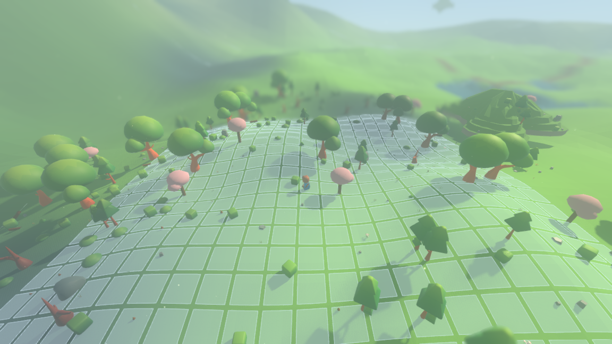
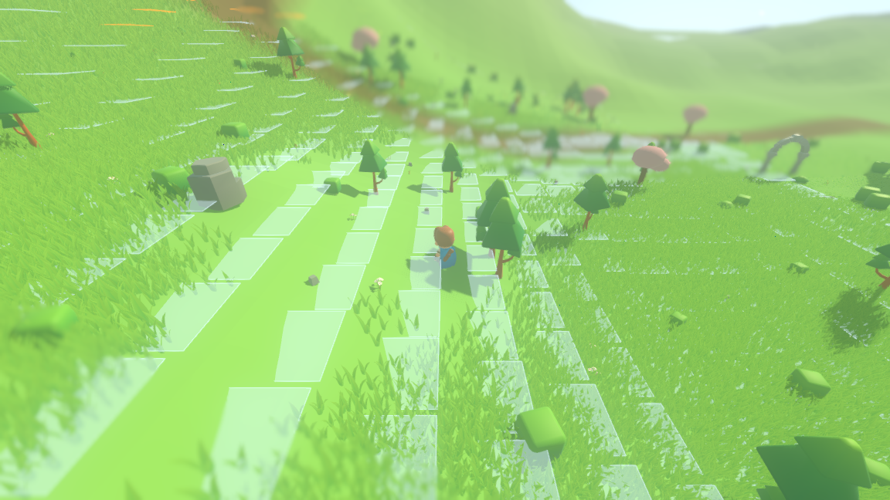
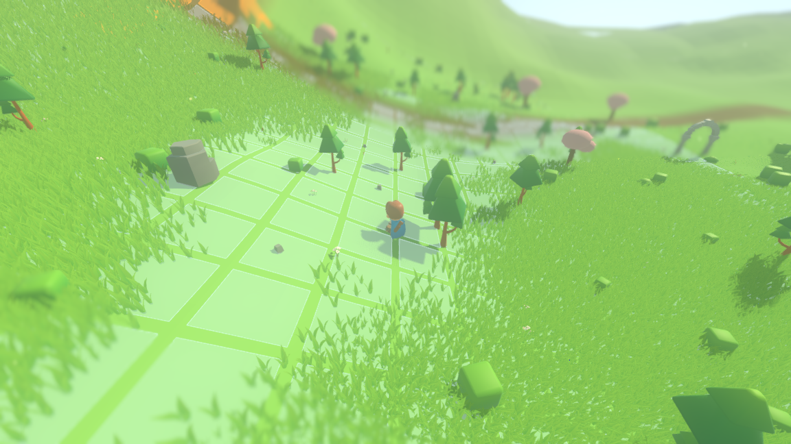

# The grid squares, painted on the ground

Two faults were reported about the tactical lattice the `--board` overlay draws:
the squares *do not hug the terrain*, and they are *not very visible beneath
grass*. Both are render-side, and both are now fixed. Nothing under `sim/`
moved: the board's cell size, its lattice and every answer it gives are still
the simulation's, and the seed-1234 world fingerprint is unchanged.

---

## The first fault: a square lay flat across a hillside

A cell was emitted as four corners at one height — `board.height_at(cell) +
BOARD_LIFT` — so a square was a flat plate held at the height of its own middle.
On a slope that plate cuts into the hill on the uphill side and floats off it on
the downhill side, and where the ground rises through it the plate gets clipped
into wedges. This is the "before" frame, on the steepest grassy hillside seed
1234 has within reach of the origin:



*Seed 1234 at (198, −102), grass off so the squares are the only thing being
looked at. Every square is a triangle, because the hillside is cutting through a
plate that is level.*

The fix is the instruction as it was given: keep the square bounded in $x$ and
$z$ by its cell exactly as before, and take $y$ per vertex from the terrain. A
cell is now cut into $n \times n$ quads, and the height of every one of their
corners is read from the terrain query at that corner — the same question the
board builder asks per cell, `support_at(x, z, h)`: *what would you be standing
on here, coming from this height*. Where nothing is within reach of the cell's
own height — a sub-vertex out over a cliff face, or off an island's rim — the
cell's height stands, so a square stops following rather than stretching down a
wall.



*The same seed, the same place, the same camera. The lattice is painted on the
hill.*

And on a gentler slope, in the blossom grove the cost measurement was taken on:

| before | after |
| --- | --- |
|  |  |

*Seed 1234 at (−212, −30).*

On rolling ground, where the fault was subtler but still there, the lattice now
follows the curve the way paint would:



*Seed 1234 at (196, 182), grass off. `--camera 0 20 26 --aim 3 --focus 0`.*

**The outline follows the same heights.** The border of each square is drawn by
walking the ring of the *same* sub-vertices the fill is built from, so no edge
can float free of the square it bounds. A test asserts exactly that: every point
in the outline surface of the built mesh is also a point in the fill surface.

**A hole keeps the anchor height.** There is no surface under water, or under
the void off an island's rim, so the plate over a hole stays flat at
`board.anchor_height` — the level a piece would have been standing at had there
been anything there. This is the one exception, and it is the same exception the
flat version made.

### How finely a cell is cut, and what that costs

`./tools/measure_overlay.sh` prices it. It builds the surface the overlay would
draw at each subdivision and compares it, over the painted part of the cell,
against the ground read on a $13 \times 13$ grid per cell — much finer than any
subdivision priced, so the number is the error a pixel would see rather than an
artefact of the probe. Full output in
[overlay-measure-evidence.txt](overlay-measure-evidence.txt); the hillside board
(441 cells, 40.17 units of relief) reads:

| cut | vertices per board | terrain samples | build, whole board | build, one walking step | worst gap | mean gap |
| ---: | ---: | ---: | ---: | ---: | ---: | ---: |
| flat (before) | 2 646 | 0 | 0 ms | 0 ms | 1.929 | 0.340 |
| 1 | 6 174 | 1 748 | 368 ms | 18 ms | 0.288 | 0.0177 |
| **2** | **17 640** | **3 933** | **780 ms** | **34 ms** | **0.250** | **0.0045** |
| 3 | 34 398 | 6 992 | 1 451 ms | 66 ms | 0.225 | 0.0020 |
| 4 | 56 448 | 10 925 | 2 378 ms | 101 ms | 0.200 | 0.0011 |
| 8 | 197 568 | 35 397 | 7 227 ms | 372 ms | 0.184 | 0.0003 |

**Two is the choice, and it is argued from the ground rather than from taste.**
A painted square is $3.0 \times 0.86 = 2.58$ units across, and the ground it is
lying on is meshed at 2.00-unit cells. At $n = 2$ the square's own steps are
1.29 units — already finer than the ground it lies on, so there is no detail
below that for a finer square to find. The measured error agrees: the flat plate
sat 0.340 units off the surface on average, $n = 2$ brings that to 0.0045 (75×
better), and $n = 3$ buys a further 2.3× for 1.95× the vertices and 1.9× the
time.

The *worst* gap barely moves with $n$ — 0.288 down to 0.184 — and that is not a
failure of subdivision. It is a step in the composed ground *inside* one cell: a
building's pad edge, or a cliff face. A square is a graph over $x$ and $z$ and
no subdivision removes a discontinuity.

**Rebuild time was measured, not assumed.** The overlay is rebuilt when the
observer walks into a different cell. Over 400 ticks of walking (360 units at 20
ticks per second) that happened 151 times — one rebuild per 2.6 ticks, or 0.13 s.
A whole board at $n = 2$ takes 780 ms to sample, which would not fit in that. So
the sampled surface of each cell is kept between rebuilds, keyed by the cell and
the storey it was read on. That is sound because the lattice is fixed to the
world and the terrain does not move: a cell's sub-vertex heights are a function
of the cell, the storey and the seed, so a height once read is a height for
good. It is bounded because every rebuild keeps only what the board it just drew
asked for. Walking one cell along re-samples one new column of 21 cells —
**34 ms**, against the 68–96 ms the board *read* already costs (see
[board-measure-evidence.txt](board-measure-evidence.txt)). The first board of a
run still pays the 780 ms in full, alongside the 566–1 667 ms a cold board read
already costs.

A second, cheaper height source was measured and rejected, and it is the `land`
half of the same table. Almost all of the sampling cost is the settlement pad and
the road wear composed on top of the carved land, so asking the water field for
the land alone and hanging its *shape* off the cell height the builder already
worked out costs 88 µs a sample against 198 µs for the composed surface — 2.3×
cheaper, and the same simplification the distant ground already makes in its
outer rings. But on the village board it is wrong by 0.057 units on average and
1.650 at worst, and it stays wrong at every subdivision (0.0573 at $n = 2$,
0.0548 at $n = 8$), because what it leaves out is exactly the pad it is standing
on. 34 ms a step is affordable; being wrong where the villages are is not.

### The lift, re-chosen

`BOARD_LIFT` was 0.09 and is now **0.045**.

When a cell was one flat quad the lift was fighting the cell's own relief —
0.340 units of it on average and 1.929 at worst — which no lift that small was
ever going to win; 0.09 was a compromise between hovering and sinking. All that
is left to clear now is the ground *mesh's* own faceting. The overlay samples
the terrain's height function; the ground is that function read on a 2-unit
lattice and joined by flat triangles, so where the ground is convex the triangle
cuts the corner and stands **above** the function. Measured over the painted
area of the hillside board, it does so by 0.0083 units on average and 0.0723 at
worst. The share of painted area the ground would still poke through:

| lift | hillside board | village board |
| ---: | ---: | ---: |
| 0.00 | 67.99% | 30.51% |
| 0.02 | 13.44% | 7.06% |
| 0.03 | 4.26% | 4.89% |
| **0.045** | **0.54%** | **3.44%** |
| 0.06 | 0.06% | 2.61% |
| 0.09 | 0.00% | 1.53% |

0.045 clears all but half a percent of a hillside board. Going on to 0.09 buys
that last half a percent and costs twice as much hover. The village column shows
what the lift cannot fix at any height: 1.5% of that board is steep enough that
the 2-unit ground triangle cuts a ridge by up to 0.63 units, which is the
ground's own faceting and not the square's.

---

## The second fault: grass grew straight through the overlay

`render/grass_layer.gd` knew nothing about the board. The grass material is a
single `ShaderMaterial` every chunk shares, and it already takes live per-frame
uniforms for the characters who walk through and part the grass. A board is one
more thing on the same path: four uniform writes per frame — where the board is
centred, how far it reaches, the height its middle sits at with its own relief,
and the cell size — **however many chunks are on screen**, because they all share
the one material.

Inside the shader a blade asks two questions about where it is rooted, both pure
functions of its own position: is it inside the board's rectangle and near the
board's own storey, and is it standing over a *painted square* rather than in the
gutter between two of them. The second is one `fract` against the cell size, so
the lattice reads through the grass as a lattice rather than as a mown
rectangle. What comes out multiplies into the same `shrink` the walkers already
shorten blades by.

| before | after |
| --- | --- |
|  |  |

*Seed 1234 at (228, −60), meadow grass, camera `--camera 0 10 14 --aim 1
--focus 0`. Before, the squares are stripes half-buried in grass; after, the
grass stands in the gutters and the lattice reads.*

### Shortening or fading: decided by looking

Both were built and photographed on the same seed, the same place and the same
camera.

| shortening the blades (kept) | fading them out |
| --- | --- |
|  |  |

Shortening won. A shortened blade is still a blade: it catches the light, it
still reads as grass, and the square underneath is clean. A faded one keeps its
full height and loses a share of its pixels, so under the diorama camera — which
sits far enough back that a blade is a few pixels wide — it crumbles into
speckle, and the full-height silhouettes still stand across the square. The two
frames differ by only 2.1 levels per channel on average over the board, which is
itself the point: the fade spends its budget on speckling blades that are still
in the way, where the shortening spends it on getting them out of the way.

There is an engineering reason pointing the same way. The grass is drawn in the
opaque pass as tens of thousands of instances; giving it a real alpha would move
all of it into the sorted transparent pass for the sake of one debug overlay. The
fade that was tested is therefore a screen-space dither with `discard`, which
keeps the opaque pass but gives up early-z. Shortening costs nothing at all — it
is a multiply into a number the shader was already computing.

Both live behind one uniform each (`board_thin`, `board_fade`), so the choice is
a one-line change and the losing pair is the frame above.

### The ground alpha, revisited in the same pass

`BOARD_GROUND` went from alpha 0.30 to **0.20**. 0.30 was chosen when the plate
had to shout over grass growing through it. Now that the grass gives way over a
square, the plate no longer has to compete, and at 0.20 the biome's own green
comes through it — it reads as paint on the ground rather than as a sheet of
frosted glass laid over the world. The outline, which is the same colour at
`min(1, α × 2.4)`, follows it down from 0.72 to 0.48 and still reads as an edge.

---

## Nothing under `sim/` moved

The whole change is `render/main.gd` and `render/grass_layer.gd`. The seed-1234
world fingerprint is quoted before and after and is identical:

```
tick 0    b963fd807b8c432d
tick 50   809a88491e407272
tick 100  d178d38879097c1c   (final)
```

`./run_tests.sh --layers-only` passes: `sim/` still references nothing under
`render/` and names no asset. The whole suite passes headless — 46 suites,
195 751 checks, including the new `board overlay` suite's 21 — and the raw
output is in
[board-overlay-suite-evidence.txt](board-overlay-suite-evidence.txt).

## Reproducing everything above

```
./run_headless.sh --seed 1234 --ticks 100            # the world fingerprint
./run_tests.sh --layers-only                         # the layer split
./run_tests.sh                                       # every suite
./tools/measure_overlay.sh                           # cost, error, lift, cadence

xvfb-run -a ./run_render.sh --seed 1234 --start 198 -102 --paused --board \
	--no-grass --camera 0 14 18 --aim 2 --focus 0 \
	--screenshot "$PWD/reports/assets/board-hug-slope-after.png" --screenshot-frame 120
xvfb-run -a ./run_render.sh --seed 1234 --start -212 -30 --paused --board \
	--no-grass --camera 0 16 20 --aim 2 --focus 0 \
	--screenshot "$PWD/reports/assets/board-hug-grove-after.png" --screenshot-frame 120
xvfb-run -a ./run_render.sh --seed 1234 --start 228 -60 --paused --board \
	--camera 0 10 14 --aim 1 --focus 0 \
	--screenshot "$PWD/reports/assets/board-grass-after.png" --screenshot-frame 120
xvfb-run -a ./run_render.sh --seed 1234 --start 196 182 --paused --board \
	--no-grass --camera 0 20 26 --aim 3 --focus 0 \
	--screenshot "$PWD/reports/assets/board-hug-shore.png" --screenshot-frame 120
```

The `-before` frames are the same three commands run on the commit before this
one; the `board-grass-fade.png` frame is the third one with
`GrassLayer.BOARD_THIN` at 0.0 and `BOARD_FADE` at 0.85.
