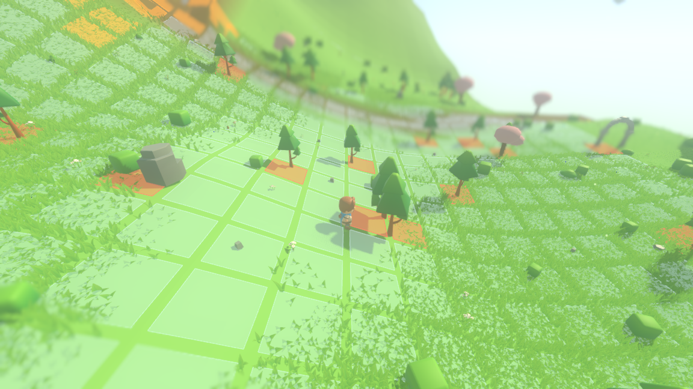
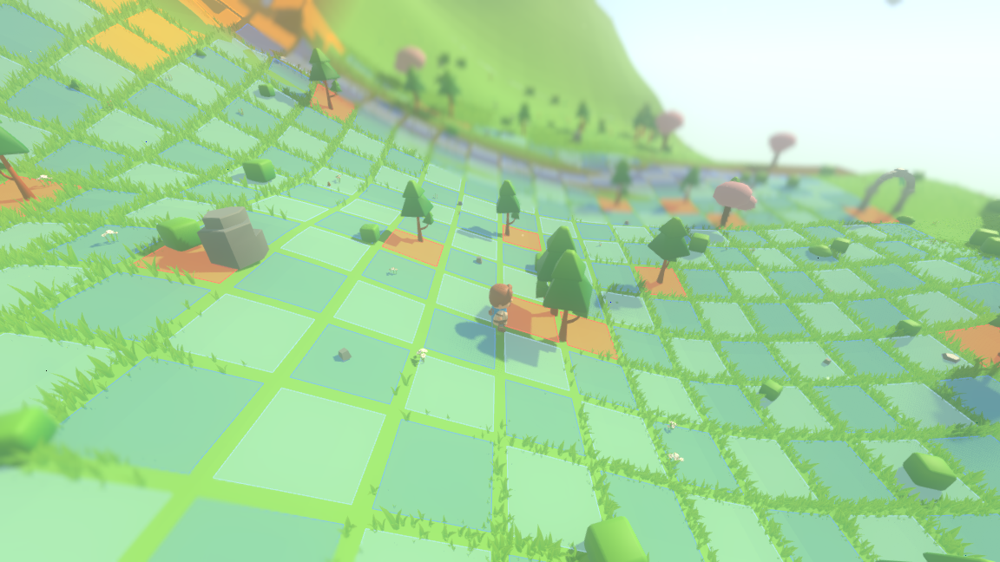
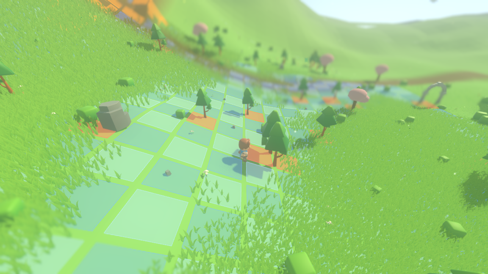
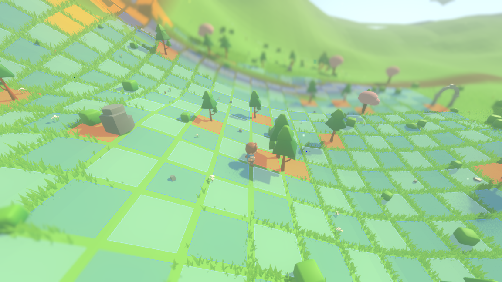
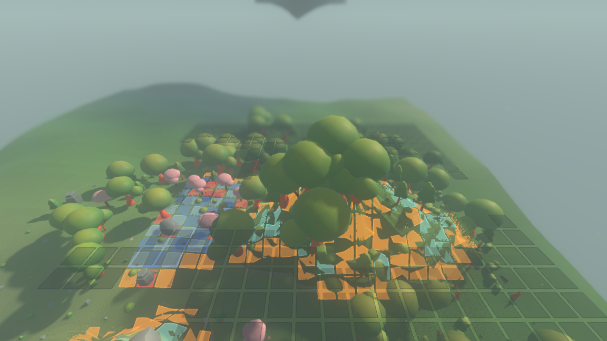
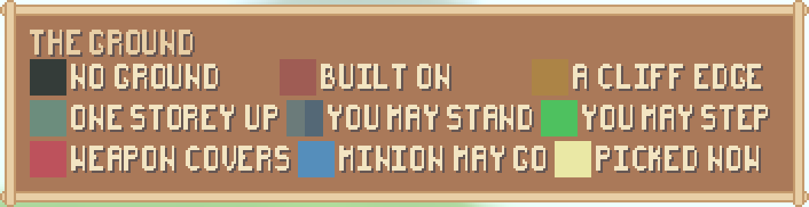

# The board can be read: squares through the grass, in two shades of blue

Two complaints about one surface. *The grass hides the squares*, and *every
square is the same colour, so a board reads as a single sheet.* Both are
render-side and both are now answered. Nothing under `sim/` moved: the board's
cell size, its lattice and every answer it gives are still the simulation's, and
the seed-1234 world fingerprint is quoted unchanged at the end.

---

## Before and after

The same seed, the same place, the same tick, the same camera — the one the game
ships with, which is the whole point: the last time this surface was judged, it
was judged at a camera four times further away.

| before | after |
| --- | --- |
|  |  |

    xvfb-run -a ./run_render.sh --seed 1234 --start 228 -60 --board \
        --screenshot reports/assets/board-readable-after.png --screenshot-tick 20

Seed 1234 at $(228, -60)$ — meadow grass, the shipping camera (`CAMERA_OFFSET` =
$(0, 10.5, 13.0)$, no `--camera` flag). `--screenshot-tick 20` photographs the
first frame at or past tick 20, and both runs report the same one:

    render-shell screenshot t=21 reports/assets/board-readable-after.png

The "before" frame is that same command on the tree as it stood at commit
`80fc5f1`, which is the parent of this work.

---

## 1. A board that read as one sheet

Every cell of ordinary ground was painted one colour — a cool white at alpha
0.20 — so a board was a pale sheet with gutters scored across it. The ask was a
checkerboard in two close shades of blue, subtle rather than black and white.

The two colours, and they are the only two blues on the ground:

| shade | as written | where |
| --- | --- | --- |
| **pale sky** | `Color(0.70, 0.83, 1.00, 0.26)` | cells where $x + z$ is even |
| **deep sky** | `Color(0.34, 0.54, 0.94, 0.26)` | cells where $x + z$ is odd |

$x$ and $z$ are the cell's own coordinates on the world lattice, so the parity is
a fact about the ground and not about the board: a square keeps its shade as the
board is rebuilt, as the observer walks across it, and as a fight moves the
lattice to a different rectangle. Both shades carry the same alpha, 0.26, so
neither reads as more see-through than the other. They differ by 0.36, 0.29 and
0.06 in red, green and blue, which at alpha 0.26 puts two neighbouring squares
about 24, 19 and 4 levels of 255 apart over the same ground — a checker a person
reads without being shouted at, rather than a chessboard.

### It is still one table, and it still generates the legend

`render/board_legend.gd` is the one place a board colour is written down, and
both the ground and the legend panel are read out of it. A row of that table is
*one meaning*; the checker is a **second shade of one row**, not a second row:

```gdscript
{
    "key": GROUND,
    "tint": Color(0.70, 0.83, 1.0, 0.26),
    "pair": Color(0.34, 0.54, 0.94, 0.26),
    "means": "you may stand",
},
```

`shade_of(key, cell)` picks between a row's shades by the parity of the cell, and
a row with no `pair` is painted its own colour wherever it falls. So the parity
decides which shade of a meaning a square is drawn in and never which meaning it
is: a cliff edge is amber on both parities, a hole is a dark plate on both, a
built cell is dull red on both and a cell one storey up is pale mint on both.

The legend panel draws whatever the table hands it. A checkered row's swatch is
both of its shades over the one backing, side by side, so the key shows the
checker rather than half of it — and the panel still does not know that any row
has two, only how many `shades_of` handed it.

---

## 2. The grass

Two separate things were wrong, and only the second one was the one everybody
was arguing about.

### The board was told to the grass a frame late, and a held frame has no next frame

The grass material takes the board as four per-frame uniform writes, exactly as
it takes the characters who walk through it. Those writes happened in
`_sync_grass`, which ran **before** `_sync_board` — the call that works out where
the board is. So the grass was always drawing last frame's rectangle.

While the world is running that costs nothing: the next frame catches up, and a
fight lasts thousands of frames. While it is *paused* it costs everything. A
`--paused` run syncs its views exactly once, at boot, and on that one pass the
board did not exist yet. Every held frame ever photographed for a report was
therefore taken with grass that had never heard of the board under it:



*This is `--grass-give-way 0.0 0.0` — the grass ignoring the board — and it is
pixel-for-pixel what a `--paused --board` frame looked like whatever the
shortening was set to.*

The fix is the two calls in the other order, which is one line and also removes
the one-frame lag from the live path.

### Shortening a blade is not the same as taking it away

With the order fixed, the treatments could be told apart at all, and the one that
had been shipping turned out to be making things *worse* than no rule: over the
grass it stands in, the lattice read at **−221%** of what it reads with no grass
on it, which is to say the squares came out *darker* than the gutters between
them.

The reason is in one line of the shader. Shortening moved only the $y$ of a
vertex:

```glsl
VERTEX.y = root.y + (VERTEX.y - root.y) * shrink;
```

A blade taken all the way down by that keeps its width and its spread. It does
not go away — it lies down, and a tuft of a dozen blades lying down is a green
mat covering the square with the colour of grass just as surely as standing up
did. So the blade is now pulled in towards its own root by the same share it is
shortened by:

```glsl
VERTEX.xz = mix(VERTEX.xz, root.xz, mown);
```

At `mown = 1` every vertex of the blade arrives at the root: no mat, and no area,
so there are no pixels to shade either.

### Which way, measured

`./tools/measure_board_read.sh` prices the ways against each other. It
photographs one view — seed 1234 at $(228, -60)$, the shipping camera, paused at
a fixed frame rate so the wind stands in the same place in every frame — once per
treatment, plus three references: the view with the board and no grass, with
neither, and with grass and no board.

The references do the classifying, so no mask is drawn by hand. A pixel the two
grass-free frames differ on is **painted**; a pixel beside a painted one that
they agree on is **gutter**; and the grass-and-no-board frame cuts both down to
the part of the board the grass actually stands on, because out where no blade
stands every treatment scores the same.

**Contrast** is then the mean brightness of the painted pixels less the mean
brightness of the gutter pixels, in levels of 255 — how strongly the lattice
reads *as* a lattice. **Paint error** is how far a painted pixel lands from the
same pixel with nothing standing on it — what is left on the square.

| treatment | contrast | of the grass-free frame | paint error |
| --- | ---: | ---: | ---: |
| no grass at all | 3.65 | 100.0% | 0.00 |
| grass stands through it (before) | −8.07 | −221.1% | 31.83 |
| mown to a fifth (`thin` 0.80) | 3.14 | 86.1% | 11.01 |
| **mown away (`thin` 1.00)** | **4.71** | **129.1%** | **8.48** |
| dithered away (`fade` 0.80) | 0.93 | 25.6% | 14.02 |
| dithered away (`fade` 1.00) | 2.67 | 73.3% | 10.60 |

Mowing a square clean reads at **129%** of the same board with no grass anywhere,
and that is not a mistake in the arithmetic: the grass left standing in the
*gutters* is darker than bare ground, so it draws the lattice's lines for it. A
square mown to a fifth still carries stubble and reads at 86%. The dither — the
stand-in for blade translucency, and the way that was kept the last time this was
judged — throws away a share of the blade's pixels but leaves full-height
silhouettes standing, and reaches 73% only when it throws away all of them.

### What each way costs, and what the measurement could not see

The same view, run one treatment at a time in real time, 240 frames each, with
the shell's own frame-time average (it starts averaging at frame 90, so the
streaming is not priced as picture):

| treatment | frame_ms | blades baked | blades drawn |
| --- | ---: | ---: | ---: |
| **mown away (chosen)** | **133.41** | 15 571 | 11 611 |
| dithered away (rejected) | 133.41 | 15 571 | 11 611 |
| grass stands through | 133.34 | 15 571 | 11 611 |
| no board at all | 133.44 | 15 571 | 11 611 |
| **no grass at all** | **133.34** | **0** | **0** |

**That last row is why none of the others mean anything.** A frame with no grass
in it at all — 15 571 blades removed — costs the same 133.3 ms. This machine has
no GPU (the frames are rasterized in software by llvmpipe under Xvfb) and its
display swap is enforced at 60 Hz below the level `--disable-vsync` can reach, so
a frame time here is quantised to 16.67 ms and this whole scene lands in the same
bucket whatever the grass is doing. The instrument is blind, not the treatments
equal, and the honest thing is to say so rather than to print six numbers that
agree and call it a result.

So the cost is argued from what each way *does*, which is not in dispute:

* **Mowing** is one `mix` in the vertex stage, on a number the shader was already
  computing, and a blade that gives way entirely ends with every vertex at one
  point — it is rasterized into nothing, so its pixels are never shaded at all.
* **The dither** shades every fragment of every blade standing over a square and
  then throws the fragment away. `discard` also costs the grass material its
  early-z for the whole of the layer, on every frame, whether a board is being
  drawn or not — which is the same reason the last pass refused to give the grass
  a real alpha: it is tens of thousands of instances in the opaque pass, and
  nothing about one overlay is worth moving them.

Neither uniform was removed, so the choice is still a one-line change, and these
are the two frames it is between:

| mown away (kept) | dithered away (rejected) |
| --- | --- |
|  |  |

---

## 3. What the checker must not cost

A parity term that painted *every* square by parity would make a cliff edge read
as two different things on neighbouring cells, which is the one square a shove
off can cost a character its whole life. It does not: the parity picks between a
meaning's own shades, and only ordinary ground has two.

Here is a board with all five kinds of cell on it at once — a fight on top of a
floating island, where the rim gives every one of them:



    xvfb-run -a ./run_render.sh --seed 1234 --start 550 580 --board \
        --camera 0 26 30 --aim 5 \
        --screenshot reports/assets/board-readable-every-kind.png --screenshot-tick 20

Seed 1234, tick 20, at $(550, 580)$, from further back than the shipping camera
so the whole board is in frame. The board is 441 cells: 255 of them holes, 103 a
cliff edge, 37 a storey up, 35 ordinary ground and 11 built on, and the run says
the first two of those from outside on its own stop line:

    board=441/255

The ground cells alternate; the amber, the mint, the red and the dark plates do
not.

And the legend, which is the same table read the other way, in a play run at the
window the game ships in:



    xvfb-run -a ./run_render.sh --seed 1234 --scenario play --play --board \
        --camera 0 16 20 --aim 2 \
        --screenshot reports/assets/board-readable-legend.png --screenshot-tick 20

    render-shell legend scale=1 x=791 y=8 w=353 h=91 colours=9

Nine colours, which is every row of the table — the checker added a shade and not
a meaning, so the panel is the size it was. The `you may stand` swatch is the two
shades side by side, and the full frame it was cut from is
[board-readable-legend.png](assets/board-readable-legend.png).

---

## 4. The legend still agrees with the ground

Because it is still generated from the same table. `./run_tests.sh
test_board_legend` — the check the legend work left behind, extended in this pass
to cover the checker — passes:

    RUN   test_board_legend
    PASS  board legend   313 checks

The suite pins, among the rest: that every shade the board paints is a colour of
its own and no two are alike; that the colour a cell is painted is the shade the
table picks for that cell; that ordinary ground alternates by parity and every
other meaning is one colour on both parities; that the panel draws one patch per
shade, in the table's order and in the table's colours; and that **no file under
`render/` but the table itself writes one of these colours down** — now including
the second shade.

---

### Which suites were run

`./run_tests.sh --layers-only` passes — `sim/` still references nothing under
`render/`, the render layer still holds none of the fight, the interface still
names its art through one file and `sim/` still names no asset — and the seven
suites that touch this surface pass together, 1 922 checks:

    all 7 suites passed (1922 checks)

The transcript is [board-readable-suites.txt](board-readable-suites.txt). The
whole suite was **not** run in this pass; it takes hours, and what is quoted here
is the seven suites that cover the board, the grass, the panels and the shell.

---

## 5. Nothing under `sim/` moved

The whole change is `render/main.gd`, `render/grass_layer.gd`,
`render/board_legend.gd`, `render/ui/legend_panel.gd`, the suite that pins them
and the measurement tool. The seed-1234 world fingerprint is the one
[blocked-ground.md](blocked-ground.md) left behind, unchanged:

    tick 0    f8a37135def13eb4
    tick 50   9bbb738967b9cf9d
    tick 100  63d2944d25181c5f   (final)

---

## Reproducing everything above

```
./run_headless.sh --seed 1234 --ticks 100     # the world fingerprint
./run_tests.sh --layers-only                  # the layer split
./run_tests.sh test_board_legend test_board_overlay test_grass \
    test_ui_fit test_ui_panel test_render_shell test_camera_read
./tools/measure_board_read.sh                 # the table above, frames and cost

xvfb-run -a ./run_render.sh --seed 1234 --start 228 -60 --board \
    --screenshot reports/assets/board-readable-after.png --screenshot-tick 20
```
