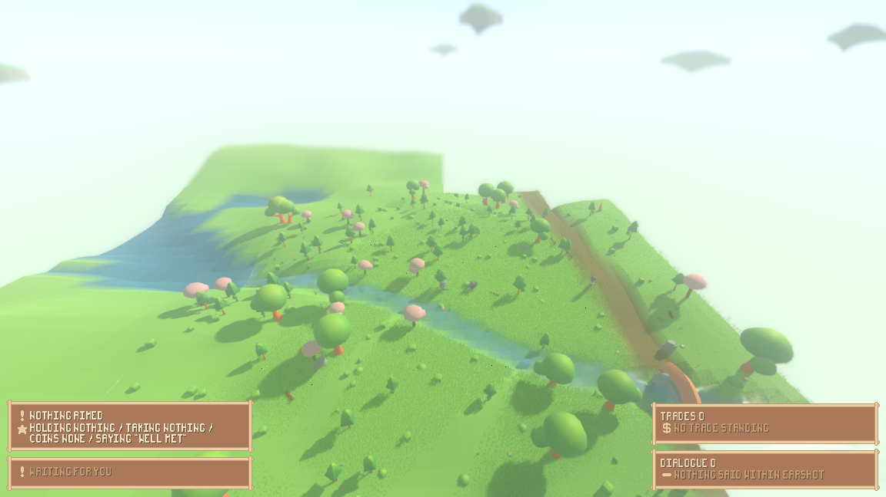
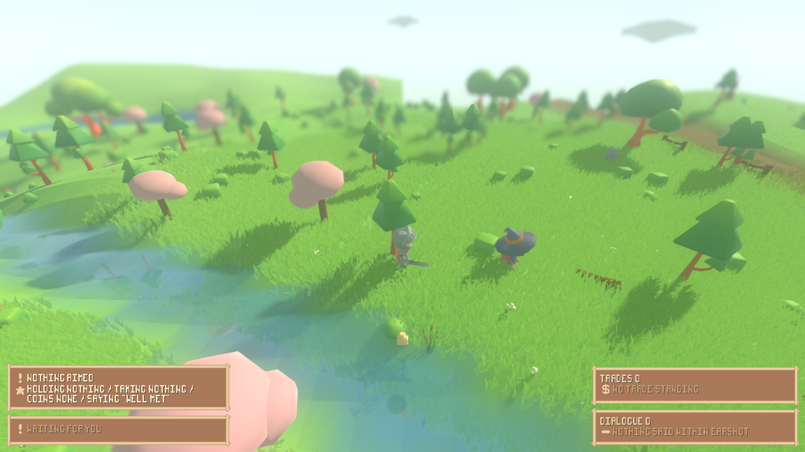
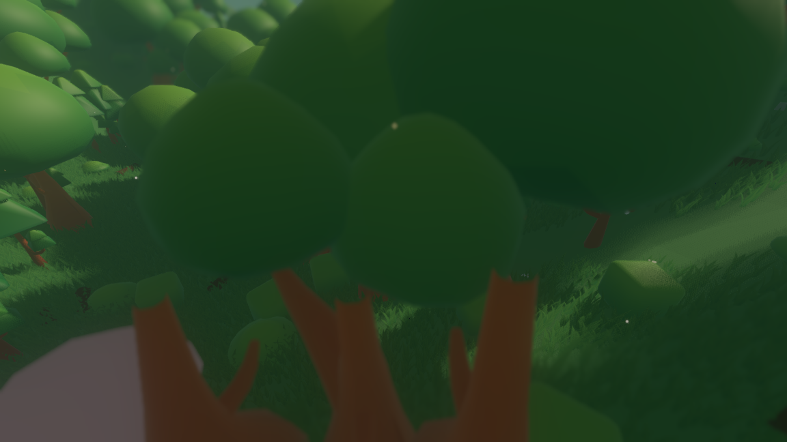
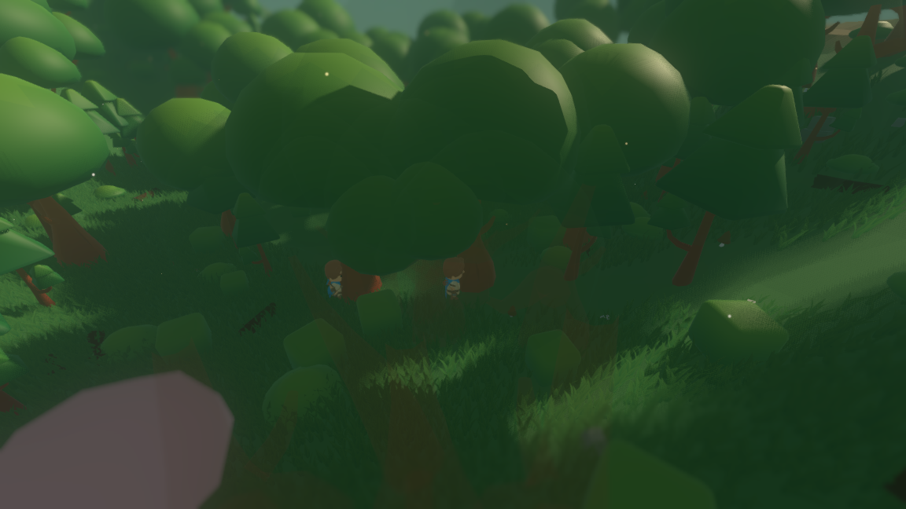
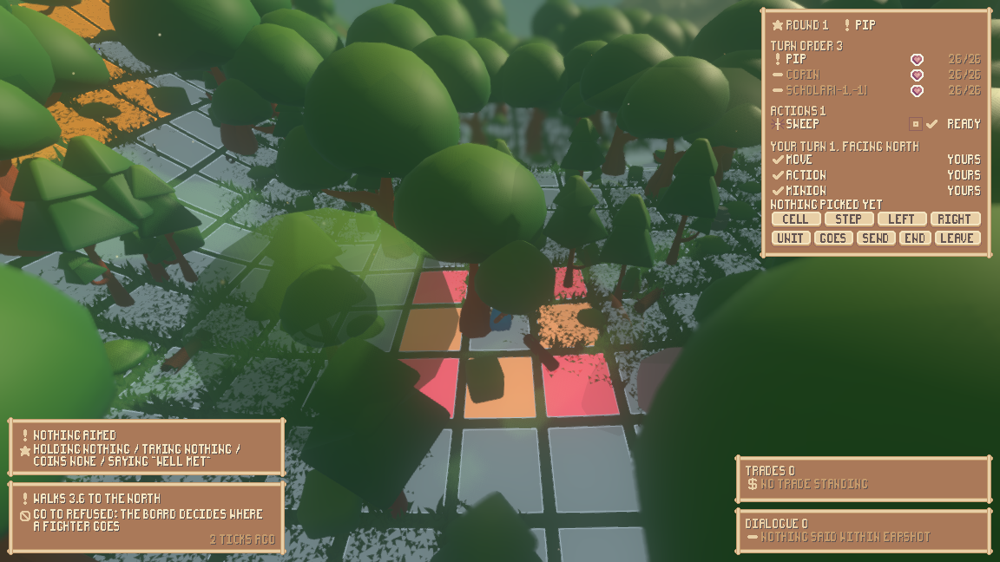
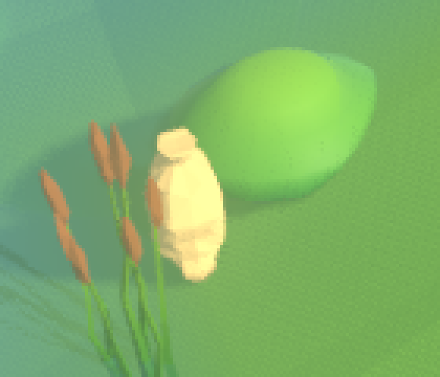
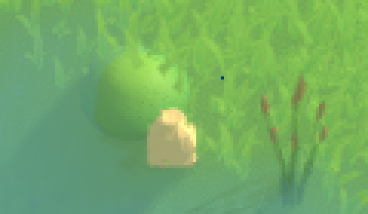

# The character and the things on the ground can be seen

Two faults were reported after the second playtest, and both are about looking
rather than about playing. The character a person steers was **13 pixels tall**
at the camera the game shipped with, and it was often standing inside a tree.
And no frame of that playtest had a pile of loot in it, though the readout named
one four units away.

Both are render-side. Nothing under `sim/` moved: the seed-1234 fingerprint is
quoted unchanged at the bottom of this page.

---

## The first fault: the person was thirteen pixels tall

The camera that shipped sat at `CAMERA_OFFSET = (0, 42, 52)`, which is 66.8
world units from the person it follows. This is the frame it made, seed 1234,
the `play` scenario, tick 8:

*`xvfb-run -a ./run_render.sh --seed 1234 --scenario play --play
--screenshot-ticks "8:reports/assets/camera-before-t8.png"`*

The character is at the middle of that frame and cannot be picked out of it. The
measurement, taken off the frame rather than argued:

    ./tools/playtest_measure.py height reports/assets/camera-before-t8.png "530,340,630,410"
      tallest armour-grey run 13 px at column 5, rows 2-14

**13 pixels** in a 648-pixel window: two per cent of the height. For comparison
the four interface panels along the bottom of the same window occupy 115 rows,
17.7% of it.

### How the new camera was chosen

The character measures $1.93$ world units. At a vertical field of view of
$75\degree$ — Godot's own default, which `project.godot` does not override — the
window's height spans $2\tan(37.5\degree) \, d = 1.534\,d$ world units at a
distance $d$, so a character that tall comes out

$$h_{\text{px}} = \frac{648 \times 1.93}{1.534\,d} = \frac{815}{d}$$

pixels tall. That is the whole of the choice: the number wanted, divided into
815, is where the camera goes.

Two things fix the number. A character has to be findable without being told
where to look, which puts a floor under it; and a fight has to stay in frame,
which puts a ceiling on it. A board cell is $3.0$ units
(`CombatBoard.CELL_SIZE`), and the view spans $1.534\,d$ units vertically at the
person's own depth, so a board eight cells across needs $d \gtrsim 16$.

**49 pixels at $d = 16.7$ units** is the choice: 7.5% of the window's height,
about two fifths of the interface band, and a board eight cells wide still fits
with room around it.

The offset that gives it is `(0, 10.5, 13.0)`, and the *direction* is exactly the
old one — $10.5 / 13.0$ and $42 / 52$ agree to four figures — so this is the
same picture from a quarter of the distance and not a new angle on the world.
`CAMERA_AIM_LIFT` is scaled by the same quarter, $10.0 \to 2.5$, because the
tilt a lift produces is the ratio of the lift to the camera's distance: left at
$10.0$ from $16.7$ units away it would have aimed the camera over the horizon.

*`xvfb-run -a ./run_render.sh --seed 1234 --scenario play --play
--screenshot-ticks "8:reports/assets/camera-after-t8.png"`*

| | camera | distance | character | share of the window |
|---|---|---|---|---|
| before | `(0, 42, 52)` | 66.8 u | 13 px | 2.0% |
| after | `(0, 10.5, 13.0)` | 16.7 u | 49 px | 7.5% |

`tests/test_camera_read.gd` holds the arithmetic to the constants: it fails if
the shipped camera draws the character under 40 pixels or over 70, and it fails
if the two ratios that are the camera's *angle* stop matching the ones the view
was composed at.

---

## The second fault: trees stood in front of the person

Pulling the camera in made the second fault worse rather than better: a tree that
was a speck at 66.8 units is a crown across the frame at 16.7. So how often it
actually happens was measured before anything was written.

`tools/measure_foliage.sh` walks a lattice of standing places, puts the camera
where the game puts it at each of them, and asks `FoliageFade.cover` — the same
pure function the shell uses every frame — how much of the sight line each
nearby prop is across:

    ./tools/measure_foliage.sh --span 40 --step 2
      seed 1234, 40 units either way from (0.0, 0.0) every 2.0 units
      camera (0.0, 10.5, 13.0), 16.7 units back
      1681 standing places, 1330 of them with something across the sight line: 79.1%

    ./tools/measure_foliage.sh --span 40 --step 2 --camera 0 42 52
      1681 standing places, 1420 of them with something across the sight line: 84.5%

**Four standing places in five** have a tree, a bush or a boulder between the
camera and the person. It was not a camera the change introduced — the camera it
replaced was worse, at 84.5% — it is a camera that was never answerable for it
because at 66.8 units there was nothing legible behind the tree to hide.

### The rule chosen: the foliage thins

Three answers were available — move the camera off the obstruction, cut the
obstruction out, or let it give way — and the third is the one taken, for the
same reason grass over a board square is *shortened* rather than faded
(`reports/board-overlay.md`): this world is a diorama seen from a fixed angle,
and a camera that swings to dodge a trunk trades a defect a person notices once
for a picture that moves when they did not ask it to. A tree that is cut out
pops. A tree that thins keeps its silhouette and keeps its shadow — this
engine's per-instance transparency does not switch shadow casting off — so the
picture goes on saying *there is a tree there, and the person is behind it*.

`render/foliage_fade.gd` holds the whole of the rule and holds no state: a prop
gives way when the segment from the camera to the person's chest passes inside
its crown, between its feet and its top, and *between* the two ends. Both edges
are soft. Sideways, cover falls from full to none over the `CLEARANCE` of 0.75
units outside the crown; in time, a prop may change by `RAMP` = 3.4 of
transparency a second, so a quarter of a second from solid to the deepest the
rule ever draws anything, which is `DEEPEST` = 0.82 rather than 1.0 — a tree
faded to nothing is a tree that was never there.

Here is a standing place the survey names — `--start 12 2`, where nine props are
across the line — with the rule switched off and then on. Same seed, same tick,
same camera; the only difference is `--no-fade`:

*`xvfb-run -a ./run_render.sh --seed 1234 --play --start 12 2 --no-fade
--screenshot-ticks "8:reports/assets/foliage-off-t8.png"` — seed 1234, tick 8.*

*`xvfb-run -a ./run_render.sh --seed 1234 --play --start 12 2
--screenshot-ticks "8:reports/assets/foliage-on-t8.png"` — seed 1234, tick 8,
nine props giving way.*

The rule fires on a board too. This is a fight the character walked into in
deep forest, with the trees over the lattice thinned so the fighters and the
coloured cells can be read through them:

*`xvfb-run -a ./run_render.sh --seed 1234 --play --input "6:w,12:w,18:w,24:w,30:w,36:w,42:w,48:w"
--screenshot-ticks "50:reports/assets/fade-walk-t50.png"` — seed 1234, tick 50.*

### What it costs

The two runs above differ in nothing but the rule, and their stop lines price
it. That frame carries 8189 grass blades and 6351 drawables:

| | props giving way | deepest | deciding, per frame | world fingerprint |
|---|---|---|---|---|
| `--no-fade` | 0 | — | 0 µs | `0b74efc71908cb6b` |
| shipped | 9 | 0.82 | 260 µs | `0b74efc71908cb6b` |

**260 microseconds a frame** to decide, measured by the shell's own clock over
every frame of the run, and at most nine of 6351 drawables pushed into the
transparent pass. A longer walk through the meadow with a fight in it
(`grass=10656`, `drawn=7580`, 53 ticks) prices it the same: `fade_us=257.4`,
`faded=3`.

The cost is a walk of the scatter patches near the person, so it is set by how
many props are near rather than by how many are in the way — which is why a
frame with nothing giving way costs almost as much as this one. The two
fingerprints being the same digest is the other half of the price: the rule
draws differently and changes nothing.

---

## The third fault: no frame had a pile of loot in it

The second playtest photographed the `play` scenario at four cameras and found
no frame with a pile in it, while the readout named one four units from the
person. Three things could do that — the camera, the models' scale, or where the
pile was put — and `tools/measure_ground_read.sh` reads all three, in the order
a pile passes through them:

    ./tools/measure_ground_read.sh
      === the rows the simulation hands out ===
        id=4 pile  kind=pile  shut=false at=(-480.00, 424.00) 4.00 from the person,
                   1 item(s): iron key -> (nothing)
      === the placements the render layer makes of them ===
        1 placement(s)
        key=4:0 tag=gear_bundle fallback=true at=(-480.00, 424.00) 4.00 from the person
          own size 0.602 x 0.830 x 0.432, factor 0.9037, drawn 0.750 tall
          13.8 units from the shipping camera -> 22.9 px tall in a 648-px window
          63.8 units from the camera this shipped with before -> 5.0 px

**It was the camera.** The placement is right — the simulation says the pile is
four units away and the render layer puts it four units away. The scale is right
— the model builds with real geometry and is normalised to the 0.750 units the
ground-items work chose against the grass, which is the same size it has always
been drawn at. What is left is 5.0 pixels, which is what 0.75 units comes to at
63.8 units away.

And it was never invisible. This is the second playtest's own
`playtest-items-side-t8.png`, cropped around the pile:

*The pile the pass reported as absent, in a frame that pass took.*

So the honest answer is that the reading and the fact came apart: at those
distances a pile is a handful of pixels at the edge of a misted frame, and it
was read as nothing. At the camera the game now ships with it is 22.9 pixels and
looks like a sack:

*`camera-after-t8.png`, seed 1234, `--scenario play`, tick 8 — the same command
as the second frame at the top of this page.*

---

## What did not change

The simulation. The fingerprint that both playtest passes quote:

    ./run_headless.sh --seed 1234 --ticks 40
      done ticks=40 chunks=39 built=45 final=64f9a1c50f4510dc

and the layer checks:

    ./run_tests.sh --layers-only
      layer check: OK -- res://sim references nothing in the render layer
      combat check: OK -- res://render draws the fight and holds none of it
      interface check: OK -- res://render/ui names its art through sprout_pack.gd alone
      asset check: OK -- res://sim names asset tags and no asset

The look. The tilt-shift, the bloom and the mist are all still there in
`camera-after-t8.png` at the top of this page — the near grass and the far hill
are soft and the middle is sharp, the sky blooms over the horizon, and the
water is under a band of mist. That happened by itself: `Atmosphere.focus_at`
takes the depth-of-field band as fractions of how far the camera is from what it
is looking at (`DOF_NEAR` 0.46, `DOF_FAR` 1.80), and the shell hands it
`_camera_offset.length()`, so the miniature refocused when the camera moved.

---

## What this does not cover

What grows on a **floating island's top** does not thin. An island's cover hangs
off that island's own view rather than off a scatter patch, and `_sync_foliage`
walks the patches; a person standing under a tree on a walkable island has the
old picture. The rule itself is told positions and sizes and would answer for an
island's tree as readily — the gap is one more loop, and it is worth writing
when somebody is actually up there.

**Buildings** do not thin either. A village wall between the camera and the
person is the same fault, and the same rule would close it; it was left out
because the reported defect was trees and grass, and a wall that thins is a
larger decision about what a village looks like from inside.

And the rule costs what it costs whether or not anything is in the way: it is a
walk of the props near the person, so a clear frame in a forest pays nearly the
same 260 microseconds as an obstructed one.

## What was run

    ./run_tests.sh test_camera_read test_render_shell test_atmosphere test_grass \
        test_board_overlay test_scatter test_ground_items test_reflection test_anti_aliasing
      all 9 suites passed (4223 checks)

    ./run_tests.sh --layers-only         # all four checks OK
    ./run_headless.sh --seed 1234 --ticks 40   # final=64f9a1c50f4510dc

`tests/test_camera_read.gd` is the new suite: the camera's own arithmetic, and
the fade rule's four ways of not being in the way, its soft edge walked out
sideways in sixty steps, and its ramp checked for a step and for arriving.
