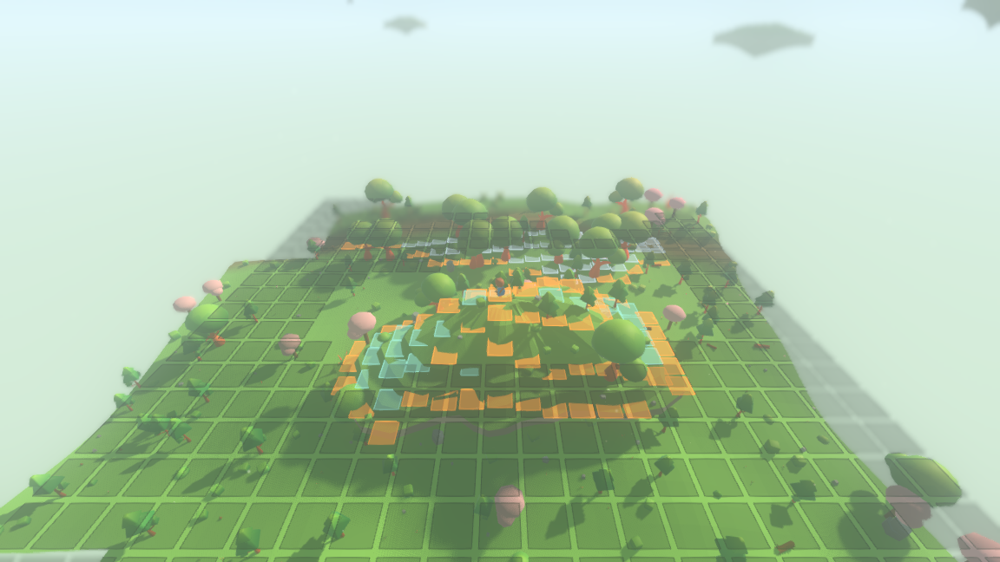
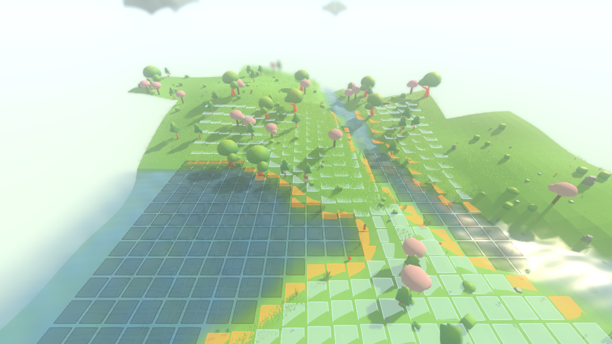

# The tactical board: the generated ground read as a lattice

The first layer of the combat core, and the first thing in the project that is
not generation. It adds nothing to the world. It takes the ground that eight
layers of generation have already produced — the heightfield, the biomes, the
water, the floating islands, the villages and their roads — and reads a
rectangle of it as a **board**: a square lattice of cells, each of which answers
whether a piece may stand there, how high it is, whether it is a hole, whether it
stops a line, whether it is an edge a piece can be shoved off, and which storey
of the world it belongs to.

It is deliberately the **only** spatial discretisation the simulation has.
Section 3.2 of the design wants a soft square grid for combat; section 10 wants a
small local grid of walkability and terrain around a character for the
language-model layer to read, and says in as many words that it *must converge
with the combat lattice — do not build a third representation*. So there is one
lattice, built here, and the language-model layer's observation grid will later
be a window onto it.


*Seed 29 at (196, 182). Pale squares are ground a piece may stand on; the amber
band is the cliff edge — every square whose neighbour is more than a step below
it, which along a shore is every square at the water's edge; the dark plates are
the holes, drawn at the height a piece would have been standing at had there been
anything there. 441 cells, 139 of them holes, 58 of them cliff edges. Boulders
and grass are drawn by the world and are not on the board (see
[what the board does not carry](#what-the-board-does-not-carry-yet)).*

---

## What a cell carries

Eight answers, and every one of them is a fact about that cell alone.

| answer | what it means | where it comes from |
|---|---|---|
| **standable** | a piece may stand here | there is a surface within reach and nothing is built on it |
| **height** | the surface it would stand on, in world units | `TerrainQuery.support_at` |
| **hole** | there is nothing to stand on at all | `TerrainQuery.is_void_at` |
| **blocks movement** | no piece may occupy it | a hole, or a building's footprint |
| **blocks a line** | neither a piece nor a line of sight passes through | a building, or a face of ground taller than a piece can climb |
| **cliff edge** | the ground falls away by more than a step, so a piece here can be shoved off | its four neighbours |
| **storey** | 0 the ground, 1 the first walkable island over it, 2 the second | `TerrainQuery.islands_at` |
| **islands over** | how many walkable islands lap over it in plan | `TerrainQuery.islands_at` |

and one number beside them: **drop**, the deepest fall from the cell to one of
its four neighbours — infinite beside a hole. That is what a shove will be
resolved against.

**Moving between cells is not a per-cell fact**, and that is the one place the
vocabulary deliberately does not fit into the table. A cliff stops movement in
one direction and not the other: a piece walks off a ledge it cannot climb back
up. So the board answers it as an edge rule, `can_step(from, to)`, and:

```
const STEP_UP   := TerrainQuery.HOP_HEIGHT   # 3.0
const STEP_DOWN := TerrainQuery.DROP_REACH   # 2.0
const CLIFF_DROP := TerrainQuery.DROP_REACH  # 2.0
```

None of those three is a number of this layer's own. `HOP_HEIGHT` is why a
floating island is reachable at all — every island's rim is placed within one hop
of what it overhangs, so walking into it carries you up — and `DROP_REACH` is
what makes a fall a fall rather than a step, and therefore what makes a hole a
hole. Taking them rather than restating them is what makes *what a piece may step
up* the same fact as *what a walker may step up*, permanently, by construction.

### A hole is one question with one answer

Water, the void under a floating island and the pond in an island's own basin are
all holes, and **no rule about any of them is written here**. All three come back
through `TerrainQuery.is_void_at`, which the water and island layers already made
true:

* water is a hole because water is not a surface — `surfaces_at` does not list it;
* the air off an island's rim is a hole because the ground is out of reach below
  it — that is what `DROP_REACH` is for;
* an island's basin pond is a hole because `surfaces_at` leaves an island's top
  out where the island holds water there — a lake in the sky, answered by exactly
  the same call as a lake on the ground.

The suite checks this the blunt way: over five boards it compares the board's own
`is_hole` against `terrain.is_passable_at` at 2 205 cell centres and requires
them to agree everywhere.

---

## How a storey is read, and why every cell is read on its own

The world has more than one surface over a position: an island's top and the
ground beneath it are the same $x$ and $z$. A board therefore has to be told
which of them it is about, and it is told by the height it is built from — the
same way an observer knows which storey it is walking on.

What that height then does is the load-bearing decision. It is **not** used as a
plane for the whole board: a board sixty units across laid over a hill would have
its far cells out of reach of a single plane and would read them as holes. Nor is
the storey walked outwards from the anchor cell, because then a cell's answer
would depend on the path taken to it, and two boards over the same ground could
disagree about a cell they share.

Instead the anchored storey supplies a **reference surface**, sampled afresh under
every cell:

* a board on the ground references the ground's own height there;
* a board on island $K$ references $K$'s top there — and `top_height_at` returns
  the rim height outside $K$'s outline, so the reference carries on past the rim
  at the level of the edge you would walk off.

Each cell then asks `support_at` from its own reference. Nothing is carried from
cell to cell, so a cell's contents depend on the cell, the seed and the anchored
storey and on nothing else — which is exactly what makes two overlapping boards
agree, and what makes a board built after a hundred others identical to one built
fresh.

Two things fall out of that for free, and both are right:

* A **ground** cell under the lip of an island resolves to the *island*, not to
  the ground, because the rim is within a hop above it. That is not a special
  case; it is the same rule that says walking into that stretch of rim carries
  you up onto it.
* An **island** cell past the rim resolves to the ground where the rim is a step
  above it and to a hole where it is a fall. So an island's edge is a cliff edge
  exactly where it is too high to climb down — which is where a shove off it
  should mean something.



*Seed 1234, standing on the island at (−379.5, 331.5). The teal squares are
storey 1 — the island's top. The amber ring is its rim, every square of it a
cliff edge. The dark plates spreading outward are the void off the rim, drawn at
the island's own height with the ground showing through beneath them. The same
441-cell rectangle asked for on the ground instead comes back as an ordinary
meadow board with no aerial cell in it.*

---

## The lattice, and why the cell is 3 units

Cell $(i, j)$ is centred at $((i + 0.5) s,\ (j + 0.5) s)$ with $s = 3.0$ world
units, and **nowhere else** — whoever asked for the board, and whatever else is
loaded. Nothing is measured from the board's own corner or from the position it
was asked about. That is the same arithmetic that made the water sheet seamless,
and it is what "two boards agree on the ground they share" means as a statement
rather than as a hope.

The lattice is not the terrain-generation lattice. That one is 2.0 units and
exists to give the ground its facets. This one is coarser, and $16 / 3 = 5.33$ is
not a whole number, so a board's cells straddle chunk borders and neither grid
can quietly start standing in for the other.

### The trade, measured

Coarser is more legible and holds a fight in fewer squares. Finer keeps the
obstacles the terrain actually places. Both halves were measured over 81
overlapping 60×60 rectangles spread across a 1 100-unit square of seed 1234,
against the **same** fine truth for every candidate — the terrain query's own
`is_passable_at` on a 0.5-unit grid, well under the generation lattice, so no
candidate is graded against a truth of its own resolution.

```
./run_headless.sh --seed 1234 --ticks 0 --board-sweep
```

| cell | cells across a fight | impassable ground called standable | cells flagged cliff edge | water obstacles missed | buildings on the lattice |
|---|---|---|---|---|---|
| 2.0 | 31 | 5.3% | 2.0% | 0 of 46 | 161 / 162 (99.4%) |
| 2.5 | 25 | 6.2% | 2.5% | 0 of 46 | 160 / 162 (98.8%) |
| **3.0** | **21** | **7.3%** | **3.0%** | **1 of 46** (9.5 units wide) | **157 / 162 (96.9%)** |
| 4.0 | 16 | 9.2% | 4.0% | 1 of 46 | 149 / 162 (92.0%) |
| 5.0 | 13 | 10.7% | 6.2% | 1 of 46 | 124 / 162 (76.5%) |
| 6.0 | 11 | 13.1% | 10.2% | 3 of 46 (worst 24 units wide) | 94 / 162 (58.0%) |

Read down the last two columns and the decision makes itself.

* **2.0 is out on principle.** It is the terrain-generation lattice, and the
  brief is a board coarser than and independent of it. At 31 squares a side it is
  also not a chess board.
* **At 4.0 the cottages start going.** Every building the villages place is
  between 2.6 and 7.8 units across; a lattice sees one only if a cell centre
  lands inside its footprint. At 4.0 seven cottages of ninety-two have no square
  on the board at all — a house you can walk through.
* **At 5.0 and 6.0 it collapses.** Two-fifths of the village is off the board at
  6.0, three of the forty-six ponds and river necks vanish including one
  twenty-four units across, and a tenth of all standable ground is flagged as a
  cliff edge — which is the flag ceasing to mean anything, because measuring the
  drop over a six-unit baseline turns an ordinary hillside into a precipice.
* **3.0 is the coarsest size that keeps the world.** Every cottage, house, tavern
  and tower is on the lattice; only the wells go (six of eleven survive), and a
  well is 2.6 by 2.2 units — smaller than one cell, so no lattice this coarse can
  hold one. One water obstacle of forty-six is missed, a 9.5-unit neck. Three per
  cent of standable cells are cliff edges, which on inspection is shorelines and
  island rims rather than hillsides.

**There is no need to invoke the stop condition.** One cell size is both coarse
enough for legible chess and fine enough to keep the obstacles the terrain
places, so no second grid was built.

### How big is a fight, in cells

```
./tools/measure_board.sh
```

| place | world units across | cells across |
|---|---|---|
| the default board a fight is read on | 60 | **21** |
| a village green (settlement pad) | 60–72 | 20–24 |
| a floating island's top | 13–57 | 4.5–19 (median 10.8) |
| a road | 4.6 | 1.5 |
| a building | 2.6–7.8 | 0.9–2.6 |

Twenty-one squares a side is a chess board and a half, which is the size the
design's vocabulary was written for: a bow ringing at 5–10 cells reaches across
it but not off it, and a Frog's L-hop is a real fraction of it rather than a
rounding error. The nicest number in the table is the island: measured over the
97 walkable islands within 600 units of the origin, a board on an island's top
has between 13 and 193 standable cells with a **median of 64** — an island top is
literally a chess board, without anybody having arranged for it.

### What it costs to read

A board is not streamed and not kept. There is no board object in the world
between fights: one is read when a fight starts, off the terrain query, and
thrown away. So the number that matters is the one-off cost of a rectangle.

| | 441 cells |
|---|---|
| warm — ground the fields have already been asked about | **69–96 ms** (median 79) |
| cold — a stretch of world nothing has touched | 566–1 671 ms (median 1 000) |

The warm figure is the real one: a fight happens where a character is standing,
which is ground the streamer has already built and the fields have already been
asked about. The cold figure is almost entirely the island and settlement fields
being evaluated for that patch of world for the first time — a cost the streamer
would have paid a moment earlier in ordinary play — and it is the reason the
board is read once at the start of a fight rather than per turn.

---

## Determinism

The board is a pure reading of pure fields, so it inherits their determinism
exactly. Two things are checked.

**Two separate processes produce a byte-identical board.** The `--board` report
writes out twenty-five overlapping rectangles cell by cell, plus one board read
on a floating island's top — 11 533 lines:

```
./run_headless.sh --seed 1234 --ticks 100 --board
```

```
d8092bf896eb19be636c76728d9efeec5a7757465378319e8de83949c2429587   run A
d8092bf896eb19be636c76728d9efeec5a7757465378319e8de83949c2429587   run B
```

**A board built after unrelated boards is identical to one built fresh.** The
suite builds a board, then twenty-four unrelated boards scattered over 1 500
units of world, then the same board again, and requires the same fingerprint.

**And the world is not changed by any of it.** The hundred-tick fingerprint of
seed 1234 is still `d43c66e5293d8e29`, exactly as it was before this layer
existed; and the render shell drawing the overlay and the render shell not
drawing it reach the same fingerprint, `3b857665d66fa81c`, with `board=441/139`
against `board=0/0` on the stop line to show that the overlay really was there:

```
xvfb-run -a ./run_render.sh --seed 29 --start 196 182 --paused --board \
	--screenshot-frame 60 --screenshot /dev/null
xvfb-run -a ./run_render.sh --seed 29 --start 196 182 --paused \
	--screenshot-frame 60 --screenshot /dev/null
```

The structure checks still pass: `sim/` references nothing under `render/` and
names no asset.

---

## What the board does not carry (yet)

Two honest gaps, neither of them a defect of this layer.

**Trees and boulders are not obstacles on the board.** The brief is that the
board is built from the terrain query alone, and the flora and props are the
scatter layer, which the terrain query does not compose. So the only things that
block a line today are buildings and faces of ground taller than a piece can
climb — and on this heightfield the second is rare: over twenty-five boards, 58
cells blocked because a house stood on them and exactly one because the ground
did, an island's rim seen from below. The design says trees and rocks block
movement and lines, so a later piece of work will want the scatter layer to reach
the board. The vocabulary for it already exists; nothing about the lattice has to
change.

**No units, no pieces, no turns.** That is `W-combat-pieces`, and it is the next
thing.



*Seed 22 at (42, 84): the same board over a river rather than a lake. The amber
runs down both banks. This is the shape of a fight the design keeps describing —
a lane a Frog leaps and an Ent cannot, with the crossing worth holding.*

---

## Reproducing everything above

```
./run_headless.sh --seed 1234 --ticks 0 --board          # the lattice, cell by cell
./run_headless.sh --seed 1234 --ticks 0 --board-sweep    # the cell-size sweep
./tools/measure_board.sh                                 # cost, and arenas in cells

xvfb-run -a ./run_render.sh --seed 29 --start 196 182 --paused --board \
	--camera 0 30 38 --aim 3 \
	--screenshot "$PWD/reports/assets/combat-board-shore.png" --screenshot-frame 120
xvfb-run -a ./run_render.sh --seed 1234 --start -379.5 331.5 --paused --board \
	--camera 0 26 34 --aim 2 \
	--screenshot "$PWD/reports/assets/combat-board-island.png" --screenshot-frame 120
xvfb-run -a ./run_render.sh --seed 22 --start 42 84 --paused --board \
	--camera 0 30 38 --aim 3 \
	--screenshot "$PWD/reports/assets/combat-board-river.png" --screenshot-frame 120
```

The two sweeps' raw output is kept in
[board-cell-size-evidence.txt](board-cell-size-evidence.txt) and
[board-measure-evidence.txt](board-measure-evidence.txt).
