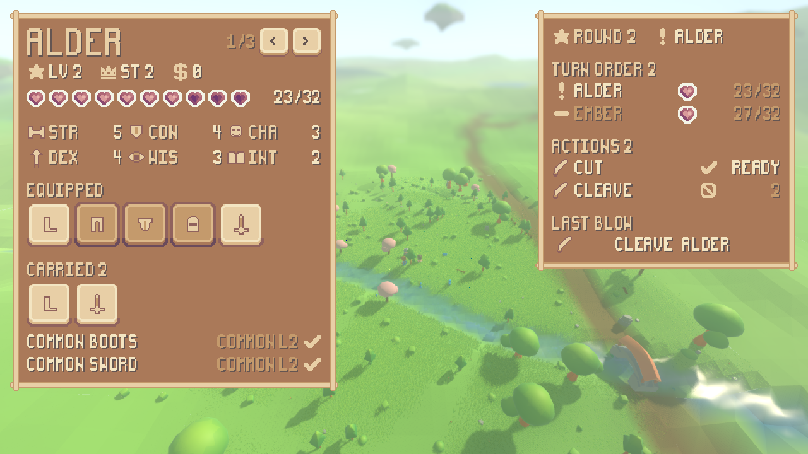
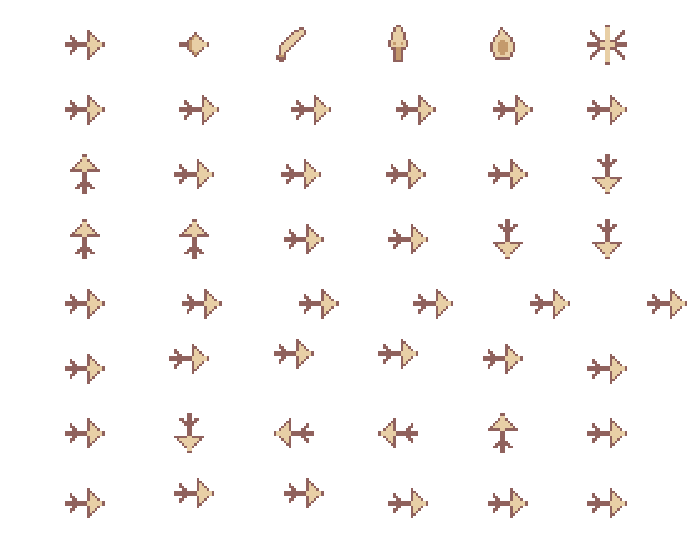
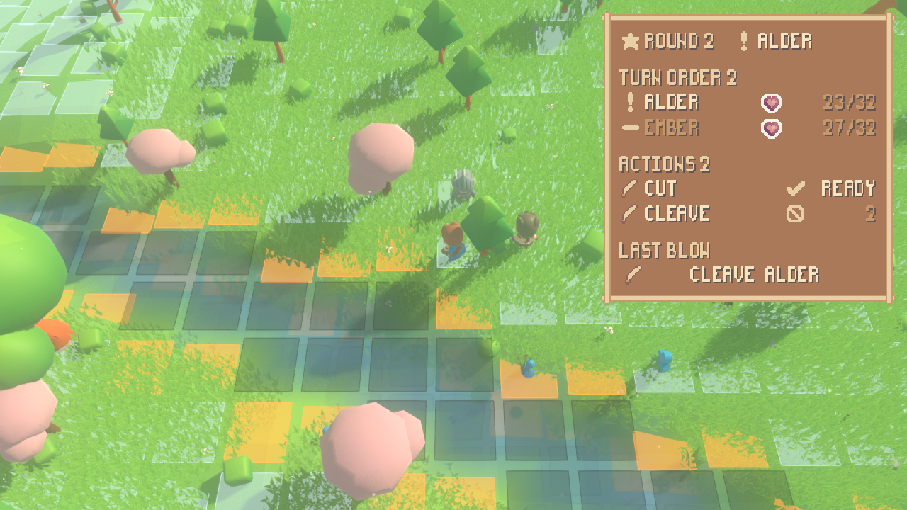

# A fight you can read, and a blow you can see

The second panel of the pixel interface: during a fight it says whose turn it is,
the order the commanders act in, and — for the commander whose turn it is — each
weapon action with either that it is available now or how many turns of cooldown
are left on it. Beside it, the two vocabularies the composable effect base names
in `sim/asset_tags.gd` — six effect sprites and seven animations — get render-side
rows, so a resolved weapon action is something you can watch rather than only
something the readout can name.

```
./tools/extract_sprout_lands.sh                        # the pack (the user's own zip)
./run_render.sh --readout --scenario encounter         # the readout over the world
./tools/measure_ui.sh --effects reports/assets/effect-art.png   # the second art table
xvfb-run -a ./tools/measure_ui.sh --panel readout --tick 18     # ...and is it crisp
./run_tests.sh --layers-only                                    # ...and is it on the right side
```



`seed 1234`, scenario `encounter`, **tick 18**. Round 2 of the fight; Alder is
acting; `cut` is available and `cleave` has two of its three turns left; the last
blow on the record is the `cleave` Alder struck with in round 1. Reproduced by

```
xvfb-run -a ./tools/measure_ui.sh --panel readout --tick 18 --keep reports/assets/combat-readout.png
```

which is `./run_render.sh --seed 1234 --scenario encounter --sheet --readout
--screenshot <png> --screenshot-tick 18` with a measurement run over the frame
afterwards.

---

## 1. What it shows, and where every number on it comes from

| on the panel | read from | how |
| --- | --- | --- |
| the round | the match | `round_number` |
| whose turn it is | the match | `active_id()`, then the fight's own map from that id to the person standing in the world, then that person's character sheet for the name |
| the order the commanders act in | the match | `commanders()` — the ids in turn order, which is the order a round is played in |
| each commander's health | the piece on the board | `health` and `max_health()` |
| each weapon action's name | the item in the acting commander's hands | the effect's own name |
| whether it may be used now | the commander | `can_attack(index, round)` |
| how many turns remain | the commander | `turns_until_ready(index, round)` |
| the last blow | the cooldowns themselves | see §3 |

Nothing on that list is copied, cached or pushed. `render/ui/combat_panel.gd`
holds a reference to the world the simulation is stepping and reads every one of
those again on every frame, through `render/ui/fight_source.gd`, which is the one
place the interface reaches into the simulation for a fight — the same
arrangement `render/ui/sheet_source.gd` already has for a character sheet.

**No simulation change of any kind was needed.** Everything the readout wants was
already exposed: `CombatMatch` has the round, the turn order and whose turn it
is; `Commander` has `attack_count`, `attack_at`, `cooldown_of`, `can_attack` and
`turns_until_ready`; `Attack` carries its own sprite and animation tags. The stop
condition on this work item was "if the combat state does not expose cooldowns or
turn order in a form the render side can read, stop and report the seam" — it
does, and the seam did not have to move.

---

## 2. Every icon on it, one by one

Eleven things are drawn on the readout. Five come out of the pack's generic icon
sheet, one out of its heart sheet, and six the pack has no equivalent for and this
project drew.

### From the pack's generic icon sheet

`icons.png` is 18 columns by 3 rows of 16×16: the same eighteen icons in white
(columns 0–5), cream (6–11) and tan (12–17). Cream is the set that reads against
the frame's dark interior, so every one of these is a cream one.

| # | icon | where it is in the sheet | what it marks on the readout |
| --- | --- | --- | --- |
| 1 | star | cream column 5, row 0 | the round |
| 2 | exclamation mark | cream column 0, row 1 | the commander whose turn it is — in the header and against its row of the turn order |
| 3 | horizontal bar | cream column 1, row 2 | a commander waiting its turn |
| 4 | tick | cream column 3, row 2 | a weapon action that may be used now |
| 5 | prohibition sign | cream column 5, row 2 | a weapon action still cooling down |

The tick and the prohibition sign do double duty: the character sheet already
uses them for a carried thing that is worn and one that goes in no slot at all.
They are named for what they are on the sheet rather than for either use, so
`SproutPack.ICON_TICK` and `SproutPack.ICON_BAR` are the constants and the sheet's
older `ICON_WORN` and `ICON_NO_SLOT` are aliases of them.

### From the pack's other art

| # | thing | pack file | where |
| --- | --- | --- | --- |
| 6 | heart, full | `hearts.png` | `0,0 16×16` — one per commander in the turn order, beside its health |
| 7 | the frame and the type | `ui_sheet.png`, `pixel_font.ttf` | the theme the character sheet established, carried down rather than re-decided |

### Drawn here, in the same sixteen-pixel idiom

The six effect sprites, in `render/effect_art.gd` — §4. Same 16-pixel cell as the
pack, same three colours sampled out of the pack's own frame (`#90625d` edge,
`#c49a6c` shaded face, `#e8cfa6` lit face), same sixteen-rows-of-source form, and
built by the same `PixelIcons.draw` the character sheet's eleven icons are built
by, so there is one place that turns `.oml` into pixels rather than two that could
drift apart.

| # | sprite | drawn as | where it appears on the readout |
| --- | --- | --- | --- |
| 8 | `arrow` | a shaft with a head and fletching | beside any weapon action that looses one |
| 9 | `bolt` | a lozenge of light with a short tail | " |
| 10 | `blade` | a curved crescent with a hilt | Alder's `cut` and `cleave`, in the screenshot |
| 11 | `point` | a spearhead on a shaft | Ember's `thrust` |
| 12 | `flame` | a flame | a staff's `fireball` |
| 13 | `impact` | an eight-rayed burst | a flail's `sweep`, a shield's `shove` |

Nothing else on the panel is an icon: the rest is type and the frame.

---

## 3. The last blow, read out of the cooldowns rather than remembered

The panel shows the weapon action most recently resolved in the fight, with its
own sprite, playing the animation that action names. It works out which one that
is without remembering anything, and the arithmetic is worth writing down because
it is what lets the readout keep no second copy of the fight.

A cooldown in this simulation is not a countdown. An action used on turn $t$
records the turn it next becomes available on, $t + c$ for a wait of $c$, and
"how many turns left" is the subtraction $r = (t + c) - t'$ at the turn $t'$ being
asked about. So:

$$c - r \;=\; t' - t$$

— the remaining wait subtracted from the whole wait is exactly **how many rounds
ago the action was spent**. An action with its whole wait still on it ($r = c$)
was spent this very round; one reading $r = c - 1$ was spent last round; and an
action that has never been used reads $r = 0$, which is not a candidate at all.

`FightSource.last_blow` therefore walks the commanders backwards from whoever is
acting now — the one nearest behind the active commander is the one who acted
least recently ago — and takes the smallest $c - r$ it finds. That is a pure read
of state the simulation already holds. There is no cursor into the transcript, no
signal, and no "who struck last" field anywhere on the render side.

**What the reading cannot do**, stated because it shows on the panel: an action
that is *ready again* keeps no record of when it was last used, so a blow is
visible for as many rounds as the action that struck it waits, and no longer. A
sword's `cut` waits one turn, so it is on the readout for one round; its `cleave`
waits three and is there for three. That is a consequence of the simulation
recording readiness rather than history, and fixing it would be a simulation
change, which this work item forbids. Raised rather than worked around.

`tests/test_ui_readout.gd` checks the arithmetic against the fight's own
transcript rather than against itself: it steps the encounter until the fight
writes down a weapon action on a tick that did not also wrap into the next round,
then asserts that the cooldowns name that same action, zero rounds ago.

---

## 4. The second art table

`sim/asset_tags.gd` holds two vocabularies outside the prop catalogue: six effect
sprites (`arrow`, `bolt`, `blade`, `point`, `flame`, `impact`) and seven
animations (`lunge`, `slash`, `swing`, `shoot`, `cast`, `spin`, `bash`). Every
composable effect carries one of each. Until now nothing under `render/` knew what
any of them looked like.

They are answered by `render/effect_art.gd`, a second table beside
`render/asset_library.gd` rather than more rows inside it, for two reasons. The
catalogue is the set of things that can be *standing in the world*, every one of
which the render layer builds as a scene and puts on the ground — a sprite is not
one of those and a motion is not a thing at all. And `tests/test_asset_tags.gd`
pins `AssetLibrary.tags().size()` against `AssetTags.all()`, so extending the
catalogue would have forced that count apart. **The catalogue is untouched and
that test passes unchanged.**

### The six sprites and the seven motions



The top row is the six sprites. Each row under it is one animation, six poses
across one play, drawn with the arrow — a diagram of seven motions should differ
between rows only in the motion, and the burst the catalogue pairs `spin` with is
symmetric under a quarter turn, so a spin drawn with it would show as nothing at
all. Written by `./tools/measure_ui.sh --effects reports/assets/effect-art.png`,
which also prints the numbers:

```
sprites: arrow, bolt, blade, point, flame, impact
lunge (the catalogue pairs it with the point): (0,0)x0 (4,0)x0 (7,0)x0 (7,0)x0 (4,0)x0 (0,0)x0
slash (the catalogue pairs it with the blade): (0,0)x-1 (2,0)x0 (3,0)x0 (3,0)x0 (2,0)x0 (0,0)x1
swing (the catalogue pairs it with the blade): (0,0)x-1 (2,0)x-1 (4,0)x0 (4,0)x0 (2,0)x1 (0,0)x1
shoot (the catalogue pairs it with the arrow): (0,0)x0 (5,0)x0 (10,0)x0 (14,0)x0 (19,0)x0 (24,0)x0
cast (the catalogue pairs it with the flame): (0,0)x0 (0,-4)x0 (0,-6)x0 (0,-6)x0 (0,-4)x0 (0,0)x0
spin (the catalogue pairs it with the impact): (0,0)x0 (0,0)x1 (0,0)x2 (0,0)x2 (0,0)x3 (0,0)x4
bash (the catalogue pairs it with the impact): (0,2)x0 (2,-2)x0 (4,-2)x0 (4,2)x0 (2,2)x0 (0,2)x0
```

Each triple is `(x,y)` in whole art pixels and a turn in whole quarter turns. A
motion is six fields — how long a play lasts, how far the sprite travels along and
across its own axis, how far it turns, whether it crosses one way or goes out and
comes back, and whether the travel across is a rise or a rattle — and
`EffectArt.pose_of` turns a row and a phase into a pose, so the panel draws any of
the seven without knowing which one it has.

| animation | seconds | reach | lift | sweep | one way | rattle |
| --- | --- | --- | --- | --- | --- | --- |
| `lunge` | 0.28 | 7 | 0 | 0 | no | no |
| `slash` | 0.24 | 3 | 0 | 1 | no | no |
| `swing` | 0.40 | 4 | 0 | 2 | no | no |
| `shoot` | 0.50 | 24 | 0 | 0 | yes | no |
| `cast` | 0.60 | 0 | −6 | 0 | no | no |
| `spin` | 0.45 | 0 | 0 | 4 | yes | no |
| `bash` | 0.22 | 4 | 2 | 0 | no | yes |

### Whole pixels here too

Every pose is a whole number of art pixels and a whole number of quarter turns.
That is the same rule the rest of the interface is drawn under and it is here for
the same reason: a sprite that slides two-thirds of a pixel or turns seventeen
degrees has a blurred edge on every frame of the play, which is the one thing this
idiom cannot have. The arithmetic inside `pose_of` is smooth and its *result* is
rounded, rather than the other way round — and a quarter turn is the only turn
that maps a square of pixels exactly onto itself.

`tests/test_ui_readout.gd` asks for 65 poses of each of the seven and checks every
one of them is whole pixels and a right angle, that each animation moves its
sprite somewhere its still pose is not, and that no two of the seven play
identically — a table of seven identical rows would pass every other check and
would be seven names for one animation.

---

## 5. Whole pixels, measured on the readout

The same instrument the character sheet was measured with, pointed at the new
panel: it renders a real frame of the readout over the real world, then asks that
frame two questions over the panel's interior.

```
$ xvfb-run -a ./tools/measure_ui.sh --panel readout --tick 18 --keep reports/assets/combat-readout.png
render-shell boot seed=1234 chunks=32 far=1 fartris=160 islands=10 grass=12594 motes=588 sheet=2/3 aa=msaa4+fxaa
render-shell sheet scale=2 x=16 y=16 w=520 h=604 sheets=3 showing=0
render-shell readout scale=2 x=848 y=16 w=416 h=378 fight=1

frame          reports/assets/combat-readout.png (1280x720)
panel          at 848,16 size 416x378, interface scale 2
measured       at 866,34 size 380x342 (inside the frame's rails)
palette        66 colours: the pack's own files plus PixelIcons' three
distinct       13 colours over 129960 pixels
off-palette    0 of 129960 = 0.0000%
edges          12014 changes of colour along rows and columns
off-grid       0 of 12014 = 0.0000%
```

Thirteen colours over a hundred and thirty thousand pixels, every one of them the
pack's, and not one of twelve thousand edges off the grid — with the last-blow
sprite part-way through its play when the frame was taken, four whole art pixels
along its axis. The readout carries no
theme of its own: it inherits the one `render/ui/sprout_theme.gd` built for the
character sheet, at font sizes 14 and 28, both whole multiples of the font's own
14-pixel cell. `tests/test_ui_readout.gd` checks that too, by walking the whole
panel and failing on any Control that overrides a font, a size or a style.

---

## 6. Which side of the line it is on

**No file under `sim/` was touched by this work item.** Everything the readout
wanted was already exposed; nothing was added to the simulation to get it. Three
files are new, all under `render/`, and five more moved:

| file | new? | what it is, or what changed |
| --- | --- | --- |
| `render/effect_art.gd` | new | the second art table: six sprites, seven motions, keyed on the tags |
| `render/ui/fight_source.gd` | new | the one place the interface reaches into the simulation for a fight |
| `render/ui/combat_panel.gd` | new | the panel |
| `tests/test_ui_readout.gd` | new | the suite |
| `render/ui/pixel_ui.gd` | — | holds a second panel; one theme, two corners, either asked for on its own |
| `render/ui/sprout_pack.gd` | — | four more rectangles of the pack's icon sheet, two of them aliases of the sheet's own |
| `render/ui/pixel_icons.gd` | — | `_build` became the public `draw`, so the sprites and the icons share one builder |
| `render/main.gd` | — | the `--readout` flag and a `render-shell readout` geometry line for the measuring tool |
| `tools/measure_ui.{sh,gd}` | — | `--panel readout` measures the new panel; `--effects` writes the art table out as a picture |

```
$ ./run_tests.sh --layers-only
layer check: OK -- res://sim references nothing in the render layer
combat check: OK -- res://render draws the fight and holds none of it
interface check: OK -- res://render/ui names its art through sprout_pack.gd alone
asset check: OK -- res://sim names asset tags and no asset
```

The **combat check** is the one that bites here. It forbids the render layer from
naming any of the combat simulation's own types — the match, the units, the
weapons, the effects — because a shell that names one has started to *hold* a
piece of the fight rather than read one. So `fight_source.gd` takes its steps
through `Variant`, exactly as `sheet_source.gd` already does for a character
sheet, and every one of those steps is a read. The alternative would have been to
widen the simulation's snapshot until it carried a turn order and a cooldown
table, and a snapshot is a copy by construction — a cooldown copied on a tick is a
cooldown that can be wrong on the next.

`render/effect_art.gd` sits under `render/` rather than `render/ui/` because it is
the second table beside the prop table, not a piece of the interface; the combat
check covers it there, and the interface check covers the three files in
`render/ui/`.

### A headless run loads none of it

```
$ ./run_headless.sh --seed 1234 --ticks 40 --assets
assets visual-files found=3390 loaded=0
assets render-scripts found=22 loaded=0
assets sim-scripts found=84 loaded=76 -> res://sim/water_sheet_builder.gd,...
```

The middle line counts twenty-two render scripts — three more than before this
work item: the effect table and the two new interface files — and none of them is
loaded. Neither is any of the 3390 visual files, which since the character sheet
landed includes the pack's fonts. The third line is the control: without it two
zeros would be indistinguishable from a probe that never worked, and
`tests/test_ui_readout.gd` additionally checks that `render/effect_art.gd` really
is on disk for the report to have skipped.

### And the readout changes nothing about the world

The same seed run twice, with the encounter set out and with the readout drawn
over it, reaches the same world fingerprint. `tests/test_ui_readout.gd` runs both.

### The suite

`./run_tests.sh` runs 39 suites. `tests/test_ui_readout.gd` is the new one and
`tests/test_asset_tags.gd` — the one that pins the prop catalogue — is unchanged
and still passes.

```
$ ./run_tests.sh
...
PASS  asset tags     1330 checks
...
PASS  ui panel       157 checks
PASS  ui readout     1523 checks

all 39 suites passed (194194 checks)
```

---

## 7. What this is not

No player input path: the readout shows a fight, it does not let a person take a
turn. No dialogue panel, no trade panel, no menu system — those wait for the model
layer they are about.

One thing a reader should know before running it live. The encounter scenario's
fight is **seven ticks long** — it begins at tick 16 and is decided at tick 22 —
and the world steps at twenty ticks a second, so the readout is on screen for
about a third of a second in a live run. That is the simulation's own cadence and
not the panel's; `--screenshot-tick` is how a frame of it is taken reproducibly,
and `--paused` holds the world still.



`./run_render.sh --seed 1234 --scenario encounter --readout --board --camera 0 26
16 --aim 0 --fov 45 --screenshot <png> --screenshot-tick 18` — the same tick 18,
with the camera brought down onto the lattice so the two commanders the readout is
naming are in the frame. The camera flags move the picture and nothing about the
world: the fingerprint is the same with them and without them.
