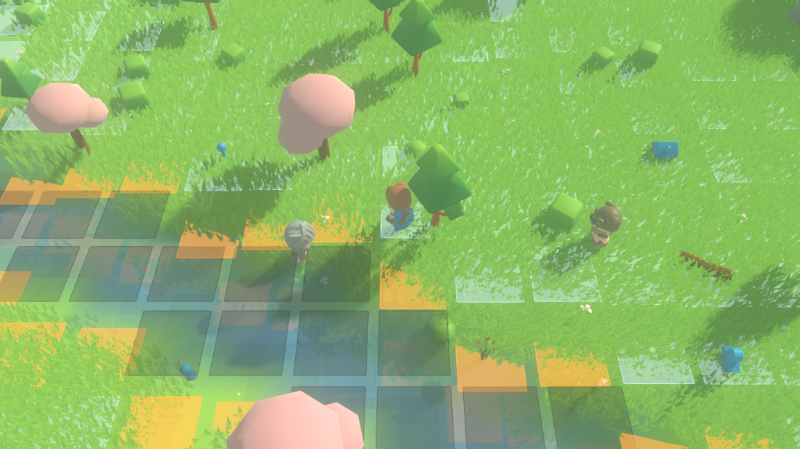
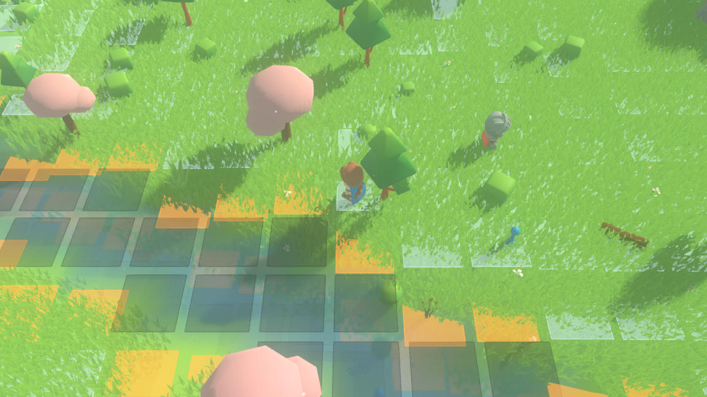
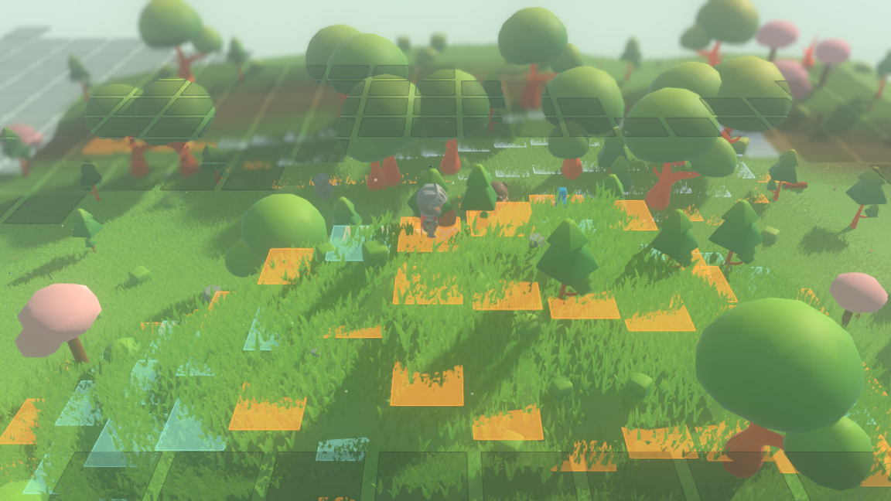

# Real time until a fight starts: the snap onto the board and back

The overworld runs in real time. Characters walk on floating-point positions,
the ground streams in and out around them, the water ripples, the islands hang
overhead. The instant two commanders come close enough, the local area **snaps**
onto the tactical lattice: the combatants stop walking and stand on cells, a
turn-based match is played out one turn per world tick, and when it resolves
every survivor is put back down at the world position its last cell corresponds
to and walks on. The rest of the world never stops.

This is the layer that makes those two things one world. It is four small files
under `sim/`, and the load-bearing one is fourteen lines long.



*Tick 13, seed 1234. The knight (left of centre) and the barbarian (right) are
walking towards each other at 0.6 world units per tick; their minions — the small
blue board pieces — are strung out behind them at whatever positions walking put
them. Nobody is on a cell. The pale squares are the world-fixed lattice drawn as
an overlay (`--board`); the amber ones are cliff edges, which along the near
shore is every square at the water's edge. The ranger in the middle is the
**observer** — the placeholder walker the camera follows. It is not a combatant
and takes no part in anything.*

---

## The claim, in one line of arithmetic

The board's lattice is fixed to the world origin: cell $(i, j)$ is centred at
$((i + 0.5)s, (j + 0.5)s)$ for a cell size $s$, and nowhere else, whoever asked
for it. So the two directions of the snap compose to the identity on cells:

$$\text{cell\_of}(\text{centre\_of}(c)) = c \quad \text{for every cell } c$$

That is *exact*, not approximate, and the reason is that `centre_of` puts the
position half a cell from every edge while `cell_of` floors — so the answer
cannot land on a boundary whatever floating-point arithmetic does with a half.
`CombatSnap.round_trips()` asks it of every cell of a board, and the suite runs
it on a typed-out board, on three boards read off the generated ground, and on
one read off a floating island's top.

The other direction does **not** compose to the identity and cannot: a cell is
three world units across and a position is a point, so `centre_of(cell_of(p))`
is $p$ moved to the middle of its cell. That is the snap, and the most it can
ever move anybody is half a cell's diagonal, $\tfrac{3\sqrt2}{2} \approx 2.12$
world units. The suite checks that bound over 361 sampled positions as well as
checking, by walking every cell of the board, that the cell chosen really is the
nearest one.

This is what the task's stop condition was about — *if snapping continuous world
positions onto lattice cells cannot be made to round-trip, stop and report*. It
round-trips exactly, so the condition never fired.

---

## What is in the layer

Five files, and each one answers a single question.

| file | the question it answers |
|---|---|
| `sim/combatant.gd` | what a piece standing in the continuous world is |
| `sim/combat_snap.gd` | how a world position becomes a cell, and a cell a world position |
| `sim/encounter.gd` | who joins a fight, what board it is on, and how it ends |
| `sim/combat_policy.gd` | the smallest written-down rule that makes a fight finish |
| `sim/combatant_roster.gd` | everyone who can fight, walking, and when a fight starts |

**`Combatant`** is a `Piece` and a world position, and it exists so that neither
layer has to learn the other's coordinates. The board layer still knows only
cells; the overworld still knows only floats. A combatant carries its piece for
its whole life, so hit points taken off in one fight are still missing after it.

**`CombatSnap`** is the whole of the conversion, in two functions facing each
other. `cell_for()` forwards to `CombatBoard.cell_of` rather than restating it,
so the cell a combatant snaps to and the cell the board built for that ground are
the same cell by construction. `world_of()` takes the height from *the board*
rather than from a fresh terrain lookup — the board was read on one storey, and a
survivor of a fight on a floating island has to come back onto the island rather
than onto the ground under it.

---

## Snapping in: nearest, and what happens when nearest will not do

The cell a combatant is standing over may be a hole, may be built on, or may
already hold somebody else. `CombatSnap.place()` then searches outwards in rings
of increasing distance, and inside a ring by true distance from where the
combatant was standing with the lattice order breaking exact ties. Combatants are
seated in roster id order, so which of two contending for one cell gets it is
decided the same way in every process.

The demonstration fight is held on a meadow with a stream running through it, and
two of the six combatants walked into the stream:

```
snap-in around #1 at (-484.400, -2.816, 420.000) radius=24.0 span=30.0 storey=0 joined=6
snap-in board 3e76efeea93a2242 cells=441 standable=401 holes=40 cliffs=42
snap-in #1 (-484.400, 420.000) -> cell (-162,139) centre (-484.500, 418.500) moved 1.503 rings=1
snap-in #2 (-488.400, 415.000) -> cell (-163,138) centre (-487.500, 415.500) moved 1.030 rings=0
snap-in #3 (-488.400, 425.000) -> cell (-163,142) centre (-487.500, 427.500) moved 2.657 rings=1
snap-in #4 (-475.600, 420.000) -> cell (-159,140) centre (-475.500, 421.500) moved 1.503 rings=0
snap-in #5 (-471.600, 415.000) -> cell (-158,138) centre (-472.500, 415.500) moved 1.030 rings=0
snap-in #6 (-471.600, 425.000) -> cell (-158,141) centre (-472.500, 424.500) moved 1.030 rings=0
```

`rings=0` means the cell it was standing over took it, which is four of the six.
The two that read `rings=1` were standing in the water, and the board says so:

```
-162 140 none 0.0000 -1 0 ----- hole move ---- -----     <- where #1 was standing
-162 139 -2.4096 far   0 0 stand ---- ---- ---- cliff    <- where #1 was seated
-163 141 none 0.0000 -1 0 ----- hole move ---- -----     <- where #3 was standing
-163 142 -3.6610 far   0 0 stand ---- ---- ---- cliff    <- where #3 was seated
```

Both were put on the bank, one cell away, on the cliff-edge squares along the
water — which is where a walker wading the stream would have to climb out. Nothing
was nudged and no rule was bent: the search asked the board which neighbouring
cell would take a piece, and took the nearest one that said yes.

**When nothing says yes, the fight does not happen.** `place()` searches four
rings — twelve world units — and then reports failure, and `Encounter.begin()`
comes back with `refused` set, having started no match and moved nobody. The
suite exercises both shapes of that: a board that is nothing but hole, and a board
with exactly one standable cell and two combatants over it.


*Tick 19, the same seed and the same fight. The knight and the barbarian are now
adjacent on cells `(-161,138)` and `(-160,139)`; the knight's Cat sits on the cell
below them and the barbarian's Ent is off to the right. Every figure is standing
on a cell centre. Round 2 of 3.*

---

## Local means a radius, and the radius is one number

`Encounter.JOIN_RADIUS` is 24 world units — eight lattice cells — measured from
the commander whose approach triggered the fight. Everything inside it joins;
everything outside it is untouched, with one exception stated in the code:

> a minion joins only if its commander did, because a minion without its
> commander on the board is a piece with no king, and the king rule of section
> 3.3 would have nothing to remove it with.

The board is anchored on the triggering commander's own position and height
rather than on a midpoint between the two, and that is a decision with a reason.
A board has to be told which storey it is about and it is told by a height; a
midpoint is a position nobody is standing at, so the height there names no storey
reliably. `Encounter.BOARD_SPAN` is 30 units — wider than the join radius by two
cells on every side — so everyone who joined is inside the board with room for
the placement search.

The demonstration scenario carries a **third band** 70 units away with a commander
of its own, so nothing but the radius is keeping it out. The suite checks that its
positions during the fight are exactly what walking for that many ticks gives, to
three decimal places, and that the fight's membership is exactly the combatants
that were inside the radius.

**And the world goes on.** A fight takes one turn per world tick, and the tick
that gives it that turn is the same tick that walks everybody else, streams the
terrain, rebuilds the water sheet and moves the observer. The suite runs the
scenario with the observer walking and requires the chunk counter to rise *during*
the fight, and requires all 45 ticks of the run — fight or no fight — to be
distinct world states.

---

## Snapping out

`Encounter.conclude()` puts every survivor at `CombatSnap.world_of(board, cell)`
of its own last cell. There is no smoothing and no second conversion: it is the
same function the snap in used, run the other way. The transcript prints the cell,
the position, and the cell that position snaps back to, so the round trip is in
the record rather than asserted:

```
over turns=7 rounds=4 ending=decided survivors=3 fallen=3
snap-out #1 cell (-161,138) -> (-481.500, -2.404, 415.500) back to cell (-161,138) hp=5/32
snap-out #2 cell (-161,140) -> (-481.500, -2.720, 421.500) back to cell (-161,140) hp=14/14
snap-out #3 cell (-163,142) -> (-487.500, -3.661, 427.500) back to cell (-163,142) hp=14/14
snap-out #4 fell
snap-out #5 fell
snap-out #6 fell
```

The fallen are dropped out of the world entirely — including any despawned by the
king rule, which never lost a hit point. The survivors resume walking on the tick
after, along the heading they walked in with.



*Tick 30, nine ticks after the fight resolved. Only the knight's band is left, and
it has walked 5.4 world units east from the cells it was standing on. The lattice
in the overlay is the same lattice — it is fixed to the world, so it does not move
when a fight ends; what moved is the commander.*

---

## A fight anywhere a character can stand

Nothing in `Encounter` tests for floating islands. It hands the board layer the
commander's position and the height it was standing at, and the storey follows —
which is the same resolution `SimWorld` uses to put an observer down. So a fight
that begins on an island's top is held on that island's board with no special
case anywhere:

```
snap-in around #1 at (-382.842, 14.416, 331.514) radius=24.0 span=30.0 storey=1 joined=4
snap-in board 865fa611c7a84285 cells=441 standable=150 holes=291 cliffs=79
```

`storey=1` is the island. 291 of the 441 cells are holes — the void off the rim —
and 79 are cliff edges. The whole cycle is `./run_encounter.sh --island`.



*The aerial board. The amber squares are cliff edges — on an island top, nearly
everything within a cell of the rim is one — and the dark plates beyond are holes:
the void off the edge, drawn at the height a piece would have been standing at had
there been anything there. The knight and the barbarian are on cells `(-128,110)`
and `(-125,110)`.*

---

## The move rule, and why there is one at all

A fight that begins in the world has to *finish* before the world can go back to
real time, so something has to choose the moves. `sim/combat_policy.gd` is
deliberately the dullest possible chooser — four greedy steps in a fixed order,
every tie broken by a stated ordering, nothing remembered between turns, no random
input anywhere:

1. **Close.** Move to the reachable cell nearest the nearest enemy commander, and
   only if that is strictly nearer than standing still.
2. **Turn.** Face the nearest enemy piece. Turning is free, so it costs nothing.
3. **Swing.** Of the attacks off cooldown, use the one covering the most enemy
   pieces, and only if that is at least one.
4. **Send one minion.** Prefer a capture or a strike, commanders first; failing
   that, step the minion that can get nearest an enemy commander.

This is **not** section 3.9's minion AI and it is not a decision interface for a
player. Both are later work, and the human action interface belongs to
`W-characters`. What this is, is the least thing that makes the cycle close.

Everything it does goes through `CombatMatch`, so the turn budget is enforced by
the match rather than trusted here: a step the policy gets wrong is refused and
written into the transcript, not silently taken.

**Why it terminates, and where that stops being a proof.** Two commanders close
until one is inside the other's pattern, and every landed blow takes at least
`Damage.MINIMUM` off, so hit points fall monotonically once contact is made. But
it is a greedy rule: two commanders separated by ground neither can cross would
close and then stand. `Encounter.MAX_ROUNDS` is 40, and a fight that hits it ends
with `ending=limit` in the transcript rather than quietly looking like a decided
one.

---

## Where the fight is held, and why there

`./run_headless.sh --snap` scores 289 candidate places over a 960-unit square of
the world on three numbers, each measured rather than judged:

| number | what it measures | threshold |
|---|---|---|
| `stand` | share of the board's cells a piece may stand on | $\ge 0.90$ |
| `relief` | world units between the highest and lowest standable cell | $\le 6.0$ |
| `flora` | things the scatter layer grew in the chunk it sits in | $\le 40$ |

The third is the only one about the *picture*: the board does not carry a tree, so
a fight in a canopy is perfectly legal and completely unwatchable. 25 of the 289
pass all three. The scenario's meeting place is `(-480, 420)` — the one of those 25
with a real shoreline on its board:

```
snap -480 420 meadow stand=0.909 relief=5.62 flora=13 holes=40 cliffs=42 built=0 ok
```

The full survey is in [snap-survey-evidence.txt](snap-survey-evidence.txt).

---

## The render layer draws the fight and holds none of it

The shell reads combat through `SimWorld.snapshot()` and through a detached
`CombatBoard`, and that is all. `render/combat_diorama.gd` turns the combat part of
a snapshot into rows to draw — where each piece stands, which way it is turned,
which clip it should play — and it is a pure function with no members: the same
snapshot gives the same rows however many times it is called and whatever was
called in between.

This is checked two ways.

**Structurally.** `./run_tests.sh --layers-only` now runs a third rule beside the
two that were already there. No file under `render/` may name `CombatMatch`,
`CombatantRoster`, `CombatPolicy`, `CombatResolution`, `CombatSnap`, `Encounter`,
`ScriptedEncounter`, `ScriptedMatch`, `PieceMap`, `LegalMoves`, `MoveGrant`,
`PieceGeometry`, `BoardSketch`, `Combatant`, `Commander`, `Minion`, `Piece`,
`Damage`, `Attack`, `Weapon` or `Armour`. Exactly one name of the combat layer is
allowed through, and it is a read-only handle: `CombatBoard`, which the shell is
handed as a detached copy exactly like a chunk's geometry.

That rule is why the shell asks for a **named scenario** rather than calling into
the scenario file. `Simulation.begin_scenario("encounter")` names a string, and the
string is the whole of what the render layer knows about combat.

```
layer check:  OK -- res://sim references nothing in the render layer
combat check: OK -- res://render draws the fight and holds none of it
asset check:  OK -- res://sim names asset tags and no asset
```

**Behaviourally.** The suite takes two snapshots — one walking, one fighting —
calls `placements()` on each with the other in between, and requires the answers
to be identical; then it checks every drawn value against the snapshot row it came
from. A commander standing on a cell is turned by its facing and is standing
still; one walking the world is turned by its heading and is moving. Neither fact
is worked out in the render layer: the snapshot carries the speed, because the
simulation already knows it.

The four facings turn into the four quarter turns and nothing else. The lattice's
north is $-z$ and a heading walks along $(\cos h, \sin h)$ in $(x, z)$, so
$h = (\text{facing} - 1)\tfrac{\pi}{2}$.

---

## Running it

```bash
./run_encounter.sh                 # the whole cycle, headless, 60 ticks, seed 1234
./run_encounter.sh --island        # the same cycle on a floating island's top
./run_headless.sh --ticks 0 --snap # where a fight can be held, over 289 candidates
./run_snap.sh                      # just this layer's suite
./run_tests.sh                     # every suite
./run_tests.sh --layers-only       # the three structure checks
```

`./run_encounter.sh` prints one line per tick in one shape whether or not a fight
is on — the tick number, what the roster is doing, how much of the world is
loaded, and the world's fingerprint — with whatever the fight wrote that tick
indented beneath it. That interleaving *is* the evidence that the world keeps
stepping: the chunk count and the fingerprint are on every line, including the
ones inside the fight.

```
tick 15 real-time chunks=34 islands=11 props=424 begun=0 ended=0 standing=8 ...
tick 16 fighting  chunks=34 islands=11 props=424 begun=1 ended=0 standing=8 ...
    snap-in around #1 at (-484.400, -2.816, 420.000) radius=24.0 span=30.0 storey=0 joined=6
...
tick 23 real-time chunks=34 islands=11 props=424 begun=1 ended=1 standing=5 ...
    over turns=7 rounds=4 ending=decided survivors=3 fallen=3
```

Two separate processes print those bytes identically; the suite runs the command
twice as a subprocess and compares. In-process repetition cannot see a dependence
on an address or on the order a dictionary happens to iterate in — a second
process can, because it lays its memory out differently.

The screenshots above were taken with:

```bash
xvfb-run -a ./run_render.sh --seed 1234 --scenario encounter --board \
  --camera 0 20 15 --aim 0 --fov 42 --focus 25 \
  --screenshot "$PWD/reports/assets/snap-during.png" --screenshot-tick 19
```

with `--screenshot-tick 13`, `19` and `30` for before, during and after, and
`--scenario encounter-island --camera 0 17 24 --aim 0 --fov 42 --focus 30
--screenshot-tick 6` for the aerial one. `--screenshot-tick` waits for a *tick*
rather than a frame, which is what makes a capture reproducible on any machine.

The full transcripts of both cycles are in
[combat-snap-evidence.txt](combat-snap-evidence.txt).

---

## What this layer deliberately does not do

* **No pursuit, fleeing or re-engagement.** A combatant walks along a heading
  somebody set. When a fight ends, survivors resume that heading. If two of them
  are still within `ENGAGE_RADIUS` on the next tick, a new fight begins — that is
  the rule, not a bug, and the roster's tick order is stated so it cannot happen
  on the same tick a fight ended.
* **No interface for choosing a move.** `CombatPolicy` chooses, and only because
  the fight has to end. The human action interface is `W-characters`.
* **No combat music, camera framing or transition effects.** A piece jumps from
  cell to cell between ticks. The design's "movement animates smoothly so the
  world still looks continuous" is a later concern; nothing here prevents it,
  because the render layer is already reading positions out of a snapshot.
* **Trees still do not block the board.** That was already true of the board layer
  and is written down in [combat-board.md](combat-board.md); it is why the `--snap`
  survey measures flora at all.

---

## What it changes about a world with nobody in it

Nothing, and that is checked. An empty roster fingerprints as the empty string and
`SimWorld.digest()` leaves it out entirely in that case. The hundred-tick
fingerprint of seed 1234 is `a6aa8e5776ebfe8c` both before this layer existed and
after — the same bytes from the same command.
