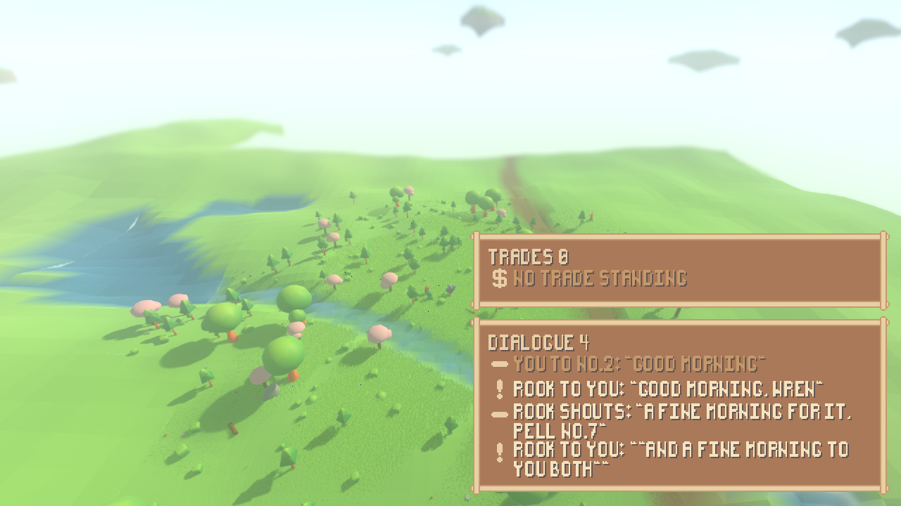
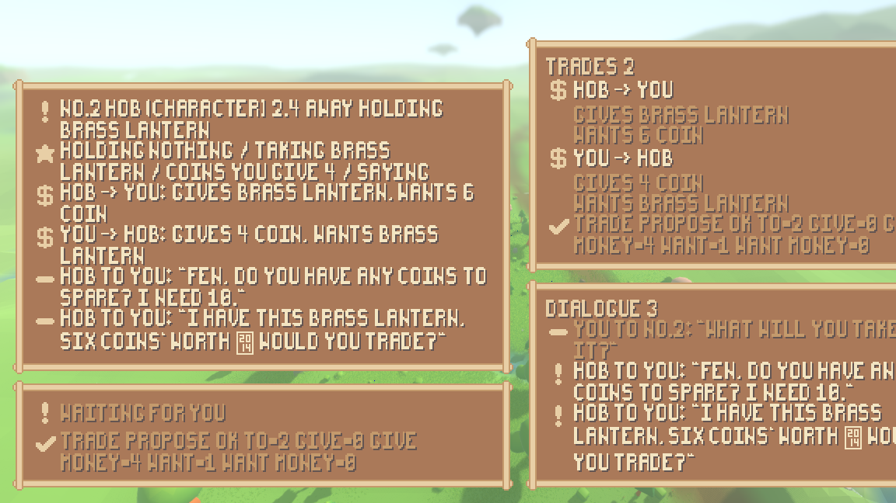
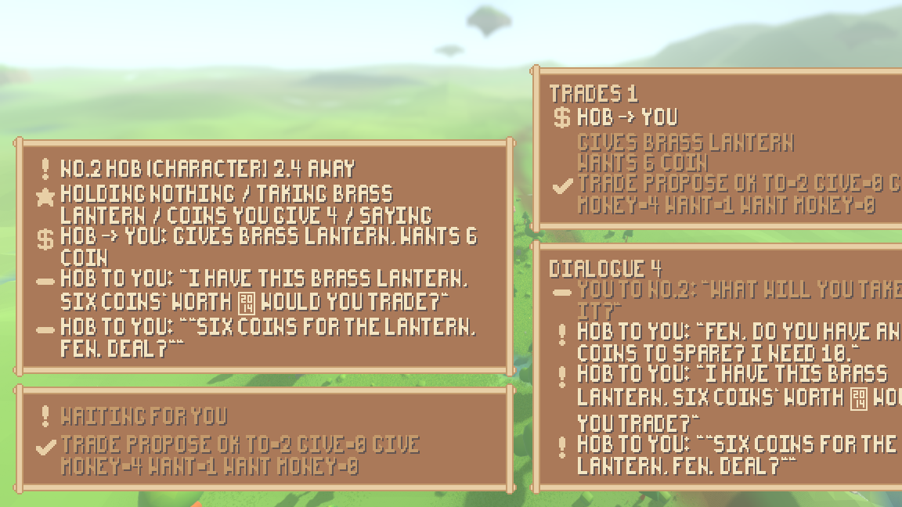
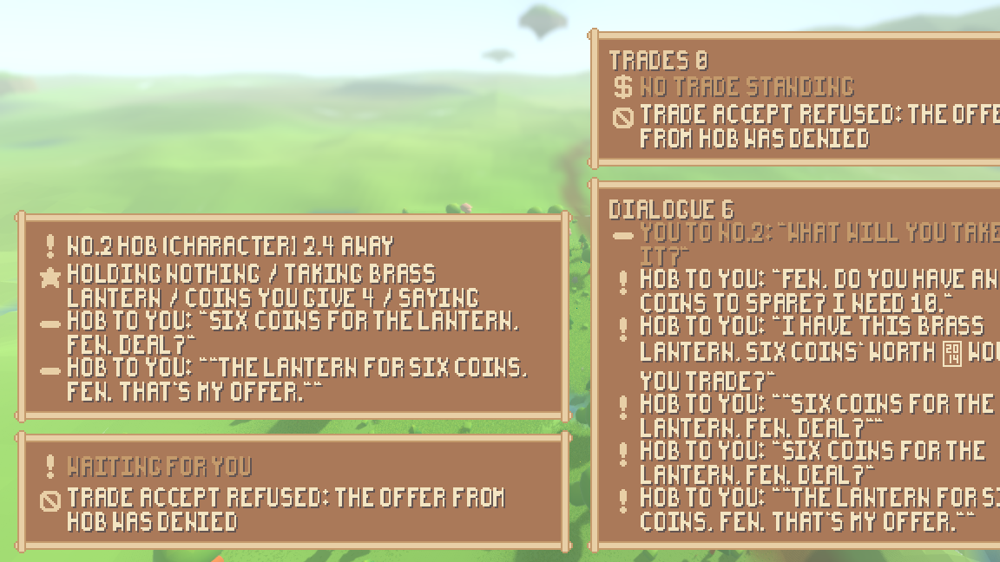
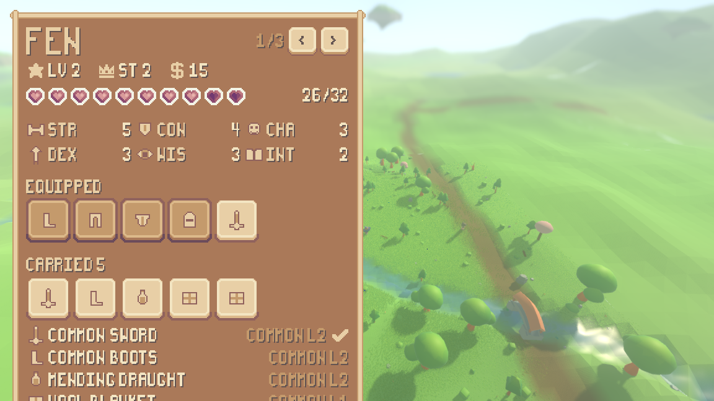
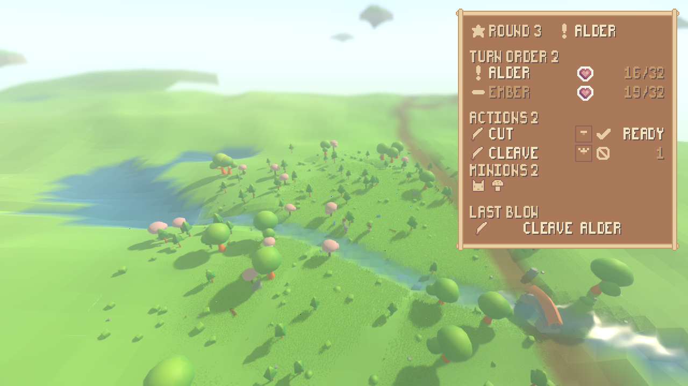

# The dialogue and trade panels, the want half of a trade, and the readout's missing icons

The two panels the Sprout Lands pack was chosen for now exist, and they had
something real to show the day they were built: characters say, shout and
trade through the atomic action surface, and five of six characters in the
shipped model run decide by asking a language model. This report covers the
two panels, the one simulation change that made the fourth half of a trade
fillable from a keyboard, the seeded run in which a person buys a named item
from a model-driven trader end to end, and the iconography the combat readout
still lacked: the four minion types and the weapon attack-pattern shapes.

Everything here is measured or replayed; nothing is asserted by eye. The
shipped transcripts this work had to leave alone are byte-identical before and
after, and the one place a person could observe more than a model has been
closed rather than widened.

## 1. The decision: a trade you are party to is observable

The finding this item carried (`I-d8d6b7b4670e`): `Action.trade_propose` takes
four things — items out, coins out, items back, coins back — and from a
keyboard a person could fill only three, because `want` names items somebody
else is carrying and nothing tells a person what another character carries.
Three ways out were on the table:

1. **Ask, then read the answer.** Rejected: whether a model names its wares is
   the model's whim — no rule can guarantee a person a path to buying — and
   picking an item name out of prose would put a parsing rule on the render
   side, where no rule may live.
2. **Widen what a trading partner may observe.** Chosen; see below.
3. **Answer an offer by editing it.** Rejected: it only works when the trader
   proposes first, which is precisely the limitation being fixed.

Way (2) was widened slightly from "what `examine` returns" to one rule about
observation, written in `sim/observation.gd` beside the other observation
rules, because building it surfaced a hole the finding had not named: **the
observation packet had no offers section at all.** A model-driven character
could not see an offer standing to it — it could never have accepted anything
— while the person's projection (`sim/surroundings.gd`) read the scene's
offers directly, observing a fact no model could. The person was, quietly,
observing more than a model. So the rule is:

> **A trade you are party to is observable.** Every offer standing to or from
> a character is in that character's packet, both halves written out. And
> while an offer stands between two characters, in either direction, and they
> are within `ActionEngine.REACH`, each one's entity row in the *other's*
> packet carries what it carries.

`Observation.carries_shown` is the whole rule and the one place it lives;
`ActionEngine.observed_of` asks the same function for an `examine`, so a close
look and the ambient packet cannot disagree. `Surroundings` now reads offers
off the packet instead of the scene, so "it is the observation, projected" is
true again — the person and a model see exactly the same thing, which
`tests/test_observation.gd` proves by running both directions: while the offer
stands each packet carries the other's pack, and both lose it on denial and
out of reach.

**Why nothing recorded drifted.** Both new sections print only where they
exist — the same shape an object row's `holds` and `needs` have always had — so
a packet with no trade standing prints exactly what it always printed. No
recorded run has an offer standing at any moment a model is asked, so every
recorded prompt digest is unchanged. Verified by byte-diff, not by argument:

| run | before vs after |
|---|---|
| `./run_agent.sh` | identical |
| `./run_lesson.sh` | identical |
| `./run_goal.sh` | identical |
| `./run_observation.sh` | identical |
| `./run_scenario.sh` | identical |
| `./run_headless.sh` seed 1234 | fingerprint `32656f55cc5eeb1c`, unchanged |

## 2. The keyboard grew no key

`render/player_controls.gd` builds the fourth half out of two keys it already
had. **C** picks "the next thing that can be seen inside what you have aimed
at" — the contents of an open container, and now, by the rule above, what a
trading partner within reach is shown. **O** offers a trade: what you hold and
the given coins on one half, and now what you have picked and the asked coins
on the other. Asking for a named item is picking it and pressing the offer
key. No new rule lives on the render side; `tests/test_player_actions.gd`'s
scan of the interface files still passes with the two new panels added to its
list.

## 3. A person buys a named item from a model-driven trader, end to end

The bargain run: the play stage byte for byte — same cast, gear, pile, chest,
seed 1234 — with the trader Hob deciding through a language model
(`sim/scripted_bargain.gd`), replaying a recorded exchange
(`net/model_recording.gd`, `BARGAIN_ROWS`: glm-5.3-flash over openrouter,
recorded 2026-09-09, the same model and endpoint as every other shipped
table). Hob is staged wanting to be carrying 10 coins — his opening purse plus
the price he has always asked — and nothing tells him to sell, at what price,
or to whom. The person is driven by a written-down script of key presses at
stated ticks through `PlayerControls`, the same file the shell feeds real
presses through, so the run the suite asserts (`tests/test_bargain.gd`), the
run the tool prints (`./tools/bargain_actions.sh`) and the run the shell
photographs are one run.

The arc, from the run's own record:

| tick | what happened |
|---|---|
| 8 | the person examines Hob: `equipment=- distance=6.0` — his equipment and **no pack**. There is no way to name the lantern. |
| 39–46 | Hob (model): "Fen, do you have any coins to spare? I need 10." |
| 49–54 | Hob: "I have this brass lantern, six coins' worth — would you trade?" |
| 36–41 | the person says "what will you take for it?" |
| 57–61 | Hob proposes his own bargain: `give=[brass lantern] want_money=6` |
| 53–58 | the person opens a trade of their own: `give_money=1, want nothing` — an offer may hold almost nothing |
| 60 | the trade stands, so Hob within reach shows his pack: the **C** key picks `brass lantern` out of it |
| 64–69 | the keyboard builds the ask: `trade_propose give_money=4 want=[brass lantern]` |
| 64–67 | Hob accepts the 1-coin opener as the gift it was: `took_money=1` |
| 78–81 | **Hob accepts the named ask: `took=0 took_money=4 gave=1`** — the lantern is in the person's pack |
| 101–104 | the person denies Hob's leftover counter-offer: `trade_deny ok from=2` |
| 108–112 | the person tries to take it back anyway: `trade_accept refused: the offer from Hob was denied` — the engine's own refusal wording |
| 115–120 | the closing examine: `equipment=- distance=2.4` and no pack — with no trade standing, the window is shut again |

Both directions of the rule are in the same run: from tick 58 to tick 103 the
person was shown `[brass lantern]` and the model-driven trader was shown
`[common boots, common sword, mending draught, wool blanket]` — the trader
learned exactly as much about the person as the person learned about it. The
person paid the price and the opening coin (20 → 15 coins); Hob closed his
goal (6 → 11 ≥ 10). Two replays print identical bytes
(`tests/test_bargain.gd`, `_two_runs_print_the_same_bytes`).

The recording is a draw of the model, and the claims are written for the draw
that shipped. Two earlier passes were discarded by re-recording, not edited,
because a recording is generated and never written by hand: one had Hob attack
the person with the lantern and derail into a fight, and the first pass of
2026-09-09 had Hob propose the trade from six units away, be refused for reach,
and spend the rest of the run examining the pile — no sale at all. That second
discard is worth naming for what it exposes rather than for what it fixed: this
suite hard-asserts an end-to-end purchase made by a language model, so
re-recording this one table is a lottery with the suite's colour as the prize.
See `reports/observation-position.md`.

## 4. The dialogue panel

`render/ui/dialogue_panel.gd`: what a character said and what it heard, up to
the packet's own six lines, oldest first. Every line comes off
`SimWorld.surroundings_of()` — the same `Observation` a model-driven mind is
handed — so a line is on the panel exactly when the engine's `heard_by` says
this character could hear it: its own words included (dimmed — what was said
*to* you is what you read the panel for), a line said between two other people
deliberately absent. The wording is `PlayPanel.heard_line`, the one spelling
of who-said-what; the pack's exclamation marks a line said to you, its bar
everything else.

The screenshot is the shipped seeded run — `./run_agent.sh`'s world, seed
1234, five of six characters deciding through the recorded model exchange —
played to tick 35 and stood still, words carried across, by:

    ./run_render.sh --scenario agent --dialogue --trade \
        --screenshot reports/assets/dialogue-agent.png --screenshot-frame 12

What it shows is the exchange the transcript records at ticks 1–34: the
person's character said "good morning" to Rook (aimed, and dimmed as the
reader's own), Rook answered "good morning, Wren" *to you*, shouted "a fine
morning for it, Pell #7" to everyone in earshot — a shout reads `shouts` — and
followed with "and a fine morning to you both". What a nearby character heard
is the engine's own `heard_by` filtered per listener: Pell's packet holds the
shout and not the greeting aimed at Wren.

## 5. The trade panel

`render/ui/trade_panel.gd`: both sides of every proposal standing for the
followed character — three lines per offer: who is asking whom, `gives ...`,
`wants ...`, items and money spelled separately by `PlayPanel.half_line`, the
one spelling of a half — and, under them, the engine's answer to the last
trade verb, quoted whole from `ControlLoop.answer_of` with the tick icon for
an exchange that happened and the bar for a refusal, undimmed, because the
refusal is the sentence a person most needs to read.

Four moments of the bargain run, photographed from the shell pressing the same
keys on the same ticks the headless run presses them (the one extra key, `Z`
at tick 118, opens the character sheet and touches nothing in the world):

    ./run_render.sh --scenario bargain --play --input \
      "1:b,2:tab,3:e,9:p,35:t,50:minus,52:o,60:c,61:minus,62:minus,63:minus,64:o,95:e,101:i,108:u,115:e,118:z" \
      --screenshot-ticks "72:trade-standing.png,90:trade-accepted.png,113:trade-denied.png,124:trade-sheet.png"

At tick 72 both offers stand and both halves of each are written out: `you ->
Hob: gives 4 coin / wants brass lantern` beside `Hob -> you: gives brass
lantern / wants 6 coin`. At tick 90 the model-driven trader has accepted the
named ask — the person's offer is gone from the panel while the trader's
counter still stands. At tick 113 the panel quotes the refusal exactly as the
engine wrote it, and at tick 124 the opened sheet shows `brass lantern` on the
carried list with the purse down to 15.

## 6. Both panels are views, and hold nothing

Proved the way the combat readout was (`tests/test_ui_exchange.gd`): each
panel watches a world; the engine then resolves a say, a shout, a proposal and
a denial *without the panel being told*; the panel says the new thing on the
next refresh — and then the panel is asked for a field of its own called
`heard`, `said`, `lines`, `transcript`, `offers`, `standing`, `give`, `want`
or `answers`, and there is none. The refusal on the trade panel is asserted
equal to `SproutPack.drawable(answer["line"])` — the engine's sentence with
only the glyphs the art's font lacks swapped, no word changed.

## 7. The icons, one by one

Both panels are built from the pack's frames, buttons and bundled font on the
theme the character sheet established — no engine default theme, no theme of
their own, nothing overriding a font, size or style
(`tests/test_ui_exchange.gd` runs `TestUiReadout`'s override sweep over both
trees). Per icon:

### On the two new panels, from the pack's generic icon sheet

| icon | where | what it marks |
|---|---|---|
| exclamation (`ICON_MARK`) | dialogue panel | a line said to you |
| bar (`ICON_DASH`) | dialogue panel | any other line, and the resting line |
| coin (`ICON_COIN`) | trade panel | each standing offer, and the resting line |
| tick (`ICON_TICK`) | trade panel | a trade verb that happened |
| prohibition (`ICON_BAR`) | trade panel | a trade verb refused |

Nothing else on either panel is an icon: the rest is type and the frame, both
the pack's.

### The four minion types: drawn here, on the pack's cell

The pack has no chess pieces, so the four are drawn in
`render/ui/pixel_icons.gd`, sixteen rows of source each on the same 16-pixel
cell, in the same three colours sampled from the pack's frame, keyed by the
simulation's own kind names (`Minion.KINDS`):

| icon | drawn as |
|---|---|
| `toadstool` | a spotted mushroom on its stem |
| `cat` | an eared face |
| `ent` | a tree on its trunk |
| `frog` | a wide face with raised eyes |

They appear on the combat readout's new **minions** row: one icon per living
minion of the commander whose turn it is, read off the fight on every frame
through `FightSource.minions_of` (the owner is the piece's own field, reached
by the same dynamic hop every other read takes; the snapshot was not widened).
The row hides when the acting commander has none, which is every
commander-only walkthrough.

### The weapon attack-pattern shapes: generated, not tabled

A weapon's reach is data on the item — randomised weapons carry patterns
nobody drew — so the pattern icon cannot be a table. `PixelIcons.pattern()`
generates it from the shape itself: a seven-by-seven mini-board (the
observation window's own size) at two art pixels per cell inside the idiom's
one-pixel edge; the attacker's cell is the shaded centre block; every covered
cell is a lit block, north up, exactly as `sim/attack.gd` writes shapes; a
covered cell beyond the window — the bow's ring at distance five to ten — is
clamped to the rim in the edge colour, reading as "further, this way". One
shape is one cached texture. `tests/test_ui_exchange.gd` asserts the
orientation, the clamping, the cache and that only the idiom's three colours
appear; `tests/test_ui_readout.gd` asserts the glyph on each action row equals
the glyph of that action's own cells.

## 8. The style seam, measured

The same instrument as the first two panels (`tools/measure_ui.sh`): integer
scale (one step per 320 px of window height), nearest-neighbour canvas filter,
the font imported with antialiasing and hinting off, every font size a
multiple of the font's 14-pixel cell (asserted structurally by
`tests/test_ui_exchange.gd` via the shared theme), and the two numbers over
each new panel's interior:

| panel | frame | interior pixels | off-palette | colour edges | off-grid |
|---|---|---|---|---|---|
| dialogue, 4 lines of speech | dialogue-agent.png | 122,080 | **0 = 0.0000%** | 18,528 | **0 = 0.0000%** |
| trade, resting | dialogue-agent.png | 43,680 | **0 = 0.0000%** | 3,410 | **0 = 0.0000%** |
| trade, two offers standing | bargain run at tick 72 | 150,080 | **0 = 0.0000%** | 18,428 | **0 = 0.0000%** |
| dialogue, the haggle | bargain run at tick 72 | 132,160 | **0 = 0.0000%** | 20,848 | 140 = 0.6715% |
| readout, minion icons and pattern glyphs | readout-icons.png | 144,400 | **0 = 0.0000%** | 14,210 | **0 = 0.0000%** |

Every colour in every interior is the pack's own or one of `PixelIcons`'
three; every change of colour falls on a multiple of the interface scale — with
one exception, measured here and not smoothed over. The rectangles come off the
shell's own exit lines (`render-shell dialogue ...`, `render-shell trade ...`),
the same way the first two panels were measured.

**The one off-grid figure, and what it is.** The dialogue panel over the bargain
run of 2026-09-09 is 0.6715% off-grid: 140 of its 20,848 colour edges do not
fall on a multiple of the interface scale. The cause is one character. Hob's
second line is *"I have this brass lantern, six coins' worth — would you
trade?"*, and the pixel font has no glyph for an em dash, so the engine draws its
own missing-glyph box with the codepoint `2014` in tiny hex digits inside it —
visible in `assets/trade-standing.png`, and drawn by the engine's own fallback
rather than by the pack, which is why its edges land between pixels. The palette
number is still 0.0000%, because the box is drawn in the pack's own colour.

This is a fact about *text a language model wrote*, not about the panel: models
produce em dashes and typographic quotes constantly, and any of them reaching a
panel does this. It is left standing and reported rather than fixed by
re-recording until a draw has no em dash in it, which would be choosing the
evidence. The two honest fixes are a font fallback that is itself on-grid, or
folding the characters the pack has no glyph for down to ones it does before
they reach a label. Neither is this page's step.

## 9. What did not change, and the checks

* Nothing under `sim/` names a Control, a CanvasLayer, a Theme, a font or a
  texture path; the layer check's interface rule covers `render/ui/`, where
  both panels landed; all four structure checks pass.
* A headless run loads no UI texture, font or scene:
  `./run_headless.sh --assets` reports `visual-files found=5339 loaded=0`,
  `render-scripts found=30 loaded=0`.
* The whole suite passes headless; the seed-1234 fingerprint is
  `32656f55cc5eeb1c` before and after — the observation rule fires only where
  a trade stands, and no ordinary run has one.

## 10. Found while building, and left honest

* The observation packet's missing offers section was the deeper half of the
  finding: it was not only the *person* who could not fill `want`; no
  model-driven character could ever have answered an offer, because it could
  not see one. The one permitted rule closed both.
* The recorded draw decides the story's details. The claims in
  `tests/test_bargain.gd` pin what this draw did (the gift honoured, the
  counter left standing, the denial) and say so where a different draw could
  differ; re-recording rolls a new story, and an earlier, derailed draw was
  thrown away whole rather than edited.
