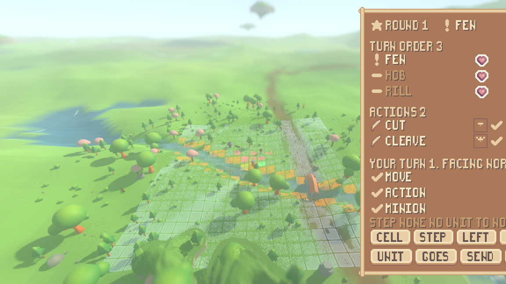
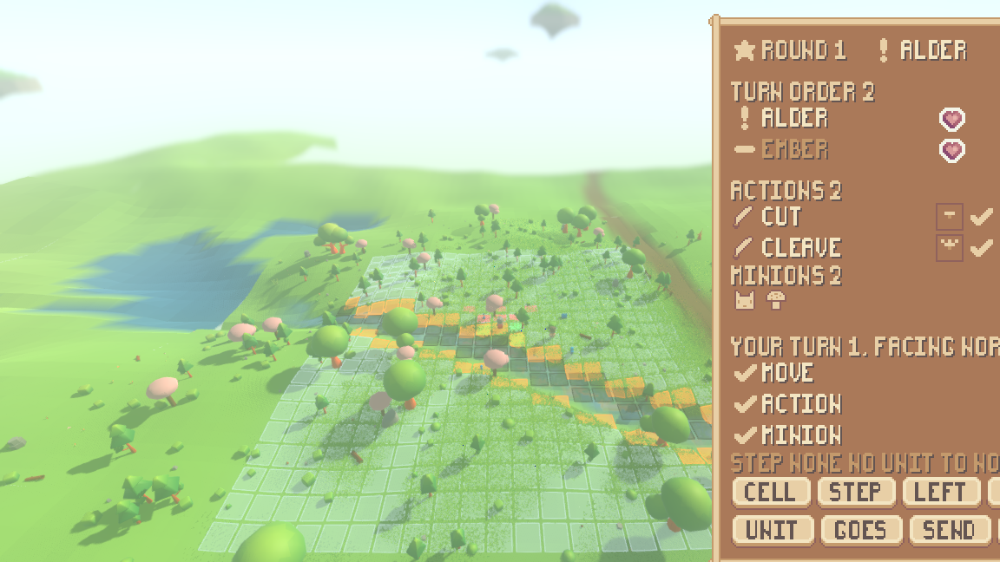

# A fight you can see, and keys that are answered instead of swallowed

A fight that began by itself in the running world used to be invisible. The
shell built the tactical lattice only for `--board` and the combat readout only
for `--readout`, so an ordinary play run showed an empty meadow while a spawned
enemy held the player on a board. The keys kept being taken — the shell printed
`chose go_to(...)` — and after the first refusal none of them was ever answered,
so the answer panel went on showing a green tick belonging to an action fifteen
ticks old.

This closes that, and the two ways a fight was drawn wrongly that the same
playtest measured: a blow that left the snapshot's eight-blow window while its
own motion was still running, and a diorama that treated a wound already taken
as a blow landing now.

Everything below is one seeded run each, with the command that produced it.

## The fight draws itself, and puts itself away

The command is the one a person is handed. No `--board`, no `--readout`:

```
xvfb-run -a ./run_render.sh --seed 1234 --play --journal \
	--screenshot-ticks "20:$PWD/reports/assets/fight-drawn-t20.png,60:$PWD/reports/assets/fight-drawn-t60.png,200:$PWD/reports/assets/fight-drawn-t200.png"
```

On a machine with a display it is `./run_render.sh --seed 1234 --play`, and the
three moments below are simply three moments of watching it.

**Before.** Twenty ticks in, nothing has met anybody. The meadow is a meadow:
no squares, no readout.


**During.** At tick 26 an enemy the enemy field spawned closes on the ordinary
cast and the world snaps to a board. The lattice is drawn under the fight and
the readout opens beside it — round, turn order, whose turn it is, what their
weapon covers, and the last blow — without anybody having asked for either.


**After.** The fight ends and the board goes with it — the shell says so at tick
181. The squares are taken away; the readout hides itself, because there is no
fight to read.


The shell's own lines say the same three things, out of `reports/fight-drawn.log`:

```
render-shell screenshot t=21 .../fight-drawn-t20.png
render-shell fight t=26 the board appears
render-shell screenshot t=61 .../fight-drawn-t60.png
render-shell fight t=181 the board is put away
render-shell screenshot t=200 .../fight-drawn-t200.png
render-shell stop tick=202 ... board=0/0 ... digest=8824aa2fcad9d478
```

`board=0/0` on the stop line is the overworld not being latticed: the run ends
with no squares drawn at all. A run stopped while the fight is still on says the
other half — the play-stage run further down ends mid-fight and its stop line
reads `board=441/40`, a full lattice of 441 cells. That is the whole of the
policy: the lattice node is built for a play run, `_sync_board` draws it only
while a fight is on, and `--board` is what keeps it up the rest of the time.

## Every key answered, every time

The measured silence was in `reports/playtest-verbs.log`: on the play stage, a
fight begins at tick 133 with Fen on the board, and after that the shell keeps
printing `chose …` and the world never says anything back. The same command,
with five movement keys added after the board arrives:

```
xvfb-run -a ./run_render.sh --seed 1234 --scenario play --play --journal \
	--input "6:tab,8:e,14:p,36:b,38:t,46:y,54:f,56:l,62:equal,64:o,72:u,78:i,84:h,92:j,98:k,104:g,126:m,130:c,132:q,138:x,144:v,150:n,156:w,160:a,164:s,168:d,172:g" \
	--screenshot-ticks "178:$PWD/reports/assets/fight-answered-t178.png"
```

The two lines the old run left unanswered are the first two below, and they are
answered now. Every one of the five movement keys after them is answered too —
not only the first (`reports/fight-answered.log`):

```
render-shell fight t=133 the board appears
render-shell play t=146 chose drop(item=common boots target=2)
render-shell play t=146 drop(item=common boots target=2) -> drop refused: Fen has already spent this turn
render-shell play t=152 chose attack(target=2 item=common boots)
render-shell play t=152 attack(target=2 item=common boots) -> attack refused: Fen has already spent this turn
render-shell play t=157 go_to(offset=(0.000, -3.600)) -> go_to refused: the board decides where a fighter goes
render-shell play t=162 go_to(offset=(-3.600, 0.000)) -> go_to refused: the board decides where a fighter goes
render-shell play t=165 go_to(offset=(0.000, 3.600))  -> go_to refused: the board decides where a fighter goes
render-shell play t=170 go_to(offset=(3.600, 0.000))  -> go_to refused: the board decides where a fighter goes
render-shell play t=173 go_to(target=(-447.453, 453.325)) -> go_to refused: the board decides where a fighter goes
```

Against the old run, where the same two presses produced nothing at all:

```
render-shell play t=146 chose drop(item=common boots target=2)
render-shell play t=152 chose attack(target=2 item=common boots)
render-shell screenshot t=157 reports/assets/playtest-verbs-t156.png
```

And the board under the player, five ticks after the last of them, in the same
run — the play stage with no board flag and no readout flag:



Every sentence above is the engine's. `the board decides where a fighter goes` is
`ActionEngine.THE_BOARD_SAYS`, the same string `_go_to` and `_jump` refuse with
when they resolve; `Fen has already spent this turn` and `it is not Fen's turn`
are `ActionEngine.turn_already_spent` and `ActionEngine.out_of_turn`, and the
second of those is the sentence `_attack` has always refused with. Nothing under
`render/` writes any of them.

### How the answer gets there

Two changes, both in the simulation.

**The world answers a choice it already knows the answer to.** A person's choice
goes into a holder and the world picks it up the next time that character may
choose. Off a board that is the next tick. On one it is the character's next
turn, which — while the person is holding their own turn open, which is what a
board played by hand does — may never come. So `ControlLoop.offered` asks
`ActionEngine.refused_before_it_begins` what the world would say, and says it:

  * an action a board takes over (`go_to`, `jump`) is answered and **settled** —
    the world is done with it, and the choice is not left standing for a turn
    that would only refuse it again;
  * an action a board has simply not got to yet is answered and **not settled** —
    the choice stands, the board takes it up when the turn comes round, and what
    the person is told meanwhile is why nothing has happened.

Nothing is resolved, nothing moves, no action is counted, and no rule about
turns changes: `offered` says out loud exactly what `_may_choose` has always
enforced in silence.

**An answer is counted, not dated.** `ControlLoop`'s answer row carries a
`serial` — how many answers the loop has given anybody — and the shell prints
when the serial moves rather than when the tick does. Two refusals of the same
thing are two refusals, whether or not they land on one tick.

### And the panel stops keeping a stale one

`reports/assets/playtest-verbs-t156.png` showed `ATTACK(TARGET=2 ITEM=COMMON
BOOTS)` with a green tick and `DROP OK ITEM=COMMON BOOTS INTO=6` under it,
fifteen ticks old — the screen read as though the attack had worked. The panel
now draws the world's answer to *the choice it is showing*: while a choice is
standing that the answer does not name, the answer row is blank. Compared by the
two sentences, both of which are the simulation's own, so the panel still holds
nothing.

### One thing this does not fix

The answer panel itself sits below the bottom of the window in a run this size.
It is the bottom row of the interface, and the interface is laid out for a taller
window than the game ships in: the top row is as tall as its tallest panel — the
character sheet at 784 art pixels, the combat readout at 616 — against a frame
576 art pixels tall at this scale, so the bottom row is pushed off the edge. That is a separate, already-measured defect
of the interface's layout and not of what reaches it; the sentence the panel
would draw is the sentence printed above, read out of `ControlLoop.answer_of` by
the same call. The suite holds the panel to it directly
(`tests/test_player_input.gd`, claim 8): the panel quotes the world's answer to
the choice it is showing, and draws nothing at all when the answer belongs to a
different action.

Here is a fight entered with neither `--board` nor `--readout`, three movement
keys refused into it, and the two panels that do fit — the lattice under the
fight and the readout beside it:

```
xvfb-run -a ./run_render.sh --seed 1234 --scenario battle --play --journal \
	--input "24:w,30:a,36:s" \
	--screenshot-ticks "38:$PWD/reports/assets/fight-answered-panel.png"
```



## A blow stays drawable while its own motion runs

`CombatantRoster` carried the last eight blows **of the whole world**. Seven
commanders swinging land far more than eight in the 48 ticks a flail's spin
lasts, so a blow could be pushed out of the record while the character was still
in the middle of striking it and the render layer had nothing left to draw from.
The number that would have fixed it — how long the longest clip is — is exactly
what the simulation must not know.

So the window is stated in the simulation's own terms instead: **the blows of the
fight under way, and of those the last eight each fighter struck and the last
eight each fighter took.** Counted per fighter, a blow can only be pushed out by
that same fighter's later blows, and a fighter strikes at most once a turn — so
eight of them is its last eight turns, by which time it is plainly no longer
doing this one. No crowd can empty it, and no clip is named anywhere in it.

`./tools/measure_swings.sh`, on the seven-weapon run:

| | comparisons made | wrong | skipped: the record was gone |
|---|---|---|---|
| before | 117 | 0 | 6 |
| after | 129 | 0 | 0 |

`tests/test_attack_clips.gd` used to count the skipped ones and call them a real
limit; it now requires that number to be zero.

## A blow landing, not a wound already taken

`CombatDiorama` set `hurt` to `health < max_health`. That is a wound already
taken: true for the rest of the fight once anybody has been scratched, so between
swings every wounded commander sat in `Hit_A` while nothing was hitting it.

It now reads the same record the swing does. The blow says who it landed on
(`to`), on which tick, and how much it took (`dealt`); `CombatDiorama.struck`
compares that tick with the world's clock against `CharacterRig.HIT_TICKS`, the
`Hit_A` clip's own length — measured off the assembled library by the same test
that measures every motion row, so the number cannot drift from the clip. A
swing that took nothing off is not something to flinch from, so it does not
count.

## The split holds

Nothing under `render/` decides anything: every sentence on the screen is the
engine's, the diorama is still a pure function of one snapshot, and the two
lengths it subtracts against are clip lengths, which are the render layer's own
answer and live beside the clips. All four structure checks pass:

```
$ ./run_tests.sh --layers-only
layer check: OK -- res://sim references nothing in the render layer
combat check: OK -- res://render draws the fight and holds none of it
interface check: OK -- res://render/ui names its art through sprout_pack.gd alone
asset check: OK -- res://sim names asset tags and no asset
```

One suite had to be told which kind of run it stands for.
`tests/test_board_overlay.gd` builds a shell by hand rather than through the
option parsing, so with the lattice now conditional it was reading a board that
had been put away — a null mesh, and a runtime error. It sets
`_lattice_always = true`, which is what a `--board` run is, and which is what
every claim in that file is about. The runner caught it exactly as it is meant
to: the summary line said `all 65 suites passed (212004 checks)` and the run was
failed anyway, on the `SCRIPT ERROR` above it.

The seed-1234 world fingerprint does not move. Two hundred ticks of the ordinary
world, before and after the change:

```
$ ./run_headless.sh --seed 1234 --ticks 200
done ticks=200 chunks=40 built=103 final=823c82ffc205dd26     # before
done ticks=200 chunks=40 built=103 final=823c82ffc205dd26     # after
```

That is what one would expect from what changed: the blow window only decides
what leaves the simulation in a snapshot, and `ControlLoop.offered` is only ever
reached through `Simulation.drive`, which only a person driving a character
calls. A world nobody is playing never enters either path.

## The whole suite

```
$ ./run_tests.sh
all 65 suites passed (212007 checks)
```

`reports/fight-drawn-full-suite.log` is that run. It carries no `SCRIPT ERROR`
and no `run_tests:` diagnostic, which are the two things the runner fails a run
on whatever its summary says — and this session showed that guard working
rather than assuming it: the run before this one printed
`all 65 suites passed (212004 checks)` and was failed anyway, on the board
overlay's null mesh.
