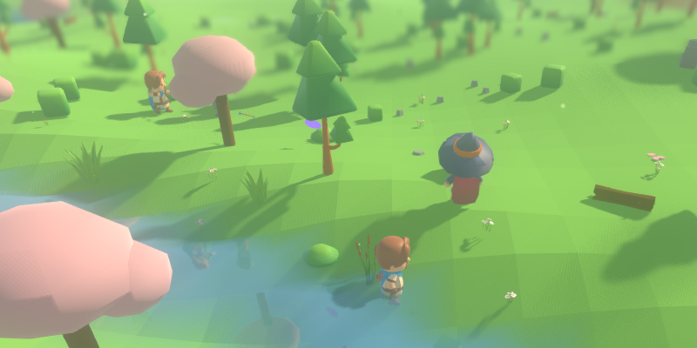
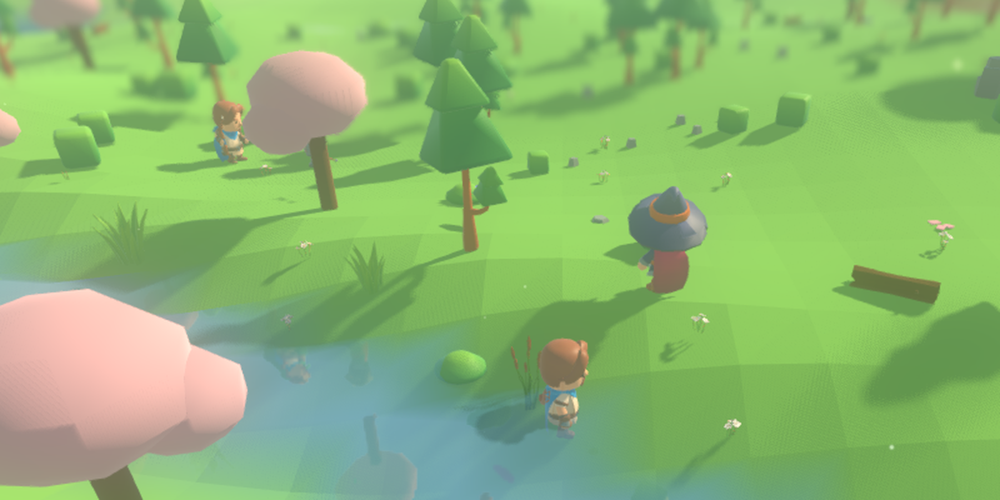

# Flights: the arrow that crosses the board

The combat readout has drawn a blow as a sixteen-pixel sprite inside a panel
since the interface landed; nothing has ever flown *in the world*. This change
adds the body in the air beside that panel: when a blow's record says its
effect travelled, a visible object crosses the board from the cell the attack
began in to the cell the record says it landed on, arriving when the blow's
own motion ends. An arrow flies as the adventurer pack's literal arrow model; a
magic missile flies as a violet glow that is plainly not an arrow; a sword
launches nothing, because its record says nothing travelled.

Everything here is presentation. By the time a flight exists, the blow has
been resolved, the damage dealt and the record written; the proof is a
fingerprint, quoted below.

## The three files, and the seam

* **`render/blow_flights.gd`** turns the snapshot's blow record into flights.
  `BlowFlights.flights(snapshot)` is a pure function of one dictionary — no
  members, no memory between calls, nothing asked of the simulation. It is
  fired from the record the same way the swing animation is: the roster's
  snapshot already carries, for each recent blow, the cell it began in
  (`from_cell`), the cell it landed on (`to_cell`), its art tag (`sprite`),
  its motion tag (`animation`), whether it travelled (`movement`) and the tick
  it began on (`tick`).
* **`render/flight_art.gd`** is the fourth mapping table: effect tag → what it
  flies as. One row per tag with the same four fields (`model`, `colour`,
  `glow`, `size`), so which art an attack resolves to is a table lookup and
  never a branch per weapon. The arrow row names the pack's own
  `arrow_bow.gltf`; the bolt row is a violet glow; a tag the table has never
  heard of falls back to a hot magenta spark — plainly something, plainly
  unauthored, never nothing.
* **`render/flight_view.gd`** is the object in the world. `launch()` takes a
  start cell, an end cell and the two tags off the blow record;
  `show_phase()` places it a fraction of the way across the straight line
  between the two cell centres, at chest height ($1.1$ world units) over the
  ground each end's piece stands on. No projectile physics: the simulation
  already decided what was hit, so an arc or a wobble would be the picture
  inventing facts.

`render/main.gd` wires the seam in one call, `_sync_flights(snapshot)`, with
the same three steps every other layer gets: drop what has landed, launch what
is new, move the rest, keyed by which blow each flight belongs to.

## What each attack flies as, measured

`./tools/measure_flights.sh` prints the whole resolution. All six effect tags
have a body, and the two kinds of travelling attack are told apart by the
table, not by code:

| tag | flies as |
|---|---|
| arrow | the pack's `arrow_bow.gltf` |
| bolt | violet glow (0.62, 0.42, 1.00) |
| blade | grey slab (never launched: every blade attack is instant) |
| point | grey sliver (never launched today) |
| flame | orange glow (never launched today) |
| impact | gold glow (never launched today) |

**0 of 10 shipped attacks take the fallback body** — every attack the
catalogue and the composed pair ship names a tag with a row of its own. The
number can move: an attack added with an unheard-of tag would print as
`FALLBACK` here and fail `tests/test_flights.gd`.

## The timing is the motion's, not a second clock

A flight leaves on the tick the record says the blow began and arrives on the
last tick its motion is still drawn, with the span read off
`CharacterRig.MOTION_CLIPS` — the same table the swing animation reads. So the
arrow leaves when the bow's release starts and lands when it ends, and there
is no duration invented in the render layer. Where an attack split or homed,
the endpoints are the record's two cells verbatim; the planner recomputes
nothing.

## The volley scenario, and the crossing on film

No shipped scenario fired a ranged weapon on camera, so one now does:
`--scenario volley` stands an archer (Yew, bow), a mage (Sorrel, wand — magic
missile: projectile, split 3, homing 1) and a swordsman (Thorn, sword) on the
measured meadow and begins the fight; every blow after that is the combat
policy's own. One seeded run, seed 1234, ticks 1–60, listed flight by flight:

```
source ./godot_env.sh && env -u DISPLAY -u WAYLAND_DISPLAY "$GODOT" \
  --headless --path . --script res://tools/volley_flight_ticks.gd
```

prints a flight in the air on 60 of 60 ticks — for example
`tick 20: arrow (-164, 136)->(-158, 140) phase=0.38; bolt (-159, 140)->(-163, 136) phase=0.50; arrow (-164, 136)->(-159, 140) phase=0.04; bolt (-159, 140)->(-163, 136) phase=0.00`
— arrows and bolts crossing at once, each with its own phase.

The frames below are that same run photographed through the shell:

```
xvfb-run -a "$GODOT" --path . --resolution 1600x900 --fixed-fps 30 -- \
  --seed 1234 --scenario volley --camera 0 10 13 --aim 0.5 --no-grass \
  --screenshot-ticks "20:reports/assets/volley-t20.png,27:reports/assets/volley-t27.png,34:reports/assets/volley-t34.png,43:reports/assets/volley-t43.png"
```

The `va*-zoom` images are centre crops of those frames at twice the size,
because an arrow sixteen world-units from a wide camera is a few pixels.






Full frames: [t20](assets/volley-t20.png), [t27](assets/volley-t27.png),
[t34](assets/volley-t34.png), [t43](assets/volley-t43.png), and a wide
crossing shot: [volley-arrow-crossing](assets/volley-arrow-crossing.png).

## Nothing reaches the simulation

The same seed and length, once with no renderer anywhere and once through the
render shell with every flight drawn:

```
./run_headless.sh --seed 1234 --scenario volley --ticks 60 --digest
  → digest=f3d3457c430f5f13

env -u DISPLAY -u WAYLAND_DISPLAY "$GODOT" --headless --path . \
  --fixed-fps 60 --quit-after 180 -- --seed 1234 --scenario volley
  → render-shell stop tick=60 frames=180 ... digest=f3d3457c430f5f13
```

The fingerprint is identical: **`f3d3457c430f5f13`**. The new `--digest` flag
on the headless entry point prints the same fingerprint the render shell's
stop line has always carried, so the two runs are compared by grepping one
word out of each. `tests/test_flights.gd` re-runs this comparison inside the
suite.

## What holds it

`tests/test_flights.gd` (in the full suite, and alone via
`./run_flight_suite.sh`) pins nine claims: flights are a pure function of a
hand-built snapshot; an instant blow, a stale blow and an out-of-window blow
launch nothing; a homed `to_cell` is copied verbatim; phase is 0 on the
record's tick and 1 on the motion's last tick; in the seeded seven-weapon run
every flight maps to a projectile blow and every projectile blow in its window
flies; all six tags build something visible and a bolt is told from an arrow
by its own row; the fallback count is zero and could rise; the view object
stands over the right cells at phases 0, ½ and 1; and the rendered volley
reaches the headless world's exact digest.

## Boundaries kept, and one honest caveat

The sixteen-pixel `render/effect_art.gd` and the readout panel are untouched;
the two tables share only the tag vocabulary (`AssetTags.EFFECT_SPRITES`), and
deliberately not their rows — a row here is a three-dimensional body, a row
there is sixteen lines of pixels, and no field of either could stand in for
the other, so nothing was made to share a table.

The caveat, inherited from the record itself: the snapshot carries only the
last eight blows of the whole world, so in a very crowded fight a blow's row
can leave the record while its flight is midway, and the flight ends with the
row — visible once in the seeded run, where an early arrow vanishes at phase
0.62 when the volley's fifth blow pushes its row out. The picture keeps no
copy of the fight to finish the crossing from; if that ever grates, the fix
belongs in the record's depth, not here.
