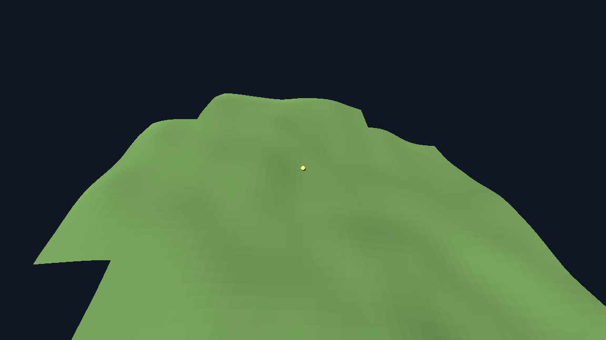

# Foundation review — evidence log

Independent re-run of the foundation's three claims: headless operation,
render-cannot-affect-simulation, and seed determinism. Every command below was
run from the project directory; output is quoted verbatim, not summarised.

Terms used here, defined once. *Seed* $s$ — the single integer every random
choice in the world descends from. *Chunk* — a fixed $16 \times 16$ world-unit
square of ground, addressed by an integer coordinate $(c_x, c_z)$. *Streamer* —
the object that keeps chunks near an observer built and drops the rest.
*Digest* (this project's word) — a short SHA-256 fingerprint of a chunk's or the
whole world's state, used as a stand-in for "is this the same world?".
*Mutation testing* — deliberately introducing a bug into a copy of the code to
see whether the test suite notices; a test that stays green under an injected
bug is not testing what it claims to.

All mutations were applied to a **copy** of the project in a scratch directory,
never to the working tree. The working tree was re-checked green afterwards.

---

## 1. Determinism, independently re-run

```
$ for i in 1 2 3; do ./run_headless.sh --seed 1234 --ticks 100 > r$i.txt; done
$ ./run_headless.sh --seed 4321 --ticks 100 > other.txt
```

| run | exit | sha256 of output |
|---|---|---|
| seed 1234, run 1 | 0 | `a9bcceddb6f968941b2a62aa6f1dcd40ed6cd697237ea4112281d0815cd57a40` |
| seed 1234, run 2 | 0 | `a9bcceddb6f968941b2a62aa6f1dcd40ed6cd697237ea4112281d0815cd57a40` |
| seed 1234, run 3 | 0 | `a9bcceddb6f968941b2a62aa6f1dcd40ed6cd697237ea4112281d0815cd57a40` |
| seed 4321       | 0 | `ec8fc16d642a706f0bd1772d8149c9828b7084741617ba44f5704e4ef914fcfc` |

```
$ diff r1.txt r2.txt && echo "(r1 == r2, byte-identical)"
(r1 == r2, byte-identical)
$ diff r1.txt r3.txt && echo "(r1 == r3, byte-identical)"
(r1 == r3, byte-identical)
$ diff r1.txt other.txt | head -4
3,15c3,15
< seed 1234
< tick 0 chunks=32 f58dffc06a29f160
< tick 10 chunks=33 12d986310556ce38
```

Tail of a seed-1234 run:

```
tick 90 chunks=39 91ec16db113a66e7
tick 100 chunks=41 3cbf582ac7f13f29
done ticks=100 chunks=41 built=69 final=3cbf582ac7f13f29
```

Full suite, unmodified tree:

```
$ ./run_tests.sh
PASS  rng            1325 checks
PASS  determinism    12 checks
PASS  terrain        26 checks
PASS  streaming      4695 checks
PASS  layering       12 checks
PASS  render shell   5 checks

all 6 suites passed (6075 checks)
```

**Verified.** Three separate processes with $s = 1234$ produce byte-identical
output; a different seed does not.

---

## 2. Headless operation

The whole `render/` directory was deleted from the copy and the headless
command re-run:

```
$ rm -rf render
$ ./run_headless.sh --seed 1234 --ticks 100
tick 90 chunks=39 91ec16db113a66e7
tick 100 chunks=41 3cbf582ac7f13f29
done ticks=100 chunks=41 built=69 final=3cbf582ac7f13f29
exit=0

$ diff <no-render output> <with-render output>
IDENTICAL to the run with render/ present
```

No graphics-driver lines (Vulkan / OpenGL / X11 / Wayland) appear in the
headless output. `run_headless.sh` also unsets `DISPLAY` and `WAYLAND_DISPLAY`
so a window cannot be silently opened.

**Verified.** Headless is real, not a flag that quietly still boots a renderer.

---

## 3. Separation, read from the code

`tests/layer_check.gd` scans `sim/` for render-layer paths and scene-tree type
names. It passes, and `sim/` is genuinely clean. But the check is
*one-directional and textual*: it says nothing about what `render/` does to
`sim/`. Reading `render/main.gd`, four routes exist by which the render layer
reaches simulation state:

| line | route | can it change the world? |
|---|---|---|
| `render/main.gd:63` | `_sim.step()` called from `_process(delta)` | No. Drives *how many* ticks have run, never what a tick produces. |
| `render/main.gd:78` | `KEY_SPACE` toggles `_paused` | No. Stops advancement; states already reached are unchanged. |
| `render/main.gd:81` | `KEY_R` replaces the whole `Simulation` with seed $s+1$ | Yes, but by design — it is a restart, not a corruption. |
| `render/main.gd:106` | `_sim.world.terrain_streamer.geometry(key)` | **Yes.** This hands back the live, mutable `TerrainChunkGeometry` the simulation is holding. |

`SimWorld.snapshot()` is documented as "a read-only copy … handing over a copy
is what keeps a viewer from mutating the world", but its own comment then
directs the viewer to read chunk geometry "straight off the streamer" — which
is route 4, and is not a copy.

Probe (run against the unmodified code): take the exact handle
`render/main.gd:106` takes, then write through it.

```
chunk (-3, -4) digest before: 6650dcea6de515fe
simulation now holds vertex[0] = (-48.0, 50.09777, -64.0)
simulation now holds lowest    = -999.0
chunk digest after mutation:   6650dcea6de515fe   (cached, recomputed=a1540dd7db2ba058)
world digest before: 02618c9d2cfa7266
world digest after:  02618c9d2cfa7266
world digest changed: false
```

Two facts, both confirmed: the write lands in simulation state, and
`TerrainChunkGeometry.digest()` memoises into `_digest` on first call
(`sim/terrain_chunk_geometry.gd:46-58`), so the fingerprint keeps reporting the
pre-mutation value. `tests/test_render_shell.gd` proves "rendering did not
change the simulation" by comparing exactly that fingerprint — so it cannot
detect this class of violation.

---

## 4. Are the determinism tests strong enough? (mutation testing)

Five genuine bugs were injected one at a time into a copy and the full suite
re-run.

| # | injected bug | caught? | by which suite |
|---|---|---|---|
| A | unseeded `randf()` added to `TerrainSurfaceField.height_at` | **yes** | terrain, streaming, render shell |
| B | `TerrainStreamer.loaded_keys()` returns dictionary insertion order instead of sorted | partly | streaming only — **determinism passed** |
| B′ | `loaded_keys()` left sorted; only `SimWorld.digest()` iterates the raw dictionary | **no** | *all 6 suites passed, 6075 checks* |
| C | field draws from a seeded stream instead of a position hash (order-dependent) | **yes** | terrain only — determinism passed |
| E | wall-clock `Time.get_ticks_usec()` folded into observer motion | **yes** | determinism, render shell |

### A — unseeded random source

```
===== layer check =====
layer check: OK -- res://sim references nothing in the render layer
layers exit=0
===== full suite =====
FAIL  terrain ... - two separate runs of seed 1234 produced different chunk geometry
FAIL  streaming ... - chunk (0,0) came back different after being unloaded and reloaded
FAIL  render shell ... - rendering changed the simulation: ... reached different worlds
4 of 6 suites failed (24 failed checks of 6075)
```

Caught loudly. Note the layer check itself printed **OK** — it is a render-type
blacklist, not a determinism gate.

### B′ — unordered iteration: the suite does not notice

`SimWorld.digest()` changed from `for key in terrain_streamer.loaded_keys()` to
`for key in terrain_streamer._loaded`:

```
PASS  rng            1325 checks
PASS  determinism    12 checks
PASS  terrain        26 checks
PASS  streaming      4695 checks
PASS  layering       12 checks
PASS  render shell   5 checks

all 6 suites passed (6075 checks)
```

The order-dependence is real, not theoretical. Two streamers given the same two
observers in the two possible orders end with the *identical* loaded set:

```
loaded sets identical: true   ( 48  chunks each)
first 3 keys in a's raw dict order: -3,-2 -3,-1 -3,0
first 3 keys in b's raw dict order: -1,-1 -1,0 0,-3
digest over RAW dict order  -> a=751d2d65396f05b9  b=ecb251c5a60fbbd3
digest over SORTED order    -> a=fe68715ae2be7059  b=fe68715ae2be7059
```

Why the determinism suite is blind to this: it compares run $A$ of seed $s$
against run $B$ of the same seed $s$. Both runs walk the same path in the same
order, so both build their dictionaries in the same insertion order. An
order-dependence cancels out identically on both sides. The determinism suite
can only see nondeterminism that varies *between two identical runs* — a clock,
an unseeded RNG, a process id — never one that depends on *route taken*.

### C — the order-dependent field is caught, by `test_terrain`

```
FAIL  terrain 26 checks, 5 failed
    - building other chunks first changed chunk (3, -2)
    - the order chunks were built in changed chunk (3, -2)
    - chunk (3, -2) came out with different vertices depending on build order
    - chunk (3, -2) came out with different normals depending on build order
    - rebuilding the chunks of seed 1234 in this process gave different geometry
```

This is a real strength and worth crediting: `test_terrain._mesher_ignores_build_order`
deliberately builds the same chunk after different histories, and it works. The
gap is that this order-independence discipline exists only for the field and the
mesher. Nothing enforces it for the streamer, the world digest, or any layer
added next.

---

## 5. Layer-check blind spots

Probe against the real `LayerCheck._first_match`:

```
pass      var jitter := randf()
pass      var n := randi_range(0, 5)
pass      var t := Time.get_ticks_usec()
pass      var f := Engine.get_frames_drawn()
pass      var when := Time.get_unix_time_from_system()
pass      var id := ResourceUID.create_id()
pass      var tag := "chunk #1"; get_tree().quit()
pass      var path := "a#b"; var v := MeshInstance3D.new()
FLAG      var v := MeshInstance3D.new()
FLAG      get_tree().quit()
```

Two distinct gaps. First, `_strip_comment` cuts the line at the first `#`
wherever it appears, including inside a string literal — so the *identical*
statement `get_tree().quit()` is flagged on its own but not when a `#`-bearing
string precedes it on the same line. Second, the forbidden list contains only
render and scene-tree names, so ambient inputs (`randf`, `Time`, `Engine`, `OS`)
pass the gate that `bin/check_layers.gd` advertises for a commit hook.

---

## 6. What is on screen



The rendered slice exists and matches the claim: one continuous flat-shaded
surface with an observer marker on it, built from the simulation's chunk
geometry.
