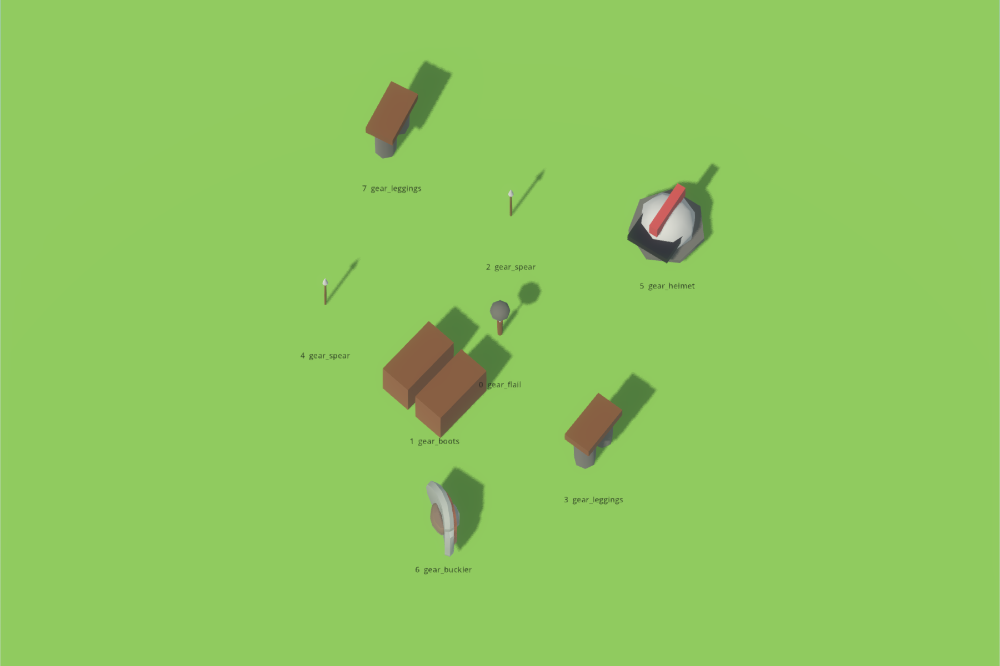
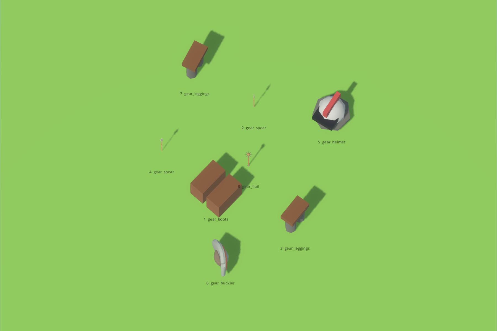

# Every gear tag, and the model behind it

The item layer names *shapes* — "blade", "spear", "buckler", a worn slot — and
one table in the drawing layer turns each of those names into something you can
look at. Before this change, five of the twelve gear names in that table were
drawn by a real model out of an installed pack and seven were coloured boxes and
cylinders written in code. This is what changed, what it is drawn with now, and
which names still have nothing.

**Nothing about what an item is worth moved.** The rarity multipliers, the power
budget and how it splits, the ability gate and the drop probability are exactly
what the item phase left; this is an edit to a mapping table and to the two
lists of names it maps from.

---

## 1. The count, before and after

`./run_assets.sh` is the live answer. Counted over the whole catalog, not just
gear:

| | placeholder rows in the catalog | gear names on a pack model | gear names on a primitive |
| --- | ---: | ---: | ---: |
| before | 11 | 5 of 12 | 7 |
| after | 8 | 9 of 13 | 4 |

The thirteenth name is new and is explained in §3.

---

## 2. The seven that were primitives, one line each

| gear name | drawn now | pack | triangles | size as drawn (w × h × d, world units) |
| --- | --- | --- | ---: | --- |
| `gear_spear` | `SFM_Spear_002.fbx` | Fantasy Market, armoury stall | 300 | 0.118 × **1.463** × 0.050 |
| `gear_flail` | `SFBP_Mace_004.fbx` | Battle Pack, weapons | 894 | 0.240 × **1.103** × 0.241 |
| `gear_bundle` | `SFV_Sack_002.fbx` | Fantasy Village, exterior props | 400 | 0.602 × **0.830** × 0.432 |
| `gear_boots` | *still a primitive* | — | — | nothing on this machine is a boot |
| `gear_leggings` | *still a primitive* | — | — | nothing on this machine is leg armour |
| `gear_chestplate` | *still a primitive* | — | — | nearest is a 2.243-tall display suit |
| `gear_helmet` | *still a primitive* | — | — | nearest is a soft wizard's hat |

Three of the seven are filled. The other four are the subject of §4, and they are
a real gap rather than a shortcut: **no pack on this machine ships worn armour as
a separate model at all.**

### Why these three models and not their neighbours

**Spear.** The armoury packs ship eighteen models under the name "spear", and
none of them is one: `SFFA_Weapon_Spear_Iron_001` through `_006` and their gold
and runic trios are ornate glaives and halberds with curved, winged or hooked
heads. The tag means the game's narrowest attack — one line of two cells straight
ahead — and wants a plain point on a plain shaft. The market pack's armoury stall
has exactly that, at 300 triangles.

**Flail.** There is no chained weapon anywhere. 4,689 models were searched by
name and by category across every installed pack; the only chains are three loose
lengths of smithy dressing in the forge pack. What is taken instead is a
morningstar — a spiked ball on a haft — and what that loses is precisely nothing,
because the primitive underneath it never drew a chain either: it was a leather
grip, a steel rod and a stone sphere stacked in a line, which is a rigid haft and
head too. The pack model is the same silhouette with real art on it.

**Bundle.** This is the one name no shape forges: it is what an item nobody
recorded a shape for is drawn as, so that a wool blanket on the ground is
something a person can see and walk up to. A tied sack is what that should look
like — "there is something here" and deliberately not any particular thing — and
the village pack ships one. It is also the only gear model that already stands
with its lowest point at its own origin.

---

## 3. The one name the vocabulary gained, and the ones it did not

A new shape is three small rows: a name in `sim/asset_tags.gd`, a model row in
`render/asset_library.gd`, and a shape row in `sim/item_model.gd` so that
something can actually *be* that shape. The last of those three is the hard part,
and it is what decided this list.

### `gear_dagger` — added

| | |
| --- | --- |
| drawn by | `dagger.gltf` (KayKit Adventurers), 172 triangles, 0.259 × 1.206 × 0.152 |
| reached by | the catalogue weapon name **`dagger`** — `Weapon.dagger()`, through `ItemModel.BY_SHAPE["dagger"]` and `Weapon.shaped_like("dagger")` |
| who carries one today | Wisp, the level-1 bystander in the encounter scenario (`sim/scripted_encounter.gd:180`), and the same character again in the battle scenario. `./tools/ground_items_probe.sh` prints both rows as `common dagger → gear_dagger`. |
| why it is not a re-use | it was folded into `gear_blade`, so a dagger was drawn as `sword_1handed.gltf` — a long straight cruciform sword with a two-handed grip, where the dagger is a short curved knife with a pommel. Note that this is a difference of *shape* and not of size: everything on the ground is normalised to the same 0.75-unit box, so the sword and the dagger were being drawn at identical scale, and the only thing telling them apart was the label. The catalogue already treats them as different things to *use* — the dagger has its own attack pattern, one diagonal cut on the shortest cooldown there is — so the drawing layer was the last place they were still the same thing. |

### The five that stayed out, and why each is a gap

The packs have good models for all five. Nothing in the simulation can be one.

| shape | model that exists | what would reach it | why not now |
| --- | --- | --- | --- |
| axe, one- and two-handed | `axe_1handed.gltf`, `axe_2handed.gltf`, and 33 more across the packs | nothing | the forge draws six held shapes and the catalogue ships seven; neither has an axe |
| two-handed sword | `sword_2handed.gltf`, 23 longswords in the packs | nothing | same |
| crossbow | `crossbow_1handed.gltf`, `crossbow_2handed.gltf`, and 12 more | nothing | same |
| wand | `wand.gltf`, and the alchemy pack's `AWS_Wand_001.fbx` | nothing | same |
| spellbook | `spellbook_closed.gltf`, `spellbook_open.gltf`, and 150 more book models | nothing | same |

Adding the tag anyway would produce **a name no item could ever carry**, which is
the definition of a gap, so it is reported as one rather than added. Giving any
of them a body needs a shape word that reaches it first, and there are only two
ways to make one:

* Add the word to `ItemForge.HAND_SHAPES`, which the forge draws from. This is
  out of scope twice over: it shifts a draw that every seeded item depends on,
  and `Weapon.shaped_like()` would answer `null` for the new word, so one held
  item in seven would come out with no attack at all.
* Add a weapon to the combat catalogue — an axe with its own pattern and
  cooldown. That is a change to what an axe *does*, not to what it looks like,
  and the work item puts it out of scope explicitly.

This is raised as a finding: **the drawing layer is now ahead of the combat
catalogue.** Five weapon silhouettes are installed, imported, measured and
unreachable, and what unlocks them is attack patterns, not models.

### One name that is reached by no shape and is not a gap

`gear_draught` has no forge shape and no worn slot either — a consumable has
neither. It is reached by items that name it outright, which is how the mending
draught in the play scenario gets a bottle. The gear sheet prints that as *"no
shape; only an item naming it outright"* rather than as a blank.

---

## 4. The four that are still primitives, with the measurements

Every model on this machine was searched: 1,930 FBX in the three armoury packs,
1,580 FBX in the village, market and JustCreate packs, and 1,179 glTF in the
eleven KayKit packs — 4,689 models — by name (`boot`, `shoe`, `sabaton`,
`greave`, `helm`, `hood`, `armor`, `cuirass`, `breast`, `gauntlet`, `bracer`) and
by the artist's own directory structure. The packs have no armour category.

| tag | what the nearest thing is | measurement | why it is not used |
| --- | --- | --- | --- |
| `gear_boots` | nothing | — | no footwear model exists in any pack. The adventurers' boots are painted onto the character meshes. |
| `gear_leggings` | nothing | — | no leg armour off a body exists in any pack. |
| `gear_chestplate` | `SFFA_Armor_001.fbx` | one mesh, 9,780 triangles, 1.228 × **2.243** × 0.940 | it is a whole suit welded to its own display stand — helm, breast, greaves and post in a single mesh, so it cannot be picked apart into three different tags without editing the geometry, which the work item forbids. At 4× the triangles of the heaviest weapon in the packs it is smithy scenery, not a thing that lies on grass. |
| `gear_helmet` | `AWS_Wizard_Hat_001.fbx` | 810 triangles, 0.602 × **0.336** × 0.636 | the only head-worn model anywhere, and it is a soft pointed hat. Every helmet in the game would read as a witch's hat. |

The rule applied to all four is the one the project already applies to
`blossom_tree`, which keeps its primitive rather than being repointed at a green
tree: **a primitive that is the right thing beats a model that is a different
thing.** The primitives being kept are a pair of leather boots, a pair of greaves
with a belt, a cuirass with pauldrons, and a domed helm with a brim and a visor
slit — each of which reads as what it is.

---

## 5. The picture: every gear tag with its model

    xvfb-run -a ./run_item_sheet.sh --gear \
        --screenshot "$PWD/reports/assets/gear-tag-sheet.png"

The sheet is new. The rarity sheet that already existed shows what the *forge*
drew, which can only ever be the ten names the forge reaches; this one walks
`AssetTags.in_category(GEAR)` and shows every name in the category with the file
it resolves to and the words that reach it. A name still on a primitive is
labelled in rust rather than blue, and a name nothing can be would show an empty
"reached by" line — which is how such a name is meant to be visible.


The sheet takes no seed: it is a picture of the *table*, and the table does not
depend on one.

---

## 6. A pile on the ground, before and after

    xvfb-run -a ./run_item_sheet.sh --pile \
        --screenshot "$PWD/reports/assets/gear-pile-after.png"

Eight items forged at seed 20260905 and level 8, laid out by the same sunflower
spiral the shell lays a real heap out with, seen from above. Both pictures are
the same eight items at the same seed; only the table between the item and the
model changed.

What to look at: this heap holds two spears (2 and 4) and a flail (0), which are
three of the rows that were filled, and five pieces of worn armour, which are
the rows that could not be. So the picture is also the gap — the spears become
straight-pointed market spears and the flail an orange-hafted morningstar, and
the boots, leggings and helmet are the same coloured shapes on both sides.

| before | after |
| --- | --- |
|  |  |

### The size normalisation, measured off what was built

Loot is normalised: whatever a model's own size, the shell divides by its
**longest side** so that the longest side comes out at
`GroundItems.DRAWN_SPAN = 0.75` world units. It has to be measured off the node
that was instantiated rather than read off the row, because the packs do not
agree on which axis a thing is long along — the sword's length is its height and
the bow's length is its depth. The gear sheet prints the measurement for every
tag; the bold figure is the axis that turned out to be longest.

| tag | lying (x × y × z) | long axis |
| --- | --- | --- |
| `gear_blade` | 0.21 × **0.75** × 0.06 | height |
| `gear_dagger` | 0.16 × **0.75** × 0.09 | height |
| `gear_spear` | 0.06 × **0.75** × 0.03 | height |
| `gear_bow` | 0.37 × 0.06 × **0.75** | depth |
| `gear_staff` | 0.20 × **0.75** × 0.10 | height |
| `gear_flail` | 0.16 × **0.75** × 0.16 | height |
| `gear_buckler` | **0.75** × **0.75** × 0.28 | width and height together |
| `gear_boots` | **0.75** × 0.58 × 0.65 | width |
| `gear_leggings` | 0.53 × **0.75** × 0.29 | height |
| `gear_chestplate` | **0.75** × 0.56 × 0.30 | width |
| `gear_helmet` | 0.73 × **0.75** × 0.71 | height |
| `gear_draught` | 0.31 × **0.75** × 0.31 | height |
| `gear_bundle` | 0.54 × **0.75** × 0.39 | height |

Every one lands on 0.75, and all three axes are represented — the buckler
reaches it on two at once, being a disc. This is pinned by a
test: `tests/test_ground_items.gd` builds each of the thirteen, measures the
bounding box of what was built, applies the shell's own `scale_for()` and fails
if the longest side is more than 0.0005 units from `DRAWN_SPAN`. The same test
counts how many names are on a model and how many on a primitive, so a pack that
stopped loading — every row silently falling back — fails rather than passes.

---

## 7. The world, unchanged

The simulation gained two words and no arithmetic, and the world says so:

| | seed 1234, 100 ticks |
| --- | --- |
| before | `32656f55cc5eeb1c` |
| after | `32656f55cc5eeb1c` |

Measured either side of restoring the six changed files from the git index, in
`reports/gear-models-evidence.txt`. The hash of every file under `sim/` does
move — `5c30c017…` to `4a3534c3…` — which is exactly what two new names look
like.

---

## 8. What the simulation gained: names, and nothing else

Two files under `sim/` changed and both changes are words:

* `sim/asset_tags.gd` — one constant, `GEAR_DAGGER := "gear_dagger"`, and its
  place in the gear category.
* `sim/item_model.gd` — one value, the `"dagger"` key now pointing at the new
  name instead of at `gear_blade`.

No path, no pack, no file name. `tests/asset_check.gd` fails the build if
anything under `sim/` ever names one, and it passes; so does the layer check.

---

## 9. Reproducing this

```
./run_assets.sh                                    # the table, live
xvfb-run -a ./run_item_sheet.sh --gear  --screenshot "$PWD/gear.png"
xvfb-run -a ./run_item_sheet.sh --pile  --screenshot "$PWD/pile.png"
./tools/ground_items_probe.sh                      # the gear table and the drops
./run_headless.sh --seed 1234 --ticks 100 | tail -1
./run_tests.sh
```

`reports/gear-models-evidence.txt` holds the before-and-after run of the first,
the second and the last of those, taken either side of restoring the table from
the git index.
