# Ground-cover grass: instanced, windblown, and parting around whoever walks through it

The seventh layer of the world, and the first one that is not part of the world
at all.

Grass is grown per chunk of ground, with how thickly it grows and what colour it
is taken from the biome under it. A shader runs gusts across it and bends it
aside around the characters standing in it. None of it exists in a headless run —
not disabled, *absent*, because the file that makes it is never loaded — and the
world's fingerprint is byte-identical with the layer and without it.

The request behind the last two changes was one sentence with two halves in it:
grass "should be denser where there is grass, and it should occur in patches".

**The instanced unit is a patch of twelve tufts, not one tuft** — §4, and the
answer to the first half: a meadow now reads as ground cover rather than as
confetti. **Where grass grows is a clearing mask times the biome's own coverage,
pushed through a hard curve** — §5, and the answer to the second: there is now
ground that is exactly bare and ground that is exactly a closed carpet, with
wandering paths between them, where before every square metre of a meadow grew
the same 41% of its lattice as every other. §5 also turns the coverage the right
way up, because the layer had been reading the field the *tree* scatter grows
from and a deep forest was consequently growing twice the grass of a meadow.

A later request said the grass "looks really noisy", and that took two more
sections. **The project set no anti-aliasing at all** — §9, which measured every
mode on the frame the complaint was about and shipped 4x multi-sampling with FXAA
over it, two thirds of the noise. **The blades were not the colour of anything
anybody had asked for** — §10, which found that the tint was dividing by the wrong
colour and that a quarter of the grass on screen was being lit from below, fixed
both, and then chose the blade colour on a sweep.

Section 13 of the design listed two open questions against this layer:
**interaction fidelity** and **level of detail / draw distance**. Both are
answered below, with the reasoning, and the cost is measured rather than assumed.

A meadow at seed 1234, from the camera the game is played from — the same seed,
the same place, the same camera, confetti and then patches:

| an even sprinkle everywhere | bare clearings and closed beds |
| --- | --- |
| 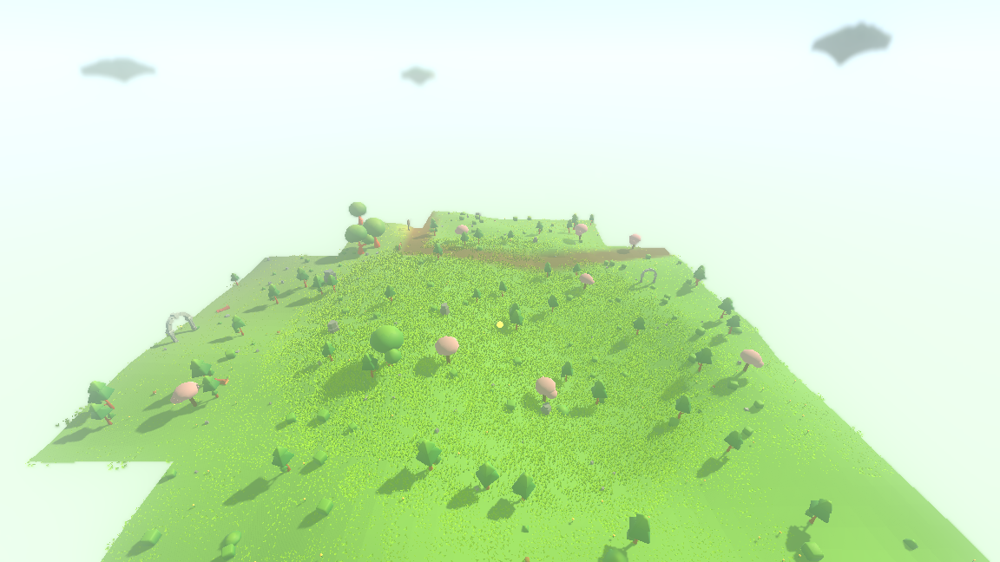 | 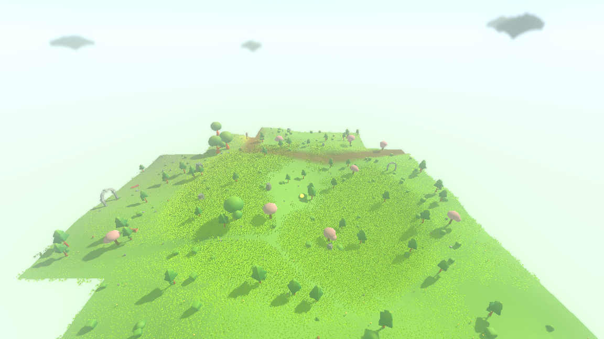 |

And the change before it, kept here because the two are separate: one tuft per
instance, then a patch of twelve, at the same place and camera.

| one tuft per instance | a patch of twelve |
| --- | --- |
| 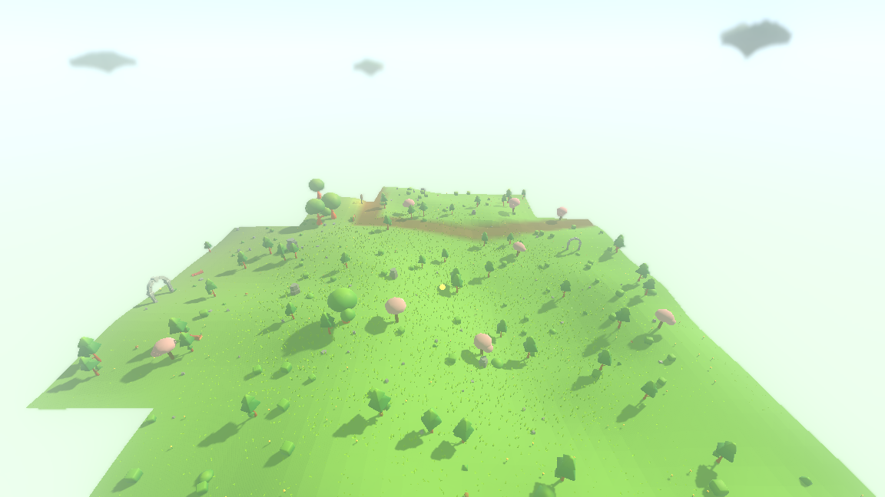 |  |

---

## 1. Where the layer lives, and why that is the whole headless guarantee

Every layer before this one lives in `sim/`: the height of the ground, the
biomes, the water, the floating islands, the villages and roads, the scattered
flora and props. The rule that put them there is that **what is in a place is a
fact about the place**, not about the picture of it — a character can walk into
a tree, shelter behind a boulder, cross a bridge, so the tree, the boulder and
the bridge belong to the world.

Grass is the first thing that fails that test. Nothing collides with a blade of
grass. Nothing picks one up. No tactical rule will read one. The world is exactly
the same world whether or not a single blade is drawn. So the grass layer lives
in `render/grass_layer.gd`, and that placement is what makes the acceptance
condition true *by construction* rather than by a flag:

> Headless mode creates no grass at all.

A headless process never loads a single file under `render/`. It therefore does
not have a grass layer that is switched off; it has no grass layer. `run_headless.sh
--assets` says so from outside the render layer, by asking the engine's own
resource cache — a counter kept *inside* the grass layer could only be read by
loading the grass layer, which is the very thing that must not happen:

```
assets visual-files   found=1401  loaded=0
assets render-scripts found=8     loaded=0
assets sim-scripts    found=31    loaded=31
```

`tests/test_grass.gd` runs exactly that as a subprocess and reads the second line
off it, and checks that the count of render scripts includes
`render/grass_layer.gd`, so that "none of them was loaded" is an answer about a
set the grass is actually in.

The second half of the guarantee is that growing grass cannot move the world.
That is checked by running the same seed three ways and requiring one
fingerprint: the render shell with grass, the render shell with `--no-grass`, and
a simulation with no renderer at all. All three reach `digest=…` identical at
tick 30. The check also requires the two shell runs to *differ in the one way
they should* — thousands of patches of grass against zero — because otherwise "the
fingerprints matched" would be a statement about two runs that did the same
thing.

Nothing here invents the world either. Where the ground is, how high it is, which
way it faces, what colour it is, whether it is water, whether a road or a
building is on it, and how thickly this biome grows things are all read off the
simulation. Most of them are read off the chunk geometry the shell was already
handed to draw, which is why a blade sits *exactly* on the triangle under it
rather than a finger above or below it — checked to within a millimetre against
an independent search over the chunk's triangles.

---

## 2. The first open question: interaction fidelity

> \[OPEN\] interaction fidelity (simple radial push vs. persistent trampled
> trails).

**Decided: a stateless radial push. No trails.**

A trail is memory. Somewhere there has to be a record of where feet have been,
and there are only two places to keep it, both bad:

* **In the simulation.** Then trampling is part of the world, it goes into the
  chunk fingerprint, and a headless run either has to simulate grass being
  trodden — which is decoration in the one layer that must stay free of it — or
  the two diverge and the byte-identical guarantee above is gone. This is the
  reason the whole layer is in the render shell; putting its state back in the
  simulation would undo it.
* **In the render shell.** Then the record dies with the chunk. Chunks stream out
  at 46 units and back in when you return, and a chunk of grass is rebuilt from
  its coordinate and the seed alone. A trail would therefore last exactly as long
  as you stayed nearby and vanish the moment you walked away and came back —
  which reads worse than no trail at all, because it looks like a bug rather
  than like grass.

The radial push has neither problem, because it has no state to lose. It is a
pure function of where a blade is and where the characters are *now*:

```
for each character within reach:
    near   = (1 - smoothstep(0, radius, distance))²
    push  += (away from the character) × near × walker_push
    flatten = max(flatten, near)
```

A blade inside 2.4 units bends radially outward and is shortened by up to 72%,
hardest at the character's feet. Characters reach the shader as a uniform array
of eight `vec4`s — three components of world position and a reach, with a reach
of zero meaning an empty slot — set once per frame on the one material every
chunk of grass shares. The vertical component matters: a blade only counts as
underfoot if it is within 2.5 units of the character's own height, so someone
standing on a floating island does not flatten the meadow twenty units below.

The world holds one observer today, and it is a placeholder for a character. When
there are characters, `render/main.gd` passes the list of them and nothing else
in the layer changes.

The clearing, from almost overhead:


And walking through it. The clearing travels with the character; the blades it
leaves behind stand back up:

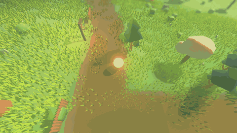

**What is given up.** A character standing still for a minute leaves no mark, and
a well-used path through a meadow does not wear in. Both are real losses and both
are cheap to add *later* if the world ever grows somewhere to keep them — the
push is one term in a sum, and a trail would be another term reading a texture.
The road network already wears real tracks into the ground, and grass is thinned
to nothing on them, so the world is not without trodden ground; it is without
trodden ground made by feet.

---

## 3. The second open question: level of detail and draw distance

> \[OPEN\] LOD / draw-distance strategy.

**Decided: a build radius with hysteresis, a per-frame visible count, and a
shader fade — and explicitly *not* density tiers that rebuild.**

Three mechanisms, each answering a different part of the problem.

**Draw distance is a build radius.** Grass is grown only for chunks whose nearest
point is within **38 units** of an observer, and dropped again beyond **46**. The
gap is the same hysteresis the ground streamer uses: walking back and forth
across the boundary must not rebuild the same grass every step. Both numbers sit
between the ground's own load radius of 40 and its unload radius of 56, which is
deliberate at both ends — 38 means grass covers as much of the ground as is drawn
at all, and 46 means grass can never be left hanging in the air over a chunk that
has been dropped.

**Detail is a visible count, not a rebuild.** The obvious level-of-detail scheme
is to build far chunks thinner than near ones. It is also wrong here, because a
chunk's distance changes continuously as the observer walks, so every tier
boundary a chunk crosses is a rebuild — and a rebuild is 2.3 milliseconds
(§7), while the instances it saves are almost free. So a chunk is built **once,
at full density**, and how many of its patches are drawn is `visible_instance_count`
on the multimesh: one integer, changed as the observer moves, no new buffer and
no new mesh. The share falls from 1 at 16 units to a floor of 0.3 at the build
radius, quantised to eighths so a walking observer changes it a handful of times
on its way past rather than every frame.

That only thins evenly because of one detail. The candidate lattice is walked in a
**fixed shuffled order**, computed once for the process and the same in every
chunk, so instances land in the buffer already shuffled and hiding the tail hides
a uniform sample rather than one corner of every chunk. The test checks it: after
thinning to the floor, the patches still drawn must span more than 80% of what
the whole chunk's did in both directions, and the middle of them must not have
moved. Measured against the chunk's own grass rather than against the chunk
square, because since §5 a chunk's grass no longer fills its chunk — a bed in one
corner of an otherwise bare chunk is the layer working, and a check that demanded
the drawn tufts span the whole square would be failing the patches rather than
the thinning.

**The rim is a shader fade, not a cut.** Between 30 and 37 units from the view's
centre a blade's height is scaled smoothly to zero, so a chunk arriving at the
build radius grows in rather than popping. Both numbers are inside the build
radius, so nothing is ever built with something visible in it that then appears
out of nowhere.

**One mesh, not several.** There is a single patch mesh at 504 triangles. A
second, reduced mesh — a patch of fewer copies for far chunks — would cost a
second multimesh per chunk, a second draw call, and the choice of which to put
each instance in, at which point distance is baked into the build again and the
rebuild problem is back. Thinning the *number* of instances is the cheaper axis,
which is what the visible count does, and it is now worth twelve tufts an
instance rather than one.

Numbers, from `render/grass_layer.gd`:

| | value | why |
| --- | --- | --- |
| build radius | 38 units | just inside the ground's load radius of 40 |
| drop radius | 46 units | well inside the ground's unload radius of 56 |
| full-detail radius | 16 units | everything underfoot is drawn |
| thin floor | 0.30 | the far band keeps three patches in ten |
| detail steps | 8 | quantised, so the count changes rarely |
| fade band | 30 → 37 units | inside the build radius at both ends |

---

## 4. The instanced unit is a patch, not a tuft

**The tuft is the `grass` tag's own row in the asset table**, not geometry this
layer invented. `AssetLibrary.instanced_mesh()` takes a tag, builds its visual
the ordinary way, and collapses every mesh under it into one surface in the
visual's own frame. The test repoints the `grass` tag at another row and checks
the baked mesh changes, so the indirection is real rather than decorative.

### 4.1 Why one tuft per instance read as sparse

The complaint that started this was that the grass looked too thin. The
measurement says why, and it is not the lattice.

One KayKit tuft is **three blades**, 42 triangles, 0.89 units tall and **0.384 by
0.378 units across** — about a hand's breadth. On a lattice of 0.57 units thinned
by a meadow's foliage density, that came to 8 667 tufts over 30 chunks: **1.13
tufts and 3.4 blades per square unit**, whose footprints together cover under a
tenth of the ground they stand on. A meadow made of that is a green surface with
things sprinkled on it, which is exactly what it looked like.

Shrinking the lattice would fix the coverage and pay for it at one instance per
hand's breadth: closing the ground would need roughly twelve times the instances,
twelve times the transforms, twelve times the buffer and twelve times the
per-candidate work at build time. So the unit changed instead.

### 4.2 What a patch is

`AssetLibrary.instanced_mesh(tag, copies, span)` now stamps the baked row out
through a list of placements into one surface. Each placement is a turn of the
row at its own heading, its own size (0.78 to 1.22 of the row's own) and its own
offset inside a square `span` wide in the mesh's frame. One copy is the
degenerate case, so a single unit and a patch are the same code path.

`GrassLayer.PATCH_COPIES = 12` and `PATCH_SPAN = 1.9` are the only statements of
those two numbers anywhere; the layer and the cost tool both read them.

| | one tuft | a patch of twelve |
| --- | ---: | ---: |
| blades | 3 | 36 |
| vertices | 54 | 648 |
| triangles | 42 | 504 |
| height, mesh frame | 0.887 | 1.058 |
| furthest copy from the middle | 0.00 | 1.20 |

The copies sit on the **R2 low-discrepancy sequence** rather than on a grid or at
random. A grid inside a patch shows as a grid the moment the patch is repeated
across a field; a dozen random points clump and leave holes. R2 fills a square
evenly at any count. The whole set is a pure function of the count and the span,
so a patch is identical in every process that bakes it.

Because a patch is one instance, everything the instance already carried still
does the varying between patches: its own yaw, its own height and spread from the
same hash as before, and its own tint. The baked arrangement repeats, but it
arrives rotated and rescaled each time.

### 4.3 Twelve, and the numbers that chose it

Measured at (228, −60) on seed 1234, the same meadow four times with nothing
changed but `PATCH_COPIES`:

| copies | blades in a patch | blades per square unit | triangles drawn | build µs per chunk | frame ms, median |
| ---: | ---: | ---: | ---: | ---: | ---: |
| 1 | 3 | 3.4 | 266 364 | 2 286 | 165.6 |
| 4 | 12 | 13.5 | 1 065 456 | 2 275 | 397.1 |
| 8 | 24 | 27.1 | 2 130 912 | 2 314 | 710.8 |
| 12 | 36 | 40.6 | 3 196 368 | 2 275 | 1 169.5 |

The instance count is 8 667 in every row: the coverage is bought entirely inside
the unit and not by instancing more of them. **The build cost does not move
either** — 2 275 to 2 314 µs a chunk across a twelvefold change in coverage —
because growing a chunk of grass is candidate tests and buffer writes, and a
patch costs exactly one of each however much art it holds. That is the whole
argument for doing it this way.

The same four at eye level, which is where a gap between blades is visible:

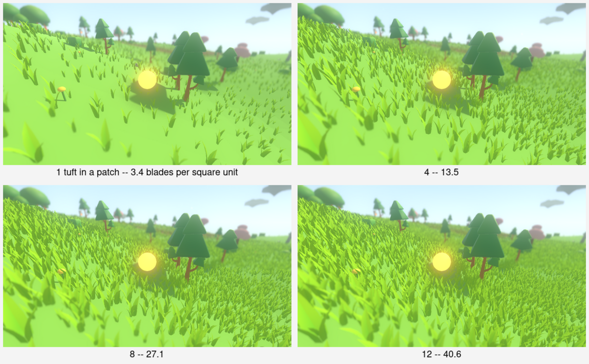

Four still reads as clumps with ground between them. Eight closes most of it.
Twelve closes it — no ground shows between the blades in the near field — and is
what shipped. Nothing past twelve was measured, for the plain reason that the
ground it would cover is already covered: each further copy costs another 42
triangles an instance and has nothing left to hide.

**The number that was checked against a budget was the build cost, and it did not
move.** The triangle count did: 266 364 to 3 196 368 in a meadow, and on this
machine that is 96% of every primitive in the frame. That is a draw cost rather
than a streaming cost — 3.2 million triangles arrive in **30 instanced draw
calls**, one per chunk — and the layer already owns the dial for it, since
`visible_instance_count` trades instances against distance without rebuilding
anything. The honest caveat is in §7: the frame times here are software
rasterisation and the ratio is what carries, not the milliseconds. §8 names the
lever that would cut the triangles without costing coverage, which is that this
row spends **14 triangles on a blade**.

### 4.4 What the ground does under a unit two metres wide

Three things had to change with the unit, all of them because a patch's *edge* is
now metres from the point it is pinned at.

* **The patch lies along the slope.** The middle row of the instance basis is the
  ground's own gradient — a shear, not a rotation, so the patch's base plane
  follows the hillside while every blade in it stays upright. A shear that
  depends only on x and z leaves vertical lines vertical, which is the difference
  between grass growing out of a hillside and grass lying on it.
* **Water is judged at the downhill edge.** A patch on a bank stands its far
  blades a slope's worth of its reach below its middle, so the clearance test
  subtracts that before comparing against the water surface. Without it a patch
  beside a pond hangs blades over the water.
* **Buildings are missed by the whole patch.** The reserved-rectangle test is
  widened by the patch's reach, so a village green gets a bare ring rather than
  grass through a wall.

The last two are why the instance count *fell* slightly in three of the four
places measured in §7 — by 1.5%, 8.0% and 13.9% — while the meadow at (228, −60),
which has no water and no village within the radius, kept all 8 667.

### 4.5 The bake

Two things about it are worth writing down.

**The row was repointed, on cost grounds.** It named `Grass_1_C_Color1`, the
pack's big double-sided clump at **396 triangles**. A row that is *placed* once
can be as heavy as it likes; a row that is *instanced* ten thousand times per
view is the cost of the layer. It now names `Grass_2_B_Singlesided_Color1`: the
same pack, the same look, **42 triangles** — a factor of 9.4. Single-sided is
right for grass anyway, because the shader draws both faces and lights them as
if they faced the sky. `Grass_2` rather than `Grass_1` because the pack draws two
different things under that name and only one of them is grass: `Grass_1` is a
rosette of broad leaves, which reads as a ground plant, and `Grass_2` is a fan of
tall narrow blades, which reads as turf.

**The texture is dropped and the palette baked into the vertices.** A KayKit
atlas is a palette — blocks of flat colour packed side by side. A tuft half a
unit across is a few pixels on screen, which is deep into the mip chain, and a
mip of a palette is the average of colours that were never meant to be mixed. The
first version of this layer sampled the atlas and came out a muddy yellow-green
across the whole meadow. So the palette is read once, at full resolution, when
the mesh is baked: every vertex is given the colour its own UV points at, in
linear light, and the mesh carries no texture at all. Fewer fetches, no bleeding,
and the biome tint lands on an exact colour.

**The colour of a blade** is the ground colour under it carried a quarter of the
way to the biome's foliage tint. Starting from the *ground* colour rather than
the biome's own matters: that colour already carries the biome blend, the dirt of
a road and the trodden earth of a village green, so grass at the edge of a track
is the colour of the track it is growing beside. The multiply is the same rule
the pack models follow — the colour wanted divided by the colour the art already
reads as, so the tuft's own light and shade survive being tinted. Both the
quarter and the colour that division is against were measured rather than
guessed, and both were wrong for most of this layer's life; §10 is that work.

**How much grows** — how many *patches*, that is — is §5's business and is the
one thing here that is no longer the blended profile's. Grass is refused
outright on ground steeper than about 44°, within 0.12 units of the water
surface, and inside a building's reserved rectangle, and is thinned by up to 92%
under a road.


---

## 5. Patches: a clearing mask, a per-biome coverage, and a hard curve

The other half of the complaint was that the grass should **occur in patches**.
Under the rule §4 shipped with, it could not — not thinly, not badly, but as a
matter of arithmetic.

### 5.1 Why the old rule could not make a patch

Every candidate cell was an independent coin flip against one number: the blended
biome `foliage_density`, scaled by 0.9 and clamped into 0.28 to 0.855. A meadow
came out at 0.41, so 41% of the lattice grew — *everywhere*. Two square metres of
meadow a hundred metres apart both grew 41% of their cells, and the only thing
that differed between them was binomial noise on a few dozen samples, which is
invisible at the size grass is seen at. There was nowhere bare, because the floor
forbade it, and nowhere closed, because no biome reached 1. That is uniform
confetti by construction, and no amount of art inside one instance changes it:
§4 made each speck twelve times bigger and left the speckle exactly as even.

Three things were needed, and they are separable: something that varies at a
scale a walker can see across (§5.3), something that turns a middling number into
either nothing or everything (§5.4), and — a bug the same work uncovered — for
the coverage to be about grass rather than about trees (§5.2).

### 5.2 Grass gets its own coverage, and the meadow stops being the thinnest ground in the world

The layer took `foliage_density` because it was there. That field is how thickly
a biome puts *things* on the ground, and it is what `DecorationScatter` grows its
trees and its ferns from. Read as a grass density it is upside down:

| biome | scatter density (`sim/biome_catalog.gd`) | grass coverage (`render/grass_layer.gd`) |
| --- | ---: | ---: |
| meadow | 0.45 | **0.95** |
| blossom grove | 0.60 | **0.78** |
| twilight marsh | 0.70 | **0.36** |
| highland | 0.18 | **0.32** |
| deep forest | 0.95 | **0.30** |

A closed canopy is exactly what shades a floor bare and an opening is exactly
what lets grass flourish, so the deep forest growing twice the meadow's
grass was backwards — and the meadow is the design's first reference beat, the
one that has to read lush.

The fix stays on the render side. `sim/biome_catalog.gd` is not touched, because
the tree scatter reads that field and editing it would move the world's
fingerprint for a reason that has nothing to do with grass. The grass layer keeps
its own table instead.

**The ordering is not invented.** Two of the five biome profiles already
advertise `grass` among their own prop tags — the meadow and the blossom grove —
and the other three advertise hardy shrubs, ferns, cattails and toadstools. The
catalog already says where grass belongs; the table says how much, and the suite
checks the agreement: a biome that lists grass must be given enough coverage for
the curve to close it, and a biome that does not must be given less.

**A border stays organic** because the coverage is a weighted average over the
same continuous biome weights the profile blends its colours and its fog with,
not a switch on the strongest biome. That is checked as an inequality rather than
as a tolerance: a weighted average of fixed numbers cannot move further in one
step than the spread of the table times how much of the weight moved, and the
suite walks 28 800 steps of transect requiring it, with the switched-on-strongest
version failing the same bound by a wide margin as its control.

### 5.3 The clearing mask

A pure function of world position and the seed, multiplied into the biome's
coverage before the coin flip. Two fields, because they do different jobs.

**A clearing field** — value noise at **76 m** with a smaller octave at **28 m**
folded in at 0.34, the sum pushed through a contrast window from 0.24 to 0.62.
The contrast step is not decoration: two octaves of plain value noise spend
almost all of their time in the middle of their range, the curve of §5.4 is then
crossed nearly everywhere, and what comes out is a soft gradient rather than a
patch. Measured on the way here: without it, a meadow view came out 11% bare, 0%
closed and 88% ramp — a wash, not patches.

**A boundary field** — a jittered Voronoi lattice at **48 m**, read not by which
cell a point falls in but by how far it is from the nearest *edge*: the
difference between the distance to the closest site and to the second closest,
which is zero exactly where two sites are equally near. The zeroes of that are a
connected network, and at **5 m** wide they read as bare paths worn through the
grass. A scatter of round holes would not; connectedness is the whole reason for
using a Voronoi at all.

Two details that had to be got right, both found by measuring:

* **A Voronoi edge is a straight segment**, however hard the sites are jittered,
  and a field of them reads as a pane of leaded glass. So the position is bent
  before the lattice is asked — offset by a noise field of its own at **62 m**,
  by up to 0.40 of a cell — which leaves the network connected and makes every
  edge of it a curve.
* **The second-nearest site is not always in the ring of nine.** Confining a site
  to its own cell puts the *nearest* one in the 3×3 around a point, but from a
  corner the nearest can be 1.35 cells away while a site two cells out is only
  1.08 away. Searching nine cells therefore made the second-nearest distance jump
  whenever the ring shifted, and it showed as the mask moving by 0.40 between two
  lattice cells half a metre apart — a hard seam through the grass. The search is
  5×5. The suite now measures that step.

The mask, drawn straight out of the arithmetic by `tools/grass_mask_map.sh` — no
render shell, no display, because it is a pure function of position and seed. Bare
earth is the catalog's own path dirt, closed carpet is green, and the white ring
is `BUILD_RADIUS` round the position asked for: **everything inside that ring is
all one frame from the playing camera can hold**, which is why the scales below
are what they are.

| a meadow, 240 m across | 900 m of world around the origin |
| --- | --- |
| 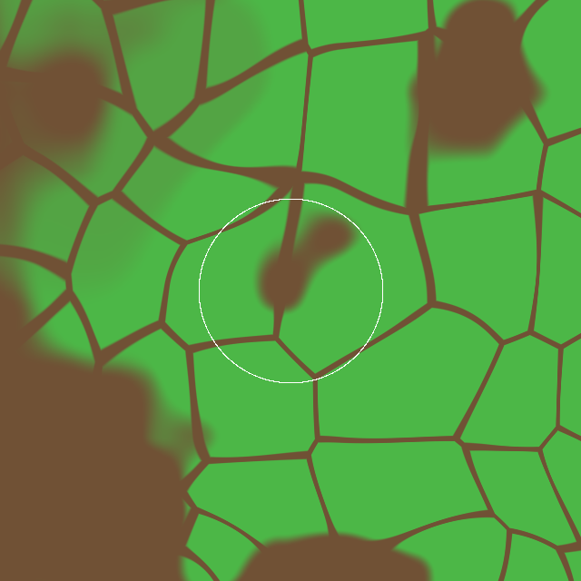 | 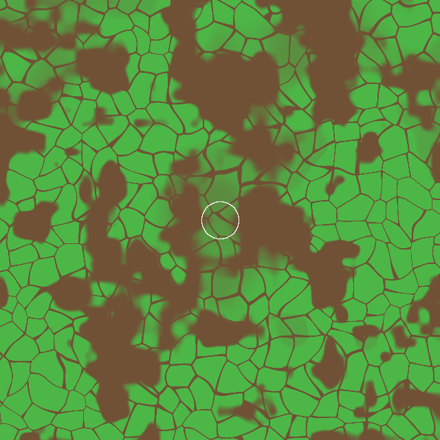 |

Over the 240 m square on the left the ground comes out **25.0% bare, 26.6% on the
ramp and 48.5% closed carpet**. The brown blobs are the clearing field; the
network of thin brown lines running between them is the boundary field, and it is
what a bare path through grass looks like from above.

**The scales are the reference build's arrangement at a third of its size, and
that is deliberate.** The reference clears at about 228 m with a boundary lattice
at about 144 m. Grass here reaches `BUILD_RADIUS` = 38 m from whoever is looking,
so the ground a frame can hold is a disc 76 m across; a 228 m clearing is three of
those end to end and no frame would ever contain an edge of one. What would
arrive instead is several minutes of walking over bare ground followed by several
minutes over grass, which is not what "in patches" means. The ratio between the
two scales is kept exactly — 76 : 48 is 228 : 144 — so what changes is how far
apart clearings are and not what one looks like.

### 5.4 The curve, and the floor that is gone

The masked coverage is pushed through `smoothstep(0.20, 0.42)`. Below 0.20 the
answer is **exactly** bare and above 0.42 **exactly** every cell on the lattice,
with a 0.22-wide ramp between them. That is the whole of what turns a coverage
into a patch: without it, a mask that halves a coverage just halves the confetti.

`DENSITY_FLOOR` is gone. It held every cell of every biome at 0.28 so the
highland would not read as unfinished, and it is precisely the reason nothing
could ever be bare. What replaces it is per-biome, where the number is about that
biome rather than about all of them at once.

**The stop condition, checked.** Dropping the floor must not send a biome that
should carry grass entirely bare. It does not: the curve and the table together
give each biome a ceiling and a threshold, and every one of the five reaches real
grass on its best ground.

| biome | coverage | most of the lattice it can grow | bare below mask | closed above mask |
| --- | ---: | ---: | ---: | ---: |
| meadow | 0.95 | 1.000 | 0.21 | 0.44 |
| blossom grove | 0.78 | 1.000 | 0.26 | 0.54 |
| twilight marsh | 0.36 | 0.818 | 0.56 | never |
| highland | 0.32 | 0.568 | 0.63 | never |
| deep forest | 0.30 | 0.432 | 0.67 | never |

Read across, that is the ladder the biomes now sit on. The meadow is closed
carpet with clearings cut into it; the blossom grove nearly so; the marsh, the
highland and the deep forest are mostly bare ground with thickening beds in the
openings, which is what a bog, a windswept top and a shaded forest floor should
be.

### 5.5 What it looks like, and what it counts

A meadow at seed 1234 from the camera the game is played from, same seed, same
place, same camera, the code of §4 and then §5. The right-hand frame has bare
ground running through it — the clearing the observer is standing in, and the
boundary path leaving it towards the top of the frame — and the grass either side
of that is thicker than anything in the left-hand frame.

| an even sprinkle everywhere | bare clearings and closed beds |
| --- | --- |
|  |  |

The playing camera sits 42 units up and 52 back and looks through fog at a
diorama, which is the right view of the world and a poor view of the ground. The
same place from lower down, after, where the edge of the clearing is legible:

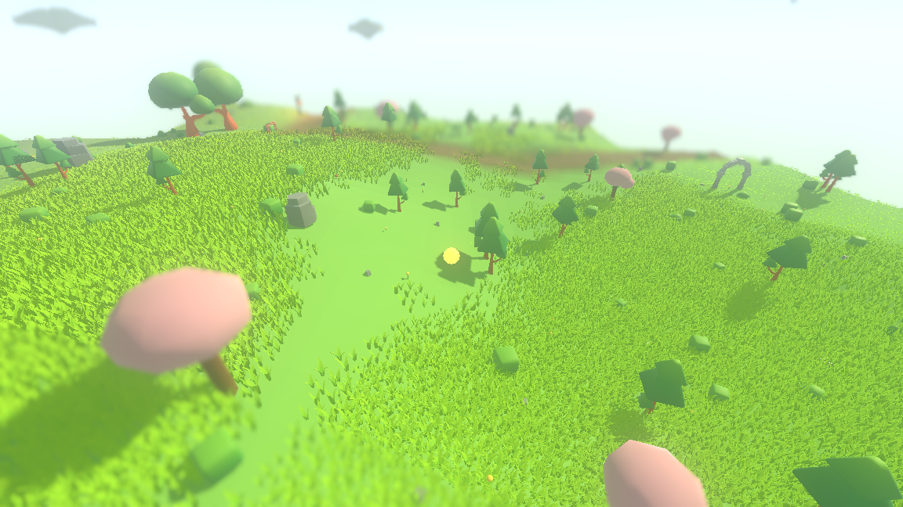

And the village at (−232, −224), which shows the other half of it: the grass now
crowds the open ground and the village green while the foreground has gone to
bare earth.

| before | after |
| --- | --- |
|  | 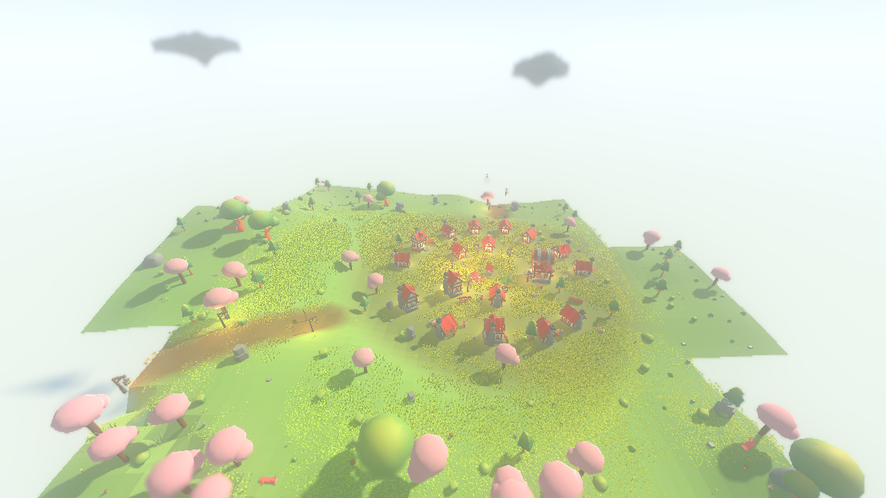 |

**The counts**, from `tools/measure_grass.sh` at four places on seed 1234, run
once on the code of §4 and once as shipped. Per square unit is over the chunks
that grew any grass, so it is the density *within* grassy ground — which is
exactly the quantity the request called "denser where there is grass".

| where | biome | chunks that grew any | patches | share of the lattice | tufts / unit² | blades / unit² |
| --- | --- | ---: | ---: | ---: | ---: | ---: |
| (228, −60) | meadow | 30 → 30 | 8 667 → **17 504** | 0.369 → **0.744** | 13.5 → **27.4** | 40.6 → **82.0** |
| (−232, −224) | meadow, village | 26 → 26 | 6 662 → **11 205** | 0.327 → **0.550** | 12.0 → **20.2** | 36.0 → **60.6** |
| (96, −240) | highland | 29 → 23 | 5 940 → **5 349** | 0.261 → **0.297** | 9.6 → **10.9** | 28.8 → **32.7** |
| (−512, −640) | deep forest | 32 → 23 | 18 782 → **5 106** | 0.749 → **0.283** | 27.5 → **10.4** | 82.5 → **31.2** |

"Chunks that grew any" is the other half of the story. Of the 32 chunks inside the
build radius at (96, −240), three grew nothing before — all water or all cliff —
and **nine** grow nothing now; at (−512, −640) it went from none to nine. Those
are clearings, and before this change a chunk of dry, walkable, unbuilt ground
could not be one. The two meadows have no bare chunks at either end, which is
right too: a clearing is tens of metres and a chunk is sixteen, so in ground the
mask likes, clearings show up *inside* chunks rather than as whole empty ones.

**The inversion, in one line.** Before, the deep forest at (−512, −640) carried
18 782 patches and the meadow at (228, −60) carried 8 667: the shaded forest
floor grew **2.2 times** the grass of the flagship meadow. After, the meadow
carries 17 504 and the deep forest 5 106 — the meadow grows **3.4 times** the
forest. Read as a share of the candidate lattice the swap is almost exact: the
meadow went 0.369 → 0.744 and the deep forest 0.749 → 0.283. The total across the
four places barely moved — 40 051 patches before, 39 164 after — so what changed
is not how much grass there is but where it is.

**Triangles, draw calls and build cost.**

| where | triangles drawn | grass µs/chunk | ground mesh µs/chunk | grass as a share |
| --- | ---: | ---: | ---: | ---: |
| (228, −60) | 3 196 368 → **6 375 096** | 2 307 → 3 880 | 10 125 → 10 412 | 23% → 37% |
| (−232, −224) | 2 543 184 → **4 186 728** | 3 488 → 5 729 | 10 614 → 10 602 | 33% → 54% |
| (96, −240) | 2 167 200 → **1 876 392** | 2 172 → 3 053 | 9 184 → 8 786 | 24% → 35% |
| (−512, −640) | 6 671 448 → **1 563 912** | 3 096 → 2 999 | 11 849 → 10 557 | 26% → 28% |

Draw calls added are one per chunk of grass, unchanged: 30, 26, 23 and 23. Frame
times, on the software rasteriser and therefore a measure of geometry rather than
a frame rate, track the triangles as they always do — 1 169 → 2 248 ms at
(228, −60) and 2 582 → **649** at (−512, −640), against a "without grass" column
that moves by under a millisecond in every place.

Two things to say about that honestly.

**The build cost rose where the grass did, and the mask itself is a small part
of it.** The mask is 81 samples a chunk — two octaves of value noise, two more
for the warp, and twenty-five Voronoi sites each — and timed on its own over the
26 chunks at (−232, −224) it costs **769 µs a chunk, 13% of the build**. The rest
of the rise there, 3 442 µs to 5 729, is candidates *surviving*: that chunk set
went from 256 patches a chunk to 431, and every extra survivor pays for the
triangle lookup, the water and road grids, the building test, the tint and the
buffer write. So the build got more expensive exactly where it grew more grass,
which is the trade that was asked for. In the deep forest, where the layer now
grows a quarter of what it did, the build came out *lower* than before — 3 096 to
2 999 µs a chunk — and in the highland it went 2 148 to 3 053, which is the mask
being paid on nine chunks that then grow nothing.

Grass remains a fraction of the ground it stands on everywhere (28% to 54% of
what meshing the chunk costs, against 22% to 35% before), and it is still paid
once, when a chunk appears.

**A closed meadow is twice the triangles.** (228, −60) goes from 8 667 patches to
17 504 and from 3.2 to 6.4 million drawn, in the same 30 draw calls. That is
the request being granted rather than a regression — the ground under a meadow is
now actually covered — but it is the number to watch, and §8's note about a blade
costing 14 triangles is the lever that would halve it without costing a blade of
coverage. The three biomes that should be thin all got *cheaper*: the deep forest
by a factor of four.

---

## 6. The wind

Two waves running downwind at different scales, plus a third across them.

* A **gust**: a long wave, 26 units from crest to crest, rolling downwind at 7
  units a second, pushed through a `smoothstep(-0.15, 0.90, …)` so that most of
  its cycle is calm and the crest arrives as a front rather than as a swell.
* A **cross wave**: 41 units, travelling at 4.5 units a second at right angles to
  the wind, multiplied into the gust so a front is a ragged band rather than a
  straight line the width of the view.
* A **ripple**: 3.2 units at 9 units a second, with a per-instance phase, which
  is the fidget of individual blades and never stops.

Tip displacement is 0.05 world units between gusts and up to 0.29 in one. Every
quantity is a function of **world** position and time, never of anything
belonging to a chunk — exactly as the water's ripples are, and for the same
reason: grass belongs to the world, so a chunk that streams in beside one already
on screen is part of the same gust rather than starting its own.

The shader works in world coordinates, which is what lets the wind push a blade
along a world direction without first undoing the instance's own rotation and
scale. The root of a blade stays put; how far up the blade a vertex is decides
how far it is carried, squared, so a tuft bends rather than slides. Every normal
is pulled 70% of the way towards straight up, which is what makes a tuft read as
one soft shape catching the sky rather than as a handful of separately lit
facets — and is what makes a single-sided blade work, since both of its faces are
then lit as if they faced the sky.

**Whose root, though.** With one tuft per instance the root was
`MODEL_MATRIX[3].xyz`, the instance's origin, and that was the same thing. With
twelve tufts in an instance it is not, and taking the origin would make every
quantity above — the gust's arrival, the ripple's phase, the distance to a
character's feet — a property of a whole patch two metres across. A gust would
arrive on the patch all at once, and someone standing at one corner of it would
flatten the other corner.

So every vertex carries **the root of its own copy** in the second
texture-coordinate channel, written when the patch was baked, and the shader puts
that through the model matrix to find where that blade is standing in the world.
The per-instance ripple phase is shifted by the same value, so blades sharing a
patch fidget independently of one another. The test in `tests/test_grass.gd`
pins both halves: the baked patch must carry as many distinct roots as it has
copies, spread over the span, and the shader must not be reading the instance
origin.

The same paused frame with a character standing in the grass, the two shaders
side by side. On the left the character has swept an area far wider than they can
reach, in patch-sized lumps; on the right the clearing stops where their feet do
and blades a hand's breadth outside it — in the same patches — are upright:

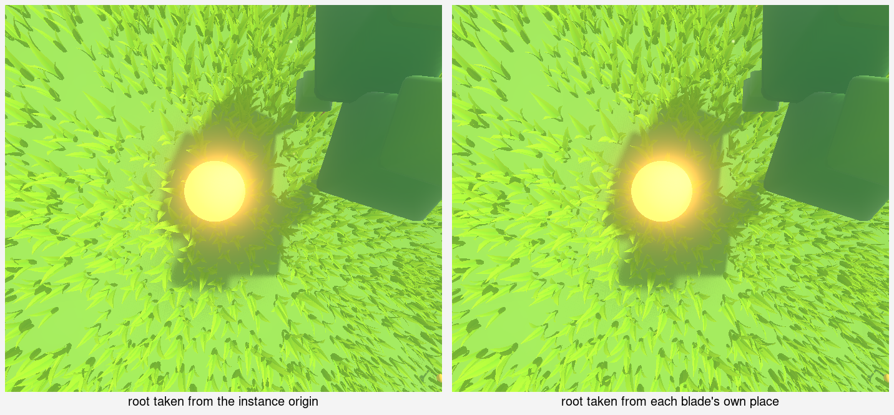

Closer, with the grass standing to the rim of the bowl:

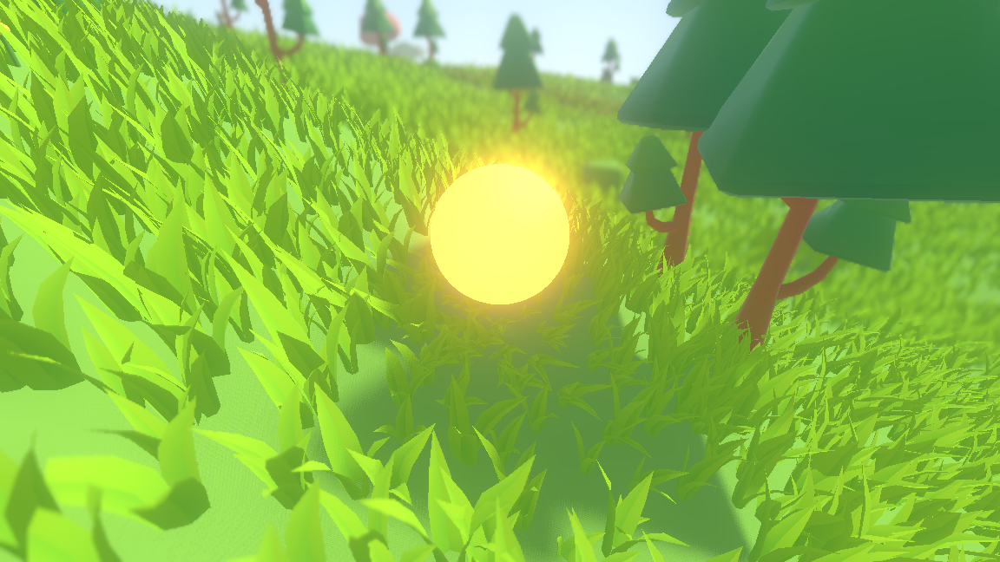

The world held still, so that the only thing moving is the wind:

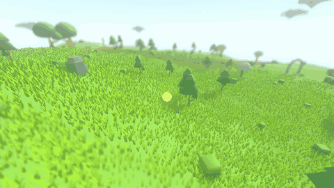

Grass does not cast shadows. Blades a third of a unit tall cast shadows a shadow
map stretched over 160 units cannot resolve, so what arrives is not shadows but a
shimmering stain — and the vertex shader moves every blade, which the shadow pass
would have to repeat. It still *receives*, which is what matters: grass under a
tree is grass in shade.

---

## 7. The cost, measured

`tools/measure_grass.sh` runs the render shell itself rather than a stand-in, so
what is counted is the scene the game actually draws. It settles the world,
**holds it still**, samples 120 frames with the grass in place, then deletes
every grass drawable and stops the layer being rebuilt and samples 120 more — so
the two columns differ by exactly the grass and by nothing else. It then rebuilds
every chunk of grass from scratch with a layer that has never seen any of it and
times that, three passes, fastest taken, alongside the cost of meshing the same
chunks of ground.

```
./tools/measure_grass.sh --seed 1234 --start 228 -60
```

Four places on seed 1234, at the streaming radius, each run twice: once with one
tuft per instance and once with a patch of twelve. Everything else — the seed,
the place, the lattice, the density rule — is the same in both.

**Coverage.** A blade is a connected piece of the mesh, counted by the tool from
the baked surface itself; per square unit is over every chunk that grew any
grass, water and roads and village floors included, because the question is how
thick the grass is over a meadow and not over the parts of a meadow that grow
grass.

| where | biome | foliage density | chunks | instances loaded | tufts / unit² | blades / unit² |
| --- | --- | ---: | ---: | ---: | ---: | ---: |
| (228, −60) | meadow | 0.441 | 30 → 30 | 8 667 → 8 667 | 1.1 → **13.5** | 3.4 → **40.6** |
| (−232, −224) | meadow | 0.452 | 26 → 26 | 7 244 → 6 662 | 1.1 → **12.0** | 3.3 → **36.0** |
| (96, −240) | highland | 0.209 | 30 → 29 | 6 030 → 5 940 | 0.8 → **9.6** | 2.4 → **28.8** |
| (24, −24) | deep forest, mostly lake | 0.912 | 6 → 6 | 1 212 → 1 044 | 0.8 → **8.2** | 2.4 → **24.5** |

**The instance count did not rise to buy that; it fell a little.** Unchanged in
the meadow at (228, −60), and 1.5%, 8.0% and 13.9% lower in the other three,
because a patch two metres wide has to keep its whole width off the water and out
of a building's floor where a hand's-breadth tuft only had to keep its middle
there (§4.4). The highland lost a whole chunk to it, 30 to 29.

The last row is worth reading twice. Deep forest has the highest foliage density
in the catalog and grew the least grass of the four, because the observer is
standing beside the big lake at seed 1234's origin and nineteen of its
twenty-five chunks are water. Density is what the biome asks for; the ground is
what it gets.

**Triangles and draw calls.**

| where | triangles drawn | draw calls added |
| --- | ---: | ---: |
| (228, −60) | 266 364 → **3 196 368** | 30 |
| (−232, −224) | 235 158 → **2 543 184** | 26 |
| (96, −240) | 183 120 → **2 167 200** | 29 |
| (24, −24) | 35 028 → **359 352** | 6 |

Draw calls added is exactly one per chunk of grass, before and after: a chunk is
one multimesh and one instanced draw whatever is in the mesh.

**Build cost**, and what the ground under it costs:

| where | grass µs/chunk | ground mesh µs/chunk | grass as a share |
| --- | ---: | ---: | ---: |
| (228, −60) | 2 286 → 2 275 | 10 215 → 10 194 | 22% → 22% |
| (−232, −224) | 3 623 → 3 442 | 10 439 → 10 564 | 35% → 33% |
| (96, −240) | 2 134 → 2 137 | 8 757 → 8 728 | 24% → 24% |
| (24, −24) | 2 346 → 2 366 | 7 505 → 7 291 | 31% → 32% |

**This is the table the whole approach rests on.** Twelve times the art, and the
cost of growing a chunk of grass is where it was — between a fifth and a third of
what meshing the chunk of ground under it already costs, paid at the same moment
and on the same schedule, once, when the chunk appears. A patch is one candidate
test, one hash and one row of the buffer however many blades it holds; buying the
same coverage by shrinking the lattice would have multiplied every one of those.

Where those two thousand microseconds go was worked out when the layer was first
built — it started at 7 266 µs a chunk and came down by measuring rather than by
guessing — and none of that changed here. Almost all of it is questions put to
the terrain query, which are expensive: when that work was done, `water_surface_at`
measured 26 µs a call on this machine and `path_strength_at` 28 µs, against
essentially nothing for a value read off a triangle the shell already has. So the layer asks as few as it can — nine
questions became four for the biome profile and 162 became 50 for the water and
the roads, sampled on coarse grids and interpolated — the cheapest test (a hash
against the biome's density) rejects most candidates before any of the others are
asked at all, the instance buffer is written by index into one allocation instead
of appended to, and the bit mixer is written out inline rather than called, which
alone was worth about a millisecond a chunk at six hundred candidates.

**Frame time.** *This machine has no GPU.* The captures and these frames are
software rasterisation under `xvfb` (llvmpipe), so these milliseconds are a
relative measure of how much geometry is being pushed and **not a frame budget**
— there is no frame budget in them to blow. What carries across to a machine with
a graphics card is the triangle count, the instance count, the draw calls and the
build times; the milliseconds do not.

| where | median ms, with grass | median ms, without grass | added |
| --- | ---: | ---: | ---: |
| (228, −60) | 165.6 → 1 169.5 | 80.9 → 81.0 | +84.8 → **+1 088.4** |
| (−232, −224) | 306.5 → 1 839.3 | 156.3 → 155.8 | +150.2 → **+1 683.4** |
| (96, −240) | 231.9 → 1 576.7 | 117.2 → 116.7 | +114.7 → **+1 460.0** |
| (24, −24) | 173.9 → 365.8 | 152.5 → 152.1 | +21.4 → **+213.7** |

The "without grass" column barely moves, which is what says the two columns
differ by the grass and by nothing else. The added time tracks the triangle count
almost exactly: at (228, −60) it is 0.32 µs per grass triangle before and 0.34 µs
after, so on this machine the frame time simply *is* the triangle count in
disguise, and a real rasteriser's would not be.

The honest statement is therefore the triangle count. **2.2 to 3.2 million
triangles in 26 to 30 instanced draw calls** is a real but ordinary load for a
graphics card, an enormous one for a CPU pretending to be one, and the layer
already carries the dial that trades it against distance without rebuilding
anything (§3).

---

## 8. What is not done

* **No grass on the floating islands.** They have their own cover layer, which
  places flora item by item; the grass layer grows on ground chunks only.
* **No trampled trails**, for the reasons in §2.
* **The wind is one global direction and strength.** Per-biome wind — a still
  marsh, a windswept highland — is a profile field this layer would read, and is
  a natural thing to fold into the atmosphere work that comes next.
* **The patch has one level of detail.** §3 says why, and the visible count is
  the axis that does the work instead.
* **A blade costs 14 triangles.** `Grass_2_B_Singlesided_Color1` spends 42
  triangles on three blades, which is generous for a curved ribbon and is now
  multiplied by twelve. This is the one lever that would cut the 3.2 million
  triangles of §7 without costing a single blade of coverage, and it is an
  asset-row question — a cheaper row, or a decimated bake — rather than a
  question about this layer. It is not touched here.
* **A patch's arrangement repeats.** Twelve copies are baked once and every
  instance in the world is a turn of the same twelve. The instance's own yaw and
  scale hide it at the sizes grass is seen at, but it is a real limit: a second
  baked arrangement chosen per instance would cost a second mesh and a second
  draw call per chunk.
* **The clearing mask is not shared with the scatter layer.** Grass clears where
  the mask says and trees stand where `DecorationScatter` says, and the two do
  not agree — a bare path can run under a canopy tree. Sharing the mask so that
  clearings line up across both layers is a real idea and a better world, but it
  is a change to a *generation rule*: it would move the headless fingerprint, and
  a fingerprint move has to be deliberate, stated and attributed rather than a
  ride-along on a render-side change. It belongs to its own scatter-layer work
  item. The grass layer's guarantee — that growing grass cannot move the world —
  is worth more than the alignment.
* **Frame time is measured on a software rasteriser.** The instance and triangle
  counts, the draw calls and the build times are hardware-independent; the
  milliseconds are not, and are labelled that way everywhere they appear.

---

## 9. The other half of "noisy": the project set no anti-aliasing at all

The grass was reported as looking *noisy*, and the guess that came with the
report — that only one side of each blade was being lit — was checked first and
ruled out (the shader has drawn both faces since it was written, and forcing the
last of the normal variation out made the number slightly worse). What the
measurements found instead was two things, and this section is the first of
them. The second, that a blade is a sharper yellow-green than the ground it grows
out of, is its own work item.

**The finding.** `project.godot` carried no anti-aliasing key of any kind, so the
engine drew the main viewport with one sample per pixel. A meadow is the worst
thing that can happen to a renderer in that state: at the distance the game is
played from, a blade of grass is *thinner than a pixel*, so whether a pixel lands
on a blade or between two of them is decided by a single sample, and the answer
flips from pixel to pixel. That is not a grass problem — it is what one-sample
rasterisation does to thin geometry — and it is one project setting.

### 9.1 The number, and the tool that produces it

"Noisy" has to become a number before a mode can be chosen on it. The number used
throughout is **the standard deviation of the discrete Laplacian of luminance**
over a rectangle of pixels: for each pixel, how far its brightness sits from the
average of its four neighbours, and then how much that varies. A smooth slope of
ground scores near zero however bright or dark it is; a stipple that flips light
and dark from one pixel to the next scores high. It is exactly the quantity a
person means by "this reads as noise", and it is what aliasing does.

That measurement was a one-off session when the problem was diagnosed. It is now
two checked-in files: `tools/noise_metric.gd` (the arithmetic, shared) and
`tools/measure_noise.sh` (one or more saved frames, a rectangle, a table). It
needs no display — it reads pixels off disk.

```
./tools/measure_noise.sh /tmp/frame.png --region 250 380 800 560
```

The default rectangle is the meadow the complaint was measured over: seed 1234 at
(228, −60), rows 380–560 and columns 250–800 of the 1152×648 frame. On the frame
the diagnosis quoted, the tool reports **0.2774**, against the 0.2781 quoted from
the session — the same number to a part in four hundred, the difference being how
the pixels on the rectangle's own border get their neighbours. Every noise figure
below comes from this tool.

The metric is checked against pictures whose answer is known by construction
(`tests/test_anti_aliasing.gd`): flat grey and a straight ramp both score under
0.01, a one-pixel checkerboard scores above 1.0, and the same striped picture
resolved at twice the density and averaged down — which is what multi-sampling
does to an edge — scores far lower at the same mean brightness.

### 9.2 The modes, compared on the frame the complaint was about

`tools/measure_aa.sh` runs the render shell, holds the world still, and draws the
*same paused frame* once in every mode: it switches the mode on the main
viewport, lets the renderer settle, samples frame times, and reads the finished
picture back through the same metric. One process, one world, one camera, so the
rows differ by the mode and by nothing else.

```
xvfb-run -a ./tools/measure_aa.sh --seed 1234 --start 228 -60
```

Measured with the grass **on**, deliberately: this frame is 6 491 926 primitives
and the same frame with `--no-grass` is 116 830, so the grass is 98% of them —
and thin geometry is the worst case for multi-sampling, so a table measured
without it would price the cheap answer rather than the real one.

| mode | what it is | noise | vs off | frame ms | vs off |
| --- | --- | ---: | ---: | ---: | ---: |
| off | no anti-aliasing | 0.2773 | — | 2248.8 | 1.00× |
| fxaa | screen-space FXAA | 0.1345 | −52% | 2244.8 | 1.00× |
| taa | temporal anti-aliasing | 0.0579 | −79% | 2789.9 | 1.24× |
| msaa2 | 2x multi-sampling | 0.2701 | −3% | 2235.5 | 0.99× |
| msaa2+fxaa | 2x multi-sampling and FXAA | 0.1307 | −53% | 2239.3 | 1.00× |
| msaa4 | 4x multi-sampling | 0.1638 | −41% | 4747.8 | 2.11× |
| **msaa4+fxaa** | **4x multi-sampling and FXAA** | **0.0946** | **−66%** | **4721.3** | **2.10×** |
| msaa8 | 8x multi-sampling | 0.1584 | −43% | 4706.3 | 2.09× |

(The `msaa4+fxaa` row was measured in a second run of the same command with
`--modes off,msaa4+fxaa`; that run's `off` row came back at 0.2775 against the
first run's 0.2773, which is how repeatable the instrument is.)

**Two rows in that table are not measuring what they say, and it matters.** The
8x row is identical to the 4x row in both noise and cost, and the 2x row is
identical to no anti-aliasing at all. That is the signature of a rasteriser that
offers one and four samples and nothing else, which is what this machine has:
there is no graphics card here and every frame is drawn by `llvmpipe` in
software. So this table has one real multi-sampling level, 4x. On a graphics card
2x is a genuine setting and would sit somewhere between the `off` and `msaa4`
rows; nothing here measures that.

### 9.3 The choice

**4x multi-sampling with FXAA over it** (`msaa_3d=2`, `screen_space_aa=1`), because
it removes two thirds of the noise where either half alone removes a third to a
half — multi-sampling resolves the blade *edges*, and FXAA flattens the sub-pixel
speckle *between* blades that no number of coverage samples can reach — and the
one mode that beats it is temporal, which buys its 79% on a frame that is being
held still and is the one mode that would smear a field of wind-blown grass under
a moving camera.

Set in `project.godot`, which is where a viewport setting belongs: the engine
applies it to the window at start-up, and a headless run, which never opens a
window, pays nothing for it.

### 9.4 What it costs, and the honest version of that

The 2.10× in the table is **software rasterisation**, and it should not be read as
what this mode costs the game. Two numbers say why. The same sweep run with
`--no-grass`:

| | primitives | off | msaa4 | msaa4+fxaa |
| --- | ---: | ---: | ---: | ---: |
| grass on | 6 491 926 | 2248.8 ms | 4747.8 ms (2.11×) | 4721.3 ms (2.10×) |
| grass off | 116 830 | 81.5 ms | 100.5 ms (1.23×) | 104.0 ms (1.28×) |

The frame without grass costs 81.5 ms and the frame with it costs 2248.8 ms — 27×
— so on this machine the grass, not the anti-aliasing, is what makes the frame
unaffordable, and it is unaffordable with the setting off. Of the 2474 ms that
multi-sampling adds to the meadow frame, 2452 ms is grass: with the grass gone,
the same mode adds 22.5 ms. **Multi-sampling is expensive here entirely because
the grass is, and the grass is expensive here entirely because a CPU is doing a
graphics card's job.** 3.2 million triangles in 30 instanced draw calls is an
ordinary load for hardware and 4x multi-sampling on a low-poly forward renderer is
a bandwidth cost there rather than a shading one. The choice is made for a
graphics card, and both numbers are on the record rather than one.

The named fallback, if multi-sampling had to be paid for by making the grass
cheaper, is still open and still worth what it was worth: the `grass` tag draws
three blades in 42 triangles, 14 for what is a curved ribbon, and either a
cheaper asset row or a decimated bake would cut that without costing a blade of
coverage (§8). Nothing here needed it — the surcharge measured is a software
artefact, not a hardware budget — and it is recorded rather than pulled.

### 9.5 It does not fight the bloom or the depth of field

The atmosphere stack already puts bloom on every warm emissive and a miniature
depth of field on the camera, and an anti-aliasing mode that argued with either
would be a bad trade whatever it did to the grass. So the check is a frame that
has both in it at once — the pond beat: lit windows and a lantern blooming, the
far village well outside the focal band, grass in focus in the middle distance,
and the water mirroring all of it — measured in three rectangles, before and
after.

| rectangle in the pond frame | before | after | change |
| --- | ---: | ---: | ---: |
| far village: blooming windows, out of focus | 0.0067 | 0.0067 | none |
| near grass bank, in focus | 0.2384 | 0.0896 | −62% |
| the water and what it reflects | 0.0352 | 0.0206 | −41% |

(Both frames there have the mirror itself drawn with no anti-aliasing, which is
what it was at the time; §9.6 takes that question up on its own.)

The band that is bloom and depth of field is **unchanged to four decimal places**,
and its brightness is unchanged with it: mean luminance 0.7503 → 0.7511, spread
0.382 → 0.381. That is the statement the check was for. It is also what one would
expect from the order the passes run in — multi-sampling is resolved before the
glow and the depth of field are applied, so they see the same resolved colour
they saw before, and FXAA runs afterwards over a band that is already blurred and
finds no edge-shaped contrast to soften. The interaction is not assumed absent;
it is measured absent, on a frame with both switched on.

Temporal anti-aliasing is the mode where this would not have been true — jitter
plus reprojection through an out-of-focus band is where ghosting shows — which is
a second reason the best number in the table was not the mode chosen.

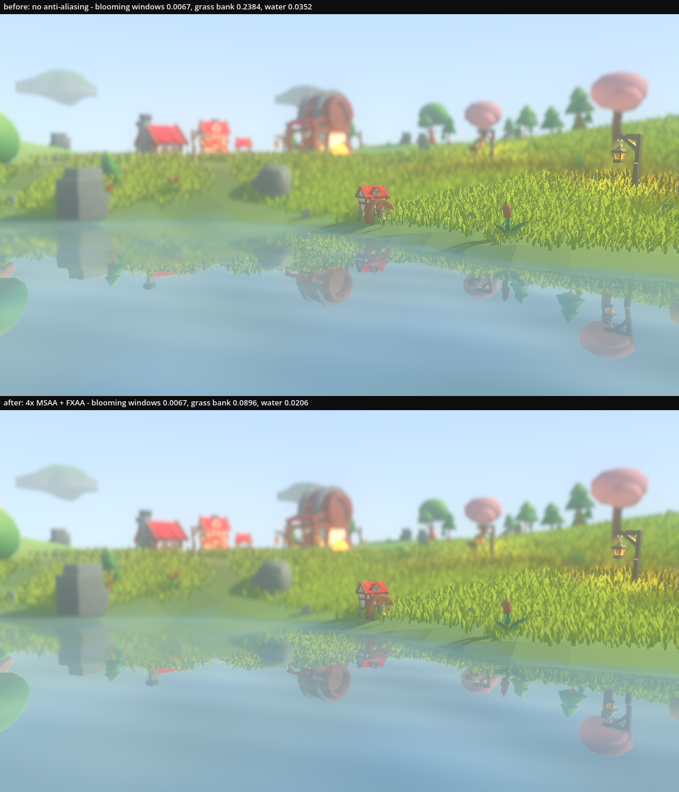

### 9.6 The water's mirror: asked with a frame, and half-answered yes

The reflection viewport deliberately drew with no anti-aliasing of any kind, on
the argument that a mirror resampled through a rippling surface throws that
detail away. Now that the main viewport has a mode, "leave it alone" needed an
answer rather than an inheritance, so it was priced: the same pond frame, the
main viewport at the shipped mode throughout, the mirror drawn three ways.

| the mirror drawn with | the reflection's noise | frame ms |
| --- | ---: | ---: |
| nothing (as it was) | 0.0204 | 5858.0 |
| **FXAA (as it now ships)** | **0.0168** (−18%) | **5891.1** (+0.6%) |
| 4x multi-sampling and FXAA | 0.0161 (−21%) | 8916.9 (+52%) |

So the old argument was right about half of it and wrong about the other half.
*Sampling* the mirror four times a pixel is what the ripples throw away — it
buys a further 5% of an already small number and costs half a frame again,
because the mirror is a second whole view of the world — but the screen-space
filter is nearly free, and the stair-stepping on a reflected bank is real and
visible at 3×. The mirror now takes the filter and refuses the sampling, and
that split is pinned by a test so it does not drift into matching the main
viewport out of tidiness.

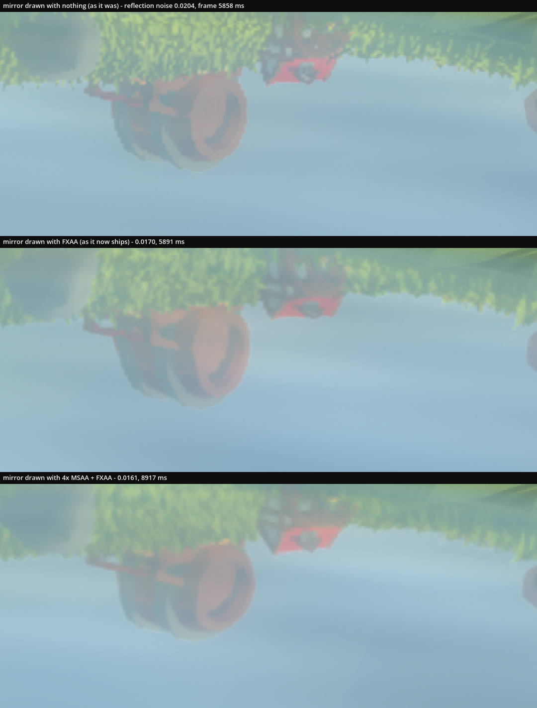

### 9.7 Before and after, on the user's own meadow

| | noise | vs before |
| --- | ---: | ---: |
| before, as the complaint found it | 0.2774 | — |
| after, as it now ships | 0.0954 | −66% |
| the ground alone, grass switched off | 0.0357 | — |

The last row is the floor: bare ground with no grass on it at all scores 0.0357,
so the meadow has gone from **7.8× the noise of its own ground to 2.7×**. What is
left is the second cause — the blades being a sharper colour than the ground —
and that is §10, which took a further 20% off the same number and found a third
cause nobody had measured.

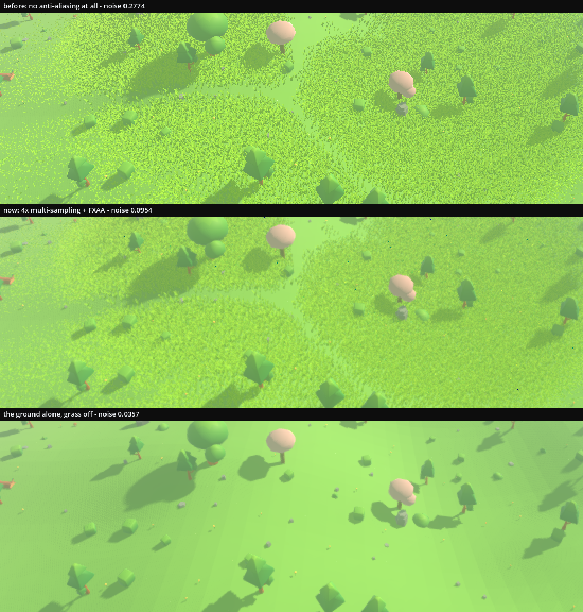

The panels are the measured rectangle itself, scaled 2× with nearest-neighbour so
that one pixel of the frame is one block: aliasing lives at the pixel, and a crop
small enough to show it is too small to look at. `tools/compare_strip.sh` builds
it, so the picture and its captions are a command rather than an assembly.

### 9.8 Nothing in the world moved

`sim/` is byte-identical: the sha256 over every file under it is
`099401ab934e1623599157b42829e4a718fc3b10a2aee95bf4328a64c65a9572` before this
work and after it. The headless world fingerprint on seed 1234 over 100 ticks is
`a6aa8e5776ebfe8c` before and after, and the same run reports `assets
render-scripts found=9 loaded=0` — nine files under `render/` now that
`anti_aliasing.gd` is one of them, and a headless process loaded none of them. It
never opens a viewport, so there is nothing for the setting to apply to and it
costs that run nothing. That is asked of the engine's own resource cache from
outside the render layer, the same check the grass and the atmosphere are held
to, rather than asserted.

---

## 10. The other half of "noisy": the colour of a blade, and the side of it that was lit from below

§9 took two thirds of the noise out of the meadow by sampling the picture more
carefully. The rest of the complaint was a colour. Measured against the same
frame with the grass switched off, the blades moved red and green by about 3%
and blue by 23%, so they read as a sharper yellow-green stippled over ground
that is a softer one. The work planned here was one number — `LEAF_MIX`, how far
a blade's colour is carried from the ground it stands on towards the biome's
foliage tint — and a decision about a normal.

Measuring it found that the number was not the cause. Two other things were
wrong, both of them silent, and the mix is retuned on top of the fixes:

1. **The tint divided by a colour the art is not.** A blade is painted by
   multiplying the art by (colour wanted ÷ colour the art already reads as), and
   the second of those was the asset row's *declared* tint role rather than the
   mean of the blades themselves. The declared colour is a third bluer than the
   art, so every blade's blue came out multiplied by 0.6 whatever any biome asked
   for. That is the 23%, and it is why sweeping `LEAF_MIX` on the old code moved
   the blue not at all. §10.2.
2. **A quarter of the grass on screen was lit from below.** The engine turns a
   back-facing fragment's normal around before a fragment shader runs; this
   shader stylised its normals in the *vertex* stage, before that turn, so every
   back-facing fragment got the stylised normal negated — aimed at the ground
   instead of at the sky. That is the light-side-dark-side blade the request
   remembered, one stage away from where it was looked for. §10.3.
3. **The mix is a quarter, not a half**, and the flatten is 0.85 rather than
   0.70, both chosen on sweeps of the corrected layer. §10.4 and §10.5.

On the user's own meadow the noise number falls a further **23%** on top of
§9's, the blades stop being a different colour from their ground — the gap
between the channel that moves most and the channel that moves least goes from
**16.9 points to 2.7** — and the frame stays a bright warm green.

### 10.1 The instrument

`tools/measure_stipple.sh` draws one paused frame twice — once with the grass
hidden and once with it drawn — from one process, one world, one camera and one
tick, so nothing but the grass differs between the two pictures. Over a
rectangle it reports what the blades did to the ground under them: the share of
pixels they touch, how much of that share they brighten and by how much, how
much they darken and by how much, and where red, green and blue sit with the
grass on and off. With `--mixes` it grows the same frame's grass again at each
candidate blade colour and measures each one, which is the sweep in §10.4.

Three numbers describe the stipple and they do not agree, so all three are
reported.

* **Bipolar spread** — the gap between the mean brightening and the mean
  darkening, which is how the diagnosis stated it. These are *conditional* means,
  so when nearly every touched pixel moves the same way the smaller side is an
  average of a thin tail and the gap can widen as the change becomes more
  uniform. Quoted because it is the diagnosis's own number.
* **Change std** — the standard deviation of the change itself over every pixel
  the grass touches. Grass that darkens all of its ground by the same amount is a
  shade over it and scores zero here however dark it is; grass that throws some
  pixels up and others down scores high. This is the honest version of "stipple".
* **Hue spread** — the gap between the channel the grass moves furthest and the
  channel it moves least, in percent of the ground's own. Zero is grass that is
  the colour of its ground under less light — ground cover. Seventeen is confetti.

`tools/measure_blade_normals.sh` is the second instrument: it draws the same
paused frame once per shading variant, swapping the grass shader's code in place
between captures, so the world, the camera, the tick and the instance buffer are
untouched and the variants differ by the shading alone.

### 10.2 The tint divided by a colour the art is not

`AssetLibrary.instanced_mesh()` hands back, beside the baked mesh, the colour
"its art already reads as" — the number a tinted layer divides by so that the
art's own light and shade survive being recoloured. It was returning the row's
`scene_tint_role` colour, which is a statement of what a model is *for* (foliage,
rock, water), not a measurement of what it looks like. For the grass row those
are far apart:

| | red | green | blue |
| --- | ---: | ---: | ---: |
| the row's declared foliage colour | 0.300 | 0.550 | 0.300 |
| the mean of the baked blades | 0.418 | 0.688 | 0.239 |
| ratio, in linear light | 1.97 | 1.63 | 0.60 |

A blade asked for a colour was therefore painted that colour times (1.97, 1.63,
0.60): nearly double the red, three fifths of the blue. That is exactly the shape
the diagnosis measured on screen — red and green holding, blue collapsing. It
also explains the one result that made no sense on the old code: sweeping
`LEAF_MIX` from 0.5 all the way down to 0.0 left the blue of the touched pixels
at 0.353 against the ground's 0.431 at **every** value, because the mix was never
what was moving it.

The reference is now the mean of the baked vertex colours, taken in linear light
because that is where the multiply happens. `tests/test_grass.gd` checks it
against the art and then checks the consequence — that a blade asked for a colour
averages that colour — because a picture drawn with the wrong reference is not
broken, only quietly the wrong colour, and nothing else would have caught it.

One number moved with it: `GrassLayer.MAX_GAIN`, the cap on how far one channel
may be multiplied, from 2.5 to 4.0. The art's blue is 0.044 in linear light
against 0.14 red and 0.43 green, so pale highland turf needs its blue multiplied
by about 3.9 where its red and green need less than 1.4; at 2.5 the cap, not the
biome, was choosing the colour of the two palest biomes' grass. The headroom is
free — the instance buffer stores the gain as a *share* of this number, so
raising it moves where the same share lands and nothing else.

### 10.3 A quarter of the grass on screen was lit from below

The request remembered a bug from another project: "only one side of the grass
was rendered, so one side was light green and the other one was really dark". The
diagnosis ruled it out — the material is `cull_disabled`, both faces are drawn,
and the shader pulled every normal 70% towards straight up, which should light
both faces as if they faced the sky. Forcing that pull to 100% made the noise
slightly *worse*, which was read as "there is nothing here".

It was the right thing to look for, in the wrong stage. Godot turns the normal of
a back-facing fragment around before the fragment shader runs, so that it points
out of the side being looked at. This shader stylised in the vertex stage, before
that turn — so on a back-facing fragment the engine negated the already-flattened
normal and aimed it at the ground. Forcing the flatten to 100% therefore aimed
the far side of every blade *straight down*, which is why that control got worse
rather than better: it was the same bug, harder.

Six variants of the same paused frame, at the shipped flatten of 0.85:

| variant | changed | mean \|d\| | lum mean | noise |
| --- | ---: | ---: | ---: | ---: |
| **stock** — flatten per fragment, as it now ships | — | — | 0.7095 | **0.0709** |
| `vertex` — the same flatten, per vertex, as it stood | 77.5% | 0.0240 | 0.6871 | 0.0829 |
| `flipped` — turning the normal around again as well | 69.1% | 0.0136 | 0.7150 | 0.0742 |
| `upright` — every normal straight up, no geometry left | 75.8% | 0.0161 | 0.7196 | 0.0721 |

Two more variants paint instead of shade, and they are the evidence for the
reading above. `backfaces` paints back-facing fragments red: **28.5% of the
region's pixels are grass showing its far side**, so this is a quarter of the
picture and not an edge case. `sidecheck` removes the stylising entirely and
paints each fragment by which way its normal ends up pointing once the engine has
had it — only **4.7%** still face away, against the 28.5% that are back faces. So
the engine is indeed turning them around, and a shader that writes its normal
before that turn is writing into the wrong side of it.

Moving the flatten into the fragment stage is worth 78% of the region's pixels,
0.022 of mean luminance and **15% of the noise** (0.0829 → 0.0709), for one line
of shader moved from one function to another.

**So the both-faces question is settled by fixing it, and the fix is not the
`FRONT_FACING` flip the diagnosis proposed.** On this engine that flip is a
double negative — the `flipped` row above, which undoes a turn the engine has
already made and is measurably a different, wronger picture (69% of pixels, and
the noise back up to 0.0742). The correct fix is to stylise where the engine has
already put the normal on the right side, which is the fragment stage.

### 10.4 Choosing the mix: the channel that has to keep up

With the reference and the shading corrected, `LEAF_MIX` finally moves what it
claims to. The sweep grows the same paused meadow again at each value:

| mix | bipolar spread | red | green | blue | hue spread | noise |
| ---: | ---: | ---: | ---: | ---: | ---: | ---: |
| 0.50 | 0.1166 | −14.7% | −11.7% | −10.2% | 4.5 | 0.0782 |
| 0.35 | 0.1042 | −12.3% | −10.0% | −10.2% | 2.3 | 0.0754 |
| **0.25** | 0.0981 | **−10.4%** | **−8.7%** | **−10.0%** | **1.7** | 0.0759 |
| 0.15 | 0.0925 | −8.5% | −7.3% | −9.8% | 2.5 | 0.0766 |
| 0.00 | 0.0849 | −5.5% | −5.3% | −9.6% | 4.2 | 0.0780 |

The shape of the hue-spread column is the argument for the value. A blade catches
less light than the flat ground beneath it whatever colour it is painted: at a mix
of zero, where a blade is painted exactly its ground's colour, the picture still
darkens by 5–10% per channel. That floor is not equal across the channels —
blue's is the deepest — so mixing *towards* the foliage colour, which takes red
and green down faster than blue, walks the three towards each other before
pulling them apart again. They meet at a quarter, and at that value the grass
differs from its ground by light rather than by hue, which is what "ground cover"
means when it is measured rather than judged.

### 10.5 How far to flatten, now that flattening only helps

In the vertex stage the flatten pulled in two directions at once: more of it made
the near face of a blade softer and the far face darker, which is why the
diagnosis's 100% control came out worse. In the fragment stage it only helps, so
how far to go was worth measuring. Same meadow, mix held at 0.25:

| flatten | bipolar spread | change std | mean change | hue spread | noise |
| ---: | ---: | ---: | ---: | ---: | ---: |
| 0.70 | 0.0984 | 0.0553 | −0.0691 | 1.7 | 0.0748 |
| **0.85** | **0.0816** | **0.0469** | **−0.0500** | 2.7 | **0.0709** |
| 1.00 | 0.0768 | 0.0437 | −0.0388 | 3.4 | 0.0690 |

("Mean change" is how far the grass moves the average pixel it covers: a blade
whose normal is closer to the sky's catches more light, so the same colour sits
less far below its ground.)

0.85 takes 15% off the stipple and 5% off the noise for a sixth of the blade's
own normal; the last step to 1.00 buys a further 0.002 of noise for the rest of
its form, and a blade with no normal of its own is a painted mat. So the layer
keeps a sixth.

Re-checking the mix at that flatten, since the two interact:

| mix | bipolar spread | change std | red | green | blue | hue spread | noise |
| ---: | ---: | ---: | ---: | ---: | ---: | ---: | ---: |
| 0.35 | 0.0914 | 0.0491 | −9.9% | −7.5% | −9.0% | 2.4 | 0.0715 |
| 0.30 | 0.0861 | 0.0480 | −8.9% | −6.8% | −8.9% | 2.1 | 0.0702 |
| **0.25** | **0.0822** | **0.0472** | −7.9% | −6.2% | −8.9% | 2.7 | 0.0720 |
| 0.20 | 0.0780 | 0.0465 | −6.8% | −5.4% | −8.7% | 3.3 | 0.0711 |

Everything from 0.20 to 0.35 is within three points of even, so the rule that
picks between them is the second requirement: the blades must end up no further
from their ground than in the build this replaces, whose bipolar spread was
0.0823. A quarter is the largest mix that satisfies that (0.0822), and it is
within half a point of the flattest hue spread in the table. So `LEAF_MIX` is
0.25 — a blade sits three quarters of the way towards the ground it grows from
and a quarter of the way towards the biome's foliage.

### 10.6 Before and after, on the user's own meadow

Same seed, same place, same camera, same rectangle. The diagnosis's own row is
kept for scale; it was taken before any anti-aliasing existed, which is why its
touched share and its noise are so much larger.

| | touched | brighter | by | darker | by | bipolar spread | change std | noise |
| --- | ---: | ---: | ---: | ---: | ---: | ---: | ---: | ---: |
| the diagnosis, no anti-aliasing at all | 71.8% | 36.1% | +0.065 | 63.9% | −0.084 | 0.149 | — | 0.2774 |
| before this section | 99.1% | 38.1% | +0.0321 | 61.9% | −0.0502 | 0.0823 | 0.0538 | 0.0959 |
| **after** | 92.5% | 9.8% | +0.0235 | 90.2% | −0.0581 | **0.0816** | **0.0469** | **0.0709** |

| per channel, over the pixels the grass touches | red | green | blue | hue spread |
| --- | ---: | ---: | ---: | ---: |
| the diagnosis | 0.607 → 0.590 (−2.8%) | 0.843 → 0.815 (−3.3%) | 0.432 → 0.334 (−22.7%) | 19.9 |
| before this section | 0.602 → 0.594 (−1.4%) | 0.835 → 0.819 (−1.9%) | 0.431 → 0.352 (−18.3%) | 16.9 |
| **after** | 0.604 → 0.556 (−7.9%) | 0.837 → 0.786 (−6.2%) | 0.431 → 0.393 (−8.9%) | **2.7** |

Read the two tables together, because either alone misleads. The grass now moves
all three channels by about the same eighth: it is the ground's own colour with
less light on it, where before it was very nearly the ground's brightness in a
different colour. The bipolar spread and the change std both narrow — 0.0823 →
0.0816 and 0.0538 → 0.0469 — though the first of those is a hair's breadth and
should not be leaned on: it is a pair of conditional means, and it stayed as low
as it did before only because grass painted too bright in two channels sat by
accident about as far from its ground as grass painted correctly does. The
interesting movement is inside them: the
brightening tail collapses from 38% of touched pixels to 10%, because grass that
is the same colour as its ground has no reason to be brighter than it anywhere.
The noise number, which is what §9 was judged on and what "looks noisy" means,
falls 0.0959 → 0.0709, a further **26%** on top of the anti-aliasing's 66%. On
the saved frames, measured with `tools/measure_noise.sh` rather than by the
tool that renders them, the same pair is 0.0964 → 0.0742.

The meadow stays bright: mean luminance over the rectangle 0.7373 → 0.7093, a
4% step down, against ground that has not moved at all.

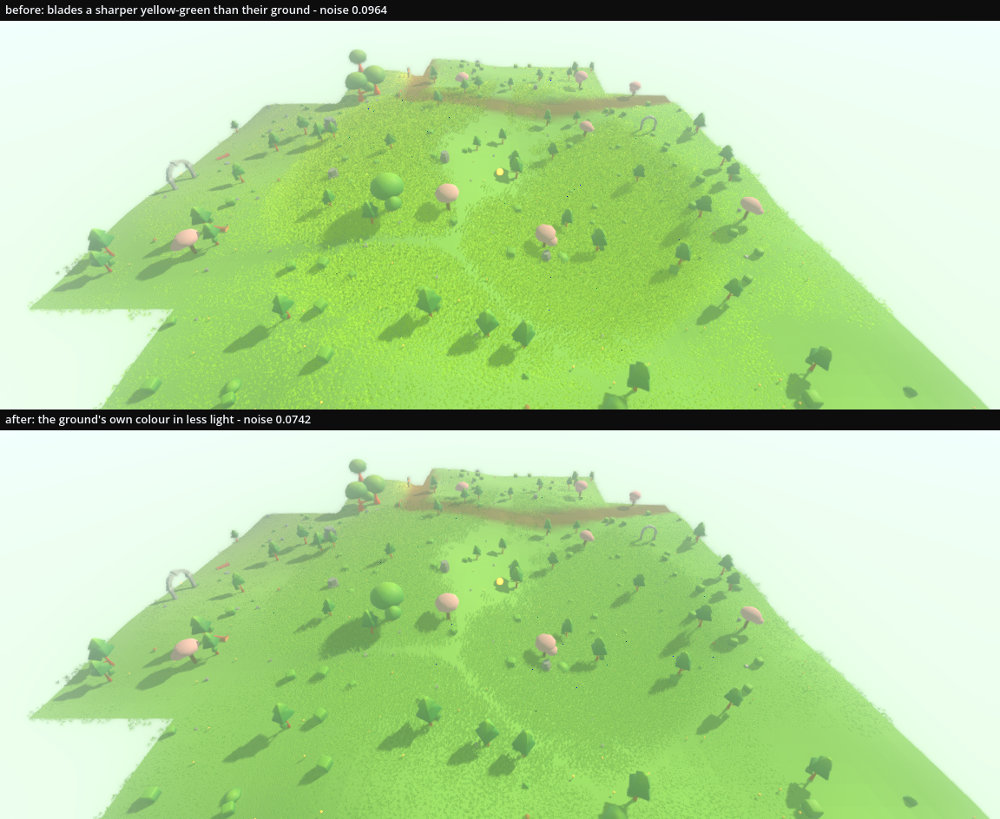

Closer, where the blades are pixels rather than a texture — the same paused frame
from the same camera:

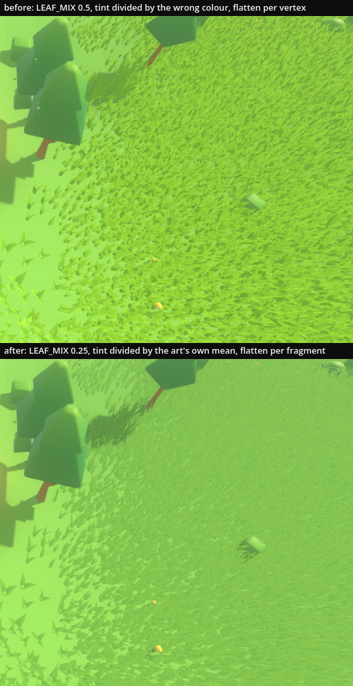

### 10.7 Grass is still grass, and still the biome's

Pulling a blade towards the ground it stands on could have flattened the biomes
into one colour. It does not, because the ground colour is itself the biome's,
and the quarter that is left of the foliage tint still pulls each biome its own
way. Measured with the same tool at three places, the grass departs from its
ground differently in each:

| place | biome | red | green | blue |
| --- | --- | ---: | ---: | ---: |
| (228, −60) | meadow | −7.9% | −6.2% | −8.9% |
| (−400, −72) | meadow into blossom grove | **+7.4%** | −0.3% | +1.6% |
| (−216, −504) | twilight marsh | **−15.3%** | −8.8% | −7.3% |

In the meadow the grass is its ground in less light. On the edge of the blossom
grove it is warmer than its ground — the pink foliage tint pulling red up 7.4%
while green holds — and in the twilight marsh it is cooler, red falling twice as
far as blue. The biome still decides which way the grass leans; what it no longer
does is lean the same way, hard, everywhere.

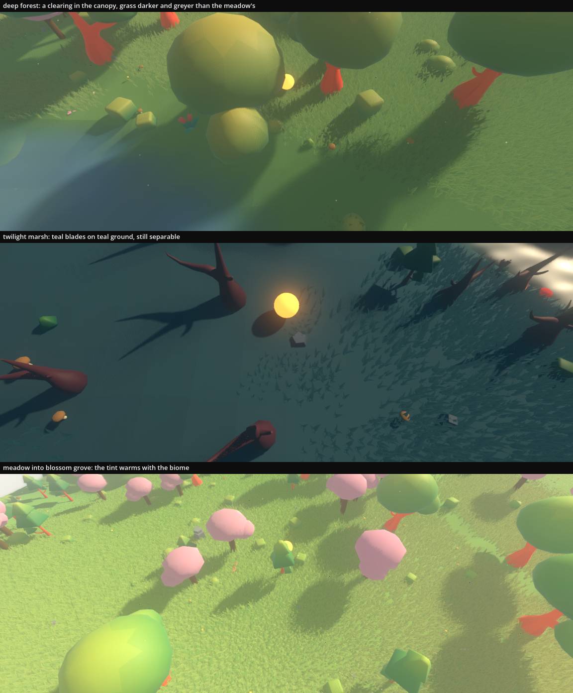

### 10.8 Nothing in the world moved

`sim/` is byte-identical: the sha256 over every file under it is
`099401ab934e1623599157b42829e4a718fc3b10a2aee95bf4328a64c65a9572` before this
work and after it. The headless world fingerprint on seed 1234 over 100 ticks is
`a6aa8e5776ebfe8c` before and after, and the same run reports `assets
render-scripts found=9 loaded=0`. All nineteen suites pass, and the layering and
asset checks still pass.

---

## Reproducing everything here

All captures run under a virtual screen (`xvfb-run`), except the mask maps, which
need no display at all.

**"Before" means two different things in this document, and they are labelled.**
In §4 it is the same code with `GrassLayer.PATCH_COPIES` set to 1 and `PATCH_SPAN`
to 0 — the single-tuft unit exactly: one placement at the origin, one root at
(0, 0), no reach to keep clear of anything. It reproduces the earlier build's
counts to the instance: 8 667 / 6 342 / 266 364 at (228, −60). In §5 it is the
code as §4 left it — the patch of twelve, but with `foliage_density` for coverage
and no clearing mask — and it likewise reproduces §4's shipped counts to the
instance: 8 667 over 30 chunks at (228, −60), 6 662 over 26 at (−232, −224),
5 940 over 29 at (96, −240).

```
# §5's cost and coverage tables, run once as shipped and once on the code of §4
xvfb-run -a ./tools/measure_grass.sh --seed 1234 --start 228 -60
xvfb-run -a ./tools/measure_grass.sh --seed 1234 --start -232 -224
xvfb-run -a ./tools/measure_grass.sh --seed 1234 --start 96 -240
xvfb-run -a ./tools/measure_grass.sh --seed 1234 --start -512 -640

# §5's mask maps: no shell, no display -- the mask is arithmetic
./tools/grass_mask_map.sh --seed 1234 --at 228 -60 --span 240 --side 640 \
    --out "$PWD/reports/assets/grass-mask-meadow.png"
./tools/grass_mask_map.sh --seed 1234 --at 0 0 --span 900 --side 640 \
    --out "$PWD/reports/assets/grass-mask-wide.png"

# §5's frames, each taken twice, once on each code
xvfb-run -a ./run_render.sh --seed 1234 --start 228 -60 --paused \
    --screenshot "$PWD/reports/assets/grass-patches.png" --screenshot-frame 130
xvfb-run -a ./run_render.sh --seed 1234 --start -232 -224 --paused \
    --screenshot "$PWD/reports/assets/grass-patches-open.png" --screenshot-frame 130
xvfb-run -a ./run_render.sh --seed 1234 --start 228 -60 --paused \
    --camera 0 14 20 --aim 1.0 \
    --screenshot "$PWD/reports/assets/grass-patches-close.png" --screenshot-frame 130

# §4's cost tables, run once as shipped and once with PATCH_COPIES := 1
xvfb-run -a ./tools/measure_grass.sh --seed 1234 --start 228 -60
xvfb-run -a ./tools/measure_grass.sh --seed 1234 --start -232 -224
xvfb-run -a ./tools/measure_grass.sh --seed 1234 --start 96 -240
xvfb-run -a ./tools/measure_grass.sh --seed 1234 --start 24 -24

# §4.3, the copies sweep: PATCH_COPIES := 1, 4, 8, 12, same command each time
xvfb-run -a ./tools/measure_grass.sh --seed 1234 --start 228 -60

# the stills
xvfb-run -a ./run_render.sh --seed 1234 --start 228 -60 --paused \
    --screenshot "$PWD/reports/assets/grass-meadow.png" --screenshot-frame 130
xvfb-run -a ./run_render.sh --seed 1234 --start 228 -60 --paused \
    --camera 0 3.2 6.5 --aim 0.5 \
    --screenshot "$PWD/reports/assets/grass-blades.png" --screenshot-frame 120
xvfb-run -a ./run_render.sh --seed 1234 --start 228 -60 --paused \
    --camera 0 9 4 --aim 0 \
    --screenshot "$PWD/reports/assets/grass-parting.png" --screenshot-frame 130
xvfb-run -a ./run_render.sh --seed 1234 --start 228 -60 --paused \
    --camera 0 2.0 3.0 --aim 0.35 \
    --screenshot "$PWD/reports/assets/grass-parting-low.png" --screenshot-frame 130
xvfb-run -a ./run_render.sh --seed 1234 --start 262 -84 --paused \
    --camera 0 10 14 --aim 1.0 \
    --screenshot "$PWD/reports/assets/grass-road.png" --screenshot-frame 130

# §6's pair: the same frame with the shader's root line swapped back to
#   vec3 root = MODEL_MATRIX[3].xyz;
# and then as shipped, both at --camera 0 9 4 --aim 0

# the moving ones: frames, then ffmpeg
xvfb-run -a ./tools/grass_film.sh --out /tmp/walk --frames 36 --stride 2 --warm 60 \
    --seed 1234 --start 228 -60 --camera 0 9 6 --aim 0
xvfb-run -a ./tools/grass_film.sh --out /tmp/wind --frames 30 --stride 2 --warm 60 \
    --seed 1234 --start 228 -60 --paused --camera 0 8 14 --aim 1.2

# §9's noise number on any saved frame, and the mode table on the frame itself
./tools/measure_noise.sh /tmp/frame.png --region 250 380 800 560
xvfb-run -a ./tools/measure_aa.sh --seed 1234 --start 228 -60 --shots /tmp/shots
xvfb-run -a ./tools/measure_aa.sh --seed 1234 --start 228 -60 --no-grass \
	--modes off,msaa4,msaa4+fxaa

# §9's meadow pair and the ground under it. "Before" is the shipped code with
# --aa off, which is the project as it stood with no anti-aliasing key at all.
xvfb-run -a ./run_render.sh --seed 1234 --paused --start 228 -60 --aa off \
	--screenshot /tmp/before.png --screenshot-frame 40
xvfb-run -a ./run_render.sh --seed 1234 --paused --start 228 -60 \
	--screenshot /tmp/after.png --screenshot-frame 40
xvfb-run -a ./run_render.sh --seed 1234 --paused --start 228 -60 --no-grass \
	--screenshot /tmp/nograss.png --screenshot-frame 40
./tools/measure_noise.sh /tmp/before.png /tmp/after.png /tmp/nograss.png
xvfb-run -a ./tools/compare_strip.sh --out "$PWD/reports/assets/grass-noise-compare.png" \
	--crop 250 380 800 560 --zoom 2 \
	--panel /tmp/before.png "before: no anti-aliasing at all - noise 0.2774" \
	--panel /tmp/after.png "now: 4x multi-sampling + FXAA - noise 0.0954" \
	--panel /tmp/nograss.png "the ground alone, grass off - noise 0.0357"

# §9.5's bloom-and-depth-of-field pair, and §9.6's mirror trio. The pond beat is
# the frame that has bloom, the miniature depth of field and the mirror at once.
POND="--seed 1234 --start -2 -462 --paused --camera 19 0.33 37.6 --aim -3.5 --focus 16 --fov 40"
xvfb-run -a ./run_render.sh $POND --aa off --screenshot /tmp/pond-before.png --screenshot-frame 150
xvfb-run -a ./run_render.sh $POND --screenshot /tmp/pond-after.png --screenshot-frame 150
xvfb-run -a ./run_render.sh $POND --mirror-aa off --screenshot /tmp/pond-mirror-none.png --screenshot-frame 150
xvfb-run -a ./run_render.sh $POND --mirror-aa msaa4+fxaa --screenshot /tmp/pond-mirror-both.png --screenshot-frame 150
./tools/measure_noise.sh /tmp/pond-before.png /tmp/pond-after.png --region 200 140 640 270
./tools/measure_noise.sh /tmp/pond-before.png /tmp/pond-after.png --region 600 250 1100 380
./tools/measure_noise.sh /tmp/pond-mirror-none.png /tmp/pond-after.png /tmp/pond-mirror-both.png \
	--region 200 380 1100 600
xvfb-run -a ./tools/measure_aa.sh $POND --region 200 380 1100 600 --modes msaa4+fxaa
xvfb-run -a ./tools/measure_aa.sh $POND --region 200 380 1100 600 --modes msaa4+fxaa --mirror-aa off

# §10's stipple numbers, the mix sweeps and the flatten sweep. "Before" is this
# code with LEAF_MIX := 0.5, MAX_GAIN := 2.5, the reference back to the row's
# tint role in AssetLibrary.instanced_mesh(), and the flatten line moved from
# fragment() to the end of vertex() as
#   NORMAL = normalize(mix(NORMAL, vec3(0.0, 1.0, 0.0), 0.70));
xvfb-run -a ./tools/measure_stipple.sh --seed 1234 --start 228 -60
xvfb-run -a ./tools/measure_stipple.sh --seed 1234 --start 228 -60 \
	--mixes 0.35,0.30,0.25,0.20
# the flatten sweep: the same command with the 0.85 in the shader's fragment()
# set to 0.70 and to 1.00
xvfb-run -a ./tools/measure_stipple.sh --seed 1234 --start 228 -60

# §10.3's shading variants, and the two painted ones
xvfb-run -a ./tools/measure_blade_normals.sh --seed 1234 --start 228 -60 \
	--shots /tmp/normals

# §10.7's three biomes, same tool, one place each
xvfb-run -a ./tools/measure_stipple.sh --seed 1234 --start -216 -504 --camera 0 9 6 --aim 0
xvfb-run -a ./tools/measure_stipple.sh --seed 1234 --start -400 -72 --camera 0 16 14 --aim 1.0

# §10's frames. The user's own is the capture line from the request itself.
xvfb-run -a ./run_render.sh --seed 1234 --paused --start 228 -60 \
	--screenshot /tmp/user.png --screenshot-frame 40
xvfb-run -a ./run_render.sh --seed 1234 --paused --start 228 -60 --camera 0 9 6 --aim 0 \
	--screenshot /tmp/blades.png --screenshot-frame 130
xvfb-run -a ./run_render.sh --seed 1234 --paused --start -168 -24 --camera 0 12 12 --aim 0.6 \
	--screenshot /tmp/forest.png --screenshot-frame 130
xvfb-run -a ./run_render.sh --seed 1234 --paused --start -216 -504 --camera 0 9 6 --aim 0 \
	--screenshot /tmp/marsh.png --screenshot-frame 130
xvfb-run -a ./run_render.sh --seed 1234 --paused --start -400 -72 --camera 0 16 14 --aim 1.0 \
	--screenshot /tmp/border.png --screenshot-frame 130
./tools/measure_noise.sh /tmp/user-before.png /tmp/user.png
xvfb-run -a ./tools/compare_strip.sh --out "$PWD/reports/assets/grass-tint-user.png" \
	--crop 0 200 1152 648 \
	--panel /tmp/user-before.png "before: ..." --panel /tmp/user.png "after: ..."
xvfb-run -a ./tools/compare_strip.sh --out "$PWD/reports/assets/grass-tint-blades.png" \
	--crop 620 120 1150 610 \
	--panel /tmp/blades-before.png "before: ..." --panel /tmp/blades.png "after: ..."
xvfb-run -a ./tools/compare_strip.sh --out "$PWD/reports/assets/grass-tint-biomes.png" \
	--crop 0 180 1152 620 \
	--panel /tmp/forest.png "deep forest: ..." --panel /tmp/marsh.png "twilight marsh: ..." \
	--panel /tmp/border.png "meadow into blossom grove: ..."

# the headless guarantee and the fingerprints
./run_headless.sh --seed 1234 --ticks 100 --assets
./run_tests.sh
./run_tests.sh --layers-only
```

**The fingerprints, on the runs above.** Headless at seed 1234 over 100 ticks
reaches `final=020507a9a1d52a1e`, with `assets render-scripts found=8 loaded=0`
in the same run — the grass layer is one of those eight and none of them was
loaded. That is the *same* digest the run before §5 reached, character for
character, which is the whole point of the clearing mask living in `render/`: it
decides where grass grows and the world does not notice. It was checked by
running the command before the change and after it rather than by asserting it,
and §5 touches nothing under `sim/`.

Every one of the four places measured in §4 reaches the same world digest with
the patch as it did with the single tuft: `105a515768e15bd7` at (228, −60),
`4a1ceebdaf794247` at (−232, −224), `eef90a496204fa70` at (96, −240),
`a69741df1c68f381` at (24, −24). §5's places reach the same digests as their own
"before" runs, including `6ab557db99ddc59d` at (−512, −640) where the instance
count fell by a factor of nearly four. A run at the origin taken *before* any of
this work and one taken after all of it both reach `e578f6e0eda9d964`.

A close look at what the grass is made of — one tuft per instance, then a patch
of twelve, same seed, same place, same camera:

| one tuft per instance | a patch of twelve |
| --- | --- |
| 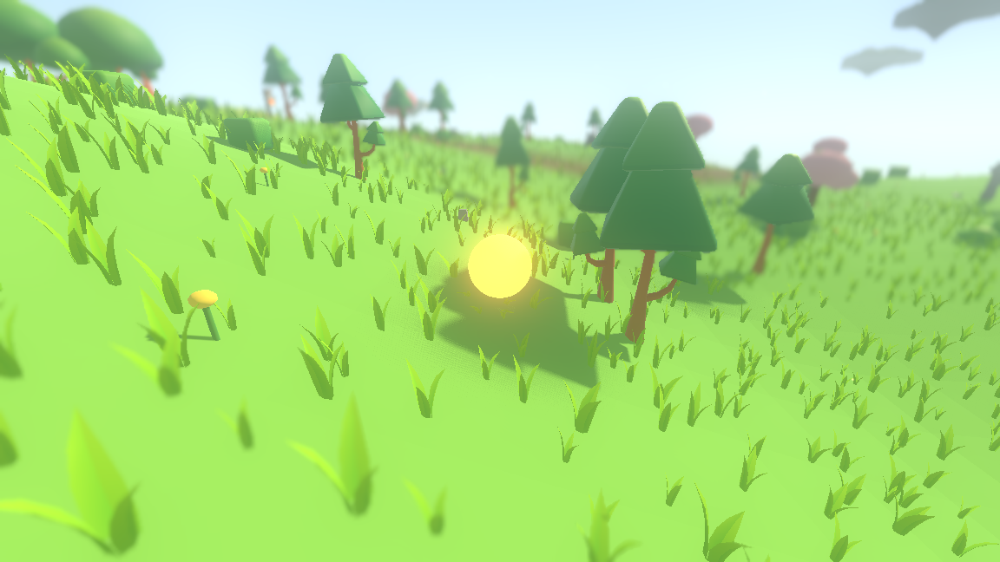 | 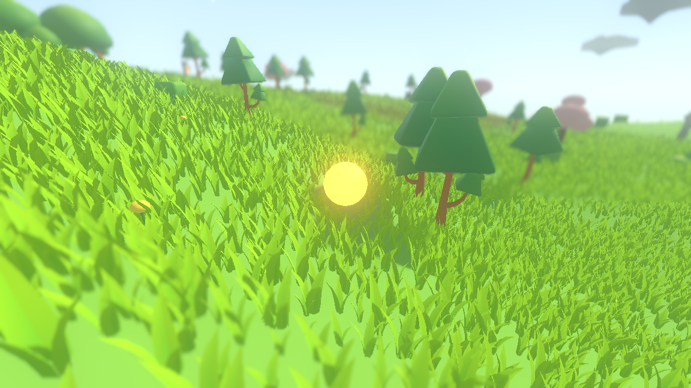 |
