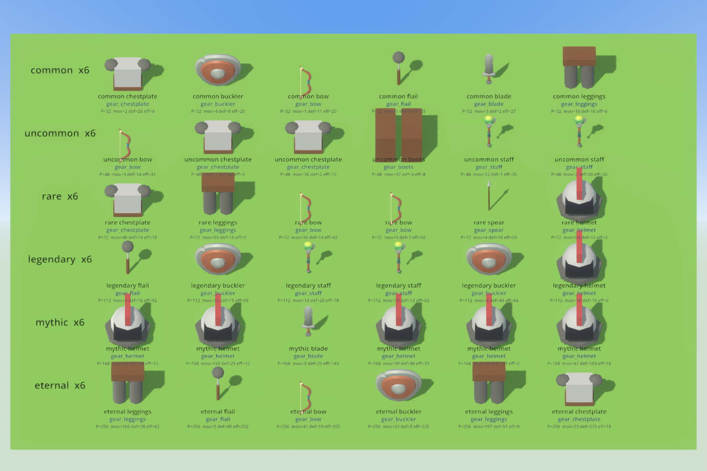
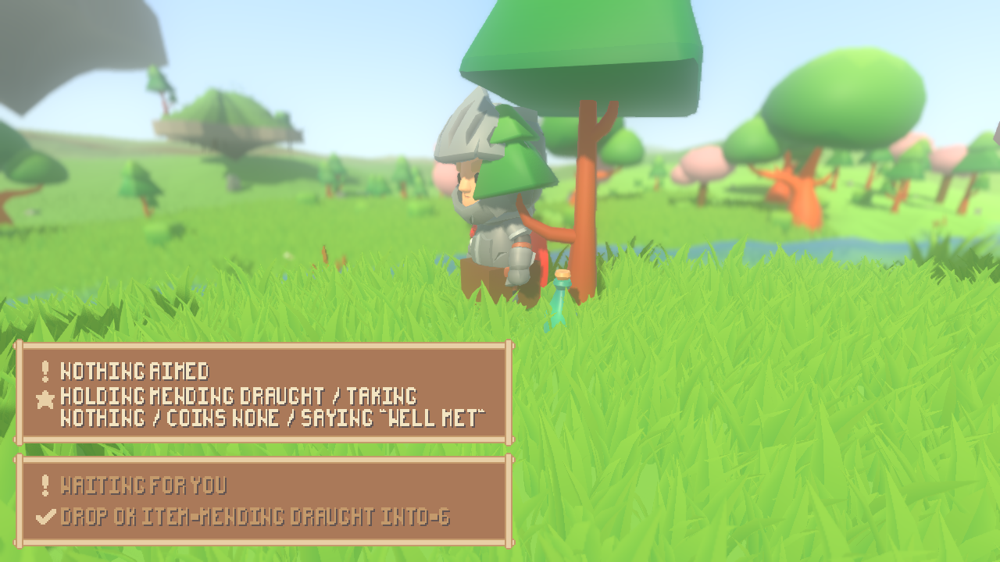
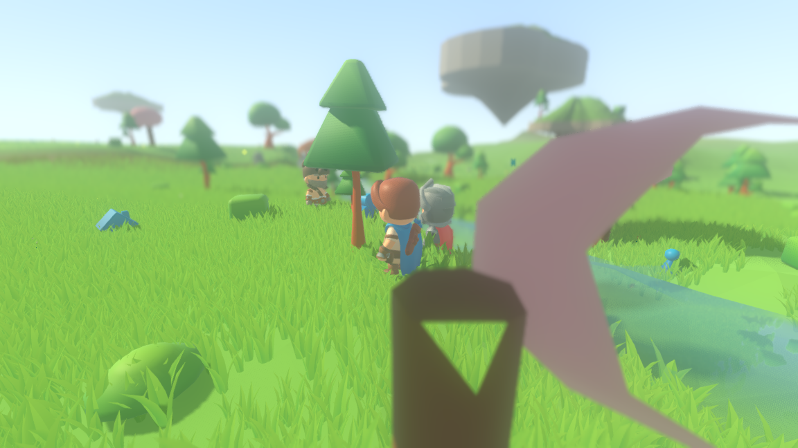
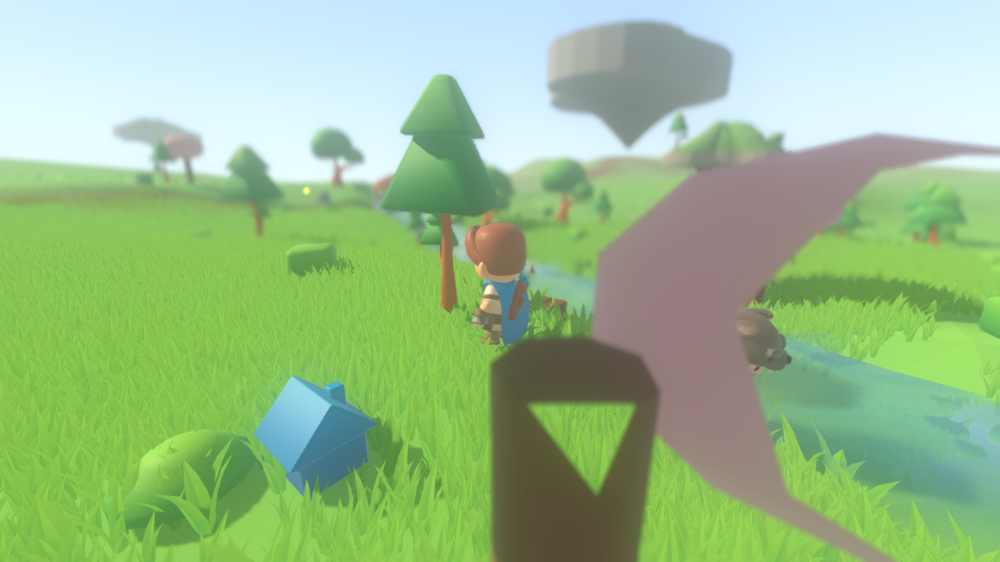

# Items you can see: a body for the forge's output

The item layer already generated gear — a rarity, a level, one power budget cut
three ways — dropped it from defeated enemies, and kept the frontier ahead of
what you could be carrying. All of it headless, and none of it visible. This is
the body a generated item gets: the forge's output resolves through the
asset-tag table to a model, an item lying on the ground is drawn where it lies,
a defeated character's drops appear where it fell, and picking one up and
dropping it back leaves the same item.

**None of the item rules moved.** The budget, the rarity multipliers, the
ability gate and the one-in-five drop probability are read here and not
re-decided; the only new arithmetic in the whole change is where the *i*-th
thing in a heap is drawn.

---

## The chain, end to end

    ItemForge  ->  Item.model  ->  ItemModel  ->  AssetTags  ->  AssetLibrary  ->  a model
    (draws a       (a name,       (the two-      (the closed    (the one table
     shape)         or "")         column table)  vocabulary)    that knows art)

Five links, and the third and fourth are the whole point of the indirection:
**nothing under `sim/` names a pack, a scene or a texture path**, which
`tests/asset_check.gd` enforces by failing the build if any file under `sim/`
ever does. The simulation says `gear_blade`; which model that is lives in one
row of `render/asset_library.gd`.

| file | layer | what it added |
|---|---|---|
| `sim/asset_tags.gd` | sim | a `gear` category: thirteen names, no models |
| `sim/item_model.gd` | sim | the two-column table from a shape to a name |
| `sim/item.gd` | sim | one field, `model`: the name an item goes by |
| `sim/item_forge.gd` | sim | writes that field from the shape it drew |
| `sim/action_scene.gd` | sim | a defeat leaves a pile where the body was |
| `sim/combatant_roster.gd` | sim | the snapshot carries what is on the ground |
| `render/ground_items.gd` | render | where each thing in a heap is drawn, and the fallback |
| `render/main.gd` | render | one drawable per item, at the height of the ground |
| `render/item_sheet.gd` | render | the contact sheet below |

### Why the item carries a name and the slot does not decide it

An item's *slot* almost answers the question — a boot is boot-shaped whoever
made it — but it cannot answer it for anything held: a blade, a bow, a staff and
a buckler all sit in the same hand. So the forge, which is the one place a shape
is drawn, writes the name onto the item, and `ItemModel.of()` asks three
questions in order: what the item says it is, then what its slot implies, then
nothing. The third answer is a real answer and is dealt with below.

---

## Every rarity tier, with the name each item resolved through

Six items per tier, all forged at level 8 so a row-to-row difference is a
difference of *tier* and not of level. Every item on the sheet is one the forge
really produced at seed 20260905 — the forge draws its own rarity, so the
eternal row is rare gear and not a common item relabelled.

    ./run_item_sheet.sh --screenshot items.png



What the picture is for: the budget line under each item is what the tier bought
(`P = r(rarity) x level`, from 32 at common to 256 at eternal), and the blue line
is the name it went through. A tier is not a different *shape* — an eternal bow
is a bow — so what a tier looks like is exactly this: the same silhouettes with
eight times the numbers under them at the top. That is the design's own claim
about rarity, and this is the first place it can be judged rather than read.

---

## The gear table: five models, seven placeholders

> **Superseded.** Nine of thirteen names are on a pack model now, and a
> thirteenth name was added. [reports/gear-models.md](gear-models.md) is the
> current account; the table below is what the table said when this was written.

`./run_assets.sh` is the live answer; this is what it said when this was written.

| name | drawn as |
|---|---|
| `gear_blade` | `sword_1handed.gltf` (KayKit Adventurers) |
| `gear_bow` | `bow_withString.gltf` |
| `gear_staff` | `staff.gltf` |
| `gear_buckler` | `shield_round.gltf` |
| `gear_draught` | `bottle_A_green.gltf` (KayKit Dungeon) |
| `gear_spear` | placeholder — no free pack holds a spear |
| `gear_flail` | placeholder — nor a flail |
| `gear_boots`, `gear_leggings`, `gear_chestplate`, `gear_helmet` | placeholder — no free pack holds armour off a body |
| `gear_bundle` | placeholder — see below; it is not a shape anything forges |

Across the whole catalog `./run_assets.sh` now reports **seventy-one tags,
sixty-three on an installed model and eight on their placeholder** (nine of the
thirteen `gear` names are on a model; the four armour names are not). Every row
carries its placeholder underneath either way, so a checkout without the packs
draws the coloured world rather than an empty one.

---

## The fallback, as a number

An item nobody recorded a shape for resolves to nothing. Nothing is not
drawable, and an invisible item is one a person can only pick up if they already
knew it was there — so the render layer draws it as `gear_bundle`, a wrapped
parcel, which is what an unidentified thing on the ground looks like.

The decision is the render layer's on purpose. The simulation's honest answer is
that it does not know what a wool blanket looks like; the render layer's answer
is that something has to be visible anyway.

**Of the 37 items the six shipped scenarios put in the world, 6 take the
fallback**: three brass lanterns, a wool blanket, an iron key and a silver ring.
(It was 31 out of five when this was written; the battle scenario landed after,
which is the encounter's cast counted a second time, so the total moved and the
six fallbacks did not.)
Every one of them is a hand-slot object with no gear shape — the numbers are in
`tools/ground_items_probe.sh`, and both are compared against constants in
`tests/test_ground_items.gd`, so an item added with no shape recorded fails a
test rather than quietly becoming another anonymous parcel.

---

## A pile of several, drawn where it lies

A pile in the simulation is one *position*: three things dropped at your feet
are three things at exactly your feet, because to the engine a pile is an
inventory with a place and the place is a point. Drawn literally that is one
model with two more hidden inside it.

So the items of a pile are laid out around its point on a sunflower spiral — the
*i*-th at angle $i\phi$ and radius $0.85\sqrt{i}$, with $\phi$ the golden angle.
That spiral is chosen for one property: its nearest-neighbour distance is flat.
Whether a pile holds two things or twenty, **no two of them come closer than
0.85 world units**, and the heap grows outwards instead of getting denser. The
first item sits exactly on the pile's own point, so a pile of one is drawn where
the simulation says it is and nowhere else.

Sizes are normalised to a 0.75-unit box, measured off what was actually built.
That is chosen against the *grass* rather than against the models: a tuft stands
between 0.36 and 0.78 units, and loot smaller than that is loot a person walks
past because it is inside the meadow rather than on it. It also has to be
measured rather than read off a row, because the packs do not agree on which
axis a thing is long along — the installed sword's length is its height and the
installed bow's length is its depth.

None of this reaches back. What an action can reach is the pile's own position,
which is what it always was.

One pile of eight forged items, laid out by the shell's own `spread()` and seen
from above. Items and offsets are magnified by the same factor, so the ratio
between an item and the gap to its neighbour is exactly the ratio in the world.

    ./run_item_sheet.sh --pile --screenshot pile.png


And the same thing in the world, at true scale, out of one seeded run of the
playable scenario: a person drives their character, presses **F** to turn the
ring of what they carry and **X** to put it down, four times over, and what they
dropped lies at their feet in the meadow grass.

    ./run_render.sh --scenario play --play --camera 2.5 1.7 -3.6 --aim 0.35 \
        --input "6:f,20:x,34:f,48:f,62:x,76:f,90:f,104:x" \
        --screenshot-ticks "120:pile.png"



---

## Where it fell

A defeated character's gear appears where it fell, and it appears at the
probability the item layer already applies -- `Inventory.spill_into` rolls the
verdicts `ItemDrop` has always rolled, one addressed stream per carried item, one
in five. Nothing about the rule is re-decided; what changed is that the roll now
has a floor to land on.

One seeded run of the encounter scenario, seed 1234, photographed before and
after. The amber commander is standing in the first frame and gone in the
second, and where it stood there is a pair of boots.

    xvfb-run -a ./run_render.sh --scenario encounter --camera -4 3 -5 --aim 1.2 \
        --screenshot-ticks "18:before.png,40:after.png"





What the simulation says about that moment, printed by the same probe out of the
same scenario at the same seed and the same tick, so the picture can be read as
numbers rather than counted in pixels (`./tools/ground_items_probe.sh`, section
five):

```
=== the encounter, at the tick the report photographs it ===
  seed=1234 ticks=40
    #9 pile at (-481.50, -2.72, 421.50) holding 1
    drawn common boots           as gear_boots       at (-481.50, 421.50)
```

The two frames and that transcript were re-taken against the tree that ships
today. They were first taken at `ee84eda`, where the same pile stood at
`(-478.50, 418.50)`; the fight has since drifted three units because the world
around it gained a cast (see the fingerprint note at the end), and it is still
one pair of boots on the ground where the body was.

It carried two things and one fell, which is the one-in-five rule doing what it
does. `tools/ground_items_probe.sh` prints the other seeded run -- the skirmish
-- item by item, with the stream name each verdict came off beside it, so a
verdict can be reproduced rather than believed:

```
  Corvid (#3) went down on tick 125 carrying 2
    kept    common boots             gear_boots     drop:fallen#3#0:common boots
    DROPPED common sword             gear_blade     drop:fallen#3#1:common sword
  what is on the ground now:
    #4 pile at (-478.50, -2.11, 418.50) holding 1
    drawn common sword           as gear_blade       at (-478.50, 418.50)
```

---

## Up and down again

Read before and after rather than trusted. Every number that makes the item what
it is — rarity, level, budget, each axis, and every effect with what it cost — is
`Item.line()`, and the name it is drawn under is read beside it.

```
  on the ground   common armour boots L5 P=20 mov=4 def=11 eff=5 con [blink:5] common boots
  drawn as        gear_boots
  pick up         pick_up ok item=common boots from=2
    carried       common armour boots L5 P=20 mov=4 def=11 eff=5 con [blink:5] common boots
  drop            drop ok item=common boots into=3
    on the ground common armour boots L5 P=20 mov=4 def=11 eff=5 con [blink:5] common boots
    drawn as      gear_boots
    same object   yes
```

Both journeys go through `Inventory.transfer` -- the same call a gift and a
purchase go through -- so nothing is copied, rebuilt or re-forged, and the last
line says so: the thing on the ground at the end is the same object that was on
the ground at the start.

---

## What is checked

`tests/test_ground_items.gd`, in the suite: 2508 checks.

1. Every name the table can hand out is a catalog tag filed under `gear`, has a
   row in the render layer's table, and builds something with meshes in it.
2. Over 400 sources and both item kinds, every forged item resolves to a name,
   carries the name it resolves to, and all six rarity tiers and all ten shapes
   turn up.
3. An item with no shape recorded resolves to nothing and is drawn as the
   fallback; a named one is not.
4. The shipped scenarios hold exactly 37 items and exactly 6 of them fall
   back.
5. For piles of 1, 2, 3, 5, 8, 13 and 24, no two things land closer than the
   spacing, the heap stays inside $0.85\sqrt{n}$, and the first thing is at the
   pile's own point.
6. One seeded run of the skirmish: the stranger goes down, and what is on the
   ground is exactly what `ItemDrop` says fell — asked of the drop layer with the
   same seed and the same kill label, never rolled a second time.
7. An item picked up and dropped back is the same item by every number and is
   the same object.

---

## The structure checks, and the fingerprint

`./run_tests.sh --layers-only` runs the checks that keep the layers apart. There
were two when this work item was planned; there are four now, and all four pass:

```
layer check:      OK -- res://sim references nothing in the render layer
combat check:     OK -- res://render draws the fight and holds none of it
interface check:  OK -- res://render/ui names its art through sprout_pack.gd alone
asset check:      OK -- res://sim names asset tags and no asset
```

The fourth is the one this change is answerable to: it fails the build if any
file under `sim/` ever names a pack, a scene or a texture path.

### The fingerprint

The world fingerprint is the digest of a hundred ticks of the seed-1234 world.
**This change did not move it, and something after it did.** Measured commit by
commit in a worktree, one run of `./run_headless.sh --seed 1234 --ticks 100` per
checkout:

| commit | what it was | fingerprint |
|---|---|---|
| `09764d8` | the commit before this one | `baac1b9efedf472a` |
| `ee84eda` | **this work item** | `baac1b9efedf472a` |
| `6d5c44a` | enemies in the running game | `32656f55cc5eeb1c` |
| `8920039` | a fight a person plays | `32656f55cc5eeb1c` |
| `82b750d` | who owns a point | `32656f55cc5eeb1c` |
| `fe83708` | gear drawn from the packs | `32656f55cc5eeb1c` |
| `7eefecb` | a blow the render layer can draw | `32656f55cc5eeb1c` |
| `bd014e0` | today's HEAD | `32656f55cc5eeb1c` |

**The reason it moved, and where:** at `6d5c44a`, the commit that made enemies
stream into the running world. The tick-100 census either side of it is
identical in every terrain term and differs in exactly one:

```
ee84eda  chunks=39 islands=12 villages=0 roads=4 props=598 cover=35 cast=3 ...
6d5c44a  chunks=39 islands=12 villages=0 roads=4 props=598 cover=35 cast=5 ...
```

Same ground, same islands, same roads, same 598 props, same 35 pieces of cover —
two more characters standing in it, which is what the enemy streamer was for.
Nothing under the item layer or the render layer touched the world's generation,
and the fingerprint has not moved since.
