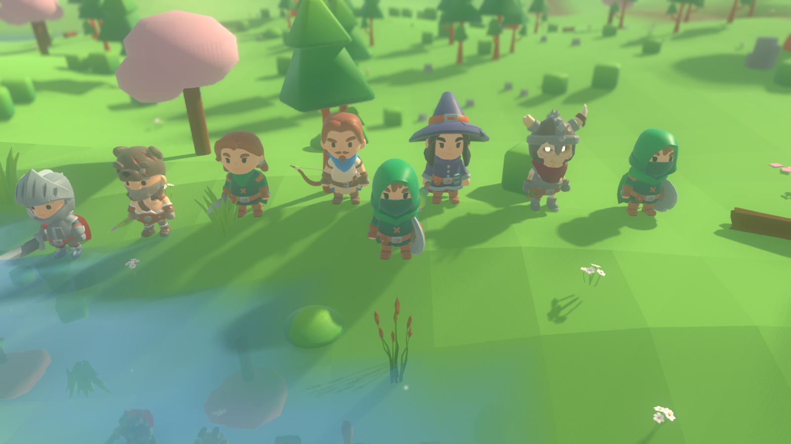
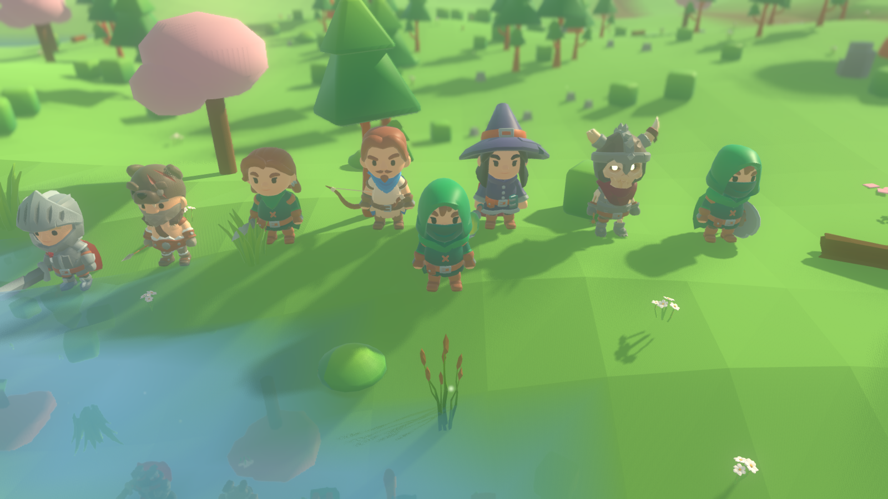
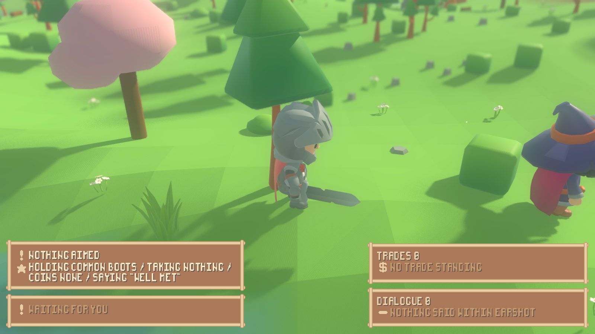
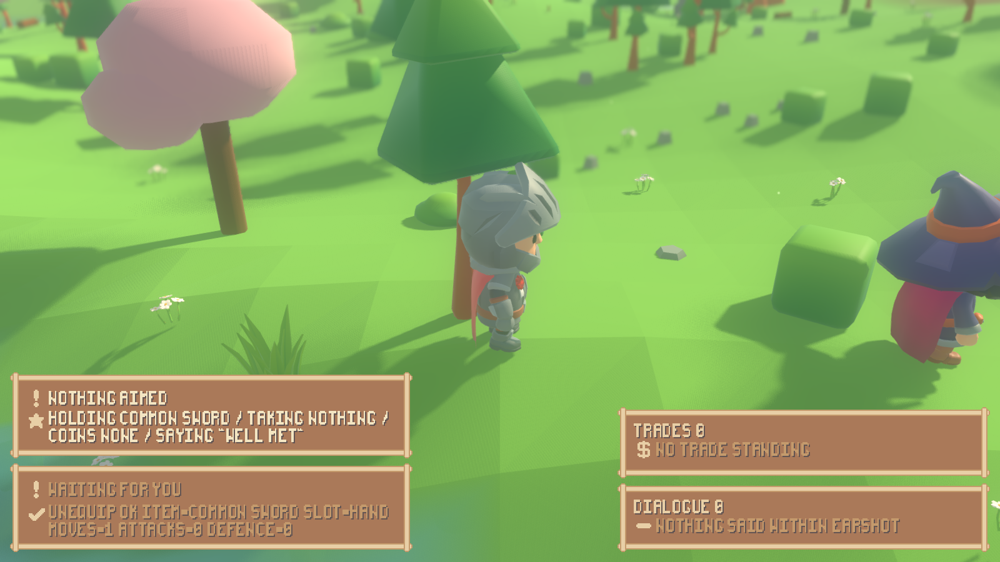
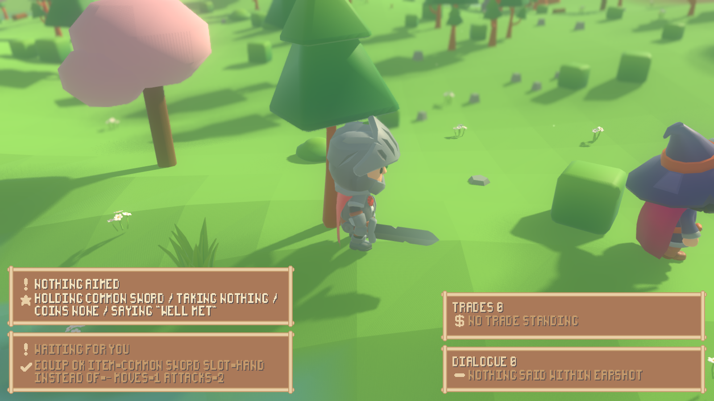

# What a character has equipped, in its hands

The two bone attachments `render/character_view.gd` has followed `handslot.l`
and `handslot.r` with since the character phase finally hold something. The
simulation snapshot now says which catalog name is equipped in which slot, and
the view hangs that name's model in the right hand -- or, for a shield, on the
left arm -- swapping it the moment the snapshot changes and holding no copy of
any of it between frames.

## The seam, end to end

One new key per piece row, and one new rule in the view:

* **`sim/combatant_roster.gd::equipped_tags()`** -- for each occupied slot of a
  combatant's inventory, the catalog name `ItemModel` resolves its item to.
  The same rule the ground rows follow: a tag the simulation already holds
  (`gear_blade`, `gear_buckler`), never a path, never a model. A minion, which
  carries no inventory, reports `{}`. The row's `equipped` travels out through
  the same `snapshot()` everything else does.
* **`render/combat_diorama.gd`** passes `equipped` through into the `state`
  dictionary untouched.
* **`render/character_view.gd::held_in_hands()`** -- a pure function beside
  `clip_for()`: the hand slot's tag goes in the right hand, a shield tag
  (`SHIELD_TAGS`) on the left arm, worn armour in no hand at all. `apply()`
  calls `_hold()` with that answer on every frame, before the early returns, so
  a character whose clip did not change still swaps what it is holding.
* **`_hold()`** empties any socket that no longer matches and mounts
  `AssetLibrary.build(tag)` into the one that should. What a socket holds is
  read off the socket itself (`held_tag()`, off a metadata name on the mounted
  node) -- the view gained no member for any of it.

## Scale and orientation, measured

`./tools/measure_held.sh` (new) measures both halves; the numbers are in the
note above `CharacterView.SHIELD_TAGS` and re-checked by the suite:

* The slot bones sit identically on every character measured (knight, mage,
  rogue): T-pose origin (±0.883, 1.049, 0), basis x→(−1,0,0), y→(0,0,1),
  z→(0,1,0). The socket's own +Y is the character's forward, its +Z the
  character's up.
* Every held model is authored in exactly that frame, grip at the model
  origin, and the packs indeed disagree on the axis: the blade lies along +Y
  spanning −0.366..1.409, the dagger −0.225..0.981, the spear (mistage FBX)
  −0.548..0.915, the staff −0.900..1.254, the flail (mistage FBX)
  −0.399..0.704 -- while the bow lies along Z (−0.992..0.992), which the
  socket's basis turns upright, and the buckler is an 0.883-unit disc in XY
  with its boss out at +Z 0.187.
* Sizes are the artists' own, 0.88--2.16 units against the rig's 2.5-unit
  characters, all in one order.

So the mount is the **identity transform**, and that is a measured conclusion,
not an assumption. `tests/test_held_items.gd::_the_measured_conventions_still_hold`
re-measures every tag at test time: a repointed row that broke the convention
(wrong long axis, grip away from the origin, more model behind the grip than in
front, a size out of the rig's order) fails the build with the number in the
message.

## The armoury

A new shell scenario, `--scenario armoury` (`sim/scripted_armoury.gd`): seven
commanders in a line on the encounter's measured meadow, one forged weapon per
catalogue shape -- sword, spear, dagger, bow, staff, flail, shield -- and one
more, Hazel, who starts with a sword in hand and a shield in the pack and
changes gear on a tick schedule **through the engine**: `Action.equip` and
`Action.unequip` on the world's own control loop, the same calls a person's
key presses become. Everyone is enrolled into one band, so the engagement rule
has nobody to pair and the stage just stands there being photographed.

`./tools/held_items.sh` (new) is the headless walkthrough: it steps that world
and drives a real `CharacterView` per commander off
`CombatDiorama.placements()` -- the shell's own reading of the snapshot -- and
prints both ends of the seam. The full table is
`reports/held-items-evidence.txt`; the changer's timeline:

```
  t=1   hand slot gear_blade     right socket gear_blade     left socket -
  t=16  hand slot gear_buckler   right socket -              left socket gear_buckler
  t=34  hand slot gear_blade     right socket gear_blade     left socket -
  t=51  hand slot -              right socket -              left socket -
```

Equip, swap, swap back, unequip: the socket follows the snapshot on the tick
it changes, and nothing is ever left behind (the right socket empties on the
very line the left one fills). Two runs of the tool are byte-identical.

## Frames from the running game

All from the built shell under xvfb, seed 1234, photographed at named ticks of
one run each. `--no-grass` because the meadow's tuft height (0.36--0.78) hides
a hand-hung weapon; it changes the picture and nothing about the world.

    xvfb-run -a "$GODOT" --path . --resolution 1600x900 --fixed-fps 30 -- \
      --seed 1234 --scenario armoury \
      --camera 0 5.5 9 --aim 0.8 --fov 50 --focus 10 --no-grass \
      --screenshot-ticks "6:...sword.png,24:...shield.png,42:...back.png,62:...bare.png"







And the person-driven half: the play stage, `--play`, with the sword taken out
of Fen's hand and put back by key presses (`f` twice to pick the sword out of
the carrying ring, `2` to unequip, `1` to equip -- the same input path a
person's keyboard feeds):

    xvfb-run -a "$GODOT" --path . --resolution 1600x900 --fixed-fps 30 -- \
      --seed 1234 --scenario play --play --journal \
      --camera 0 5 8 --aim 0.9 --fov 45 --focus 9 --no-grass \
      --input "4:f,6:f,8:2,18:1" \
      --screenshot-ticks "5:...sword.png,15:...bare.png,27:...back.png"







One code path draws both: a person's Fen and the scripted Hazel are rows out
of the same `CombatantRoster.snapshot()`, placed by the same
`CombatDiorama.placements()`, applied to the same `CharacterView.apply()` --
`render/main.gd::_sync_combat` has no branch on who decides.

## No copy on the render side

Proved the way the combat readout was
(`tests/test_held_items.gd::_the_view_keeps_no_copy`): a view that has been
through a sword, a flail and a shield agrees socket-for-socket with a fresh
view handed only the final state, and the view has no field named `equipped`,
`held`, `inventory`, `weapon`, `shield` or `slots` -- what a hand holds is
read off the socket node itself.

## What moved, what did not

* The seed-1234 world fingerprint is unmoved:
  `./run_headless.sh --seed 1234 --ticks 100` prints
  `final=32656f55cc5eeb1c` before and after, the same value the strike-record
  work quoted. The `equipped` key rides the snapshot, which is outside every
  fingerprint, and the equipment rules did not change.
* `tests/test_ground_items.gd::SHIPPED_ITEMS` moved 37 → 46, because the
  armoury ships nine items (seven rack weapons, Hazel's sword and shield);
  fallbacks stay 6. That is the one checked-in number the scenario moves.
* All four structure checks pass (`./run_tests.sh --layers-only`): sim/ still
  names tags and no asset, render still draws the fight and holds none of it.

## Boundaries kept

Worn armour stays off the body: the snapshot carries the worn slots' tags too
(they are equipment, and the readout may want them), but `held_in_hands()`
sends them to no socket, and no second socket was built. No pack on this
machine ships a wearable piece that mounts to a bone (measured in
`reports/gear-models.md`), so there is no finding to file beyond what that
report already says.
