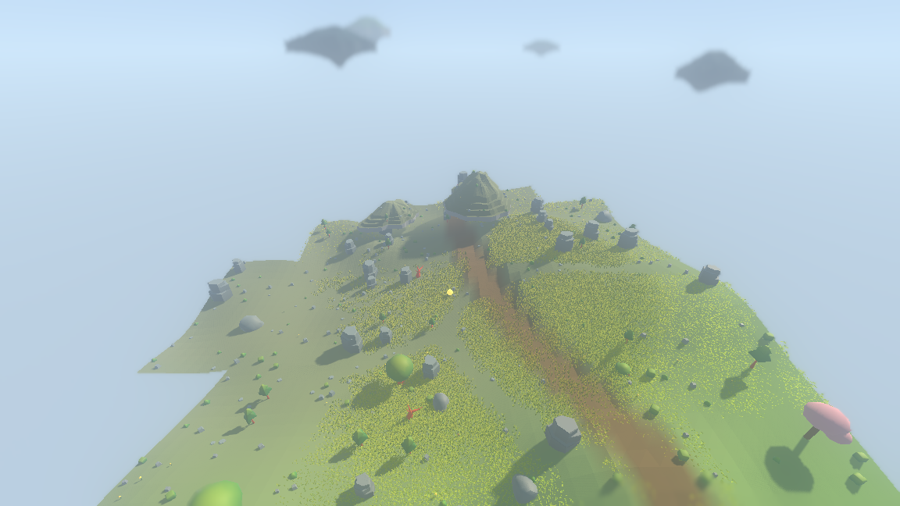
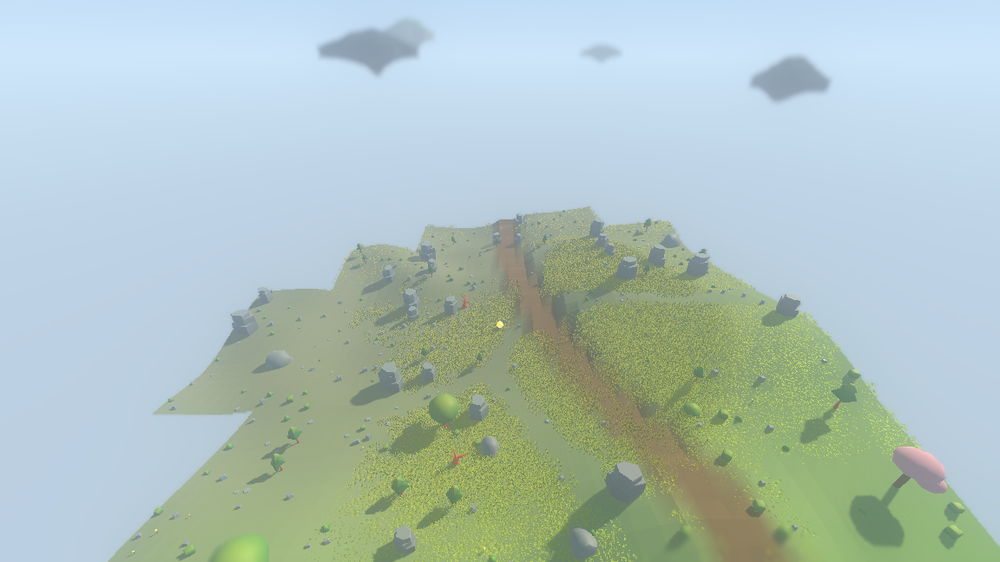
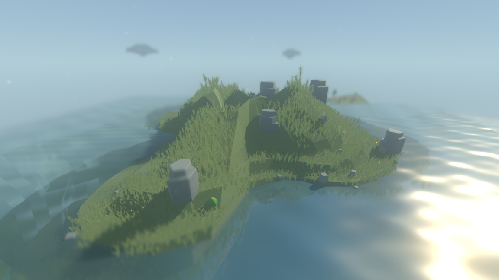
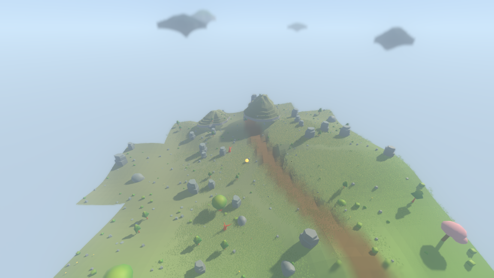
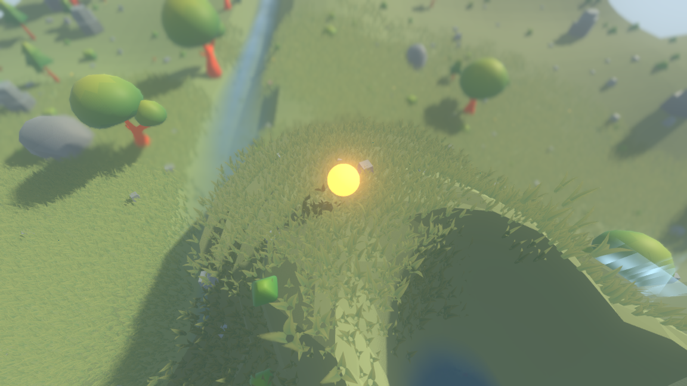
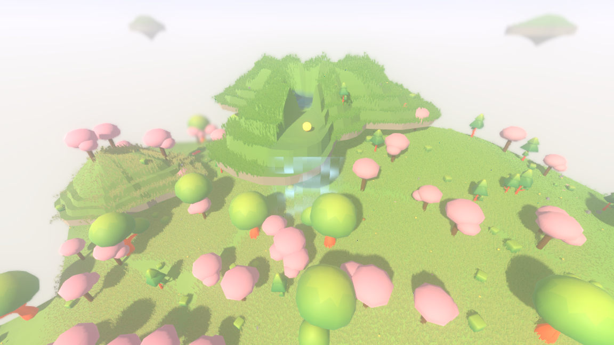

# Floating islands: the aerial layer

The fourth layer of the generation stack, over the ground's height, the biomes
and the water. It lifts chunks of land into the air above the ground plane, each
one a small diorama with a torn outline, a terraced top, a cliff at the rim, a
keel of uneven spurs underneath, and the colours of the biome below it. Its top
is scattered with the flora and stone that biome grows, some of them hold a pond
in a basin that spills over the rim as a waterfall, and roots hang off the keel.
Islands are ground: you stand on them, the air off their edge is a hole in the
world, and so is the water in a basin.

Section 13 of the design leaves three things open about this layer — the
altitude band, the island density, and how traversal reaches an island. All
three are decided here, and the reasoning is the point of this document. The
short version: **the three are one decision, not three**, because an island's
height is what makes it reachable or not, and how many are reachable is what
makes the layer routine or decorative.

---

## The decision

> An aerial island is placed **one hop above whatever it overhangs**, and what it
> overhangs need not be the ground. The lower storey overhangs the land; the
> upper storey overhangs the lower storey. Traversal is therefore **walking**:
> you step up onto an island where its rim comes within a hop of what is under
> it, which the placement rule guarantees happens somewhere on every island. No
> jump check, no bridge, no lift.

The measured consequence, over four seeds, for the walkable bands:

| seed | lower / upper / far-sky per million units² | step up (min / median / max) | keel clearance (min / median) | height above the ground (min / median / max) |
|------|------|------|------|------|
| 1234 | 41.0 / 15.3 / 9.7 | 1.81 / 2.50 / 2.90 | 0.69 / 1.24 | 4.97 / 7.61 / 13.01 |
| 7    | 33.3 / 13.2 / 9.0 | 1.82 / 2.38 / 2.89 | 0.77 / 1.17 | 5.25 / 7.76 / 17.41 |
| 4321 | 31.9 / 13.9 / 9.7 | 1.85 / 2.50 / 2.89 | 0.79 / 1.25 | 5.12 / 7.72 / 12.34 |
| 33   | 42.4 / 13.9 / 10.4 | 1.81 / 2.42 / 2.88 | 0.66 / 1.20 | 5.02 / 7.64 / 14.83 |

The step up is the number the reachability rule is written in, and it has not
moved across three reshapings of this layer: 1.81 at the lowest, 2.90 at the
highest, against a hop of 3.00. What has moved is the last column — the top
surface now stands a median 7.6 units over the land rather than 6.7, because the
relief on top of an island grew while its *rim* stayed exactly one hop up.

Every number above comes out of one command, which counts and measures every
island in a 1200×1200 square of the world:

```
./run_headless.sh --seed 1234 --ticks 0 --islands
```


*Seed 1234, the observer standing on the ridge at (−329.8, −254.1), seen from the
camera the game is played from — 42 units up, 52 back, looking down 31.6°. Two
walkable islands sit above the hill: the lower one resting a step above the ridge
it overhangs, the smaller upper one a step above that. Each has an outline with a
flat side and a notch rather than a circle, a top that climbs from a flat lip at
the rim through three terraces to an off-centre summit, and a pale cliff over a
keel that hangs further on one side than the other. Both tops carry grass, drawn
by the same layer that grows it on the ground beside them — see
[the grass on top](#the-grass-on-top-which-is-not-the-cover) for what that took
and what it costs. Behind them, four far-sky islands — no longer thin lenses with
a point underneath, but plates with thick broken edges. What this frame took, and
what it looked like before, is
[reading as land from the camera the game is played from](#reading-as-land-from-the-camera-the-game-is-played-from).

This frame is also where the pale-biome washout recorded elsewhere shows: the
observer stands in a highland/meadow blend whose fog is nearly white, so the far
half of the picture dissolves to paper. That is a biome-palette question and is
not touched here.*

---

## Why the altitude and the traversal are one question

An island has to read as floating and be routine to walk onto. Those pull
against each other: anything high enough to look airborne is too high to step
onto, and anything low enough to step onto looks like a rock resting on a hill.
Three ways out were considered.

**Jump-only.** The design's atomic action list has `jump (position)`, gated by
DEX. Making that the only way up puts the entire aerial layer behind an ability
score — a low-DEX character would never see it — and it would need vertical
movement rules on the tactical lattice, which do not exist. It also makes the
answer to "can I get up there" depend on the character rather than on the world,
which is the wrong place for it. Rejected.

**Required bridges, ladders or lifts.** This is what the design sketches for
linking islands, and it is right for *linking* them. As the only way *up*, it
fails twice: it makes the aerial layer depend on the settlement and path layer,
which is a later task and explicitly outside this one's boundaries, and it
leaves every island in the wilderness — most of them — unreachable forever.
Rejected as the sole route; bridges remain a later addition that will add links
between islands rather than the only way onto one.

**A staircase.** Taken. The tension dissolves once "floating" and "reachable"
are recognised as being about *different ground*. Floating is about the land an
island hangs **over**; reachable is about the land it hangs **nearest**. So an
island's rim goes a short step above the highest ground inside its own
footprint — you walk up onto it from the ridge it overhangs — and everywhere
else it hangs clear of whatever the land does below.

That alone gets an island about five units up, which is a hover rather than a
flight. The second half of the decision is that the same rule applies again with
the island itself as the ground: an **upper storey** is placed a hop above the
*lower island* it overlaps. Two hops from the land, an upper island's top surface
stands a median of 6.7 and up to 14.0 units above the ground with open sky under
both plates — airborne by any reading, and reached without a single check.

### The numbers this fixes

* **The hop** is `TerrainQuery.HOP_HEIGHT` = 3.0 world units — how far up
  ordinary movement carries someone in one go. The observer marker is 1.2 units
  tall, so a hop is about two and a half body-heights.
* **The step up onto an island** is drawn from `[1.8, 2.9]`, entirely below the
  hop. Measured across four seeds the largest step any island asks for is 2.90,
  the median 2.44 and the smallest 1.81. Growing the radius did not move any of
  the three.
  This is a guarantee of the placement rule, not a hope, and the island suite
  checks it by scanning 64 directions round every island's rim and failing if any
  island has no point within a hop of what is beneath it.
* **The altitude band that results** is therefore not a fixed range of heights
  above sea level but a range above the *local* ground: an island's top surface
  stands 4.5 to 14 units over the land under it, median 6.7. Absolute heights
  follow the terrain, which is what keeps an island a feature of the place it is
  in rather than a fixed ceiling drawn across the world.

### Why not simply a taller lift

Because reachability is the whole value of the layer. A band at, say, 20–30
units would look better in a single screenshot and would make islands scenery:
you would look at them and never stand on one. The design asks for islands to be
"a routine part of traversal", and that is a stronger constraint than a
silhouette. The staircase gets the silhouette back a storey at a time.

---

## What shape an island is

The first version of this layer got the placement right and the shape wrong.
Shown the rendered aerial band, the answer was that the islands looked like
flying saucers, and the code agreed: `outline_radius` was a circle with three
bounded sine lobes, `top_height_at` was a smooth $1 - r^2$ dome, and
`bottom_height_at` was a smooth $(1 - r)^{2.2}$ cone. A convex dome over a smooth
cone on a near-circular rim **is** a saucer — not a saucer by accident, a saucer
by construction, because all three surfaces were surfaces of revolution built out
of one radius. Relief of 1.1–2.9 units on a radius of 6.5–13 finished the job:
the top was a lid with a slight curve on it.

All three are now built to break that, and each stays a handful of arithmetic
because `IslandField._footprint` samples them about 150 times to place one island
and `TerrainQuery` calls them once per position asked about.

### The plan outline: a union of blobs

An island's outline is the union of **two to four overlapping blobs**. One is
centred and is 0.56 of the nominal radius; the rest are offset by 0.46–0.74 of it
and sized 0.34–0.52 of it, spread evenly round the island and then jittered off
that spacing so they do not read as a rosette. A short two-lobe crenellation of
at most 7% rides on the result, so the blob arcs do not read as arcs.

Those numbers are set by how far apart the blobs have to stand before the union
stops reading as one slightly dented disc, and the first attempt got them wrong.
At a core of 0.66 radii with the others offset 0.34–0.62, every offset blob sat
almost entirely *inside* the core and what came out was an oval. Pushing the core
down and the offsets out puts each of them mostly outside the core, so the union
is a two-to-four-lobed chunk; measured from the playing camera the deepest inward
turn of the boundary went from about a third of the widest reach to about half.
The floor of the offset range against the ceiling of the size range is what keeps
the pieces joined: the furthest an offset blob's near edge can fall from the
middle is 0.74 − 0.34 = 0.40 radii, inside the core, so no blob can float free.

The union is read **along a ray from the island's middle**: for each blob, how
far along the ray its far side is, and the furthest of those wins. Where two blob
arcs cross, the winner changes and the outline turns a corner *into* the island —
an inlet. Where one blob reaches past the others, the outline runs out and comes
back — a peninsula. A varying radius, which is what the sine lobes were, can do
neither: it is convex-ish in every direction and reads as a cookie-cutter disc.

Reading the union along a ray rather than as a true set union is a deliberate
loss. A genuine union can have a pocket the middle cannot see — a channel between
two blobs — and this construction fills those in. That is the right trade,
because a pocket the middle cannot see is a place where "how far out are you" has
no answer, and every caller needs one: `covers` is `ratio_at <= 1`, the mesher
walks rings at fixed ratios, and the placement rule bounds the keel by ratio. The
island suite checks the property directly rather than trusting the argument: over
four seeds and every island in a 7×7 block of cells, along 48 directions each,
`ratio_at` never falls going outwards and the outline is crossed exactly once.

### The top: terraces under a two-octave hill

Relief is now **55–75% of the radius** rather than a fixed 1.1–2.9 units, so a
median island rises about 9 units from its rim to its summit instead of 2. The
lift comes from two noise octaves rather than one — a coarse field about
two-thirds of the island across and a finer one an eighth of it across, with 30%
of the lift from the fine one — so the top has lumps on its hills rather than one
hump.

That sum of octaves is then **lifted off a floor**: the sample it produces lands
in $[0, 1]$, and a sample in $[0, 1]$ has a mean of a half, so an island whose
relief was *set* to a third of its radius in fact stood a **sixth** of it above
its rim, reaching the stated figure only where the noise happened to peak. The
profile is remapped into $[0.42, 1]$ instead. That fixes both halves at once: the
summit reaches most of the relief rather than half of it, and the swing between
neighbouring samples shrinks by the same factor the floor leaves, so the top gets
taller without getting locally steeper.

The outer 42% of the way in from the outline is a **staircase of three shelves**,
rising to 48% of the full relief, each a flat tread with a short riser at its
**inner** edge. Inside that the surface domes the rest of the way. From the side
an island's edge is therefore a flat lip at exactly rim height and then two or
three distinct terraces stacked back from the cliff, which is what broken ground
looks like and what a lip does not.

The riser used to sit at the *outer* edge of each shelf, so the surface began
climbing at the boundary itself. Moving it inward buys the flat lip, and the lip
is not decoration: on the combat lattice, whose cells are three units across, a
cell centre a stride inside the rim was already out of hop range of the ground
below, and whether an island could be *entered* at all came down to where the
lattice happened to fall. Two numbers had to move with it — the mesher's rings,
which have to sit at the top and bottom of every riser or the island someone
walks on and the island they see are different shapes, and the shelves' height
share, from 55% to 48%, so that a riser on the tallest island the layer builds
stays under a hop.

Two properties survive the change untouched, and both are load-bearing. The
profile is exactly zero **at** the outline, so the top meets the cliff on one
clean curve; and it never goes negative, so `rim_height` is the floor of the
whole top surface and "this island is this far above the ground" stays one number
rather than a range. Every riser is also well under `TerrainQuery.HOP_HEIGHT`, so
the terraces are walked up rather than climbed — the suite checks that no step
along any radius of any island exceeds a hop.

### The keel: spurs, not a cone

The underside still hangs by `(1 - ratio)` raised to a power, but both the depth
and the power now depend on the **direction**. A base share of 0.72 is taken up
to all of the depth on one side and down to about 0.44 on another by two lobes,
and the exponent swings between 1.7 and 3.1, so one spur is a spike and the next
is a broad shoulder. The outline's own inlets and peninsulas carry that in and
out, because the profile is written in `ratio` and `ratio` follows the outline.

The placement rule does **not** ask about direction. It bounds the keel with
`keel_profile_bound(ratio)` — the largest share any direction takes, at the
slowest taper any direction takes — because a sample of the ground under an
island is a statement about the ground and not about the direction it happened to
be taken in, and at the island's middle every direction meets, so no single
direction's profile would cover it. The bound is what the old constant profile
was, so the keel that gets placed is never deeper than the old rule would have
allowed and is usually shallower.

The far-sky band needed the same surgery for a sharper reason: a far-sky island
is only ever seen in silhouette against the sky, so its outline *is* the whole of
it. A plate one fourteenth of its width thick, under a top rising a tenth of its
width, over a smooth cone six tenths of its width deep, is a saucer seen edge-on
whatever its top surface is doing. The rim went from 0.07 to 0.20 of the radius,
the keel from 0.62 to 0.40, and the relief from 0.10–0.22 to 0.34–0.48.

### Why the islands got wider rather than lower

"Closer to the ground" turned out to be a ratio and not an altitude. The band was
already low: an island's rim goes one hop — 1.8 to 2.9 units — above the ground
it overhangs, and that has not changed. What made the old islands read as
hovering was the ratio of that height to their width. A 13-unit plate five units
up hovers; a 24-unit chunk five units up is a mesa that broke off.

So the lever pulled was the radius, from 6.5–13 to **10–24**, and the far-sky
floor came down from 34 to 24 so the sky band sits nearer the land as well. Over
the same four seeds and the same 1200×1200 square, before and after:

| | islands measured | radius (min / med / max) | height above the land (min / med / max) | radius ÷ height (min / med / max) | step up (min / med / max) | worst clearance |
|---|---|---|---|---|---|---|
| **before** | 346 | 4.16 / 9.17 / 12.99 | 3.82 / 5.62 / 16.58 | 0.32 / 1.62 / 3.00 | 1.81 / 2.46 / 2.90 | 0.72 |
| **after** | 316 | 5.78 / 14.75 / 23.98 | 4.51 / 6.73 / 13.99 | 0.48 / 2.20 / 3.99 | 1.81 / 2.44 / 2.90 | 0.61 |

Per seed, after:

| seed | islands | radius (min / med / max) | height above the land (min / med / max) | radius ÷ height (min / med / max) |
|---|---|---|---|---|
| 1234 | 83 | 5.79 / 15.53 / 23.96 | 4.56 / 6.59 / 13.26 | 0.48 / 2.22 / 3.79 |
| 7    | 71 | 6.17 / 14.91 / 23.98 | 4.60 / 6.62 / 13.59 | 0.90 / 2.20 / 3.35 |
| 4321 | 74 | 6.34 / 15.73 / 23.95 | 4.51 / 6.81 / 11.65 | 0.86 / 2.28 / 3.99 |
| 33   | 88 | 5.78 / 13.61 / 23.68 | 4.57 / 6.72 / 13.99 | 0.53 / 2.19 / 3.55 |

The radius column is the *nominal* radius — the scale the blobs are measured in.
The outline reaches further than it in some directions and less far in others;
`max_reach()` is the honest upper bound and is what every scan uses.

"Height above the land" is the island's top surface averaged over its whole
footprint, so the taller relief is inside it: the rim itself is still 1.8–2.9
units up, unchanged, and the summit is what rose. The ratio the eye reads —
how wide an island is against how far its rim stands off the land — went from
about 3.7 to about 6.

**The step up did not move.** Minimum 1.81, median 2.44, maximum 2.90 across all
four seeds, against `TerrainQuery.HOP_HEIGHT` of 3.0 — the same numbers as
before, because the reachability rule is untouched and only the proportions
changed. The island suite still scans 64 directions round every island's rim and
fails if any island has no point within a hop of what is beneath it.

### Two islands of one band may not overlap

At the old radius this was true by arithmetic and nobody had to say so. Two cells
of the 88-unit lattice put their islands at least $0.44 \times 88 = 38.7$ units
apart, and no island reached more than 16.4, so two of them could not meet. At
the new radius an island reaches up to $24 \times 1.35 = 32.4$, and two of them
can.

Overlap is not merely untidy: two plates through each other leave a stretch of
world where "what am I standing on" has two answers at once, neither of which is
the surface anyone can see. So it is now a rule. Each cell's island is hashed
into a *candidate* — a centre, a radius, a bound on its outline and a rank —
before any ground is read, and a candidate that overlaps a higher-ranked
candidate within two cells stands down. An upper storey additionally stands down
if it would lap over any lower island other than the one in its own cell; lapping
over *that* one is the staircase and is the point.

The rule is decided from hashes alone, which is what makes it safe. Building a
neighbour to find out whether it is in the way would mean building *its*
neighbours first, and so on outwards forever; and any rule that depends on the
order cells are asked in would break the one thing this layer promises. The price
is that a candidate can be crowded out by a neighbour the ground then refuses to
place, which is a deterministic loss rather than an inconsistency.

Measured over four seeds, the suite finds no overlapping pair in any 9×9 block of
cells of either walkable band.

### What the wider islands cost

Two things, both measured.

**Density had to come down to keep the spacing.** Left alone, doubling the radius
raised the walkable count from about 60 to about 80 islands per million square
units, which is an archipelago rather than a sparse layer. `AERIAL_CHANCE` went
from 0.66 to 0.48 to hold it: the measured walkable density is now 49–61 per
million against 46–72 before, a mean of 55 against 60, which is a mean spacing of
**135 world units against 129**. So islands sit about as far apart as they did
and are twice as wide — which is the whole point, since the gap between one
island's edge and the next narrowed from about 110 units to about 97.

**Villages got scarcer.** The settlement layer refuses any site with a walkable
island overhead, and the sky an island covers grew with its radius. Over the six
seeds and 25 settlement cells each that the window-glow suite samples, the world
held 39 villages before this change and 21 after — a little under half. Nothing
in the settlement layer was touched; its own rule simply fires more often. Worth
saying plainly because it is a real change to the world, and worth revisiting in
the settlement layer rather than here: `_clear_overhead` pads its question by the
flat `AERIAL_RADIUS_MAX` to catch an upper storey standing beside a lower island,
and the correct padding for the largest islands is now about 31 units rather than
24 — so the test is simultaneously too coarse for small islands and slightly too
short for the biggest.

### The shape functions stayed cheap

Measured with `./run_bench.sh --seed 1234`, which times building islands in a
fresh field (so no memo can answer) and looking one up per position, before and
after the change:

| | lower storey, µs per lattice cell | upper storey, µs per lattice cell | µs per island lookup at a position |
|---|---|---|---|
| **before the shape rework** | 2611 | 1078 | 22.8 |
| **after it** | 2288 | 1201 | 24.0 |
| **after the camera pass below** | 2191 | 1220 | 24.1 |

The lower storey got cheaper only because `AERIAL_CHANCE` fell, so more cells are
refused by their first hash roll; the upper storey's chance is unchanged and its
+11% is the honest cost of the new arithmetic plus the crowding rule. The
per-position lookup rose 5% while the number of sampled positions actually over
an island rose from 23 to 56 of 1500 — bigger islands mean more positions take
the expensive covered path, and the path itself barely moved.

One thing that did not stay cheap, and was reverted: an early version had the
upper storey read the height of *every* nearby lower island rather than only the
one in its own cell. That is 20× slower on a cold field, because placing one
upper island then means building all the lower islands around it first. The
hashed crowding rule above gets the same guarantee for the price of a few hashes.

## Reading as land from the camera the game is played from

The reshaping above was judged close up, and close up it worked. From the camera
the game is actually played from it did not, and the phase report said so: the
two low plates still read *somewhat round and lid-like*. This section closes that
gap, and the first thing it needs is for "from the playing camera" to stop being
an adjective.

### What the playing camera is, in numbers

The render shell puts the camera at a fixed offset behind and above the character
and aims it a little over their head. Read off its own constants:

| | |
|---|---|
| offset from the character | 52 units back, 42 up |
| distance | 66.84 units |
| aim | 10 units above the character's feet |
| pitch | **31.61° below horizontal** |
| field of view | 75° vertical, 107.51° horizontal |
| frame | 1152 × 648 |
| scale | 10.72 px per horizontal degree, **8.64 px per vertical degree** |

Two of those lines together are the whole problem. A downward view foreshortens
height by the cosine of the pitch — 0.852 — and the frame is wider than it is
tall, so a degree measured up the frame is worth only 8.64/10.72 = 0.806 of a
degree measured across it. Multiplied, **a world unit of height draws 0.686 of
what a world unit of width draws.** An island whose summit stood a third of its
radius above its rim therefore drew a hill one *tenth* of its own width tall. A
lid, measured.

Every frame in this section is taken from that camera, with the observer standing
on the same highland ridge at (−329.8, −254.1) in seed 1234, and every number is
measured with the tool that reads the same constants:

```
./tools/measure_island_read.sh --seed 1234 --start -329.8 -254.1
```

### Before and after, from that camera


*Before. The near island is 88 units off, 158 pixels wide, and its summit stands
23 pixels above its rim. The rings on it are the shelves seen from above, which
at that height:width ratio read as the tiers of a lid rather than as terraces.*


*After. Same camera, same ridge, same two islands. The near one is 140 pixels
wide and its summit stands 39 pixels above its rim; the shelves have become
benches cut into a hillside, and the outline has a straight side and a bay.*

The four islands in that frame, measured before and after:

| island | distance | width, px | summit ÷ width | boundary raggedness | deepest bay | cliff, px |
|---|---|---|---|---|---|---|
| lower (−4,−4) | 88 | 158 → 140 | **0.149 → 0.280** | 0.101 → 0.173 | 0.324 → 0.460 | 5.8 → 5.7 |
| upper (−4,−4) | 95 | 96 → 90 | **0.116 → 0.233** | 0.093 → 0.190 | 0.348 → 0.483 | 5.3 → 5.4 |
| lower (−5,−4) | 119 | 172 → 166 | **0.103 → 0.195** | 0.127 → 0.210 | 0.371 → 0.491 | 4.3 → 4.3 |
| lower (−5,−5) | 190 | 78 → 70 | **0.142 → 0.264** | 0.092 → 0.164 | 0.308 → 0.440 | 2.7 → 2.7 |

*Summit ÷ width* is how many pixels the island's high point stands above its rim,
foreshortened by the camera, over how many pixels wide the island is — the number
that says "hill" or "lid". *Boundary raggedness* is the outline's mean absolute
departure from the circle of its own mean reach, as a share of that reach.
*Deepest bay* is one minus the smallest reach over the largest.

### The levers that worked

**Relief relative to radius.** Two changes, and the second matters more than the
first. The share went from 35–50% of the radius to 55–75%, and the noise the
profile is multiplied by was remapped from $[0, 1]$ to $[0.42, 1]$ so that an
island actually stands in most of the relief it was given rather than half of it.
On their own, with the outline untouched, the two took *summit ÷ width* from
0.10–0.15 to **0.19–0.25** — most of the whole change, and the largest single
contribution of any lever here. The rest of the way to 0.20–0.28 came from the
blob lever narrowing an island's mean reach slightly while the summit stayed
where it was. The remap also *lowers* the local gradient — it shrinks the swing
between neighbouring samples by the same factor the floor leaves — which is what
let the top get taller without any step of it breaking the hop rule.

**The rim shelves, made visible.** The shelves were already in the shape functions
and were not in the geometry: the mesher drew each island as a fan of **24**
directions, which rounds the corners where two blob arcs cross into the smooth
curve the shape exists to avoid. Forty directions (44 for the far-sky band, which
is several times wider) is what turned the shelves into terraces on the frame.
Moving each riser to the inner edge of its shelf, which buys the flat lip at the
rim, is the other half.

**The blob outline, pushed apart.** Core 0.66 → 0.56 radii, offsets 0.34–0.62 →
0.46–0.74, sizes 0.38–0.62 → 0.34–0.52. This is the lever that moved the *plan*:
the deepest bay went from about a third of the widest reach to about half, and the
boundary raggedness rose by about three quarters.

### The levers that did not work

**Raising the fine crenellation on the outline.** `OUTLINE_WOBBLE` bounds a
two-lobe ripple riding on the union of blobs. Doubling it from 0.07 to 0.15 was
tried as the obvious way to roughen the silhouette, and measurably did not:
holding everything else fixed, the outline's mean deviation from its own mean
reach went from 0.092 to 0.098 of that reach on the same island — a fifth of a
pixel on an island 140 pixels wide. The arithmetic says why. The bound is split
over two lobes whose amplitudes are hashed uniformly either side of zero, so an
average island uses a quarter of it per lobe, and two sine waves at five and nine
cycles with unrelated phases cancel as often as they add.



*The crenellation at 0.15. Fourteen percent of the frame's pixels differ from the
frame above — and essentially all of that is the islands having **moved**, not
their edges having changed. `OUTLINE_REACH_MAX` is built out of this bound, and
through it the cell scan, the crowding rule and the density; raising the wobble
changes which cells hold islands while leaving the edge of each one where it was.
Reverted to 0.07.*

**Thickening the rim cliff.** The measurement predicts this cannot work before any
frame is taken: the cliff at the rim draws 2.7 to 5.8 pixels from this camera,
because a view looking down 31.6° sees almost all of an island's top and almost
none of its thickness. Doubling `AERIAL_RIM_THICKNESS` from 1.2 to 2.6 would add
about five pixels of grey band and make the brim *more* saucer-like, not less.



*The rim at 2.6. Worse than useless — both islands are **gone**, and the frame
holds 30 island handles where it held 36. The room under an island is shared: the
keel may hang as deep as `rim_height − rim_thickness − CLEARANCE` above whatever
is below, so every unit of cliff is a unit the keel does not get, and an island
whose keel would come out under `AERIAL_KEEL_MIN` is not placed at all. This is
the boundary the task set doing its work — an island's altitude is not available
to spend on the shot, and the landing step is what constrains it.*

### What it moved in the world, lever by lever

The world's fingerprint moved, and each step of the move belongs to a named rule.
Taken with `./run_headless.sh --seed 1234 --ticks 100`, adding one lever at a
time to the tree as this task found it:

| step | fingerprint | walkable per million (lower / upper) | cover per island |
|---|---|---|---|
| the tree as found | `020507a9a1d52a1e` | 41.7 / 16.0 | 34.8 |
| + `basin_top` in the island fingerprint | `6e286fd49f1bc4c1` | 41.7 / 16.0 | 34.8 |
| + relief share and floor | `448f4e6855e92210` | 41.7 / 16.0 | 33.1 |
| + rim shelves: 40 sectors, riser inward | `8463b46684cfdce3` | 41.7 / 16.0 | 31.9 |
| + blob outline pushed apart | `4902da86be8655a2` | 41.0 / 15.3 | 27.3 |
| + basin: flat floor, depth capped | `4902da86be8655a2` | 41.0 / 15.3 | 27.2 |
| + island cover slope gate 1.10 → 1.65 | `a6aa8e5776ebfe8c` | 41.0 / 15.3 | 31.1 |

Reading it line by line:

* The **first** move is bookkeeping rather than shape: the basin gained a stored
  level (the height the top stood at before the bowl was cut, which is what the
  flat floor is measured from), and an island's fingerprint carries every number
  its shape is made of, so adding one moves it without moving any island.
* **Relief** and **rim shelves** change what an island *is*, not where islands
  *are*: the density is identical to three decimal places through both. The rim
  is placed a hop above what it overhangs and neither lever touches the rim.
* The **blob outline** is the only lever that moves the density, and it does so
  through one number: a wider outline reaches further, so `OUTLINE_REACH_MAX` and
  the crowding rule reject more neighbours.
* The **basin** does not move this fingerprint at all — no island the 100-tick run
  loads holds a pond — but it does move the island report (2,213 things placed
  against 2,201, from ponds changing size).
* The **cover slope gate** moves the fingerprint without moving one island: it
  changes what stands on them.

Two separate processes of the final tree produce byte-identical output for
`--seed 1234 --ticks 100 --islands`, checked by hashing the whole report.

### What the camera still cannot be given here

Two things are visible in these frames and are not this layer's to fix, and it is
worth writing them down rather than leaving them as an impression.

The island tops carry **no grass**. `GrassLayer` grows off the chunk geometry the
render shell was handed, and an island is not a chunk — so the ground in these
frames is a dense field of tufts and the island tops are flat colour with props
on them. That contrast does more to make an island read as an object than any
silhouette lever left in this layer.

The islands are the **colour of the ground they broke off**, seen through the same
fog, with the same hill behind them. At 88 units in a pale biome there is very
little tonal separation to work with; the same islands over a dark deep-forest
floor separate far better.

## Where islands are: one rule

There is exactly one condition for an island existing, and it is geometric:
**there has to be room under it.**

An island's underside is a lip at the rim and a keel that narrows to a point
under the middle. Every sample of the ground under the footprint bounds how deep
that keel may go before it would touch, and if what is left is shallower than
`AERIAL_KEEL_MIN` (2.0 units) there is no island in that cell at all. Flat
country therefore has almost no islands, and broken country — a shoulder, a
slope, the lip of a valley — has them, which is both where they look best and
where the ground falls away enough for the float to read.

The keel is required to clear whatever is below by `CLEARANCE` (1.0 unit), so
there is daylight under every island rather than a stalk holding it up. Measured
on a dense grid the placement rule never sampled, the closest any island comes to
the ground is 0.61 units — the shortfall against 1.0 is the placement rule
sampling the ground on rings rather than continuously, and the island suite
checks the real quantity, that no island's underside ever reaches below what is
under it.

The keel narrows as `(1 − ratio)` raised to a power between 1.7 and 3.1, which
is a spike in some directions and a shoulder in others (see *What shape an island
is* above). Whatever the direction, nearly all the depth is concentrated near the
middle, so only the ground directly under the middle has to be far down — which
is what leaves the most room and lets an island exist at all. The placement rule
bounds every direction at once with the slowest taper and the deepest share, so
the keel that gets placed is never deeper than the bound the ground allowed.

### A question the hashes can answer

A cell's *candidate* — where its island would stand, how wide it would be, how
far its outline could reach, and how it ranks against its neighbours — is a
handful of hashes of the cell, the band and the seed. Nothing about the ground
enters it. That is what lets the no-overlap rule settle a pair without building
either of them, and it is worth far more than that internally: building an island
samples the ground about a hundred and fifty times, and building an upper storey
builds the lower one under it first.

`IslandField.could_reach(band, x, z, distance)` makes that available to the rest
of the stack. It walks the same cells `islands_near` would and asks each one only
for its candidate, so it builds nothing and reads no ground. It is a **bound, not
an answer**, and the asymmetry is the whole of how it may be used:

* `false` is certain. No island of that band is within `distance`, and asking
  again with islands in hand cannot turn one up. A caller may skip the real scan
  outright.
* `true` means only *maybe*. The ground may refuse to hang the candidate, a
  neighbour may stand it down, or the real outline may fall short of the bound the
  radius allows. A caller that needs the answer asks `islands_near`.

It is sound because the built island's centre *is* the candidate's centre, and
`FloatingIsland.max_reach()` never exceeds `radius × OUTLINE_REACH_MAX`, which is
the reach the candidate carries — the same two facts `band_reach` and the crowding
rule already rest on. `tests/test_islands.gd` checks it the only way a bound can
be checked: on 968 positions across four seeds and both walkable storeys it runs
the bound and the real scan together and requires that the bound never says no
where the scan finds an island. It also requires that the bound rules out at least
half the asks, so a version that gave up and said *maybe* to everything would fail
rather than pass quietly. Measured, it rules out 515 of 968. Pushing the outline's
blobs apart for the playing camera took a little off that — the reach the bound is
made of grew from 1.327 radii to 1.348, so slightly more of the world has a
candidate it cannot rule out — and it still says "nothing there" for more than
half of the asks without reading a single sample of ground.

The first caller was the settlement layer's overhead veto, which asks it before
each storey and skips the storey's islands entirely when it says no. Measured on
one tree with the bound taken out and put back, that took the veto from 126.0 to
67.5 ms per ask, a cold settlement cell from 49.2 to 22.0 ms, a 100-tick headless
walk from 7.76 to 6.83 s and the whole test suite from 10m42s to 8m44s, with every
headless fingerprint and every village unchanged; the numbers are in
`reports/settlements.md`.

### The same bound, once per cell

That gate is asked of a whole band: it skips a storey only when *nothing* in the
scan could reach. The same predicate one level down is worth far more, because it
answers about one cell rather than about forty-nine of them, and nearly every cell
in a scan is a cell whose island is nowhere near the position asked about.

`IslandField._cells_around` — the scan every island query in the game goes
through, including `islands_over`, which the terrain query and the mesher call
per position — used to build every cell in range and then throw away the islands
that turned out to be too far. It now asks each cell for its candidate first and
builds it only where the hashes cannot rule it out. **It is the same set of
islands, not an approximation of it.** A cell is refused only when the gap
between the position and the candidate's centre exceeds the candidate's reach by
more than the distance asked for; the built island's centre *is* that centre and
its `max_reach()` never exceeds that reach, so its own `distance_to` would have
been larger still, and every caller of the scan discards it — `islands_near` by
distance, `islands_over` by `covers`, which is stricter again.

Measured over the overhead question the settlement layer asks, the scan built
**36.75 of the 98 cells** it walked before this and builds **0.90** of them now.
The cost of the whole question fell from 66.8 to 3.36 ms, a cold settlement cell
from 21.7 to 6.41 ms, a warm one from 21.3 to 7.28 ms, a whole `surfaces_at` from
1462 to 657 µs, and the whole test suite from 9m00s to 6m20s over an identical
169,814 checks. Ten headless walks fingerprint byte-identically before and after,
and the six seeds' 25 villages have identical digests. The recordings are in
[`reports/island-cell-gate-evidence.md`](island-cell-gate-evidence.md).

Two details are load-bearing and were paid for rather than assumed:

* **A cell the memo already holds skips the bound.** With the gate in, the cells
  a scan walks are mostly cells it never builds, so they never enter the island
  memo — and hashing a candidate is cheap against a build and dear against a
  dictionary lookup. Asked of the hashes rather than of the memo, one warm island
  lookup went from 23.9 to 149.9 µs, six times its own cost. Candidates are now
  memoised in their own table as well, which puts that lookup back at 25.5 µs.
* **The equality is checked, not argued.**
  `tests/test_islands.gd._the_cell_gate_never_changes_the_answer` runs two fields
  of one world side by side, alike but for the gate, over 10 800 asks — a 15 × 15
  grid of positions across four seeds, all three bands, `islands_over` and
  `islands_near` at three distances — and requires the answers to be identical
  island for island. They are. Taking the candidate's reach to be three quarters
  of what it is makes 159 of those asks disagree, which is what a bound that is
  not a bound looks like.

## How many: the density

One island at most per cell of a 88-unit lattice, with a 0.48 chance before the
room-underneath and no-overlap rules are applied, and a 0.85 chance of an upper
storey over each lower one. What survives is what the table above measures: about
**51 walkable islands per million square units**, which is a mean spacing of
roughly **140 world units** — five to eight chunks apart.

The chance was 0.66 until the islands doubled in width. Left there, the same
lattice produced about 80 walkable islands per million and the layer read as an
archipelago; 0.48 holds the spacing where it was while the islands themselves got
twice as wide.

Pushing the outline's blobs apart for the playing camera cost a little more of
it, and the chance was deliberately **not** raised to compensate. A wider outline
crowds more neighbours out, so the lower storey fell from a mean 55 to 51 per
million and the upper from 16 to 14 — three to twelve percent, depending on the
seed. That is inside the spread between seeds and does not change the walk;
raising the chance to hide it would have moved every village in the world (the
settlement layer refuses a site with a walkable island overhead) for a difference
nobody could see.

That is the number "sparse" and "routine" have to share. At this spacing an
observer walking a straight line meets an island every couple of minutes and can
usually see one somewhere in the view, but no view is crowded with them. Denser
and the world becomes an archipelago; sparser and the layer becomes a landmark
you occasionally photograph rather than terrain you use.

## The far-sky band

A second, separate band exists purely for depth: large islands on a 320-unit
lattice, 24 to 66 units above the datum, 18 to 46 units across, about **10 per
million square units**. The floor came down from 34 so the sky band sits nearer
the land, and the plates themselves were rebuilt as described above — a rim a
fifth of the radius thick rather than a fourteenth, a keel four tenths of it deep
rather than six, and a top with as much relief as a walkable island's. They are never walkable, never appear in any answer the
terrain query gives about the surface, and drift — which the walkable islands
deliberately do not, since moving ground is explicitly a later idea.

The drift is placement data (a radius, a rate, a phase) hashed out of the
island's cell like everything else; the simulation never applies it, and the
render shell turns the clock. This is the same split the water's ripples use: the
world says where a thing is, the viewer says what time it is. Nothing about the
world depends on where a far-sky island has drifted to, which is why drifting
them is safe and drifting a walkable one would not be.

They are streamed out to 520 units rather than the ground's 40, because they are
the horizon and there is nothing under them to be missing. They do not cast
shadows: a shadow from something that big and that high lands as a hard-edged
stain across the whole meadow, which reads as a stain rather than as a cloud.

---

## What the terrain query gained

The rest of the project reads the aerial layer through the same one surface it
reads the ground through, and the additions are deliberately about *space*
rather than about islands:

* `surfaces_at(x, z)` — every surface anyone could stand on above a position,
  lowest first. Usually one (the ground); none over open water, because water is
  not a surface; two under a stacked pair.
* `support_at(x, z, from_height)` — what you would be standing on coming from a
  height: the highest surface within a hop up or a step down. `-INF` when there
  is nothing.
* `is_void_at(x, z, from_height)` — whether that is nothing. **This is the hole
  the tactical layer will read**, and both of the design's holes answer through
  it. Standing beside a lake, the lake is a hole because water is not a surface.
  Standing on an island, the air off its edge is a hole because the ground is
  ten or twenty units down and out of reach — the void beneath the island, asked
  about from the island. Most pieces cannot enter either; the Frog leaps both; a
  unit on the lip of either can be shoved in.
* `drop_from(x, z, from_height)` — how far the fall is, which is what a shove
  off a cliff edge or an island rim will be resolved against.
* `is_passable_at(x, z)` is now `is_void_at` asked from the ground, so the
  overworld and the board cannot drift apart about where the world is solid.

The downward reach matters as much as the upward one. Without it there would be
no such thing as a hole: the ground twenty units below the edge of an island is
a surface, and "the highest surface below you" would happily answer with it.
`DROP_REACH` (2.0 units) is what makes a fall a fall — well above anything the
ground itself does over one step, so it never turns ordinary walking into
falling.


*Seed 1234, the observer placed at (−401.6, −316.0) — the middle of a 20.8-unit
island with a basin in it — and seen from the playing camera. It is standing on
the island's own surface, on the flat lip at the near rim; the highland ground it
overhangs runs away underneath and around it. The outline is plainly not a disc:
a bay on the left where two blob arcs cross, a lobe reaching out to the right.
The terraces step back from that lip to the bowl in the middle, and each tread
carries grass while the risers between them stay bare — the slope gate drawing
the island's own shape. The same position asked of a headless process that was
told nothing but the coordinates reports `on_island=1`.*

This frame is also the honest limit of the layer at this camera. An island's rim
is one hop — under three units — above what it overhangs, and from 42 units up a
three-unit step is a small thing: the plate reads as a knoll on the plain as much
as a chunk of land in the air. That is not a shortfall to be tuned away, it is
the reachability rule seen from above, and the boundary this task worked under
says so: an island's altitude is not available to spend on the picture. The
frames where the layer reads unambiguously as *floating* are the ones where the
ground falls away under it — the pond island below, and the stacked pair over the
ridge at the top of this document.

---

## What is on an island

A bare terraced chunk of rock is a shape; a chunk of rock with trees on it, a
pond in a hollow and roots trailing off its underside is *land that was torn
out*. This is that layer. Everything in it is decided in the simulation and
drawn by the viewer, and nothing in it is allowed to disturb the reachability
rule the rest of this document is about.

### The cover: the ground's own table, on the island's own lattice

An island's top is scattered from **the same catalog the ground is scattered
from** — `ScatterCatalog` — with the same two lattices (2-unit cells for flora,
8-unit for the large and the made), the same one-roll-decides-everything rule,
and the same per-biome weights and world-unit size ranges. A fir on a deep-forest
island is the deep-forest fir, five to seven and a half units tall; a boulder on
a highland island is the highland boulder, two to four and a half. Nothing is
named by anything but an asset tag.

Only the rows whose context is open ground are eligible, because an island has no
road, no building, no bank and no open water for the rest of the table to stand
by. That leaves the trees, the undergrowth and the loose stone — which is exactly
what "the same kind of cover the ground has" means here.

Two things are the island's rather than the world's, and both matter.

**The biome is one biome.** The ground blends across a border; an island is a
single piece of land that broke off one place and already carries that place's
name and its ground, rock and water colours. So the shares handed to the catalog
are that one biome at full weight, and the cover matches the plate it stands on
rather than the country that happens to be underneath it now.

**The lattice is the island's.** A cell is counted out from the island's own
middle, and the roll is hashed from *(the island's lattice cell, its band, that
local cell)* — never from world $x$ and $z$. This is not tidiness. The two
aerial storeys **overlap in plan by construction**: an upper island laps over
the lower one's rim, and that lap is the staircase you walk up. Hashed from
world position, both plates would decide the same cell of the same lattice the
same way, so throughout every lap in the world the upper island would grow the
identical thing at the identical offset, one directly above the other. The test
is that failure written down: across four seeds it finds 13 overlapping pairs,
gathers the 29 things standing in their laps, and asserts that **not one** of
them coincides with a thing on the plate below. World hashing would have made
all 29 coincide.

### The rim is stone

Outside 82% of the way to the outline, the catalog's stone rows are made 2.2×
likelier and everything else keeps 0.45 of its weight. So the outer ring of an
island reads as rubble and scree with a few stunted things in it, and the middle
reads as country. No tag was added for this: a rim rock is a `boulder`, a
`pebble` or a `rock_spire` — the same rows the moor grows, weighted differently
because of where they are.

Because those multipliers change what the weights can add up to, the bound the
single roll is compared against is **computed from the table** rather than
written down, over every biome and both the open-ground and the rim mixes. It
comes to 0.384 on the flora lattice and 0.682 on the prop lattice, and the suite
fails if either ever reaches 1.0, which would make the tail of the table
unreachable.

### One rule that had to be loosened, and why

The ground layer refuses anything on ground falling faster than 0.75 per unit,
measured over one unit. Applied unchanged to an island, that refuses almost
everything: an island's relief is half to three quarters of its *radius*, and the
finer of its two noise octaves runs at about a sixth of its width, so an island
top is genuinely lumpy at the scale of a stride. Measured the ground's way, a
dressed island came out with about one thing on it.

So the island layer measures over 1.6 units against a limit of **1.65** — the
hillside rather than the lumps on it. That is still inside what the world itself
calls walkable: `TerrainQuery.HOP_HEIGHT` is 3.0, and 1.65 over 1.6 units is 2.64
units of rise.

The limit is what it is because the relief share is what it is, and the two move
together. It was 1.10 when an island stood a third to a half of its radius above
its rim. When the playing camera asked for half to three quarters — the same
hillside about half again as steep — a gate left at 1.10 answered by stripping
the tops: 27.2 things on an island against 34.8 before, on islands only 2% wider.
At 1.65 that comes back to 31.1. Pushing it further buys almost nothing (1.85
gives 31.5) and spends the margin under a hop, so it stops here.

### What it actually grew

Over every walkable island in a 1200×1200 square of seed 1234:

| | |
|---|---|
| walkable islands | 81 |
| things placed | 2,516 |
| per island | 31.1 (24.5 on top, 6.6 hanging off the keel) |
| islands holding a pond | 24 (30%) |
| ponds overflowing the rim | 24 (30%) |

and what they are:

| tag | count | tag | count |
|---|---|---|---|
| hanging_root | 533 | blossom_tree | 111 |
| pebble | 343 | canopy_tree | 111 |
| flower | 314 | petal_drift | 87 |
| bush | 289 | mushroom | 82 |
| fern | 163 | hardy_shrub | 81 |
| gravel | 144 | boulder | 52 |
| fir | 140 | fallen_log | 46 |
| | | rock_spire | 10 |
| | | dead_tree | 10 |

Every one of those is a row of the ground's own table, and every one of them
grows on the ground too. Which of them an island grows, and how big, is decided
entirely by which biome the island broke off from.



*Seed 1234, the island at (57.4, −55.0): a highland chunk 22 units in radius, its
top standing a mean 7.2 units above the lake it overhangs, seen from a camera
moved in close. The stone is the highland's own `boulder`, `rock_spire`, `pebble`
and `gravel` rows at the sizes the highland gives them — knee-high in the woods,
taller than a house here — thickened along the rim band so the broken edge reads
as scree. The plan is the union of blobs at its plainest: a long peninsula
running out to the left, a bay cut into the near side, and a summit ridge rather
than a dome. A second island sits behind it on the right.*

### The grass on top, which is not the cover

Everything above is the **cover** — the trees, the undergrowth and the loose
stone the simulation places on an island. The grass is a different layer and
lives somewhere else: it is grown in the render shell, because nothing in the
world can interact with a blade (reports/grass.md is the argument). Until this
pass it grew only on *chunks*, and an island is not a chunk. So from the camera
the game is played from, the ground was a dense field of tufts and the island
tops beside it were flat colour with a few props standing on them — which did
more to make an island read as a manufactured object than any shape lever left
in the island fields.


*The frame at the top of this page with `build_island` switched off, so the only
difference between the two pictures is the islands' grass. The ground is a field
of tufts; the two plates are flat colour. Both runs reach the same world digest,
`2e13c6dd7f384dde`, because none of this touches the world.*

`GrassLayer.build_island` closes that off the very geometry the shell was already
handed to draw. Three things about an island differ from a chunk, and only three.

**The lattice is the island's own, exactly as the cover's is.** The hash takes
*(the island's cell, its band, a cell counted out from the island's middle)* and
never world $x$ and $z$, for the reason the cover has: the two storeys overlap in
plan, so a world-position hash would grow the same patch twice, one plate
directly above the other. The test is that failure written down — across three
seeds it finds 39 overlapping pairs, gathers the 1,044 patches standing in their
laps, notes that **616 of them share a cell of the world's own lattice** (so a
world hash would have made one decision for both plates at each of those), and
asserts that **not one** patch on an upper storey stands where a patch stands
below. A second test carries an island 137 by 219 units — deliberately not a
whole number of lattice cells — and requires its grass to come back *identical*,
which a world-position hash could not do. A third grows the same islands in a
second process and compares fingerprints, with a control that must differ.

**The ground is a fan, not a grid.** The chunk mesher lays two triangles per
square cell in a fixed order, so which triangle a blade stands on is arithmetic.
The island mesher lays rings out from the middle, so it is not. The loop is
therefore turned inside out: walk the island's own triangles and find the lattice
cells over each one, rather than walk the lattice and hunt for the triangle. The
cliff and the keel need no special case at all — they fail the slope gate by
facing outwards and downwards.

**The slope gate is the island cover's, not the ground scatter's.** The grass
layer refuses ground falling faster than 0.96 per unit; on an island that keeps
only **0.635** of the top by plan area, for the reason
[one rule that had to be loosened](#one-rule-that-had-to-be-loosened-and-why)
already gives. So the island path takes `IslandCover.SLOPE_LIMIT` — the 1.65 that
layer was already loosened to — which as a cosine is 0.518 and keeps **0.802**.
It is derived from that constant rather than written down, so the two cannot
drift apart.

| slope gate | fall per unit | share of an island's top kept |
|---|---|---|
| 0.720 — the ground's | 0.96 | 0.635 |
| 0.650 | 1.17 | 0.691 |
| 0.600 | 1.33 | 0.732 |
| 0.550 | 1.52 | 0.774 |
| **0.518 — the island's** | **1.65** | **0.802** |
| 0.480 | 1.83 | 0.832 |
| 0.450 | 1.98 | 0.855 |

*Every walkable island in a 1200×1200 square of seed 1234, by plan area of the
up-facing surface the mesher actually produces.* What the gate refuses is not
scattered: it is the risers between the rim's three terraces and the steep
flanks, so an island's grass comes out **banded by the island's own shape**.

#### What the clearing mask does on a surface that is one biome at full weight

The ground's grass is thinned by a **clearing mask** — a broad noise field
crossed with a jittered-Voronoi boundary field — which is what turns an even
sprinkle into beds of grass with bare wandering paths between them. What that
mask should do to an island had to be settled here, and the answer is:
**nothing. An island gets no clearing mask at all.**

The reason is a mismatch of scale, and it is measured rather than argued. A
clearing is 76 units broad and the bare paths run on a lattice 48 units across;
a walkable island is 27 to 65 units wide. A field whose features are larger than
the object does not give that object a *texture*, it gives it a *verdict*. Over
the same 81 islands, as the share of an island's lattice that would grow:

| | mask in the world's frame | mask in the island's own frame |
|---|---|---|
| mean | 0.432 | 0.421 |
| median | 0.352 | 0.348 |
| islands left under 0.15 | 24 of 81 | 27 of 81 |

Either way **about a third of every island in the world comes out essentially
bare**, which is exactly the flat-colour plate this work exists to remove. And
the two islands in the frame at the top of this document are two of them: their
masks read **0.000 and 0.029**, four patches of grass between them, while the
ground within the same 38 units of the observer grows a mean **0.403** of its
own lattice.



*The rejected rule, on the frame at the top of this page. Grown with the clearing
mask read in each island's own frame, the two plates draw 0.000 and 0.029 and
carry four patches of grass between them — which is the picture this work started
from, arrived at by a different route.*

The second half of the question sharpens it. An island is **one biome at full
weight** — that is already true of its cover and its colours — while the grass
layer's curve, `smoothstep(0.20, 0.42, mask × coverage)`, was calibrated against
*blended* ground. Where the observer stands in that frame the ground is highland
0.95 / meadow 0.05 and the blend gives a coverage of 0.362; the islands are
highland at exactly 0.32, which sits on the knee of that curve. On the knee the
mask has enormous leverage — below a mask of 0.625 a highland surface grows
*nothing at all*. Blended ground almost always has a little meadow in it to lift
it off the knee. A single-biome island never does.

So the density on an island is one number for the whole plate: the biome's own
coverage through the same curve, which is what the ground reaches wherever its
mask is open.

| biome | coverage | an island grows | the ground of that biome grows (mean / median) |
|---|---|---|---|
| meadow | 0.95 | 1.000 | 0.728 / 1.000 |
| blossom grove | 0.78 | 1.000 | 0.530 / 0.779 |
| twilight marsh | 0.36 | 0.817 | 0.334 / 0.079 |
| highland | 0.32 | 0.568 | 0.244 / 0.021 |
| deep forest | 0.30 | 0.432 | 0.122 / 0.000 |

*The right-hand column is every position in a 2,800-unit square where that one
biome holds at least 0.95 of the weight.*

Near the frame at the top of this page the rule lands within a tenth of what the
ground beside it is doing: a highland island grows 0.568 of its lattice, which
after the slope gate is **0.456 of its plan area**, against the ground's
**0.403** in the same view. Measured on the drawn scene rather than on the
fields, the island tops carry **1.381 patches per square unit against the
ground's 1.336** — three per cent more.

The price is worth stating plainly, because it is a real one. An island is
greener than the *average* of its own biome's ground, and most of all in the
thin biomes, because that average includes the clearings — the deep forest's
0.432 against 0.122 is three and a half times. An island is therefore a bed of
grass rather than a piece of country with clearings in it. That is the trade,
taken deliberately: a plate 30 units across has room for one clearing or none,
which is a coin flip and not a texture, and what an island has instead is its
own relief.

#### Does the parting follow you onto a storey

Yes, and nothing had to be added for it. The shader is told where each character
stands as a world position, and gates on **the root of each blade** — 2.4 units
of reach in plan and a band of 2.5 units in height. A blade rooted on an island's
top is inside that band exactly when whoever is walking is standing on that
island, and a character on a plate is outside the band of every blade on the
ground below, which is what the band was put there for in the first place.

Standing at (−406.0, −324.9) on seed 1234, which puts the observer on the island
at (−401.6, −316.0) at a height of 3.84: **38 of that island's 1,012 patches are
inside the walker's reach and band**, and of the **55 ground patches directly
below** that are inside the same reach in plan, **none** are inside the band.



*Seed 1234, the observer standing in the thickest grass on the island at
(−401.6, −316.0), camera moved in to 8 units up and 6 back. The blades within a
couple of metres of the glow lean away from it and stand shorter; those further
out are upright. The ground beyond the island's rim, bottom left and top right,
is inside the same 2.4 units in plan of the character for part of its extent and
is not parted, because it is eight units below them.*

#### What the island grass costs

Measured by `tools/measure_island_grass.sh`, which is `measure_grass.sh` pointed
at the plates: it runs the render shell, holds the world still, samples 120
frames with the islands' grass and 120 with exactly those drawables removed —
the ground keeps its own — and then grows every loaded island's grass again from
a layer that has never seen any of it.

| | island tops | the ground, same frame |
|---|---|---|
| drawables | 2 | 26 |
| square units | 487 | 6,656 |
| instances loaded | 672 | 8,893 |
| instances per unit² | **1.381** | **1.336** |
| tufts per unit² | 16.57 | 16.03 |
| blades per unit² | 49.70 | 48.10 |

Drawing them adds 360 drawn instances, 12,960 blades, 181,440 triangles and
**4 draw calls** — two islands, counted twice because the water's mirror is a
second view of the world. Frame time went from a 3,737 ms median to 3,876 ms,
which is **software rasterisation** on a machine with no GPU: 3.7% of the frame
for 5.0% more drawn instances. Those milliseconds are an upper bound and not a
frame rate.

Growing one island's grass costs **1,346 µs**, against **7,127 µs** to mesh the
island under it — 19%, where the ground's grass is a fifth to a third of its
chunk. Per square metre of surface it is **5.5 µs against the ground's 8.0 to
13.7**, so the island grass is *cheaper* per square metre than the ground's, and
the stop condition this work carried — stop if it costs more per square metre for
a structural reason — is not reached.

### The basin, the pond and the waterfall

Some islands hold water, and holding water means the top has to be allowed to go
**below the rim**, which is the one thing the old surface promised never to do.
It is allowed here because of what the rim height is load-bearing for, which is
two things and neither of them is the middle: `landing_step` is measured at the
rim, and the keel hangs from the rim's underside. So the guarantee that has to
survive is narrower than it looks —

> **the rim is still the lowest the top surface gets anywhere on the boundary.**

Everything about the basin's shape follows from making that true by
construction.

**The bowl is stated as a share of the way out to the outline**, not as a circle
of so many units centred somewhere. It reaches 30–50% of the way out, so it is a
smaller copy of the island's own torn plan — a pond with inlets and a peninsula
in it — and it stops a long way short of the boundary. It is also, being a
function of that share alone, exactly what a mesh built as rings out from the
middle can resolve: an island with a basin gets seven extra rings through the
bowl and nothing else changes.

**The floor dips 0.25 to 0.85 units below the rim.** The ceiling is under
`AERIAL_RIM_THICKNESS` (1.2), so the floor of the deepest pond still stands
above the underside of the rim's own lip and the plate never cuts through
itself.

**The bowl is a blend to a flat floor, not a profile subtracted from the hill.**
The surface inside the bowl runs from the hillside at the bowl's lip to a level
floor at the middle, blended by the same share the mesher's rings are placed at.
The first version subtracted a bowl-shaped profile from the hillside instead,
which gives a hollow that inherits every bump of the hill underneath it at full
amplitude — and once the relief rose to half the radius that meant a pond whose
own floor fell four units across its own width. A pond is a flat-bottomed thing.

**The water stands at whichever is lowest**: 72% of the way from the floor up to
the lowest point of the bowl's lip, 0.30 below that lip, or 2.40 above the floor.
The freeboard is what keeps the pond in the bowl — it may not reach the point
where the ground starts falling away from it in every direction. If that leaves
under 0.35 of depth at the middle, the island is built with no basin at all.

The 2.40 is the newest of the three and the reason is worth stating, because it
is a rule about *storeys* rather than about ponds. The cut itself reaches from
the island's middle down to just under the rim, so on an island standing twelve
units above its rim the hollow is twelve units deep; filling that to its lip put
a four-metre crater lake on a floating island. Worse, the floor of a pond rises
by exactly the pond's depth from its middle to its shore — so a pond four units
deep is a pond whose two sides are further apart than `TerrainQuery.DROP_REACH`,
and a tactical board laid on the island stopped calling the far side of its own
pond water. Capped under `HOP_HEIGHT`, the hollow stays as deep as the island is
high and the water in it is a tarn at the bottom of it, all of one storey.

**Where the water is is stated, not derived.** The pond covers the bowl and the
spillway and nothing else. It is tempting to say "wherever the top is below the
water level", and that is wrong: the top surface falls to `rim_height` all the
way round the boundary, so a level above the rim would put a ring of water round
the entire island.

**The spillway is a wedge of directions**, 0.13 to 0.26 radians either side of a
hashed bearing, whose floor is cut to `water_level − 0.22`. A wedge rather than
a channel of some width in world units, and that is the whole reason it can be
meshed: the island is drawn as a fan of directions, so a wedge lands exactly on
sector boundaries and the notch someone walks down is the notch that was drawn.
Its floor is above `rim_height` by construction — an island whose water is not
that far clear of its own rim simply has no outlet — so the cut never reaches
the boundary and the rim stays the boundary's minimum.

Along the wedge the water surface is not flat: it steps down to stay 0.22 above
the channel's floor, so what leaves the basin reads as a stream rather than as
the lake continuing at its own level to the edge of a cliff. The two agree
exactly where they meet.

**The waterfall is placement data.** The simulation decides that this island
overflows, the point on the outline the water leaves from, how wide the fall is
and how far it drops (past the tip of the keel, 1.15–1.85 times the keel depth).
All of that is in the island's fingerprint and reproduces across processes. That
it *moves* is the viewer's business alone — a shader that scrolls streaks
downwards and fades the bottom into nothing. **This is the split the water's
ripples and the far sky's drift already use**: delete the animation and the
island, its pond, and every answer the terrain query gives are unchanged.

Measured over 179 walkable islands across four seeds, sampling every boundary in
96 directions: 53 of them hold a basin and **all 53 of those dip below their own
rim** in the middle, all 53 overflow it — and the top surface is below the rim on
the boundary **zero** times out of the boundary samples. The lowest boundary
sample is `rim_height` on every island. The step up onto an island is unchanged
at min 1.81 / median 2.50 / max 2.90 against a hop of 3.00, which are the same
three numbers this layer reported before there were any basins, and the worst
keel clearance is 0.66.



*Seed 1234, the blossom-grove island at (−451.2, 95.4) — 23 units in radius, its
top standing a mean 10.3 units above the grove under it — seen from off its edge
and above. The pond stands in the bowl in the middle, a tarn rather than the
crater lake the first version of the basin made of it; the notch cut through the
rim shelves carries it out over the edge, where it falls past the tip of the
keel. The yellow marker is the observer, standing on the island's own ground
beside its outlet. The pond is the island's own sheet of water, not part of the
world's; the terrain query reports it as water and reports no surface there at
all. Behind and to the left, a second island shows the same profile from outside:
a flat lip at the rim, terraces stepping back from it, and a lobed rather than
circular plan.*

### The pond is water in exactly the way a lake is

Where an island's pond covers its top, `surfaces_at` **does not list that top**
— for precisely the reason it does not list the ground under a lake: water is
not a surface. So a basin is a hole in the aerial storey, read through the same
`is_void_at` the tactical layer already reads for lakes and for the air off an
island's rim, without that layer ever hearing the word "island".

`is_water_at` gained an optional height, and that is the whole of the new
vocabulary:

* `is_water_at(x, z)` — the ground's answer, exactly as before. Everything that
  walks the ground plane is unaffected.
* `is_water_at(x, z, from_height)` — the answer for **the storey you are
  standing on**. On the ground under an island, the lake at your feet is the
  world's; on the island, it is the island's.

The pond itself is *its own surface*. It is a `WaterSheet` built per island,
hanging in the air with it, streamed and dropped with it, and folded into the
world's fingerprint next to the island's geometry. It is emphatically not part
of the one world-space sheet the rivers and lakes are drawn on: that sheet lies
on a lattice fixed to the world origin and is rebuilt around whoever is walking,
and a body of water sitting on a plate must not move when the observer does. The
viewer draws it through the same shader, which is a different thing from being
the same sheet.

### Roots off the keel

Four to nine per island, at hashed bearings 42–92% of the way out, hanging
0.22–0.55 of the keel's depth (clamped to 0.8–4.5 units) straight down from the
underside. The item's height is the *bottom* of the root and its size is its
length, so the render layer's one rule — a thing occupies `size` units above
where it was placed — puts the thick end exactly on the keel. `hanging_root` is
the one tag this task added, because nothing in the catalogue named a thing that
hangs downwards off a surface; there is no pack model for it yet, so it draws as
a tapering placeholder like every other uncovered tag.

### Nothing hovers, nothing sinks

Checked against the island's own shape functions rather than against what the
placement code thought it was doing, over every walkable island within 440 units
of the origin in each of four seeds. Of **5,307 placements**: 0 hovering above
or sunk into the surface (each is the island's top at its own position to within
half a millimetre), 0 past the lip of the outline, 0 in an island's own pond, 0
on a face too steep to stand on. Every root's top meets the underside to the same
tolerance.

The whole of it reproduces across processes. `--seed 1234 --ticks 60` fingerprints
to `04598b34fb18be9c` in two separate headless processes and to
`696d06dc79fde143` for seed 99, and the island report — which now carries a line
per island for its cover, its basin and its outlet — comes back byte for byte
identical from two processes.

### What it costs

The aerial layer streams on the ground streamer's rule, so the honest question
is what a walk pays rather than what one island costs. Both, from
`./run_bench.sh --seed 1234`:

| | before the camera pass | after |
|---|---|---|
| cover, per island | 4.52 ms | 4.22 ms |
| pond, per island that holds one | 11.04 ms | 16.73 ms |
| pond, averaged over all islands | 2.68 ms | 4.56 ms |
| islands per chunk of ground | 0.0170 | 0.0170 |
| **cover + pond, per streamed chunk** | **0.12 ms** | **0.15 ms** |

and what the shape functions themselves cost, from the same run:

| | before | after |
|---|---|---|
| lower storey, µs per lattice cell | 2256 | 2191 |
| upper storey, µs per lattice cell | 1171 | 1220 |
| µs per island lookup at a position | 23.4 | 24.1 |
| µs for `surfaces_at` | 1369 | 1462 |

The per-chunk figure rose a fifth, and it is worth saying which lever bought
that. The mesher's fan went from 24 directions to 40, so an island's pond is
drawn from two-thirds again as many corners (2,877 triangles over the benched
square before, 5,182 after) and each corner runs the outline solver. The shape
functions themselves barely moved: the arithmetic per call is the same handful
of sines and one square root per blob, and the +7% on `surfaces_at` is bigger
islands taking the covered path more often rather than the path getting slower.

The per-chunk figure is the one that matters, and it is the layer's own density
rather than a snapshot of one loaded set: the square the timing scanned holds
1,936 chunks and 33 islands, so a chunk of ground pays about a sixtieth of an
island's dressing. It is paid once, when the chunk streams in.

The pond is the expensive half per island because building it runs the outline
solver at every corner of the island's fan; caching each corner's depth and
colour alongside its position, instead of asking again per triangle, took it
from 35 ms to 11.6 ms for an island that holds one. The cover's own cost is
dominated by the 1,200-odd cells of the flora lattice that cover an island's
bounding square, about three fifths of which are thrown out for a hash apiece
and another third by a distance test before the outline solver is ever run.

---

## What is not here

* **Moving or drifting walkable islands.** Explicitly out of scope; the design
  marks them as a later idea. Only the far-sky band moves, and only in the
  viewer.
* **Bridges and rope ladders between islands.** They belong to the settlement
  and path layer. Nothing here depends on them, which was the point of choosing
  a traversal rule that does not.
* **Made props on islands.** An island grows what the ground grows on open
  ground — trees, undergrowth, loose stone — and nothing else. The catalogue's
  fences, carts, crates and lantern posts all need a road, a building or a bank
  to stand by, and an island has none of those. Whether the aerial layer should
  ever have made things on it is a question for the settlement layer, not this
  one.
* **Reeds and lily pads round a basin.** The shore of an island's pond is left
  clear. The catalogue's waterside rows are gated on the *world's* water field,
  and pointing them at an island's own pond instead would mean a second
  vocabulary for wet ground; it is not obviously worth it for a pond that
  small.

## Reproducing all of it

```
# every island in a 1200x1200 square of the world, measured against the ground
./run_headless.sh --seed 1234 --ticks 0 --islands

# an observer placed on a known island; prints on_island=1 every tick
./run_headless.sh --seed 1234 --ticks 6 --start -401.6 -316.0

# what the shape functions cost per call, and what dressing an island costs
./run_bench.sh --seed 1234

# what the playing camera sees of each island in view, as numbers
./tools/measure_island_read.sh --seed 1234 --start -329.8 -254.1

# the numbers the island grass is written in: the slope-gate sweep, what the
# clearing mask would do, one biome against the ground of the same name, and
# whether the parting reaches an island's storey
./tools/survey_island_grass.sh --seed 1234

# what the island grass costs on the drawn scene, against the ground in the
# same frame
xvfb-run -a ./tools/measure_island_grass.sh --seed 1234 --start -329.8 -254.1

# the images above. The first two are taken from the playing camera with no
# override; the last two move it in for a close-up.
xvfb-run -a ./run_render.sh --seed 1234 --start -329.8 -254.1 --paused \
	--screenshot "$PWD/reports/assets/islands-aerial-band.png" --screenshot-frame 150
xvfb-run -a ./run_render.sh --seed 1234 --start -401.6 -316.0 --paused \
	--screenshot "$PWD/reports/assets/islands-standing.png" --screenshot-frame 150
xvfb-run -a ./run_render.sh --seed 1234 --start 57.367 -54.974 --paused \
	--camera 0 13 26 --aim 2 \
	--screenshot "$PWD/reports/assets/island-dressed.png" --screenshot-frame 120
xvfb-run -a ./run_render.sh --seed 1234 --start -455.1 101.9 --paused \
	--camera 15.55 13 -25.65 --aim -7 \
	--screenshot "$PWD/reports/assets/island-pond-waterfall.png" --screenshot-frame 120
xvfb-run -a ./run_render.sh --seed 1234 --start -406.0 -324.9 --paused \
	--camera 0 8 6 --aim 0 \
	--screenshot "$PWD/reports/assets/island-grass-parting.png" --screenshot-frame 120

# the two frames of "an island gets no clearing mask". The first is taken with
# the island grass switched off in _dress_island, the second with the density in
# build_island read off the clearing mask in the island's own frame instead of
# from the biome's coverage alone; both are put back afterwards.
xvfb-run -a ./run_render.sh --seed 1234 --start -329.8 -254.1 --paused \
	--screenshot "$PWD/reports/assets/island-grass-before.png" --screenshot-frame 150
xvfb-run -a ./run_render.sh --seed 1234 --start -329.8 -254.1 --paused \
	--screenshot "$PWD/reports/assets/island-grass-masked.png" --screenshot-frame 150

# the four frames of "reading as land from the camera the game is played from".
# The first is taken with the aerial layer as it stood before this pass; the
# other three are taken with the constant named in each one edited and put back.
xvfb-run -a ./run_render.sh --seed 1234 --start -329.8 -254.1 --paused \
	--screenshot "$PWD/reports/assets/islands-camera-after.png" --screenshot-frame 150
#   ... with IslandField.OUTLINE_WOBBLE at 0.15
xvfb-run -a ./run_render.sh --seed 1234 --start -329.8 -254.1 --paused \
	--screenshot "$PWD/reports/assets/islands-camera-crenellation.png" --screenshot-frame 150
#   ... with IslandField.AERIAL_RIM_THICKNESS at 2.6
xvfb-run -a ./run_render.sh --seed 1234 --start -329.8 -254.1 --paused \
	--screenshot "$PWD/reports/assets/islands-camera-thick-rim.png" --screenshot-frame 150
```

`--camera x y z` and `--aim y` move the viewer's camera for a capture that wants
a closer or a lower view than the one the game is played from. They change the
picture and nothing else; the world is the same world at the same tick.

`--paused` holds the world still so a capture can wait as many frames as the
renderer needs to settle without the observer walking away underneath it, which
is what makes a screenshot of a particular island reproducible.
