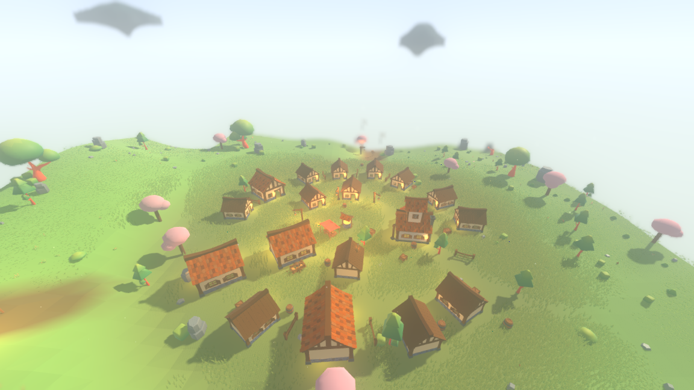
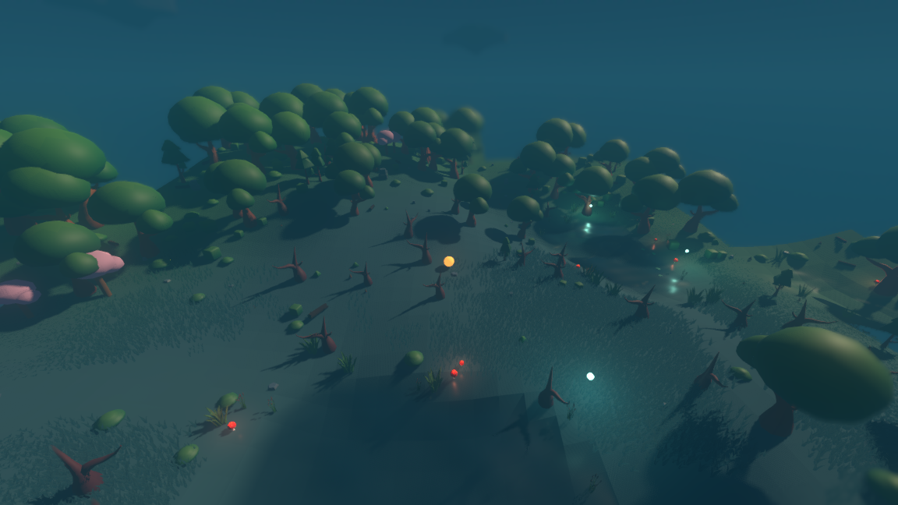
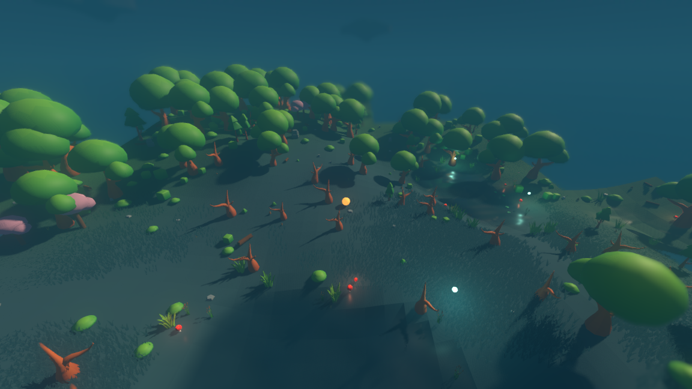
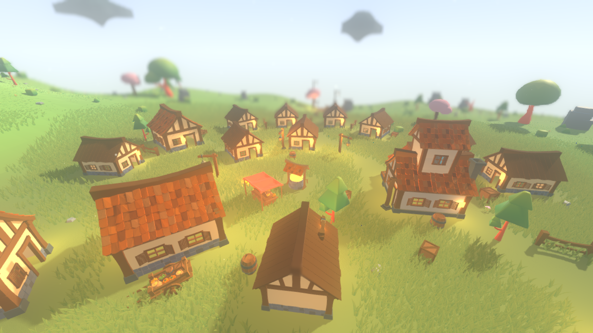
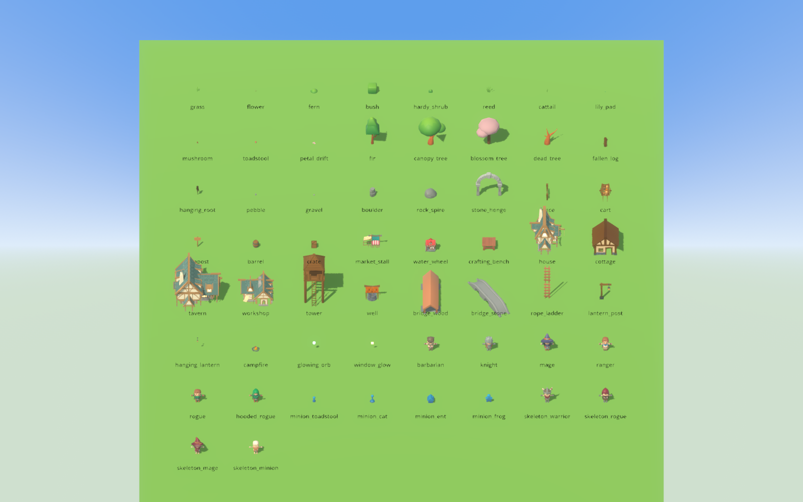

# The JustCreate village pack behind twenty tags

The village is now made of a village pack. Twenty of the catalog's forty-four
asset tags — every building, most props, both lanterns, the campfire, and five
flora rows — resolve to models out of *JustCreate Fantasy Village*, the one
paid pack on this machine that needed no repair to import. Nothing under `sim/`
moved and the headless world is byte-for-byte the same.



```
xvfb-run -a ./run_render.sh --seed 1234 --start -221.8 -230.0 --paused \
    --camera 0 26 34 --aim 6 --focus 42 \
    --screenshot "$PWD/reports/assets/world-justcreate-village.png" \
    --screenshot-frame 120
```

## Why this pack first

Ten archives sit under `assets/` where the user put them. Nine are Daniel
Mistage `.rar` files and one is a JustCreate `.zip`, and they are not the same
proposition. The Mistage models import geometry but bind no texture, arrive at a
thousand times scale, and split one building across 149 mesh nodes; that work is
`W-mistage-hero-assets` and this task does not touch it. The JustCreate pack
imports clean: metres already, one mesh and one material per model, one shared
atlas for the whole pack. So it is the cheapest possible answer to most of the
complaint, and it went in first.

## Getting it onto disk

```
./tools/extract_justcreate.sh
```

Unzips the archive the user dropped in `assets/` into
`assets/justcreate_village/` — 224 models — and does one thing beyond
unzipping. Every FBX in the pack names its texture by an absolute Windows path,
`D:\JustCreate\Project012\Textures\Texture_01.png`, which resolves nowhere here.
Godot then falls back to the file's *basename next to the model*, and the pack
ships its one atlas at the archive root instead of beside the models. So the
script copies `Texture_01.png` into each of the six model directories. That is
the whole fix: no material path is hand-edited anywhere.

The archive stays exactly where it was put. `assets/justcreate_village/` is
ignored by git for the same reason the KayKit packs are — it is reproducible
from a file already on disk — and so are the `.rar`/`.zip` archives themselves
and the `:Zone.Identifier` marks WSL wrote beside every one of them. The
per-tag wrapper scenes under `assets/tag_scenes/` stay committed, because those
are the part nobody else can reproduce.

## The textures really bind

Not by looking in an editor:

```
$ ./tools/inventory_pack.sh assets/justcreate_village --require-textures \
      --except Landscape/Water.fbx
...
224 models, 203326 triangles, 1 with no albedo bound (1 of those excused)
OK: every material in the 224 models binds its albedo texture (1 excused)
```

The one excused model is `Landscape/Water.fbx`, a two-triangle plane. It is
excused by name rather than by loosening the check, and the reason is checkable:
`strings -a` over that file finds no PNG at all, where every other model in the
pack carries `D:\JustCreate\Project012\Textures\Texture_01.png` twice. The
archive never textured it. Nothing points at it — the world draws its own water
sheet — and every other model in the pack binds the same atlas.

## The inventory

`tools/inventory_pack.sh` loads every model in a directory and prints the five
numbers a table row is chosen from:

| column | what it is | why a row needs it |
| --- | --- | --- |
| triangles | the model's own triangle count | the world places thousands of some of these |
| size | width × height × depth in metres, as drawn | `scene_height`, and whether it fits its plot |
| floor | the y of the lowest point | a model whose origin is not at its feet stands sunk into the ground |
| centre x,z | where the middle of its box sits | a lamp post whose lantern hangs off an arm has its light a metre from its own origin |
| albedo | the texture the material binds | a pack whose atlas does not bind draws white |

Full output: [`justcreate-inventory.txt`](justcreate-inventory.txt). 224 models,
203 326 triangles. Every number in the table below and every scale, rotation and
offset in the wrapper scenes comes off those columns; none of it was guessed.

## The twenty rows, and why each model won

Sizes are as the row finally draws it — after the wrapper's scale, which is what
the world sees.

### Buildings

The settlement layer reserves a rectangle of ground per building type and it has
never seen a model. So a building's scale is the smaller of *(reserved width /
model width)* and *(reserved depth / model depth)*: as big as the plot allows and
never bigger. That is why these heights are not the placeholders' — a plot is a
rectangle on the ground and the model that fits it is whatever height it turns
out to be.

| Tag | Model | Tris | Size as drawn | Why it beat the others |
| --- | --- | ---: | --- | --- |
| `house` | `Houses/House_01` | 9 815 | 5.20 × 4.84 × 5.89 | Most facade per square metre of the seven houses — porch, balcony and windows on three sides — which is what a plain house on a green needs. |
| `cottage` | `Houses/House_02` | 7 179 | 4.00 × 3.53 × 4.33 | The simplest of the seven, one storey and a half under a plain gable, so it still reads as a whole building at the two-thirds scale a cottage plot forces. |
| `tavern` | `Houses/House_05` | 11 636 | 7.20 × 6.88 × 5.60 | The only model in the pack that is genuinely two full storeys, and the largest after the church, which is what a tavern has to be to read as the biggest thing on the green. |
| `workshop` | `Houses/House_04` | 5 838 | 5.80 × 3.50 × 4.43 | The one house with an open lean-to bay along its side rather than another room — the only thing in the pack that reads as somewhere work happens. |
| `tower` | `Props/Tower` | 4 616 | 3.28 × 7.98 × 3.94 | The pack's only tower, and it is a timber watchtower on stilts with a ladder up one side. Scaled to the placeholder's height rather than clamped, because at that height it is still inside its 4.2 × 4.2 plot. |
| `well` | `Props/Well` | 4 010 | 2.38 × 2.42 × 1.64 | The pack's only well; it needed no choosing, it needed measuring. Stone drum, timber frame, tiled roof — the placeholder's four parts in geometry. |

`tavern` and `workshop` are shifted 1.215 and 0.920 along X, because their boxes
sit that far off their own origins — both have a wing on one side. Centring them
is not cosmetic: the lit-window fit rasterises the model to find the wall, and it
measures from the origin.

### Props

| Tag | Model | Tris | Size as drawn | Why it beat the others |
| --- | --- | ---: | --- | --- |
| `fence` | `Props/Fence_01` | 120 | 2.60 × 1.11 × 0.30 | The cheapest rail fence in the pack. `FenceBig_*` is a 3.4 m palisade and `Fence_04` a garden rail; a village ring wants a farm fence. |
| `cart` | `Props/Cart_02` | 4 960 | 3.13 × 1.08 × 1.84 | The loaded cart. `Cart_01` is the same cart empty at 938 triangles, and at one or two per village the load is worth paying for — it is where the pack's colour is, and an empty cart at this size reads as a crate on wheels. |
| `signpost` | `Props/Pointer_01` | 52 | 1.01 × 1.90 × 0.18 | A post with one board nailed across it — the cheapest thing in the pack that is a signpost, and what a road leaving a village needs. `Pointer_02` and `_03` are the same post with two and three boards. |
| `barrel` | `Props/Barrel_01` | 872 | 0.90 × 1.03 × 0.90 | So the barrels stacked against a village wall are made of the same wood as the wall. `Barrel_02` is the same barrel with its lid off, which reads as an open crate at this size. |
| `crate` | `Props/Box` | 328 | 0.80 × 0.80 × 0.80 | The pack's only crate, and the same wood as the barrel beside it. |
| `market_stall` | `Props/Market_Table_03` + `Props/Market_Roof_01` | 6 834 + 998 | 2.80 × 2.09 × 2.14 | The pack draws a stall in two pieces, so this is the one wrapper that holds two models: the counter with its goods laid out on it, under the red awning on its poles. `Market_Table_01` and `_02` are the same counter bare, and the goods are the reason to have a market. |

`fence` is the one row scaled by its *length* rather than its height: it closes
the gap between two buildings on a village ring, so length is what must not burst
the layout. Matching the placeholder's height instead would have made it 2.89
long against the 2.60 the ring was laid out for. `market_stall` is clamped the
same way, on the awning's width. `fence` and `cart` are both turned a quarter
turn, because the pack lays a long thing along its own X and every row in this
table lays one along Z.

### Lanterns

| Tag | Model | Tris | Size as drawn | Why it beat the others |
| --- | --- | ---: | --- | --- |
| `lantern_post` | `Props/Lantern_02` | 586 | 1.73 × 2.80 × 0.62 | The pack's only lamp post: a timber post with a lantern hanging off an arm. |
| `hanging_lantern` | `Props/Lantern_01` | 340 | 0.18 × 0.59 × 0.33, hung at 1.60 | The pack's only lantern that can hang; it carries a ring at the top. |
| `campfire` | `Props/Fire` | 492 | 1.16 × 0.64 × 1.14 | The pack's only fire, and it arrives the size the placeholder stood: 0.637 against 0.64, so it is the one row that takes no scale at all. |

The two numbers worth reading here are both about putting the light and the thing
making it in the same place. `lantern_post` is shifted 0.549 back along its arm —
the model's own box centre, straight off the inventory — so that the post and the
lamp straddle the point the simulation lit, instead of the post standing on it
with the flame a metre away from the light. Half a unit is well inside the
2.6-to-5.0 band a road's props stand in, so the post cannot be shifted into the
road. `hanging_lantern` is lifted 1.604 so the middle of the lantern sits at 1.9,
which is the height `Atmosphere` puts this tag's light at. `campfire` is lifted
0.125, which is how far the stone ring is drawn below its own origin.

### Flora

These five are scaled by the scatter layer, so the row names the model directly
and says how big it is; the shell divides the size generation asked for by that.

| Tag | Model | Tris | Size as drawn | Why it beat the others |
| --- | --- | ---: | --- | --- |
| `flower` | `Nature/Flower_05` | 490 | 0.35 × 0.32 × 0.25 | The fullest of the pack's five flowers, with its own leaves. `Flower_01` is 122 triangles but only 0.18 tall and reads as a speck of dirt at the size a meadow grows one; `Flower_04`'s yellow reads as a dandelion. |
| `mushroom` | `Nature/Mushroom_03` | 90 | 0.25 × 0.39 × 0.25 | The cheapest of the pack's seven, which is what a tag scattered across every forest floor should be. `_05` and `_07` are clusters of thin stalks that disappear at this size. |
| `toadstool` | `Nature/Mushroom_01` | 328 | 0.26 × 0.35 × 0.26 | A red cap with white spots — the placeholder drawn in geometry. Worth 328 triangles against `Mushroom_03`'s 90 because a toadstool is the marsh's signature and there are far fewer of them than there are mushrooms. |
| `cattail` | `Nature/Reeds_01` | 348 | 0.24 × 0.69 × 0.18 | A real cattail: thin stalks with brown heads. What it replaces was a 0.247-tall pond plant blown up 5.3× to reach the 1.3 units a bank asks for, which made a cattail a metre wide. This one only grows 1.9× and stays a stalk. |
| `fallen_log` | `Nature/Log_01` | 232 | 0.70 × 0.48 × 1.76 | The one log in the pack that lies down — `Log_02` is a mossy stump and `Log_03` a pile. At 1.758 long as drawn against the KayKit billet's 1.350, it grows less to reach the 1.3-to-2.2 units generation asks for. |

`fallen_log`'s `scene_height` is the log's *length*, as it was for the model it
replaces, because that is what generation means by the size of a log.

## The twenty-four tags that did not move

Two different reasons, kept apart.

**Fourteen tags the pack does not cover.** These keep exactly what they resolve
to today.

| Tag | Resolves to today | Why the pack has nothing |
| --- | --- | --- |
| `stone_henge` | wrapper → halloween `arch` | No henge, no standing stones, no arch. |
| `bridge_wood` | wrapper → builder `bridge_roofed` | No bridge of any kind. |
| `bridge_stone` | wrapper → hexagon `building_bridge_A` | Same. |
| `rope_ladder` | wrapper → hexagon `ladder` ×2 | `Stairs_01` is a stone stair and `Stairs_02` a plank ramp; the only ladder in the pack is modelled into the watchtower. |
| `water_wheel` | wrapper → hexagon `building_watermill_red` | `MillPart_02` looks like a candidate at 7.3 m across and is a *windmill* sail cross, four blades on a hub. Photographed before it was believed. |
| `crafting_bench` | wrapper → dungeon `table_medium` | `Table_01` is a dining table and `Shelving_01` a shelf. A dining table is not a workbench. |
| `petal_drift` | placeholder | No fallen petals. |
| `blossom_tree` | placeholder | Ten trees and none of them pink; the pack has one atlas and its foliage is green, which is the same reason the KayKit forest pack could not fill this row. |
| `hanging_root` | placeholder | A torn root hanging into the air is not a thing a village pack ships. |
| `glowing_orb` | placeholder | Not a gap: an emissive sphere with a light on it. |
| `window_glow` | placeholder | Not a gap either: an emissive quad. |
| `lily_pad` | hexagon `waterlily_A` | No lily pad. |
| `reed` | forest `Grass_2_C_Color1` | `Reeds_01` went to `cattail`, which is what it actually is; the pack has no second reed. |
| `fern` | forest `Bush_3_A_Color1` | `Plant_01`–`_04` are broad-leafed ground plants, not ferns, and cost 658–1408 triangles against the KayKit bush's 108. |

**Ten tags the pack does cover, which keep KayKit anyway.** Every one of these
is a forest or rock row, and the reason is measured rather than felt: the KayKit
forest pack is a dedicated flora library and its models do the same job for a
fraction of the triangles, at the sizes these are scattered at in their
thousands.

| Tag | Keeps | Tris | Village pack's nearest | Tris |
| --- | --- | ---: | --- | ---: |
| `grass` | forest `Grass_2_B_Singlesided` | 42 | `Grass_04` | 82 |
| `bush` | forest `Bush_2_C` | 108 | `Plant_02` | 1 378 |
| `hardy_shrub` | forest `Bush_4_A` | 44 | `Plant_03` | 968 |
| `fir` | forest `Tree_4_A` | 404 | `Tree_06` | 276 |
| `canopy_tree` | forest `Tree_1_B` | 636 | `Tree_10` | 3 394 |
| `dead_tree` | forest `Tree_Bare_1_B` | 332 | `Branch` | 964 |
| `pebble` | forest `Rock_2_A` | 12 | `Rock_02` | 20 |
| `gravel` | hexagon `rock_single_A` | 18 | `Rock_04` | 20 |
| `boulder` | forest `Rock_1_D` | 84 | `BigRock_01` | 170 |
| `rock_spire` | forest `Rock_3_I` | 168 | `BigRock_03` | 54 |

Two rows are cheaper in the village pack and still do not take it. `Tree_06` is a
single narrow cone 4.6 m tall where `Tree_4_A` is the layered fir the meadow was
dressed with; `BigRock_03` is 1.6 × 1.7 × 2.9, a slab lying on its side, and a
`rock_spire` has to stand up. In both cases the cheaper model is cheaper because
it is a simpler shape, and the simpler shape is the wrong one. The forest stays a
forest pack's forest; the village is a village pack's village.

## The biome tint still reaches them

It does, and the shared atlas survives, because a tint is applied as a
*duplicated material with the same texture on it* hung on the instance — not as
a rewrite of the mesh's material and not as a replacement of the texture. Same
marsh, same seed, same camera, tint on and off:

| tint on | tint off (`--no-model-tint`) |
| --- | --- |
|  |  |

```
xvfb-run -a ./run_render.sh --seed 1234 --start -216 -504 --paused \
    --camera 0 20 34 --aim 2 \
    --screenshot "$PWD/reports/assets/justcreate-marsh-tinted.png" \
    --screenshot-frame 150
```

The cattails, the mushrooms and the fallen logs all cool into the marsh with
everything else in the left frame and are the pack's own bright green in the
right one. The red toadstools are red in **both**, and that is the one deliberate
exception in the twenty: its placeholder took no colour either — the red *is* the
tag — and shifting a red cap by a marsh's teal foliage colour would take the red
out of the one thing in a marsh that is meant to be warm.

Two rows gained a tint they did not have: `mushroom` and `flower`'s model now
follow the foliage colour, which is an addition rather than a drop. The asset
report's own guard agrees the table is consistent:

```
tags=44 resolved=44 missing=0 unknown-rows=0 dropped-tints=0
```

`dropped_tints()` fails the report if any row's model drops or contradicts a
colour its own placeholder took, which is the rule that caught an orange bare
tree standing in a teal marsh once before.

The cost is unchanged in shape — 484 instances in a streamed radius drawn with 82
unique materials rather than one per instance, which is the material cache doing
its job:

```
$ ./tools/measure_tint.sh
                                 tint off      tint on
instances built                       484          484
unique materials                       20           82
unique mesh+material pairs             46          103
build ms per chunk                  1.133        1.815
```

## One thing in the render layer had to change

The watchtower has no wall below its platform — it stands on stilts — and the
lit-window fit looked for flat wall only between 1.25 and 2.15 metres. Ten of a
village's lit windows came back with nowhere to sit, and the window-glow suite
failed on exactly that. `WINDOW_STOREYS` now runs from 1.25 to 6.05 in 0.30
steps instead of stopping at the second storey. The fit takes the *lowest* rung
that has flat wall and stops there, so no building with a ground-floor wall ever
reaches the new rungs; what changed is that a model with nothing at head height
can now be lit in its cabin. The suite's own quality number improved with it:
worst gap between a pane and the wall behind it 0.185, down from 0.206.

This is the same split the rest of the table lives by. Generation says *this
building has a lit window on the wall facing the green, this far along it*; the
asset table, the only thing here that has seen a model, decides how high off the
ground that lands.

## What it cost

| Claim | Evidence |
| --- | --- |
| No file under `sim/` changed | `tools/repoint_tag_demo.sh`: sim sources `7c95c750…` before and after, *OK every file under sim/ is unchanged* |
| The structure check still holds | `asset check: OK — res://sim names asset tags and no asset` |
| The headless world did not move | seed 1234 / 100 ticks: `a6aa8e5776ebfe8c` before, `a6aa8e5776ebfe8c` after |
| Repointing is still a one-line edit | `tools/repoint_tag_demo.sh`: *the whole edit is 1 line(s)* |
| Every tag still resolves | `tags=44 resolved=44 missing=0 unknown-rows=0 dropped-tints=0` |
| A headless run still loads no visual asset | `assets visual-files found=1634 loaded=0`, with `sim-scripts found=31 loaded=31` as the control |
| Every suite passes | 19 suites, 169 911 checks |

Full repoint-demo output: [`asset-tag-repoint-evidence.txt`](asset-tag-repoint-evidence.txt).

## What it looks like up close



```
xvfb-run -a ./run_render.sh --seed 1234 --start -221.8 -230.0 --paused \
    --camera 0 11 17 --aim 2 --focus 20 \
    --screenshot "$PWD/reports/assets/justcreate-village-detail.png" \
    --screenshot-frame 150
```

And the whole table, every tag side by side:



## Honestly worse

**The campfire's flames are painted, not lit.** The placeholder had an emissive
core; the model does not. The warm pool on the ground still comes from the point
light `Atmosphere` hangs on the tag, which is untouched and is the part that
carries a night frame — but the flame itself no longer glows on its own. The
same is true of the toadstool's cap.

**Five placeholder rows are left.** `petal_drift`, `blossom_tree` and
`hanging_root` are real gaps that no installed pack fills; `glowing_orb` and
`window_glow` are emissive shapes that were never going to be models. The
blossom tree is the one that stings, and it will keep stinging until a pack
arrives with a pink atlas.
