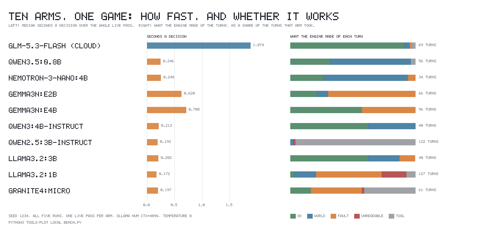

# Ten minds, one game: every model this machine can run, driving the same run

Every character in this game that a person is not driving decides by being asked
a question in words, and so does the world's own dungeon master. This page asks
one question about that: **is a model running on this machine worth driving the
game with, and which one?** Ten candidates each drove the same seeded run end to
end, and what follows is what came back.

Nothing here is inferred. Every number is off a live pass made on 2026-09-05 on
this machine, or off a transcript replayed from what that pass wrote. The passes
ran between 09:26Z and 10:52Z; the card was read at 09:19Z and again at 12:04Z.

**Terms, once each.**

* **An arm** — one candidate model in this comparison. The word is used because
  each is a separate branch of the same experiment, differing in nothing but
  which model answered.
* **The runtime** — the program that loads the weights and answers requests.
  Here that is either `ollama` version $0.17.4$ running on this machine, or
  OpenRouter, a paid service reached over the network.
* **The card** — the single NVIDIA RTX 4090 graphics processor in this machine,
  $24{,}564$ MiB of video memory (VRAM).
* **The seam** — the two environment variables `LOCAL_MODEL_ENDPOINT` and
  `LOCAL_MODEL` that `net/model_call.gd` reads to decide where a call goes. It
  already existed; this comparison needed no change to it.
* **The catalogue** — the list of the twelve atomic actions with the shape of
  each one's arguments. It *faults* a line whose arguments are missing or of the
  wrong sort, before the world is consulted at all.
* **A placeholder** — the text a prompt prints in the slot where a value goes.
  Since commit `f39055b` every one of them names the slot in angle brackets
  (`#<id>`, `(<x>, <z>)`, `<what you mean>`) instead of showing a specimen.
* **The orchestrator** — the second model layer, the world's dungeon master: it
  looks at the world every so often and names operations, including spawning
  characters.
* **A recording** — `net/model_recording.gd`, the table of what a model said,
  which lets every other command in the repository run with no key, no network
  and no model at all.

---

## How each row was made

One command per arm, and it is the command the repository already had:

```
env -u OPENROUTER_API_KEY \
  LOCAL_MODEL_ENDPOINT=http://127.0.0.1:11513/v1/chat/completions \
  LOCAL_MODEL=<the arm> ./run_record.sh --live
```

That single pass puts **every question of all five runs**: the shipped $160$-tick
six-character run, the lesson comparison, the goal comparison, the
difficulty-class run and the orchestrator run. All five are seeded at
$\text{seed}=1234$ (the difficulty-class run additionally at
$\text{roll\_seed}=1$), so the world every arm walks into is the same world.
After each pass the recording it wrote was copied out, `./run_agent.sh`,
`./run_world.sh`, `./run_lesson.sh`, `./run_goal.sh` and `./run_check.sh` were
replayed off it, and `net/model_recording.gd` was restored with `git checkout`
and byte-compared against its pre-run backup. It matched on all ten passes.

**No engine change was made for this comparison, and no proxy stands in front of
any arm.** The one engine change this milestone needed — the thinking-off field
that two of the arms cannot answer without — was made before this ran, in commit
`f4994a4`, and the request every local row was measured through is the one the
suite pins to a literal:

```
{"max_tokens":1200,"messages":[…],"model":"<the arm>",
 "reasoning_effort":"none","temperature":0}
```

The earlier probe that first measured the two thinking arms had to add that
field with a small forwarding proxy. This one does not: the seam sends it, and
the proof that it arrives is behavioural — `qwen3.5:0.8b` returned empty content
on three calls of three without it, and returns $0$ empty replies of $84$ here.

**The server.** `ollama` $0.17.4$, started by this run on `127.0.0.1:11513` with
`HOME` and `OLLAMA_MODELS` redirected into the session scratchpad (the sandbox's
real home is read-only), `OLLAMA_CONTEXT_LENGTH=4096` and
`OLLAMA_NUM_PARALLEL=1`. The context length is not a detail: at ollama's default
of $32{,}768$ the cache for a 3B model pushes layers onto the processor and costs
seconds a call. Every arm below ran with all its layers on the card.

---

## The table

One row per arm, in three widths because it does not fit in one. The cloud model
that ships is the first row of each.



### A — what a decision cost, and whether the answer could be read

| arm | runtime | median s | max s | questions put | empty | nothing readable | faulted by the catalogue | refused by the world | action mix, shipped run |
|---|---|---|---|---|---|---|---|---|---|
| `z-ai/glm-5.3-flash` | OpenRouter, cloud | 1.874 | 56.894 | 101 | 0 | 0 | 1 | 3 | say 25 go_to 20 trade_propose 12 examine 9 |
| `qwen3.5:0.8b` | ollama 0.17.4 | 0.246 | 28.268 | 84 | 0 | 0 | 0 | 36 | go_to 31 pick_up 30 recall 2 |
| `nemotron-3-nano:4b` | ollama 0.17.4 | 0.248 | 19.207 | 56 | 0 | 0 | 2 | 23 | go_to 38 examine 3 |
| `gemma3n:e2b` | ollama 0.17.4 | 0.620 | 18.385 | 96 | 0 | 0 | 46 | 6 | examine 56 go_to 21 |
| `gemma3n:e4b` | ollama 0.17.4 | 0.708 | 3.555 | 125 | 0 | 0 | 41 | 0 | say 53 examine 52 go_to 5 |
| `qwen3:4b-instruct` | ollama 0.17.4 | 0.212 | 6.401 | 63 | 0 | 0 | 0 | 15 | go_to 32 wait 11 say 2 examine 1 |
| `qwen2.5:3b-instruct` | ollama 0.17.4 | 0.192 | 4.200 | 152 | 0 | 2 | 0 | 3 | recall 134 pick_up 3 |
| `llama3.2:3b` | ollama 0.17.4 | 0.202 | 4.604 | 61 | 0 | 0 | 5 | 10 | wait 24 go_to 21 |
| `llama3.2:1b` | ollama 0.17.4 | 0.172 | 2.735 | 162 | 0 | 25 | 67 | 22 | trade_accept 70 recall 43 jump 28 go_to 4 |
| `granite4:micro` | ollama 0.17.4 | 0.197 | 3.414 | 86 | 0 | 1 | 25 | 0 | recall 28 go_to 28 say 13 |

*A column was struck from this table, and this is why.* Until 2026-09-05 Table A
carried an eleventh column, **max s, cold load excluded** — each arm's slowest
call with call one dropped, call one being the runtime loading the weights onto
the card. It is gone, because for nine of the ten arms there is no file it can
be read out of. A pass writes its per-call timings into `net/model_recording.gd`
and the pass then restores that file with `git checkout`, so each local arm's
per-call series lived only in the scratchpad directory of the session that made
it — the directory ending `73a7c62a-0ee1-446f-8ff2-b2fab00eeaf0/scratchpad`,
named in the evidence file's own determinism section. That directory no longer
exists; nor do the $\approx 26$ GB of weights it held. Every scratchpad still on
this machine was listed and opened before that was concluded. What survives per
arm is the **max s** column above, which is in the evidence file. *Which call*
that maximum was is recorded for nobody but the cloud model.

**Re-making the nine passes was weighed and refused, and it was not the card
that refused it.** The card is free as this is written — $839$ MiB used of
$24{,}564$, no compute process — and the evidence file timestamps the nine
passes from 09:26:53Z to 10:52:27Z, about $86$ minutes, on top of pulling nine
models again. The reason not to spend that is that a second pass is a
*different* pass: its call one would be a fresh load off freshly-written
weights, so nine new cold-load cells would sit beside nine **max s** cells
measured on a different day, and Table A would become a mixture of two passes.
One column struck is a smaller loss than the rest of the row made untraceable.
No arm was re-run for this correction, local or cloud.

**The cloud row is the exception, and the struck figure was wrong.** Its
recording is the one checked in, so it can still be read: `net/model_recording.gd`
holds $101$ calls, the first of them takes $9.748$ s, and the slowest is call
$40$ at $56.894$ s. Dropping call one therefore leaves $56.894$ s exactly where
it is. The struck column had said $31.161$ s in that cell, which is merely the
*second*-largest call and not what the column's own rule gives — it contradicted
this page's own sentence about call $40$. In any case a call to a paid endpoint
loads no weights, so for this row the exclusion had nothing to exclude.

**What can still be said about cold load, and what cannot.** Each of the nine
local arms has a maximum far above its own median — `qwen3.5:0.8b` peaks at
$28.268$ s against a median of $0.246$ s, a factor of $115$ — and a first call
that loads weights is the obvious explanation, and was measured directly on this
machine in an earlier probe (`gemma3n:e2b`, cold call $11.7$ s against a warm
median of $0.787$ s). That is a *hypothesis* about these nine rows, though, not a
reading of them. The two claims this paragraph used to make cannot be checked
against any file: that seven of the nine arms' slowest call is call one, and
that the other two are genuinely warm — `qwen3:4b-instruct` at $6.401$ s on call
three and `llama3.2:3b` at $4.604$ s on call $58$. Both of those figures do
survive, in the evidence file, as those arms' **maxima**; neither survives as a
*warm* maximum, because the call number is exactly what went with the deleted
recording. They are named here rather than quietly dropped, so that nobody
re-quotes them as warm figures. **What a decision costs is the median column**,
and it is untouched by all of this: a median over an arm's whole pass moves by
nothing when one call of it is a weight load.

**Where every column of Table A comes from.** `arm`, `runtime`, `median s`,
`max s`, `questions put`, `empty`, `faulted by the catalogue`, `refused by the
world` and `action mix, shipped run` are each copied cell-for-cell from the
first table of `.lab/memory/files/local-bench-2026-09-05.md`, which is the raw
pass; `nothing readable` is that file's `unreadable` column under a plainer
name. All ten cloud cells re-derive independently from `net/model_recording.gd`,
which is checked in: $101$ rows across its five tables, median $1.874$ s,
maximum $56.894$ s, no empty reply, and the shipped run's action mix counted off
its replies. The nine local rows have no artifact of their own left and are
traceable to the evidence file only — which is the whole reason the eleventh
column had to go.

**The cloud baseline, quoted rather than asserted.** The recording checked in
today holds $101$ replies from `z-ai/glm-5.3-flash` with a median of $1.874$ s
and none empty. The $5.16$ s figure this comparison was planned against belongs
to the *previous* shipped model, `anthropic/claude-fable-5`: $87$ replies,
**$9$ of them empty**, median $5.161$ s. So the honest answer to "is a local
model faster" is: yes, by roughly $10\times$ against what ships now and roughly
$25\times$ against what shipped before — and no local arm returned a single
empty reply, where fable returned nine.

### B — what it did in the world

| arm | turns | chose an action | turns that ran to a finish, per character -- a refusal or a fault finishes | fewest finishes, and whose -- not fewest clean turns | ok, as a share of that arm's turns | recall share of the shipped run | tool asks the budget made pay a turn | distinct lines / questions | placeholders handed back | prompt's example coordinate copied |
|---|---|---|---|---|---|---|---|---|---|---|
| `z-ai/glm-5.3-flash` | 69 | 67 | Rook 18 Bram 11 Sable 11 Odo 8 Pell 16 | Odo, 8 | 63 of 69 (91%) | 4 of 79 (5%) | 0 | 54 of 79 | none | no |
| `qwen3.5:0.8b` | 56 | 54 | Rook 6 Bram 6 Sable 5 Odo 6 Pell 26 | Sable, 5 | 18 of 56 (32%) | 2 of 63 (3%) | 0 | 9 of 63 | `<id>` x1, `<what you mean>` x1 | no |
| `nemotron-3-nano:4b` | 34 | 34 | Rook 5 Bram 6 Sable 6 Odo 6 Pell 6 | Rook, 5 | 9 of 34 (26%) | 0 of 41 (0%) | 0 | 12 of 41 | `<id>` x1 | no |
| `gemma3n:e2b` | 66 | 66 | Rook 6 Bram 9 Sable 20 Odo 22 Pell 6 | Rook, 6 | 14 of 66 (21%) | 0 of 77 (0%) | 0 | 10 of 77 | none | no |
| `gemma3n:e4b` | 96 | 96 | Rook 18 Bram 22 Sable 22 Odo 19 Pell 10 | Pell, 10 | 55 of 96 (57%) | 0 of 110 (0%) | 0 | 8 of 110 | `<id>` x23 | no |
| `qwen3:4b-instruct` | 40 | 40 | Rook 7 Bram 6 Sable 6 Odo 10 Pell 6 | Bram, 6 | 25 of 40 (63%) | 1 of 47 (2%) | 0 | 26 of 47 | none | no |
| `qwen2.5:3b-instruct` | 122 | 3 | Rook 0 Bram 0 Sable 0 Odo 0 Pell 3 | Rook, 0 | 0 of 122 (0%) | 134 of 137 (98%) | 105 | 22 of 137 | `<what you mean>` x3 | no |
| `llama3.2:3b` | 40 | 40 | Rook 11 Bram 9 Sable 4 Odo 6 Pell 6 | Sable, 4 | 25 of 40 (63%) | 0 of 45 (0%) | 0 | 14 of 45 | none | no |
| `llama3.2:1b` | 127 | 93 | Rook 6 Bram 26 Sable 26 Odo 22 Pell 10 | Rook, 6 | 4 of 127 (3%) | 43 of 145 (30%) | 5 | 20 of 145 | `<id>` x32, `<a name>` x2 | no |
| `granite4:micro` | 61 | 35 | Rook 13 Bram 6 Sable 6 Odo 0 Pell 6 | Odo, 0 | 10 of 61 (16%) | 28 of 69 (41%) | 22 | 12 of 69 | none | no |

**A faster arm is asked more often, so read this table's counts as rates.** Every
arm was given the same $160$-tick run, and a live channel does not wait: the
question goes to a worker thread and, in `sim/model_channel.gd`'s own words, "the
answer appears at whichever tick the flight first answers on". So an arm that
answers in $0.172$ s is asked far more times in those $160$ ticks than one that
answers in $1.874$ s, and the **turns** column is partly a restatement of the
median-seconds column of Table A: the cloud arm took $69$ turns at a $1.874$ s
median, `gemma3n:e4b` $96$ at $0.708$ s, `llama3.2:1b` $127$ at $0.172$ s. **What
follows from that is simple: no arm here is ranked against another on a raw
count.** What compares across arms is a share of that arm's own turns — which is
what the **ok** column is, and it is the only cross-arm ranking this page now
makes off Table B.

**And "resolved" was the wrong word, so the column no longer uses it.** The
figure under *turns that ran to a finish, per character* is counted by
`sim/scripted_agent.gd`, whose `_resolved_by` walks the run's journal and counts
every line for that character whose text begins `finished `:

```
static func _resolved_by(journal: PackedStringArray, who: String) -> int:
    var found := 0
    for line in journal:
        if _who_of(line) == who and _what_of(line).begins_with("finished "):
            found += 1
    return found
```

A turn the world refused finishes, and so does a turn the catalogue faulted. This
is not read off the code alone — the cloud replay that still ships prints it. Run
`./run_agent.sh` against the checked-in recording and its journal carries

```
t= 89  Rook   finished go_to() -> go_to refused: go_to needs target or offset
```

which is one of Rook's $18$. That turn has no `began` line at all: it is chosen
and finished on tick $89$, taking no world time, and Rook is asked again on the
same tick. So the column counts turns that ran to a finish, not turns that
changed the world, and an arm the catalogue faults heavily scores well on it. The
measure that does mean the world changed is the engine's own **ok** verdict,
which is the column beside it.

**The ratios on this page are unaffected and are not restated.** A share taken
within one arm is already a rate: `qwen3:4b-instruct`'s $26$ distinct lines of
$47$, `qwen2.5:3b-instruct`'s $134$ recalls of $137$, its $0$ faulted of $40$
turns. Being asked more often changes the numerator and the denominator
together, so a ratio survives the confound that a count does not. The
orchestrator figures in Table C are unaffected for a different reason: every arm
got exactly five looks, so those denominators are equal by construction and not
set by latency.

**Whether the per-character column could be rebuilt on the ok verdict was
settled by looking, and for nine of the ten arms it cannot be.** What survives
per arm is what is printed above plus, in the evidence file, one ok/fault/refusal
split for the arm as a whole; per character the evidence file records only calls,
answers and finished turns. The per-call recordings that would carry the rest
were written into the scratchpad of the session that made the pass and deleted
with it: that directory is gone, and every other scratchpad still on this
machine was listed this cycle — four of them, $4$ to $16$ KB apiece, holding two
ollama manifest shells with no blobs, one roster file and one empty directory —
with no `model_recording*.gd` anywhere under `/tmp`. **The
cloud arm is the exception**, because its recording is the one checked in: replay
it and count, and its five model-driven characters have $64$ finished lines of
which $60$ report `ok` — Rook $17$ of $18$, Bram $10$ of $11$, Sable $10$ of
$11$, Odo $8$ of $8$, Pell $15$ of $16$ — the four that do not matching the
evidence file's $1$ fault and $3$ world refusals exactly. One arm restated is not
a comparison, which is why the cross-arm sentence below is dropped rather than
redone. Rebuilding the other nine means re-running them: $85$ minutes $34$
seconds of wall clock by the evidence file's own timestamps, plus re-pulling
about $26$ GB of weights, and it would produce a *different* pass whose cells
could not be set beside the ones already published — the same objection that
struck Table A's eleventh column. It was not spent.

**The sweep, so a reader can tell it happened.** Every sentence of the page was
searched rather than recalled, counted on the version this correction opened
against (commit `75590cb`): $131$ prose sentences, of which $44$ carry a number.
All $131$ were read; all $44$ were classed.

The word *resolved* occurred nine times. One is `ollama`'s "manifest resolves"
and means something else; it is left alone. The other eight are the
finished-lines sense and every one is handled: the Table B column heading is
renamed; three "resolved nothing" / "no resolved action" phrases now say
*finished*; the cross-arm ranking "the arm with the most resolved turns of any
local model … is the slowest local arm" is replaced by the ok share; the
per-character coverage sentence is dropped; and the two carrying the third
recommendation are quoted only as the figures being withdrawn.

Five sentences ranked arms against each other on a raw count, and all five are
gone or restated. Two are the ones this correction was opened for, both in the
third recommendation: `gemma3n:e4b` "resolved more turns than any other local arm
($55$ of $96$)" and "gave its least-served character $10$ turns, more than the
cloud model gave its own ($8$)". The third is the same least-served comparison
made again in the paragraph beginning *Per-character coverage*. The fourth is the
recommendation's own re-read paragraph, which repeated "$55$ resolved turns of
$96$" as a reason. The fifth is "the arm with the most resolved turns of any
local model … is the slowest local arm" — which carries no digit at all, and is
the reason the sweep read all $131$ sentences and not only the numbered ones. One
further sentence gave raw counts across arms without ranking them — "two other
arms hit the same guard, `granite4:micro` $22$ times and `llama3.2:1b` $5$ times"
— and now gives each against that arm's own turns.

The remaining numbered sentences either carry their own denominator, describe a
single arm, or concern the card, the runtime, the absences or the determinism
check. None of them ranks arms on a count.

### C — the orchestrator, and what the card was doing

| arm | orchestrator answered at all | operations named / carried out | spawns landed / attempted | spawn quality | on the card | VRAM it takes | free VRAM before / after that arm's pass | needs the borrowed card |
|---|---|---|---|---|---|---|---|---|
| `z-ai/glm-5.3-flash` | yes | 13 / 11 | 5 / 5 | 5 spawns at 5 distinct points, each written into a named persona in prose | — (cloud) | — | — | no |
| `qwen3.5:0.8b` | yes | 5 / 5 | 5 / 5 | 5 land, but 4 of them at the identical point $(-474.0, 420.0)$, all `role=guard`; the personas are ability-score readouts | 100% GPU | 2,342 MiB | 23,300 / 20,956 MiB | no |
| `nemotron-3-nano:4b` | **no** | 0 / 0 | 0 / 0 | none — answers `nothing` 5 times of 5 | 100% GPU | 5,274 MiB | 20,956 / 15,680 MiB | no |
| `gemma3n:e2b` | yes | 3 / 2 | 2 / 3 | 2 land at distinct points, 1 refused by ground that would not carry it; 2 personas in prose | 100% GPU | 6,072 MiB | 18,024 / 11,950 MiB | no |
| `gemma3n:e4b` | yes | 5 / 2 | 0 / 0 | none — `spill target=#4` 5 times, twice inside a markdown fence | 100% GPU | 7,944 MiB | 17,226 / 15,354 MiB | **yes** |
| `qwen3:4b-instruct` | yes | 5 / 0 | 0 / 5 | none — each look names three operations in a shape the engine reads nothing from | 100% GPU | 3,542 MiB | 15,354 / 11,810 MiB | no |
| `qwen2.5:3b-instruct` | **no** | 0 / 0 | 0 / 0 | none — answers `nothing` 5 times of 5 | 100% GPU | 2,790 MiB | 19,756 / 16,964 MiB | no |
| `llama3.2:3b` | yes | 12 / 4 | 1 / 1 | 1 guard at a distinct point, written into "Goliath Guard" in prose | 100% GPU | 3,132 MiB | 20,508 / 17,374 MiB | no |
| `llama3.2:1b` | yes | 4 / 0 | 0 / 0 | none — every look is a numbered list, `#1 place kind=stone ...` | 100% GPU | 2,130 MiB | 20,166 / 18,036 MiB | no |
| `granite4:micro` | yes | 5 / 1 | 1 / 1 | 1 guard at a distinct point, written into "Brutus" in prose | 100% GPU | 3,000 MiB | 21,170 / 18,168 MiB | no |

The **VRAM it takes** column is not the free-VRAM difference across a pass — a
previous arm's weights may still be resident when the next begins, because the
runtime holds them for ten minutes. It is a separate measurement, taken after
every pass was finished, with one model loaded at a time and nothing else on the
card: free VRAM read with the card empty, one call made, free VRAM read again.
The **needs the borrowed card** column asks whether that figure fits inside the
$\approx 6{,}500$ MiB that was free on this machine *before* the neighbouring
project's queue was paused. Only `gemma3n:e4b` does not.

---

## What the table says

**No arm copies the prompt's example coordinate. Not one.** Every recording made
in this comparison was searched for `(12.5, -4.0)` and `(+2.0, -6.0)`, the two
specimen values the prompts used to print, and all ten arms return zero. On the
last full pass, four days ago and before commit `f39055b`, three of four local
arms spawned at `(12.5, -4.0)` in every one of the orchestrator's five looks and
the engine refused all fourteen attempts. That failure is gone — it was a fact
about the prompt, and fixing the prompt fixed it for every model at once.

**A different degenerate mode replaces it, and the catalogue catches this one.**
Three arms hand back the *slot name* instead: `llama3.2:1b` answers
`trade_accept target=#<id>` thirty-two times, `gemma3n:e4b` hands back `#<id>`
twenty-three times, and `qwen2.5:3b-instruct` hands back `<what you mean>` three
times. This is a strictly better failure than the old one: `#<id>` is not a
valid id, so `ActionCatalog.fault()` refuses the choice with its own sentence,
where `(12.5, -4.0)` used to be a perfectly legal position and the world quietly
tried to act on it.

**Speed does not predict behaviour, and the ranking by speed is meaningless on
its own.** The three fastest arms are `llama3.2:1b` ($0.172$ s), `qwen2.5:3b-instruct`
($0.192$ s) and `granite4:micro` ($0.197$ s), and they are three of the four
worst-behaved: `llama3.2:1b` had $67$ of its $127$ turns faulted and $25$ more
unreadable; `qwen2.5:3b-instruct` chose an action on $3$ turns of $122$; and
`granite4:micro` left one of its five characters with no finished turn at all.
The converse is not true either, and it cannot be put as a count: the two local
arms with the best **ok** share, `qwen3:4b-instruct` and `llama3.2:3b` (both $25$
of $40$, $63\%$), sit in the middle of the speed column at $0.212$ and $0.202$ s,
and the slowest local arm, `gemma3n:e4b` at $0.708$ s, comes third on that share
($55$ of $96$, $57\%$). Speed and behaviour are simply unrelated here.

**The recall loop is real, it reproduced, and the budget is holding it.**
`qwen2.5:3b-instruct` spent $134$ of the shipped run's $137$ questions on the
`recall` tool — $98\%$ — and four of its five characters finished nothing at all,
clean or otherwise, which is the failure shape recorded when this model was
first tried. The guard added by the tool-budget work fired $105$ times in that
run ("*has already asked 2 things of no world time since it last acted; this one
costs it a turn*"), so the
loop now costs the world time instead of being free. It does not cure the model:
the character still asks. Two other arms hit the same guard, `granite4:micro`
$22$ times in its $61$ turns and `llama3.2:1b` $5$ times in its $127$.

**Per-character coverage: what the evidence supports is whether an arm served
all five characters at all, and not how many turns each of them got.** The
comparison this paragraph used to make — the cloud model's least-served character
on $8$ finished turns against `gemma3n:e4b`'s $10$ — has been dropped, for two
reasons that compound. It set a nearly-clean count against a heavily faulted one:
across the whole run the engine called $63$ of the cloud arm's $69$ turns **ok**,
with $1$ catalogue fault and $3$ world refusals, while it called $55$ of
`gemma3n:e4b`'s $96$ turns ok with $41$ catalogue faults — so a "finished turn"
means something different in each column. And it set a count from a $1.874$ s arm
against a count from a $0.708$ s arm, which the note under Table B says cannot be
done. Restating it per character on the **ok** verdict is not possible for
`gemma3n:e4b` or for any of the other eight local arms, for the reason set out
under Table B: no surviving file carries a per-character verdict split for them.
The cloud arm alone can be recounted that way, off the recording that is checked
in, and one arm recounted is not a comparison.

What survives, and is untouched by both problems, is the zeroes — a character
with no finished turn has no clean turn either, whatever the arm's latency.
`qwen2.5:3b-instruct` leaves four of its five characters on zero and
`granite4:micro` leaves Odo on zero; every other arm, cloud and local, gave all
five characters at least one turn that ran to a finish. Beside that, the honest
cross-arm figure is the ok share of each arm's own turns, which Table B now
carries: cloud $91\%$, then `qwen3:4b-instruct` and `llama3.2:3b` at $63\%$,
`gemma3n:e4b` at $57\%$, and the rest at $32\%$ and below.

**The orchestrator is where the local arms fail worst.** Two of the nine
(`nemotron-3-nano:4b`, `qwen2.5:3b-instruct`) answer `nothing` to all five looks,
so the world gets no people at all. Three more name operations the engine can
read nothing from. Only three local arms put a character into the world with a
persona written in prose: `llama3.2:3b` (one, "Goliath Guard"), `granite4:micro`
(one, "Brutus") and `gemma3n:e2b` (two). `qwen3.5:0.8b` spawns five, but four at
the same point, and its personas read `traits=Str 12, Cha 7` and
`backstory=They are a 10-point gap between the highest and lowest` — it is
reciting the roll it was shown rather than writing anybody. The cloud model
spawns five at five distinct points with five personas.

---

## Two arms were not run, and one name does not exist

These are absences with reasons, not gaps.

* **DiffusionGemma.** Does not load here at all. `ollama` answers
  `unknown model architecture: 'diffusion-gemma'`, and of the published
  checkpoints only the NVFP4 build at $18.1$ GB fits this card — NVFP4 needs a
  Blackwell processor and this is an Ada 4090. The blocker is the checkpoint
  format, not memory, so the free card does not change it.
* **LLaDA2.1-mini.** It *does* run here — 4-bit under HuggingFace
  `transformers`, $8{,}955$ MiB of weights — but it answers this project's own
  prompt in $77.7$ to $89.3$ seconds. A full pass is about $100$ questions, so
  one row would be roughly two hours of borrowed card, its process holds about
  $16.4$ GiB, and it serves no OpenAI-shaped endpoint without SGLang, which is
  not installed here. Its latency is already $400\times$ the fastest arm here
  and $40\times$ the cloud model, so a behavioural pass would not change the
  recommendation. Left as a named absence rather than spending the cycle on it.
* **`nemotron-nano` and `nemotron-3-nano:30b-a3b` are not names of anything.**
  The current generation is `nemotron-3-nano`, and its published tags are
  `latest`, `4b`, `4b-bf16`, `4b-q8`, `30b`, `30b-cloud`, `30b-a3b-q4`,
  `30b-a3b-q8` and `30b-a3b-fp16`. A pull of `30b-a3b` fails with
  `pull model manifest: file does not exist`, and so does `30b-a3b-q4`. The one
  30B tag whose manifest resolves is `30b`, whose single model layer is
  $24.27$ GB against a card of $24{,}564$ MiB — it cannot sit entirely on the
  card with any cache at all, and a run that spilled onto the processor would be
  a measurement of this machine's processor rather than of the model. Not run.

---

## Whether two processes print the same bytes

**The replay transport is deterministic.** `./run_agent.sh` was run twice against
the checked-in recording and the two transcripts have the same SHA-256,
`0bc39073…4acd270d`. That is the property the whole recording exists for.

**So, here, is the live local transport.** `llama3.2:1b` was recorded twice
through the seam, whole passes, all five tables: $162$ rows each time, and every
prompt digest and every reply identical. This is *not* true of the paid
endpoint, where two passes over byte-identical prompts have been observed to
give different replies at temperature $0$ and the runs diverge from there. It is
a real advantage of a local arm for shaking out a prompt change: the same
question gets the same answer, so a difference between two passes is a
difference you made.

---

## The card, as found and as left

| | MiB used | MiB free | compute processes other than this run's |
|---|---|---|---|
| at the start, 09:19Z | 839 | 23,300 | none |
| at the end, 12:04Z | 839 | 23,300 | none |

The card was free for the whole comparison and was never reclaimed, so no row is
marked or re-run for that reason.

It is a **borrowed** card. Its emptiness is eleven `bash scripts/*_chain.sh`
driver processes of the neighbouring project `~/proj/self-improving-llm`,
suspended with `SIGSTOP` at the user's own request. All eleven were verified
still suspended (kernel state `T`, same eleven process ids) both before this run
began and after it finished — $11$ of $11$ — and none was resumed, killed, sent
`kill -CONT` or touched in any way. No file in that project was read for writing
or edited. The hold ends on one `kill -CONT` or a reboot.

No arm here was measured on the processor rather than the card: every one of the
nine reported `100% GPU` with all its layers offloaded.

---

## The recommendation

**Yes, a local model is worth running this game against — for live and soak runs
and for shaking out prompt changes, and not for anything that gets checked in.**
Which one depends on what you are asking it to do. There were three answers here
and there are now two: the third was carried by a raw turn count, and it did not
survive being restated as a rate.

* **Characters, and it survives the card being taken back:
  `qwen3:4b-instruct`.** It is the only local arm whose answers the catalogue
  never faulted and the reader never failed on — $0$ unreadable and $0$ faulted
  of $40$ turns — and it produced $26$ distinct lines in $47$ questions, more
  than twice any other local arm and the closest anything local came to the
  cloud model's $54$ in $79$. All five characters were served. It takes
  $3{,}542$ MiB, which fits inside what this machine had free *before* the
  neighbouring queue was paused, so this answer does not evaporate when the hold
  is lifted. Its weakness is visible in the table: $11$ of its $47$ answers are
  `wait ticks=10`, so it is a cautious mind, and $15$ of its $40$ turns were
  refused by the world.
* **The orchestrator, if it must answer at all: `llama3.2:3b`.** No local arm is
  good here and this is the least bad: $12$ operations named, $4$ carried out,
  and one character spawned at a real point and written into a persona in prose
  ("Goliath Guard"). `granite4:micro` is the only other local arm that spawned
  anybody real. Two arms answer `nothing` five times of five, and three more
  name operations in shapes the engine reads nothing from. `llama3.2:3b` costs
  $3{,}132$ MiB, so it survives too.
* **Volume: withdrawn. `gemma3n:e4b` was recommended on two numbers that have
  since been restated, and it does not survive the restatement.** The two were
  that it "resolved more turns than any other local arm ($55$ of $96$)" and that
  it "gave its least-served character $10$ turns, more than the cloud model gave
  its own ($8$)". The first quoted the engine's **ok** count under the word
  *resolved* and then ranked it against other arms as a raw count; as a share of
  its own turns it is $55$ of $96$, $57\%$, which is *third* among the local arms
  and behind `qwen3:4b-instruct` and `llama3.2:3b` at $25$ of $40$ ($63\%$) —
  both of which are already recommended above. The second compared a
  per-character count from a $0.708$ s arm with one from a $1.874$ s arm, and no
  surviving file carries a per-character ok count that would let it be redone
  properly. Nothing is left underneath: `gemma3n:e4b` also has the least varied
  answers of any arm on this page ($8$ distinct lines in $110$ questions, against
  `qwen3:4b-instruct`'s $26$ in $47$), it faulted $41$ of its $96$ turns, it
  hands the prompt's `#<id>` slot name back $23$ times, and at $7{,}944$ MiB it is
  the one arm here that would not have fitted before the neighbouring queue was
  paused. **There is no volume recommendation, and no arm is recommended on the
  strength of having taken many turns.**
* **Nothing is recommended on speed, and the fastest arms are disqualified on
  behaviour.** `llama3.2:1b` ($0.172$ s) faulted $67$ of $127$ turns and left
  $25$ more unreadable. `qwen2.5:3b-instruct` ($0.192$ s) chose an action on $3$
  turns of $122$ and left four characters of five with nothing finished at all.
  `granite4:micro` ($0.197$ s) left one character on zero. Speed is not the
  scarce thing here; a readable, varied answer is.

**Re-read against the table as it now stands, two of the three hold and the
third is gone, and here is why.** The two that hold rest on shares taken within
one arm, which the counts-are-rates note above leaves untouched:
`qwen3:4b-instruct` is recommended for characters on $0$ faulted and $0$
unreadable of $40$ turns and $26$ distinct lines of $47$; `llama3.2:3b` for the
orchestrator on $12$ operations named of the five looks every arm got equally,
$4$ carried out, and one spawn written into a persona. Neither rests on a raw
turn count, and neither rests on a peak latency — the only latency figure either
touches is the median, which is in the evidence file and does not move when one
call of a pass is a weight load. The third, `gemma3n:e4b` for volume, rested on
exactly the two numbers this correction restated, and is withdrawn above rather
than repaired.

**No local arm is fit for the recording that ships, and none is proposed for it.**
Every column that matters is still far behind the cloud model: distinct lines
($26$ of $47$ at best against $54$ of $79$), operations the orchestrator got
carried out ($4$ at best against $11$), and characters spawned with a persona
($1$ at best against $5$). **The standing rule stands: the shipped recording
stays a cloud recording.** What a local model is for is live runs, soaks, and
shaking out a prompt change — which the determinism result above makes it
unusually good at, because the same question gets the same answer and a
difference between two passes is a difference you made.

**Nothing was adopted here.** This measures and recommends; changing what ships
is a separate decision. No recording made in this comparison is checked in: each
lives only in this run's scratchpad, and each carries its own provenance line
saying `a local model, <name>`, so none could be quoted as the cloud pass even if
it were.

---

## Left as found

`net/model_recording.gd` was written by each of the ten live passes and restored
with `git checkout` after every one, byte-compared to its pre-run backup each
time — ten of ten identical. The repository's only changes are this page, its
figure and its data file, the script that draws the figure, and the evidence file
under `.lab/memory/files/`. The $26$ GB of weights live only in the session
scratchpad. The two mutation harnesses were not run. The suite passes headless
with no key and no network.
