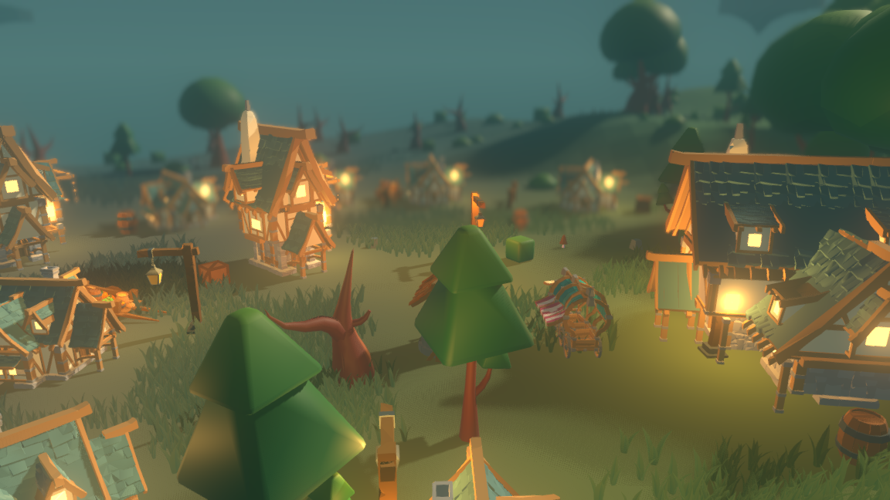
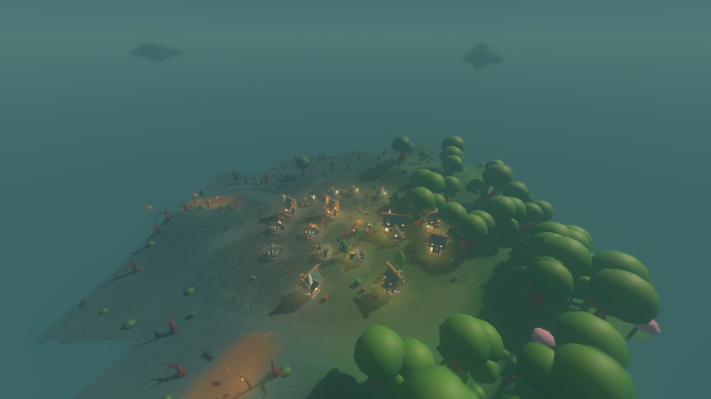
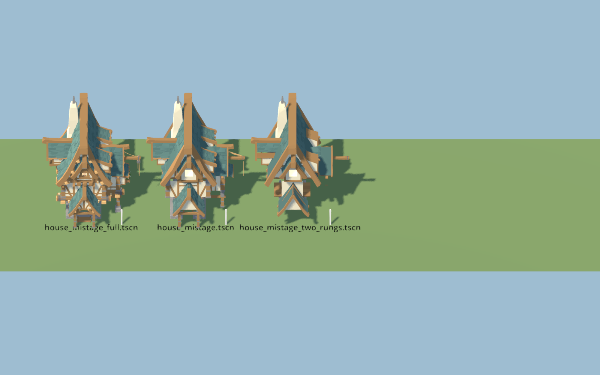
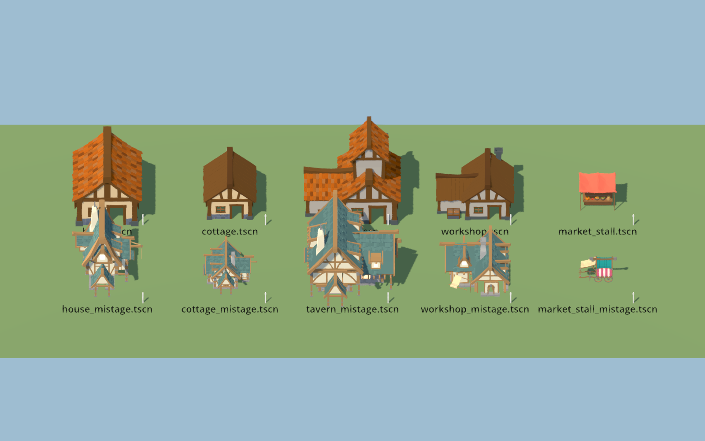
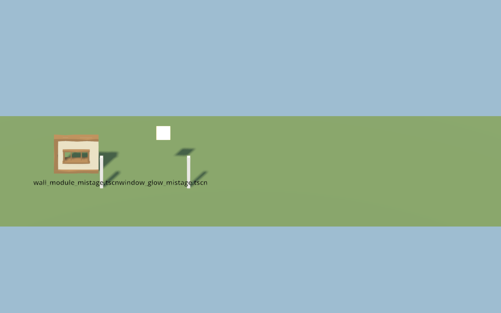

# The Mistage village and market packs, behind five tags

The two Daniel Mistage packs the user bought — *STYLIZED Fantasy Village* (808
models) and *STYLIZED Fantasy Market* (548 models) — now draw the village's
**house**, **tavern**, **workshop** and **market_stall**, and give the
**window_glow** tag its first real model. The buildings are timber-framed
townhouses with teal shingle roofs and lit windows the pack drew itself, which is
the amber-on-blue night beat of the design's section 9.1 with a subject at last.



Seed 11 at (−254, −1821), a deep-forest village whose blended ambient is
`(0.393, 0.472, 0.472)` — the dimmest village found by sweeping eight seeds and
17 × 17 settlement cells each, and the biome's own light rather than a night
filter. No twilight marsh in that sweep has a village in it, so this is as
night-ish as the world's own ambient gets today. Nothing is graded for the
photograph: it is `run_render.sh` with the settings the game runs at, aimed.

```
xvfb-run -a ./run_render.sh --seed 11 --start -254 -1821 --paused \
	--camera 0 8 16 --aim 3 --fov 45 --focus 16 \
	--screenshot "$PWD/reports/assets/mistage-village-night.png" \
	--screenshot-frame 100
```

The same village from the height the game is played at, which is the shape the
signature takes in play — warm pinpoints scattered through teal gloom:



---

## Three defects, three repeatable steps

### 1. Textures: five files, one command

Every FBX in both packs names its textures by an absolute path off the artist's
own machine —

```
C:\Users\DanielPC\Armory Built In\Assets\Daniel Mistage\
    STYLIZED Fantasy Village - Low Poly 3D Art\Textures\TEXTURE_BLUE.png
```

— so nothing resolves and Godot falls back to looking for the **basename** beside
the model and in its parent directories. It searches at least three levels up:
an FBX at `a/b/c/model.fbx` binds a texture sitting at `a/`, which was measured
before anything was built on it. The archives ship the same atlases under
different names, prefixed `SFV_` and `SFT_`. So the whole fix is to put each
shipped atlas at the pack root under the name the FBX asks for — **five files, no
material path edited, no FBX rewritten**:

| pack | shipped file | copied to | asked for by | models |
| --- | --- | --- | --- | ---: |
| village | `SFV_TEXTURE_BLUE.png` | `TEXTURE_BLUE.png` | `SFV_MAIN_MATERIAL` | 759 |
| village | `SFV_TEXTURE_ORANGE.png` | `TEXTURE_BRICK.png` | `SFV_ROOF_ORANGE` | 57 |
| village | `SFV_NATURE.png` | `NATURE.png` | `SFV_NATURE` | 4 |
| market | `SFT_MAIN_TEXTURE.png` | `TEXTURE.png` | `MAIN_MATERIAL` | 541 |
| market | `SFT_NATURE_TEXTURE.png` | `NATURE 2.png` | `NATURE_MATERIAL` | 5 |

That table is not guesswork. Each FBX carries a `Video` node whose *name* is the
pack's own filename for the texture and whose *filename* is the dead Windows
path, so the mapping is written in the files. `tools/fbx_texture_map.py` parses
the binaries and prints it, without loading the engine:

```
$ ./tools/fbx_texture_map.py assets/mistage_village assets/mistage_market
=== assets/mistage_village: 808 models
  material                    atlas the artist named      basename asked for   models
  SFV_MAIN_MATERIAL           SFV_TEXTURE_BLUE            TEXTURE_BLUE.png        759
  SFV_TRANSPARENT             SFV_MAIN_TEXTURE            TEXTURE.png              73  MISSING
  SFV_ROOF_ORANGE             SFV_TEXTURE_ORANGE          TEXTURE_BRICK.png        57
  SFV_DOUBLE_SIDED_MATERIAL   SFV_MAIN_TEXTURE            TEXTURE.png              12  MISSING
  SFV_NATURE                  SFV_NATURE                  NATURE.png                4
  materials that name no texture at all (emissive/glow; not a failure):
  SFV_GLOW_WINDOW             -                           -                        91
  SFV_GLOW_FLAME              -                           -                        10
  SFV_GLOW_YELLOW             -                           -                         5
  NOT FINDABLE at or above the model:
    SFV_TRANSPARENT wants TEXTURE.png, on 73 models
    SFV_DOUBLE_SIDED_MATERIAL wants TEXTURE.png, on 12 models
=== assets/mistage_market: 548 models
  material                    atlas the artist named      basename asked for   models
  MAIN_MATERIAL               DiffuseColor_Texture        TEXTURE.png             541
  TRANSPARENT                 TEXTURE.png.002             TEXTURE.png              11
  NATURE_MATERIAL             DiffuseColor_Texture.392    NATURE 2.png              5
  materials that name no texture at all (emissive/glow; not a failure):
  GLOW_YELLOW                 -                           -                        26
  CANDLE_FIRE                 -                           -                        17
  GLOW_PINK                   -                           -                         6
```

`tools/extract_mistage.sh` unpacks both archives and does exactly the five
copies. Running it again from the `.rar` files reproduces the same tree:

```
$ ./tools/extract_mistage.sh
808 models into assets/mistage_village, 3 atlas name(s) mapped
548 models into assets/mistage_market, 2 atlas name(s) mapped
```

And the binding is then proved from a command rather than claimed, per material
rather than per model:

```
$ ./tools/inventory_pack.sh assets/mistage_market --require-textures --every-material \
      --except-material GLOW_ --except-material CANDLE_FIRE
548 models, 1170781 triangles, 5 with no albedo bound (0 of those excused)
every material in every model binds an albedo texture
OK: every material in the 548 models binds its albedo, or is excused by name

$ ./tools/inventory_pack.sh assets/mistage_village --require-textures --every-material \
      --except-material SFV_GLOW_ --except-material SFV_TRANSPARENT \
      --except-material SFV_DOUBLE_SIDED_MATERIAL
808 models, 1598171 triangles, 12 with no albedo bound (0 of those excused)
every material in every model binds an albedo texture
OK: every material in the 808 models binds its albedo, or is excused by name
```

The check is worth something because it fails without the excuses:

```
$ ./tools/inventory_pack.sh assets/mistage_village --require-textures --every-material
  material 'SFV_DOUBLE_SIDED_MATERIAL' bound no albedo on 12 surface(s)
  material 'SFV_GLOW_FLAME' bound no albedo on 21 surface(s)
  material 'SFV_GLOW_WINDOW' bound no albedo on 202 surface(s)
  material 'SFV_GLOW_YELLOW' bound no albedo on 5 surface(s)
  material 'SFV_TRANSPARENT' bound no albedo on 147 surface(s)
FAIL: 5 material(s) bound no albedo
```

**The exceptions are two materials, not eighty-five models.** `SFV_TRANSPARENT`
(window glass, 73 models) and `SFV_DOUBLE_SIDED_MATERIAL` (six ivies and six
flowers, 12 models) both name `TEXTURE.png` from *STYLIZED The Alchemist's
Workshop* — a different Mistage pack, which this archive does not contain and
which this task's boundary keeps archived. No model's *main* material is
affected, and no tag the table resolves depends on either: the glass draws as a
flat colour, so the bake below simply leaves it out. The three glow materials
name no texture at all, by design; see the lit window below.

### 2. Scale: the packs are already metres, and this world is not

The earlier survey recorded these packs arriving "at a thousand times scale".
Under Godot 4.7.2's importer they do not. Every file in both packs carries
`UnitScaleFactor = 100` — centimetres — and the importer applies it, so what
arrives is real-world metres:

| measured, as imported | metres |
| --- | --- |
| `SFV_Door_001` | 1.073 × **2.204** × 0.245 |
| `SFV_Barrel_001` | 0.787 × **0.956** × 0.787 |
| `SFV_Stool_001` | 0.352 × **0.543** × 0.363 |
| `SFV_Wall_Wooden_Window_M_001` | **3.000** × 3.000 × 0.596 |
| `SFM_Tavern_Table_002` | 1.961 × 0.899 × 1.241 |

A 2.20 m door and a 0.54 m stool are correct, not a unit error. What is out of
scale is the *world*, which is a toy diorama: a JustCreate house is 5.87 × 5.46 ×
6.65, and the simulation reserves 5.2 × 6.0 of ground for one in
`SettlementField.BUILDING_FOOTPRINTS`, which no file in the render layer may
edit. The Mistage whole-building models are genuine three-storey townhouses at
11.6 to 18.8 m across.

So the normalisation is per source directory, and each factor is the number that
makes the model the size of the thing it stands beside. For a building that is
`min(reserved width / model width, reserved depth / model depth)`, which is the
same rule the JustCreate wrappers already follow (House_01 at 0.886 is 5.20 ×
5.89 in a 5.2 × 6.0 plot):

| | as imported (m) | factor | as baked (m) |
| --- | --- | ---: | --- |
| **building** `SFV_Building_Empty_Blue_002` | 13.818 × 17.524 × 13.028 | 0.376 | 5.196 × 6.588 × 4.899 |
| **prop** `SFM_Veg_Stall_003` | 5.851 × 4.171 × 3.743 | 0.478 | 2.797 × 1.994 × 1.789 |
| **modular kit** `SFV_Wall_Wooden_Window_M_001` | 3.000 × 3.000 × 0.596 | 0.376 | 1.128 × 1.128 × 0.224 |

The kit takes the *building's* factor, not one of its own, because the kit is
what those buildings are made of: at 0.376 a 3.000 wall module is 1.128 beside a
6.588 house, which is the storey the house is drawn with.

One directory really is out of scale and it is stated rather than fixed:
`village/FBX/Windmill`, three models at 51 to 73 m tall — roughly ten times a
windmill. Nothing points at them; the `water_wheel` tag stays where it was.

### 3. Mesh nodes: 149 to 302, down to one

The pack exports the artist's kit unmerged, so a building arrives as hundreds of
separate `MeshInstance3D` nodes. `SFV_Building_Empty_Blue_003` — the model the
`workshop` tag now uses — is the 149-node case the survey named; the six exterior
shells run from 149 to 302, and the furnished interiors reach 338.
`tools/bake_mistage.sh` merges every surface into one per material, applies the
scale, drops the glass, and writes one scene:

| baked model | mesh nodes | surfaces | triangles | of which |
| --- | --- | --- | --- | --- |
| `house_mistage` | 218 → **1** | 222 → **2** | 39 712 → **17 090** | 17 058 wall + 32 glow |
| `cottage_mistage` | 189 → **1** | 191 → **2** | 34 460 → **15 078** | 15 056 + 22 |
| `tavern_mistage` | 302 → **1** | 308 → **2** | 62 912 → **26 924** | 26 882 + 42 |
| `workshop_mistage` | **149** → **1** | 153 → **2** | 32 469 → **10 319** | 10 299 + 20 |
| `market_stall_mistage` | 5 → **1** | 5 → **1** | 9 734 → **9 734** | — |
| `wall_module_mistage` | 1 → **1** | 1 → **1** | 310 → **310** | — |
| `window_glow_mistage` | 2 → **1** | 2 → **1** | 62 → **6** | glow only |

Two surfaces rather than one, deliberately: the wall and the lit windows are
separate materials and have to stay separate, because one of them emits light.

The triangle drop in the middle column is the second half of the bake. Godot's
own importer builds a level-of-detail ladder for every mesh it imports
(`meshes/generate_lods=true`), and merging surfaces by hand throws it away, so
the bake runs the same meshoptimizer pass on the merged result — and then climbs
it. Each recipe carries a `budget`, and the ladder is climbed the same number of
rungs on every surface until the whole model is under it. Every model here is one
rung up and no further, because one rung is as far as they could be climbed
without the difference showing:



At two rungs a house loses the timber bracing on its gable and the roof edge goes
ragged. Surfaces below 256 triangles are left alone whatever the budget says: the
lit windows are 20 to 42 triangles, climbing that ladder saves nothing, and at
one rung the six small panes of a house collapse into one bright rectangle across
its gable — which is the thing the village is lit by.

The ladder below the shipped top is rebuilt, so distance still costs less:
`house_mistage` is 17 058 → 6 174 → 1 958 → 796 → 248.

---

## What the packs took, and what they did not



Top row is what each tag drew before, bottom row is the Mistage model, at
identical framing with a one-metre post beside each.

| tag | model | one sentence |
| --- | --- | --- |
| `house` | **Mistage** `SFV_Building_Empty_Blue_002` | Three storeys with a jetty, a shingle roof and six lit windows against the JustCreate house's one and a half, and it is the tallest of its pack's six, which is what gives a village a skyline. |
| `tavern` | **Mistage** `SFV_Building_Empty_Blue_005` | The biggest of its pack's six, with a balcony down one side and a second roof over a wing, in the only plot big enough to hold it. |
| `workshop` | **Mistage** `SFV_Building_Empty_Blue_003` | The one building in either pack with canvas awnings stretched over its ground floor and a stone chimney up its end wall, which is the only thing on disk that reads as somewhere work happens. |
| `market_stall` | **Mistage** `SFM_Veg_Stall_003` | The one model on disk that is a stall *and* its vendor goods in one piece — a striped awning over a trestle of crated fruit with cartwheels under it — where the JustCreate stall is a bare counter and a canopy in two nodes. |
| `window_glow` | **Mistage** `SFV_Windows_Glow_001` | The pack's own leaded pane and the material its buildings light their windows with, so a fitted pane and the window behind it are lit by one thing. |
| `cottage` | **JustCreate stays** | See below. |
| everything else | **unchanged** | Flora, rocks, bridges, lanterns, fences, carts, barrels, crates, the well, the tower and the water wheel all stay on KayKit or JustCreate; this task took only the five rows above. |

### The cottage stays on JustCreate, and it was tried

`assets/mistage_baked/cottage_mistage.tscn` is baked, photographed in the sheet
above, and not pointed at. Three numbers kept it out.

1. **Cost.** Cottages are 7.7 of a village's 12.6 buildings. At 15 078 triangles
   each that row alone would be 116 312 triangles a village, against the
   JustCreate cottage's 55 381 — an extra 79% of *everything a village drew
   before*, spent on the building that is on screen smallest.
2. **Size.** No Mistage building fits the 4.0 × 4.4 plot a cottage reserves
   without coming down to **2.62 m** tall, two-thirds of the JustCreate
   cottage's 3.53. It reads as a bungalow among six-metre houses.
3. **It has no wall left.** At 2.62 m its eaves overhang the only wall a pane can
   sit on, and the lit-window fit puts the pane **0.315** off the model's
   surface — past the 0.25 `tests/test_window_glow.gd` allows. That check
   failing is the model saying, in the project's own terms, that it has no flat
   wall at window height.

### The lit window

`window_glow` had no model at all: the table drew an amber quad of its own,
because nothing on disk was a lit window. `SFV_Windows_Glow_001` is the one model
in either pack whose entire content is the `SFV_GLOW_WINDOW` material — leaded
glass in six triangles rather than a flat rectangle in two — and it is the same
material the four buildings carry on their own windows.

What the pack does *not* ship is any light. The FBX carries a diffuse colour
`(0.951, 1.000, 1.000)` and nothing else, because the glow lived in the Unity
shader the artist assigned and that does not travel in the file. So the geometry
and the material are the pack's and the emission is this project's: `AMBER` at
2.40, exactly what the quad emitted, applied by the bake. The pane comes out
0.348 × 0.451 — inside the 0.45 × 0.45 the fit reserves — centred on the point it
is given, at `WINDOW_HEIGHT`, facing +Z, which is the way the placeholder quad
faced.



---

## What it costs

`tools/measure_village.sh` asks the settlement field what a village places, asks
the mapping table what each tag resolves to, and adds up the triangles. Nothing
is sampled, so the numbers are the same on any machine. 35 villages over eight
seeds:

| tag | one of them, before | one of them, after | placed per village | per village, before | per village, after |
| --- | ---: | ---: | ---: | ---: | ---: |
| `house` | 9 815 | **17 090** | 4.11 | 40 382 | **70 313** |
| `tavern` | 11 636 | **26 924** | 0.94 | 10 971 | **25 385** |
| `workshop` | 5 838 | **10 319** | 0.09 | 500 | **884** |
| `market_stall` | 7 832 (2 nodes) | **9 734** (1 node) | 1.54 | 12 084 | **15 018** |
| `window_glow` | 2 | **6** | 18.29 | 37 | **110** |
| `cottage` | 7 179 | *unchanged* | 7.71 | 55 381 | 55 381 |
| **whole village** | | | | **146 468** | **194 205** |

Every newly resolved tag is **two materials** (wall and glow) except
`market_stall` and `window_glow`, which are one each. Every one of them is one
mesh node, where the buildings were one node before and the stall was two — so
the swap adds triangles and *removes* a node per stall.

### Does it still stream?

The stop condition on this task says that if the merged buildings cost materially
more per village than the world draws today, the frame cost has to be reported
with and without them rather than shipped on faith. A village is 32.6% dearer, so
here is the frame, at seed 1234's village, paused, at 640×360, with everything
else identical:

| | JustCreate buildings | Mistage buildings | change |
| --- | ---: | ---: | ---: |
| triangles in the scene | 3 394 591 | 3 442 859 | +48 268 (+1.4%) |
| primitives drawn per frame | 4 955 490 | 5 235 042 | +279 552 (+5.6%) |
| draw calls | 2 173 | **2 107** | **−66** |
| objects in frame | 3 328 | 3 357 | +29 |
| frame ms, median | 1 995.44 | 2 127.62 | +132.2 (+6.6%) |

Those frame times are `llvmpipe` — software rasterisation on a machine with no
GPU — so they are a ratio and not a frame rate. What the ratio says is that a
village's share of a frame is small: the village's own triangle count went up
32.6% and the scene's went up 1.4%, because a frame is mostly grass, ground and
trees. And the merge means the extra geometry arrives in **66 fewer draw calls**
than before, not more — a village of Mistage buildings is fewer objects to issue
than a village of JustCreate ones, because a stall that was two nodes is now one.

For comparison, the run where `cottage` was Mistage as well — the version this
report rejects — came out at 3 513 950 triangles and 2 196.33 ms, so the cottage
alone was half the frame cost of the whole swap.

The knob, if a village ever has to get cheaper, is the `budget` on each recipe in
`tools/bake_mistage.gd`. One more rung takes the house from 17 090 to 6 186 and
the tavern from 26 924 to 4 754 — below what the JustCreate models cost — at the
loss of detail photographed above.

---

## Nothing under `sim/` moved

| check | result |
| --- | --- |
| files under `sim/` changed | **0** (none has an mtime inside this task) |
| world fingerprint, seed 1234, 100 ticks | `a6aa8e5776ebfe8c` — unchanged |
| render-shell digest, seed 1234 | `6632a1670de95ded` — unchanged |
| `./run_tests.sh --layers-only` | `res://sim references nothing in the render layer`; `res://sim names asset tags and no asset` |

---

## Reproducing all of it

```
./tools/extract_mistage.sh                 # unpack both .rar files, map five atlas names
./tools/fbx_texture_map.py assets/mistage_village assets/mistage_market
./tools/inventory_pack.sh assets/mistage_village --require-textures --every-material \
    --except-material SFV_GLOW_ --except-material SFV_TRANSPARENT \
    --except-material SFV_DOUBLE_SIDED_MATERIAL
./tools/bake_mistage.sh                    # merge, scale, budget, write assets/mistage_baked/
./tools/measure_village.sh                 # what a village is made of, exactly
```

`assets/mistage_village/`, `assets/mistage_market/` and `assets/mistage_baked/`
are all ignored by git, for the reason the JustCreate pack is: they are
reproducible from archives already on disk, and they are paid art.

## Left open

* **The other six Mistage packs stay archived.** This task's boundary. One of
  them, the Alchemist's Workshop, holds the atlas the village pack's glass and
  ivies point at; unpacking it would bind those two materials.
* **Interiors.** The pack ships furnished interiors for all six buildings
  (`Buildings/Buildings/`, 15–20% more triangles than the shells used here) and
  124 interior props. Out of scope by the task, and by the settlement layer,
  which places buildings as whole units.
* **The modular kit is baked but not built with.** 223 wall pieces, 176 empty
  wall pieces, 80 roof pieces and 23 stair pieces, all on a 3.000 m module,
  measured and scaled to the buildings' own factor. Assembling a building out of
  them is procedural-footprint work the settlement layer does not have.
* **The cottage.** Either a smaller Mistage shell than the pack ships, or a
  cottage plot large enough for one of the six.
