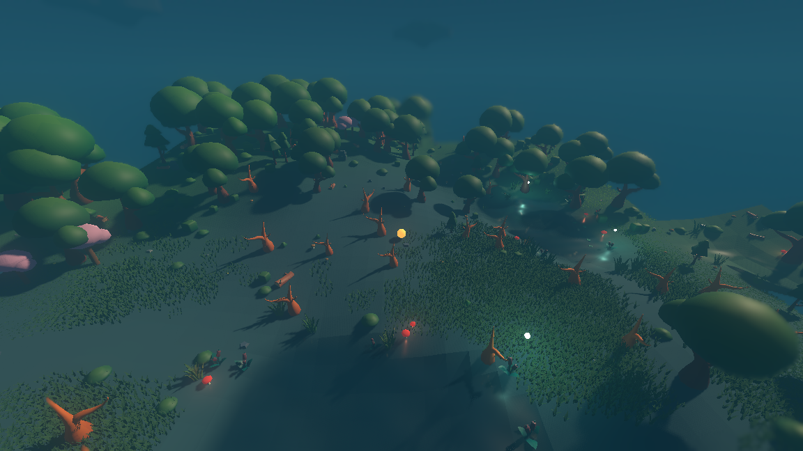
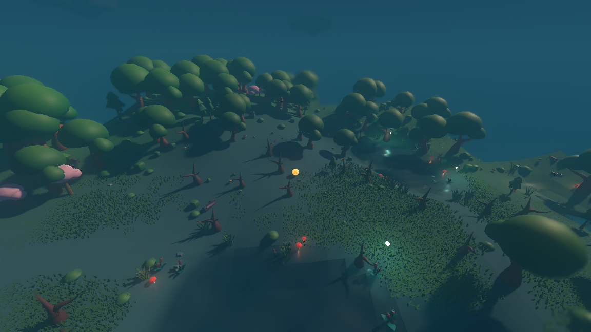
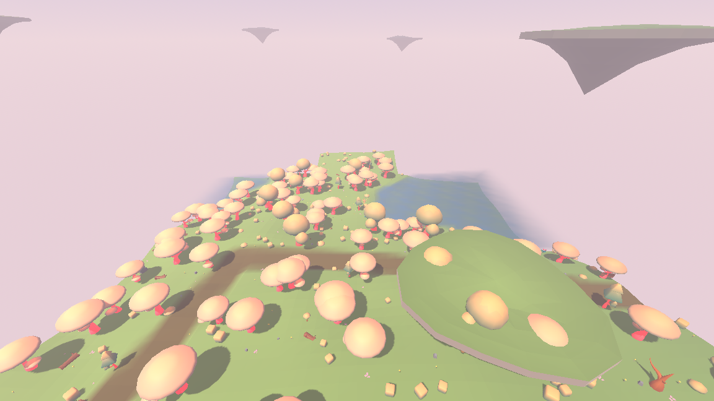
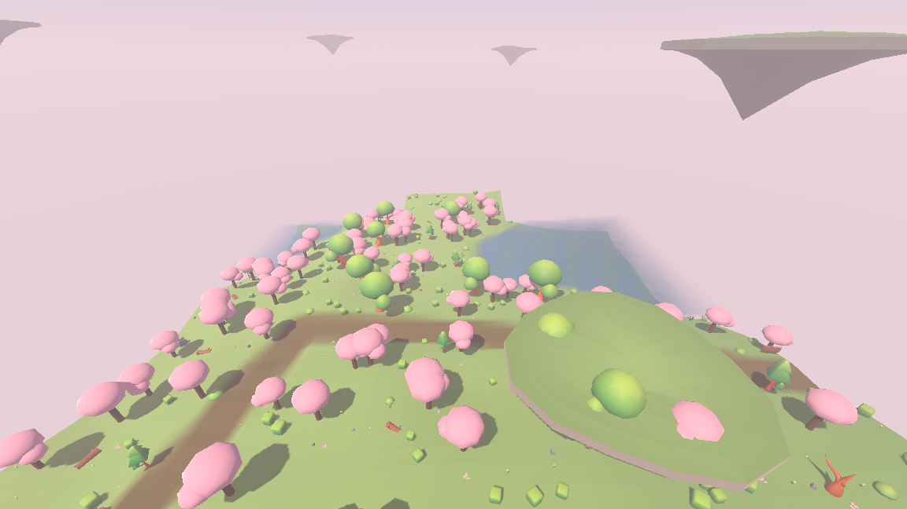
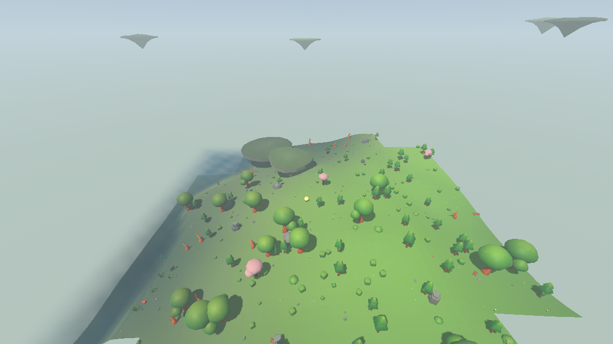
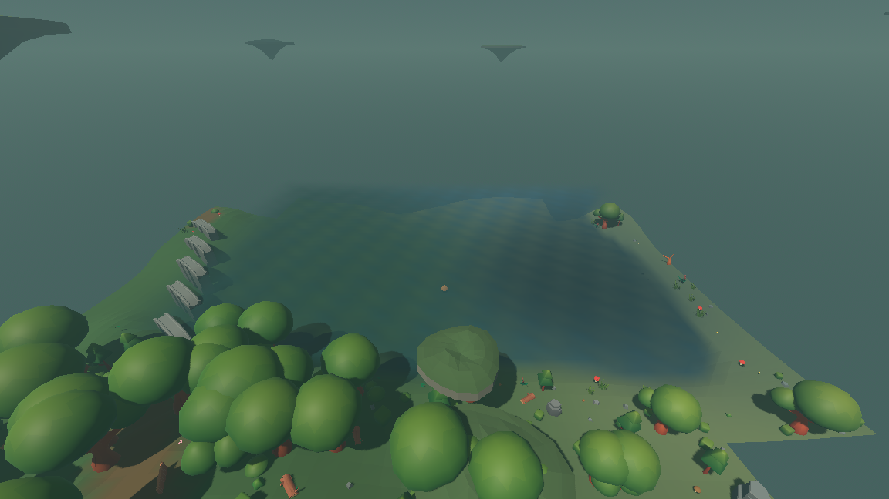
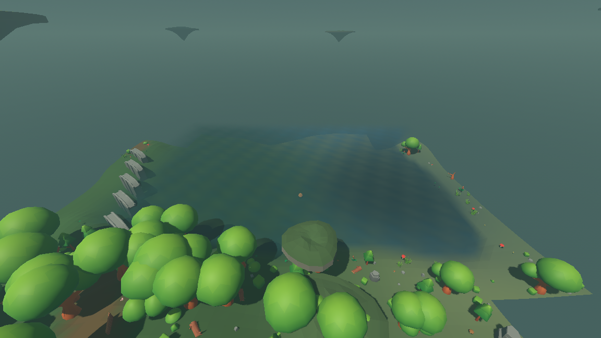

# Pack models take the biome tint

A placeholder part could carry a *tint role* — `tree`, `rock`, `ground`, `water` —
and the render layer mixed its colour towards the blended biome profile at that
position. So the same `fir` was deep green under canopy and bright green in the
meadow, with the colours living in the simulation's biome catalog. When the rows
were repointed at KayKit models, that stopped: a pack model brings its own
texture and ignored the profile, so every tree in every biome was the one green
the atlas happens to be, and "crossing a border shifts the mood" reached only the
ground, the water and the fog.

It reaches the trees and the rocks again. The change is three files in the render
layer; nothing under `sim/` moved and the world is byte-identical. A later pass
closed the step at which it could still fail to reach one — see "The step the
tint failed at" below — in the render layer and the asset report, again with the
world untouched.

## What the packs actually look like inside

The shape of the fix was decided by what the models are, not by what would have
been convenient:

```
Tree_4_A_Color1.gltf
  Tree_4_A_Color1 [MeshInstance3D] mesh=ArrayMesh surfaces=1
    surf0  StandardMaterial3D  albedo=(1,1,1,1)  tex=forest_texture.png
```

One mesh, **one surface**, one material, one shared atlas — and the brown trunk
and the green canopy are two corners of that one texture. There is no seam to
hang two roles on. Sampling the texels each model actually uses says the same
thing from the other side:

| model | the texels it draws with |
| --- | --- |
| `Tree_3_B_Color1.gltf` | a foliage ramp from (0.13, 0.49, 0.22) to (0.48, 0.73, 0.24) |
| `Tree_4_A_Color1.gltf` | that ramp, plus trunk browns (0.64, 0.30, 0.17) and (0.71, 0.35, 0.18) |
| `Rock_1_D_Color1.gltf` | greys around (0.45, 0.49, 0.51) |

## The decision: one role for the whole model, applied as a shift

**A scene row carries one tint role for the entire model**, not a role per part.
The compromise that buys is named plainly: **a tree's trunk moves with its
canopy.** Under canopy the trunk darkens and cools along with the leaves; in a
meadow neither moves at all.

The second half of the decision is what keeps that compromise cheap. The tint is
applied as a **shift**, not a replacement:

$$\text{albedo} = \text{albedo}_{\text{pack}} \times \Big(1 + m\big(\tfrac{c_{\text{biome}}}{c_{\text{reference}}} - 1\big)\Big)$$

where $c_{\text{biome}}$ is the blended profile's colour for the row's role, $m$
is the row's mix, and $c_{\text{reference}}$ is the colour the pack's art already
reads as. Dividing rather than replacing is what lets one multiplier serve a
whole model: scaling the *surface* by the ratio between this biome's foliage
green and open-meadow green moves the canopy to the biome's green and carries the
trunk along in the same proportion, instead of painting both flat.

The reference colours are the placeholder palette's own `LEAF` (0.30, 0.55, 0.30)
and `STONE` (0.58, 0.58, 0.56). That is not a coincidence dressed up as a reason:
`LEAF` is exactly the meadow's `tree_tint`, so a model standing in open meadow
comes out with a multiplier of exactly white — *as the artist drew it* — and the
two paths agree numerically everywhere else. In blended deep forest at
(64, 0), seed 1234:

| | colour drawn |
| --- | --- |
| placeholder canopy: `LEAF.lerp(tint, 0.75)` | (0.251, 0.419, 0.270) |
| model: `LEAF × multiplier(0.84, 0.75, 0.91)` | (0.253, 0.412, 0.273) |

A placeholder fir and a pack fir are the same green in the same biome, by
construction.

## Which row takes which role

Nineteen of the thirty-four scene rows take a tint; the other fifteen are wood,
plaster, thatch and cloth, which are the same in every biome. Every row's role
and mix mirrors what its placeholder carried, so the two can be read against each
other. `./run_assets.sh` prints this live — a row now describes itself as
`scene <path> tinted <role> <mix>`.

| tag | model | role | mix | placeholder role(s) |
| --- | --- | --- | --- | --- |
| grass | Grass_2_B_Singlesided_Color1.gltf | tree | 0.75 | tree 0.75 |
| fern | Bush_3_A_Color1.gltf | tree | 0.75 | tree 0.75 |
| bush | Bush_2_C_Color1.gltf | tree | 0.75 | tree 0.75 |
| hardy_shrub | Bush_4_A_Color1.gltf | tree | 0.55 | tree 0.55 |
| reed | Grass_2_C_Color1.gltf | tree | 0.75 | tree 0.75 |
| cattail | waterplant_C.gltf | tree | 0.60 | tree 0.75, none |
| lily_pad | waterlily_A.gltf | tree | 0.45 | tree 0.45 |
| fir | Tree_4_A_Color1.gltf | tree | 0.75 | none, tree 0.75 |
| canopy_tree | Tree_1_B_Color1.gltf | tree | 0.75 | none, tree 0.75 |
| dead_tree | Tree_Bare_1_B_Color1.gltf | tree | 1.00 | tree 0.45 |
| fallen_log | Wood_Log_A.gltf | tree | 1.00 | tree 0.45 |
| pebble | Rock_2_A_Color1.gltf | rock | 0.75 | rock 0.75 |
| gravel | rock_single_A.gltf | rock | 0.75 | rock 0.75 |
| boulder | Rock_1_D_Color1.gltf | rock | 0.75 | rock 0.75 |
| rock_spire | Rock_3_I_Color1.gltf | rock | 0.75 | rock 0.75 |
| stone_henge | stone_henge.tscn | rock | 0.75 | rock 0.75 |
| fence | fence.tscn | none | -- | none |
| cart | cart.tscn | none | -- | none |
| barrel | barrel_small.gltf | none | -- | none |
| crate | crate.tscn | none | -- | none |
| market_stall | market_stall.tscn | none | -- | none |
| water_wheel | water_wheel.tscn | none | -- | none |
| crafting_bench | crafting_bench.tscn | none | -- | none |
| house | house.tscn | none | -- | none |
| cottage | cottage.tscn | none | -- | none |
| tavern | tavern.tscn | none | -- | none |
| workshop | workshop.tscn | none | -- | none |
| tower | tower.tscn | rock | 0.35 | rock 0.35, none |
| well | well.tscn | rock | 0.35 | rock 0.35, none |
| bridge_wood | bridge_wood.tscn | none | -- | none |
| bridge_stone | bridge_stone.tscn | rock | 0.35 | rock 0.35 |
| rope_ladder | rope_ladder.tscn | none | -- | none |
| lantern_post | lantern_post.tscn | none | -- | none |
| hanging_lantern | hanging_lantern.tscn | none | -- | none |

Three rows differ from their placeholder and say why. `cattail` drops from 0.75 to
0.60 because the placeholder tinted only its stems and left the brown head alone,
while the model is one piece. `fir` and `canopy_tree` keep 0.75 even though the
placeholder trunk carried no role at all — that is the compromise above, taken
deliberately, because weakening the mix to protect the trunk would weaken the
canopy shift that is the whole point.

### The two bare-bark rows, added later

`dead_tree` and `fallen_log` carried no role at all when this document was first
written, on the reasonable-looking grounds that wood is wood. In the twilight
marsh that was wrong in a way nothing else in the table is wrong: the pack draws
bare bark a warm orange-brown, and a bare tree has no canopy, so the warm bark
*is* the whole model. Against the marsh's teal they were the brightest objects in
the frame, and reports/atmosphere.md's second reference beat recorded them as
"bright orange" — a tinting miss rather than a lighting one.

They now take the foliage role at **full strength**, which is the third row in
this table to differ from its placeholder and the second to sit at 1.00. The
argument is the blossom tree's, turned round: a fir's green is already most of the
way to any biome's green and only needs nudging, while nothing about bare bark
belongs to the marsh until the tint puts it there, and at three quarters it still
came out the warmest object in a teal frame. In the meadow, whose foliage colour
*is* the reference the gain is taken against, the gain is exactly white and the
bark is the brown the pack drew — so nothing changes anywhere the miss was not.

reports/atmosphere.md §7.1 shows the pair with and without `--no-model-tint`, and
tests/test_asset_tags.gd holds the claim as arithmetic: the row takes the foliage
role, its marsh gain has less red than blue and keeps under 55% of its red, and
its meadow gain is white to within the tint cache's quantisation.

That pair is worth reading for what it is: `--no-model-tint` untints *every*
model, so its left-hand frame also has meadow-green canopies in a twilight marsh.
"Before and after, in the marsh" below is the narrower pair — the same frame with
only these two rows disconnected — and it is the one that shows what this row
alone is worth.

## The step the tint failed at, and why only there

The bare tree is the one place in the world where this layer was visibly wrong,
so it is worth saying exactly where the tint stopped rather than only that it now
does not. It stopped in one place, and that place is not a colour and not a
shader.

`AssetLibrary._row()` is the helper the whole table is written with, and its
sixth and seventh parameters — the model's tint role and how much of it — were
optional, with the role defaulting to `AssetVisual.TINT_NONE`:

```gdscript
static func _row(
    rows: Dictionary, tag: String, scene_path: String, parts: Array,
    scene_height: float = 0.0,
    scene_tint_role: String = AssetVisual.TINT_NONE,   # <- here
    scene_tint_mix: float = 0.0,
) -> void:
```

`TINT_NONE` is also what a fence carries on purpose. So a row that had *decided*
to keep the pack's paint and a row where nobody had said anything came out of
that helper as the same row, and nothing downstream could tell them apart:
`takes_scene_tint()` is false for both, `_scene_tint()` returns white for both
before it ever looks at a biome, and the table-wide coherence check in
`tests/test_asset_tags.gd` — role and mix must agree with each other — passes for
both, because role `none` at mix `0.00` is perfectly coherent.

**Why it caught this model and not the ones standing beside it.** Every scattered
thing in that marsh frame — the cattails, the reeds, the boulders, the canopy
trees on the ridge — was repointed at a pack model by the same edit, and every
one of those repoints passed the two trailing arguments. This one did not,
because the README's procedure for installing art is "fill in one string per
row", the bare tree's model is bark from root to tip, and *wood is wood* is true
of fifteen other rows in this table — a fence, a cart, a barrel, a crate, a
market stall, every building in a village. It is not true of a tree. The failure is that the table
had no way to hear the difference between "this is wood" and "nobody looked".

### What was changed, and what was not

The row itself was already fixed — `dead_tree` and `fallen_log` take the foliage
role at full strength, argued in "The two bare-bark rows" above. That is the symptom. This is the
cause, and it is two changes, one for each way the answer can go wrong:

**A row that says nothing is answered by its own placeholder.** Every row carries
a placeholder underneath whatever model it names, because a checkout without the
packs still has to draw a world. That placeholder is the row's own record of what
the thing is made of, written before any pack existed — a fir's canopy takes the
foliage colour and its trunk does not; a fence's slats take nothing. The default
is now `AssetVisual.TINT_UNSTATED`, a sentinel that is not a role and is never
stored, and `_row()` resolves it to `AssetVisual.placeholder_tint()` — the role of
whichever placeholder part goes furthest towards a biome colour, at that part's
mix. Filling in one string per row now carries the colour across instead of
dropping it, and a row that means "wood is wood" still gets that for free,
because its placeholder is wood.

**A row that says the wrong thing is named out loud.** Inheritance cannot help a
repoint that states `TINT_NONE` deliberately, which is closer to what actually
happened. `AssetLibrary.dropped_tints()` walks the table and returns every row
whose model takes a different colour from the placeholder it replaced — or none
where the placeholder took one. `./run_assets.sh` prints the count and exits 1 on
any, and `tests/test_asset_tags.gd` holds it at zero.

Neither is a rule about bare bark, which is the point: over the forty-four rows,
`dropped_tints()` is empty today and was two lines long before the row was fixed —
`dead_tree` *and* `fallen_log`, the second of which no test had ever named.

### The table did not move

The resolution reproduces every one of the forty-four rows exactly as they read
before, because the nineteen tinted scene rows all state their role explicitly
and the fifteen untinted ones all sit over untinted placeholders:

| | before | after |
| --- | --- | --- |
| scene rows taking a biome colour | 19 | 19 |
| roles and mixes changed | — | 0 |
| `dropped-tints` reported by `./run_assets.sh` | (not measured) | 0 |

Three rows still differ from their placeholder on purpose and still say so:
`cattail` at 0.60 against a placeholder's 0.75, and the two bare-bark rows at 1.00
against 0.45. Stating the role remains the preferred form; what changed is that
*not* stating it can no longer mean "no colour".

## Before and after, in the marsh

Seed 1234, a twilight-marsh pocket at (−216, −504), `--camera 0 20 34 --aim 2`,
captured at frame 150 — the framing `reports/atmosphere.md` uses for section
9.1's second reference beat. The "before" frame is the table as it stood when
that beat was photographed: the two bare-bark rows silent, and silence meaning no
colour.

| before | after |
| --- | --- |
|  |  |

```
xvfb-run -a ./run_render.sh --seed 1234 --start -216 -504 --paused \
    --camera 0 20 34 --aim 2 \
    --screenshot "$PWD/reports/assets/marsh-dead-tree-after.png" --screenshot-frame 150
```

Everything else in both frames is identical work: the same seed, the same camera,
the same tick, the same canopy trees already taking the biome's dark green, the
same grey-teal ground, the same orbs and toadstools. The only rows that differ
are the two bare-bark ones.

Counted rather than described — **a warm pixel is one whose red exceeds its blue
by more than 30 of 255**, which in a biome that is teal everywhere is a fair proxy
for "reads as the wrong temperature":

| frame | warm pixels | share of the 1152×648 frame |
| --- | --- | --- |
| before | 4648 | 0.62% |
| **after** | **1500** | **0.20%** |
| after, a second run of the same command | 1496 | 0.20% |

The third row is the noise floor: the grass wind, the drifting motes and the orbs
are animated, so no two captures of frame 150 are pixel-identical. It moves the
count by 4. The fix moves it by 3148. What survives in the "after" frame is the
glowing orbs, the red toadstool caps and the warm point lights — the things in
that pocket that are *supposed* to be warm.

## The check has teeth

Put back exactly as it was — `_row()`'s default returned to `TINT_NONE` and the
two bare-bark rows returned to five arguments — the asset-tag suite fails eleven
checks and `./run_assets.sh` exits 1:

```
FAIL  asset tags 1011 checks, 11 failed
   - the dead tree names a model and takes no biome tint, which is what made it read bright orange against the marsh
   - the dead tree follows '' rather than the foliage colour
   - a dead tree takes 0.00 of the biome colour and the fir beside it takes 0.75; the bare one has more to correct
   - a dead tree in the twilight marsh is gained (1.000, 1.000, 1.000), which does not take the red out of orange bark
   - a dead tree in the twilight marsh keeps 100% of its red, which is not enough of a shift to stop it reading as orange
   - a dead tree built in the twilight marsh carries no tinted material, so it is drawn in the orange the pack shipped
   - models that take less of the biome than the placeholder they replaced: dead_tree: placeholder tree, model none, fallen_log: placeholder tree, model none
   - a row that names a model and says nothing about its tint still ships untinted, which is the whole of why the bare tree was orange
   - a silent row inherited '' rather than the 'tree' its own placeholder takes
   - a silent row inherited a mix of 0.00 rather than its placeholder's 0.45
   - the table did not come back clean after the disconnected row was undone

$ ./run_assets.sh
tags=44 resolved=44 missing=0 unknown-rows=0 dropped-tints=2
models that drop their placeholder's biome colour: dead_tree: placeholder tree, model none, fallen_log: placeholder tree, model none
(exit 1)
```

The seventh line is the one that matters most, because it names `fallen_log`,
which no check in the suite mentions by name. That is the "next model added the
same way" the guard exists for.

Disconnecting only *half* of it separates the two mechanisms. Leave the
inheritance in place and strip only the two rows' explicit arguments, and the
silent rows now inherit `tree 0.45` from their placeholders instead of nothing —
so `dropped_tints()` is empty and the report exits 0, the colour having reached
the model — but the suite still fails the two checks that say 0.45 is not enough
for a model that is bark all the way down:

```
FAIL  asset tags 1012 checks, 2 failed
   - a dead tree takes 0.45 of the biome colour and the fir beside it takes 0.75; the bare one has more to correct
   - a dead tree in the twilight marsh keeps 72% of its red, which is not enough of a shift to stop it reading as orange
```

The dead-tree checks also grew a half they did not have: everything above them is
arithmetic on the row, and the row was never the thing on screen. They now build
the model in the marsh and in the meadow and ask what was hung on it — an
override in the marsh whose albedo has less red than blue, and no override at all
in the meadow, where the gain is white and leaving the pack's brown alone is both
correct and free.

## What it costs

`./tools/measure_tint.sh` streams a radius, builds every scattered thing in it
twice — once with the blended profile, once with none, which is exactly what this
layer did before — and counts what the renderer would have to draw it with. Seed
1234 at the origin, 20 ticks, 38 scatter chunks:

| | tint off | tint on | tint on, colours not rounded |
| --- | --- | --- | --- |
| instances built | 475 | 475 | 475 |
| mesh surfaces | 561 | 561 | 561 |
| **unique materials** | **20** | **85** | **368** |
| **unique mesh+material pairs** | **180** | **226** | **509** |
| build ms per chunk | 1.16 | 2.13 | 2.24 |

Two numbers matter. *Unique materials* is whether the cache works: 85 materials
for 475 instances is about six instances to a material, not one each. *Unique
mesh+material pairs* is the batching group count — surfaces the renderer can draw
together must share both — and it rises 180 → 226, a quarter more groups, not the
561 that a material per instance would have forced. Building a chunk of scatter
costs about one extra millisecond.

The third column is why. The biome profile is a blend, so no two positions in the
world have quite the same colour; keying a material cache on the exact one gives
368 materials and 509 batch groups, which is a material per instance in all but
name. Multipliers are rounded to thirty-seconds of a channel before they become a
material — finer than the eye follows across a gradient — and that alone is worth
4.3× on materials and 2.25× on batch groups.

The tint is hung on the instance as a **surface override**, never written into the
resource. `mesh.surface_set_material()` would write through to the one mesh every
instance in the world shares, so tinting one fir would repaint every fir already
standing. `tests/test_asset_tags.gd` checks both halves: the two instances really
do share one mesh, they come out two colours, and the material the pack loaded is
still exactly the colour it loaded as afterwards — as is a model instanced after
the fact.

## The ceiling, and why `blossom_tree` stays a placeholder

A multiply can only carry a texture so far. Where a biome's colour is *brighter*
than the reference, the gain goes above 1 and the bright end of the atlas ramp
clips. That happens in exactly one place: a blossom grove asks foliage for
(0.92, 0.66, 0.78), which is 3.07× the reference's red — and at that gain the top
of the foliage ramp, (0.48, 0.73, 0.24), lands past white. `MAX_TINT_GAIN` is
where that stops, and it binds nowhere else; every other biome and role asks for
1.25 or less, so the ceiling has no effect at all on the deep forest, the marsh
or the highland.

Three settings were photographed in the same grove before choosing 1.5:

| ceiling | what a pack bush does in a blossom grove |
| --- | --- |
| 3.0 | washes to cream — the ramp clips and the shape stops reading |
| 2.0 | goes yellow-gold |
| **1.5** | stays green under pink blossom trees |

So: **`blossom_tree` cannot be repointed at a pack tree tinted pink, and it stays
a placeholder.** It was tried — `Tree_3_B_Color1.gltf` is a round canopy 4.35
units tall, a near-exact match for the placeholder's 4.30 — with the ceiling
raised to 3.0 and the row taking the tint at full strength, which is the most pink
this approach can produce:

`xvfb-run -a ./run_render.sh --seed 1234 --start -240 24 --paused --screenshot "$PWD/reports/assets/model-tint-blossom-repointed.png" --screenshot-frame 150`
(with `MAX_TINT_GAIN` temporarily at 3.0 and `blossom_tree` pointed at `Tree_3_B_Color1.gltf`)



The canopies come out cream rather than pink, because a green texel needs a red
gain near 3 to become pink and the atlas's bright greens clip on the way; and the
trunk, which starts at 0.64 red, is driven past white and glows. The grove reads
better with the two-part placeholder kept -- a pink canopy on a dark trunk -- over
pack undergrowth that does take the tint:

`xvfb-run -a ./run_render.sh --seed 1234 --start -240 24 --paused --screenshot "$PWD/reports/assets/model-tint-blossom.png" --screenshot-frame 150`



The original reason the row stayed a placeholder — the free forest pack has one
texture atlas and it is green — turns out to be the whole of it. A tint that
multiplies cannot invert a hue; it can darken, cool and warm, which is what every
other biome asks for. Making a green model pink needs a tint that *replaces*
per texel rather than scaling it, which means a shader, and that is a bigger
change than a pink blossom tree is worth while a two-part placeholder already
draws one correctly.

## Crossing the border

Seed 1234 has a meadow at (144, −16) and deep forest 82 units away at (64, 0).
The same `fir`, `canopy_tree`, `bush` and rock tags stand on both sides.

`xvfb-run -a ./run_render.sh --seed 1234 --start 144 -16 --paused --screenshot "$PWD/reports/assets/model-tint-meadow.png" --screenshot-frame 150`



`xvfb-run -a ./run_render.sh --seed 1234 --start 64 0 --paused --screenshot "$PWD/reports/assets/model-tint-deep-forest.png" --screenshot-frame 150`



And the same deep-forest view with the models in the colours they ship in, which
is what this layer drew before the change:

`xvfb-run -a ./run_render.sh --seed 1234 --start 64 0 --paused --no-model-tint --screenshot "$PWD/reports/assets/model-tint-deep-forest-before.png" --screenshot-frame 150`



`--no-model-tint` exists only so that pair can be photographed rather than
asserted. It gates the override and nothing else — the ground, the water and the
fog still take their colours from the biome either way.

## What did not move

### when the tint was first hung on the models

* `git diff --numstat -- sim/` prints nothing. The simulation was not touched.
* The headless world is byte-identical: seed 1234 / 100 ticks `3fe6b0a686f7e81b`,
  seed 7 / 50 ticks `f7cf6841b777071a` — the same two fingerprints recorded before
  this change. (Those two values no longer reproduce: the world itself has moved
  since, for reasons recorded with the changes that moved it. They were correct
  either side of *this* change, which is what they were quoted for.)
* `./run_assets.sh` exits 0, tags=43 resolved=43 missing=0 unknown-rows=0; the
  layer check and the asset check both report OK; a headless run still loads 0 of
  the 1401 visual files and 0 of the 4 render scripts.
* All 12 suites pass headless, 23533 checks (857 → 978 in the asset-tag suite).

### when the step it could fail at was closed

* Four files changed, none of them under `sim/`: `render/asset_visual.gd`,
  `render/asset_library.gd`, `bin/asset_report.gd`, `tests/test_asset_tags.gd`.
* The headless world is byte-identical, measured rather than argued: those four
  files were reverted to their previous state, both fingerprints taken, restored,
  and both taken again. Seed 1234 / 100 ticks `a6aa8e5776ebfe8c` and seed 7 / 50
  ticks `1447bc9932999bb6`, the same on each side.
* The table is byte-identical too — all forty-four rows resolve to exactly the
  role and mix they did before, which is what makes this a change to how a row is
  *read* rather than to what any row says.
* `./run_assets.sh` exits 0, tags=44 resolved=44 missing=0 unknown-rows=0
  **dropped-tints=0**; the layer check and the asset check both report OK; a
  headless run still loads 0 of the 1401 visual files and 0 of the 8 render
  scripts.
* All 18 suites pass headless, 159012 checks (1002 → 1012 in the asset-tag
  suite).
