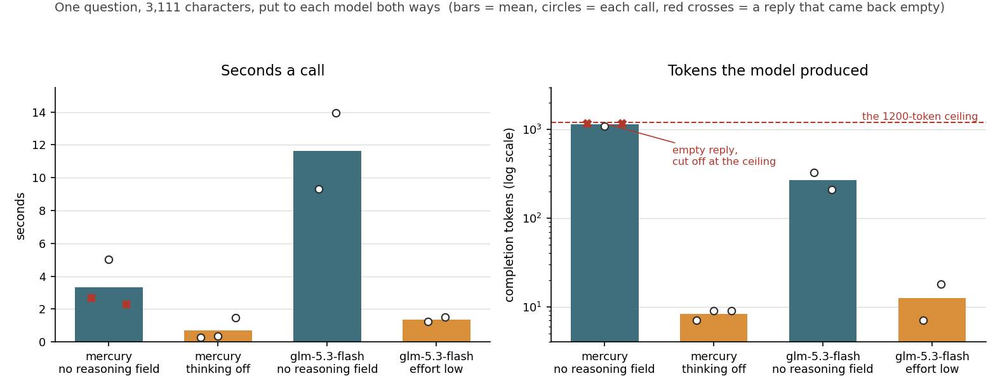

# The model layer: which model answers, what it costs, and what a recording is

Every character in this game that a person is not driving decides for itself by
being asked a question in words. This page is about the one place in the
repository that asks: what model answers now, what a call costs in seconds and
in money, why the request has to tell the model *not* to think, and what the
checked-in recording of those answers may honestly be quoted as.

Terms used below, each meant in this project's own sense:

* **A tick** is one step of the world's clock; the world runs at $20$ ticks a
  second.
* **The recording** is `net/model_recording.gd`: the questions the shipped runs
  put, asked once over a real connection, with what came back written down. It
  is why `./run_tests.sh` and `./run_agent.sh` need no key, no network and no
  model at all.
* **A replay** is a run answered out of that table rather than off the network.
* **The prompt reader** is the code that turns a line of a model's prose into an
  action — `tools/read_census.gd` counts what it makes of every recorded reply.
* **The catalogue** is the list of the twelve atomic actions with the shape of
  each one's arguments; it *faults* a line whose arguments are wrong.
* **The orchestrator** is the second model layer, the world's dungeon master: it
  spawns characters and resolves world events.

---

## The change, in two constants and one field

`net/model_call.gd` is the only file in the tree that touches the network, a
clock or a thread. It names the model, the ceiling on an answer, and — new this
cycle — how much thinking is asked for:

```
const MODEL     := "z-ai/glm-5.3-flash"
const MAX_TOKENS := 1200
const REASONING := {"effort": "low"}     # sent in the request body
```

`anthropic/claude-fable-5`, which answered every recorded reply until now, is
gone from the code, from the recording and from every transcript that replays
it.

## The reasoning field is what makes these models answer at all

This is the finding, and it is a measurement rather than an opinion. Both cheap
candidates are *reasoning models*: left to themselves they produce a long block
of private working before the one line anybody wants. At a ceiling of $1200$
tokens the working can eat the whole ceiling, and what comes back is an empty
string with `length` as the reason.

Put to the shipped run's own first question — $3{,}111$ characters, the one
`./run_record.sh` prints without `--live` — at temperature $0$:



| the same question, asked both ways | seconds a call | completion tokens | what came back |
|---|---|---|---|
| mercury, no reasoning field | 2.7 / 5.0 / 2.3 | 1,171 / 1,092 / 1,171 | two of three empty, cut off at the ceiling |
| mercury, `{"enabled": false}` | 0.28 / 0.34 / 1.46 | 7 / 9 / 9 | three of three a usable line |
| glm-5.3-flash, no reasoning field | 9.3 / 13.9 | 209 / 326 | a line, after 769 and 1,197 characters of hidden thinking |
| glm-5.3-flash, `{"effort": "low"}` | 1.26 / 1.49 | 7 / 18 | a line, and no thinking at all |

So on mercury the field is the difference between an answer and nothing; on glm
it is the difference between $1.4$ seconds and $11.6$. On neither is it an
optimisation that could be dropped.

The stronger form does not work on the model that ships: `{"enabled": false}` is
answered with HTTP $400$, *"Reasoning is mandatory for this endpoint and cannot
be disabled"*, reproduced twice this cycle and three times in the probe. Nor is
`{"effort": "minimal"}` the smaller of the two efforts — measured at $5.3$ and
$5.1$ seconds against `low`'s $2.6$ and $3.4$ on the probe's shorter prompt.

## The three passes, counted side by side

One live recording pass per model, all five tables in each, with
`OPENROUTER_API_KEY=... ./run_record.sh --live` — mercury 7m24s, glm 8m32s.
These three passes were taken on 2026-09-03; the glm column is the pass that
*won*, not the pass that is checked in today. See "The recording has moved on"
below.
Every figure is off the recording itself or off the transcripts regenerated from
it, except the token and price columns, which are the provider's own usage
figures from the probe: the recording keeps milliseconds, not usage. The
starred cell is off the probe's own shorter question, which is the only place
fable's usage was captured.

| the recording, all five tables | fable | mercury | glm-5.3-flash |
|---|---|---|---|
| replies recorded | 87 | 110 | 108 |
| replies empty | 9 | 0 | 0 |
| replies the prompt reader refused | 0 | 1 | 0 |
| replies the catalogue faults | 0 | 1 | 0 |
| seconds a call, median | 5.161 | 0.551 | 1.612 |
| seconds a call, worst | 13.429 | 14.774 | 11.430 |
| completion tokens for one action | 8–45* | 7–9 | 7–18 |
| the prompt's own example coordinate copied | 0 | 4 | 5 |
| dollars per million tokens, in / out | 10 / 50 | 0.04 / 0.15 | 0.075 / 0.25 |

| the shipped 160-tick run | fable | mercury | glm |
|---|---|---|---|
| questions put | 59 | 85 | 81 |
| turns the engine carried out and which then finished | 32 | 67 | 57 |
| turns the engine refused | 13 | 14 | 17 |
| — of those, lines nothing could be read from | 5 | 1 | 0 |
| turns that asked a tool instead of acting | 9 | 2 | 4 |
| turns still running when the run ended | 5 | 2 | 3 |
| turns of the least-served character | 7 | 2 | 12 |

Four kinds of turn — carried out and finished, refused, a tool ask, still running
when the clock stopped — are disjoint and sum to the questions put in every
column ($32 + 13 + 9 + 5 = 59$, $67 + 14 + 2 + 2 = 85$, $57 + 17 + 4 + 3 = 81$).
A line nothing could be read from is one kind of refusal and is indented under
it, not a fifth kind. So a turn that was refused, that asked a tool, or that was
still running is *not* inside the first row. Counts within one column may be
compared; counts across columns may not, because a faster model is asked more
often inside the same $160$ ticks.

| the orchestrator run | fable | mercury | glm |
|---|---|---|---|
| operations named | 6 | 15 | 9 |
| operations the engine carried out | 4 | 1 | 5 |
| characters spawned | 3 | 0 | 2 |

## Why the faster, cheaper model is not the one that ships

Mercury with its thinking off is the best thing that has ever answered the
*character* prompt here: no empty replies against fable's nine, half a second a
call against five, and twice the turns the engine carried out.

It answers the *world's* prompt degenerately. Four of its five orchestrator
answers were `spawn role=scout at=(12.5, -4.0)` — and $(12.5, -4.0)$ is the
coordinate printed in the prompt's own line explaining how a position is
written. The engine refused each one, because that point is $646$ units from the
nearest character. So mercury's world run spawned nobody, where fable spawned
three and glm spawns two with names and backstories. Since the orchestrator is
where the world gets its people, that is disqualifying.

Copying the example was not unique to mercury: glm did it five times in the pass
this table is from and ten times in the pass after it, and a local
$3$-billion-parameter model did the same thing on the character prompt. It was a
property of any model faced with a worked example, not of one provider — which is
what made it a fact about the prompt.

**And it was fixed there.** Every placeholder the prompts print is now the *name*
of what goes in the slot, in angle brackets, rather than a specimen of one:
`#<id>`, `(<x>, <z>)`, `(<x from here>, <z from here>)`, `<what you mean>`. The
punctuation that carries the syntax is unchanged, and the parser is untouched;
what changed is that a copy no longer reads back as a value, so
`ActionCatalog.fault()` refuses it with its own sentence instead of the world
silently doing something at $(12.5, -4.0)$.

Put to the four small local arms on 2026-09-05, every question of all five runs
once per arm, before and after that change:

| arm | copies before | copies after | distinct replies before | after |
|---|---|---|---|---|
| a $0.8$B arm | 108 of 113 | 1 of 84 | 10 of 113 | 22 of 84 |
| a $4$B arm | 40 of 49 | 1 of 56 | 8 of 49 | 17 of 56 |
| a small $2$B arm | 71 of 115 | 0 of 96 | 17 of 115 | 20 of 96 |
| a small $4$B arm | 95 of 140 | 23 of 125 | 18 of 140 | 17 of 125 |

Before the change the four arms between them made $14$ attempts to spawn somebody
and the engine refused every one, all of them at the example coordinate. After it
they made $8$ and the engine carried out $7$. The one arm still copying hands back
`#<id>`, which the catalogue now refuses rather than resolving to a real
character. The model that ships went from $10$ copies to $0$.

## The ceiling

`MAX_TOKENS` stays at $1200$. It is slack rather than a budget — nothing is paid
for a token that is not produced — and it now has to cover two things: whatever
working an `{"effort": "low"}` call still does (measured at none on the shipped
prompt, but not promised to be none), and the longest answer any of the five
runs asks for. That is not a character's one line at $7$ to $18$ tokens but the
orchestrator's persona block, $431$ to $516$ characters, or roughly $110$ to
$140$ tokens.

## What a recording may be quoted as

The recording names the model that answered because `bin/record_main.gd` writes
that line out of `ModelCall.MODEL`, not because anyone typed it:

```
const MODEL       := "z-ai/glm-5.3-flash"
const RECORDED_ON := "2026-09-05"
```

Two rules follow, and both matter for anything written about this project.

**A recording is one draw, not a constant.** Even at temperature $0$ the
provider does not answer the same prompt the same way twice: two passes over
byte-identical prompts gave different replies and the runs diverged from there.
So every count above — how many turns chose to speak, how many named a position
— is a fact about *this* draw and stops being true the next time
`./run_record.sh --live` is run.

**The shipped recording stays a cloud recording.** A local model can answer the
same questions, but a recording made against one must say so in its own
provenance line, so that no report can quote a free local run's numbers as
though they were the cloud model's costs and latencies. The shipped table is the
cloud pass, and the reports may quote it as such.

## What a local model is for

Measured on this machine: `ollama` $0.17.4$ with an RTX 4090, three non-thinking
$3$–$4$ billion parameter models answered the shipped run's own prompt in $115$
to $175$ ms warm, and drove a full $160$-tick run at a median of $0.15$ to
$0.25$ s a decision. The baseline to set that against is the recording that
ships, not the one that used to: the $101$ replies checked in today have a
median of $1.874$ s a call, a fastest of $0.574$ s and a slowest of $56.894$ s,
so a local arm is roughly $10$ times the median and costs nothing. (The $5.16$ s
median quoted elsewhere in this page is fable's, from the pass that lost.)

Two of the local arms are *thinking* models and could not answer through the
seam at all until commit `f4994a4`: the local branch of `net/model_call.gd` now
sends `reasoning_effort: "none"` in the body it already posts. Before it,
`qwen3.5:0.8b` returned empty content on three calls of three, `finish_reason`
`length`, the whole $1200$-token ceiling spent on $4{,}309$ characters of
private working; after it, `stop`, $15$ tokens, no working, $190$ ms. A whole
$160$-tick run went from $8$ calls with none answered in the model's own words
to $115$ of $115$ answered and $57$ turns the engine carried out. The two Gemma
arms, which have no thinking to turn off, return the identical line at the
identical token count either way.

What a local model is for is therefore soaking: long runs, repeated runs, and
stress on the action surface, where volume matters and the quality of any single
decision does not. What it is *not* for is the shipped recording, for two
reasons — its choices are visibly worse, and quoting its speed as the game's
cost would be false.

How much worse, reproduced on this tree rather than quoted from a side run: a
$3{,}000$-tick soak against `qwen2.5:3b-instruct` took $6{,}158$ turns, of which
$5{,}417$ ($88.0\%$) were the `recall` tool, and four of the five characters
finished no action at all. That hole is now priced — two asks that cost the
world no time are free between actions, the next costs a turn — and the same
soak on the same seed came back at $3{,}009$ turns and $1.003$ calls a tick
against $2.053$; see [reports/tool-budget.md](tool-budget.md). The guard prices
the loop and does not cure the model: four of five still finished nothing.

Two operational facts gate it, both worth writing down rather than
rediscovering: `ollama` insists on writing a key into `$HOME/.ollama`, so `HOME`
and `OLLAMA_MODELS` must point somewhere writable; and its default
$32{,}768$-token context makes a $3.6$ GiB cache that pushes $6$ of $29$ layers
onto the processor and costs $28$ s a call, where a $4096$-token context keeps
every layer on the graphics card at $0.15$ s. The prompt measures about $1{,}100$
tokens and a reply $6$ to $14$, so $4096$ is ample.

The endpoint seam that makes this a supported path is now **built**, in commit
`feda216`: `net/model_call.gd` resolves the host, the port, the transport, the
route, the model name and the authorisation header from two environment
variables, `LOCAL_MODEL_ENDPOINT` and `LOCAL_MODEL`, read the way the key
already was. With neither set every command means exactly what it meant before,
shown by re-running `--live` and getting a byte-identical transcript. Nothing
under `sim/` learned that a second endpoint exists. A local endpoint is sent no
key, and a recording made against one writes `LOCAL := true`, so its provenance
line reads *"a local model, `<name>`"* and cannot be quoted as the cloud pass.

Which models can answer here was then established by trying nine candidates
rather than by reading version numbers, on 2026-09-04 against a card that was
free the whole time. Two more run outright and cost nothing to reach —
`gemma3n:e2b` at $6{,}072$ MiB and $0.787$ s a call, `gemma3n:e4b` at $7{,}944$
MiB and $0.849$ s — and one diffusion model, `LLaDA2.1-mini`, runs at 4-bit but
answers in $77.7$ s. `DiffusionGemma` does not run here at all. The full arm
list, with the runtime and settings or the reason per line, is
[reports/local-roster.md](local-roster.md).

Ten of those arms then drove the same seeded run end to end — nine local plus the
cloud model that ships — one live `./run_record.sh --live` pass each, all five
tables. The short answer: every local arm is $3$ to $10$ times faster than the
recording that ships and none of them returned an empty reply, but the ranking by
speed is not the ranking by behaviour — the three fastest arms are three of the
four worst-behaved, and no local arm's orchestrator answers come close. **No arm
copied the prompt's example coordinate.** On the last full pass before commit
`f39055b`, every local arm that attempted a spawn at all copied it in every
attempt: three of the four arms made $14$ attempts between them and the engine
carried out none, while the fourth (`nemotron-3-nano:4b`) answered the
orchestrator `nothing` five times of five and so attempted nothing to copy into.
The table, the per-arm evidence and the recommendation are in
[reports/local-bench.md](local-bench.md).

**Two cautions on reading that table, both of which apply to this page too.**
Every arm was given the same $160$-tick run, and a live channel hands a reply
back on whichever tick the worker thread answers on, so a faster arm is simply
asked more often: $69$ turns at a $1.874$ s median, $96$ at $0.708$ s, $127$ at
$0.172$ s. An arm's turn count is therefore partly a restatement of its latency,
and nothing here compares two arms on a raw count — only on a share of that arm's
own turns. And a turn that "ran to a finish" is not a turn that went well: the
run's own counter marks a journal line finished whether the action was carried
out, refused by the world, or faulted by the catalogue. The comparable figure is
the engine's own `ok` verdict as a share of that arm's turns — the cloud model
$63$ of $69$ ($91\%$), `gemma3n:e4b` $55$ of $96$ ($57\%$) with $41$ faults.

## The recording has moved on, and that is the point

Giving `go_to` a second shape changed the questions the run puts, which forced a
fresh live pass on 2026-09-04 against the same model at the same settings. Taking
the worked examples out of the prompt's placeholders — the change described under
"Copying the example", below — changed them again, and forced a third on
2026-09-05. That third pass is what ships now, and almost nothing about it
matches the glm column above:

| the same model, the same settings | 2026-09-03 | 2026-09-04 | 2026-09-05 |
|---|---|---|---|
| replies recorded, all five tables | 108 | 99 | 101 |
| replies empty | 0 | 0 | 0 |
| turns in the 160-tick character run | 81 | 69 | 69 |
| turns the engine ruled on — it acted, refused or faulted | not comparable | 61 | 67 |
| turns that named a place | 3, all refused | 13, none out of reach | 13, none out of reach |
| orchestrator operations named / carried out | 9 / 5 | 11 / 9 | 13 / 11 |
| characters spawned | 2 | 6 | 5 |
| the prompt's own example coordinate copied | 5 | 10 | **0** |

The row that used to sit here reading *turns the engine resolved — 57 | 61 | 67*
has been repaired, because its own three cells were not one measurement. The
$57$ was turns the engine carried out **and** which then finished, with refusals,
tool asks and still-running actions counted separately beside it; the $61$ and
$67$ were turns the engine ruled on at all, refusals included. The two later
cells are one measure and stay; the first is struck rather than converted,
because converting it would mean re-deriving a pass whose recording was
overwritten by the two that came after. Replaying the checked-in recording with
`./run_agent.sh` decomposes the shipped column exactly: of $69$ turns, $63$ the
engine ruled `ok`, $3$ the world refused, $1$ the catalogue faulted, $2$ asked a
tool instead of acting — so $67$ is $63 + 3 + 1$, and the ok-and-finished count
underneath it is $59$, the other $4$ still running when the clock stopped.

Every pass is honest. None is a constant. This is the rule above, shown rather
than asserted. The last column is the one line that is not a draw: the example
coordinate and the example offset are not in the prompt any more, so there is
nothing there to copy, and the count is zero by construction rather than by
luck.

## A refusal belongs to the provider, not to the prompt

The orchestrator prompt keeps its naming line at the bottom because the previous
provider's filter declined it five times of five when that line led. Put again
to the model that now answers — all eleven questions the run puts, three times
each, both shapes, $66$ calls — not one was declined on content. By the rule of
three the content-refusal rate here is under about $9\%$ at $95\%$ confidence in
either shape.

The shape stays anyway, for a new and different reason. On the largest of the
five world questions the leading arm came back with nothing readable $7$ times
in $11$ — every one of them `length`, the model spending the whole $1200$-token
ceiling on thinking — against $0$ in $11$ for the shape that ships, $p \approx
0.004$ by Fisher's exact test. The probe (`tools/prompt_lead_probe.sh`) writes
no file and changes no prompt; it asserts the two arms are the same multiset of
lines before putting either.

## Verified today, on this tree

`./run_tests.sh`, headless, with no key and no network: **all 50 suites passed
(196,390 checks)**, exit 0. `./run_headless.sh` on seed $1234$ prints
`final=5014980a58150055`, the same fingerprint as before the model changed —
nothing under `sim/` learned which model answers.

## What is not settled

* **One candidate the probe could not judge.** `qwen/qwen3.8-flash` answered
  HTTP $429$, "Too Many Requests", on all six of its calls across both probe
  passes. It is neither ruled in nor out. Two others were judged and failed:
  `qwen/qwen3.7-flash` returned an empty string on three calls of three, and
  `z-ai/glm-4.7-flash` on two of three, all cut off at the ceiling, at $25$ to
  $40$ seconds a call.
* **The independent review has run, and all three of its findings are now
  closed.** It confirmed the three things it went after: `net/model_recording.gd`
  is byte-identical to its state at commit `f39055b`, which predates all ten
  local passes, and names the cloud model on every provenance line; the recall
  guard refuses a character a person drives in the same sentence as the other
  two kinds of mind; and the whole cloud row of the comparison re-derives off the
  checked-in recording. Its cold-load column was struck in commit `0886c10`,
  because for nine of the ten arms the per-call series it rested on lived in a
  scratchpad that no longer exists. Its other two — a column headed *resolved,
  per character* that counted refusals and catalogue faults as finished turns,
  and two sentences ranking arms on raw turn counts — were fixed in commit
  `f6ed790`, which renamed that column *turns that ran to a finish, per
  character*, added a column carrying the engine's own `ok` verdict as a share of
  each arm's turns, disclosed that a faster arm is asked more often in the same
  $160$ ticks, and withdrew the recommendation those two sentences carried.
* **The prose has not caught up.** `README.md` and several pages under
  `reports/` still name fable and quote its replies; that is its own piece of
  work. `reports/agent-live-evidence.txt` still says fable correctly — it is the
  transcript of a live pass, not a replay, and regenerating it would cost a
  third live call.
Two things this page listed as open have since been closed, and are recorded
here so the list is not read as current: a line the catalogue cannot read now
counts as an action attempted, so it costs one turn rather than the rest of the
run (`reports/fault-lock-evidence.txt`); and `go_to` grew an `offset` key, so
which coordinate space a chosen position is in is named by the key
(`reports/position-space-evidence.txt`).
