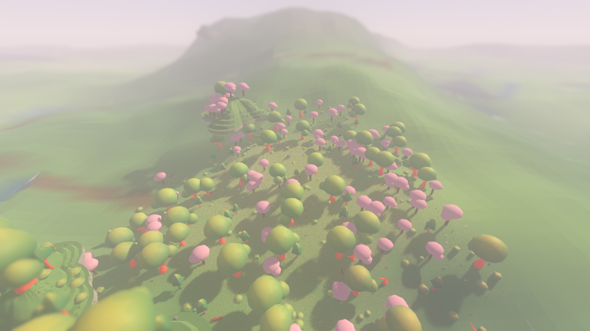
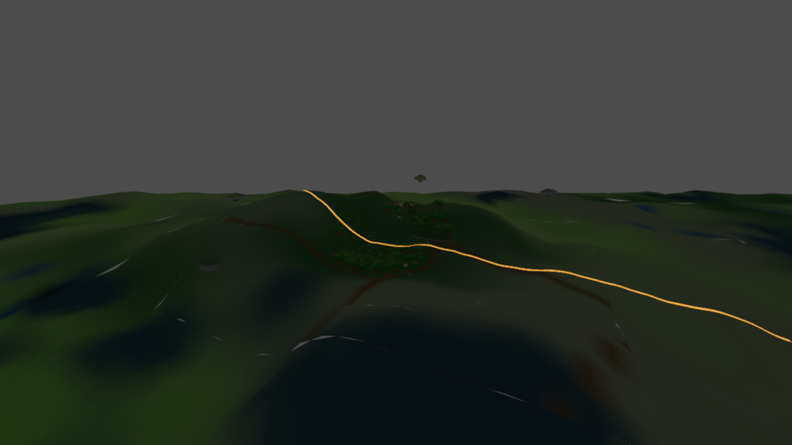
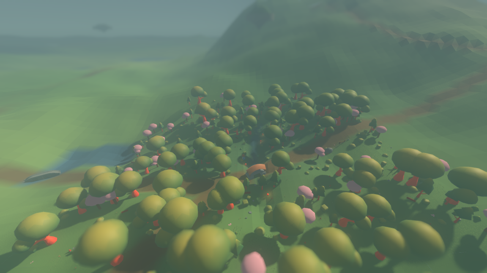
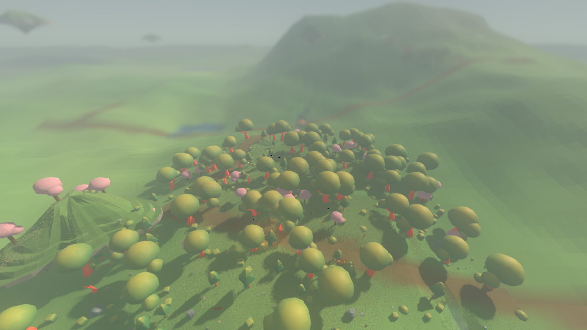
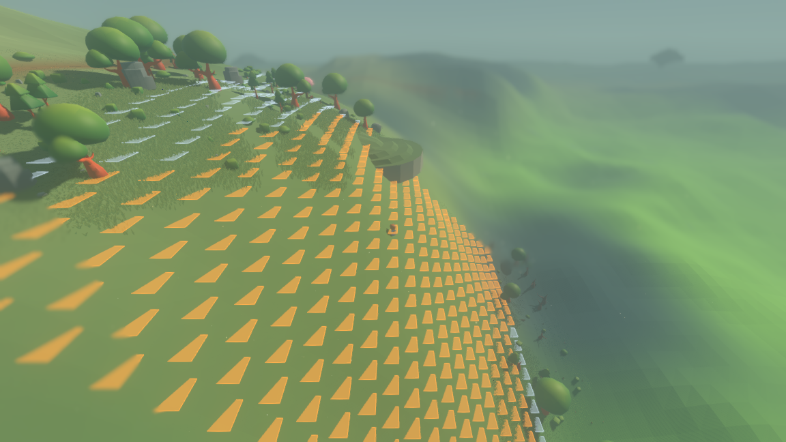

# Mountains you can walk up

The world used to have twenty-nine and a half units of relief in it — top to
bottom, over four square kilometres. It now has ninety-eight, and the highest
ground stands eighty-three units above sea level instead of fourteen.



*Seed 1234, the observer standing at (−28, 420), looking north at the summit at
(−28, 107). Taken with*
`xvfb-run -a tools/godot/godot4 --path . -- --seed 1234 --paused --start -28 420 --screenshot reports/assets/mountain-from-camera.png --screenshot-frame 90`.
*Everything past the first forty units is drawn by the distant-ground rings the
level-of-detail work put in; without them the picture would end at the trees in
the foreground.*

The user asked for mountains. The word they used was **climbable**, and that is
a promise about traversal rather than a number about relief: the terrain query
lets a character step **3.0 units up and 2.0 units down** between neighbouring
cells of the tactical lattice, so a mountain whose every face breaks those
limits is a wall with a summit on top of it, however impressive its amplitude.
This report is mostly about showing that the mountains here are not that.

---

## 1. What was added, in one paragraph

One new field, `sim/mountain_field.gd`, added to the base heightfield inside
`TerrainSurfaceField.height_at`. It is **ridged** noise — each layer folded
through $1 - |v|$ so that the layer's maximum falls along the curve where the
raw field crosses zero, which makes its tops *lines* rather than points — at a
period of 600 world units and an amplitude of 44, over four layers, so it
reaches about 82 units where nothing holds it back. It is multiplied by a
**mask** that is the product of two gates: the biome map's own **rocky axis**,
and a very broad field of the layer's own (period 1500) that breaks rocky
country into separate ranges. Both gates have to open.

Three consequences, and each is measured below.

* Ridges are *lines*, so a mountain has crests that run and flanks that fall
  away. **The crest is the route and the flank is the wall.** Nothing in the
  field searches for a route; the routes are a consequence of the shape.
* The mask is **exactly** zero over most of the world — `smoothstep` below its
  low edge returns `0.0`, and multiplying a float by `0.0` and adding it back
  leaves that float alone. So ground away from a range is not *nearly* what it
  was; it is the identical number.
* The rocky axis reached the palette, the fog and the boulder scatter and never
  reached the height of anything. Now it does.

---

## 2. Mountain-scale relief, before and after

Measured over the same 2 km × 2 km square around the origin on seed 1234,
251 001 samples on a 4 m grid, with `./tools/measure_mountains.sh`:

| | lowest | highest | mean | **relief** |
|---|---|---|---|---|
| before | −15.19 | +14.29 | +0.29 | **29.48** |
| after | −15.06 | +83.06 | +3.87 | **98.12** |

The ceiling moved by nearly a factor of six; total relief is 3.3× what it was.
The floor moved by 0.13 of a unit, which is not the uplift — the uplift only ever
adds — but a village that shifted within its cell and levelled a slightly
different patch of ground.

---

## 3. A mountain can be climbed

This is the claim the task turns on, and it is answered by **search over the
real height function**, not by arithmetic on the amplitude.

`tools/measure_mountains.gd` lays the tactical lattice — `CombatBoard.CELL_SIZE`
= 3.0 units — over the square, samples `TerrainQuery.ground_height_at` at every
cell, and runs a breadth-first search **inwards from the rim of a 780-unit box**
around each summit. A step from one cell to a cardinal neighbour is allowed only
when the rise is at most `TerrainQuery.HOP_HEIGHT` (3.0) and the fall at most
`TerrainQuery.DROP_REACH` (2.0) — the query's own numbers, read off it rather
than restated, and tested in the direction the step is taken, because three up
is allowed and three down is not. When the search reaches the summit the route is
walked again from scratch and every step re-checked.

Run it with:

```
./tools/measure_mountains.sh --trace reports/assets/climb-1234.txt
```

The eight tallest summits in the square, all eight reached:

| summit | at | height | route | from | worst rise | worst fall |
|---|---|---|---|---|---|---|
| summit-1 | (−28, 107) | 83.04 | 130 steps | (−28, −283) | 2.51 | 1.03 |
| summit-2 | (−97, 47) | 73.05 | 130 | (−97, −343) | 2.24 | 0.90 |
| summit-3 | (−142, 83) | 71.69 | 130 | (−142, 473) | 2.38 | 1.10 |
| summit-4 | (−103, −49) | 71.06 | 130 | (−103, −439) | 2.33 | 0.83 |
| summit-5 | (122, −157) | 55.38 | 130 | (122, −547) | 2.07 | 0.85 |
| summit-6 | (53, −151) | 53.28 | 130 | (443, −151) | 2.07 | 1.14 |
| summit-7 | (5, −187) | 41.96 | 130 | (395, −187) | 1.89 | 1.33 |
| summit-8 | (−97, −178) | 36.24 | 130 | (−97, −568) | 1.59 | 1.42 |

The route to summit-1 climbs 60.41 units from ordinary ground at 22.63, and its
steepest single step is 2.51 up against the 3.0 allowed and 1.03 down against
the 2.0 allowed. It is not a near miss in either direction.



*The amber ribbon is the route as the headless search returned it, seen from the
side: it comes out of the low ground on the right, traverses the shoulder, and
arrives at the summit on the left. It is drawn by the render shell's `--trace`,
which reads the file and draws a line and does nothing else. Taken with*
`xvfb-run -a tools/godot/godot4 --path . -- --seed 1234 --paused --start -28 -20 --camera 240 95 -140 --aim 25 --no-atmosphere --trace reports/assets/climb-1234.txt --screenshot reports/assets/mountain-climb.png --screenshot-frame 90`.
*The atmosphere is off for this one frame only: it is a diagnostic of a route,
and four hundred units of the game's own fog make a thin line unreadable.*

The same search runs inside the suite, in `tests/test_mountains.gd`, over a
smaller box, so "a summit can be climbed" is a thing the tests find rather than a
thing this report remembers.

---

## 4. Steepness is a face, not an accident

A mountain with nothing impassable on it is a hill. A mountain that is
impassable everywhere is a wall. Both shares are measured, over every cell within
240 units of a summit:

| summit | cells | steps between them | **refused** | **cut off from the rim** |
|---|---|---|---|---|
| summit-1 | 20 008 | 79 927 | 3 900 (4.9%) | 6 (0.0%) |
| summit-2 | 19 771 | 78 936 | 3 981 (5.0%) | 21 (0.1%) |
| summit-3 | 19 527 | 77 851 | 3 020 (3.9%) | 21 (0.1%) |
| summit-4 | 19 775 | 78 944 | 2 849 (3.6%) | 15 (0.1%) |
| summit-5 | 20 081 | 80 324 | 1 633 (2.0%) | 1 (0.0%) |
| summit-6 | 20 081 | 80 324 | 2 040 (2.5%) | 1 (0.0%) |
| summit-7 | 19 910 | 79 559 | 1 965 (2.5%) | 1 (0.0%) |
| summit-8 | 20 020 | 79 986 | 1 724 (2.2%) | 0 (0.0%) |

*Refused* is the share of steps between neighbouring standable cells that the
limits will not allow — how broken the surface is. *Cut off* is the share of
standable cells the flood from the rim never reaches — how much of the mountain
is behind a wall with no way round. Up to one step in twenty is refused, and
essentially nothing is unreachable. That is the shape the ridged fold buys: steep
sides, and a crest that goes all the way up.

---

## 5. Mountains are a place, not a tax on every hill

Two ways of showing it, and the first is the strong one.

**The far ground is bit-identical.** The same 2 km square is diced into
twenty-five 400-unit windows and each window's own relief printed to four
decimal places, before and after. Eight of the twenty-five print *the identical
digits*: not close, the same float. A window the mask does not reach cannot
change, because the uplift there is exactly `0.0`.

| window | before | after | |
|---|---|---|---|
| (−800, −800) | 23.2565 | 23.2565 | identical |
| (−400, −800) | 22.1274 | 22.1274 | identical |
| (0, −800) | 24.1564 | 24.1564 | identical |
| (400, −800) | 24.7466 | 24.7466 | identical |
| (800, −800) | 25.0831 | 25.0831 | identical |
| (−800, 400) | 24.6101 | 24.6101 | identical |
| (−800, 800) | 24.6806 | 24.6806 | identical |
| (−400, 800) | 27.0069 | 27.0069 | identical |
| (0, −400) | 26.6712 | **64.1455** | mountain |
| (0, 0) | 26.5372 | **90.7764** | mountain |
| (0, 400) | 25.7474 | **67.5127** | mountain |
| (400, 0) | 24.5493 | **58.4824** | mountain |
| (400, −400) | 23.6563 | **58.2816** | mountain |

**How much is lifted at all.** Of 251 001 samples over the square, the uplift
exceeds one unit on 22.48%, ten units on 10.56%, thirty on 3.45%, and fifty on
1.52%. The mean mask over the whole square is 0.0617. Most of the world is the
world it was; a fifth of it feels a range somewhere under it; a few per cent is
mountain.

---

## 6. The highland biome stands high

The rocky axis is what opens the mask, so highland is no longer only a colour.
Sampled every 8 units over the square, 63 001 samples:

| biome | share | mean uplift | mean ground height | highest ground |
|---|---|---|---|---|
| meadow | 16.08% | 0.55 | 0.70 | 27.36 |
| deep forest | 23.78% | 3.94 | 4.33 | 81.87 |
| **highland** | **34.46%** | **5.63** | **5.84** | **82.68** |
| blossom grove | 15.51% | 1.58 | 2.15 | 54.45 |
| twilight marsh | 10.17% | 3.26 | 3.58 | 55.29 |

Highland ground carries ten times the meadow's uplift and stands three times as
high on average. The meadow's own ceiling — 27 units, against 14 before — is the
skirt of a range reaching into it, which is what a skirt is for.

---

## 7. The fingerprint moved, and why

The milestone's standing boundary says only this task may move the headless
world fingerprint, and that the move must be stated and attributed.

| seed 1234, 100 ticks | fingerprint |
|---|---|
| before this task | `a6aa8e5776ebfe8c` |
| with the uplift alone | `33985caf0a411dd7` |
| **shipped** | **`d4e31b0904ff45c0`** |

**The rule that changed:** `TerrainSurfaceField.height_at` now returns the base
value noise **plus** `MountainField.uplift_at` — a ridged field masked by the
rocky axis and a broad range field — so every chunk over a range meshes at a
different height and every layer above reads different ground.

The middle row is quoted because two smaller rules moved it the rest of the way,
and both are consequences of the first: `PathNetwork` now chooses a road's line
by what it climbs instead of only by a hash, and levels a roadway to the nearest
point of each *road* rather than of each *segment* (§8.2). Nothing else in the
generation stack was touched.

Reproduced across two separate processes:

```
./run_headless.sh --seed 1234 --ticks 100 | tail -1
./run_headless.sh --seed 1234 --ticks 100 | tail -1
```

Both print `done ticks=100 chunks=41 built=69 final=d4e31b0904ff45c0`.

---

## 8. What the mountains did to the four layers underneath

### 8.1 Villages: 25 → 23 over six seeds

A settlement pad is refused ground with more relief across it than
`SettlementField.PAD_RELIEF_LIMIT` (5.6) — which is correct, and which most
mountain ground fails. Counted over the same six seeds and the same 25
settlement cells each, with `tests/bench_settlements.gd`:

| seed | before | after |
|---|---|---|
| 1234 | 5 | 3 |
| 7 | 3 | 3 |
| 3 | 4 | 4 |
| 19 | 3 | 3 |
| 42 | 2 | 2 |
| 101 | 8 | 8 |
| **total** | **25** | **23** |

Five of the six seeds are unchanged in count. Seed 1234 loses two, because the
tallest range in the world happens to stand over its origin. Some sites moved
without the count changing — the digests differ on seeds 1234, 3 and 101 — which
is a village shifting within its cell to ground it can still be levelled on. The
world still opens within a walk of a village on every seed: the starting village
is allowed to shrink to a hamlet where the country is broken, and it did.

This is a fall, not a collapse, so nothing here was compensated for. Changing the
settlement rule would be a separate decision.

Deciding a settlement cell also got slower, because deciding one samples the
ground and the ground now costs a second field: 7 272 microseconds per cell warm
before, 10 133 after, on the same bench.

### 8.2 Paths: no road is laid on ground nobody could walk up

The path layer used to lay its lines without ever asking what was under them,
which was fine in a world whose whole relief was thirty units. `_route` now picks
the cheapest of six candidate lines, scored by how far the line climbs past
`ROUTE_GRADE_LIMIT` — the query's own 3.0-unit step over one 3.0-unit lattice
cell — sampled every 3.0 units along the line. **Candidate zero is the line the
road has always taken and wins every tie**, so ground with nothing too steep on it
keeps the road it already had, point for point.

Measured over every road within 900 units of the origin, walked at the lattice's
own cell width:

* **the land under a road is always walkable.** On seed 1234, 0 of 4 868 steps
  of *carved bed* — the ground as it is before the roads are cut into it —
  climbs more than 3.0 units in one cell. That is asserted in the suite, in
  `tests/test_mountains.gd`.
* on the *finished* roadway, across six seeds and about 28 800 steps, four
  steps exceed it. All four are on seed 1234, all four are where two roads'
  carving overlaps, and the paragraph below is about them.



*Seed 1234, observer at (−160, 300). The track crosses the picture and turns
along the base of the range rather than up it. Taken with*
`xvfb-run -a tools/godot/godot4 --path . -- --seed 1234 --paused --start -160 300 --screenshot reports/assets/mountain-path.png --screenshot-frame 90`.

**One thing the mountains found rather than caused, and since fixed.** What
follows is what this task measured and left standing; the carve no longer blends
two centrelines, the four steps below are gone, and `reports/roads.md` is that
work with its own before-and-after. Where three places sit nearly in a line, the graph builds three roads
and one of them runs along the other two. The carve levels their overlap to a
*blend* of the centrelines it can reach. On flat country those centrelines are at
the same height and the blend is invisible; on a mountain shoulder they are not,
and the blend leaves the roadway out of level across itself by up to 0.69 units
against the 0.30 the road is worn into the land, and puts four steps of finished
roadway on seed 1234 over the 3.0-unit climb limit. Two changes were made
towards it — the carve now levels to the nearest point of each *road* rather than
of each *segment*, which removes the same defect at a bend in a single road, and
`PathNetwork.roads_over` was added so the suite can tell the two cases apart —
and the residual was counted and bounded in `tests/test_settlements.gd` rather
than tolerated silently. It has since been removed rather than bounded: the
levelling now takes one road's centreline and no blend of two, both suites assert
the finished roadway is walkable and level, and the world fingerprint moved from
`d4e31b0904ff45c0` to `d178d38879097c1c` because of it. The near-duplicate roads
the finding proposed dropping turned out not to exist — the three roads at
$(-157.2, 49.1)$ all end at the same landmark — which `reports/roads.md` shows.

### 8.3 Water: the table stayed where it was, so the mountains are dry

`WaterField` puts standing water at a table around −8.4 with a couple of units of
wobble, and thins rivers out as the land rises (`RIVER_DRY_HIGH` = 7.5). Nothing
about that was touched, and the consequence is the right one:

* the water table under summit-1 is at **−5.89** while the ground is at
  **83.04** — the land stands **88.93 units** above its own water table;
* the nearest standing water to that summit is **222 units away**, at
  (−227, 9), with its surface at −7.29;
* water covers **3.40%** of the 2 km square, and **0.03%** of the ground that is
  lifted by more than ten units — two samples in 6 629.

So mountains hold no lakes and no rivers, and the lowland keeps every drop it
had. A tarn on a summit would need a basin and a perched table, which is the
floating islands' trick and not this field's.



*Seed 1234, observer at (−160, 380): standing water in the low ground on the
left, the range rising dry on the right. Taken with*
`xvfb-run -a tools/godot/godot4 --path . -- --seed 1234 --paused --start -160 380 --screenshot reports/assets/mountain-water.png --screenshot-frame 90`.

### 8.4 The combat board: a face is a wall, not a hole

This is a gameplay change and it is named here rather than left as a side effect.
The source request guessed that steep faces would become **board-holes**. They do
not, and the difference matters. A hole is somewhere with *nothing to stand on*,
which on the ground still means water and nothing else; the builder settles each
cell against its own reference, so a cell on a 45-degree face has a perfectly
good surface. What a steep face produces is **refused steps and cliff edges**: a
cell you can stand on, that no neighbour below can step up to, and that a unit
standing on it can be shoved off.

Two boards per mountain, one on the summit and one on the steepest cell of its
flank, copied out of `reports/mountain-survey-1234.txt`:

| board | cells | holes | cliff edges | steps | **refused** |
|---|---|---|---|---|---|
| summit-1, top | 441 | 0 | 3 | 1 680 | 10 (0.6%) |
| summit-3, top | 441 | 0 | 148 | 1 680 | 145 (8.6%) |
| summit-8, top | 441 | 0 | 0 | 1 680 | 0 (0.0%) |
| summit-1, flank | 441 | 0 | 178 | 1 680 | 287 (17.1%) |
| summit-3, flank | 441 | 0 | 345 | 1 680 | 576 (34.3%) |
| summit-8, flank | 441 | 0 | 149 | 1 680 | 236 (14.0%) |

**The holes column is zero on every row, and on every row of the survey.** All
sixteen boards the tool lays — a top and a flank on each of the eight summits —
are 441 cells of standable ground with nothing missing from them. The claim this
section leads with is therefore the whole survey and not a sample of it.

**What this means to play.** A summit board is open where the top is broad and is
a ledge with a rim where the top is a crest, which is what a ridge line is. Two
of the three tops above are the open kind: summit-1 refuses 10 of its 1 680 steps
(0.6%) and carries 3 cliff-edge cells, and summit-8 refuses none and carries
none. Summit-3's top is not: **148 of its 441 cells (34%) are cliff edges and 145
of its steps (8.6%) are refused**, so a shove is live over a third of that board
and a piece can be pushed off the top of the mountain. Which summit a fight
happens on is a real question, and it is not the height that decides it —
summit-1 at 83.04 is the calm board and summit-3 at 71.69 the sharp one.

A fight on a flank is a fight across a wall on every one of them, and how much of
a wall varies by a factor of two: **14.0% to 34.3% of the moves** between
neighbouring cells are illegal, and **34% to 78% of the cells are cliff edges** a
shove will remove a unit from (149, 178 and 345 of 441). The lanes that do exist
run *along* the contour rather than up it. The Frog, which leaps rather than
steps, ignores all of it — so an enemy Frog on a mountainside is far more
dangerous than the same Frog on a meadow, which is the
terrain-reads-differently-per-piece idea in §3.3 of the design arriving for free.



*Seed 1234, observer at (98, 104) — the steepest cell within reach of summit-3,
which is where the survey lays that board. 345 of its 441 cells are cliff edges,
which is why the frame is nearly all orange: orange is a cliff edge, pale blue is
ordinary ground. Taken with*
`xvfb-run -a tools/godot/godot4 --path . -- --seed 1234 --paused --start 98 104 --board --camera 0 30 42 --aim 3 --screenshot reports/assets/mountain-board.png --screenshot-frame 90`.

**This table was stale, and it is the only one that was.** It used to print six
rows that no run of the tool produces — among them summit-3's top as 1 cliff edge
and 0 refused, which is what the sentence about summits used to rest on. Every
other table and quoted number in this report was checked against the same
artifact while this was corrected, and every one matches it: §2's relief row,
all eight climbs of §3, all eight faces of §4, the *after* column of §5's windows,
§5's uplift shares and mask mean, and all five biome rows of §6. (§2's and §5's
*before* columns, §7's fingerprints and §8.1's village counts come from the other
commands in §9 and are not in this file.) **How the six rows came to differ is not
established.** They and the old caption's (103, 106) agree with each other, so
they came from one earlier run of this tool; but the repository holds a single
commit and no record of that run, and the ground moved twice while the task was
being written (§7), so which state they were taken from cannot be recovered from
what is here.

---

## 9. The numbers this report quotes

Every table above comes out of one of three commands, and all of them are
headless:

```
./tools/measure_mountains.sh                       # relief, uplift, biomes, summits, climbs, faces, boards
./tools/measure_mountains.sh --seed 7              # usage: the same questions of another world
tools/godot/godot4 --headless --path . --script res://tests/bench_settlements.gd
./run_headless.sh --seed 1234 --ticks 100
```

The full survey for seed 1234 is kept beside this file as
`reports/mountain-survey-1234.txt`, and the route to summit-1 as
`reports/assets/climb-1234.txt`.

---

## 10. The suites

All 25 suites pass headless — 188 145 checks, up from 173 351 — and the three
structure checks still pass. One suite is new, `tests/test_mountains.gd` (3 030
checks), and it holds the properties this report is about: that the ridged fold
is `1 - |v|` per layer, that the uplift is a pure function of position and seed,
that the mask is *exactly* zero outside a range so the far ground is the
identical float, that most of an 1 800-unit square is untouched on three seeds,
that highland stands far above meadow, that a summit can be climbed under the
step limits by a search run in that process, and that no road is laid on land
nobody could walk up.

Four suites had fixed sample positions chosen when the ground near seed 1234's
origin was gentle, and the mountain that now stands over it dried them out.
None of their claims were relaxed; the samples were moved to ground that still
holds the thing being tested, and each says so where it is:

| suite | what stopped being true of the sample | what changed |
|---|---|---|
| settlements | five villages in the 5×5 cells around the origin became three | the square was widened to 7×7 |
| settlements | no water at all in the 360-unit square on the origin | a second square, on the wettest ground within a kilometre |
| scatter | no reed within a hundred chunks of the origin | the waterside block moved to that same ground |
| combat board | none of three sample boards met water | a fourth board, laid on a lake |

---

## 11. What was not done

* **The step limits were not touched.** 3.0 up and 2.0 down are the same numbers
  island reachability and the board's holes rest on. Where a mountain was not
  climbable the land changed shape, not the limit.
* **The streaming radius was not raised.** That was the level-of-detail item's
  job and this depends on it.
* **Nothing was made harder further out.** Enemy level by distance from spawn is
  the only difficulty axis; a mountain is terrain, and there is no
  distance-from-origin term anywhere in `sim/mountain_field.gd`.
* **The near-duplicate roads were left alone.** See §8.2: it is a routing
  decision of its own.
