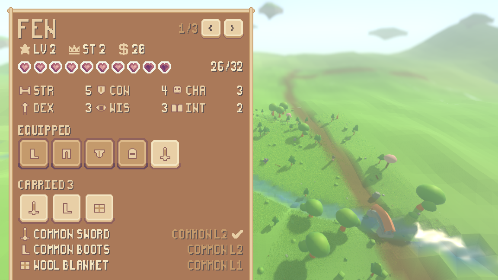
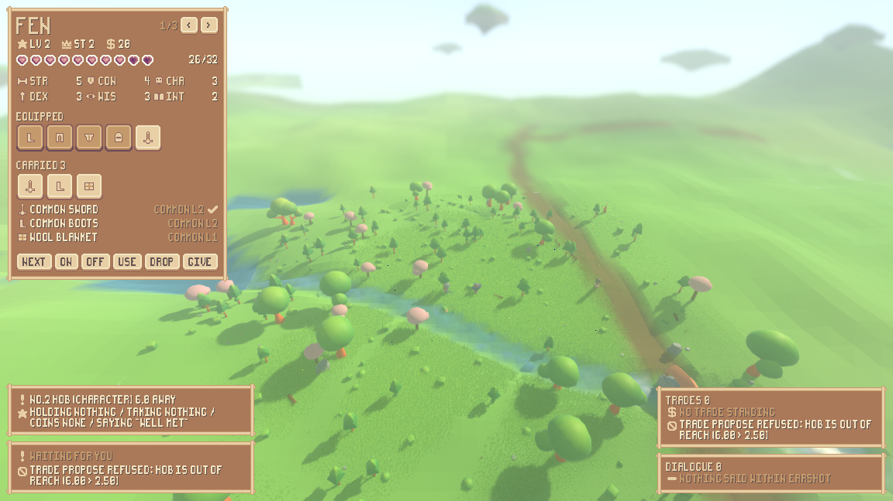
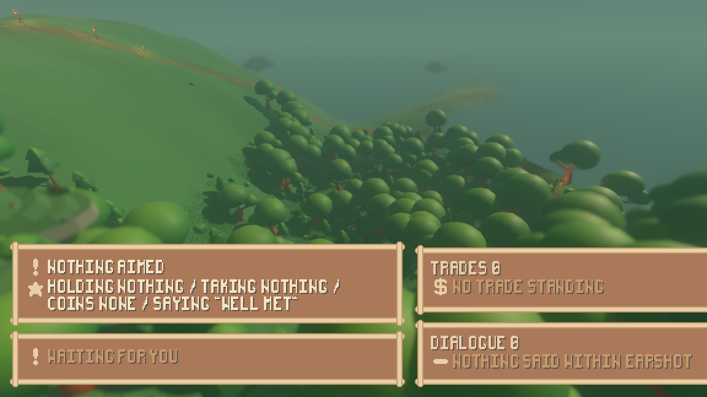
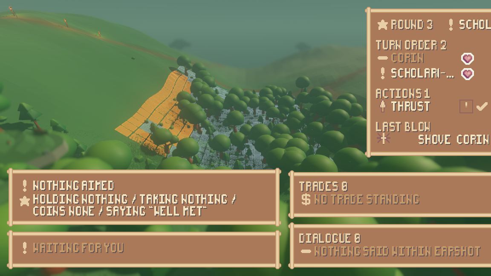
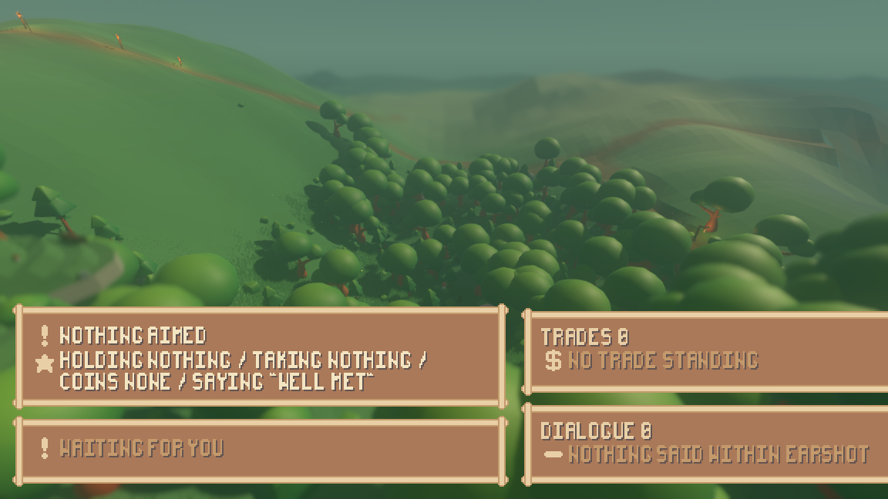
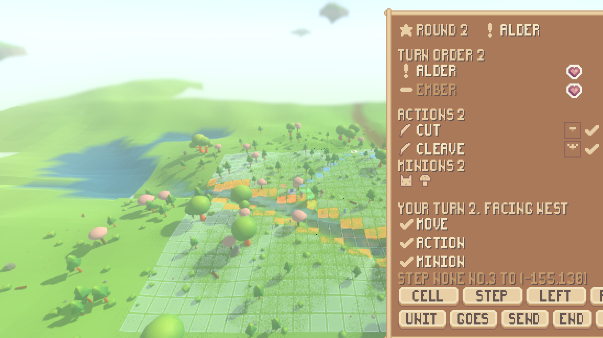
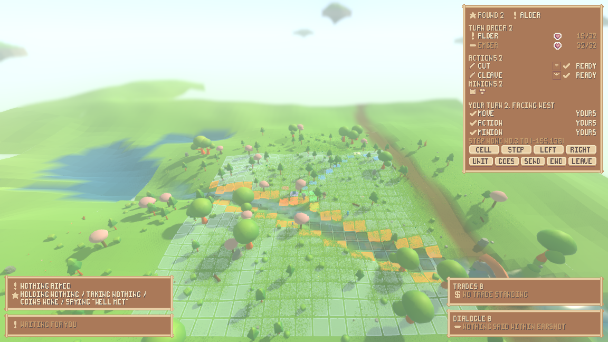
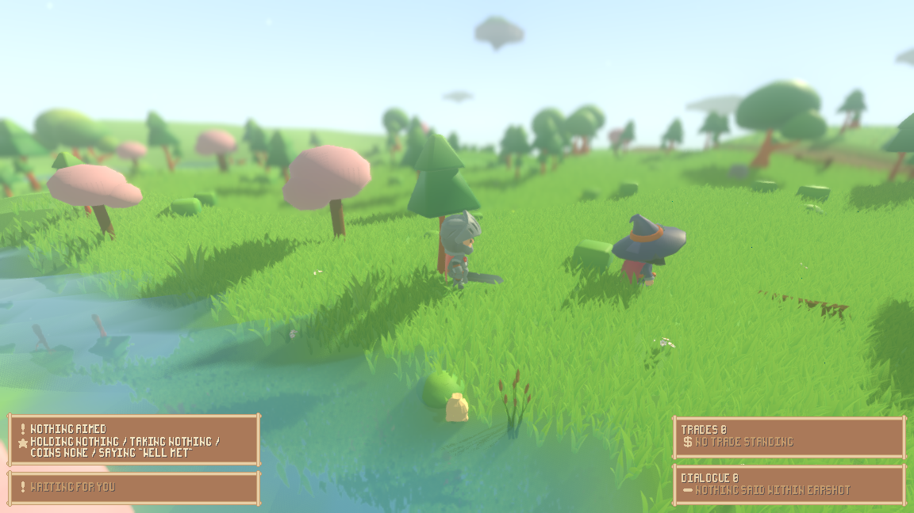

# What you can actually do in this game now

This project is building a small fantasy role-playing game in which the world is
a simulation and the player is one element inside it rather than the thing the
world is arranged around. For most of its life you could not play it: the
mechanics existed and were exercised by automated checks, but there was no way
for a person at a keyboard to be one of the characters. That is what has
changed. This page is about the game as a person meets it — how to start it,
what the little figure on screen is, what you can do and which key does it, what
one turn of a battle looks like, and what it is like to walk around a world in
which every other character is making its own decisions while you make yours.

It also names, as plainly as it names what works, the things that are still not
playable and the things nobody here has been able to judge — because the machine
this was built on has no display.

## Start it with one command

On a machine with a graphics card and a keyboard:

    ./run_render.sh --scenario play --play --sheet

That opens the game on the **play stage** — the smallest hand-written world that
holds one of everything a person might want to do something to: a trader, a
brawler, a pile of dropped gear and a locked chest. Drop `--scenario play` and
you get the ordinary generated world instead, which is emptier, wilder, and the
only place enemies turn up by themselves.

`--play` is what puts *you* in the world; `--sheet` opens the character sheet
that shows what you are carrying. Nothing else needs to be passed: the tactical
board and the combat readout now appear on their own when a fight starts.

**Nobody here has played that.** Every frame and every trace on this page came
from the same program running inside an off-screen X server (`xvfb-run`), with
key presses injected at named moments and screenshots taken at named moments.
The presses go through the engine's own input queue, so they arrive at exactly
the bindings a person's presses arrive at, and the pictures are the pictures a
person would see. But no one has held a key down, felt a pause, or turned a
camera. Section 10 lists exactly which judgements that leaves unmade.

## Words this page uses

This project has invented some vocabulary, and it is re-explained here rather
than assumed.

* A **tick** is one step of the world's clock. There are $20$ of them a second.
* A **seed** is the fixed number the world is generated from. Everything below
  is at seed $1234$, so anybody running the same command gets the same world.
* The **world fingerprint** is a short digest of the entire simulation state
  after a stated number of ticks. Quoting it before and after a change is how
  this project proves the simulation did not move when it was not meant to.
* A **decision function**, or a **mind**, is the thing that answers "what do you
  do next?" for one character. There are several kinds — a written-down script,
  a rule, a language model — and, since this milestone, a person at a keyboard.
* The **action catalogue** is one table listing every action the game has: the
  twelve atomic verbs of the design plus the ways of naming them. Each row also
  carries how many ticks that action **occupies**, meaning how long the
  character is busy doing it.
* A **stride** is how far a walking character moves in one tick: $0.9$ world
  units. A **leg** is how far the wandering rule sends a character in one go:
  $18$ units, which is exactly $20$ strides.
* The **board** is the square lattice a fight snaps onto — a turn-based tactical
  grid painted on the ground where the fight is happening. The **readout** is
  the panel beside it saying whose turn it is. The two **grid-square** faults
  this page opens with are about how that lattice is drawn.
* A **commander** is a character who takes a turn on the board in their own
  right; a **minion** is a lesser piece a commander sends. A **band** says who
  came into the world together — it is not the same as which side of a fight
  you are on, and section 9 is about the difference.
* The **render shell** is the program you launch; **headless** means running the
  simulation with no graphics at all, which is what the automated checks do.

---

## 1. The figure on screen, and the world around it

You drive one character. On the play stage it is Fen, a level-$2$ commander with
a sword, boots, a blanket, a draught and some coins. The camera looks down at
the world from behind and above, in the shallow, boxy way a diorama is looked at
— which is what "2.5-dimensional" means here: the world is fully three
dimensional, but you always see it from about the same angle.

The important thing is not the figure but what is going on around it. The world
is *running*. Every other character is inside an action the engine is carrying
out on every tick, and is asked afresh every five ticks whether it still wants
to be doing that. With the player pressing nothing at all, the journal of an
ordinary run reads like this:

```
Scholar(-1,-1) changed its mind at 15/20t
attack refused: Scholar(-1,-1) is outside the pattern of a common buckler from here
Fen began go_to(offset=(0.000, -3.600)), 4 ticks
```

Two of those lines are somebody else and one of them is you, and **nothing in
the journal says which**. That is the point of the whole milestone. A person's
choice is put into a holder by the keyboard code, and the world's own control
loop picks it up on its next tick exactly as it picks up a wandering rule's
choice. There is no second movement path, no second arrival test, no second
opinion about how far anybody can jump. The file that turns key presses into
intentions names no rule and decides nothing; it builds an action and hands it
over.

What you may aim at is decided the same way. Pressing Tab cycles through the
things your character can actually make out — and that list is the world's own
answer, built from the identical packet of information a language-model mind is
handed when it is asked what to do. You cannot aim at something your character
cannot see, because the rule that decides what a character can see is the rule
that already answered that question for everybody else.

## 2. What a person can do

Fifteen things, all of them reachable from the keyboard. The refusals in the
right-hand column are the engine's own sentences, quoted from real runs; where a
sentence contains a name or a number the engine fills in, the slot is written in
angle brackets rather than a specimen value.

Aiming first: **Tab** aims at the next thing in sight, **F** turns the ring of
what you are carrying (including *nothing*, which is bare hands and is a real
choice), **C** picks one of the things visible inside whatever you have aimed
at, **B** picks the next line to say, and **-** / **=** dial the coins in your
next offer. **Z** opens and shuts the character sheet.

| verb | how it is reached | what refuses it |
|---|---|---|
| go to | **W A S D** or the arrow keys — one step of $3.6$ units in the camera's directions; **P** — go to what is aimed at; **G** — go to the nearest place the world has a name for | `go_to refused: the way to the position is blocked`; while a fight is holding you, `go_to refused: the board decides where a fighter goes` |
| jump | **J** — a hop of $3.0$ units, inside ordinary reach; **K** — a leap of $12.0$, deliberately outside it | `jump refused: 12.00 is further than DEX 3 jumps (3.75)`; `there is nothing to land on there` |
| attack | **N**, at what Tab aims at, with what F holds | `attack refused: <name> is outside the pattern of a <item> from here`; `you are holding nothing to attack with` |
| say | **T** — say the picked line to what is aimed at; **Y** — shout it | `say refused: <name> is out of earshot (<distance> > <reach>)`; `there is nothing to say` |
| offer a trade | **O**, after C has picked what you want and **-**/**=** have set the coins | `trade_propose refused: Hob is out of reach (6.00 > 2.50)` |
| accept an offer | **U** | `trade_accept refused: the offer from Hob was denied` |
| deny an offer | **I** | `trade_deny refused: Hob has offered nothing` |
| pick up | **Q**, taking the thing C picked out of what Tab aimed at | `pick_up refused: the pile is out of reach (4.00 > 2.50)` |
| drop | **X** — put down what you hold; **V** — put it into what is aimed at | nothing in hand to put down |
| examine | **E** — what is aimed at; **L** — what is held | `there is nothing with id <id>` |
| interact | **H**, using what you hold on what is aimed at | `interact refused: Hob is a character: talk or trade`; `interact refused: a wool blanket is not what the chest opens with, so it is put to a check` |
| wait | **M** — $5$ ticks a press, pressed again for longer | nothing refuses it |
| put on / take in hand | **1**, on whatever F holds | `equip refused: a <item> goes in no slot, so it cannot be worn or held` |
| take off | **2** | nothing is on in that slot |
| use up | **3** | `use refused: a common sword is not used up: it is kept` |

Once a fight has you, the keyboard changes under you and a second, smaller set
applies: **[** picks the next cell you may step onto and **]** steps onto it;
**;** picks one of your minions, **'** picks a cell for it and **\\** sends it
there; **4 5 6 7** spend the first, second, third or fourth of your weapon
actions; **8** and **9** turn a quarter left or right, which is free; **0** ends
your turn; and **.** leaves the fight altogether and puts you back in real time.

**The refusals are the best writing in the game, and they are not decoration.**
A refusal tells you the number, the threshold and the reason in one sentence,
which means a player who is told no also knows what to do about it. That is also
why the keys are not greyed out when they cannot be used: an interface that
disabled the "put it on" key for a blanket would be a second, quieter copy of a
rule that already exists in the simulation, and the two copies would eventually
disagree.

Here is the whole catalogue driven once through from a written-down script of
presses, at seed $1234$, printed by `./tools/play_actions.sh`:

```
verb            at                     the engine's answer
examine         #2                     examine ok id=2 name=Hob kind=commander health=unhurt fighting=false equipment=- distance=6.0
say             #2                     say ok shout=false heard_by=1 check=1 context=persuade:#2
trade_propose   #2                     trade_propose refused: Hob is out of reach (6.00 > 2.50)
go_to           #2                     go_to ok at=(-476.400, 420.000) walked=0.0 steps=0
trade_propose   #2                     trade_propose ok to=2 give=1 give_money=0 want=0 want_money=2
trade_deny      #2                     trade_deny ok from=2
trade_accept    #2                     trade_accept refused: the offer from Hob was denied
trade_accept    #2                     trade_accept ok from=2 took=1 took_money=0 gave=0 gave_money=4
pick_up         #4 with iron key       pick_up ok item=iron key from=4
interact        #5 with wool blanket   interact refused: a wool blanket is not what the chest opens with, so it is put to a check
interact        #5 with iron key       interact ok target=5 opened=true used=iron key
pick_up         #5 with silver ring    pick_up ok item=silver ring from=5
drop            #5 with iron key       drop ok item=iron key into=5
equip           - with common boots    equip ok item=common boots slot=boots instead_of=- moves=2 attacks=2 defence=0
unequip         - with common boots    unequip ok item=common boots slot=boots moves=1 attacks=2 defence=0
use             - with mending draught use ok item=mending draught worth=8 mended=6 health=32 of=32
wait            -                      wait ok ticks=5 until=205
jump            (-482.9, 417.9)        jump ok at=(-482.939, 417.891) gap=3.0 reach=3.75 dex=3
jump            (-482.9, 405.9)        jump refused: 12.00 is further than DEX 3 jumps (3.75)
```

That is a conversation, a bargain that is refused for distance, closed for money
and denied once on the way, a key taken off a pile and used to open a chest, a
ring taken out of it, boots put on and taken off, a draught drunk, and a jump
that is allowed followed by one that is not.

---

## 3. The two grid-square faults, before and after

The user reported two things wrong with the tactical squares: they did not sit
on the ground, and grass grew through them. Both were in the drawing code, and
both are fixed. Nothing in the simulation was touched — the fingerprint at seed
$1234$ is identical on both sides of the change.

**Fault one: a square on a slope cut into the hill and floated off it.** A cell
used to be drawn as four corners all at one height, so on any incline the
uphill half was buried and the downhill half hung in the air. A cell is now cut
into $2 \times 2$ quads and its height is read from the terrain at each of the
nine sub-vertices, while its extent in the two horizontal directions is exactly
what it always was. The outline is walked round the same ring of sampled
points, so no edge floats free of the square it bounds. A cell over water keeps
its flat anchor height, because there is no surface under a hole to follow.

| before | after |
|---|---|
|  |  |

    xvfb-run -a ./run_render.sh --seed 1234 --start 198 -102 --paused --board \
        --no-grass --camera 0 14 18 --aim 2 --focus 0 \
        --screenshot "$PWD/reports/assets/board-hug-slope-after.png" --screenshot-frame 120

(The `before` frame is that same command run on the commit before the change.)

How finely to cut a cell was decided from numbers, not taste. The ground itself
is meshed at $2.00$ units and a painted square is $2.58$ across, so two cuts
already resolve finer than the ground does. The flat plate stood $0.340$ units
off the surface on average and $1.929$ at worst; two cuts brings that to
$0.0045$, and three would buy $0.0020$ for $1.95$ times the vertices ($34{,}398$
against $17{,}640$) and nearly twice the build time. The height the square is
lifted by came down from $0.09$ to $0.045$ in the same pass, because a square
that follows the surface no longer has to clear the cell's own relief — only the
faceting of the ground mesh, which is $0.0083$ on average.

**Fault two: grass hid the squares.** The grass layer knew nothing about the
board and grew straight through it. It is now told where the board is through
exactly the path the grass already used to part around walking characters — four
values written once per frame onto the single shader material every grass chunk
shares, so the cost does not grow with the number of chunks drawn. A blade
standing over a painted square is shortened; a blade in the gutter between
squares is not.

| before | after |
|---|---|
|  |  |

    xvfb-run -a ./run_render.sh --seed 1234 --start 228 -60 --paused --board \
        --camera 0 10 14 --aim 1 --focus 0 \
        --screenshot "$PWD/reports/assets/board-grass-after.png" --screenshot-frame 120

Shortening the blades was chosen over fading them out, after building both and
photographing both at two cameras. Close in, the fade leaves full-height
silhouettes standing across the square and turns them to speckle while the
shortening crops them cleanly. At the far diorama camera the two are within
$3.1$ levels per channel of each other, so that pair alone would not have
decided it and the write-up says so. The tie-breaker is cost: fading needs the
shader to throw pixels away, which gives up a depth optimisation on tens of
thousands of instances, where shortening is a multiply into a number the shader
already has.

**And one complaint that stands.** Some squares are drawn amber. They are cliff
edges. Nothing on screen says so, and there is no legend.

---

## 4. Walking at the same speed as everybody else

The walk animation and the movement itself were right from the start: a
self-driven character advances $0.878$ units on every one of the twenty ticks its
walk occupies, reports a speed of $0.900$ throughout, and plays its walking clip
the whole way. Movement happens while it happens rather than being a teleport at
the end.

A person's walk was not that walk. Pressing **W** issued a walk of $3.6$ units,
but the catalogue charged every walk a flat $20$ ticks whatever the distance. So
a key press was four ticks of walking followed by sixteen ticks of standing
still, unable to do anything, having already arrived:

| who | distance | ticks | speed |
|---|---|---|---|
| any character the world drives itself | $18.0$ units | $20$ | $0.90$ units per tick |
| a person pressing **W**, before | $3.6$ units | $20$ | $0.18$ units per tick |
| a person pressing **W**, now | $3.6$ units | $4$ | $0.90$ units per tick |

The ratio was exactly $5$. It is now exactly $1.000$, with no tolerance spent.

The fix is at the rule and not at the keyboard. A walk is now charged the
strides it actually takes, counted in the very same strides the walking code
then takes, clamped into $[1, r]$ where $r$ is the catalogue row's own number —
which is re-read as *the most a walk may occupy* rather than a flat price. So no
walk got longer than it was, a walk aimed further than one action may hold still
has its remainder finished afterwards exactly as before, and the change holds
for every caller of the catalogue rather than only for the person.

What that did to the characters the world drives itself was quoted rather than
assumed. The entire difference across a $48$-tick trace is four lines, all of
them one enemy's approach, now charged $16$ ticks for $16$ strides. Every
wanderer's line is byte-for-byte identical, because the wandering rule's leg was
already exactly $20$ strides — it had been paying the right price all along.
Three seed-$1234$ fingerprints are unchanged across the change; four checked-in
transcripts moved, each because its run now gets through the same plan sooner,
and each is quoted with that reason.

For a walk that is not a whole number of strides — which only the **P** and
**G** keys produce, because they aim at a place somebody else chose — the rate
is at worst $0.80$ units per tick on a four-tick walk and $0.88$ on a twenty-tick
one. That bound is derived from the rule rather than asserted.

---

## 5. The interface did not fit the window the game ships in

This one is worth stating baldly because it made two other things unplayable.
The game ships in the engine's default window of $1152 \times 648$ pixels. The
interface is pixel art multiplied by a whole number, and that number used to be
picked from a nominal design height with nothing afterwards asking whether what
had been laid out at that size still fitted. It did not.

Measured from the shell's own printed rectangles, before the fix: the combat
readout ran $120$ pixels past the right edge and $10$ past the bottom, taking the
end-turn button off screen with it. Opening the character sheet placed the trade
panel $102$ pixels *below* the bottom of the window and the dialogue panel $274$
below — not clipped, placed off screen altogether — and the sheet itself ended
$80$ past the bottom.

| before: the sheet open, every other panel gone | after: the sheet open, every panel on screen |
|---|---|
|  |  |

    xvfb-run -a ./run_render.sh --seed 1234 --scenario play --play --sheet --journal \
        --input 10:f,14:1,22:2,28:f,32:3,40:f,44:x,52:tab,54:f,58:o \
        --screenshot-ticks 62:reports/assets/window-fit-bag-t62.png

The consequence was not cosmetic: the one panel that tells you
`use refused: a common sword is not used up: it is kept` was off the screen at
the exact moment you pressed the key that provoked it. **A person operating
their inventory could not see the engine's answer to what they had just done.**
In the "after" frame the answer is there twice — `TRADE PROPOSE REFUSED: HOB IS
OUT OF REACH (6.00 > 2.50)`, in the answer panel and again in the trade panel —
beside a sheet that still shows the hearts, the six abilities, the equipped
slots and the three things carried.

The rule now asks the panels what they need and picks the largest whole-number
multiplier that still fits. At the shipped size every panel lands inside the
window; the same holds one size up and one size down, and at $2560 \times 1440$
the interface is drawn at $2\times$. Nothing was given up for it — $0$ of
$86{,}080$ pixels are off the art's palette and $0$ of $17{,}062$ edges are off
the pixel grid at $1\times$, and the same two zeroes at $2\times$.

---

## 6. The inventory, operated

The character sheet is not just a display. **Z** opens it, **F** turns the ring
of what you carry, and **1**, **2**, **3** put on, take off and use up whatever
is held; **X** drops it and **O** offers it to somebody. Two moments from one
run of six photographed ticks — note the hearts, which the draught filled:

| after **1** puts the boots on | after **3** drinks the draught and **X** drops the sword |
|---|---|
|  |  |

    xvfb-run -a "$GODOT" --path . --resolution 1280x800 --fixed-fps 30 -- \
        --seed 1234 --scenario play --play --journal \
        --input "2:z,3:tab,4:p,26:f,27:1,33:2,38:f,39:f,40:3,46:f,47:f,48:f,49:x,54:f,55:f,56:f,57:o" \
        --screenshot-ticks "32:reports/assets/inventory-2-equipped.png,53:reports/assets/inventory-5-dropped.png"

The engine's answers are specific enough to play against. These are from the
playtest's own inventory session, on the same stage:

```
equip ok item=common boots slot=boots instead_of=- moves=2 attacks=2 defence=0
unequip ok item=common boots slot=boots moves=1 attacks=2 defence=0
use ok item=mending draught worth=8 mended=6 health=32 of=32
drop ok item=common boots into=6
```

Putting boots on raises what the character may do with a turn from $1$ move to
$2$; taking them off puts it back. Drinking the draught mends $6$ of a possible
$8$ because the character was only $6$ hurt. The sheet shows name, level,
standing, coin, hearts, all six abilities, every equipped slot, everything
carried, and a tick beside the thing currently in hand.

---

## 7. Things on the ground, and enemies that arrive by themselves

**Items exist as objects in the world.** Gear is randomly generated, has a model,
lies where it is dropped and can be picked up again. A defeated enemy's
belongings appear where it fell. The whole cycle runs from the keyboard —
`pick_up ok item=iron key from=4`, then `drop ok item=common boots into=6`.

**But you cannot see them, and this is unfixed.** Four camera placements were
tried and the pile is in none of them. Three things stack up: the play stage's
key is one of seven shipped items with no model of its own and is drawn through
a fallback sack $0.83$ units tall; the grass is about that tall; and a pile lies
on the ground *under* your character, which is precisely the band of the screen
the interface panels occupy. The readout does its best —
`NO.4 PILE (PILE) 4.0 AWAY HOLDING IRON KEY` — but a player is picking things up
by reading text, not by seeing them.

**Enemies place themselves.** In the ordinary generated world, hostile
characters are laid out by a sparse field on a $64$-unit lattice: at most one to
a cell, decided by a hash of the cell and the world seed, refused on water, on
cliffs and inside villages. They stream in and out around whoever is in the
world, they are asked what to do through the same seam every other character
uses, and they can start a fight because one of them chose to swing. At seed
$1234$, unasked, an enemy walks about, weighs attacking against walking on, and
engages at tick $26$.

---

## 8. A turn in a battle

When a fight begins the world snaps onto a tactical board and the clock changes
from ticks to turns. Until recently a fight that started *by itself* was drawn
as nothing at all — the lattice was built only if you had asked for it on the
command line, and so was the readout — so a player was held on an invisible
board and every key they pressed was echoed and then silently thrown away. Both
halves are fixed. The board and the readout now come up on the tick a fight
starts and go away when it ends, on the plain command with no extra flags:

    xvfb-run -a ./run_render.sh --seed 1234 --play --journal \
        --screenshot-ticks "20:$PWD/reports/assets/fight-drawn-t20.png,\
60:$PWD/reports/assets/fight-drawn-t60.png,200:$PWD/reports/assets/fight-drawn-t200.png"

| $t = 20$: nothing has met anybody | $t = 60$: a fight, drawn | $t = 200$: put away again |
|---|---|---|
|  |  |  |

The run's own lines are `fight t=26 the board appears` and `fight t=181 the board
is put away`, and it ends having drawn $0$ squares after having drawn $441$ while
the fight was on.

Two honest notes on that middle frame. It was taken before the window fix, so its
readout is still cut off at the right edge — `ROUND 3` is legible and the enemy's
name is not. And **the fighters themselves cannot be made out at all**: the
lattice is clear, the panel is clear, and what the board is drawn around is a
handful of pixels behind a treeline. That is the complaint of section 10, in a
picture.

**A turn, played.** Asked for on the battle stage, where the scenario musters two
commanders next to each other, a whole fight is playable end to end from the
keyboard and it is the most finished thing in the game:

```
fight t=16 the board appears
t=16  round 1 picks step none #3 to (-171,130)
t=21  round 1 turn send a minion -> done
t=26  round 1 turn turn left    -> done
t=26  round 1 turn end the turn -> done
t=42  round 2 turn step         -> done
t=48  round 2 turn weapon action 1 -> done
t=56  round 2 turn send a minion -> done
t=58  round 2 turn end the turn -> done
fight t=61 the board is put away
```

Entered, two turns taken with a move, a weapon action, a minion sent and a free
turn, the other commanders took theirs, the fight resolved, and it went back to
real time in $61$ ticks. The readout tells you the round, whose turn it is, the
turn order with everyone's health, your weapon actions with the ticks left on
each cooldown, your minions, what is left of your turn, and buttons that press
the same keys.

This is that readout during round $2$, before and after the window fix:

| before: the end-turn button is not on screen | after: the whole button row is |
|---|---|
|  |  |

    xvfb-run -a ./run_render.sh --seed 1234 --scenario battle --play --readout --board --journal \
        --input 6:bracketleft,…,58:0 \
        --screenshot-ticks 28:reports/assets/window-fit-fight-t28.png

Read the "before" panel: it says `YOUR TURN 2. FACING WES`. The `T` is past the
edge of the window. So was the button that ends your turn.

---

## 9. A fight you walked into can now be finished, and can be left

A fight on the *battle* stage always worked, because the scenario stands the two
opponents next to each other. A fight you walked into in the running world could
not be brought to an end at all. Twenty rounds of stepping, turning and swinging
would leave the readout still reporting a fight and the board never put away.

The obvious explanations were both measured and both were wrong. The distance at
which a fight snaps on is innocent: the snap leaves $9.00$ world units, which is
three king-steps at a cell size of $3.0$, and the gap closes by round $2$. Minds
were not frozen either — a rule-driven enemy was shown walking across the board
on the *unfixed* code.

**The real cause was that the board could not tell a companion from an enemy.**
It seated every commander as its own side, so a friend the join radius pulled
into the fight arrived as a third party — and the fight's ending condition was
"one side left standing". The only available end was killing your own ally, and
in the reproduction that is exactly what twenty rounds of play did: the enemy
died at round $12$ and the fight went on, beating the friendly trader from
$32/32$ down to $10/32$.

The first repair tried was the obvious one — read a band as a side — and the
existing checks caught it as wrong within one run, because one scenario
deliberately puts every commander in one band so that no fight starts by
drifting. Reading bands as sides made two chosen opponents allies. The rule that
ships is narrower: **a fight is between two** — the pair the engagement rule
found, or the one who struck and the one struck — and everybody else is a
bystander the radius reached. Each of the two is its own side whatever band it
shares; every other commander joins whichever of the two shares its band; one
sharing a band with both or neither stands alone; and a fight that was never
told which two it is between leaves everyone their own side, which is every
board a scenario stands up directly, unchanged.

**Leaving** was settled at the same time, and both halves of the question were
answered rather than one. The catalogue goes on naming "Flee", because a walk
aimed away from what is coming *is* fleeing and that is a call anybody can make
in real time; what is refused is a walk by somebody a board is already holding.
On a board, the same intention is a turn spent leaving — **.** — which takes the
commander and its minions off the board alive and puts the character back in the
world where it stood, carrying what it carried. A turn spent leaving buys none
of the things a turn otherwise buys, so the turn economy is untouched.

Result: board at $t = 69$, put away at $t = 158$ — twelve of the person's turns,
$89$ ticks, well inside the fight's own bound of $40$ rounds — with the friendly
trader untouched at $32/32$, which is what proves the fight was not ended by
killing them. The world fingerprint is unmoved at `32656f55cc5eeb1c`.

---

## 10. What nobody here could judge

**This machine has no display.** Everything above is photographed frames and
traces from the built shell running under an off-screen X server, and the machine
renders at roughly seven and a half frames a second through a software
rasteriser. Four judgements need a hand on a keyboard and are handed back rather
than guessed at:

* whether an action that occupies a stretch of ticks reads as a beat or as a
  wait;
* whether *holding* a direction key walks smoothly or stutters — each press is a
  fresh choice, and only the trace was ever read, never a held key;
* whether the walking animation reads as a walk while it is moving — only stills
  were taken;
* whether the follow camera is comfortable to move under.

Run `./run_render.sh --scenario play --play --sheet` on a machine with a graphics
card and those four are answered in a minute. Nothing on this page claims them.

There is also one thing frames could measure and that the measurement condemns.
A character photographed from $11.18$ world units away is $91$ pixels tall. The
camera the game is actually played from sits $66.84$ units away with the same
field of view, so the same character there is

$$91 \times \frac{11.18}{66.84} = 15.2 \text{ pixels}$$

on a $648$-pixel screen — $2.3\%$ of the window height, while the interface
panels take $35\%$ of it. **You are twice as far from seeing your own character
as you are from reading a panel about it**, and in a forest the character stands
behind a tree canopy with no fade and no camera collision. Almost every frame in
the playtest was taken from a closer camera than the game ships with, because at
the shipped one there is nothing to look at.



---

## 11. What is still not playable

Sixteen defects were found by driving each component and judging it. One was
fixed inside the playtest itself, and seven have been fixed since — they are
sections 3 to 9 above. These eight are still open, each with a way to reproduce
it, and the last row is the action catalogue working as designed rather than a
fault.

| what a player runs into | where it is shown |
|---|---|
| **Ground items cannot be seen.** A pile lies under the character, in the band of screen the panels occupy; the fallback model is a sack about as tall as the grass. Four cameras were tried. | `reports/playtest-items-pile.log` picks the key up with the pile in none of five frames |
| **The action line is drawn as a call, not a sentence.** The panel prints the engine's wording verbatim, so the top line reads `GO TO(OFFSET=(0.000, -3.600))` — and in the pixel font the brackets are bare vertical strokes and the comma reads as a full stop. | any frame with a walk chosen |
| **The character is $15.2$ pixels tall** at the camera the game ships with, behind trees and grass with no fade and no camera collision. | the arithmetic in section 10 |
| **Nothing says what an amber square means** (it is a cliff edge). There is no legend. | `reports/assets/playtest-board-grass-t8.png` |
| **A weapon action on the board answers `done` and nothing else** — no hit, no miss, no damage — while the same blow struck by a self-driven character reports `attack ok attack=thrust cells=2 hits=1 dealt=16`. | `reports/playtest-whole.log` |
| **`it is not your turn on a board` is also the answer when there is no board at all**, so the same sentence means two different things. | `reports/playtest-fight.log`, printed before the board appears and after it is put away |
| **Two wordings for one condition.** Spending a weapon action with nothing in hand is refused on the board as `refused: no such attack`, where the real-time key for the same condition says `you are holding nothing to attack with`. | the same log |
| **Aiming only cycles forward**, so overshooting the thing you wanted means going round the whole ring; and a character out of sight is offered with its name blank. | `reports/playtest-items.log` |
| **A refused walk costs the whole action before saying no.** Pressing **G** toward a landmark $46.4$ units away answered `the way to the position is blocked` after the walk had run. This is the catalogue working as designed, not a fault, but a player would grumble. | `reports/playtest-verbs.log` |

And one structural limit that is a property of the world rather than a defect:
**no single seed holds everything at once.** The play stage is the only world
with a trader, a pile and a chest, so it is the only place where twelve verbs
are more than twelve refusals — and in $970$ ticks the enemy field put nothing
within reach of it. The ordinary world does spawn an enemy, and has nothing to
trade with, pick up or open. Walking from one to the other is not something a
single run does. So the milestone's evidence for "everything, in one run" is two
runs, and that is stated rather than papered over.

---

## 12. Where the automated checks stand

The previous edition of this page was entirely about the test suite, and that
work is finished and committed separately as `reports/suite-health.md`. The short
version: for a stretch of this project's life a run in which a test crashed
mid-way was printed as a run in which everything passed, because on this engine a
runtime error abandons only the frame it was raised in and the caller carries on.
That is closed in three places, and a crash planted into a copy of the checkout
now fails the run by name. Four consequences of that work are still live and are
repeated here rather than left in the old document:

* **A green run recorded before commit `74a9855` is not evidence** and should not
  be quoted as though it were.
* **The engine-side runner is still fooled by construction.** Everything rests on
  the crash text reaching the shell wrapper's output. That is a single point of
  trust and a deliberate one.
* **Thirty-four of the suites start a second game engine.** A crash inside one of
  those children never exits; the run goes silent and is ended by a watchdog —
  bounded and reported, never a false pass, but at up to two hours a time.
* **Six end-to-end trading checks turn on what one language-model reply happened
  to do**, sitting in a suite otherwise full of claims about machinery.

**The current standing of the suite is honestly incomplete, and that matters for
reading this page.** The last full run to certify a green tree was
`all 65 suites passed (204835 checks)`, taken at the commit that drew the fight.
Three changes have landed since: the one that made a walked-into fight finishable,
the window fix and the walk-pace fix. The first of those ran the whole suite and
came back `1 of 66 suites failed (2 failed checks of 212057)` — one recorded
conversation with a language model that had recorded the very behaviour the fix
corrected, so it necessarily went stale; that recording was made afresh during the
walk-pace work. The whole suite on the newest tip **was still running while this
page was written**, into `reports/walk-pace-full-suite.log`. So sections 3 through
9 rest on their own targeted evidence, on sixteen suites run individually, and on
the four structure checks — and not yet on a certifying whole-suite run.

---

## Verified facts

Each of these was measured from the built game at seed $1234$, not read off the
code.

* **A person is one mind among many.** A person's choice enters the world's own
  control loop through the same seam every other character's does, and the
  journal does not mark which line is the person's.
* **Every one of the fifteen verbs is reachable from the keyboard**, and each
  refusal names the number, the threshold and the reason.
* **A grid square is now bounded by its cell in the two horizontal directions
  and follows the terrain in height**, standing $0.0045$ units off the surface on
  average where the flat plate stood $0.340$ off it, and its outline stands on
  the same sampled points as its fill.
* **Grass over a square is shortened and grass in the gutters is not**, driven by
  four values written once per frame regardless of how many grass chunks are
  drawn.
* **A person now walks at $0.900$ units a tick**, against the $0.900$ every
  self-driven character walks at — a ratio of $1.000$ — where before it was
  $0.18$ against $0.90$, a ratio of exactly $5$.
* **Every interface panel now lands inside the shipped $1152 \times 648$
  window**, and at one size up and one size down, where before three were placed
  entirely off the bottom and one ran $120$ pixels past the right edge.
* **A fight that begins by itself now draws its board and its readout on the tick
  it starts and takes them away when it ends**, on the plain play command, and
  every key pressed while a board holds you comes back with the engine's answer.
* **A fight walked into can be finished from the keyboard and can be left.** The
  reproduction ended at round $21$ of $40$ with the ally beaten to $10/32$; the
  fix ends it at $t = 158$ with the ally untouched at $32/32$.
* **The cause of that was the board seating every commander as its own side**,
  not the engagement distance and not frozen minds — both of those were measured
  and both are innocent.
* **Randomly generated gear exists on the ground as objects**, round-trips
  through pick-up and drop, and appears where a defeated enemy fell.
* **Enemies place themselves in the ordinary world** on a $64$-unit lattice,
  decide for themselves, and start fights.
* **The seed-$1234$ world fingerprint is unmoved by every render-side change on
  this page**, and the three fingerprints the walk-pace change could have moved
  are quoted unchanged while the four transcripts it did move are quoted with
  their reasons.

## Hypotheses

* **That the four keyboard-feel judgements will come out well.** Nobody has held
  a key down, so whether a held direction key walks or stutters, whether an
  action's span reads as a beat, whether the walk animation reads in motion and
  whether the follow camera is comfortable are all unmeasured. The traces give
  reason for optimism and are not evidence.
* **That the walk-pace change leaves the whole suite green.** Sixteen suites it
  reaches were run first and pass, including the three that compare a rendered
  run against a headless one at the same seed. The whole-suite run is still in
  flight.
* **That making the character bigger on screen is the single largest playability
  win left.** It is the biggest number in the playtest by some way, but it is one
  measurement of one camera and no alternative camera has been built and looked
  at.

## Decisions, each with its reason

* **The height of a grid square is sampled per vertex and a cell is cut into
  $2 \times 2$.** Because the ground is meshed at $2.00$ units and a square is
  $2.58$ across, so two cuts already resolve finer than the surface being
  followed, and three cuts cost nearly twice as much for a fifth of the residual.
* **Grass is shortened over a square rather than faded.** Because close in the
  fade leaves silhouettes standing across the square, and because fading needs
  the shader to throw pixels away where shortening is a multiply it already
  computes.
* **A walk costs the strides it takes, and the catalogue's number becomes a
  ceiling rather than a flat price.** Because that closes the gap at the rule,
  for every caller, without making any walk longer than it was and without
  touching the keyboard.
* **The interface's whole-number scale is chosen from what the panels need, not
  from a nominal design height.** Because the design height was a number nothing
  afterwards checked against the window, and the shipped window sat inside its
  failing band.
* **A choice a board is holding is answered at the moment it is made.** An action
  the board takes over is answered and settled, so it is not left standing for a
  turn that will only refuse it; an action the board has merely not got to yet is
  answered and left standing, so nothing is taken away from the person for having
  said it.
* **A band says who came with whom, not who is on whose side.** A fight is
  between two, and everyone else joins whichever of the two they share a band
  with. Because reading bands directly as sides makes two deliberately chosen
  opponents into allies, which the existing checks caught immediately.
* **Leaving a fight is a turn spent, not a walk.** The catalogue goes on naming
  "Flee" because a walk away from what is coming is fleeing and is makeable in
  real time; what is refused is a walk by somebody a board already holds, and on
  a board the same intention costs a turn.
* **Keys are not greyed out when they cannot be used.** Because an interface that
  disabled the wrong keys would be a second, quieter copy of a rule the
  simulation already owns, and the two would eventually disagree.

## What is still open

* **The independent review of the playable layer has not run.** It is to check
  two things by running them rather than reading them: that a human-driven
  character really is one mind among many rather than a privileged path, and that
  every playability claim above is re-derivable from the command it names. Until
  it does, the claims here rest on the evidence of the people who made the
  changes.
* **The second playtest pass has not run either.** The four fixes in sections 3
  through 9 have each been measured by their own author. They have not yet been
  re-judged from frames by a pass that was not trying to prove them.
* **The certifying whole-suite run for the newest tip is still in flight**, as
  section 12 says.
* **Eight defects from the first playtest are still open**, listed in section 11.
* **The four keyboard-feel judgements are unmade** and can only be made by
  somebody with a display.
* **No single seed exercises everything**, so "the whole game in one run" is two
  runs.

---

This report is also committed to the repository as `reports/playable.md`, so it
survives independently of the generated view. The write-ups it draws on are
`reports/playtest.md`, `reports/board-overlay.md`, `reports/walk-pace.md`,
`reports/window-fit.md`, `reports/fight-drawn.md`, `reports/player-actions.md`
and `reports/player-inventory.md`; the previous edition of this page is
`reports/suite-health.md`.
