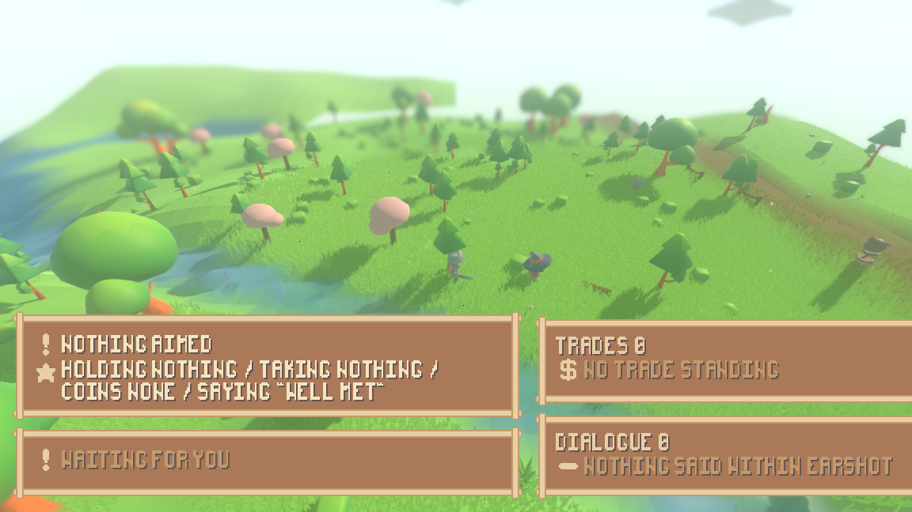
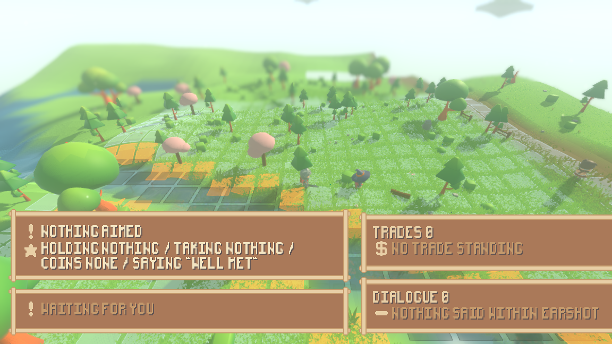
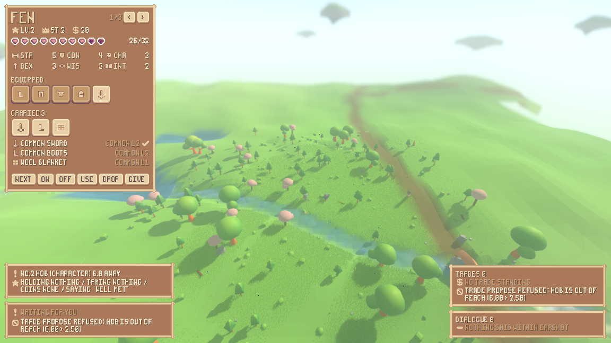
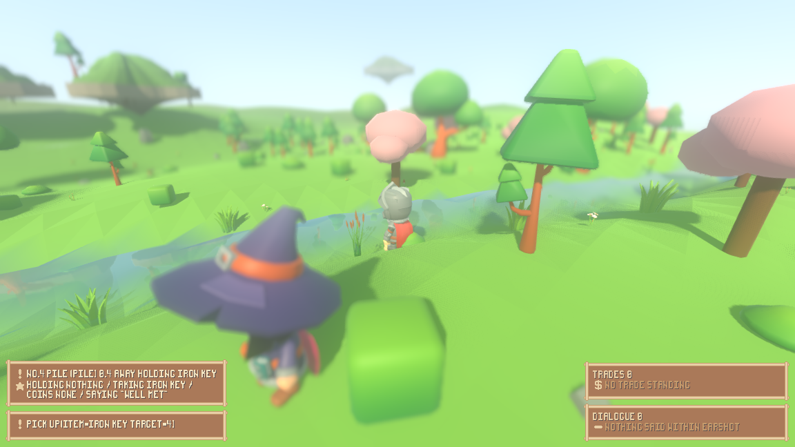
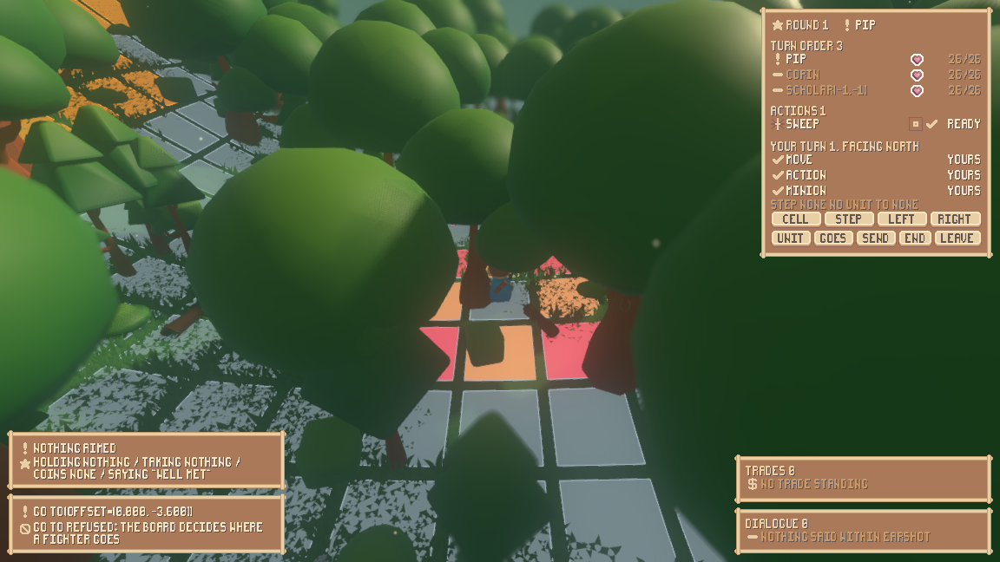
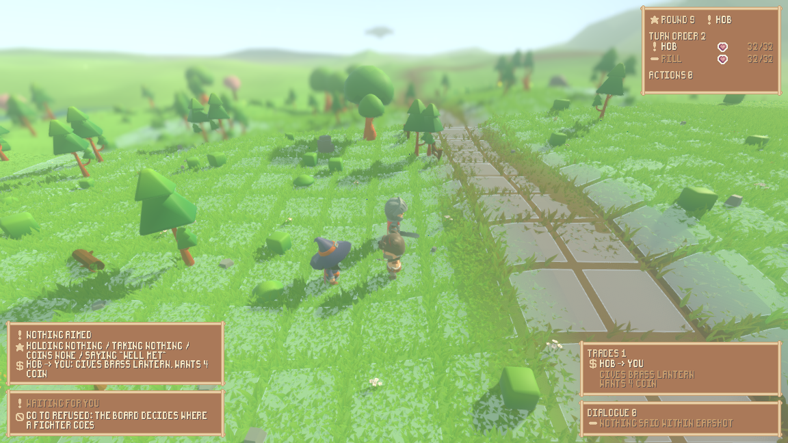
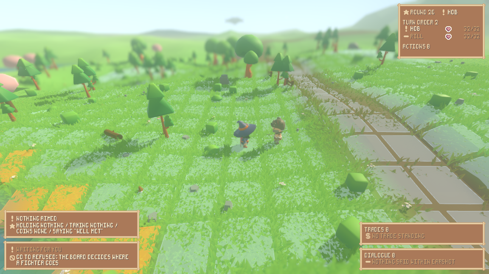
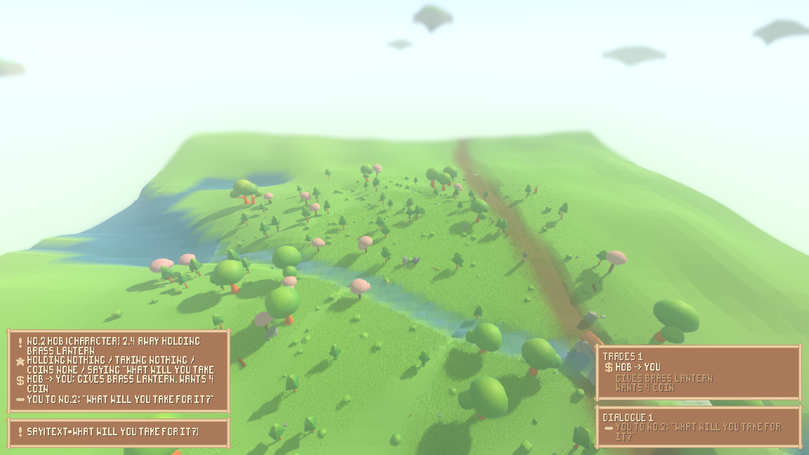

# What you can actually do in this game now

This project is building a small fantasy role-playing game in which the world is
a simulation and the player is one element inside it rather than the thing the
world is arranged around. For most of its life you could not play it: the
mechanics existed and were exercised by automated checks, but there was no way
for a person at a keyboard to be one of the characters. That is what has
changed. This page is about the game as a person meets it — how to start it,
what the little figure on screen is, what you can do and which key does it, what
one turn of a battle looks like, and what it is like to walk around a world in
which every other character is making its own decisions while you make yours.

It also names, as plainly as it names what works, the things that are still not
playable and the things nobody here has been able to judge — because the machine
this was built on has no display.

Everything here has now been driven twice: once when it was first built, and
again after the four worst faults of that first pass were fixed. The second pass
re-judged those four fixes from fresh photographs rather than from the fixes'
own claims, put the whole game through a single run at a single seed, and found
five new faults — one of which is the worst thing on this page.

Since then it has all been checked by somebody who did not build any of it: every
claim below re-run from the command this page gives for it, and the question of
whether a person is really just another character in the world put to a
measurement rather than argued. It held, and the check found two more faults
along the way. That is section 14.

## Start it with one command

On a machine with a graphics card and a keyboard:

    ./run_render.sh --scenario play --play --sheet

That opens the game on the **play stage** — the smallest hand-written world that
holds one of everything a person might want to do something to: a trader, a
brawler, a pile of dropped gear and a locked chest. Drop `--scenario play` and
you get the ordinary generated world instead, which is emptier, wilder, and the
only place enemies turn up by themselves.

`--play` is what puts *you* in the world; `--sheet` opens the character sheet
that shows what you are carrying. Nothing else needs to be passed: the tactical
board and the combat readout now appear on their own when a fight starts.

**Nobody here has played that.** Every frame and every trace on this page came
from the same program running inside an off-screen X server (`xvfb-run`), with
key presses injected at named moments and screenshots taken at named moments.
The presses go through the engine's own input queue, so they arrive at exactly
the bindings a person's presses arrive at, and the pictures are the pictures a
person would see. But no one has held a key down, felt a pause, or turned a
camera. Section 11 lists exactly which judgements that leaves unmade.

One small convention, so the commands below read straight: asking for a
screenshot at a tick gets the first frame drawn at or after it, and on this
machine that is often a tick or two later. Every frame is therefore renamed to
the tick its own trace records it was taken on, which is why a command asking for
tick $60$ below produces a file whose name ends `-t61`.

## Words this page uses

This project has invented some vocabulary, and it is re-explained here rather
than assumed.

* A **tick** is one step of the world's clock. There are $20$ of them a second.
* A **seed** is the fixed number the world is generated from. Everything below
  is at seed $1234$, so anybody running the same command gets the same world.
* The **world fingerprint** is a short digest of the entire simulation state
  after a stated number of ticks. Quoting it before and after a change is how
  this project proves the simulation did not move when it was not meant to.
* A **decision function**, or a **mind**, is the thing that answers "what do you
  do next?" for one character. There are several kinds — a written-down script,
  a rule, a language model — and, since this milestone, a person at a keyboard.
* The **action catalogue** is one table listing every action the game has: the
  twelve atomic verbs of the design plus the ways of naming them. Each row also
  carries how many ticks that action **occupies**, meaning how long the
  character is busy doing it.
* A **stride** is how far a walking character moves in one tick: $0.9$ world
  units. A **leg** is how far the wandering rule sends a character in one go:
  $18$ units, which is exactly $20$ strides.
* The **board** is the square lattice a fight snaps onto — a turn-based tactical
  grid painted on the ground where the fight is happening. The **readout** is
  the panel beside it saying whose turn it is. The two **grid-square** faults
  this page opens with are about how that lattice is drawn.
* A **commander** is a character who takes a turn on the board in their own
  right; a **minion** is a lesser piece a commander sends. A **band** says who
  came into the world together — it is not the same as which side of a fight
  you are on, and section 9 is about the difference.
* The **render shell** is the program you launch; **headless** means running the
  simulation with no graphics at all, which is what the automated checks do.
* A **playtest pass** here means one sweep in which every component is driven
  from that shell with keys pressed at named ticks, photographed, and judged by
  what a player would see rather than by whether the code ran. There have been
  two: the **first pass** (commit `f17e074`) and the **second pass** (commit
  `845a94d`), which is where most of the numbers below now come from. The
  **independent check** of section 14 is not a third pass: it re-ran the second
  pass's own commands and compared, rather than photographing anything new.

---

## 1. The figure on screen, and the world around it

You drive one character. On the play stage it is Fen, a level-$2$ commander with
a sword, boots, a blanket, a draught and some coins. The camera looks down at
the world from behind and above, in the shallow, boxy way a diorama is looked at
— which is what "2.5-dimensional" means here: the world is fully three
dimensional, but you always see it from about the same angle.

The important thing is not the figure but what is going on around it. The world
is *running*. Every other character is inside an action the engine is carrying
out on every tick, and is asked afresh every five ticks whether it still wants
to be doing that. With the player pressing nothing at all, the journal of an
ordinary run reads like this:

```
Scholar(-1,-1) changed its mind at 15/20t
attack refused: Scholar(-1,-1) is outside the pattern of a common buckler from here
Fen began go_to(offset=(0.000, -3.600)), 4 ticks
```

Two of those lines are somebody else and one of them is you, and **nothing in
the journal says which**. That is the point of the whole milestone. A person's
choice is put into a holder by the keyboard code, and the world's own control
loop picks it up on its next tick exactly as it picks up a wandering rule's
choice. There is no second movement path, no second arrival test, no second
opinion about how far anybody can jump. The file that turns key presses into
intentions names no rule and decides nothing; it builds an action and hands it
over.

The second pass checked that by pressing nothing for thirty-four ticks and
reading who was busy: four characters — Pip, Nettle, Corin, and a `Scholar` the
enemy field had stood up unasked — each inside an action on every tick while the
person did nothing at all.

What you may aim at is decided the same way. Pressing Tab cycles through the
things your character can actually make out — and that list is the world's own
answer, built from the identical packet of information a language-model mind is
handed when it is asked what to do. You cannot aim at something your character
cannot see, because the rule that decides what a character can see is the rule
that already answered that question for everybody else.

## 2. What a person can do

Fifteen things, all of them reachable from the keyboard. The refusals in the
right-hand column are the engine's own sentences, quoted from real runs; where a
sentence contains a name or a number the engine fills in, the slot is written in
angle brackets rather than a specimen value.

Aiming first: **Tab** aims at the next thing in sight, **F** turns the ring of
what you are carrying (including *nothing*, which is bare hands and is a real
choice), **C** picks one of the things visible inside whatever you have aimed
at, **B** picks the next line to say, and **-** / **=** dial the coins in your
next offer. **Z** opens and shuts the character sheet.

| verb | how it is reached | what refuses it |
|---|---|---|
| go to | **W A S D** or the arrow keys — one step of $3.6$ units in the camera's directions; **P** — go to what is aimed at; **G** — go to the nearest place the world has a name for | `go_to refused: the way to the position is blocked`; while a fight is holding you, `go_to refused: the board decides where a fighter goes` |
| jump | **J** — a hop of $3.0$ units, inside ordinary reach; **K** — a leap of $12.0$, deliberately outside it | `jump refused: 12.00 is further than DEX 3 jumps (3.75)`; `there is nothing to land on there` |
| attack | **N**, at what Tab aims at, with what F holds | `attack refused: <name> is outside the pattern of a <item> from here`; `you are holding nothing to attack with` |
| say | **T** — say the picked line to what is aimed at; **Y** — shout it | `say refused: <name> is out of earshot (<distance> > <reach>)`; `there is nothing to say` |
| offer a trade | **O**, after C has picked what you want and **-**/**=** have set the coins | `trade_propose refused: Hob is out of reach (6.00 > 2.50)` |
| accept an offer | **U** | `trade_accept refused: the offer from Hob was denied` |
| deny an offer | **I** | `trade_deny refused: Hob has offered nothing` |
| pick up | **Q**, taking the thing C picked out of what Tab aimed at | `pick_up refused: the pile is out of reach (4.00 > 2.50)` |
| drop | **X** — put down what you hold; **V** — put it into what is aimed at | nothing in hand to put down |
| examine | **E** — what is aimed at; **L** — what is held | `there is nothing with id <id>` |
| interact | **H**, using what you hold on what is aimed at | `interact refused: Hob is a character: talk or trade`; `interact refused: a wool blanket is not what the chest opens with, so it is put to a check` |
| wait | **M** — $5$ ticks a press, pressed again for longer | nothing refuses it |
| put on / take in hand | **1**, on whatever F holds | `equip refused: a <item> goes in no slot, so it cannot be worn or held` |
| take off | **2** | nothing is on in that slot |
| use up | **3** | `use refused: a common sword is not used up: it is kept` |

Once a fight has you, the keyboard changes under you and a second, smaller set
applies: **[** picks the next cell you may step onto and **]** steps onto it;
**;** picks one of your minions, **'** picks a cell for it and **\\** sends it
there; **4 5 6 7** spend the first, second, third or fourth of your weapon
actions; **8** and **9** turn a quarter left or right, which is free; **0** ends
your turn; and **.** leaves the fight altogether and puts you back in real time.

**The refusals are the best writing in the game, and they are not decoration.**
A refusal tells you the number, the threshold and the reason in one sentence,
which means a player who is told no also knows what to do about it. That is also
why the keys are not greyed out when they cannot be used: an interface that
disabled the "put it on" key for a blanket would be a second, quieter copy of a
rule that already exists in the simulation, and the two copies would eventually
disagree.

Here is the whole catalogue driven once through from a written-down script of
presses, at seed $1234$, printed by `./tools/play_actions.sh`:

```
verb            at                     the engine's answer
examine         #2                     examine ok id=2 name=Hob kind=commander health=unhurt fighting=false equipment=- distance=6.0
say             #2                     say ok shout=false heard_by=1 check=1 context=persuade:#2
trade_propose   #2                     trade_propose refused: Hob is out of reach (6.00 > 2.50)
go_to           #2                     go_to ok at=(-476.400, 420.000) walked=0.0 steps=0
trade_propose   #2                     trade_propose ok to=2 give=1 give_money=0 want=0 want_money=2
trade_deny      #2                     trade_deny ok from=2
trade_accept    #2                     trade_accept refused: the offer from Hob was denied
trade_accept    #2                     trade_accept ok from=2 took=1 took_money=0 gave=0 gave_money=4
pick_up         #4 with iron key       pick_up ok item=iron key from=4
interact        #5 with wool blanket   interact refused: a wool blanket is not what the chest opens with, so it is put to a check
interact        #5 with iron key       interact ok target=5 opened=true used=iron key
pick_up         #5 with silver ring    pick_up ok item=silver ring from=5
drop            #5 with iron key       drop ok item=iron key into=5
equip           - with common boots    equip ok item=common boots slot=boots instead_of=- moves=2 attacks=2 defence=0
unequip         - with common boots    unequip ok item=common boots slot=boots moves=1 attacks=2 defence=0
use             - with mending draught use ok item=mending draught worth=8 mended=6 health=32 of=32
wait            -                      wait ok ticks=5 until=205
jump            (-482.9, 417.9)        jump ok at=(-482.939, 417.891) gap=3.0 reach=3.75 dex=3
jump            (-482.9, 405.9)        jump refused: 12.00 is further than DEX 3 jumps (3.75)
```

That is a conversation, a bargain that is refused for distance, closed for money
and denied once on the way, a key taken off a pile and used to open a chest, a
ring taken out of it, boots put on and taken off, a draught drunk, and a jump
that is allowed followed by one that is not.

All fifteen of those rows have since been begun by a person's key presses inside
**one** run of the game, which is section 10.

---

## 3. The two grid-square faults, before and after

The user reported two things wrong with the tactical squares: they did not sit
on the ground, and grass grew through them. Both were in the drawing code, and
both are fixed. Nothing in the simulation was touched — the fingerprint at seed
$1234$ is identical on both sides of the change.

**Fault one: a square on a slope cut into the hill and floated off it.** A cell
used to be drawn as four corners all at one height, so on any incline the
uphill half was buried and the downhill half hung in the air. A cell is now cut
into $2 \times 2$ quads and its height is read from the terrain at each of the
nine sub-vertices, while its extent in the two horizontal directions is exactly
what it always was. The outline is walked round the same ring of sampled
points, so no edge floats free of the square it bounds. A cell over water keeps
its flat anchor height, because there is no surface under a hole to follow.

| before | after |
|---|---|
|  |  |

    xvfb-run -a ./run_render.sh --seed 1234 --start 198 -102 --paused --board \
        --no-grass --camera 0 14 18 --aim 2 --focus 0 \
        --screenshot "$PWD/reports/assets/board-hug-slope-after.png" --screenshot-frame 120

(The `before` frame is that same command run on the commit before the change.)

How finely to cut a cell was decided from numbers, not taste. The ground itself
is meshed at $2.00$ units and a painted square is $2.58$ across, so two cuts
already resolve finer than the ground does. The flat plate stood $0.340$ units
off the surface on average and $1.929$ at worst; two cuts brings that to
$0.0045$, and three would buy $0.0020$ for $1.95$ times the vertices ($34{,}398$
against $17{,}640$) and nearly twice the build time. The height the square is
lifted by came down from $0.09$ to $0.045$ in the same pass, because a square
that follows the surface no longer has to clear the cell's own relief — only the
faceting of the ground mesh, which is $0.0083$ on average.

**Fault two: grass hid the squares.** The grass layer knew nothing about the
board and grew straight through it. It is now told where the board is through
exactly the path the grass already used to part around walking characters — four
values written once per frame onto the single shader material every grass chunk
shares, so the cost does not grow with the number of chunks drawn. A blade
standing over a painted square is shortened; a blade in the gutter between
squares is not.

| before | after |
|---|---|
|  |  |

    xvfb-run -a ./run_render.sh --seed 1234 --start 228 -60 --paused --board \
        --camera 0 10 14 --aim 1 --focus 0 \
        --screenshot "$PWD/reports/assets/board-grass-after.png" --screenshot-frame 120

Shortening the blades was chosen over fading them out, after building both and
photographing both at two cameras. Close in, the fade leaves full-height
silhouettes standing across the square and turns them to speckle while the
shortening crops them cleanly. At the far diorama camera the two are within
$3.1$ levels per channel of each other, so that pair alone would not have
decided it and the write-up says so. The tie-breaker is cost: fading needs the
shader to throw pixels away, which gives up a depth optimisation on tens of
thousands of instances, where shortening is a multiply into a number the shader
already has.

**Both fixes were then re-photographed by somebody not trying to prove them.**
The second pass took the same moment of the same world twice — grass on both
times, the lattice the only difference, all frames landing on tick $8$:

| the board switched off | the board switched on |
|---|---|
|  |  |

    xvfb-run -a ./run_render.sh --seed 1234 --scenario play --play --board \
        --camera 0 16 20 --aim 2 --screenshot-ticks "8:reports/assets/playtest-board-grass-t8.png"

Over the lattice the two frames differ by a mean of $19.08$ levels per colour
channel while the mean green barely moves ($182.25$ against $177.70$) — the
board is clearing grass locally, not washing the whole picture out. Over a
control box of sky and far hill that no lattice is in, the same two frames
differ by $0.15$, which is what says they really are the same moment of the same
world and the $19.08$ is the squares and nothing else.

**And one complaint that stands.** Some squares are drawn amber. They are cliff
edges. Nothing on screen says so, and there is no legend.

---

## 4. Walking at the same speed as everybody else

The walk animation and the movement itself were right from the start: a
self-driven character advances $0.878$ units on every one of the twenty ticks its
walk occupies, reports a speed of $0.900$ throughout, and plays its walking clip
the whole way. Movement happens while it happens rather than being a teleport at
the end.

A person's walk was not that walk. Pressing **W** issued a walk of $3.6$ units,
but the catalogue charged every walk a flat $20$ ticks whatever the distance. So
a key press was four ticks of walking followed by sixteen ticks of standing
still, unable to do anything, having already arrived:

| who | distance | ticks | speed |
|---|---|---|---|
| any character the world drives itself | $18.0$ units | $20$ | $0.90$ units per tick |
| a person pressing **W**, before | $3.6$ units | $20$ | $0.18$ units per tick |
| a person pressing **W**, now | $3.6$ units | $4$ | $0.90$ units per tick |

The ratio was exactly $5$. It is now exactly $1.000$, with no tolerance spent.

The fix is at the rule and not at the keyboard. A walk is now charged the
strides it actually takes, counted in the very same strides the walking code
then takes, clamped into $[1, r]$ where $r$ is the catalogue row's own number —
which is re-read as *the most a walk may occupy* rather than a flat price. So no
walk got longer than it was, a walk aimed further than one action may hold still
has its remainder finished afterwards exactly as before, and the change holds
for every caller of the catalogue rather than only for the person.

What that did to the characters the world drives itself was quoted rather than
assumed. The entire difference across a $48$-tick trace is four lines, all of
them one enemy's approach, now charged $16$ ticks for $16$ strides. Every
wanderer's line is byte-for-byte identical, because the wandering rule's leg was
already exactly $20$ strides — it had been paying the right price all along.
Three seed-$1234$ fingerprints are unchanged across the change; four checked-in
transcripts moved, each because its run now gets through the same plan sooner,
and each is quoted with that reason.

**The second pass re-measured it from the pictures rather than the trace.** It
photographed a single step six times and compared the world band of the frames
against each other in grey levels. The picture changes right through the action
— about half the change by tick $10$, the rest by tick $13$ — and then stops
changing, and tick $13$ is the tick the trace says the action finished. Under
the old cost the picture stopped changing a quarter of the way in and the
character stood there for sixteen ticks. There is no such tail now.

**One seam is left, and it is honest to name it.** A self-driven character's next
walk begins on the very tick the last one ended. A person's next walk begins one
tick later, because the press has to be taken up on the following tick. So a
person walking without pause sustains $3.6 / 5 = 0.72$ units a tick against a
wanderer's $0.90$ — $80\%$, not $100\%$. Each individual walk is at full pace;
it is the join between two of them that costs a tick. Whether that seam is felt
as a hitch is one of the judgements only a person at a keyboard can make.

**It broke exactly one automated check, and that was fixed where the fault was.**
One check had a tick number written into it: it asserted that a certain patch of
ground still belonged to nobody at tick $55$ of a fixed run, before a bargain
was honoured that would hand it over. A cheaper walk lets that run get through
its plan sooner, so the moment the ground changed hands moved from tick $62$ to
tick $34$ — measured, not guessed — and tick $55$ became ground that had been
owned for twenty-one ticks. The check now steps a run of its own and asks the
ownership rule when the ground turns over, instead of being told; the only
number still written down is a bound on how far to look. That is deliberate: a
bound that is wrong fails by saying *it never happened*, where a tick that is
wrong fails as a baffling assertion about something unrelated. The rewritten
check passes on the old code as well as the new, which is how it is known to be
repaired at the cause rather than tuned to the new number (commit `35ff3f0`).
Two other checks name a tick of a fixed run in the same way; both were
re-measured, both still hold, and both were left alone.

For a walk that is not a whole number of strides — which only the **P** and
**G** keys produce, because they aim at a place somebody else chose — the rate
is at worst $0.80$ units per tick on a four-tick walk and $0.88$ on a twenty-tick
one. That bound is derived from the rule rather than asserted.

---

## 5. The interface did not fit the window the game ships in

This one is worth stating baldly because it made two other things unplayable.
The game ships in the engine's default window of $1152 \times 648$ pixels. The
interface is pixel art multiplied by a whole number, and that number used to be
picked from a nominal design height with nothing afterwards asking whether what
had been laid out at that size still fitted. It did not.

Measured from the shell's own printed rectangles, before the fix: the combat
readout ran $120$ pixels past the right edge and $68$ past the bottom, taking the
end-turn button off screen with it. Opening the character sheet placed the trade
panel at $y = 750$ and the dialogue panel at $y = 922$ in a $648$-pixel window —
not clipped, placed off screen altogether.

| before: the sheet open, every other panel gone | after: the sheet open, every panel on screen |
|---|---|
|  |  |

    xvfb-run -a ./run_render.sh --seed 1234 --scenario play --play --sheet --journal \
        --input 10:f,14:1,22:2,28:f,32:3,40:f,44:x,52:tab,54:f,58:o \
        --screenshot-ticks 62:reports/assets/window-fit-bag-t62.png

The consequence was not cosmetic: the one panel that tells you
`use refused: a common sword is not used up: it is kept` was off the screen at
the exact moment you pressed the key that provoked it. **A person operating
their inventory could not see the engine's answer to what they had just done.**

The rule now asks the panels what they need and picks the largest whole-number
multiplier that still fits. The second pass asked for every panel at once — the
sheet, the readout, the board, the dialogue and the trade panel — and read the
shell's own printed placements back at the shipped size:

| panel | placement | right edge | bottom edge |
|---|---|---|---|
| sheet | `x=8 y=8 w=287 h=374` | $295$ | $382$ |
| readout, no fight on | `x=875 y=8 w=269 h=350` | $1144$ | $358$ |
| readout, while a fight is on | `x=875 y=8 w=269 h=290` | $1144$ | $298$ |
| readout, while a fight is on | `x=936 y=8 w=208 h=148` | $1144$ | $156$ |
| trade | `x=846 y=515 w=298 h=57` | $1144$ | $572$ |
| dialogue | `x=846 y=576 w=298 h=64` | $1144$ | $640$ |

Every number is inside $1152 \times 648$. (The tallest readout row above is the
biggest one this pass printed, and an earlier edition of this page labelled it
"in a fight". It is not: the run that printed it had put its board away
seventy-seven ticks earlier. The two rows under it are readouts printed while a
board really was holding somebody, and they are smaller. The independent check
of section 14 read all $91$ panel placements in every trace this pass committed
rather than the four quoted here: $88$ are inside their own window, and the
three that are not are all in one leftover file from the first pass that nothing
on this page cites and no session now produces.) The same run at $1280 \times 720$
keeps the same scale and lands at bottom $712$; at $2560 \times 1440$ it doubles
the scale and lands at right edge $2544$, bottom $1424$. Nothing was given up in
the art for it — $0$ of $86{,}080$ pixels are off the art's palette and $0$ of
$17{,}062$ edges are off the pixel grid at $1\times$, and the same two zeroes at
$2\times$.

The panels also stopped eating the window. In an ordinary real-time frame they
now occupy $17.7\%$ of its height and $7.1\%$ of its pixels, against the first
pass's $35\%$ and $25\%$.

**What it cost, and this is a real complaint rather than a quibble.** Part of
the fix is a scale drop: at $1152 \times 648$ the whole interface is now drawn at
one-times where the combat readout used to be two-times. Everything fits, and
everything is half the size it was. Whether a pixel font at one-times on a
$648$-pixel screen is comfortable to read for an hour is exactly the kind of
judgement a photograph cannot make, and it is handed back with the command.

**One part of that cost is not a matter of taste, and the independent check
found it.** The font the interface is drawn in writes a zero with a slash
through it. At two-times the slash and the ring around it are two pixels apart
and the digit reads; at one-times they are one pixel apart, the slash fills the
middle, and a $0$ is indistinguishable from an $8$. In
`assets/playtest-ended-t301.png` the counts read `TRADES 8` and `DIALOGUE 8` on a
frame where both are zero — the reviewer only caught it because the line
underneath said `NO TRADE STANDING` — and in `assets/playtest-items-pile-t26.png`
the readout's `0.4 AWAY` reads as `8.4 AWAY`, which is a distance a player would
act on. Health, coins, round numbers and every count in the game are drawn in
that font. It is a misreading rather than a strain, and the smallest fix is to
draw the digit without its slash.

---

## 6. The inventory, operated

The character sheet is not just a display. **Z** opens it, **F** turns the ring
of what you carry, and **1**, **2**, **3** put on, take off and use up whatever
is held; **X** drops it and **O** offers it to somebody. Two moments from one
run of six photographed ticks — note the hearts, which the draught filled:

| after **1** puts the boots on | after **3** drinks the draught and **X** drops the sword |
|---|---|
|  |  |

    xvfb-run -a "$GODOT" --path . --resolution 1280x800 --fixed-fps 30 -- \
        --seed 1234 --scenario play --play --journal \
        --input "2:z,3:tab,4:p,26:f,27:1,33:2,38:f,39:f,40:3,46:f,47:f,48:f,49:x,54:f,55:f,56:f,57:o" \
        --screenshot-ticks "32:reports/assets/inventory-2-equipped.png,53:reports/assets/inventory-5-dropped.png"

The engine's answers are specific enough to play against:

```
equip ok item=common boots slot=boots instead_of=- moves=2 attacks=2 defence=0
unequip ok item=common boots slot=boots moves=1 attacks=2 defence=0
use ok item=mending draught worth=8 mended=6 health=32 of=32
drop ok item=common boots into=6
```

Putting boots on raises what the character may do with a turn from $1$ move to
$2$; taking them off puts it back. Drinking the draught mends $6$ of a possible
$8$ because the character was only $6$ hurt. The sheet shows name, level,
standing, coin, hearts, all six abilities, every equipped slot, everything
carried, and a tick beside the thing currently in hand.

Since the window fix, the engine's reply to the key you just pressed is on the
screen *beside* the sheet rather than off the bottom of the window. This is the
second pass's own photograph of that, at tick $58$ of an eleven-press session:



    xvfb-run -a ./run_render.sh --seed 1234 --scenario play --play --sheet --journal \
        --input "10:f,14:1,20:2,26:f,30:3,36:f,40:x,46:tab,48:f,52:o,60:z" \
        --screenshot-ticks "56:reports/assets/playtest-bag.png"

**Three complaints about that sheet, all still open.** Its five equipped slots
are unlabelled icon boxes, so you cannot tell which slot is which without taking
something off and watching which box empties. Its six buttons say
`NEXT ON OFF USE DROP GIVE` and do not name the keys that press them, so a
player has to have read the thirty-six-line key list the shell prints at
startup. And while it is open it covers the left third of the world, which is
where the followed character is drawn.

---

## 7. Things on the ground, and enemies that arrive by themselves

**Items exist as objects in the world.** Gear is randomly generated, has a model,
lies where it is dropped and can be picked up again. A defeated enemy's
belongings appear where it fell. The whole cycle runs from the keyboard —
`pick_up ok item=iron key from=4`, then `drop ok item=common boots into=6`.

**But you cannot see them, and this is unfixed.** The second pass tried four
runs at three camera placements — close from the front with the grass on, the
same again with the grass off, standing on the pile with the grass off, and high
off to the side with the grass off — and no pile is identifiable in any of the
ten frames. This is the third of those runs, taken while the person is $0.4$
units from the pile and the readout is naming what it holds:



Three things stack up: the play stage's key is one of seven shipped items with
no model of its own and is drawn through a fallback sack $0.83$ units tall; the
grass is about that tall; and a pile lies on the ground *under* your character,
at the camera the game ships with. The readout does its best —
`NO.4 PILE (PILE) 0.4 AWAY HOLDING IRON KEY` — but a player is picking things up
by reading text, not by seeing them.

**Enemies place themselves.** In the ordinary generated world, hostile
characters are laid out by a sparse field on a $64$-unit lattice: at most one to
a cell, decided by a hash of the cell and the world seed, refused on water, on
cliffs and inside villages. They stream in and out around whoever is in the
world, they are asked what to do through the same seam every other character
uses, and they can start a fight because one of them chose to swing. At seed
$1234$, unasked, an enemy walks about, weighs attacking against walking on, and
engages at tick $26$.

---

## 8. A turn in a battle

When a fight begins the world snaps onto a tactical board and the clock changes
from ticks to turns. Until recently a fight that started *by itself* was drawn
as nothing at all — the lattice was built only if you had asked for it on the
command line, and so was the readout — so a player was held on an invisible
board and every key they pressed was echoed and then silently thrown away. Both
halves are fixed. The board and the readout now come up on the tick a fight
starts and go away when it ends, on the plain command with no extra flags:

    xvfb-run -a ./run_render.sh --seed 1234 --play --journal --camera 0 9 14 --aim 1 \
        --input "6:w,12:w,18:w,24:w,30:w,36:w" \
        --screenshot-ticks "60:reports/assets/playtest-enemy-close.png"

That command asks for neither the board nor the readout. At tick $26$ an enemy
the field placed engages, and the shell prints
`readout scale=1 x=875 y=8 w=269 h=290 fight=1` for a run that never asked for a
readout. This is tick $61$ of it:



The lattice is drawn, the cells the turn offers are coloured, and the readout
names the round and whose turn it is, lists the turn order with everyone's
health, the weapon actions with the ticks left on each cooldown, what is left of
the turn, and buttons that press the same keys. Every real-time key pressed
while a board holds you now comes back with the engine's answer — for instance
`go_to refused: the board decides where a fighter goes` — instead of being
discarded in silence.

**A turn, played.** On the battle stage, where the scenario musters two
commanders next to each other, a whole fight is playable end to end from the
keyboard and it is the most finished thing in the game:

```
fight t=16 the board appears
t=16  round 1 picks step none #3 to (-171,130)
t=21  round 1 turn send a minion -> done
t=26  round 1 turn turn left    -> done
t=26  round 1 turn end the turn -> done
t=42  round 2 turn step         -> done
t=48  round 2 turn weapon action 1 -> done
t=56  round 2 turn send a minion -> done
t=58  round 2 turn end the turn -> done
fight t=61 the board is put away
```

Entered, two turns taken with a move, a weapon action, a minion sent and a free
turn, the other commanders took theirs, the fight resolved, and it went back to
real time in $61$ ticks. This is the readout during round $2$ of that fight,
whole, with both the end-turn button and the leave-the-fight button on screen:


    xvfb-run -a ./run_render.sh --seed 1234 --scenario battle --play --readout --board --journal \
        --input "<27 presses>" --screenshot-ticks "28:reports/assets/playtest-fight.png"

Before the window fix, the same panel was sliced by the right edge of the
window. Its turn prompt read `YOUR TURN 2. FACING WES` — the `T` was past the
edge, and so was the button that ends your turn:

| before: the end-turn button is not on screen | after: the whole button row is |
|---|---|
|  |  |

**Two things about a board are still wrong.** A weapon action answers `done` and
nothing else — no target, no hit, no damage — where the same blow struck by a
character the world drives itself reports
`attack ok attack=thrust cells=2 hits=1 dealt=13`. And under the turn prompt the
board draws a step line — `STEP NONE NO UNIT TO NONE` — in a grey a shade off
the panel it sits on, which makes it the lowest-contrast text in the game saying
the least.

---

## 9. A fight you walked into can now be finished, and can be left

A fight on the *battle* stage always worked, because the scenario stands the two
opponents next to each other. A fight you walked into in the running world could
not be brought to an end at all. Twenty rounds of stepping, turning and swinging
would leave the readout still reporting a fight and the board never put away.

The obvious explanations were both measured and both were wrong. The distance at
which a fight snaps on is innocent: the snap leaves $9.00$ world units, which is
three king-steps at a cell size of $3.0$, and the gap closes by round $2$. Minds
were not frozen either — a rule-driven enemy was shown walking across the board
on the *unfixed* code.

**The real cause was that the board could not tell a companion from an enemy.**
It seated every commander as its own side, so a friend the join radius pulled
into the fight arrived as a third party — and the fight's ending condition was
"one side left standing". The only available end was killing your own ally, and
in the reproduction that is exactly what twenty rounds of play did: the enemy
died at round $12$ and the fight went on, beating the friendly trader from
$32/32$ down to $10/32$.

The first repair tried was the obvious one — read a band as a side — and the
existing checks caught it as wrong within one run, because one scenario
deliberately puts every commander in one band so that no fight starts by
drifting. Reading bands as sides made two chosen opponents allies. The rule that
ships is narrower: **a fight is between two** — the pair the engagement rule
found, or the one who struck and the one struck — and everybody else is a
bystander the radius reached. Each of the two is its own side whatever band it
shares; every other commander joins whichever of the two shares its band; one
sharing a band with both or neither stands alone; and a fight that was never
told which two it is between leaves everyone their own side, which is every
board a scenario stands up directly, unchanged.

**Leaving** was settled at the same time, and both halves of the question were
answered rather than one. The catalogue goes on naming "Flee", because a walk
aimed away from what is coming *is* fleeing and that is a call anybody can make
in real time; what is refused is a walk by somebody a board is already holding.
On a board, the same intention is a turn spent leaving — **.** — which takes the
commander and its minions off the board alive and puts the character back in the
world where it stood, carrying what it carried. A turn spent leaving buys none
of the things a turn otherwise buys, so the turn economy is untouched.

**Both halves were then re-judged by the second pass, from frames.** A fight
walked into can be **ended**: one $795$-tick run has `the board is put away`
in it three separate times, at ticks $250$, $493$ and $736$. And it can be
**left**: `round 3 turn leave the fight -> done` at tick $157$, and forty-eight
ticks later the person is out of the turn order and standing in the world while
the fight goes on without them:



    xvfb-run -a ./run_render.sh --seed 1234 --scenario play --play --journal \
        --camera 0 9 14 --aim 1 --input "<walk east, two turns, then . every other tick>" \
        --screenshot-ticks "205:reports/assets/playtest-left.png"

**But read why the ended fight ended, because this is the worst thing on the
page.** In those seven hundred and ninety-five ticks the journal holds exactly
three blows, all of them the enemy's, landing every sixteen ticks for $11$, $12$
and $13$ against a person who started six down of thirty-two. The person was
beaten at tick $176$ — and **the game never says so**. The readout drops them
from the turn order and says nothing. The action panel goes on saying
`WAITING FOR YOU`. The answer panel goes on showing a walk that was refused two
hundred ticks earlier. Every key from then on is answered `it is not your turn on
a board`. The journal does not say it either: the three blows name the person
only as `target=1`, and their own name last appears thirty-five ticks before the
first blow and not once in the six hundred and eighty-six ticks that follow.
This is tick $301$, round $26$ of a fight the player lost at tick $176$:



The engine has the sentence for it — `sim/action_engine.gd:180` holds
`"%s is down"` — and nothing on the board's side of the keyboard ever reaches
it.

The independent check of section 14 confirmed that arithmetic without taking any
of it on trust: an earlier frame of the same run shows the person at $15$ of $32$
after the first thrust of $11$, so they began at $26$ of $32$, and re-running the
session printed a character sheet reading `26/32` outright. $26 - 11 - 12 - 13 =
0$ at tick $176$.

**And a fight that ends starts again three ticks later.** Nothing walks away and
nothing cools off, so the same two characters are still inside the engagement
radius when the board is put away and re-engage immediately: put away at $250$,
back at $253$; away at $493$, back at $496$; away at $736$, back at $738$. Three
whole fights in one run, none of them chosen.

---

## 10. The whole game, in one run

The line the first pass could not close is now closed: movement, an action of
every kind, the inventory, a fight entered from the running world, turns taken on
its board, the fight left from the keyboard, and the return to real time — one
seed, one command, one run of $362$ ticks and $95$ key presses.

    xvfb-run -a ./run_render.sh --seed 1234 --scenario play --play \
        --journal --sheet --board --readout --camera 0 9 14 --aim 1 \
        --input "<95 presses>" --screenshot-ticks "<11 ticks>"

Four stretches, in the order a person meets them.

**Ticks 6 to 160 — every row of the catalogue, and the wardrobe.** All fifteen
rows began in this one run: nine walks, four examines, two jumps, two spoken
lines, two waits, and one each of attack, drop, put on, take off, use up, pick
up, interact, offer, accept and deny. The key came off the pile, the boots went
on and came off, the draught was drunk, the sheet was opened and shut.

**Ticks 166 to 197 — the walk east, and a fight nobody asked for.** Nine presses
of **D**, and at tick $197$: `fight t=197 the board appears`. An enemy noticed,
closed, and the fight snapped on. Nothing on the command line asked for it.

**Ticks 226 to 264 — two turns on the board, and the leave.**

```
t=229 round 1 turn step            -> done
t=234 round 1 turn weapon action 1 -> done
t=234 round 1 turn weapon action 2 -> refused: already acted this turn
t=240 round 1 turn end the turn    -> done
t=248 round 2 turn weapon action 1 -> done
t=256 round 2 turn end the turn    -> done
t=264 round 3 turn leave the fight -> done
```

This is tick $240$ — a turn on a board the world started, with the sheet and the
readout both open and both inside the window:


**Ticks 310 to 360 — real time again.** Two walks, a wait, two examines and an
aim, every one of them answered:

```
t=316  go_to ok at=(-462.000, 423.600) walked=4.449 steps=5
t=322  go_to ok at=(-458.400, 423.600) walked=3.6 steps=4
t=328  wait ok ticks=5 until=333
t=335  examine ok id=3 name=Rill kind=commander health=unhurt fighting=true ... distance=2.97
t=354  examine ok item=mending draught seen=common consumable  L2 P=8 mov=0 def=0 eff=8
```

**Two honest qualifications about that run.** *The fight is left, not won.* On
the play stage at seed $1234$ the enemy lands a thrust every sixteen ticks for
eleven to sixteen damage, and the person starts six hearts down of thirty-two:
three enemy turns is the whole budget. A swing aimed by a fixed schedule of key
presses rather than at the enemy answers `done` without landing. Leaving is the
other way the design says a fight ends, and it is the only one that hands a live
person back to real time. A fight fought until the board is put away is in the
run described in section 9, and a battle won end to end is the battle-stage fight
in section 8. *And the first step after leaving is longer than a step*:
`walked=4.449 steps=5`, where every other press walks $3.6$ in four ticks.
Leaving puts the character back on the cell it was standing on and the first walk
covers that remainder. It is consistent and it is answered — but it is the one
place where pressing **W** does not buy a fixed distance.

**One structural limit, and it is now understood exactly.** No single seed holds
both the props the fifteen verbs need and an enemy that arrives by itself, and
the reason is not distance — it is one line of code. Every scenario begins by
handing the world its own cast, and that call stops the enemy field and clears
what it remembers; nothing ever starts it again. So the **play stage** is the
only world with a trader, a pile and a chest, and it can never contain a spawned
enemy at any seed for any number of ticks; the **ordinary world** does spawn them
and holds nothing to trade with, pick up or open. The first pass gave a walking
distance for this — "about $356$ ticks of unbroken walking" — and that estimate
is wrong twice over: the walk-pace fix would have cut it to about $89$ ticks, and
it was never the reason in the first place. The spawned enemy is therefore
exercised in its own seeded run, given with its own command in section 8.

---

## 11. What nobody here could judge

**This machine has no display.** Everything above is photographed frames and
traces from the built shell running under an off-screen X server, and the machine
renders through a software rasteriser at about seven and a half frames a second.
Five judgements need a hand on a keyboard and are handed back rather than guessed
at:

* whether an action that occupies four ticks reads as a step or as a lurch;
* whether *holding* a direction key walks smoothly or stutters — each press is a
  fresh choice, and only the trace was ever read, never a held key;
* whether the walking animation reads as a walk while it is moving — only stills
  were taken;
* whether the follow camera is comfortable to move under;
* whether a pixel font at one-times on a $648$-pixel screen is comfortable to
  read for an hour, which is what the window fix cost.

Run `./run_render.sh --scenario play --play --sheet` on a machine with a graphics
card and those five are answered in a minute. Nothing on this page claims them.

There is also one thing frames could measure, and the measurement condemns it.
A character photographed from $11.18$ world units away is $73$ pixels tall. The
camera the game is actually played from sits $66.84$ units away with the same
field of view, so the same character there is

$$73 \times \frac{11.18}{66.84} = 12.2 \text{ pixels}$$

on a $648$-pixel screen — $1.9\%$ of the window height. (An earlier edition of
this page said $15.2$ pixels. That came from a frame the playtest's own renaming
script had mislabelled; the session was re-run and the figure re-measured, and
$12.2$ is the one to use.) The window fix removed the panels as the excuse —
they are $7.1\%$ of the pixels now — so the camera is the whole of it. This is
the shipped camera in the middle of a conversation, with the person and the
trader $2.4$ units apart:



Neither of them can be picked out. The other thing the frames turned out to be
able to settle is the interface font's zero, which at the size the game now ships
at cannot be told from an eight — section 5 and the defect list. In a forest it
is worse: a whole board of
fighters can sit under a tree canopy with no fade and no camera collision.
Almost every frame in the playtest was taken from a closer camera than the game
ships with, because at the shipped one there is nothing to look at.

---

## 12. What is still not playable

The second pass closed six of the first pass's sixteen defects and found five
new ones; the independent check of section 14 then found two more that neither
pass had named. Eighteen are open. Nothing was fixed inside either judgement
pass: every repair below changes a wording, a camera policy, an art asset, or
when the board reports a blow — each of which needs a decision and a test of its
own.

**Closed since the first pass**, all re-judged from fresh frames rather than from
the fixes' own claims: panels off the window (two of them), a person walking at
one fifth of everybody else's pace, a fight that started by itself and drew
nothing, every key on a board being silently discarded, and nothing letting a
person leave a fight.

**Still open.** The first two are the independent check's; the five after them
are new to the second pass.

| what a player runs into | where it is shown |
|---|---|
| **Every zero on screen reads as an eight.** The interface font's slashed zero closes up at the size the game now ships at, so `TRADES 0` reads `TRADES 8` and a pile `0.4 AWAY` reads `8.4 AWAY`. Every health total, coin count, distance and round number is drawn in that font. | frames `playtest-ended-t301.png` and `playtest-items-pile-t26.png`, enlarged six times |
| **The keyboard refuses an attack the world allows.** Pressing the attack key with nothing in hand answers `you are holding nothing to attack with` and never asks the simulation — which, asked the same question directly, answers `attack ok fight=begins` and starts an unarmed fight. So there is one thing a rule-driven or model-driven character may choose that a person may not, and the sentence the person reads is one the simulation does not own. | `render/player_controls.gd:344` against `sim/action_engine.gd`; the call and its answer are in the review's evidence file |
| **A person can be beaten and the game never says so.** The readout drops them from the turn order, the action panel goes on saying `WAITING FOR YOU`, the answer panel goes on showing a walk refused two hundred ticks earlier, and every key is answered `it is not your turn on a board`. The engine has the sentence and nothing reaches it. | `reports/playtest-ended.log`; frame `playtest-ended-t301.png` |
| **A fight that ends starts again three ticks later**, because nothing walks away and nothing cools off. Three whole fights in one $795$-tick run, none of them chosen. | the same log: away at $250$, back at $253$; again at $493/496$ and $736/738$ |
| **Leaving a fight is acknowledged nowhere on screen.** The trace says `leave the fight -> done`; the answer panel still holds the refusal from before the board appeared, and the readout keeps drawing a fight the person is no longer in. | `reports/playtest-left.log` at $t=157$; frame `playtest-left-t205.png` |
| **The step line is unreadable and is not a sentence.** `STEP NONE NO UNIT TO NONE`, drawn in a grey a shade off the panel it is on. | frames `playtest-enemy-close-t61.png`, `playtest-left-t141.png` |
| **A mind never notices that its target left.** After the person leaves, the enemy goes on choosing an attack on them every eight ticks and is refused every time. | `reports/playtest-whole.log`, six identical refusals between $t=272$ and $t=328$ |
| **A weapon action on the board answers `done` and nothing else** — no target, no hit, no damage — while the same blow struck by a self-driven character reports `attack ok attack=thrust cells=2 hits=1 dealt=13`. | `reports/playtest-whole.log` at $t=234$ |
| **The answer panel keeps its last answer for ever**, with nothing to say how old it is, so a refusal from two hundred ticks ago reads as the answer to what you just pressed. | frame `playtest-ended-t301.png` |
| **`it is not your turn on a board` is also the answer when there is no board at all**, so one sentence means two different things. | `reports/playtest-fight.log`, printed before the board appears and after it is put away |
| **Three wordings for one condition.** Spending a weapon action with nothing in hand is refused on the board as `no such attack`; the real-time key for the same condition says `you are holding nothing to attack with`; and the simulation itself, asked directly, does not refuse it at all. | both strings are in the tree; the first pass reproduced the board half, and the row above is the third answer |
| **The action line is drawn as a call, not a sentence.** The panel prints the engine's wording verbatim, and in the pixel font the brackets are bare vertical strokes and the comma reads as a full stop, so a spoken line is drawn `SAYITEXT="WHAT WILL YOU TAKE FOR IT?"I`. | frame `playtest-verbs-t34.png`, or any frame with an action chosen |
| **Ground items cannot be seen.** Four runs at three camera placements this pass, and no frame with a pile in it, while the readout names one $0.4$ units away. | `reports/playtest-items-pile.log`; frame `playtest-items-pile-t26.png` |
| **Nothing says what an amber square means** (it is a cliff edge). There is no legend, and a fight can be fought across a field of them. | frames `playtest-board-grass-t8.png`, `playtest-enemy-t40.png` |
| **The character is $12.2$ pixels tall** at the camera the game ships with, behind trees and grass with no fade and no camera collision. | the arithmetic in section 11; frames `playtest-verbs-t34.png`, `playtest-enemy-t40.png` |
| **Aiming only cycles forward**, so overshooting the thing you wanted means going round the whole ring; and a character out of sight is offered with its name blank. | `reports/playtest-items.log` at $t=8$ |
| **The character sheet's five equipped slots are unlabelled icon boxes**, and its six buttons do not name the keys that press them. | frame `playtest-bag-t58.png` |
| **A refused walk costs the whole action before saying no.** Pressing **G** toward a landmark answered `the way to the position is blocked` after the walk had run. This is the catalogue working as designed, not a fault, but a player would grumble. | `reports/playtest-verbs.log` |

---

## 13. Where the automated checks stand

The previous edition of this page was entirely about the test suite, and that
work is finished and committed separately as `reports/suite-health.md`. The short
version: for a stretch of this project's life a run in which a test crashed
mid-way was printed as a run in which everything passed, because on this engine a
runtime error abandons only the frame it was raised in and the caller carries on.
That is closed in three places, and a crash planted into a copy of the checkout
now fails the run by name. Four consequences of that work are still live and are
repeated here rather than left in the old document:

* **A green run recorded before commit `74a9855` is not evidence** and should not
  be quoted as though it were.
* **The engine-side runner is still fooled by construction.** Everything rests on
  the crash text reaching the shell wrapper's output. That is a single point of
  trust and a deliberate one.
* **Thirty-four of the suites start a second game engine.** A crash inside one of
  those children never exits; the run goes silent and is ended by a watchdog —
  bounded and reported, never a false pass, but at up to two hours a time.
* **Six end-to-end trading checks turn on what one language-model reply happened
  to do**, sitting in a suite otherwise full of claims about machinery.

**The suite is green on the commit that carries everything on this page.** The
certifying run is `reports/playtest-full-suite.log`, and its last line reads:

```
all 67 suites passed (212360 checks)
```

Exit code $0$. Counted back out of the committed log rather than read off a
screen: $67$ `RUN` lines matched by $67$ `PASS` lines, $0$ `FAIL`, $0$
`SCRIPT ERROR`. (The `WARNING: ... were leaked` and `ERROR: ... resources still
in use at exit` lines after it are the engine's ordinary tidying-up complaints at
shutdown, present in green runs before this one as well. They are not failed
checks.)

Three things make that run worth believing rather than merely green:

* **The tree it ran on was still.** A suite that reads a checked-in transcript
  compares it against code that may change underneath it, which is exactly how an
  earlier run produced ten spurious failures. The playtest wrote nothing under
  the simulation, render, test, network, binary or asset directories:
  `git status --porcelain` over those paths printed nothing before the suite
  started and nothing after it finished.
* **All four structure checks print OK**: the simulation references nothing in
  the render layer, the render layer draws the fight and holds none of it, the
  interface names its art through one file, and the simulation names asset tags
  and no asset.
* **The world fingerprint is unmoved** at `64f9a1c50f4510dc` — the same digest
  the previous certified commit quoted, as it had to be, because the playtest
  changed no file the simulation loads.

**The standing caution has not changed.** A green suite is a statement about one
commit at one moment and not a warrant for a later one, the three reservations
above about the runner itself still hold, and two suites must never be run
against this checkout at once.

---

## 14. What an independent check found

Everything above was made by the people who made the changes, and everything
above has now been checked by somebody who did not. That check ran against the
commit this page's previous edition was written on, and the two probe programs it
wrote for the purpose are in the repository (commit `f1a8bce`), so anybody can
run the same measurements again.

**That a person really is one mind among many was run, not read.** The hardest
mind to be indistinguishable from is a language model, because it is the only
other kind here that cannot answer on the tick it is asked. So the probe put the
two side by side through the one function that drives every character:

* Each of the fifteen rows of the action catalogue was staged twice on identical
  scenes and chosen twice — once as a person's live key press, once as a model's
  reply — with both left standing in the world the same three ticks.
  **Fifteen of fifteen gave the same engine sentence and the same scene
  fingerprint.** None of them moved with the mind.
* Then the ordinary world at seed $1234$ for ninety ticks, driven first by the
  model and then by a person choosing the model's own three actions one tick
  earlier: **$77$ of $77$ journal lines identical**, same world fingerprint
  `dae48234fdc9bac1`.
* And the same person pressing one tick *after* the question rather than before:
  $24$ of the $77$ lines differ, every one of them the character starting one
  tick later, and the fingerprint is the same `dae48234fdc9bac1`. Being slow
  costs you ticks and costs the world nothing, which is exactly the claim.
* No line anywhere in the simulation or the drawing code tests which kind of mind
  is on a character's sheet, and no file on the path that drives them names one.

**The world is still deterministic with a person in its cast.** Two separate
processes ran the same ninety ticks at seed $1234$ with a person driving one
character and a language model another, printing the whole journal: $6267$ bytes
each, byte-for-byte identical.

**The render layer was searched for rules that belong to the simulation** —
legality, reach, cost, damage, cooldown — over all $35$ of its files rather than
a chosen few, twice, with a wider vocabulary the second time. Of $74$ candidate
lines, all but two are either drawing (the grass patch's own radius, the
distances at which detail is dropped) or asking the simulation and printing its
answer; every question of what a fighter may legally do on a board is handed to
the board's own rule. The two exceptions are the attack-with-empty-hands
divergence now listed in section 12, and one line in the fight's drawing code
that recomputes "is this character alive?" as $\text{health} > 0$ instead of
asking the simulation, which agrees with it today and is not pinned by anything
that would notice if it stopped.

**Every playability claim on this page was re-run from the command this page
gives for it.** All fourteen photographed sessions, twenty-three traces, played
again and compared line by line against the committed ones, and the committed
evidence then put back. Everything load-bearing came back: the four wardrobe
sentences word for word, `walked=3.6 steps=4` against the world's `18.0 in 20`,
`pick_up ok item=iron key from=4`, a readout printed by a run that asked for no
readout, the battle-stage fight appearing at tick $16$ and gone by $61$, the
board in the long run put away at $250$, $493$ and $736$ and back three ticks
after each — on the same line numbers of a $1018$-line trace — the three thrusts
for $11$, $12$ and $13$, and all fifteen catalogue verbs begun by the person in
the single long run with the same counts.

**What it made this page change.** Two defects it found are now in section 12
(every zero reading as an eight, and the attack the keyboard refuses that the
world allows); two wordings are corrected above (the combat readout draws nine
buttons, not eight, and the tallest readout in the fit table was measured with no
fight on rather than during one).

**And how far this kind of evidence reproduces, which is worth knowing before
quoting any of it.** The simulation is exact: the same seed gives the same
fingerprint and the same sentences every time. The tick a scripted key press
lands on is not — the shell takes a press on the first frame drawn at or after
its scheduled tick, and this machine draws about seven frames a second, so a tick
number in this report is a label for that run and moves by about one on a
re-run. Measurements taken off the photographs reproduce in their first two
figures and not their third: the lattice-against-no-lattice difference of
$19.08$ came back as $19.14$, the control box's $0.15$ as $0.07$. No conclusion
on this page turns on a third digit, and none should.

---

## Verified facts

Each of these was measured from the built game at seed $1234$, not read off the
code.

* **A person is one mind among many**, and this was measured rather than
  reasoned about. A person's choice enters the world's own control loop through
  the same seam every other character's does, and the journal does not mark which
  line is the person's. Put to the test against a language model on identical
  scenes: fifteen of the fifteen catalogue actions gave the same engine sentence
  and the same scene fingerprint whichever mind chose them, and ninety ticks of
  the ordinary world gave $77$ of $77$ identical journal lines and the same world
  fingerprint `dae48234fdc9bac1`.
* **Answering late costs ticks and nothing else.** The same person pressing one
  tick after the question rather than before moves $24$ of those $77$ lines,
  every one of them by the character starting one tick later, and lands on the
  same world fingerprint.
* **The world is deterministic with a person in its cast.** Two processes, one
  seed, ninety ticks, a person driving one character and a language model
  another: $6267$ bytes of journal each, byte-for-byte identical.
* **Every one of the fifteen verbs is reachable from the keyboard**, and all
  fifteen were begun by key presses inside one $362$-tick run at one seed.
* **A grid square is now bounded by its cell in the two horizontal directions
  and follows the terrain in height**, standing $0.0045$ units off the surface on
  average where the flat plate stood $0.340$ off it, and its outline stands on
  the same sampled points as its fill.
* **Grass over a square is shortened and grass in the gutters is not.** Over the
  lattice, two frames of the same moment with and without the board differ by
  $19.08$ levels per channel; over a control box with no lattice in it they
  differ by $0.15$.
* **A person now walks at $0.900$ units a tick**, against the $0.900$ every
  self-driven character walks at — where before it was $0.18$ against $0.90$.
  Walking without pause, a person sustains $0.72$ against $0.90$, which is
  $80\%$, because one tick is spent joining each walk to the next.
* **Every interface panel now lands inside the shipped $1152 \times 648$
  window**, and at $1280 \times 720$ and $2560 \times 1440$, where before three
  were placed entirely off the bottom and one ran $120$ pixels past the right
  edge. The panels take $7.1\%$ of the window's pixels, against $25\%$ before.
* **A fight that begins by itself draws its board and its readout on the tick it
  starts** and takes them away when it ends, on a command that asks for neither,
  and every key pressed while a board holds you comes back with the engine's
  answer.
* **A fight walked into can be finished and can be left.** One run put the board
  away three times; another left a fight with a turn and walked in real time
  sixty ticks later.
* **The cause of fights that could not end was the board seating every commander
  as its own side**, not the engagement distance and not frozen minds — both of
  those were measured and both are innocent.
* **A person can be beaten on a board with nothing on screen or in the journal
  saying so**: three blows landed at ticks $144$, $160$ and $176$ against a
  person six hearts down of thirty-two, and their name does not appear once in
  the following $686$ ticks.
* **Randomly generated gear exists on the ground as objects**, round-trips
  through pick-up and drop, and appears where a defeated enemy fell — and could
  not be photographed in any of ten frames across four runs.
* **Enemies place themselves in the ordinary world** on a $64$-unit lattice,
  decide for themselves, and start fights — and can never appear on a scenario
  stage at any seed, because handing a world its cast stops the field for good.
* **A character is $12.2$ pixels tall at the camera the game ships with**, on a
  $648$-pixel screen.
* **The seed-$1234$ world fingerprint is unmoved by every render-side change on
  this page**, and stands at `64f9a1c50f4510dc` on the commit the certifying
  suite run read.
* **A tick number in this report is a label for the run it came from.** The
  simulation is exact at a seed, but the tick a scripted key press lands on moves
  by about one when the same command is run again, and measurements taken off the
  photographs reproduce in their first two figures rather than their third.
* **The whole automated suite passes on a commit that contains every change on
  this page**: `all 67 suites passed (212360 checks)`, exit code $0$, $0$ `FAIL`
  lines, with the tree shown to be unmodified for the length of the run.

## Hypotheses

* **That the five keyboard-feel judgements will come out well.** Nobody has held
  a key down, so whether a held direction key walks or stutters, whether a
  four-tick action reads as a step, whether the walk animation reads in motion,
  whether the follow camera is comfortable, and whether the interface is
  comfortable to read at its new smaller size are all unmeasured. The traces give
  reason for optimism and are not evidence. One part of the last of those has
  since stopped being a matter of judgement: at the new size a zero is
  indistinguishable from an eight, which is a misreading rather than a strain,
  and it is now a listed defect.
* **That making the character bigger on screen is the single largest playability
  win left.** It is the biggest number in the playtest by some way, and the
  window fix has removed the panels as a competing explanation — but it is still
  one measurement of one camera, and no alternative camera has been built and
  looked at.
* **That telling the player they have been beaten is a small change.** The
  engine already holds the sentence; what is missing is a path from the board to
  it. Nobody has tried to add that path, so its size is a guess.

## Decisions, each with its reason

* **The height of a grid square is sampled per vertex and a cell is cut into
  $2 \times 2$.** Because the ground is meshed at $2.00$ units and a square is
  $2.58$ across, so two cuts already resolve finer than the surface being
  followed, and three cuts cost nearly twice as much for a fifth of the residual.
* **Grass is shortened over a square rather than faded.** Because close in the
  fade leaves silhouettes standing across the square, and because fading needs
  the shader to throw pixels away where shortening is a multiply it already
  computes.
* **A walk costs the strides it takes, and the catalogue's number becomes a
  ceiling rather than a flat price.** Because that closes the gap at the rule,
  for every caller, without making any walk longer than it was and without
  touching the keyboard.
* **The interface's whole-number scale is chosen from what the panels need, not
  from a nominal design height.** Because the design height was a number nothing
  afterwards checked against the window, and the shipped window sat inside its
  failing band.
* **A choice a board is holding is answered at the moment it is made.** An action
  the board takes over is answered and settled, so it is not left standing for a
  turn that will only refuse it; an action the board has merely not got to yet is
  answered and left standing, so nothing is taken away from the person for having
  said it.
* **A band says who came with whom, not who is on whose side.** A fight is
  between two, and everyone else joins whichever of the two they share a band
  with. Because reading bands directly as sides makes two deliberately chosen
  opponents into allies, which the existing checks caught immediately.
* **Leaving a fight is a turn spent, not a walk.** The catalogue goes on naming
  "Flee" because a walk away from what is coming is fleeing and is makeable in
  real time; what is refused is a walk by somebody a board already holds, and on
  a board the same intention costs a turn.
* **A check about a fixed run finds its own tick, and the only number it writes
  down is a bound on how far to look.** Because making an action cheaper moves
  every moment of a fixed run, and a written-down tick then fails as an
  assertion about something unrelated, where a bound that is too small fails by
  naming its own premise — *it never happened within so many ticks*.
* **Keys are not greyed out when they cannot be used.** Because an interface that
  disabled the wrong keys would be a second, quieter copy of a rule the
  simulation already owns, and the two would eventually disagree.
* **The second playtest fixed nothing it found.** Because each remaining repair
  changes a wording, a camera policy, an art asset or when the board reports a
  blow, and each needs a decision and a test rather than a patch inside a
  judgement pass.
* **Every photographed frame is renamed to the tick its own trace records.**
  Because asking for a screenshot at a tick gets the first frame drawn at or
  after it, and on this machine that is not the tick asked for. The script that
  does the renaming had a fault of exactly this kind — consecutive ticks
  collided and six frames carried each other's pixels — which was found, fixed,
  and the affected session re-run; one earlier number on this page came from a
  frame it had mislabelled.

## What is still open

* **The independent review has run, and what it left open is small.** It
  confirmed both of the things it was pointed at — that a person is one mind
  among many, and that the playability claims are re-derivable from the commands
  this page names — and it is written up in section 14. What it leaves for
  somebody else is the two defects it found (section 12), one line in the fight's
  drawing code that recomputes whether a character is alive rather than asking
  the simulation, and nothing pinning that line to the simulation's own answer.
* **Eighteen defects are open**, listed in section 12; two were found by the
  independent check, five by the second playtest, and the worst — a person beaten
  with nothing saying so — is one of those five.
* **The five keyboard-feel judgements are unmade** and can only be made by
  somebody with a display.
* **No single seed exercises everything.** The whole game does now run in one
  seed, one command and one run; what that run cannot hold is an enemy that
  arrives by itself, because handing a world its cast stops the enemy field for
  good. That one is exercised in its own seeded run.

---

This report is also committed to the repository as `reports/playable.md`, so it
survives independently of the generated view; this edition's text was committed
and pushed to `origin/main` as `PENDING_HASH`. The write-ups it draws on are
`reports/playtest.md` (the second pass), the independent check's own working in
`.lab/memory/files/playable-review-cycle3701-evidence.md`, and the change
write-ups `reports/board-overlay.md`, `reports/walk-pace.md`,
`reports/window-fit.md`, `reports/fight-drawn.md`, `reports/player-actions.md`
and `reports/player-inventory.md`; the previous edition of this page is
`reports/suite-health.md`.
