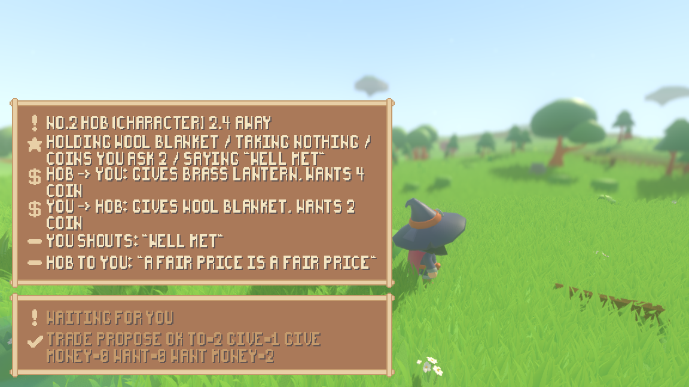
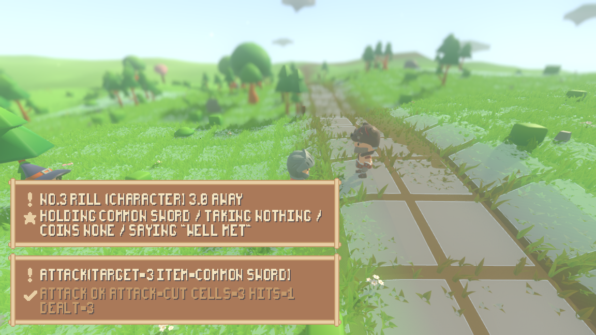

# Every verb a person can reach

Section 2.1 lists twelve atomic actions. Before this, a person at the keyboard
could reach three of them -- walk, go to a named place, jump
(`reports/player-input.md`). The other nine existed, were resolved by
`ActionEngine`, were exercised by headless walkthroughs, and could not be
reached by pressing anything. This is the rest of the list, from input.

Two things had to exist for that, and they are the whole of the work:

* **something to aim at.** Nine of the twelve actions take a target. What a
  person may aim at is not the interface's to decide, so it is not decided
  there: `sim/surroundings.gd` turns `Observation` -- the same packet a
  language-model mind is handed -- into plain rows, and the controls walk along
  that list. A thing the character cannot make out is not in it.
* **somewhere to do it.** The ordinary world is three wanderers on an empty
  meadow: nobody to trade with, nothing lying about to pick up, nothing shut to
  open, nobody to fight. `sim/scripted_play.gd` is the smallest world that holds
  one of each -- a trader, a brawler, a pile and a locked chest -- so that every
  row of the catalogue is a thing a person can actually reach.

    ./run_render.sh --scenario play --play

## Every verb, performed from input, in one seeded run

Seed 1234, driving Fen (#1), on the measured open meadow at (-480, 420). The run
is `TestPlayerActions.play()`: a written-down script of key presses fed through
`render/player_controls.gd` -- the same file the shell feeds real presses through
-- into that character's `LiveChoice`. It is printed by `./tools/play_actions.sh`
and asserted by `tests/test_player_actions.gd`, so the table below and the suite
cannot disagree: they are one run played by one script.

```
$ ./tools/play_actions.sh
seed 1234, driving #1
verb            tick  at                     the engine's answer
examine            5  #2                     examine ok id=2 name=Hob kind=commander health=unhurt fighting=false equipment=- distance=6.0
say               11  #2                     say ok shout=false heard_by=1
say               17  -                      say ok shout=true heard_by=1
trade_propose     22  #2                     trade_propose refused: Hob is out of reach (6.00 > 2.50)
go_to             43  #2                     go_to ok at=(-476.400, 420.000) walked=3.6 steps=4
trade_propose     60  #2                     trade_propose ok to=2 give=1 give_money=0 want=0 want_money=2
trade_deny        75  #2                     trade_deny ok from=2
trade_accept      79  #2                     trade_accept refused: the offer from Hob was denied
trade_accept      95  #2                     trade_accept ok from=2 took=1 took_money=0 gave=0 gave_money=4
go_to            116  #4                     go_to ok at=(-478.808, 422.676) walked=3.6 steps=4
pick_up          120  #4 with iron key       pick_up ok item=iron key from=4
go_to            141  #5                     go_to ok at=(-482.939, 420.891) walked=4.5 steps=5
interact         148  #5 with wool blanket   interact refused: a wool blanket is not what the chest opens with, so it is put to a check
interact         155  #5 with iron key       interact ok target=5 opened=true used=iron key
pick_up          159  #5 with silver ring    pick_up ok item=silver ring from=5
drop             162  #5 with iron key       drop ok item=iron key into=5
examine          167  silver ring            examine ok item=silver ring seen=common weapon hand L1 P=4 mov=0 def=0 eff=4 dex [silver ring:4] silver ring
drop             170  - with silver ring     drop ok item=silver ring into=6
wait             176  -                      wait ok ticks=5 until=181
jump             181  (-482.9, 417.9)        jump ok at=(-482.939, 417.891) gap=3.0 reach=3.75 dex=3
jump             186  (-482.9, 405.9)        jump refused: 12.00 is further than DEX 3 jumps (3.75)
go_to            207  (-482.9, 414.3)        go_to ok at=(-482.939, 414.291) walked=3.6 steps=4
go_to            228  #3                     go_to ok at=(-451.902, 419.670) walked=31.5 steps=35
attack           244  #3 with common sword   attack ok attack=cut cells=3 hits=1 dealt=3

24 actions performed, 4 of them refused, world at tick 244
```

All twelve rows of `ActionCatalog.ROWS` appear: `go_to`, `jump`, `attack`, `say`
(targeted at tick 11 and shouted at 17), `trade_propose`, `trade_accept`,
`trade_deny`, `pick_up`, `drop` (into a chest at 162 and on the ground at 170),
`examine` (a character at 5 and a carried item at 167), `interact`, `wait`.

Every target in the "at" column is one the person picked out of the aim list,
and the four sorts section 2.1 names are all there: a character (#2, #3), an item
lying on the ground (#4, the pile), a container (#5, the chest), and a position
(the two jumps and the walk).

## Refused, in the engine's own words, four ways

```
trade_propose refused: Hob is out of reach (6.00 > 2.50)
trade_accept  refused: the offer from Hob was denied
interact      refused: a wool blanket is not what the chest opens with, so it is put to a check
jump          refused: 12.00 is further than DEX 3 jumps (3.75)
```

Not one of those sentences is written on the render side. They are
`ActionEngine`'s, carried through `ControlLoop.answer_of` unchanged and quoted
whole by `render/ui/answer_panel.gd`, which has no table of friendly wordings in
it. The third one also raises a section 7 ability check: the person held out
something the world has no rule for, so the engine says so and settling it is
somebody else's, later.

The second is the trade one. Hob offered the lantern for four coins, the person
denied it, and trying to take the same offer afterwards is refused *as denied*
rather than as never having been made. The denying went both ways in the same
run -- the person's own bargain is one Hob would not have, which a table of the
person's actions cannot show, so it is read out of the loop's journal:

```
t= 43  Hob    began trade_propose(target=1 give=[brass lantern] give_money=0 want=[] want_money=4), 4 ticks
t= 60  Hob    began trade_deny(target=1), 2 ticks
t= 62  Hob    finished trade_deny(target=1) -> trade_deny ok from=1
t= 78  Hob    began trade_propose(target=1 give=[brass lantern] give_money=0 want=[] want_money=4), 4 ticks
```

## From the built shell, with synthetic input

This machine has no display, so "playing it" means driving the built shell under
`xvfb` with the keys pressed from inside -- through `Input.parse_input_event`,
which puts them on the engine's own queue, so the binding under test is the
binding a person uses. The command, the seed and the ticks are stated with each
frame.

### The bargain

```
xvfb-run -a ./run_render.sh --seed 1234 --scenario play --play \
        --camera 0 4.0 7.0 --aim 2.6 \
        --input "2:tab,6:e,16:t,26:y,36:o,46:p,74:f,75:f,76:equal,77:equal,80:o" \
        --screenshot "$PWD/reports/assets/play-market.png" --screenshot-tick 88
```



Aim at the trader, look at him, greet him, shout, offer him a bargain from too
far off (refused), walk over, put the blanket on the table and ask two coins for
it. The panel above the answer row is what a person has to be able to read
before they can choose: what is aimed at and how far off, what is in their hands
and on the coin dial, both halves of every offer standing either way, and the
last few lines said within earshot. Hob is the one in the pointed hat; the
person's own character is behind the panel, because the camera keeps whoever it
follows in the middle of the frame and the panel is half the window wide.

```
render-shell play t=2 aims at #2 Hob (character) 6.0 away · holding nothing / taking nothing / coins none / saying "well met"
render-shell play t=13 examine(target=2) -> examine ok id=2 name=Hob kind=commander health=unhurt fighting=false equipment=- distance=6.0
render-shell play t=22 say(text=well met target=2) -> say ok shout=false heard_by=1
render-shell play t=32 say(text=well met) -> say ok shout=true heard_by=1
render-shell play t=42 trade_propose(target=2 give=[] give_money=0 want=[] want_money=0) -> trade_propose refused: Hob is out of reach (6.00 > 2.50)
render-shell play t=69 go_to(target=2) -> go_to ok at=(-476.400, 420.000) walked=3.6 steps=4
render-shell play t=77 aims at #2 Hob (character) 2.4 away · holding wool blanket / taking nothing / coins you ask 2 / saying "well met"
render-shell play t=85 trade_propose(target=2 give=[wool blanket] give_money=0 want=[] want_money=2) -> trade_propose ok to=2 give=1 give_money=0 want=0 want_money=2
```

The same schedule run to tick 140 goes on through the two ends of a bargain --
`t=104 trade_deny ok from=2`, then `t=116 trade_accept ok from=2 took=1
took_money=0 gave=0 gave_money=4` -- and the frame above is taken at 88, while
both offers are still on the table.

### The fight you walk into

```
xvfb-run -a ./run_render.sh --seed 1234 --scenario play --play --board \
        --camera 0 6.0 9.0 --aim 1.6 \
        --input "2:tab,4:tab,8:p,36:f,40:n,50:n,60:n,70:n" \
        --screenshot "$PWD/reports/assets/play-attack.png" --screenshot-tick 58
```



Two presses of the aim key put the aim on the stranger standing thirty units
east -- and at that moment she is a stranger: at tick 5 the panel says "#3" and
not "Rill", because a name is knowledge `Observation` will not hand out to
somebody who has not met her. Walking over is what starts the fight: the brawler
takes no interest in anybody until they come within twenty units of her, and the
board itself appears because `ActionScene.ENGAGE_RADIUS` says so.

By the tick the frame is taken the same panel reads "no.3 Rill", and nothing was
done to make it: the two have swung at each other, the world wrote that down as
an edge in its relationship graph, and a name is what the packet gives for
somebody you have now met. The id is spelled "no.3" rather than "#3" on screen
because the art's pixel font has no `#` in it; see the last section.

```
render-shell play t=5 aims at #3 (character) 30.0 away · holding nothing / taking nothing / coins none / saying "well met"
render-shell play t=29 go_to(target=3) -> go_to ok at=(-452.100, 420.000) walked=27.9 steps=31
render-shell play t=37 aims at #3 (character) 3.0 away · holding common sword / taking nothing / coins none / saying "well met"
render-shell play t=40 chose attack(target=3 item=common sword)
render-shell play t=50 chose attack(target=3 item=common sword)
render-shell play t=54 attack(target=3 item=common sword) -> attack ok attack=cut cells=3 hits=1 dealt=3
```

The attack key was pressed four times and one blow landed, which is the turn
economy doing its job: a weapon action is spent out of a turn the board grants,
and pressing for one does not take one. Which of the sword's attacks is used and
which way the character turns to use it are both derived by the engine, because
section 10 spells the call `Attack(target, weapon/attack-mode derived from item)`
and section 3.5 makes rotating free.

## Where the rules are, and where they are not

The acceptance asked for this to be shown by a scan rather than asserted, and
`tests/test_player_actions.gd` runs one over the three files that turn a press
into an action or put the choosing on screen -- `render/player_controls.gd`,
`render/ui/play_panel.gd`, `render/ui/answer_panel.gd`. With comments stripped,
none of them names `ActionEngine`, `ActionCatalog`, `REACH`, `SIGHT`, `VOICE`,
`ENGAGE_RADIUS`, `JUMP_BASE`, `JUMP_PER_DEX`, `ARRIVE`, `MAX_STEPS`, `occupies`,
`is_passable`, `is_qualified`, `holds_things`, `was_refused`, `can_attack` or
`distance_to`. Every action they build is one of the catalogue's twelve
constructors, and none of them reaches past those to `Action.of`, which takes
any name at all and is how a thirteenth verb would get in.

Three distances *are* named on the render side, and they are not rules: `STEP`
is how far one press of a walk key sends you, `HOP` and `LEAP` how far a jump is
aimed. What is written there is where the person is pointing, not whether they
get there -- `ActionEngine._jump` measures the gap against DEX and refuses the
leap, which is exactly why the leap key exists.

The one thing the interface does put words to is speech. `say` takes any text;
a keyboard with no text field on it cannot type any, so `PlayerControls.LINES`
offers four things to say and the person picks one. That is a limit of the
interface and not of the action, and it is the only place in the control surface
where the shell puts words in a character's mouth.

## One thing the art could not draw

The pack's pixel font is on an eight-by-fourteen cell and its glyph set is
small: it has no `#`, no `_`, and no square brackets -- and the simulation's own
sentences use all three. An id is `#7`, an action's name is `trade_propose`, and
a list of items prints in brackets, so every panel drawing a sentence from the
simulation was drawing empty boxes in the middle of it. That had been on screen
since the answer panel landed and is invisible in a terminal, where the
characters draw fine.

`SproutPack.FONT_SUBSTITUTES` and `SproutPack.drawable()` are the one place it is
fixed -- `#` becomes "no.", `_` becomes a space, brackets become parentheses --
and every panel puts what it is about to draw through it. It changes which
letters a word is drawn with and no word: the two suites that assert a panel
quotes the engine now compare against `SproutPack.drawable(sentence)`, which is
the same sentence.

## What is new under sim/

* `sim/surroundings.gd` -- what a character can pick out around it, as plain
  rows: what is in sight, what it is carrying, what has been offered it either
  way, what it has heard. It is `Observation` projected, and it decides nothing.
  It is deliberately not named for a person: any mind could ask it, and
  `tests/test_character_sheet.gd` fails the build if anything under `sim/` starts
  asking which kind of character it is holding.
* `sim/scripted_play.gd` -- the stage described above.
* `WorldObject.contents_seen()` -- the names of what is lying in an open
  container, for anyone who can see inside. `observed()` already said how many
  things are in one; this is the same glance carried one step further, and a
  shut chest still keeps its contents to itself.
* `SimWorld.surroundings_of(id)` and `Simulation.driven_surroundings()` -- the
  two forwards, so an entry point has one place to ask.

## The keys

```
WASD/arrows  walk one step (3.6 units)      P  go to what you have aimed at
G            go to the nearest named place  E  examine what you have aimed at
J            hop (3.0 units)                L  look at what you are holding
K            leap (12.0 units)              Q  take the picked thing out of it
Tab          aim at the next thing in sight X  drop what you are holding
F            hold the next thing you carry  V  put what you are holding into it
C            pick the next thing inside it  T  say the picked line to it
B            pick the next thing to say     Y  shout the picked line
- / =        the coins in your next offer   O  offer it a trade
                                            U  accept the offer standing from it
                                            I  deny that offer
                                            H  interact with it, with what you hold
                                            N  attack it with what you are holding
                                            M  wait (5 ticks)
```

The shell prints this list at boot, out of `PlayerControls.bindings()`, so a
person at the keyboard is not guessing.

## What was not done here

* **The trade and dialogue panels for the model-driven cast** are their own item.
  What is here is what a person must see in order to choose and to be refused.
* **Combat verbs beyond a plain attack** -- moving on the board, activating a
  minion, ending a turn -- belong to the battle item. A person in a fight can
  strike and can be told it is not their turn; the rest of the turn economy is
  still the board's own.
* **Typing what to say**, which needs a text field. See above.
