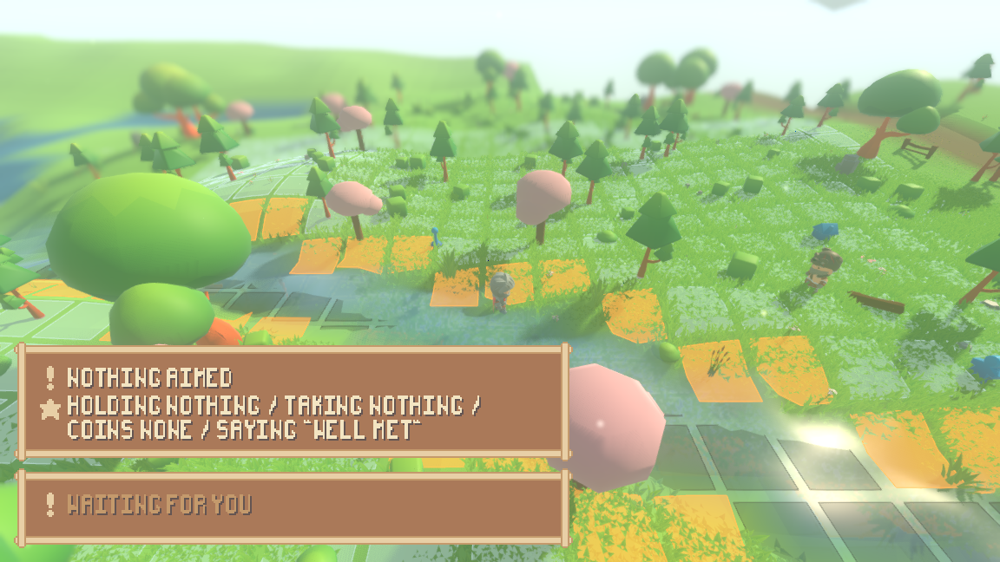
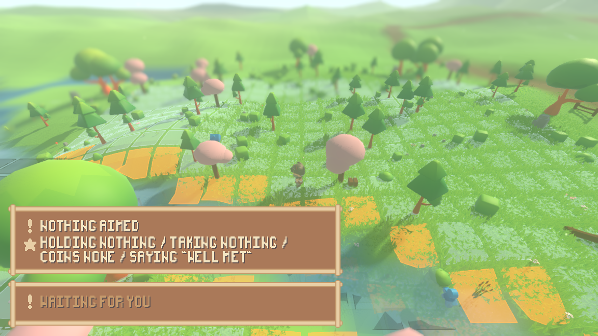
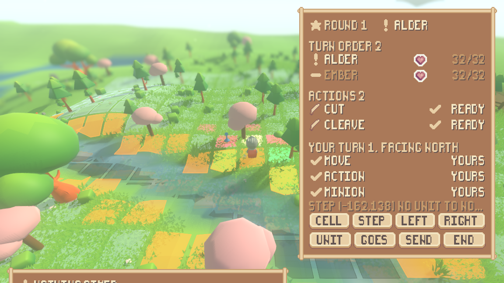
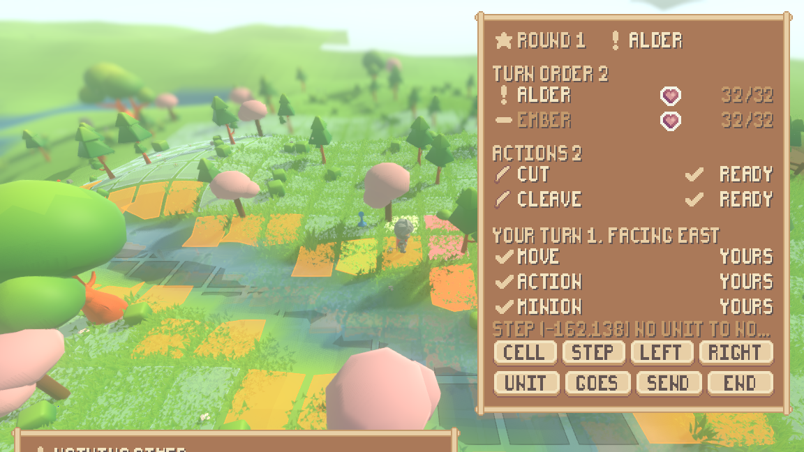
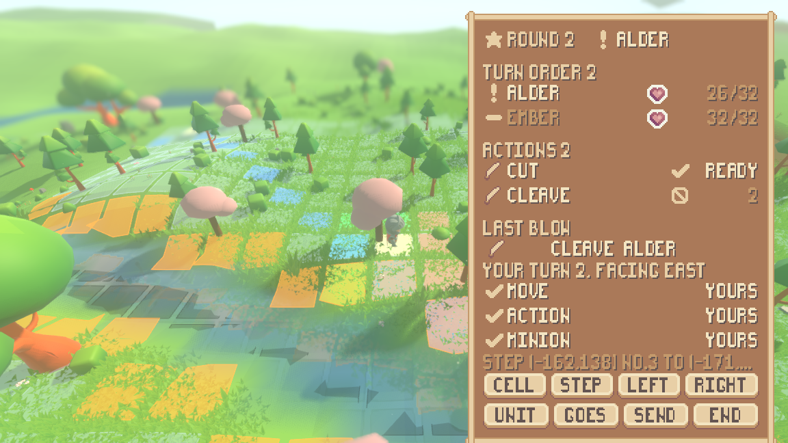

# A battle a person plays

The tactical layer was built before anyone could reach it. A fight snapped onto
the ground, a match was played one turn per tick, the survivors walked on
([reports/combat.md](combat.md)) — and every one of those turns was played by
`sim/combat_policy.gd`, the dullest possible chooser, because there was nothing
else to play them with. From a keyboard the one thing a person could do in a
fight was strike at somebody: no way to move on the board, no way to send a
minion, no way to turn, no way to end a turn.

This makes a whole fight playable. The board comes round to you and **waits**;
you spend the turn the design says you have — a move, one weapon action, one
minion, and as much turning as you like because turning is free — and then you
end it and watch the other commanders take theirs.

```
./run_render.sh --scenario battle --play --readout --board   # play one
./tools/play_combat.sh                                       # ...the whole of one, headless
```

---

## 1. In from real time, out to real time

Seed 1234, the battle scenario: the encounter scenario's two bands — a commander
with a Cat and a Toadstool walking east, a commander with an Ent and a Frog
walking west — with the camera looking through the green commander rather than
standing beside them, so `--play` has somebody to hand over.

Nothing about the way in changed. The two bands walk towards each other in real
time and the board appears when `ActionScene.ENGAGE_RADIUS` says it should; the
survivors are put back down where their last cells say when it is over. What the
shell now prints is the moment each of those happens:

```
render-shell fight t=16 the board appears
...
render-shell fight t=69 the board is put away
```

| tick 10 — real time | tick 80 — real time again |
|---|---|
|  |  |

Both frames are from one run of the built shell, driven by `--input` at the ticks
it names, because this machine has no display: the presses go onto the engine's
own input queue and arrive at the shell's handler by the path a real key takes.
That is a limit worth stating plainly — nobody sat at a keyboard for these
frames, and what is judged below is photographed frames and traces.

## 2. What a turn buys, and where the rule lives

Section 3.6 gives one turn a move, one weapon action and one minion activation,
and makes turning free. That rule is written once, in `sim/combat_match.gd`,
as three flags and the refusals they produce. The interface does not restate it:
it **asks**.

`sim/board_turn.gd` is the asking. It is the board's answer to
`sim/live_choice.gd` — where a person's real-time choice goes — for the half of
the world where the unit of choice is a turn rather than a tick. Every question
it answers is forwarded:

| the question | who answers it |
|---|---|
| where may I step? | `LegalMoves.moves_for` |
| what does this weapon cover from here, as I am facing? | `LegalMoves.attack_cells_on` |
| may I use it yet, and how long until I may? | `Commander.can_attack`, `turns_until_ready` |
| where may this minion go? | `LegalMoves.destinations` |
| what is left of my turn? | `CombatMatch.has_moved`, `has_acted`, `has_spent_minion` |
| why was that refused? | `CombatMatch.last_refusal`, word for word |

`render/board_controls.gd` turns a key into one of those calls and does nothing
else — no legality, no reach, no cooldown, no capture, no damage. The suite scans
it and the readout for the names of those rules and fails if one appears.

**The keys.** `[` picks the next cell you may step onto and `]` steps onto it;
`;` picks one of your minions, `'` picks where it goes and `\` sends it;
`4` `5` `6` `7` use the first to fourth weapon action; `8` and `9` turn you a
quarter left or right; `0` ends your turn.

## 3. Shown before the choice, refused in the engine's own words

What is legal is painted on the board itself, in four colours over the lattice —
green for where the commander may step, rose for what its weapons cover, blue for
where the picked minion may go, and a bright plate on whatever is picked right
now. Not one of those cells is worked out on the render side: they are four lists
that come back from `BoardTurn`, and the shell colours them.



A choice the board does not offer is refused, and the sentence a person is shown
is the match's own:

```
16    -      Alder    step (-155,146)        refused: (-155,146) is not reachable
```

## 4. Facing, which is free and moves the pattern

Section 3.5 makes rotating a character free — no turn, no action cost — and makes
attack patterns rotate with the facing. Both halves are visible in one pair of
frames taken six ticks apart in the same run. The rose cells are the sword's
`cut` and `cleave` patterns; the commander has not moved between them and the
three parts of its turn are still marked "yours".

| facing north | facing east |
|---|---|
|  |  |

The headless run measures the same thing without a picture:

```
facing north covered (-162,137) (-161,137) (-160,137)
facing east  covered (-160,137) (-160,138) (-160,139)
    and the turn cost nothing
```

## 5. Cooldowns count down in turns, and an action on one says so

An attack's cooldown is in turns of the commander holding it, and a turn is a
round ([reports/combat.md](combat.md)). The sword carries a `cut` that comes
round every turn and a `cleave` that waits three, so the cheaper attack is the
quicker one and that difference is inside a single weapon.

Round 1 spends the cleave. On round 2 the readout draws it with the pack's
prohibition sign and the number of turns left, beside the cut's tick and
"ready" — and pressing its key anyway is answered rather than ignored:



```
17    2      Alder    weapon action 2        refused: on cooldown
```

## 6. The readout gained controls without gaining state

`render/ui/combat_panel.gd` was a readout with nothing to press. It now has a
**your turn** section — which of the three things a turn buys are still yours,
which way you are facing, what you have picked — and eight controls along the
bottom.

It still holds nothing. The section is read through a call, not a stored turn:
the panel is handed `func() -> BoardTurn` and asks it on the frame it draws, so
there is no copy of the turn, the cooldowns or the board to go stale. A button
does exactly what the character sheet's buttons do — it hands its keycode to the
shell's own input path and stops there, so a click and a key press are one thing
and there is one binding rather than two. The suite builds a panel, hands it a
world, moves the world without telling the panel, and checks it says the new
thing anyway.

## 7. The whole fight, from input

`./tools/play_combat.sh` plays one and prints it. The run is
`TestPlayerCombat.play()`, which is also what the suite asserts over, so this
trace and the suite cannot disagree: they are one run driven by one script. A run
of the same key pressed over and over — cycling a ring of cells — is collapsed to
one line with a count and the pick it settled on.

```
tick  round  who      did                    the engine said
16    -      Alder    the board appears      entered from real time
16    -      Alder    shown                  5 cells to step onto, 2 weapon actions covering 9 cells
16    -      Alder    step (-155,146)        refused: (-155,146) is not reachable
16    1      Alder    pick a cell (x2)       step (-161,138) no unit to none
16    1      Alder    step                   done
16    1      Alder    turn right             done
16    1      Alder    weapon action 2        done
16    1      Alder    pick a minion          step (-161,138) #3 to (-171,130)
16    1      Alder    pick where it goes (x19) step (-161,138) #3 to (-160,141)
16    1      Alder    send it                done
16    1      Alder    end the turn           done
17    2      Alder    pick a cell (x5)       step (-160,138) #3 to (-160,141)
17    2      Alder    step                   done
17    2      Alder    turn right             done
17    2      Alder    weapon action 2        refused: on cooldown
17    2      Alder    weapon action 1        done
17    2      Alder    pick a minion          step (-160,138) #4 to (-164,142)
17    2      Alder    send it                done
17    2      Alder    end the turn           done
18    3      Alder    pick a cell (x4)       step (-161,138) #4 to (-164,142)
18    3      Alder    step                   done
18    3      Alder    weapon action 1        done
18    3      Alder    pick a minion          step (-161,138) #3 to (-171,130)
18    3      Alder    pick where it goes (x17) step (-161,138) #3 to (-161,140)
18    3      Alder    send it                done
18    3      Alder    end the turn           done
19    -      #1       the board is put away  back to real time

entered the fight on tick 16, left it on tick 19, took 3 turns
on round 1, a second of each was refused:
    move   -> already moved
    action -> already acted this turn
    minion -> a minion has already acted this turn
```

And the fight's own transcript, which is the world's, with the person's turns and
the rule's in the same list:

```
round 1 turn #1 at (-162,139) facing=north hp=32/32 def=0 sword + boots(4/4)
  refused move #1: (-155,146) is not reachable
  move #1 (-162,139)->(-161,138)
  face #1 east
  attack #1 cleave cells=6 hits=1
    hit #1->#2 power=5 x100 swing=97 front def=0 dealt=5 hp=27/32
  minion move #3 (-163,138)->(-160,141)
  refused move #1: already moved
  refused attack #1: already acted this turn
  refused minion #3: a minion has already acted this turn
round 1 turn #2 at (-159,140) facing=north hp=27/32 def=0 spear + boots(4/4)
  move #2 (-159,140)->(-160,139)
  face #2 north
  minion hit #5->#1 power=6 x100 swing=98 front def=0 dealt=6 hp=26/32
```

**The person loses this one.** Alder deals 11 points over three rounds and Ember
deals 36, which is what a script that steps towards the nearest enemy and swings
gets against a rule that closes to where it can actually strike. That is reported
rather than tuned away: the claim being made is that a whole fight is playable
from input, not that the script driving it plays well.

## 8. Two things worth naming

**A fight waits for a person, and only for a person.** `ActionScene.hands` is the
list of characters whose board turns are taken by hand, and `fight_step()` plays
no turn belonging to one of them — it leaves the turn standing, for as many ticks
as the person takes, and the world goes on around a board that is standing still.
That is the same waiting the world already does for a character that has not
decided yet (section 2.2's "a character waits in-world instead of freezing the
game"), moved onto the board, where the unit of waiting is a turn. The list is
empty in every world nobody is playing, so a world with no hand in it plays
exactly the fights it played before — which the fingerprint below is the check
on.

**A turn is now written across ticks, so the transcript needed a second cursor.**
A turn the rule plays is written inside one call; a turn a person spends is
written a press at a time over many ticks. `Encounter.unreported()` is the one
seam between a fight's transcript and the world's: it hands over what has been
written since the last time anyone asked, whoever wrote it. Without it the
person's own moves and blows were in the fight's transcript and missing from the
world's.

## 9. What was checked

* `tests/test_player_combat.gd` — seven claims: a fight entered and left; the
  turn economy spent and a second of each refused in the match's words; what is
  legal shown before the choice and an illegal choice refused; a cooldown
  counting down and refusing; facing free and moving the pattern; no rule and no
  copy on the interface side; and the whole fight as one trace.
* The suite passes: **all 55 suites, 200 129 checks**. Both structure checks
  pass — the layer check confirms the render side names none of the combat
  layer's own types, and the interface check that the readout still names its art
  through one table.
* The seed-1234 world fingerprint is **unchanged** at `d20ae8129e075741`, and
  `./run_encounter.sh` ends where it did (`over rounds=4 survivors=1 winner=#2`,
  final `0e547697f86d1a4b`) — measured against the same commands run on the
  commit before this one.
* Both mutation harnesses still catch everything they break, run one at a time
  with nothing else against the repository: **19 of 19** for the pieces and
  **61 of 61** for the resolution. One resolution pattern was updated to match
  the line the "already acted" refusal is now written on.
