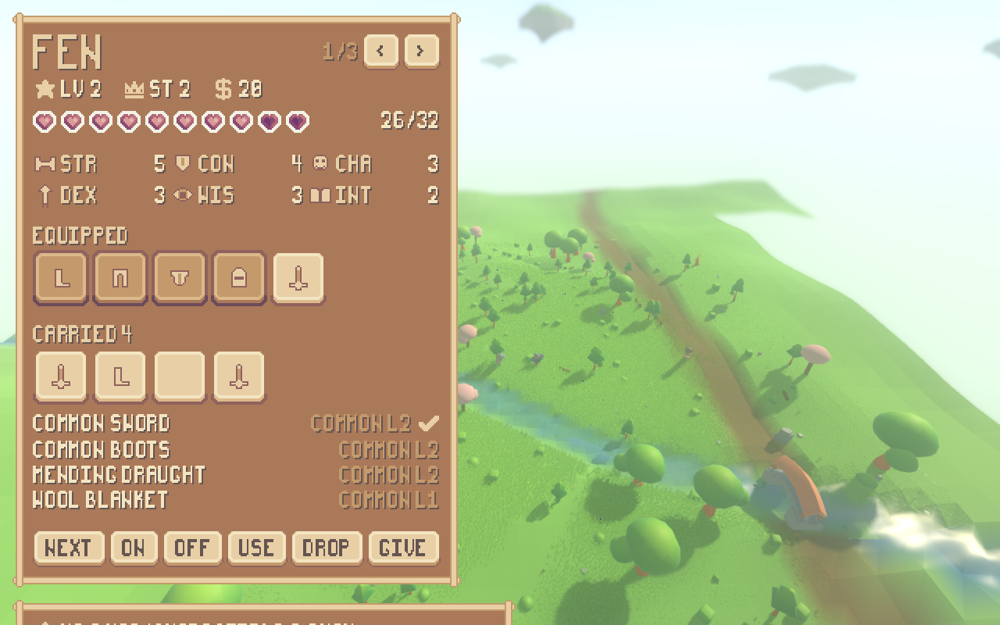
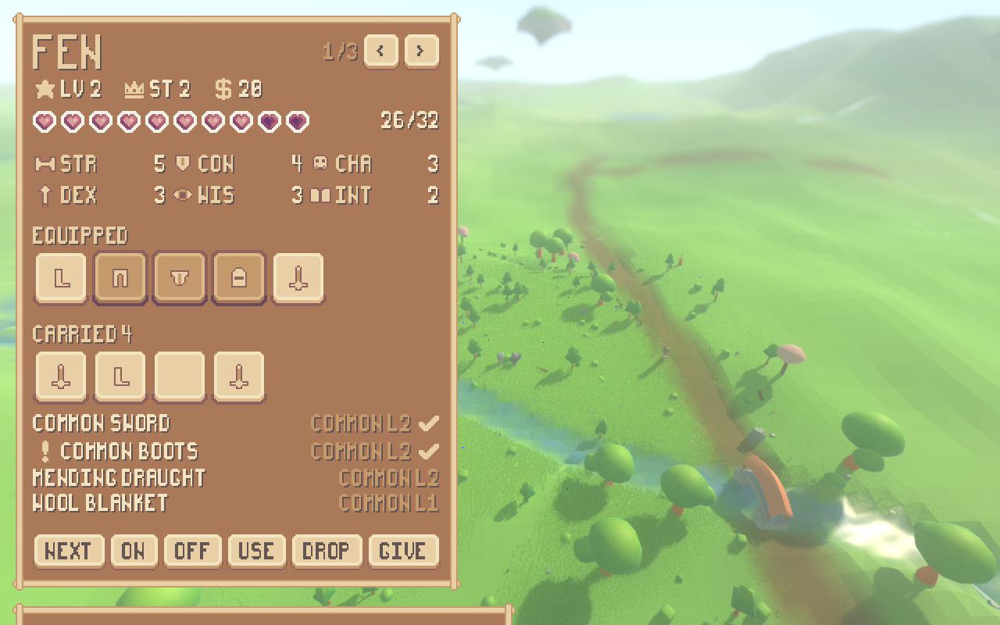
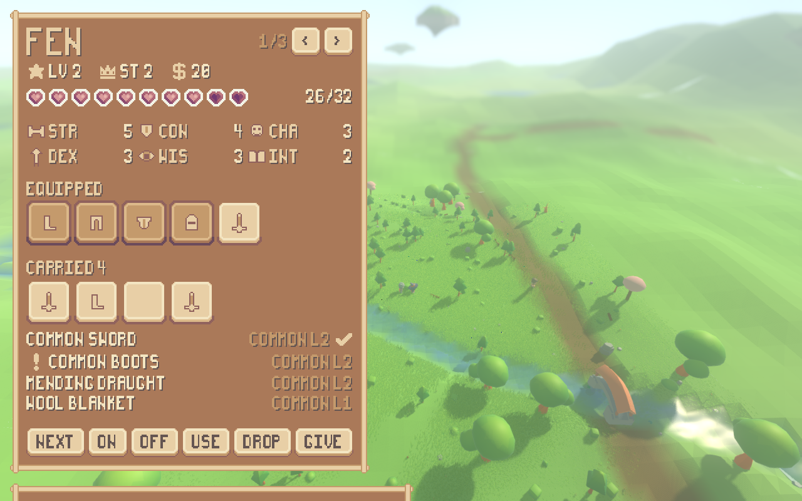
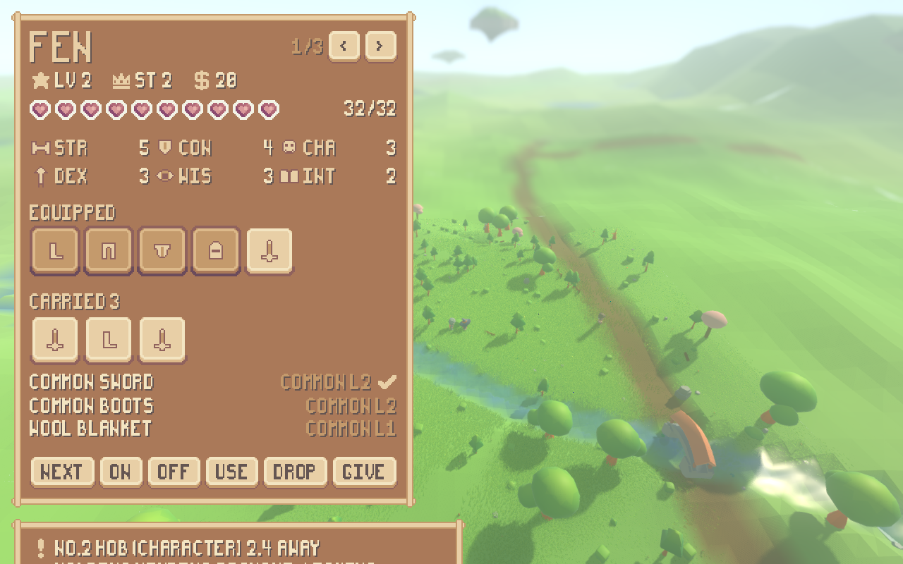
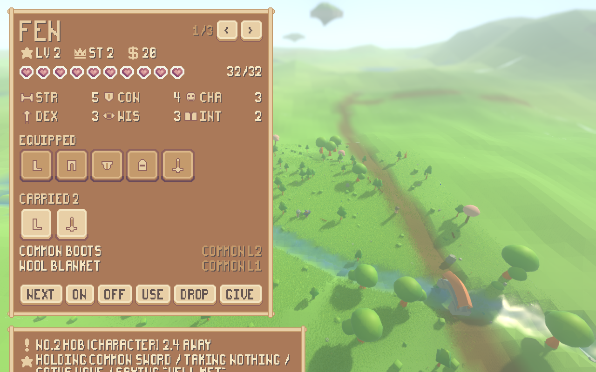
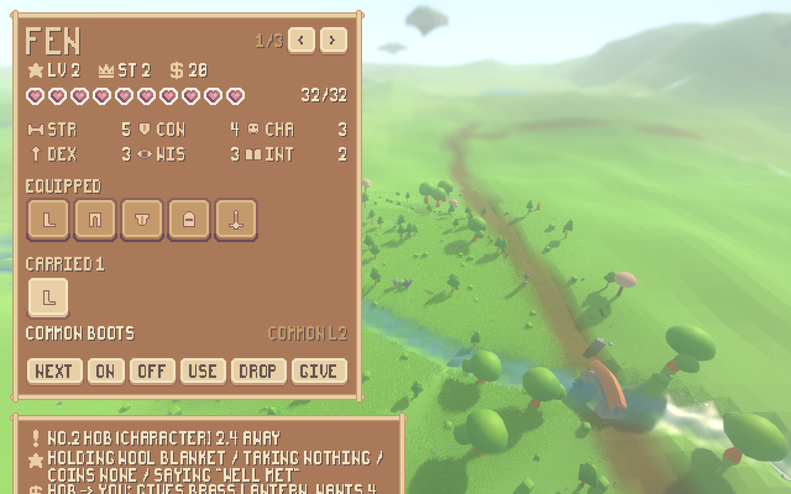

# An inventory a person can operate

The character sheet was a readout. It held a reference to the simulation's own
`Character`, re-read every number off it on every frame, and offered nothing to
press ([reports/ui.md](ui.md)). This makes it operable: from the keyboard a
person opens it, puts something on, takes it off, drinks something, drops
something, gives something away and pays for a bargain -- and the panel still
holds no copy of anything it draws.

```
./run_render.sh --scenario play --play      # Z opens the sheet, 1/2/3 are the wardrobe
./tools/play_inventory.sh                   # ...the whole of it, headless
xvfb-run -a ./tools/measure_ui.sh --scenario play --panel sheet --play   # ...and is it crisp
```

---

## 1. Three verbs the catalogue did not have

Section 2.1's twelve actions are what a character does to the *world*. Nothing
in them changes what a character has **on**, and three other sections need that
to be changeable:

* section 2 gives the sheet "inventory (weapons, armor, consumables, money --
  tradeable/**usable**)" and "equipment (currently equipped)";
* section 3.4 makes what a character can do its gear -- "the player's movement
  is their gear loadout";
* section 5 makes gear go obsolete as the frontier rises, which is only a loop
  if what you find can replace what you have.

Before this, gear could only be set out when a world was built. `ActionCatalog`
now has fifteen rows rather than twelve -- `equip`, `unequip` and `use` -- and
section 2.1 opens by calling itself "a small, **extensible** set". They are
ordinary rows: the same shape, the same fault checking, one constructor in
`sim/action.gd` and one resolver in `sim/action_engine.gd`, which
`ActionCatalog.faults()` reads and requires. So a language-model mind reaches
them by the path a person does, and section 1's "no preferential treatment" is a
property of the table rather than a promise.

A consumable is the third `Item.kind`, beside a weapon and a piece of armour. It
goes in no slot, so it cannot be worn or held, and its whole budget is on the
effects axis: a draught *is* what its effect is worth. `use` reads that worth
through the same ability gate every other reading of an item goes through
(`Item.effects_for`), mends that much, and lets the item go.

## 2. From input, in one seeded run

Seed 1234, driving Fen (#1) on the play scenario's meadow. A written-down script
of key presses is fed through `render/player_controls.gd` -- the same file the
shell feeds real presses through -- into that character's `LiveChoice`. The run
is `TestPlayerInventory.play()`, which is what `./tools/play_inventory.sh` prints
and what `tests/test_player_inventory.gd` asserts, so the tables below and the
suite cannot disagree.

```
$ ./tools/play_inventory.sh
seed 1234, driving #1

verb            tick  at                     the engine's answer
equip              4  - with common boots    equip ok item=common boots slot=boots instead_of=- moves=2 attacks=2 defence=0
unequip            7  - with common sword    unequip ok item=common sword slot=hand moves=2 attacks=0 defence=0
equip             11  - with common sword    equip ok item=common sword slot=hand instead_of=- moves=2 attacks=2 defence=0
equip             15  - with mending draught equip refused: a mending draught goes in no slot, so it cannot be worn or held
use               19  - with common sword    use refused: a common sword is not used up: it is kept
unequip           22  - with wool blanket    unequip refused: Fen is not wearing or holding the wool blanket
use               26  - with mending draught use ok item=mending draught worth=8 mended=6 health=32 of=32
go_to             47  #2                     go_to ok at=(-476.400, 420.000) walked=3.6 steps=4
trade_accept      63  #2                     trade_accept ok from=2 took=1 took_money=0 gave=0 gave_money=4
trade_propose     80  #2                     trade_propose ok to=2 give=1 give_money=0 want=0 want_money=0
drop              95  - with brass lantern   drop ok item=brass lantern into=6

money 20 -> 16, health 26 -> 32, world at tick 95
```

Eleven changes, three of them refused. The money moved because a bargain was
taken -- four coins for the trader's lantern, `gave_money=4` -- and nothing on
the render side counted it; `Inventory.transfer` did, on the one path by which
anything changes hands. The blanket went the other way for nothing asked, which
is section 2.1's "giving is a trade with nothing in return", and the trader
accepted it because his own rule says he takes a gift and denies a bargain.

## 3. Gear is what a character can do

Section 3.4's claim, shown rather than asserted: the loadout is read off
`Commander` on either side of every change -- how many ways it may move, how many
attacks it may choose from -- and nothing in the reading is this report's
arithmetic.

```
   tick  after                   moves  attacks
      0  to begin with               1        2
      4  boots on                    2        2
      7  sword out of hand           2        0
     11  sword back in hand          2        2
```

A pair of boots is a way of moving the character did not have a moment ago; a
sword taken out of the hand takes its attacks with it and putting it back gives
them again. Neither number is stored anywhere: `Commander.move_grants()` reads
what is worn and `Commander.attack_count()` reads what is held, both through the
ability gate, every time they are asked.

## 4. The rules are the simulation's, and the interface refuses nothing

```
equip    a mending draught goes in no slot, so it cannot be worn or held
use      a common sword is not used up: it is kept
unequip  Fen is not wearing or holding the wool blanket
```

Not one of those sentences is written on the render side. The first is
`Inventory`'s rule -- being equipped is a slot pointing at something carried, and
a thing with no slot has nowhere to point from. The second and third are
`ActionEngine`'s. All three are carried through `ControlLoop.answer_of`
unchanged and quoted whole by `render/ui/answer_panel.gd`.

And the interface declined none of them: pressing **1** over a draught builds
`equip(item=mending draught)` and hands it over, exactly as pressing it over a
pair of boots does. The suite presses all three keys over a thing the rules will
turn down, checks that an `Action` came back each time and that the controls had
nothing of their own to say about any of it. An interface that greyed the key out
would be a second, quieter copy of the rule.

## 5. Six frames from the running game

This machine has no display, so "playing it" means driving the built shell under
`xvfb` with the keys pressed from inside, through `Input.parse_input_event` --
the binding under test is the binding a person uses. All six frames are from
**one** run, photographed at six named ticks:

```
xvfb-run -a "$GODOT" --path . --resolution 1280x800 --fixed-fps 30 -- \
        --seed 1234 --scenario play --play --journal \
        --input "2:z,3:tab,4:p,26:f,27:1,33:2,38:f,39:f,40:3,46:f,47:f,48:f,49:x,54:f,55:f,56:f,57:o" \
        --screenshot-ticks "4:reports/assets/inventory-1-opened.png,\
32:reports/assets/inventory-2-equipped.png,37:reports/assets/inventory-3-unequipped.png,\
45:reports/assets/inventory-4-used.png,53:reports/assets/inventory-5-dropped.png,\
72:reports/assets/inventory-6-given.png"
```

The window is 1280x800 rather than the usual 1280x720 because the sheet with its
control row on it is 740 screen pixels tall; the interface scale is 2 either way.
The engine is invoked directly rather than through `./run_render.sh` only because
`--resolution` is Godot's own option and has to go before the `--`.

`--screenshot-ticks` is new and is `--input`'s own spelling with a file where the
key goes. It exists because a story photographed across six separate runs is six
runs a reader has to be *told* are the same one.

### Opened, tick 4



The shell builds the sheet for any run with somebody driving and starts it shut;
**Z** opens it. That key is the shell's own, beside pause and quit, because
opening a panel is not an intention for a character and changes nothing in the
world -- `render/player_controls.gd` never hears about it.

### Put on, tick 32



**F** turns the ring of what is carried and the sheet marks the row it is on;
**1** puts that on. The boots slot fills, the carried line gets the pack's tick,
and `equip ok item=common boots slot=boots instead_of=- moves=2 attacks=2` is on
the answer panel below.

### Taken off, tick 37



**2** takes it off. It stays carried -- taking your boots off is not the same as
leaving them behind -- which is `Inventory.unequip`'s own rule.

### Drunk, tick 45



**3** uses it up. The heart row was six points down and is full; the draught is
gone from the carried list, because that is the whole difference between using
something and wearing it.

### Dropped, tick 53



**X** drops what is in hand. It is the same `drop` a person could already reach;
what is new is that the sheet is where you can see what you are dropping.

### Given away, tick 72



**O** offers what is in hand to what is aimed at. With nothing on the coin dial
and nothing asked for, that is section 2.1's "giving is a trade with nothing in
return" -- and the trader takes it, which is his own rule and not the person's.
The carried list is down to one thing and the trader is holding the blanket.

## 6. Still a view

The proof is the one the first panel got. A panel is built, handed a character,
and the character is then changed *behind its back* -- something put on, taken
off and let go of -- and every change is on the panel at the next refresh with
nobody having pushed it there. Then the panel is asked for a field of its own
called `level`, `status`, `health`, `scores`, `money`, `inventory`, `equipment`
or `carried`, and there is none.

The controls did not change that, because a control here **is a key press**.
Every button hands its keycode to `on_key`, which the shell wires to the same
`_drive` a real press goes through; the action is then built by
`render/player_controls.gd` out of `Action`'s own constructors and lands in a
`LiveChoice` for the world's control loop to pick up. There is no second path
from the panel into the world, and nothing under `render/ui/` calls `Inventory`
to change anything. The suite presses every button by emitting its own signal and
requires the keycodes that came out to be exactly the keycodes the buttons are
labelled with.

What is picked is not the panel's either: the row it marks is whichever carried
thing `PlayerControls` says is in hand -- the same ring **F** turns -- read every
frame and stored nowhere.

## 7. The style seam, measured

`tools/measure_ui.sh` is the instrument the first panel was measured with, and
it is unchanged. It renders a real frame of the panel over the running world and
asks it two questions about its interior: how many of its pixels are colours the
pack does not contain, and how many of its colour changes fall somewhere other
than on the whole-pixel grid the interface is scaled by.

```
xvfb-run -a ./tools/measure_ui.sh --scenario play --panel sheet --tick 33 \
        --resolution 1280x800 --keep reports/assets/inventory-crispness.png \
        --play --input "3:f,4:1"

frame          reports/assets/inventory-crispness.png (1280x800)
panel          at 16,16 size 574x740, interface scale 2
measured       at 34,34 size 538x704 (inside the frame's rails)
palette        66 colours: the pack's own files plus PixelIcons' three
distinct       16 colours over 378752 pixels
off-palette    0 of 378752 = 0.0000%
edges          41168 changes of colour along rows and columns
off-grid       0 of 41168 = 0.0000%
```

**0.0000% off-palette over 378 752 pixels and 0.0000% of 41 168 colour changes
off the grid.** The controls did not cost the seam anything: the buttons are the
pack's own nine-sliced button art and the pack's own font, the mark on the picked
row is the pack's own icon, and nothing new was drawn in a colour the pack does
not have. The panel is 740 screen pixels tall now rather than 676, which is why
the frames above are 1280x800 -- at 720 the button row runs off the bottom.

## 8. On the right side of the line

`bin/check_layers.gd` runs its four rules unchanged, and all four pass:

```
$ ./run_tests.sh --layers-only
layer check:     OK -- res://sim references nothing in the render layer
combat check:    OK -- res://render draws the fight and holds none of it
interface check: OK -- res://render/ui names its art through sprout_pack.gd alone
asset check:     OK -- res://sim names asset tags and no asset
```

The third is the one that covers the directory the panel lives in. Nothing new
went under `sim/`: `equip`, `unequip` and `use` are rows of the action table and
resolvers in the engine, and not one of them names a `Control`, a `CanvasLayer`,
a `Theme`, a font or a texture path -- the whole vocabulary of an interface is on
`LayerCheck.FORBIDDEN_SYMBOLS` and a simulation file that started using it would
fail the build.

A headless run still loads none of it, which the project's own resource-cache
check says from outside by asking the engine what it actually loaded:

```
$ ./run_headless.sh --assets
assets visual-files found=3390 loaded=0
assets render-scripts found=25 loaded=0
assets sim-scripts found=111 loaded=90 -> res://sim/water_sheet_builder.gd, ...
```

And the world did not move. The seed-1234 hundred-tick fingerprint is
`baac1b9efedf472a`, which is what it was before this: three new rows appended to
the action table change no existing row, and the play scenario is a stage the
plain world never sets out.

## 9. What a new verb costs the model layer

Three rows added to `ActionCatalog.ROWS` are three lines added to every prompt a
language-model character is sent, because `sim/model_prompt.gd` builds its menu
out of that table and out of nothing else. The prompt is what the shipped
recording is *keyed to* -- `net/model_recording.gd` stores the first sixteen
characters of each question's digest beside the reply -- so changing the table
invalidated the recording, which is exactly the tripwire that file was built to
be: the replay still answers, and says in the transcript that the question it was
answering is not the question that was recorded, and `tests/test_agent.gd`
requires that note to be absent.

So the three character-run tables were re-put, the way `./run_record.sh`
documents:

```
OPENROUTER_API_KEY=... ./run_record.sh --live --cast
./run_agent.sh  > reports/agent-evidence.txt
./run_lesson.sh > reports/lesson-evidence.txt
./run_goal.sh   > reports/goal-evidence.txt
```

87 replies to `z-ai/glm-5.3-flash`, recorded 2026-09-06; the difficulty-class and
orchestrator tables were written back unchanged, so their transcripts did not
move. A recording is one draw, so the shipped run is a different run now: the
counts and the comparison tables in `README.md`, `reports/goals.md`,
`reports/agent-memory.md` and `reports/relationships.md` were re-taken off the new
transcripts, and the two places that quoted a single line of the old draw
(`reports/agent-cast.md`, `reports/local-bench.md`) now say which draw they are
quoting. What did *not* change is the shape of any claim: a lesson still changed
all three choices, a goal still changed all three, and the person's character still
sits in the relationship table beside the models with numbers of the same order.

One test moved with it, and it was fragile rather than wrong before:
`CharacterMemory.recall` keeps the newest twelve matches, and the new draw leaves
Pell remembering twenty-seven things of which fifteen match the word the memory
suite queries with. The suite asked for the *oldest* of them back;
`tests/test_memory.gd` now counts the matches, requires the entry when the cap did
not bite, and requires the cap's own behaviour -- twelve lines, every one of them
an answer to the query -- when it did.

## 10. The suite

```
$ ./run_tests.sh
...
PASS  actions        351 checks
PASS  agent          1141 checks
PASS  memory         106 checks
PASS  goals          129 checks
PASS  player actions 174 checks
PASS  player inventory 57 checks
PASS  ui panel       157 checks
all 52 suites passed (196659 checks)
```

## 11. What was not done here

* **A wound the world can give the person.** The draught mends what is missing,
  and the play scenario starts Fen six points down so there is something to mend.
  That is stage dressing and it is there because nothing in this world can wound
  the person: the moment two commanders come within `ActionScene.ENGAGE_RADIUS`
  the fight snaps onto a board, and a commander on a board has no way to walk
  across it -- there is no board-move action yet -- so whoever the snap left out
  of reach stays out of reach. The brawler in the play scenario swings at Fen
  every turn and is refused for pattern every time. That is the battle item's to
  fix, not this one's.
* **Whether gear may be changed in the middle of a fight.** Nothing refuses it.
  Section 3.6 spends a turn on a move and one weapon action and says nothing
  about the wardrobe; out of a fight the change costs the ticks the catalogue
  charges for it, and on a board it costs nothing. That is a hole somebody will
  have to price.
* **A consumable that does anything but mend.** Section 4's composable effect
  base is what will let a draught do whatever an item can do. Until it exists, a
  consumable whose effect resolved to something else would be an effect nothing
  resolves, so the amount is the item's and the arithmetic is health.
* **Consumables in the drop tables.** `ItemForge` still forges weapons and
  armour; a draught is made by hand where a scenario wants one.
* **Typing.** There is still no text field, so the coin dial and the four lines
  of speech are what they were.
