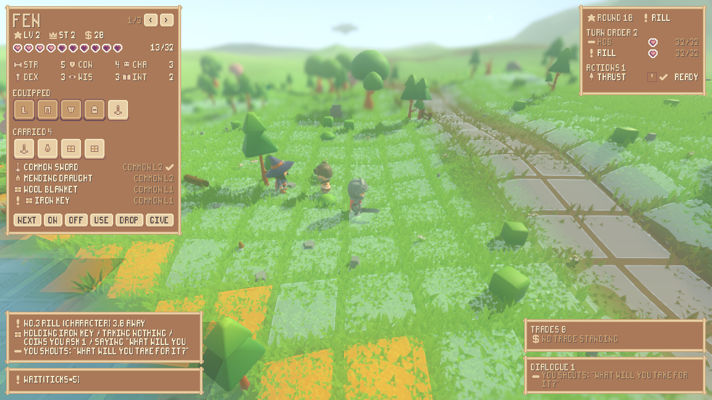

# Playing it, a second time: each component judged, then the whole thing in one run

This is a playtest, not a test run. Every component the "a game a person can
play" milestone built was driven from the **built render shell** -- the same
`./run_render.sh` a person launches -- with keys pressed at named ticks, and each
was judged by what a player would see and feel, not by whether the code ran.
Then one longer run put movement, an action of every kind, the inventory, a
fight entered from the world, played and left, and the return to real time
through a single seed.

**Why a second pass.** The first pass (commit `f17e074`) found sixteen defects.
Four of them were fixed since, each as its own work item: a fight that starts by
itself is now drawn and answers its keys (`e328871`, `d29342c` and the drawn-fight
work before them), a fight walked into can be finished and can be left
(`e328871`), every panel fits the window the game ships in (`d29342c`), and a
person walks at the pace the world walks at (`ac63731`). This pass drives the
same ground again with those fixes in the tree and re-judges all four **from
frames**, not from the fixes' own claims.

## The limit, stated plainly

**This machine has no display.** Nothing below is a person at a keyboard. Each
session is the built shell running inside `xvfb-run -a`, an off-screen X server,
with `--input "<tick>:<key>,..."` pressing the keys a person would press and
`--screenshot-ticks "<tick>:<file>,..."` photographing named moments. The presses
go through the engine's own input queue, so they arrive at the same bindings a
person's would, and the frames are the frames a person would see -- but nobody
felt the game. Where a judgement below needs a hand on a keyboard rather than a
photograph, it says so and stops there.

**Run it yourself.** Every session's command is in its log's first two lines, and
each log also prints the same command with the synthetic-input flags removed. The
shortest way in is the stage built to hold one of everything:

    ./run_render.sh --scenario play --play --sheet

WASD walks, Tab aims at the next thing in sight, E examines it, F turns the ring
of what you carry, 1/2/3 put on / take off / use up, X drops, T says the picked
line, O offers a trade, Q takes, N attacks, M waits, Z opens the sheet. In a
fight, `[` and `]` pick and step onto a cell, `4`-`7` spend a weapon action,
`8`/`9` turn, `0` ends the turn, and **`.` leaves the fight** -- that last one is
new since the first pass. Escape quits.

To reproduce the whole playtest here, `./tools/playtest.sh all`, or one session at
a time by name.

**Four judgements a photograph cannot make**, which are handed back rather than
guessed at. This machine renders through `llvmpipe`, a software rasteriser, and
the two longest runs here reported `frame_ms=133.4` -- about seven and a half
frames a second -- so nothing about how the game *feels in time* was judged here:

* whether a four-tick action reads as a step or as a lurch;
* whether holding a direction key walks or stutters (each press is a fresh
  choice, and only the trace was read, never a held key);
* whether the walk animation reads as a walk in motion -- only stills were taken;
* whether the follow camera is comfortable to move under.

Run `./run_render.sh --scenario play --play --sheet` on a machine with a graphics
card and a keyboard and those four are answered in a minute. Nothing below claims
them.

**One check on the evidence itself.** `--screenshot-ticks "12:a.png"` means "the
first frame drawn at tick 12 or later", and at seven frames a second on twelve
ticks a second a frame lands on whatever tick it lands on. Every frame here is
renamed to the tick its own trace records it was taken on
(`tools/playtest_retick.sh`), so a frame called `-t13` was taken on tick 13. That
script had a fault this pass found and fixed: a session asking for consecutive
ticks produced renames that collided -- `-t8` became `-t10` while the real `-t10`
was still waiting to become `-t13` -- so the walk session's six frames were
carrying each other's pixels under each other's names. It now moves every frame
through a temporary name first, and the walk session was re-run. No frame below
came from the broken pass.

## One row per component

One seed throughout: **1234**, the seed every scenario in this repository is
written on. "Ticks" is the tick the run stopped on. Every command below is
prefixed `xvfb-run -a ./run_render.sh --seed 1234`, and each session's own log
prints it in full.

| # | component | session | command tail | ticks | frames | playable? |
|---|---|---|---|---|---|---|
| 1 | grid squares that read through grass | `board` | `--scenario play --play --board --camera 0 16 20 --aim 2`; then `--no-grass`; then the same with no `--board` | 10 / 10 / 10 | `board-grass-t8`, `board-bare-t8`, `board-off-t8` | **Yes.** The lattice bends over the mound, each square is bounded by its cell, and the grass thins only where a square lies. No legend for the amber cells. |
| 2 | a world that runs | `live` | `--play --journal`, no presses at all | 34 | `live-t7`, `live-t32` | **Yes.** Four characters -- Pip, Nettle, Corin and a `Scholar` the enemy field put there -- inside an action on every tick while the person does nothing. |
| 3 | a person as one of the minds | `input` | `--scenario play --play --journal --input "6:w,12:a,18:s,24:d"` | 34 | `input-t10`, `input-t32` | **Yes.** Four steps, and the person's choices enter the journal in the same words as everyone else's. Nothing in it marks which one is the person. |
| 4 | every verb | `verbs` | `--scenario play --play --journal` + 22 presses | 128 | `verbs-t16`, `-t34`, `-t64`, `-t125` | **Eleven of the fifteen rows here**; the wardrobe's three are in `bag` and all fifteen are in the long run. **The refusals are still the best writing in the game.** |
| 5 | a walk that happens while it happens | `walk` | `--scenario play --play --journal --camera 0 5 10 --aim 1 --input "6:w"` | 24 | `walk-t8`, `-t10`, `-t13`, `-t16`, `-t18`, `-t21` | **Yes.** The picture changes across the whole action and stops changing the tick the action ends -- which is now tick 13, four ticks in, not twenty. |
| 6 | a person walks at the world's pace | `pace` | `--scenario play --play --journal --camera 0 5 10 --aim 1` + five presses of W | 40 | `pace-t8`, `pace-t37` | **Yes, and this is a fix re-judged.** $0.90$ units a tick either way. One tick of overhead between presses is all that is left. |
| 7 | an inventory a person can operate | `bag` | `--scenario play --play --sheet --journal` + 11 presses | 61 | `bag-t10`, `-t18`, `-t34`, `-t58` | **Yes, and this is a fix re-judged.** Every wardrobe row works, and the engine's reply to what you just pressed is now on the screen beside the sheet. |
| 8 | every panel inside the window | `fit` | `--scenario play --play --sheet --readout --board --dialogue --trade` + 4 presses, at $1152\times648$, $1280\times720$ and $2560\times1440$ | 37 / 37 / 37 | `fit-t16`, `fit-t34`, `fit-1280x720-t34`, `fit-2560x1440-t34` | **Yes, and this is a fix re-judged.** Every panel is inside the window at all three sizes, with every button on screen. |
| 9 | items you can see on the ground | `items` | `--scenario play --play --journal --camera 0 6 -11 --aim 1` + 7 presses; then `--no-grass`; then walked onto the pile with the grass off; then high off to the side | 40 / 40 / 48 / 10 | `items-t5`, `-t18`, `-t29`, `-t37`, `items-bare-t19`, `-t37`, `items-pile-t13`, `-t26`, `-t45`, `items-side-t8` | **Works, still cannot be seen.** The round trip runs from the keyboard (`pick_up ok item=iron key from=4`); four runs at three camera placements and no frame with the pile in it. |
| 10 | enemies that spawn, and the fight they start | `enemy` | `--play --journal` + six presses of W, no `--board` and no `--readout`; then the same at a closer camera | 93 / 93 | `enemy-t21`, `-t40`, `-t53`, `-t90`, `enemy-close-t40`, `-t61`, `-t90` | **Yes, and this is a fix re-judged.** An enemy the field placed starts a fight by itself, and the board, the turn order and the turn prompt are all drawn without being asked for. |
| 11 | a battle played from the keyboard | `fight` | `--scenario battle --play --readout --board --journal` + 27 presses | 138 | `fight-t10`, `-t29`, `-t80`, `-t136` | **Yes.** Board at t=16, two full turns with a move, a weapon action, a minion and a free turn, resolved and put away at t=61. |
| 12 | a fight walked into can be finished | `ended` | `--scenario play --play --journal --camera 0 9 14 --aim 1` + 18 walk presses and 42 six-key turns | 795 | `ended-t40`, `-t101`, `-t152`, `-t301`, `-t501`, `-t701`, `-t792` | **The board is put away -- three times.** But it is put away because **the person is beaten**, and nothing on the screen says so. See defect 1. |
| 13 | a fight walked into can be left | `left` | the same walk, two turns, then `.` pressed every other tick across a whole round | 237 | `left-t101`, `-t141`, `-t205`, `-t221`, `-t234` | **Yes, and this is a fix re-judged.** `round 3 turn leave the fight -> done`, and the person walks in real time again sixty ticks later. |

Traces are `reports/playtest-<name>.log`; frames are `reports/assets/playtest-<name>-t<tick>.png`.

## The four defects fixed since the first pass, re-judged from frames

Each of these was raised by the first pass and fixed as its own work item. None
of the four is judged below from its fix's own claim; each is judged from a frame
this pass photographed and from the trace that made it.

### 1. A fight that begins by itself is drawn, and answers its keys

The first pass found that a fight the world started drew **no board, no readout
and no turn prompt**, because both were built only for `--board` and `--readout`,
and that every key afterwards was echoed as `chose ...` and silently discarded.

The `enemy` session passes neither flag. `xvfb-run -a ./run_render.sh --seed 1234
--play --journal --input "6:w,12:w,18:w,24:w,30:w,36:w"`. At tick 26 an enemy the
field placed engages, and this is tick 61 of it at a camera pulled in:

The lattice is drawn, the cells the turn offers are coloured, the readout names
the round and whose turn it is, lists the turn order with health, the weapon
actions with their ready marks, what is left of the turn, and eight buttons that
press the same keys a person would. `reports/playtest-enemy.log` prints
`readout scale=1 x=875 y=8 w=269 h=290 fight=1` for a run that never asked for a
readout. **Fixed, and the fix is visible.**

**What is still wrong with it, and it is not small.** Look at the frame again:
the camera is inside a tree canopy. Three tree crowns cover most of the board and
neither the person's own piece nor the enemy's is visible anywhere in it. At the
camera the game actually ships with, the same fight is this:

The board is enormous and the fighters are invisible. That is defect 12 below,
and it is the first pass's fifteenth, unchanged.

### 2. A fight walked into can be ended, and can be left

The first pass could not end a fight it walked into and could not leave one:
twenty rounds of sensible play, two blows in eleven hundred ticks, and no key
bound to leaving.

**It can be left.** The `left` session walks east until a board appears at tick
42, plays two turns, and then presses `.` every other tick across a whole round,
because leaving spends a turn and a fixed schedule cannot know which tick the
person's turn falls on:

    render-shell keys .            leave the fight and go back to real time
    render-shell fight t=42 the board appears
    render-shell play t=141 round 2 turn step -> done
    render-shell play t=144 round 2 turn weapon action 1 -> done
    render-shell play t=157 round 3 turn leave the fight -> done
    render-shell play t=215 go_to(offset=(3.600, 0.000)) -> go_to ok at=(-450.900, 418.500) walked=3.6 steps=4

Tick 205, forty-eight ticks after leaving. The readout still shows the fight --
round 9, Hob against Rill -- and the person is out of the turn order and standing
in the world:

Tick 234, and the answer panel reads `WAIT OK TICKS=5 UNTIL=235` under a green
tick. Real time is back, and the walk that carried the person there ran at the
world's own pace.

**It can be ended.** The `ended` session plays the same walked-into fight through
a fixed six-key turn, over and over. The board is put away three times in one
run: `fight t=250 the board is put away`, again at `t=493` and again at `t=736`.
**Fixed** -- the first pass's tenth defect, that a fight neither side can finish
is permanent, is closed.

**But read why it ended.** In seven hundred and ninety-five ticks the journal
holds exactly three blows, all of them the enemy's:

    t=144  Rill  finished attack(target=1 item=common spear) -> attack ok attack=thrust cells=2 hits=1 dealt=11
    t=160  Rill  finished attack(target=1 item=common spear) -> attack ok attack=thrust cells=2 hits=1 dealt=12
    t=176  Rill  finished attack(target=1 item=common spear) -> attack ok attack=thrust cells=2 hits=1 dealt=13

Thirty-six against a person who started six down of thirty-two. And the journal
never says any of it happened *to them*: the person is written into those three
lines only as `target=1`, their own name last appears at tick 109 -- thirty-five
ticks before the first blow -- and it does not appear again in the remaining six
hundred and eighty-six ticks of the run. Every key from then on is answered `it
is not your turn on a board`. This is tick 301, round 26:

The person was beaten at tick 176 and **the game never says so**. The readout
drops them from the turn order and says nothing; the action panel still says
`WAITING FOR YOU`; the answer panel still shows a walk refused two hundred ticks
earlier. `sim/action_engine.gd:180` has the sentence for it -- `"%s is down"` --
and nothing on the board's side of the keyboard ever reaches it. That is defect 1
below, and it is new to this pass.

### 3. Every panel is inside the window the game ships in

The first pass found the combat readout running $120$ px past the right edge and
$68$ px past the bottom of the default $1152\times648$ -- its end-turn button off
the screen -- and the character sheet pushing the trade panel to $y=750$ and the
dialogue panel to $y=922$ in a $648$-pixel window.

Both are gone. The shell prints each panel's own placement at the end of every
run. At the shipped size, with the sheet, the readout, the board, the dialogue
and the trade panel all asked for at once:

| panel | placement | right edge | bottom edge |
|---|---|---|---|
| sheet | `x=8 y=8 w=287 h=374` | $295$ | $382$ |
| readout (in a fight) | `x=875 y=8 w=269 h=350` | $1144$ | $358$ |
| trade | `x=846 y=515 w=298 h=57` | $1144$ | $572$ |
| dialogue | `x=846 y=576 w=298 h=64` | $1144$ | $640$ |

Every number is inside $1152\times648$. The same run at $1280\times720$ keeps
scale 1 and moves the two right-hand panels to $x=974$, bottom $712$; at
$2560\times1440$ it doubles the scale and lands at right edge $2544$, bottom
$1424$. The frames say the same thing. The sheet, open, with its bottom border
and all six of its buttons on screen, and the engine's answer to the last press
readable beside it:

And the combat readout, whole, with `LEAVE` and `END` both on the screen:

**Fixed.** The measured cost: the panels now take $17.7\%$ of the window's height
and $7.1\%$ of its pixels in an ordinary real-time frame, against the first
pass's $35\%$ and $25\%$. In a fight the readout sits in the top right and the
row band reads $61.1\%$ of the height, but only $16.7\%$ of the pixels.

**What it cost, and it is a real complaint.** The fix is partly a scale drop:
at $1152\times648$ the whole interface is drawn at scale 1 where the readout used
to be scale 2. Every panel now fits, and every panel is drawn at half the size it
was. Whether a pixel font at scale 1 on a $648$-pixel screen is comfortable to
read for an hour is exactly the kind of judgement a photograph cannot make, and
it is handed back with the command.

### 4. A person walks at the pace the world walks at

The first pass measured a person at $0.18$ units a tick against every other
character's $0.90$ -- one fifth -- because `W` issued a $3.6$-unit `go_to` while
`go_to` occupied twenty ticks whatever the distance.

The `pace` session presses W five times with the journal on, so both sides of the
comparison come out of one trace at one seed:

| who | distance | ticks | units per tick |
|---|---|---|---|
| a person pressing W (`reports/playtest-pace.log`) | $3.6$ | $4$ | $\mathbf{0.90}$ |
| the world's own wanderer (`reports/playtest-pace-world.log`) | $18.0$ | $20$ | $\mathbf{0.90}$ |

    t=  9  Fen    began go_to(offset=(0.000, -3.600)), 4 ticks
    t= 13  Fen    finished go_to(offset=(0.000, -3.600)) -> go_to ok at=(-480.000, 416.400) walked=3.6 steps=4

**Fixed, exactly.** The frames agree. The `walk` session photographs one step six
times and the world band of those frames differs like this, in grey levels:

|  | t8 | t10 | t13 | t16 | t18 | t21 |
|---|---|---|---|---|---|---|
| **t8** | $0.00$ | $8.93$ | $17.59$ | $17.60$ | $17.56$ | $17.55$ |
| **t13** | $17.59$ | $15.67$ | $0.00$ | $1.54$ | $2.01$ | $2.21$ |

The picture changes right through the action -- half the change by tick 10, the
rest by tick 13 -- and then stops. Tick 13 is the tick the trace says the action
finished. Under the old cost the picture stopped a quarter of the way in and the
person stood still for sixteen ticks; there is no such tail now.

**The one thing left, stated honestly.** A self-driven character's next walk
begins on the tick the last one ended: `finished ... t=21`, `finished ... t=41`,
eighteen units each, no gap. A person's next walk begins one tick later --
`finished t=13`, `began t=14` -- so a person walking without pause sustains
$3.6/5 = 0.72$ units a tick against a wanderer's $0.90$, which is $80\%$, not
$100\%$. Whether that seam is felt as a hitch is the second of the four
judgements a photograph cannot make.

## The rest of the components, judged

### Grid squares (the two faults the user reported)

The user reported two faults: squares that do not hug the terrain, and grass that
hides them. Both are still gone. This is the pair the claim turns on -- one seed,
one camera, one tick (all three frames landed on tick 8 exactly), grass on in
both, the squares the only difference:

| squares off | squares on |
|---|---|
|  |  |

Over the lattice, mean $|\Delta \mathrm{RGB}|$ between the two is $19.08$ while
mean green barely moves ($182.25$ against $177.70$) -- the board is not washing
the world out, it is clearing grass locally. Over a control box of sky and far
hill that no lattice is in, the two frames differ by $0.15$: they are the same
moment of the same world, so the $19.08$ is the squares and nothing else.

**The one complaint, unchanged.** Some squares are amber -- `BOARD_CLIFF`, cells
at a cliff edge -- and nothing on screen says so. A player sees two colours of
square and is told nothing about either.

### The world runs, the person is in it, and the verbs are reachable

With the player pressing nothing at all, `reports/playtest-live.log` shows four
characters inside an action the engine is carrying out on every tick -- Pip,
Nettle, Corin, and a `Scholar` the enemy field stood up. A person's choices
appear in that same journal in the same shape (`Fen began go_to(offset=(0.000,
-3.600)), 4 ticks`), and nothing in it marks which of them is the person, which
is what the milestone asked for.

Eleven of the catalogue's fifteen rows were reached from key presses in the
`verbs` session -- go to, jump, attack, say, the three trade rows, drop, examine,
interact and wait. The four it missed are `pick_up`, which needs the person to
walk onto the pile, and the wardrobe's three, which the `bag` session takes. All
fifteen are in the long run. The refusals remain the strongest writing in the
game:

    jump refused: 12.00 is further than DEX 3 jumps (3.75)
    interact refused: Hob is a character: talk or trade
    use refused: a common sword is not used up: it is kept
    trade_propose refused: Hob is out of reach (6.00 > 2.50)
    trade_deny refused: Hob has offered nothing
    equip refused: Fen carries no common boots

**Two complaints, both unchanged from the first pass.** *The engine's words are
drawn as a call, not a sentence*: the action panel prints the action verbatim, so
the top line reads `SAY(TEXT="WHAT WILL YOU TAKE FOR IT?")`, and in the pack's
pixel font `(` and `)` are bare vertical strokes and `,` reads as `.`, so what is
actually on the screen is `SAYITEXT="WHAT WILL YOU TAKE FOR IT?"I`. *And a
refused walk still costs its whole action*: pressing G sent the person toward a
landmark and answered `go_to refused: the way to the position is blocked` after
the action had run.

### The inventory

Every wardrobe row works, with good answers:

    equip ok item=common boots slot=boots instead_of=- moves=2 attacks=2 defence=0
    unequip ok item=common boots slot=boots moves=1 attacks=2 defence=0
    use refused: a common sword is not used up: it is kept
    drop ok item=mending draught into=6

The sheet is handsome and legible -- name, level, standing, coin, hearts, all six
abilities, the equipped slots, what is carried, and a tick on the held thing --
and, since the fit work, the engine's reply to the last press is on the screen
beside it.

**Three complaints.** The five equipped slots are drawn as unlabelled icon boxes,
so you cannot tell which slot is which without taking something off and watching
which box empties. The six buttons say `NEXT ON OFF USE DROP GIVE` but not which
keys press them, so a player has to have read the thirty-six-line key list the
shell prints at startup. And the sheet covers the left third of the world while
it is open, which is where the followed character is drawn.

### Items on the ground

The mechanism is sound and the round trip runs from the keyboard. Walked onto the
pile, the readout reads `NO.4 PILE (PILE) 0.4 AWAY HOLDING IRON KEY` and the key
comes off it:

    render-shell play t=23 chose pick_up(item=iron key target=4)
    t= 27  Fen  finished pick_up(item=iron key target=4) -> pick_up ok item=iron key from=4

**I still could not photograph one.** Four runs at three camera placements were
tried this pass -- close from the front with the grass on, the same again with it
off, standing on the pile with the grass off, and high off to the side with the
grass off -- and no pile is identifiable in any of them. This is the third of
them, taken while the person is $0.4$ units from the pile and the readout is
naming what it holds:

A player picks things up by reading text, not by seeing them. This is the first
pass's twelfth defect, unchanged.

## The spawned enemy, and why one seed cannot hold both

The acceptance for this work asks for a spawned enemy inside the single longer
run "where the seed can hold one". **No seed can**, and this pass can now say why
exactly, from the code rather than from a distance estimate.

`sim/scripted_play.gd:164` -- like every other scenario -- begins by calling
`World.clear_cast()`. That call ends with `enemy_streamer.stop()`
(`sim/world.gd:281-288`), and `stop()` sets `spawning = false`
(`sim/enemy_streamer.gd`), which `update()` checks before it stands anything up.
Nothing ever sets it back. The comment on it says what it is for: *"Stop spawning
and forget every cell. What a world being handed to a scenario does: the people
on that stage are the scenario's, and nothing joins them."*

So the choice is structural, not a matter of walking far enough:

* **the play stage** (`--scenario play`) is the only world holding a trader, a
  pile and a chest, so it is the only one where the fifteen catalogue rows are
  more than fifteen refusals -- and it can never contain a spawned enemy, at any
  seed, for any number of ticks;
* **the ordinary world** (`--play` with no scenario) does spawn them -- at seed
  1234 a `Scholar` from cell $(-1,-1)$ engages at tick 26 without being asked --
  and holds nothing to trade with, pick up or open.

The first pass gave a distance for this ("about $356$ ticks of unbroken
walking"). That number is now wrong twice over: the walk-pace fix would have cut
it to about $89$ ticks, and it was never the reason anyway. The reason is the one
line above.

The spawned enemy is therefore exercised in its own seeded run, with its own
command:

    xvfb-run -a ./run_render.sh --seed 1234 --play --journal \
        --input "6:w,12:w,18:w,24:w,30:w,36:w" \
        --screenshot-ticks "20:...,40:...,52:...,90:..."

and in a second run at a closer camera (`reports/playtest-enemy-close.log`), which
is where the board can be photographed rather than guessed at. Both are in the
table above, rows 10.

## The whole thing in one run

One command, one seed, **362 ticks, 95 presses, eleven frames**, trace in
`reports/playtest-whole.log`:

    xvfb-run -a ./run_render.sh --seed 1234 --scenario play --play \
        --journal --sheet --board --readout --camera 0 9 14 --aim 1 \
        --input "<95 presses>" --screenshot-ticks "<11 ticks>"

Four stretches, in the order a person would meet them.

**Ticks 6 to 160 -- every row of the catalogue, and the wardrobe.** All fifteen
rows of `ActionCatalog.ROWS` began in this one run: `go_to` (9), `examine` (4),
`jump` (2), `say` (2), `wait` (2), and one each of `attack`, `drop`, `equip`,
`unequip`, `use`, `pick_up`, `interact`, `trade_propose`, `trade_accept` and
`trade_deny`. The key came off the pile, the boots went on and came off, the
draught was drunk, the sheet was opened and shut.

**Ticks 166 to 197 -- the walk east, and a fight nobody asked for.** Nine presses
of D, and at tick 197 `render-shell fight t=197 the board appears`: Rill noticed,
closed, and the fight snapped on through `ActionScene.ENGAGE_RADIUS`. Nothing on
the command line asked for it.

**Ticks 226 to 264 -- two turns on the board, and the leave.** A turn buys three
things and the run spends them:

    render-shell play t=229 round 1 turn step -> done
    render-shell play t=234 round 1 turn weapon action 1 -> done
    render-shell play t=234 round 1 turn weapon action 2 -> refused: already acted this turn
    render-shell play t=240 round 1 turn end the turn -> done
    render-shell play t=248 round 2 turn weapon action 1 -> done
    render-shell play t=256 round 2 turn end the turn -> done
    render-shell play t=264 round 3 turn leave the fight -> done

This is tick 240, a turn on a board the world started, with the sheet and the
readout both open and both inside the window:

**Ticks 310 to 360 -- real time again, and the world takes the person back.** Two
walks, a wait, two examines and an aim, every one of them answered:

    t=316  go_to ok at=(-462.000, 423.600) walked=4.449 steps=5
    t=322  go_to ok at=(-458.400, 423.600) walked=3.6 steps=4
    t=328  wait ok ticks=5 until=333
    t=335  examine ok id=3 name=Rill kind=commander health=unhurt fighting=true ... distance=2.97
    t=354  examine ok item=mending draught seen=common consumable  L2 P=8 mov=0 def=0 eff=8

Tick 325. The person is out of the turn order, thirteen hearts of thirty-two down
from the fight, and walking:

**So the single run closes the line the first pass could not**: movement, an
action of every kind, the inventory, a fight entered from the running world,
turns taken on its board, the fight ended from the keyboard and the return to
real time -- one seed, one command, one run.

**Two honest qualifications.**

*The fight is left, not won.* This is a choice the trace forced and it is the
finding, not a workaround. On the play stage at seed 1234 Rill lands a thrust
every sixteen ticks for eleven to sixteen, and the person starts six down of
thirty-two: three enemy turns is the whole budget. A swing aimed by a fixed key
schedule rather than at the enemy answers `done` without landing: in `ended` the
person reached three turns before being beaten and spent a weapon action on every
one of them, and the journal records no blow of theirs at all.
`.` is the other way the milestone says a fight ends, and it is the only one that
hands a live person back to real time. A fight fought until the board is put away
is in the `ended` session (three times), and a battle won end to end is in the
`fight` session.

*The first step after leaving is longer than a step.* `walked=4.449 steps=5`,
where every other press walks $3.6$ in four. Leaving puts the character back at
the cell it was standing on, and the first walk covers that remainder. It is
consistent, it is answered, and it is not a defect -- but it is worth writing
down, because it is the one place a press of W does not buy a fixed distance.

## How big is the thing you are playing?

One number is still worth more than most of the complaints. In
`playtest-walk-t8.png`, taken from $11.18$ world units away, the knight's armour
is $73$ pixels tall. The camera the game is *played* from sits at
`CAMERA_OFFSET = (0, 42, 52)`, which is $66.84$ units away with the same field of
view, so the same character there is

$$73 \times \frac{11.18}{66.84} = 12.2\ \text{pixels}$$

on a $648$-pixel screen -- $1.9\%$ of the window height. This is the shipped
camera in the middle of a conversation, with the person and the trader $2.4$
units apart:

Neither of them can be picked out. Almost every frame in this playtest was taken
from a closer camera than the game ships with, because at the shipped one there
is nothing to look at. The window-fit work has made the panels smaller -- $7.1\%$
of the pixels rather than $25\%$ -- so the panels are no longer the reason. The
camera is.

## Every defect, with a reproduction

**Six of the first pass's sixteen are closed.** Four were fixed as their own work
items and are re-judged from frames above -- panels off the window (its 1 and 2),
the walk at one fifth speed (3), and a fight that starts by itself drawing
nothing (4). Two more closed with them: **its 5**, every real-time key on a board
being echoed as `chose ...` and silently discarded, is gone -- every press is now
chosen and answered (`go_to refused: the board decides where a fighter goes`,
`reports/playtest-whole.log` at ticks 197, 202, 208 and 216) -- and **its 10**,
that nothing lets a person leave a fight, is gone with the `.` key. Its 16 was
fixed in the first pass itself.

**Ten are still open and five are new.** Nothing below is fixed here: this work
item is judgement, not a second implementation pass, and every repair listed
would change a wording, a camera policy, an art asset or when the board reports a
blow -- each of which needs a decision and a test.

| # | what a player runs into | reproduction | state |
|---|---|---|---|
| 1 | **A person can be beaten and the game never says so.** The readout drops them from the turn order, the action panel goes on saying `WAITING FOR YOU`, the answer panel goes on showing a walk refused two hundred ticks earlier, and every key is answered `it is not your turn on a board`. The journal does not say it either: the blows name the person only as `target=1`. `sim/action_engine.gd:180` has the sentence -- `"%s is down"` -- and nothing on the board's side of the keyboard reaches it. | `reports/playtest-ended.log`: Rill's three thrusts land at t=144, 160 and 176 for 11, 12 and 13 against a person six down of thirty-two; the name `Fen` last appears at t=109 and not once in the remaining 686 ticks. Frame `playtest-ended-t301.png`. | **new** |
| 2 | **A fight that ends starts again three ticks later.** Nothing walks away, nothing cools off, so the same two characters re-engage inside the same engage radius, forever. | `reports/playtest-ended.log`: `fight t=250 the board is put away` / `fight t=253 the board appears`; again at 493/496 and 736/738. Three whole fights in one 795-tick run, none of them chosen. | **new** |
| 3 | **Leaving a fight is not acknowledged anywhere on screen.** The board answers `round 3 turn leave the fight -> done` in the trace, but the answer panel still holds the refusal from before the board appeared, the readout keeps drawing a fight the person is no longer in, and no line says they left. | `reports/playtest-left.log` t=157, frame `playtest-left-t205.png` forty-eight ticks later. | **new** |
| 4 | **A weapon action never says what it did.** The shell answers `weapon action 1 -> done`; the readout's `LAST BLOW` strip names the attack and who struck it (`CUT  FEN`) and never the target, the hit or the damage. The same blow struck by a character the world drives reports `attack ok attack=thrust cells=2 hits=1 dealt=13`. | `reports/playtest-whole.log` t=234 against t=264 in `reports/playtest-ended.log`; frame `playtest-whole-t240.png`. | still open (its 8) |
| 5 | **The step line is unreadable and is not a sentence.** Under the turn prompt the board draws `STEP NONE NO UNIT TO NONE` and `STEP (-152,148) NO UNIT TO MOVE` in a grey a shade off the panel it is on -- the lowest-contrast text in the game, saying the least. | frames `playtest-enemy-close-t61.png` and `playtest-left-t141.png`. | **new** |
| 6 | **The answer panel keeps its last answer for ever**, with nothing to say how old it is, so a refusal from two hundred ticks ago reads as the answer to what you just pressed. | frame `playtest-ended-t301.png`: `GO TO REFUSED: THE BOARD DECIDES WHERE A FIGHTER GOES`, last true at t=109. | still open (its 6) |
| 7 | `it is not your turn on a board` is also the answer when there is no board at all. | `reports/playtest-fight.log`: printed at t=8 and t=13 before the board appears at t=16, and at t=72 to t=131 after it was put away at t=61. | still open (its 7) |
| 8 | Spending a weapon action with nothing in hand is refused on the board as `no such attack` (`sim/combat_resolution.gd:253`); the real-time key for the same condition says `you are holding nothing to attack with` (`render/player_controls.gd:344`). Two sentences for one situation. | both strings are in the tree; the first pass reproduced the board half. | still open (its 9) |
| 9 | The action panel draws the engine's call verbatim, and in the pack's pixel font `(` and `)` are bare vertical strokes and `,` reads as `.`, so a spoken line is drawn `SAYITEXT="WHAT WILL YOU TAKE FOR IT?"I`. | frame `playtest-verbs-t34.png`; any frame with an action chosen. | still open (its 11) |
| 10 | **Ground items cannot be seen.** Four runs and three camera placements this pass -- close from the front with the grass on and again with it off, standing on the pile with the grass off, and high off to the side with the grass off -- and no frame with a pile in it, while the readout names one $0.4$ units away. | `reports/playtest-items-pile.log`: `pick_up ok item=iron key from=4` with the pile in none of `playtest-items-t5/-t18/-t29/-t37`, `-bare-t19/-t37`, `-pile-t13/-t26/-t45`, `-side-t8`. | still open (its 12) |
| 11 | Nothing says what an amber square means (it is `BOARD_CLIFF`, a cliff edge). There is no legend, and a fight can be fought across a field of them. | frames `playtest-board-grass-t8.png`, `playtest-enemy-t40.png`. | still open (its 13) |
| 12 | **At the camera the game is played from, you cannot see anybody.** The person is $12.2$ pixels tall on a $648$-pixel screen ($1.9\%$), tree crowns stand in front with no fade and no camera collision, and a whole board of fighters can be under a canopy. The window-fit work removed the panels as the excuse: they are $7.1\%$ of the pixels now. | measure the armour in `playtest-walk-t8.png` ($73$ px at $11.18$ units) and scale to `CAMERA_OFFSET`'s $66.84$; frames `playtest-verbs-t34.png` (nobody visible, two characters $2.4$ apart) and `playtest-enemy-t40.png` (a whole fight under trees). | still open (its 15) |
| 13 | Aiming (Tab) only cycles forward, so overshooting means going round the whole ring; and a character out of sight is offered as `#3 (character) 30.0 away` with the name blank. | `reports/playtest-items.log` t=8. | still open (its 14) |
| 14 | **A mind never notices that its target left.** After the person leaves, Rill goes on choosing `attack(target=1 item=common spear)` every eight ticks and is refused every time. | `reports/playtest-whole.log` t=272 to t=328: six identical `attack refused: Fen is not on the board`. | **new** |
| 15 | The character sheet's five equipped slots are unlabelled icon boxes, and its six buttons (`NEXT ON OFF USE DROP GIVE`) do not name the keys that press them, so a player has to have read the thirty-six-line key list the shell prints at startup. | frame `playtest-bag-t58.png`. | still open (unnamed in the first pass) |
| 16 | A refused `go_to` still costs its whole action before saying no. | `reports/playtest-verbs.log`: `go_to refused: the way to the position is blocked`, after the action ran. | still open (named as a grumble in the first pass) |

**One thing the fit work cost, which is a judgement rather than a defect.** At
$1152\times648$ the whole interface now draws at scale 1 where the combat readout
used to be scale 2. Everything fits and everything is half the size it was.
Whether a pixel font at scale 1 on a $648$-pixel screen is comfortable for an
hour is the kind of thing only a person at a keyboard can answer, and it is
handed back with the command rather than guessed at.

## Closing checks

| check | command | result |
|---|---|---|
| structure, layer | `./run_tests.sh --layers-only` | `layer check: OK -- res://sim references nothing in the render layer` |
| structure, combat | same run | `combat check: OK -- res://render draws the fight and holds none of it` |
| structure, interface | same run | `interface check: OK -- res://render/ui names its art through sprout_pack.gd alone` |
| structure, asset | same run | `asset check: OK -- res://sim names asset tags and no asset` |
| world fingerprint | `./run_headless.sh --seed 1234 --ticks 40` | `done ticks=40 chunks=39 built=45 final=64f9a1c50f4510dc` |
| whole suite, headless | `lab progress run playtest2-full-suite --log reports/playtest-full-suite.log -- ./run_tests.sh` | `all 67 suites passed (212360 checks)`, exit code 0 |

Counted back out of the committed log rather than taken from the screen: $67$
`RUN` lines matched by $67$ `PASS` lines, $0$ `FAIL`, $0$ `SCRIPT ERROR`, and
`lab progress status playtest2-full-suite` reports `state done`, `pid 2716004
exited`, `note exit code 0`.

**And the tree the suite ran on was still.** A suite that reads a checked-in
transcript compares it against a run of code that may have changed underneath it,
which is exactly how the ten failures at commit `2dca0ec` happened. This pass
wrote nothing under `sim/`, `render/`, `tests/`, `net/`, `bin/`, `assets/` or
`project.godot`: `git status --porcelain` over those paths printed nothing before
the suite started and nothing after it finished, byte for byte the same. What
this pass wrote is `reports/playtest*.{md,log}`, `reports/assets/playtest-*.png`
and three files under `tools/`, and no suite in the tree names any of them.

**The fingerprint is `64f9a1c50f4510dc`**, the same one commit `9e2216f` and the
first playtest pass both quoted. It had to be: this pass changes no file the
simulation loads. Nothing under `sim/` or `render/` was touched at all -- the
whole of it is a report, its traces, its frames, and the three shell scripts that
made them.
