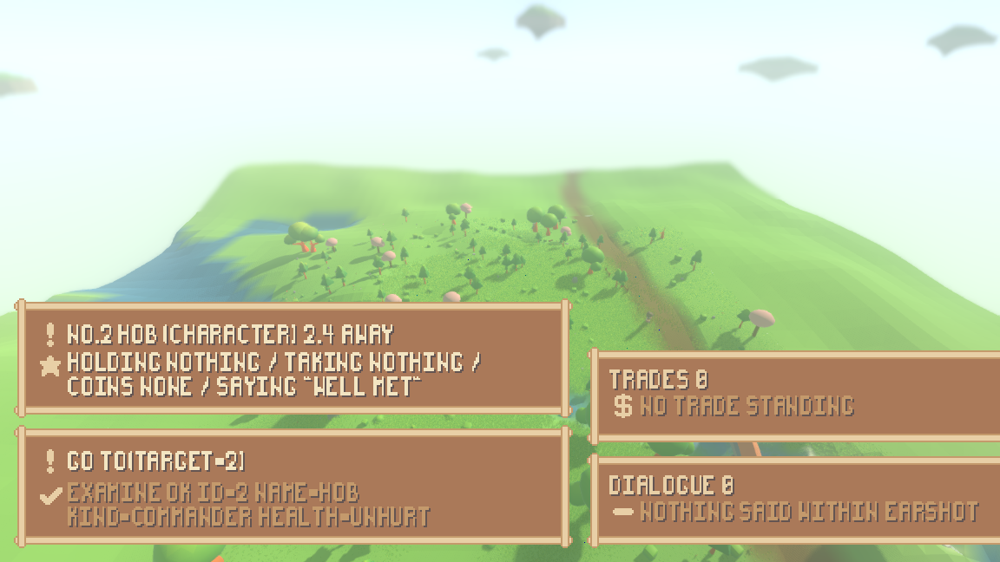
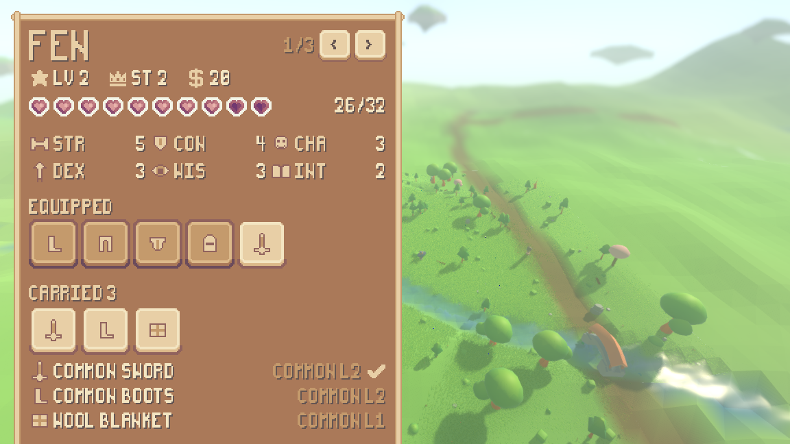
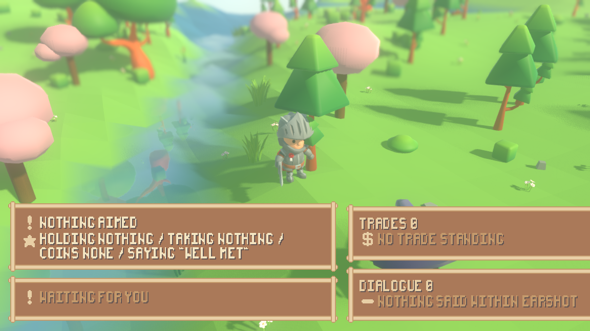
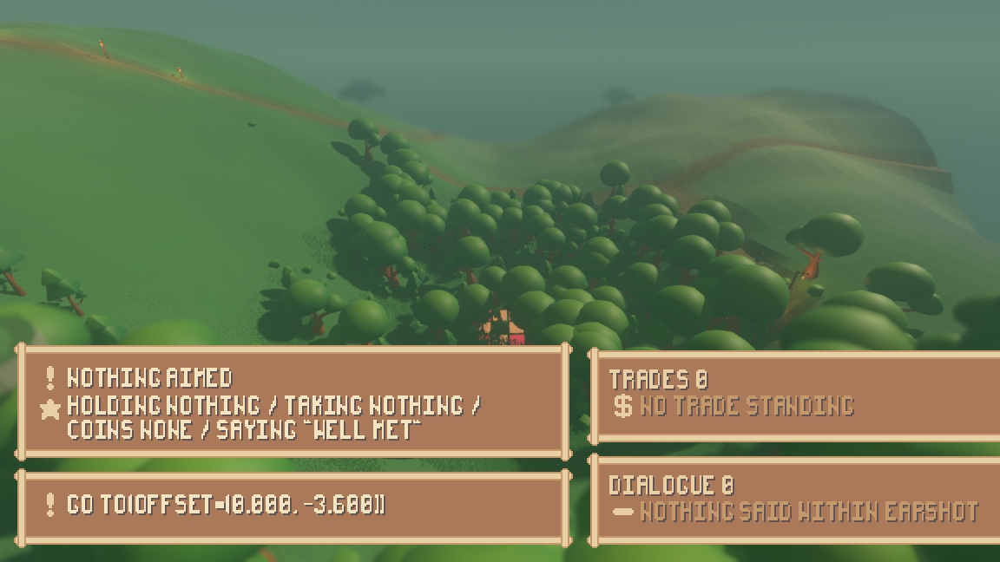
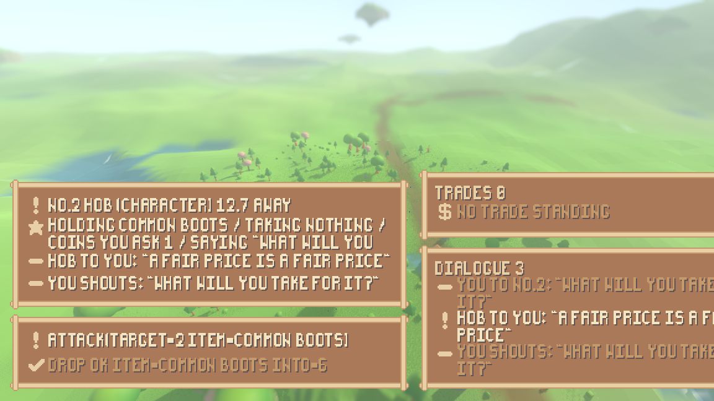
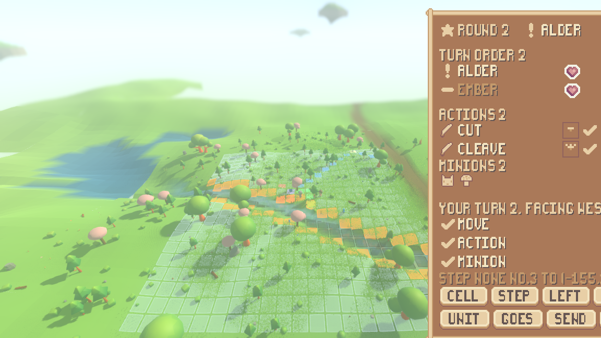
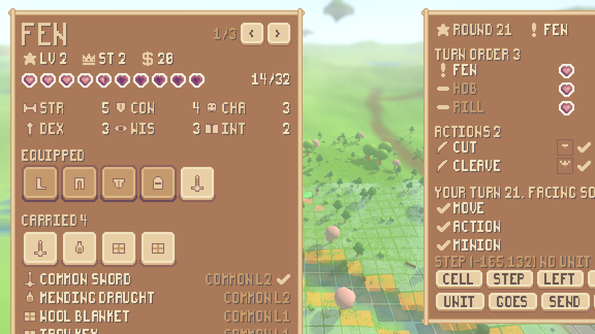

# Playing it: each component judged, then the whole thing in one run

This is a playtest, not a test run. Every component the "a game a person can
play" milestone built was driven from the **built render shell** -- the same
`./run_render.sh` a person launches -- with keys pressed at named ticks, and each
was judged by what a player would see and feel, not by whether the code ran.
Then one longer run put movement, an action of every kind, the inventory, an
enemy, a whole fight and the return to real time through a single seed.

## The limit, stated plainly

**This machine has no display.** Nothing below is a person at a keyboard. Each
session is the built shell running inside `xvfb-run -a`, an off-screen X server,
with `--input "<tick>:<key>,..."` pressing the keys a person would press and
`--screenshot-ticks "<tick>:<file>,..."` photographing named moments. The presses
go through the engine's own input queue, so they arrive at the same bindings a
person's would, and the frames are the frames a person would see -- but nobody
felt the game. Where a judgement below needs a hand on a keyboard rather than a
photograph, it says so and stops there.

**Run it yourself.** Every session's command is in its log's first two lines,
and each log also prints the same command with the synthetic-input flags removed.
The shortest way in is the stage built to hold one of everything:

    ./run_render.sh --scenario play --play --sheet

WASD walks, Tab aims at the next thing in sight, E examines it, F turns the ring
of what you carry, 1/2/3 put on / take off / use up, X drops, T says the picked
line, O offers a trade, Q takes, N attacks, M waits, Z opens the sheet. In a
fight, `[` and `]` pick and step onto a cell, `4`-`7` spend a weapon action,
`8`/`9` turn, `0` ends the turn. Escape quits.

To reproduce the whole playtest here, `./tools/playtest.sh all`, or one session
at a time by name.

**Four judgements a photograph cannot make**, which are handed back rather than
guessed at. This machine renders through `llvmpipe`, a software rasteriser, and
one of these runs reported `frame_ms=133.32` -- about seven and a half frames a
second -- so nothing about how the game *feels in time* was judged here:

* whether a twenty-tick action reads as a beat or as a wait;
* whether holding a direction key walks or stutters (each press is a fresh
  choice, and only the trace was read, never a held key);
* whether the walk animation reads as a walk in motion -- only stills were taken;
* whether the follow camera is comfortable to move under.

Run `./run_render.sh --scenario play --play --sheet` on a machine with a graphics
card and a keyboard and those four are answered in a minute. Nothing below claims
them.

## One row per component

One seed throughout: **1234**, the seed every scenario in this repository is
written on. "Ticks" is the tick the run stopped on.

| # | component | command (all prefixed `xvfb-run -a ./run_render.sh --seed 1234`) | ticks | frames | playable? |
|---|---|---|---|---|---|
| 1 | grid squares | `--scenario play --play --board --camera 0 16 20 --aim 2`, then the same with `--no-grass`, then the same with no `--board` | 13 / 13 / 10 | `playtest-board-grass-t8`, `-bare-t8`, `-off-t8` | **Yes.** Squares hug the ground and read through grass. No legend for the amber cells. |
| 2 | a world that runs | `--play --journal` | 35 | `playtest-live-t6`, `-t30` | **Yes.** Four characters, each inside an action the engine is carrying out on every tick and re-asked every five, with the player idle. |
| 3 | a person as a mind | `--scenario play --play --journal --input "6:w,28:a,50:s,72:d"` | 83 | `playtest-input-t10`, `-t80` | **Yes.** The person's choices enter the journal beside everyone else's, in the same words. |
| 4 | every verb | `--scenario play --play --journal` + 22 presses | 160 | `playtest-verbs-t20`, `-t60`, `-t100`, `-t156` | **Ten of twelve rows here** (the other two need something in reach, and the long run gets them). **The refusals are the best writing in the game.** |
| 5 | a walk that happens | `--scenario play --play --journal --camera 0 5 10 --aim 1 --input "6:w"` | 32 | `playtest-walk-t8` … `-t28` | **Partly.** The walk is smooth, but one keypress walks for 4 ticks and stands still for 16. |
| 6 | the inventory | `--scenario play --play --sheet --journal` + 11 presses | 66 | `playtest-bag-t8`, `-t18`, `-t36`, `-t62` | **Operable, unreadable.** Opening it throws every other panel off the screen. |
| 7 | items on the ground | `--scenario play --play --journal --camera 0 6 -11 --aim 1` + 7 presses, then the same with `--no-grass`, then walked up to the pile, then a fourth camera | 45 / 45 / 75 / 10 | `playtest-items-t4` … `-t42`, `-bare-t20`, `-bare-t42`, `-pile-t30` … `-t72`, `-side-t8` | **Works, cannot be seen.** Four cameras and no frame with the pile in it. |
| 8 | enemies that spawn | `--play --journal --input "6:w,28:w,50:w,72:w"` | 93 | `playtest-enemy-t24`, `-t40`, `-t90` | **Yes to the spawn, no to the fight.** It engages you and then nothing is drawn. |
| 9 | a battle from input | `--scenario battle --play --readout --board --journal` + 27 presses | 138 | `playtest-fight-t10`, `-t28`, `-t80`, `-t134` | **Yes.** Board at t=16, two full turns, fight over and put away at t=61. |

Traces are `reports/playtest-<name>.log`; frames are `reports/assets/<name>.png`.

## 1. Grid squares: the two reported faults are fixed

The user reported two faults: squares that do not hug the terrain, and grass that
hides them. Both are gone. This is the pair the claim turns on -- one seed, one
camera, one tick, grass on in both, the squares the only difference:

| squares off | squares on |
|---|---|
|  |  |

The lattice bends over the mound and down the slope instead of floating flat, and
each square is bounded by its own cell. The grass thins where a square lies and
nowhere else: mean $|\Delta \mathrm{RGB}|$ over the lattice area is $16.7$, while
mean green over the same area barely moves ($187.2$ against $184.5$) -- the board
is not washing the world out, it is clearing grass locally.

**The one complaint.** Some squares are amber. They are `BOARD_CLIFF` -- cells at a
cliff edge -- and nothing on screen says so. A player sees two colours of square
and is told nothing about either.

## 2-4. The world runs, the person is in it, and every verb is reachable

With the player pressing nothing at all, `reports/playtest-live.log` shows all
four characters inside an action the engine is carrying out on every tick of the
run, re-asked every five ticks, changing their minds mid-action
(`Scholar(-1,-1) changed its mind at 15/20t`) and being refused in the engine's own
words (`attack refused: Scholar(-1,-1) is outside the pattern of a common buckler
from here`). A person's choices appear in that same journal in the same shape:
`Fen began go_to(offset=(0.000, -3.600)), 20 ticks`. Nothing in the journal marks
which of them is the person -- which is what the milestone asked for.

Ten of the action catalogue's twelve rows were reached from key presses in this
one session -- go to, jump, say, the three trade rows, drop, examine, interact and
wait. The two it missed are the two that need something within arm's reach:
`pick_up`, which answered `the pile is out of reach (4.00 > 2.50)` because the
session never walked over to it, and `attack`, which needs a weapon actually in
hand. Both are reached in the longer run below, and the wardrobe's own three rows
-- equip, unequip, use -- in the inventory session. What this session did reach
includes a real conversation and a real bargain:

    t=46  say ok shout=false heard_by=1 check=1 context=persuade:#2
    t=51  Hob  finished say(text=a fair price is a fair price target=1)
    t=76  trade_accept ok from=2 took=1 took_money=0 gave=0 gave_money=4

and refusals a player can act on:

    jump refused: 12.00 is further than DEX 3 jumps (3.75)
    interact refused: Hob is a character: talk or trade
    use refused: a common sword is not used up: it is kept
    pick_up refused: the pile is out of reach (4.00 > 2.50)
    trade_deny refused: Hob has offered nothing

This is the strongest thing in the game. A refusal tells you the number, the
threshold and the reason, in a sentence.

**Two complaints.**

*The engine's words are shown as a call, not a sentence.* The panel draws the
action verbatim, so the top line of every frame reads
`GO TO(OFFSET=(0.000, -3.600))`. In the pack's pixel font `(` and `)` are narrow
vertical strokes and `,` reads as `.`, so at the size it is drawn it is nearly
`GO TOIOFFSET=I0.000. -3.600II`:

*A refused walk costs a full action.* Pressing G sent the player to a landmark
$46.4$ units away, and twenty ticks later answered `go_to refused: the way to the
position is blocked`. The player waits the whole action to be told no.

## 5. The walk: smooth, and five times too slow for a person

The walk itself is right. `./tools/measure_walk.sh` at seed 1234 prints the
world's own wanderer tick by tick: $0.878$ units of movement on **every** tick of
the twenty, `snapshot.speed` $0.900$ on every tick, clip `Walking_A` throughout.
Movement happens while it happens.

But a person's step is not that walk. `W` issues `go_to` with a $3.6$-unit offset
while `go_to` occupies $20$ ticks whatever the distance, so:

| who | distance | ticks | speed |
|---|---|---|---|
| any character the world drives | $18.0$ units | $20$ | $0.90$ units/tick |
| a person pressing W | $3.6$ units | $20$ | $0.18$ units/tick |

**A person walks at exactly one fifth of the speed of everyone else in the
world**, and spends sixteen of every twenty ticks standing still, unable to do
anything, having already arrived. The frames say the same thing: mean grey
difference between the world band of the five walk frames is $19.2$-$20.5$ from
the pre-walk frame to each in-walk frame, and $1.8$-$5.0$ between the in-walk
frames -- the picture stops changing a quarter of the way into the action.

## 6. The inventory: operable, and it blinds you while you use it

Everything the milestone asked for works, with good answers:

    equip ok item=common boots slot=boots instead_of=- moves=2 attacks=2 defence=0
    unequip ok item=common boots slot=boots moves=1 attacks=2 defence=0
    use ok item=mending draught worth=8 mended=6 health=32 of=32
    drop ok item=common boots into=6

And the sheet itself is handsome and legible -- name, level, standing, coin,
hearts, all six abilities, the equipped slots, what is carried, and a tick on the
held thing:

**But look at the rest of that frame.** There are no other panels. With the sheet
open the shell places them at `trade y=750` and `dialogue y=922` in a window
$648$ pixels tall -- entirely below it -- and the sheet's own bottom border is
$80$ pixels past the edge. A person operating their inventory cannot see what
they chose, what the engine answered, what trade is standing, or what anyone
said. The one panel that tells you `use refused: a common sword is not used up`
is off the screen at the moment you press `3`.

## 7. Items on the ground: they are there, and you cannot see them

The mechanism is sound. `./tools/ground_items_probe.sh` shows a defeated enemy's
drop lying where it fell (`Corvid (#3) went down on tick 125` … `#4 pile at
(-478.50, -2.11, 418.50) holding 1`, `drawn common sword as gear_blade`) and a
pick-up/drop round trip that returns the same object. From the keyboard the whole
cycle runs: `pick_up ok item=iron key from=4`, then `drop ok item=common boots
into=6`.

**I could not photograph one.** Four camera placements were tried -- the shipped
camera, close from behind, close from the front, and high off to the side with the
grass off. In none of them is the pile visible. Three things stack up:

* the play stage's `iron key` is one of seven shipped items with no model of its
  own, drawn through the `gear_bundle` fallback -- a sack $0.83$ units tall;
* the grass is about that tall;
* a pile lies on the ground **under the character**, and the four panels cover a
  $230$-pixel band, rows $398$ to $627$ -- $35\%$ of the window height and $25\%$
  of all its pixels -- which is exactly where the ground under the character is
  drawn.

The readout does its best -- `NO.4 PILE (PILE) 4.0 AWAY HOLDING IRON KEY` -- but a
player is picking things up by reading text, not by seeing them.

## 8. Enemies spawn, engage you, and then the screen goes quiet

The spawn works and it is the best surprise in the game. Unasked, at seed 1234,
`Scholar(-1,-1)` -- an enemy the enemy field placed, named by the cell it came
from -- walks about, changes its mind, weighs `attack(target=3 item=common spear)`
against walking on, and starts a fight:

    render-shell fight t=27 the board appears

This is that fight thirteen ticks in, at the camera the game is played from, in
the ordinary world:

**Then nothing is drawn.** `render/main.gd` builds the lattice only for `--board`
and the readout only for `--readout`, so a plain `--play` run gets neither. The
whole of what the player is told is one line in the answer panel:
`go_to refused: the board decides where a fighter goes`. Twenty-three ticks into
such a fight, this is the screen:

**And the keys go into a hole.** After that first refusal the player keeps pressing
and the shell keeps echoing `chose ...`, but nothing is begun, finished or refused
again -- and neither does anybody else, because once a board is up the world's
loop is playing turns rather than ticks and, as `sim/board_turn.gd` puts it, "plays
no turn while one is a hand's". The board is standing still waiting for a board key,
and the person has not been told there is a board. In `reports/playtest-verbs.log` the choices at t=146 and t=152 never appear
in the journal at all. In a 200-tick probe the same silence ran for 148 ticks
across fourteen presses. Worse, the answer panel keeps its **last** answer: the
frame above shows `ATTACK(TARGET=2 ITEM=COMMON BOOTS)` above a green tick and
`DROP OK ITEM=COMMON BOOTS INTO=6` from fifteen ticks earlier, so the screen reads
as though the attack succeeded.

## 9. A battle from the keyboard: this one works

Asked for properly -- `--scenario battle --play --readout --board` -- a whole fight
is playable end to end from a keyboard, and it is the most finished thing here:

    fight t=16 the board appears
    t=16  round 1 picks step none #3 to (-171,130)
    t=21  round 1 turn send a minion -> done
    t=26  round 1 turn turn left -> done
    t=26  round 1 turn end the turn -> done
    t=42  round 2 turn step -> done
    t=48  round 2 turn weapon action 1 -> done
    t=56  round 2 turn send a minion -> done
    t=58  round 2 turn end the turn -> done
    fight t=61 the board is put away

Entered, two turns taken with a move, a weapon action, a minion activation and a
free turn, the other commanders took theirs, the fight resolved, and it went back
to real time in $61$ ticks. The readout is genuinely good: round, whose turn,
turn order with health, the weapon actions with their cooldown ticks, the minions,
what is left of the turn, and buttons that press the same keys.

**Except it does not fit on the screen.** Read the panel: `YOUR TURN 2. FACING
WES`. The `T` is off the window, the step line is cut mid-number, and the fourth
button on each row is sliced in half -- so the end-turn button is not on the
screen. The shell prints its own placement: `readout x=816 y=16 w=456 h=700` in a
window $1152 \times 648$. That is $120$ pixels past the right edge and $68$ past
the bottom.

**And two wordings.** `it is not your turn on a board` is the answer both when it
is somebody else's turn *and* when there is no fight at all -- the same session
prints it at t=8 before any board exists and at t=72 to t=130 after the board was
put away at t=61. And when a commander with nothing in hand spends a weapon
action, the board says `refused: no such attack`, where the real-time key for the
same condition says `you are holding nothing to attack with`.

## 10. The whole thing in one run — and the one line it could not close

One command, one seed, $970$ ticks, eight frames, trace in
`reports/playtest-whole.log`:

    xvfb-run -a ./run_render.sh --seed 1234 --scenario play --play \
        --journal --sheet --board --readout --input "<130 presses>"

**What it did close.** Every row of the action catalogue began in this single
run -- go to (8), jump (2), attack (3), say (2), the three trade rows, pick up,
drop, examine (2), interact, wait -- and the wardrobe's three besides: equip,
unequip, use. Movement, the inventory opened and shut with `Z`, the key taken off
the pile and the boots dropped, a walk east, and then, unbidden, at tick $309$,
`the board appears`: Rill noticed and closed, and the fight snapped on through
`ActionScene.ENGAGE_RADIUS`. Twenty rounds were then played from the keyboard:

    20 turn step -> done
    30 turn turn left -> done
    20 turn weapon action 1 -> done
    20 turn weapon action 2 -> refused
    20 turn end the turn -> done

The thirty turn-lefts are deliberate: what an attack covers is read from where a
commander stands *as it is facing*, so the run turned $0$, $1$, $2$ then $3$
quarters before each swing and round again, and every facing was tried.

**What it could not close.** In the $661$ ticks between the board appearing and
the run stopping, **exactly one blow landed, and it was the enemy's**:

    t=696  Rill  finished attack(target=1 item=common spear)
                 -> attack ok attack=thrust cells=2 hits=1 dealt=12

Fen started six down of thirty-two, never drank (the ring was on the sword when
`3` was pressed), took that one thrust, and finished on $14/32$ -- which is what
the sheet reads in the last frame, on round $21$, with the fight still on:

The run stopped at tick $970$ with `readout ... fight=1` and **no
`the board is put away` line anywhere in it**. So this run does not show the
return to real time, and it holds no *spawned* enemy either: its only actors were
Fen, Hob and Rill, the play stage's own cast.

**This was tried twice, differently, and both are recorded.** The first attempt
disarmed itself -- pressing `2` while the sword was the held thing took it out of
the hand -- and got sixteen rounds of `weapon action 1 -> refused: no such
attack`. The second kept the weapon and got sixteen rounds of `done` with one
enemy blow landing. The third, above, added the systematic re-facing and got
twenty rounds with one enemy blow landing. Across the second and third,
**$1179$ ticks of fighting and two blows in total, both the enemy's.**

**The honest conclusion.** A fight on the play stage between two level-2
commanders cannot be brought to an end from the keyboard, and there is no way to
walk away from one (finding 10). A battle *can* be played end to end -- session 9
does exactly that, `fight t=16 the board appears` to `fight t=61 the board is put
away` -- but that is the `battle` scenario, where the scenario musters the two
commanders next to each other. When the fight is one you walked into, the snap
leaves you at a distance the board's one-cell-per-turn step does not close.

**And no one seed can hold all six things at once.** The play stage is the only
world with a trader, a pile and a chest, so it is the only one where twelve verbs
are more than twelve refusals -- and the enemy field put nothing within reach of
it in $970$ ticks. The ordinary world does spawn one (`Scholar(-1,-1)` engages at
tick $27$, session 8) and has nothing to trade with, pick up or open. At $0.18$
units a tick a person needs about $64/0.18 = 356$ ticks of unbroken walking to
reach the next $64$-unit enemy cell, so walking from one to the other is not a
thing a single run does.

On a machine with a display, this is the command:

    ./run_render.sh --scenario play --play --sheet --board --readout

## How big is the thing you are playing?

One number is worth more than any of the complaints above. `playtest-walk-t8.png`
was taken from $11.18$ world units away and the knight is $91$ pixels tall. The
camera the game is *played* from sits $66.84$ units away, with the same field of
view, so the same character there is

$$91 \times \frac{11.18}{66.84} = 15.2 \text{ pixels}$$

on a $648$-pixel screen -- $2.3\%$ of the window height. The four interface panels
take $35\%$ of it. **You are twice as far from seeing your own character as you
are from reading a panel about it**, and in a forest the character is behind a
tree canopy with no fade and no camera collision. Almost every frame in this
playtest was taken from a closer camera than the game ships with, because at the
shipped one there is nothing to look at.

## Every defect, with a reproduction

Fifteen are raised as findings and one was fixed here. The boundary on this work
item is that it is judgement, not a second implementation pass: a small fix belongs
here and anything larger is raised. Every repair below except the last would change
a layout policy, an action's tick cost, or when the shell draws the board -- each of
which needs a decision and a test, not a playtest's edit.

| # | what a player runs into | reproduction | fixed or raised |
|---|---|---|---|
| 1 | Every panel is laid out for a bigger window than the game ships in. The combat readout runs $120$ px past the right edge and $68$ px past the bottom, so its end-turn button is not on screen. | `reports/playtest-fight.log`, last lines: `readout scale=2 x=816 y=16 w=456 h=700` in a $1152\times648$ window. Frame `playtest-fight-t28.png`. | raised |
| 2 | Opening the character sheet -- the key the milestone says the inventory is operated from -- places the trade panel at $y=750$ and the dialogue panel at $y=922$ in a $648$-pixel window, i.e. entirely below it, and takes the action and answer panels with them. You cannot see the engine's reply to the thing you just did. | `reports/playtest-bag.log`, last lines. Frame `playtest-bag-t62.png`; with a fight on as well, `playtest-whole-t450.png`. | raised |
| 3 | A person walks at one fifth of the speed of every character the world drives itself, and stands still for sixteen of every twenty ticks. | `reports/playtest-walk.log`: `walked=3.6 steps=4` over a $20$-tick action, against `./tools/measure_walk.sh`'s `walked=18.0 steps=20`. | raised |
| 4 | A fight that starts by itself in the running world draws no board, no readout and no turn prompt, because both are built only for `--board` and `--readout`. The two halves are not equally hard: the readout already hides itself when there is no fight (`playtest-fight-t134.png`, 73 ticks after the board was put away, has no readout on it), so making `--play` imply it costs nothing when nothing is happening; the lattice has no such rule and is drawn permanently once `--board` is passed. | `reports/playtest-enemy.log`: `fight t=27 the board appears`; frame `playtest-verbs-t156.png` is 23 ticks into such a fight and shows an empty meadow. | raised |
| 5 | Once you are on a board, every real-time key is accepted and echoed as `chose ...` and then silently discarded -- not begun, not finished, not refused. | `reports/playtest-verbs.log`: choices at t=146 and t=152 appear nowhere in the journal. In a 200-tick probe the silence ran 148 ticks over fourteen presses. | raised |
| 6 | While that is happening the answer panel keeps its **last** answer, so a green tick sits under an action that never took place. | `playtest-verbs-t156.png`: `ATTACK(TARGET=2 ITEM=COMMON BOOTS)` over `✓ DROP OK ITEM=COMMON BOOTS INTO=6` from fifteen ticks earlier. | raised |
| 7 | `it is not your turn on a board` is also the answer when there is no board at all. | `reports/playtest-fight.log`: printed at t=8 before the board appears at t=16, and at t=72-130 after it was put away at t=61. | raised |
| 8 | A weapon action spent on the board answers `done` and nothing else -- no hit, no miss, no damage -- while the same blow struck by a character the world drives reports `attack ok attack=thrust cells=2 hits=1 dealt=16`. | `reports/playtest-whole.log`: `round 4 turn weapon action 1 -> done` against `t=386 Rill ... hits=1 dealt=16`. | raised |
| 9 | Spending a weapon action with nothing in hand is refused on the board as `refused: no such attack`; the real-time key for the same condition says `you are holding nothing to attack with`. | the first `whole` run (superseded by the one below): six rounds of `weapon action 1 -> refused: no such attack` after `unequip ok item=common sword slot=hand ... attacks=0`. | raised |
| 10 | Nothing lets a person leave a fight, so a fight neither side can finish is permanent. `ActionCatalog` names `Flee` as one of `go_to`'s four calls, but `sim/action_engine.gd:192` refuses every `go_to` from a fighter and `:292` refuses every `jump`, so fleeing is refused by the same line that refuses walking; and no key reaches it either. | `reports/playtest-whole.log`: `go_to refused: the board decides where a fighter goes` after sixteen rounds; the bindings list printed at the top of every run has no flee key. | raised |
| 11 | The action panel draws the engine's call verbatim, and in the pack's pixel font `(` and `)` are bare vertical strokes and `,` reads as `.`, so the top line of most frames is `GO TOIOFFSET=I0.000. -3.600II`. | any frame with a walk chosen, e.g. `playtest-walk-t12.png`. | raised |
| 12 | Ground items cannot be seen. A pile lies on the ground under the character, and the four panels cover rows $398$-$627$ -- $35\%$ of the window height, $25\%$ of its pixels -- which is where that ground is drawn. Four cameras were tried. | `reports/playtest-items-pile.log` picks the key up (`pick_up ok item=iron key from=4`) with the pile in none of `playtest-items-t4/t20`, `playtest-items-bare-t20`, `playtest-items-pile-t30`, `playtest-items-side-t8`. | raised |
| 13 | Nothing says what an amber square means (it is `BOARD_CLIFF`, a cliff edge). There is no legend. | `playtest-board-grass-t8.png`. | raised |
| 14 | Aiming (Tab) only cycles forward, so overshooting the thing you wanted means going round the whole ring; and a character out of sight is offered as `#3 (character) 30.0 away` with the name blank. | `reports/playtest-items.log`, t=8 to t=13. | raised |
| 15 | At the camera the game is played from, your own character is $15.2$ pixels tall on a $648$-pixel screen ($2.3\%$ of it) while the panels take $35\%$, and trees and grass stand in front of it with no fade and no camera collision. | measure the armour in `playtest-walk-t8.png` ($91$ px at $11.18$ units) and scale to `CAMERA_OFFSET`'s $66.84$ units; `playtest-items-t20.png` is the character behind a pine. | raised |
| 16 | `sim/scripted_play.gd` claimed in a doc comment that "nothing in this world can wound the person" because "there is no board-move action yet". Both halves are now false. | this playtest: `render/board_controls.gd` steps (`round N turn step -> done`, cell $y$ falling $135\to131$), and Rill landed `hits=1 dealt=16`, taking Fen from $32$ to $16$. | **fixed here** -- comment corrected, no behaviour touched |

Two more things a player would grumble about that are the catalogue working as
designed rather than defects: a refused `go_to` costs the whole $20$-tick action
before saying no (pressing G walked toward a landmark $46.4$ units off and
answered `the way to the position is blocked` twenty ticks later), and
`drop ok item=common boots into=6` says "into" for a drop onto open ground.

## Closing checks

| check | command | result |
|---|---|---|
| structure, layer | `./run_tests.sh --layers-only` | `layer check: OK -- res://sim references nothing in the render layer` |
| structure, combat | same run | `combat check: OK -- res://render draws the fight and holds none of it` |
| structure, interface | same run | `interface check: OK -- res://render/ui names its art through sprout_pack.gd alone` |
| structure, asset | same run | `asset check: OK -- res://sim names asset tags and no asset` |
| world fingerprint | `./run_headless.sh --seed 1234 --ticks 40` | `done ticks=40 chunks=39 built=45 final=64f9a1c50f4510dc` |
| whole suite, headless | `TMPDIR=$PWD/.tmp-suite ./run_tests.sh`, logged to `reports/playtest-full-suite.log` | `all 65 suites passed (204835 checks)`, exit code 0 |

Counted back out of the committed log rather than taken from the screen: $65$
`RUN` lines matched by $65$ `PASS` lines, $0$ `FAIL`, $0$ `SCRIPT ERROR`, and
`lab progress status playtest-full-suite` reports `state done`, `pid 3672647
exited`, `note exit code 0`. The eight suites this work item leans on are in it:
`board overlay 21`, `walk motion 93`, `player input 106`, `player actions 212`,
`player inventory 57`, `player combat 73`, `ground items 2567`, `agent 1069`.

**The fingerprint is `64f9a1c50f4510dc`, and it is the same one commit `9e2216f`
quoted.** It had to be: the only file this work item changed that the simulation
loads is a doc comment in `sim/scripted_play.gd`. Everything else it added is a
shell script, a report, traces and frames.
