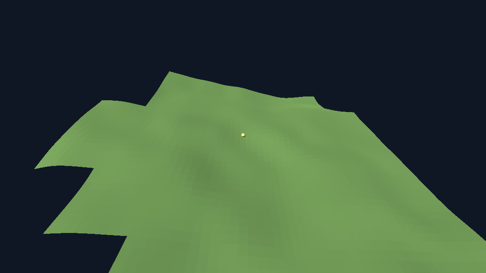

# The render handle is not a way into the world — evidence log

The previous step made a write into the ground *detectable*. This one makes it
*impossible* through the route the renderer actually uses, and shows that the
detection it relies on was not weakened to get there.

Terms used here, defined once, because this project coins some of them.
*Chunk* — a fixed $16 \times 16$ world-unit square of ground, addressed by an
integer coordinate $(c_x, c_z)$; its geometry is $384$ vertices, $384$ normals
and $384$ indices. *Streamer* — the object holding the chunks near an observer
built, dropping the rest; what it holds is a dictionary keyed by chunk
coordinate. *Digest* (this project's word) — a short SHA-256 fingerprint
standing in for "is this the same thing?", computed for one chunk
(`TerrainChunkGeometry.digest()`) and for the whole world (`SimWorld.digest()`,
which folds in the former for every loaded chunk). *Render shell* — everything
under `render/`: the window, camera, meshes and keyboard. *Headless run* — the
same simulation with no renderer at all. *Mutation testing* — deliberately
introducing a bug to see whether the suite notices; a test that stays green
under the bug it is supposed to catch is not testing what it claims to.

As in the previous log, every injection below was applied to the working tree
itself and then removed, and the tree is shown green again at the end.

---

## 1. What changed

**`sim/terrain_chunk_geometry.gd`** gains one method. It returns a chunk with
the same numbers and no shared storage:

```gdscript
func detached_copy() -> TerrainChunkGeometry:
	var copy := TerrainChunkGeometry.new(chunk_x, chunk_z)
	copy.vertices = vertices.duplicate()
	copy.normals = normals.duplicate()
	copy.indices = indices.duplicate()
	copy.lowest = lowest
	copy.highest = highest
	return copy
```

The `.duplicate()` calls are not decoration, and this is the one genuinely
surprising thing found on the way. In this engine a packed array assigned across
**shares its storage**: after `copy.vertices = vertices`, writing
`copy.vertices[0] = …` changes the original too. Measured directly, before
anything else was written:

```
same contents: true
copy changed:  true
live intact:   false idx0=999
```

`live intact: false` — the "copy" was a second door onto the same room. So the
mechanism chosen is a **real duplicate**, and §4 injects exactly that mistake to
show the suite catches it.

**`sim/terrain_streamer.gd`** splits one accessor into two, by audience:

```gdscript
## The geometry of a loaded chunk as anyone outside the simulation gets it: a
## detached copy, or null if the chunk is not loaded.
func geometry(key: Vector2i) -> TerrainChunkGeometry:
	var loaded: TerrainChunkGeometry = _loaded.get(key, null)
	if loaded == null:
		return null
	handles_handed_out += 1
	return loaded.detached_copy()


## The loaded chunk itself, or null if it is not loaded.
##
## Only the simulation may use this.
func live_geometry(key: Vector2i) -> TerrainChunkGeometry:
	return _loaded.get(key, null)
```

The naming does real work. `geometry()` — the plain, obvious, already-used name,
the one `render/main.gd` calls — is now the safe one, so the render layer got
the guarantee without changing a line of its call site. Reaching the world
itself now requires typing `live_geometry`, which is a deliberate act.

`SimWorld.digest()` and `Simulation.chunk_report()` were moved to
`live_geometry()`. That is the whole of §3's requirement: the fingerprint keeps
answering for the ground that exists, not for a copy of it.

**`render/main.gd`** keeps its call site and gains two counters it prints on
exit (`frames=` and `handles=`), which is how §5 measures the cost from the real
render path rather than from a benchmark standing in for it.

### Why a copy, and not an immutable view

The engine offers no read-only packed array, so an "immutable view" would have
had to be a wrapper class with getter methods — which would mean `render/main.gd`
could no longer pass `geometry.vertices` straight into `ArrayMesh`, and would
have to rebuild the arrays element by element to draw anything. That is strictly
more copying, in the slower place, plus a new abstraction. The copy is one
duplicate of $10\,752$ bytes, costs $1.08\,\mu\text{s}$, and leaves the drawing
code untouched. §5 has the numbers.

---

## 2. What the suite now checks

Three checks in `tests/test_render_shell.gd` (30 expectations in the suite, up
from 9 before the previous step and 29 before this one), plus one added to an
existing check:

| Check | Claim |
| --- | --- |
| `_a_write_into_the_live_ground_is_visible_to_the_world_digest` | A write through `live_geometry()` **changes** the world digest, and undoing it restores it. *(The previous step's check, retargeted at the simulation-side accessor.)* |
| …its new final expectation | Computing the world digest hands out **zero** copies, so the fingerprint reads the live ground rather than a copy of it. |
| `_a_write_through_the_render_handle_cannot_reach_the_world` | The same write through `geometry()` — the accessor the shell calls — leaves the world digest **and** the chunk's own digest untouched, while the handle really did take the write. |
| `_copying_a_chunk_is_paid_per_chunk_not_per_frame` | Two shell runs over the same simulated time, at $60$ and $240$ frames per second, ask for the **same** number of copies. |

The first two are kept deliberately as a pair. "The digest did not change" is
worth nothing unless a write that *should* change it does; the detection check is
what stops the isolation check from passing for the wrong reason, and the
isolation check is what the detection check was built to make provable. Both are
in the suite, on the same world and the same chunk, writing the same millimetre.

The isolation check also asserts that the handle carries the *same* geometry as
the live chunk before writing, so isolation cannot be bought by handing over
something other than the ground being drawn.

---

## 3. Green

```
$ ./run_tests.sh
PASS  rng            1325 checks
PASS  determinism    15 checks
PASS  terrain        32 checks
PASS  streaming      4695 checks
PASS  layering       12 checks
PASS  render shell   30 checks

all 6 suites passed (6109 checks)

$ ./run_tests.sh --layers-only
layer check: OK -- res://sim references nothing in the render layer
```

---

## 4. Each check fails when its bug is present

Four bugs, injected into the working tree one at a time and then removed. Only
the render-shell suite ever moves; the failing lines are quoted verbatim.

### A — `geometry()` hands back the loaded chunk itself (the state before this change)

```diff
-	return loaded.detached_copy()
+	return loaded
```

```
FAIL  render shell   29 checks, 6 failed
    - terrain_streamer.geometry() handed back the loaded chunk itself
    - a write through terrain_streamer.geometry(0, -3) changed the world: the render layer can edit the simulation it is drawing
    - the loaded chunk (0, -3) changed when a viewer wrote into its copy
    - writing into the handed-over vertices changed nothing at all, so the check that the world stayed put proves nothing
    - writing into the handed-over normals changed nothing at all
    - writing into the handed-over indices changed nothing at all
```

### B — the copy shares its arrays instead of duplicating them

The engine's trap, from §1. The object is new; the storage is not.

```diff
-	copy.vertices = vertices.duplicate()
-	copy.normals = normals.duplicate()
-	copy.indices = indices.duplicate()
+	copy.vertices = vertices
+	copy.normals = normals
+	copy.indices = indices
```

```
FAIL  render shell   29 checks, 5 failed
    - a write through terrain_streamer.geometry(0, -3) changed the world: the render layer can edit the simulation it is drawing
    - the loaded chunk (0, -3) changed when a viewer wrote into its copy
    - writing into the handed-over vertices changed nothing at all, so the check that the world stayed put proves nothing
    - writing into the handed-over normals changed nothing at all
    - writing into the handed-over indices changed nothing at all
```

A check for "the handle is not the same object" alone would have passed here.
That is why the isolation check writes and then compares contents.

### C — the world digest fingerprints copies instead of the live ground

```diff
-	parts.append("%d,%d:%s" % [key.x, key.y, terrain_streamer.live_geometry(key).digest()])
+	parts.append("%d,%d:%s" % [key.x, key.y, terrain_streamer.geometry(key).digest()])
```

This one is worth recording carefully, because **the first version of the suite
passed under it** — all 6 suites green, 6108 checks. The reason is a real
subtlety rather than a slack test: a copy taken *at digest time* is taken after
the write, so it still shows the write. Writing into the ground cannot
distinguish "fingerprints the ground" from "fingerprints a fresh copy of the
ground". What distinguishes them is that taking a copy is counted, and
fingerprinting must count none:

```gdscript
	var handles_before: int = world.terrain_streamer.handles_handed_out
	world.digest()
	equal(world.terrain_streamer.handles_handed_out, handles_before, …)
```

With that expectation added, the same injection fails:

```
FAIL  render shell   30 checks, 1 failed
    - fingerprinting the world copied 32 chunk(s): the digest is answering for copies of the ground rather than for the ground
```

### D — the shell copies every chunk every frame instead of once

The copy is moved above the "already drawn?" test, so it is paid per visible
chunk per frame:

```diff
 	for key in loaded:
-		if _chunk_views.has(key):
-			continue
 		var geometry := _sim.world.terrain_streamer.geometry(key)
+		if _chunk_views.has(key):
+			continue
```

```
FAIL  render shell   29 checks, 3 failed
    - the shell asked for more copies than it drew chunks: something is copying a chunk it already had
    - four times the frames over the same simulated time asked for a different number of chunk copies: the cost grows with frames, not with chunks
    - the shell asked for at least one chunk copy per frame (4474 copies over 120 frames)
```

$4474$ copies instead of $47$ over the same $120$ frames — the exact regression
the cost claim in §5 rules out.

---

## 5. What it costs

Per chunk, measured over $20\,000$ copies after a warm-up, against the cost of
the operations it sits beside:

| Operation, once per chunk | Time |
| --- | --- |
| `detached_copy()` — $10\,752$ bytes duplicated | $1.08\ \mu\text{s}$ |
| `TerrainChunkMesher.build()` — making the chunk in the first place | $808.98\ \mu\text{s}$ |
| `TerrainChunkGeometry.digest()` — fingerprinting it | $774.53\ \mu\text{s}$ |

The copy is $0.133\%$ of the cost of the chunk it copies.

**How many times per chunk it runs: exactly once, when the chunk first appears.**
`render/main.gd` keeps a view per chunk coordinate and skips coordinates it
already draws, so a chunk that stays loaded for a thousand frames is copied on
one of them. A chunk dropped and later walked back to is a new arrival and is
copied again — once.

**Shown not to grow with frames.** The same two seconds of simulated time, run
by the real render shell at two frame rates:

| Frame rate | Frames drawn | Ticks | Chunks drawn | Copies handed out | Final world digest |
| --- | --- | --- | --- | --- | --- |
| $60$ fps | $120$ | $40$ | $47$ | $47$ | `baf9696edc43f39d` |
| $240$ fps | $480$ | $40$ | $47$ | $47$ | `baf9696edc43f39d` |

Four times the frames, the same $47$ copies — and the same world, which is the
separation claim restated from another angle: frame rate is not an input to the
simulation. This is the check `_copying_a_chunk_is_paid_per_chunk_not_per_frame`
makes on every test run, not a one-off measurement.

The worst single frame is the first, where a fresh world hands over all $32$
chunks around the observer at once: $56\ \mu\text{s}$, against the $16\,667\
\mu\text{s}$ of a $60$-frames-per-second frame. In steady walking the shell
averaged $47$ copies over $120$ frames — about $0.4$ copies, or $0.4\ \mu\text{s}$,
per frame.

---

## 6. The view still draws

Captured after the change, seed $1234$, frame $150$, at a fixed $60$ frames per
second so the capture is reproducible:



The same capture was taken with the copy removed (injection A above, which is
the pre-change behaviour of handing over the live chunk), and the two PNG files
are byte-identical:

```
1b7217b495b966b9c9ee25079aa3ce18  reports/assets/render-handle-isolation.png   (copy)
1b7217b495b966b9c9ee25079aa3ce18  /tmp/.../live-handle.png                     (live handle)
```

Both runs also reported the same world at exit:
`render-shell stop tick=50 frames=151 views=49 handles=49 digest=ffd0635ae83c6a43`.
Nothing about what is drawn, or about the world behind it, changed — only what
the shell would be able to do to it.

And the end-to-end check the suite has carried since the shell existed still
holds: at seed $5$, tick $40$, the shell and a headless run with no renderer at
all reach the same world digest, `baf9696edc43f39d`.
