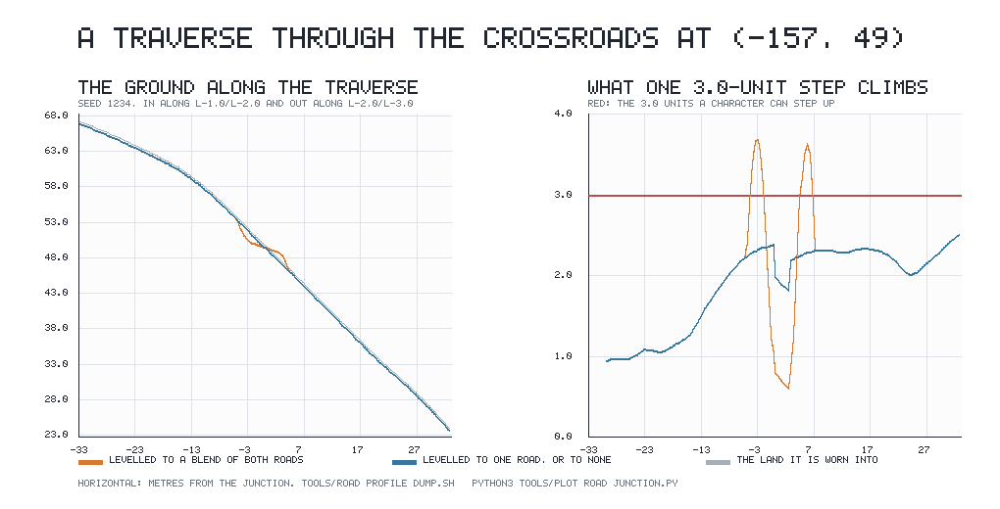

# One carved height where roads run together

A road is carved into the ground: along its centreline the land is levelled
across the roadway and worn `PATH_DEPTH` = 0.30 units in. Where two roads reached
the same ground, the carve used to level it to a **share-weighted blend of both
centrelines** — an average of two heights, weighted by how much of each road's
carving reached the point.

On flat country the two centrelines stand at the same height and the blend is
invisible. On the shoulder of a mountain they do not, and the blend was doing two
things that are wrong:

* it left the **roadway out of level across its own width** by up to **0.950**
  units against the 0.30 it is worn into the land, and
* it put **four steps of finished roadway** on seed 1234 past the **3.0 units a
  character can step up** in one cell of the tactical lattice — a wall in the
  middle of a road, with no way onto either end of it.

This is that defect reproduced, the fix, and what the fix costs.

---

## 1. Reproduced first, before anything was changed

`tools/measure_roads.sh` walks every road within 900 units of the origin at the
width of one lattice cell (3.0 units) and asks the *finished* ground two
questions: what does one step of it climb, and how far out of level is it across
the track. Run against the world as it stood:

```
./tools/measure_roads.sh --seed 1234 --at -157.2 49.1 --within 1.85
```

| what | seed 1234, before |
| --- | --- |
| roads within 1.85 units of $(-157.2, 49.1)$ | **3** — `l-1,0>l-2,0`, `l-2,0>l-3,0`, `l-2,0>s0,0` |
| steps of finished roadway past the 3.0-unit limit | **4** of 4 868, worst **3.713** |
| roadway out of level across its own width | up to **0.950**, against `PATH_DEPTH` 0.30 |

The four walls are at $(-163.0, 48.8)$, $(-154.6, 50.3)$, $(204.8, -83.5)$ and
$(213.7, -84.0)$. All four are within nine units of a place where three roads
meet.

### The three roads are not near-duplicates — they are one junction

The finding this work came from read the three overlapping roads as a
**near-duplicate**: three places nearly in a line, with the road joining the
outer two lying along the roads joining each of them to the middle one. The
measurement says otherwise. All three roads at $(-157.2, 49.1)$ have the landmark
`l-2,0` as an **endpoint**:

| road | from | to | bearing out of `l-2,0` |
| --- | --- | --- | --- |
| `l-2,0>s0,0` | $(-157.2, 49.1)$ | village at $(-88.8, 4.7)$ | −33° |
| `l-1,0>l-2,0` | landmark at $(-91.0, 93.0)$ | $(-157.2, 49.1)$ | +34° |
| `l-2,0>l-3,0` | $(-157.2, 49.1)$ | landmark at $(-265.7, 34.7)$ | 187° |

Sixty-seven degrees apart and one going the other way. Nothing here is a
duplicate of anything; it is a **fork on a hillside**, and three roads leaving one
point necessarily share the ground within a roadway's width of it. The same holds
at the second cluster, around the landmark `l1,-1` at $(207.8, -83.9)$.

That is not an accident of this seed. The graph is a relative neighbourhood
graph: two places are joined exactly when no third is closer to both than they
are to each other. Two edges out of one place at an angle under 60° cannot both
survive that rule — the shorter one puts its far end inside the lens of the
longer, which deletes the longer. So near-collinear duplicates are already
impossible, and roads reach the same ground **only where they converge on a place
they both end at**.

---

## 2. The fix, and why this one

The item offered two: drop an edge whose two endpoints are already joined through
a third place near its line, or make roads that run together share a single
carved height. **The second was taken, because the first does not apply.** There
is no redundant edge at either cluster to drop — dropping any of the three roads
at `l-2,0` would cut a place off the network rather than remove a duplicate — and
§1 shows the graph rule already forbids the configuration the first fix was aimed
at. Dropping edges was never tested against the stop condition for the same
reason: there is nothing to drop.

The carve now does two separate things to the ground, and keeping them apart is
what makes a road walkable.

> **The trough** is dug wherever any road runs, faded at the verge by that road's
> own share of the carving. **The levelling** — moving the ground to the height of
> a road's centreline rather than of the land it stands on — is a claim about
> *one* centreline, so it is applied only where one road is making it. The height
> comes from the nearest road and nothing else, and it fades out by how much a
> second road's carving reaches the same ground.

In code (`sim/path_network.gd`), for the nearest road's share $s_1$ and the next
road's share $s_2$ at a position, with $q$ the nearest point on the nearest road:

$$\Delta = \big(h_\text{before}(q) - h_\text{level}\big)\,(s_1 - s_2)\; -\; \text{PATH\_DEPTH}\cdot s_1$$

On a lone road $s_2 = 0$ and this is **exactly the number the old code returned**,
so ground with one road over it did not move at all. Only ground two roads reach
is different.

`PathNetwork.level_strength_at()` reports $s_1 - s_2$ — how much of the ground
here is a roadway levelled to one centreline. `strength_at()` is untouched and
still reports $s_1$, so the ground's colour, the grass and the scatter see the
same road they always did: the track still reads as a track through the fork.

### Why this makes the walls impossible rather than unlikely

On any road's own centreline the nearest road is that road, at no distance at
all, so $q$ is the point itself and $h_\text{before}(q) = h_\text{level}$. The
first term vanishes and the finished roadway is **the land under it, lowered by
0.30** — it climbs exactly what the land climbs. The routing has already refused
to lay a road up land steeper than a character can step (0 of 4 868 steps of
carved bed over the limit, asserted in `tests/test_mountains.gd`), so no carving
can put a wall in the middle of a road.



*In along `l-1,0>l-2,0`, through the fork at $(-157.2, 49.1)$, out along
`l-2,0>l-3,0`; seed 1234. Left: the finished ground, with the land it is worn
into behind it. The blend (orange) builds a shelf either side of the fork that
the land does not have. Right: what one 3.0-unit step of that walk climbs. The
blend goes over the limit twice; the single-owner carve never approaches it. Drawn
from* `tools/road_profile_dump.sh` *by* `python3 tools/plot_road_junction.py`.

---

## 3. What it costs: the ground under a fork

Where two tracks converge, **nothing levels the ground** — it keeps the land's own
shape, carrying the trough and nothing else. That is deliberate, and it is not a
choice that could have gone the other way:

A surface level across road A's width has its slope along A; level across road
B's width, along B. Where the two roadways cover the same ground and A and B
point different ways, both at once means **flat** — and a flat apron on sloped
ground has to be cut into the hill on its uphill side and rejoin the land
somewhere, which makes the rejoin *steeper* than the road. Flattening the fork
buys the cross-level back by putting the wall somewhere else. So the fork is left
as ground, and what is asserted about it is that leaving it alone is all that
happens: measured over six seeds, the ground where roads converge is out of level
across a track by at most **0.028 units past the land it is worn into**.

Eight to nine per cent of sampled roadway is fork ground of this kind (385 of
4 701 points on seed 1234). It is the same ground the blend used to level; the
difference is that it is now the hillside it always was rather than an invented
average of two roads.

---

## 4. Measured after, over six seeds

`./tools/measure_roads.sh`, seeds 1234, 7, 3, 19, 42 and 101 — every road within
900 units of each origin, 28 729 steps of roadway in all. "Levelled" is roadway
one road alone levels; "converging" is fork ground; "past the land" is how far the
fork ground is out of level beyond the land under it.

| seed | steps past the 3.0 limit | worst step | worst cross-fall, levelled | worst cross-fall past the land, converging |
| --- | --- | --- | --- | --- |
| | before → after | before → after | before → after | before → after |
| 1234 | **4 → 0** | 3.713 → 2.895 | 0.491 → **0.260** | 0.241 → **0.019** |
| 7 | 0 → 0 | 2.795 → 2.795 | 0.490 → **0.266** | 0.079 → **0.027** |
| 3 | 0 → 0 | 2.088 → 2.062 | 0.037 → 0.037 | 0.135 → **0.022** |
| 19 | 0 → 0 | 2.495 → 2.376 | 0.070 → 0.070 | 0.120 → **0.004** |
| 42 | 0 → 0 | 2.553 → 2.553 | 0.070 → **0.048** | 0.090 → **0.028** |
| 101 | 0 → 0 | 2.687 → 2.687 | 0.375 → **0.236** | 0.158 → **0.003** |
| **all** | **4 → 0** of 28 729 | 3.713 → 2.895 | 0.491 → **0.266** | 0.241 → **0.028** |

Both properties the work asked for hold across all six seeds: **no step of
finished roadway exceeds the walk limit**, and **the across-width level error on
levelled roadway is within the road's own carved depth** (0.266 < 0.30). Note
that the blend was over the depth on *levelled* roadway too — 0.491 on seed 1234,
0.490 on seed 7 — because a second road's carving reached in from the side.

### Nothing was disconnected

The graph was not touched, and the measurement says so seed by seed: the same
villages, the same roads, and the same partition of places into connected groups —
the same digest of the grouping itself, before and after.

| seed | villages | roads | connected groups (sizes) | grouping digest, before = after |
| --- | --- | --- | --- | --- |
| 1234 | 8 | 120 | 9 (84, 16, 5, 3, 2, 2, 1, 1, 1) | `f113e7985c4a` |
| 7 | 5 | 120 | 8 (82, 19, 4, 3, 2, 2, 1, 1) | `d31f99b4b718` |
| 3 | 5 | 113 | 10 (33, 24, 20, 11, 7, 7, 3, 3, 2, 2) | `7aca49aeb444` |
| 19 | 4 | 116 | 6 (100, 5, 3, 2, 2, 2) | `0eb48c4a274a` |
| 42 | 6 | 100 | 12 (60, 14, 10, 5, 4, 3, 1×6) | `80ef8912246a` |
| 101 | 12 | 117 | 5 (80, 21, 6, 2, 2) | `fc4a5a49c138` |

Every place reachable by road before is reachable after, by construction: this
change edits no edge.

---

## 5. The suite, and it failing when the fix is reverted

`tests/test_settlements.gd` now asserts both properties.

* *A road is a levelled dirt track* — where one road levels the ground
  (`level_strength_at` ≥ 0.999) the roadway is level across its width to within
  `PATH_DEPTH`; where roads converge, the ground is the land's own to within
  `CONVERGING_SLACK` = 0.10 units; and over 80% of sampled roadway has to be in
  the first case, so the check cannot pass by levelling nothing.
* *No step of finished roadway is a wall* — every road within 800 units of the
  origin, walked at `ROUTE_SAMPLE_STEP`, with no step allowed past
  `ROUTE_GRADE_LIMIT × ROUTE_SAMPLE_STEP` = 3.0 units.

`tests/test_mountains.gd` asked the same question of the finished ground with a
tolerance — `carved_over * 200 < steps`, which was there only because of this
defect. It is now `equal(carved_over, 0)`.

With the fix: **all 28 suites pass, 191 273 checks.** With the old blend put back
and nothing else changed:

```
FAIL  mountains      3030 checks, 1 failed
        - 4 of 4868 steps of finished roadway climb more than 3.0 in one cell,
          so the carving has put a wall in the middle of a road
FAIL  settlements    19833 checks, 6 failed
        - the roadway at (-152.4, 46.0) is 0.313 out of level across itself,
          with one road levelling it
        - the roadway on l-2,0>l-3,0 climbs 3.638 over one 3.0-unit step at (-163.0, 48.8)
        - the roadway on l-1,0>l-2,0 climbs 3.687 over one 3.0-unit step at (-154.6, 50.3)
        - the roadway on l0,-1>l1,-1 climbs 3.713 over one 3.0-unit step at (204.8, -83.5)
        - the roadway on l1,-1>l2,-1 climbs 3.073 over one 3.0-unit step at (213.7, -84.0)
        - 4 of 4254 steps of finished roadway are a wall; the worst climbs 3.713
2 of 28 suites failed
```

---

## 6. The world fingerprint

This changes generated ground, so it moves.

| run | before | after |
| --- | --- | --- |
| seed 1234, 100 ticks | `d4e31b0904ff45c0` | **`d178d38879097c1c`** |
| seed 7, 50 ticks | `1447bc9932999bb6` | `1447bc9932999bb6` |

The before value on seed 1234 is the value the milestone recorded before this
task, so the move is attributable to this change alone: the only edit to
generation is `PathNetwork.ground_delta_at`, and it returns the same number it
always did wherever one road is over the ground.

Seed 7's fingerprint does **not** move, which is the same fact seen from the
other side: over the chunks that seed streams in fifty ticks no two roads
converge, so no ground there is touched.

---

## 7. What is where

| file | what it does |
| --- | --- |
| `sim/path_network.gd` | `ground_delta_at` splits trough from levelling; `_carving_at` finds the owning road and the runner-up; `level_strength_at` reports $s_1 - s_2$ |
| `tests/test_settlements.gd` | the two claims above, and the count that keeps them from being vacuous |
| `tests/test_mountains.gd` | the finished-roadway walk, now at zero |
| `tools/measure_roads.sh` | the measurement all the numbers above come from |
| `tools/road_profile_dump.sh` | the traverse the figure is drawn from |
| `tools/plot_road_junction.py` | draws `reports/assets/road-junction.png` |
