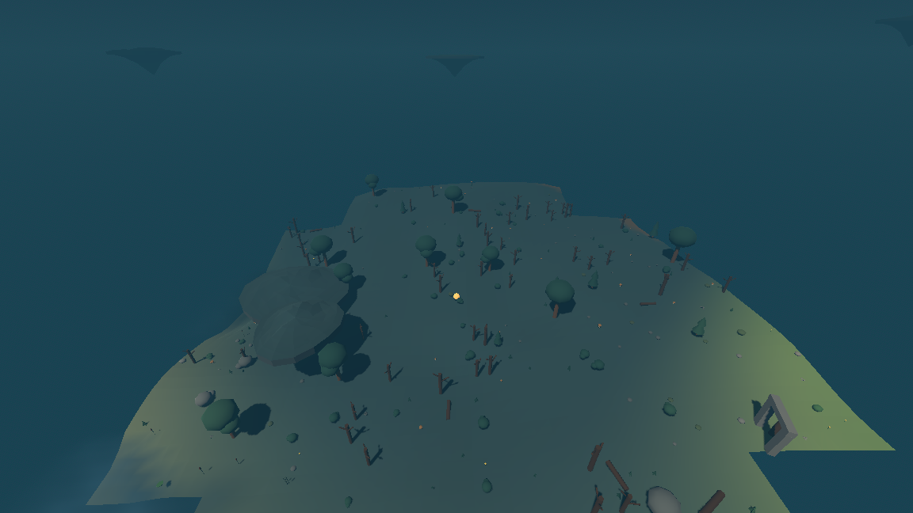

# Flora and prop scatter

The sixth layer of the generation stack dresses the world: trees, undergrowth,
waterside flora, loose stone, and a catalog of made props. It is what turns the
ground the first five layers built into somewhere that looks lived in.

Section 13 of the design listed "prop catalog and placement weights" as open.
This is that decision, with the reasoning, the numbers and what they measured
out to.

Everything here lives in `sim/scatter_catalog.gd` (the table),
`sim/decoration_scatter.gd` (the rule), `sim/scatter_patch.gd` (what one chunk
holds) and `sim/scatter_streamer.gd` (keeping it near whoever is walking). Not
one of them names a model, a file or an asset pack: every row names a **tag**,
and what a `canopy_tree` looks like is the render layer's table's business.

## The decision, in one sentence

The world is covered by two lattices of square cells; each cell hashes one roll
from its own coordinates and the world seed; that roll is compared against the
weights of everything the biome and the context there allow, and either lands
inside one of them or falls off the end and the cell stays empty.

Everything else on this page is what "the weights" and "the context" are, and
why.

## Why cells

A cell decides alone. It never looks at its neighbours, nothing accumulates
between cells, and no stream of random numbers is drawn from — a stream's
numbers depend on how many were drawn before them, which is exactly what makes
two chunks disagree about ground they share. The same argument the height field
already makes, made again one layer up.

Both cell sizes divide the chunk size (16 units) exactly, so every cell lies
inside one chunk and none straddles a border. A chunk's dressing is therefore
the same whether it was built first, built after its neighbours, or built again
after being dropped — and the same in another process. That is asserted three
ways in `tests/test_scatter.gd` and again from outside by running the headless
report twice as separate processes and comparing what each printed.

| lattice | cell | per chunk | what is on it |
| --- | --- | --- | --- |
| flora | 2.0 units | 64 | trees, undergrowth, waterside flora, loose stone |
| prop | 8.0 units | 4 | boulders, stone circles, and everything anyone made |

A lattice's cell size *is* the closest two of its things can ever stand, which
is the real reason there are two of them. Ferns at two units read as
undergrowth; boulders at two units would read as a rockslide.

## One roll decides both "anything" and "what"

Every row of the table carries a per-biome weight that is a **probability, not a
ratio**: 0.05 means "about one cell in twenty, in this biome, in this context".
At a position the weights are blended across the biomes there, multiplied by
whether the row's context is satisfied, and laid end to end along [0, 1). One
roll lands somewhere — inside a row's stretch and that row is placed, past the
end of the last one and the cell is empty.

Three things fall out of this, and all three are why it is done this way.

* **Weights read as densities.** No normalising step stands between the number
  in the table and what appears in the world, so retuning is direct.
* **Adding a row cannot move the rows before it.** A table can be extended
  without re-rolling ground that has already grown.
* **Most cells cost one hash.** The roll is taken *before* anything is asked
  about the ground. Nothing in the flora table adds up past 0.62, so a roll past
  that is thrown out without a single question about the world under it — about
  three cells in eight. The suite checks this bound from both sides: above the
  real maximum (or placements would be silently lost) and near it (or it would
  throw away nothing).

## The catalog

### Flora lattice — weights, per cell, per biome

| tag | kind | context | meadow | deep forest | highland | blossom | marsh |
| --- | --- | --- | --- | --- | --- | --- | --- |
| `fir` | tree | ground | 0.028 | 0.050 | 0.010 | 0.008 | 0.004 |
| `canopy_tree` | tree | ground | 0.004 | 0.072 | - | 0.006 | 0.005 |
| `blossom_tree` | tree | ground | 0.003 | 0.002 | - | 0.062 | - |
| `dead_tree` | tree | ground | - | 0.004 | 0.002 | - | 0.026 |
| `bush` | undergrowth | ground | 0.038 | 0.066 | 0.006 | 0.050 | 0.018 |
| `fern` | undergrowth | ground | 0.010 | 0.085 | - | 0.018 | 0.026 |
| `hardy_shrub` | undergrowth | ground | 0.006 | - | 0.062 | - | 0.005 |
| `flower` | undergrowth | ground | 0.070 | 0.010 | 0.008 | 0.080 | 0.005 |
| `mushroom` | undergrowth | ground | 0.004 | 0.046 | - | 0.006 | 0.018 |
| `petal_drift` | undergrowth | ground | - | - | - | 0.055 | - |
| `fallen_log` | undergrowth | ground | 0.002 | 0.018 | 0.002 | 0.004 | 0.008 |
| `reed` | waterside | wet | 0.090 | 0.080 | 0.050 | 0.080 | 0.160 |
| `cattail` | waterside | wet | 0.060 | 0.040 | 0.020 | 0.040 | 0.110 |
| `toadstool` | waterside | wet | 0.010 | 0.050 | 0.005 | 0.010 | 0.080 |
| `lily_pad` | waterside | water | 0.050 | 0.050 | 0.030 | 0.050 | 0.070 |
| `pebble` | rock | ground | 0.028 | 0.026 | 0.060 | 0.018 | 0.016 |
| `gravel` | rock | ground | 0.008 | 0.005 | 0.050 | 0.005 | 0.005 |

The shape of each biome's column is the whole point:

* **Deep forest** is carried by `canopy_tree` (0.072) and `fern` (0.085) — a
  closed canopy over a green floor, with mushrooms and fallen logs under it and
  almost no flowers, because a forest floor is dark.
* **Meadow** inverts it: flowers (0.070) and scattered `fir` (0.028), no canopy
  worth speaking of.
* **Highland** is mostly stone. `hardy_shrub` (0.062) is the only thing that
  grows well, `pebble` and `gravel` together (0.110) outweigh all of its flora
  put together, and the canopy does not grow there at all.
* **Blossom grove** is `blossom_tree` (0.062) and `petal_drift` (0.055) plus a
  meadow's flowers — pastel, soft, and it keeps its pink canopy whatever biome
  it borders.
* **Twilight marsh** grows little on its dry ground (`dead_tree` at 0.026 is its
  largest dry row) and a great deal on its wet ground.

**The waterside weights are much larger and mean something different by it.** A
bank is a thin ring of cells rather than a stretch of country — two units wide,
which on this lattice is about one cell. A weight that reads as thick cover on
open ground would put one reed on an entire lake shore. At these numbers two in
five bank cells of a marsh hold something and one in five of a forest's do,
which is what makes a shoreline read as a shoreline.

### Flora lattice — sizes, in world units of height

A dash means the row takes its base size in that biome.

| tag | base | meadow | deep forest | highland | blossom | marsh |
| --- | --- | --- | --- | --- | --- | --- |
| `fir` | 3.60-5.40 | - | 5.20-7.60 | 2.40-3.40 | 3.40-5.00 | 3.00-4.40 |
| `canopy_tree` | 6.50-8.50 | - | 8.50-12.50 | 5.00-6.50 | 7.00-9.00 | 6.00-8.00 |
| `blossom_tree` | 3.60-5.00 | - | - | - | 4.50-6.50 | - |
| `dead_tree` | 2.80-3.80 | - | - | - | - | 3.20-4.60 |
| `bush` | 0.70-1.20 | - | 1.00-1.70 | 0.50-0.80 | - | - |
| `fern` | 0.50-0.95 | - | 0.60-1.10 | - | - | - |
| `hardy_shrub` | 0.35-0.65 | - | - | - | - | - |
| `flower` | 0.35-0.55 | - | - | - | - | - |
| `mushroom` | 0.30-0.60 | - | 0.40-0.80 | - | - | - |
| `petal_drift` | 0.01-0.03 | - | - | - | - | - |
| `fallen_log` | 1.30-2.20 | - | - | - | - | - |
| `reed` | 1.10-1.80 | - | - | - | - | 1.30-2.10 |
| `cattail` | 1.30-1.90 | - | - | - | - | - |
| `toadstool` | 0.40-0.80 | - | - | - | - | 0.50-1.00 |
| `lily_pad` | 0.05-0.08 | - | - | - | - | - |
| `pebble` | 0.22-0.45 | - | - | 0.40-0.75 | - | - |
| `gravel` | 0.12-0.22 | - | - | - | - | - |

Size is stated in **world units**, not as a multiplier, because generation has
no idea what any of this looks like. The render layer divides by what the thing
is as drawn (`AssetLibrary.natural_height`) to get a scale, so a fir the
simulation wanted seven units tall is seven units tall whether it is currently a
placeholder trunk-and-cones or a bought model. A pack row declares its model's
height in the same one line the art drop already edits.

This table, not the tag list, is where "deep forest reads as tall canopy" lives.
The same `fir` is five to seven and a half units under canopy and a stunted two
and a half up on the tops; the same `canopy_tree` towers at twelve in the forest
and would be a six-unit runt on the moor if the moor grew any.

### Prop lattice — weights and sizes

| tag | kind | context | meadow | deep forest | highland | blossom | marsh |
| --- | --- | --- | --- | --- | --- | --- | --- |
| `boulder` | rock | ground | 0.050 | 0.045 | 0.240 | 0.030 | 0.030 |
| `rock_spire` | rock | ground | 0.006 | 0.004 | 0.070 | 0.002 | 0.004 |
| `stone_henge` | rock | clearing | 0.006 | - | 0.050 | - | - |
| `fence` | prop | pathside | 0.280 | 0.220 | 0.240 | 0.260 | 0.100 |
| `lantern_post` | prop | pathside | 0.040 | 0.040 | 0.030 | 0.040 | 0.060 |
| `cart` | prop | pathside | 0.030 | 0.025 | 0.020 | 0.030 | 0.010 |
| `crate` | prop | yard | 0.140 | 0.140 | 0.140 | 0.140 | 0.140 |
| `barrel` | prop | yard | 0.110 | 0.110 | 0.110 | 0.110 | 0.110 |
| `glowing_orb` | prop | wet | - | 0.010 | - | - | 0.140 |

| tag | base | highland |
| --- | --- | --- |
| `boulder` | 1.00-1.90 (0.90-1.70 in deep forest) | 2.20-4.40 |
| `rock_spire` | 2.40-3.60 | 3.20-5.50 |
| `stone_henge` | 3.20-4.20 | 3.60-5.00 |
| `fence` | 1.00-1.20 | - |
| `lantern_post` | 2.60-3.00 | - |
| `cart` | 1.00-1.15 | - |
| `crate` | 0.70-0.95 | - |
| `barrel` | 0.90-1.10 | - |
| `glowing_orb` | 1.10-1.80 | - |

"Highland reads as big boulders" is the same trick as the canopy, in the other
direction: a highland boulder is 2.2 to 4.4 units — taller than a cottage door —
against 0.9 to 1.7 in the woods, and highland is the only biome that grows them
often (0.240 against 0.045).

The made things are deliberately not tuned per biome except where the biome
changes the story: fences thin out in the marsh (0.100) because there is little
worth fencing in a bog, and lanterns thicken there (0.060) because it is dark.
Crates and barrels are the same everywhere, since a village is a village.

Four prop tags are **deliberately absent** from this table: `signpost`,
`market_stall`, `water_wheel` and `crafting_bench` belong to a village or a road
and are placed by the settlement and path layers, which know where a market
square is and where a road leaves town. A layer that scattered market stalls
across open country would be undoing their work.

## Context: what makes a prop read as intentional

Every question the layer asks about a cell is a question `TerrainQuery` already
answers for somebody else. Nothing is recomputed, so a fern cannot disagree with
the settlement layer about where a house is and a cattail cannot disagree with
the water field about where the water is.

**Three refusals apply to everything**, whatever it is:

| refusal | rule | why |
| --- | --- | --- |
| reserved ground | `is_reserved_at(x, z, 0.35)` | the contract the settlement layer wrote when it reserved its footprints: nothing grows through a floor |
| the cart track | nearest road centreline closer than 2.4 units | a track is a track because things do not grow in it |
| a cliff face | bed falling faster than 0.75 per unit | a tree there would hang out of the rock |

Then each row states what it needs:

| context | rule | what uses it |
| --- | --- | --- |
| `ground` | dry, thinned to 35% inside a village pad | everything that grows on land |
| `wet` | a bank, or water no deeper than 0.55 | reeds, cattails, toadstools, orbs |
| `water` | water 0.25 to 1.80 deep, placed on the surface | lily pads |
| `pathside` | 2.6 to 5.0 units from a road's centreline | fences, lantern posts, carts |
| `yard` | outside a footprint, within 4.5 units of one | crates, barrels |
| `clearing` | no road within 5, no village, nothing overhead, under 1.4 units of relief across a 6-unit ring | stone circles |

A few of these numbers are not free choices:

* **2.6 to 5.0 for a verge.** The roadway is 2.3 units wide and its carving eases
  out to 4.3, so the band starts just outside the wheel ruts. The far end is
  5.0 because that is exactly how far the road lookup lattice can answer for: a
  tile gathers the road segments within its own half-diagonal plus five units,
  so asking further would get an answer that depended on which tile the position
  fell in. `PathNetwork.SIDE_REACH` is that limit, written down.
* **0.35 of clearance around a footprint.** Enough that nothing grows through a
  wall it is merely touching.
* **35% flora inside a village.** Not none — a green with nothing on it looks
  swept — but thin enough that the village reads as inhabited. The thinning is
  visible in the village picture below as a clearing in the forest.
* **4.0 units above the water line** is not a placement rule but the guard in
  front of one. Asking whether a cell is a bank costs eight samples around it,
  and it is asked of ground that is almost never near water; a bank is where the
  bed meets the surface, so anything standing more than a river channel's depth
  above the water line cannot have water within reach and is refused without the
  eight samples.

`stone_henge` is the row the clearing context exists for, and it shows what
"gated by context" buys: the weight says highland grows one stone circle per
twenty prop cells, but the clearing rule means it is one per *level, roadless,
unoverhung* twenty — three of them in the 169-chunk survey below, all of them
standing alone on open moor.

## What it measures out to

From `./run_headless.sh --seed 1234 --ticks 0 --scatter`, which reports every
placement in a nine-by-nine square of chunks and then surveys 169 chunks spread
over about 1150 units of world. The full output is in
[scatter-survey-evidence.txt](scatter-survey-evidence.txt).

| biome | chunks | placed per chunk | trees | undergrowth | waterside | stone |
| --- | --- | --- | --- | --- | --- | --- |
| meadow | 37 | 13.1 | 85 | 285 | 9 | 102 |
| deep forest | 29 | 18.5 | 136 | 299 | 8 | 86 |
| highland | 59 | 13.7 | 93 | 316 | 25 | 371 |
| blossom grove | 28 | 17.9 | 125 | 321 | 2 | 53 |
| twilight marsh | 16 | 10.0 | 28 | 86 | 15 | 31 |

And the two distributions the layer is judged on, in world units:

| biome | tree min/median/max/mean | stone min/median/max/mean |
| --- | --- | --- |
| meadow | 2.96 / 4.68 / 8.53 / 4.89 | 0.12 / 0.38 / 4.31 / 0.57 |
| **deep forest** | 2.87 / **7.64** / 11.29 / **7.38** | 0.13 / 0.30 / 3.59 / 0.40 |
| **highland** | 2.49 / **4.02** / 8.61 / **4.57** | 0.12 / 0.45 / 5.36 / **0.82** |
| blossom grove | 3.12 / 5.21 / 10.29 / 5.81 | 0.12 / 0.31 / 2.01 / 0.44 |
| twilight marsh | 3.29 / 3.98 / 7.60 / 4.48 | 0.13 / 0.32 / 2.14 / 0.46 |

A deep-forest tree runs 1.9 times a highland one at the median; highland stone
averages 2.1 times deep forest's and its biggest is 5.36 units against 3.59.
Both gaps are asserted in the suite on the measured placements rather than on
the table they came from, so a retune that broke the intent would fail the
build.

The medians are lower than the table's ranges suggest, and that is the biome
blending working: a chunk whose middle is deep forest is still part meadow near
its border, and what grows there is sized by the blend rather than by the label.

Neither biome is measured against the tuning knob it was tuned with. The biome
profile already carries a `foliage_density` — 0.95 in deep forest down to 0.18
in highland — and nothing forces the scatter table to agree with it. The suite
checks that it does: the biomes in order of how much flora the table actually
grows have to be the biomes in order of the density their profile advertises.

| biome | flora weight | profile's foliage density |
| --- | --- | --- |
| deep forest | 0.573 | 0.95 |
| twilight marsh | 0.535 | 0.70 |
| blossom grove | 0.469 | 0.60 |
| meadow | 0.375 | 0.45 |
| highland | 0.195 | 0.18 |

## Two dressed biomes and a dressed village

Deep forest and highland, the two the task names, the same seed a few hundred
units apart. Closed canopy down to the waterline against bare windswept moor
with boulders on it:

The twilight marsh, which is neither: dead trees, low dark flora, a drifting
glowing orb, and a stone circle standing out on the light ground at the right.

And the spawn village, dressed and standing in a forest that stops at its rim —
the 35% thinning of the pad, seen from outside:

## What it costs

About 7 ms to dress a chunk once the ground under it has been meshed, against
about 9 ms to mesh it — the layer asks the same fields the mesher just warmed,
so what it costs in a real run is roughly a fifth on top of building a chunk. Of
that, the three cheap answers every cell needs (which biomes, where the bed is,
whether there is water) are taken up front and everything else is asked only if
a row wants it and remembered once it has been: most cells never need to know
how far the nearest road is, whether they are a bank, or even what height the
finished ground is.

The order matters as much as the laziness. Three cells in eight of the flora
lattice never ask the world anything at all, because the roll that decides
whether they hold anything is taken first.

## What is still open

* **Islands are not dressed.** The scatter lattice runs over the ground plane;
  an aerial island's own surface grows nothing yet. It should — the design calls
  them small floating dioramas — and doing it means giving the lattice a storey,
  not a new rule.
* **Ground-cover grass is somebody else's job.** `grass` is in the tag catalog
  and deliberately not in this table: it is the GPU-instanced wind grass layer,
  which needs a per-chunk instance buffer rather than one placement per cell.
* **Clustering.** Every cell is independent, so the world is evenly speckled at
  the scale of the lattice. Real woods come in stands and real boulders come in
  fields. A cheap fix is a slow noise field multiplying the weights, which would
  keep the layer's purity — it is still a function of position and seed — and is
  the obvious next tuning pass.
* **No prop faces anything.** A crate takes its cell's roll for a facing rather
  than turning to the wall it is stacked against; only the roadside props line up
  with anything (their road). Facing a yard prop at its building is a few lines
  and was left until the yards themselves had been seen in the world.
