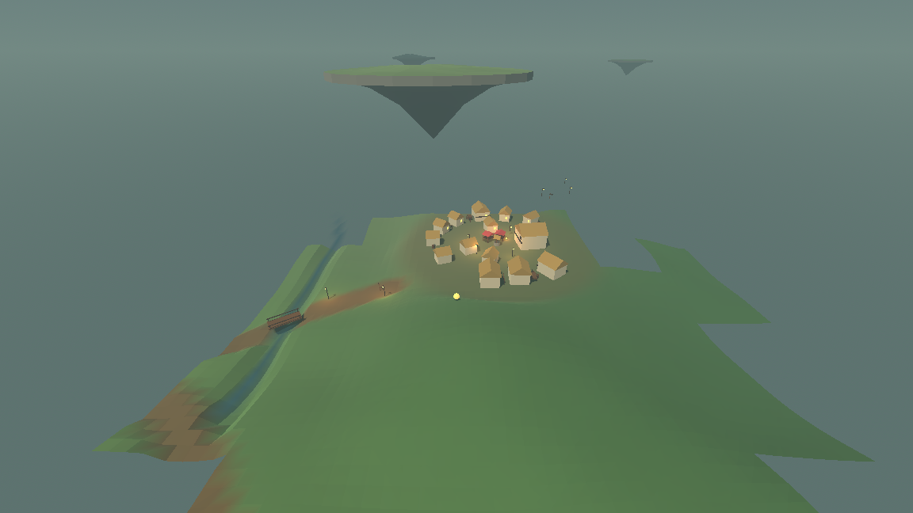

# Villages and the road network that joins them

The fifth layer of the generation stack, over the ground's height, the biomes,
the water and the floating islands. It picks the sites villages stand on, levels
the ground under them, lays out a cluster of buildings and dresses it with props;
then it strings a graph of roads between the villages and the landmarks around
them, carves those roads into the heightfield, and puts a bridge wherever a road
has to cross water.

Section 13 of the design leaves the **settlement placement rule** open — density,
biome gating and spacing from spawn. This document is that decision and its
reasoning. Everything else the layer does follows from it.

---

## The decision

> A village stands at most **one per 260-unit cell**, and **72%** of cells want
> one before anything else has a say. That wish is then compared against a
> threshold **scaled by the biome** under the candidate — a meadow keeps almost
> every wish, a twilight marsh keeps none — and the ground has to agree: dry
> across the whole pad, level enough to cut without a bank, and with no floating
> island overhead. **18%** of cells end up with a village, which is one every
> **610 units** of walking.
>
> The cell holding the world origin always wants one, and its candidates go on a
> **62–104 unit ring around the origin** rather than anywhere in its cell. So
> the world always starts a short walk from a village and never inside one.
>
> And a village **looks for a shore first**. Where a cell holds standing water
> with level, unroofed ground beside it, the village is re-sited to the water's
> edge instead of wherever the dry rule would have put it — about **one village
> in six**. It re-sites and never creates, so the density above is unchanged.

Measured over six seeds and 1734 cells — a 2000×2000-unit square per seed:

| quantity | measured |
|---|---|
| cells wanting a village | 71.6% |
| of those, surviving the biome and ground gates | 25.5% |
| cells holding a village | 18.2% |
| villages per million units² | 2.70 |
| mean spacing between villages | 609 units |
| buildings per village | 15.3 |
| props per village | 20.9 |
| roads leaving a village | 2.11 |
| roads carrying at least one bridge | 11.7% |
| landmark cells holding a landmark | 50.8%, one every 168 units |

Biome split of the 316 villages placed:

| meadow | deep forest | highland | blossom grove | twilight marsh |
|---|---|---|---|---|
| 50% | 22% | 14% | 14% | **0%** |

And the levelling, measured over the same villages on a grid the placement rule
never sampled — how much the ground rises and falls across the part of the pad
that is cut level:

| | min | median | max |
|---|---|---|---|
| before the layer (the water field's own bed) | 2.00 | 4.42 | 5.67 |
| after it | 0.000 | 0.000 | 0.333 |

Every number above comes from the same field the game reads, gathered with:

```
./run_headless.sh --seed 1234 --ticks 1 --settlements
```


*Seed 1234, the starting village at (−88.8, 4.7) in deep forest, seen from
(−126, 56) with the world held still. The dirt track runs from the bottom of the
frame, crosses the stream on a wooden bridge, and carries on to the village on
the ridge; two lantern posts stand at the roadside where it leaves the village,
and the campfire on the green is the warm point in the middle of the houses. The
carved track stops at the bank on either side of the water — a road never cuts a
river's bed — and the bridge tag spans the gap with its deck just above the
surface. Above, two floating islands from the layer below.*



*The village itself, from (−100, 34). Fifteen buildings stand in two rings round
a well and a campfire on ground that has been cut level — the pale disc they sit
on is the pad, and the land falls away outside it. Every building is turned to
face the green, and the gaps in the rings are the slots the spacing rule
refused.*

---

## Why density is a lattice and not a probability per unit area

Scattering villages by a per-position probability is the obvious rule and the
wrong one: two villages can land on top of each other, and the only way to stop
that is to look at what is already there, which an infinite world sampled per
position cannot do. A lattice with at most one village per cell gets the
guarantee for free. Two villages in neighbouring cells are at least half a cell
apart — 130 units — because each is jittered into the middle half of its own
cell, and a village's levelled ground is at most 36 units in radius. They can
never grow into one another, whatever the seed.

That fixes the *ceiling* on density at one per cell. The cell size is then the
whole of the density decision, and 260 units was chosen against how long a walk
between villages should be rather than against any picture: the observer covers
0.9 units per tick, so 610 units of spacing is about eleven minutes of walking at
twenty ticks per second. Villages are the warm-light social hubs of §9.6 and the
territory hubs of §6 — frequent enough to be the landmarks of a region, rare
enough that arriving at one is an event.

## Why the biome gate is one roll with a moving threshold

The gate could be a second roll: decide the cell wants a village, then roll again
against the biome's willingness. It is not, and the difference matters. Each cell
makes **one** hashed roll, and the biome scales the threshold that roll is
compared against:

```
wants a village  ⟺  roll < SITE_CHANCE × BIOME_SHARE[biome under the candidate]
```

With a second roll, retuning a biome's share would reshuffle which cells hold
villages everywhere, because the second roll's stream would move. With one roll
and a moving threshold, raising a biome's share can only *add* villages in that
biome and can never move one that was already there. The shares:

| biome | share | why |
|---|---|---|
| meadow | 1.00 | open, level, bright: the design's spawn biome and where people live |
| blossom grove | 0.85 | as gentle as meadow, and the pastel village is worth having |
| deep forest | 0.45 | a clearing in the canopy is a village; the canopy is not |
| highland | 0.28 | windswept and rocky — a hard place to settle, not an impossible one |
| twilight marsh | 0.00 | the eerie pocket. A market square would spend the mood for nothing |

The measured split — meadow 50%, deep forest 22%, highland 14%, blossom grove
14%, marsh 0% — is not those shares, because the ground gets a veto afterwards
and it falls hardest on the highland. Blossom grove ends level with highland
despite three times the share, because blossom groves are rarer country than
highlands are. The marsh column is the one number that is exactly the rule: a
share of zero is a refusal, not a discouragement.

## Why the ground gets a veto, and what it vetoes

A site is refused unless three things hold across its pad.

**It is dry.** Not just the middle: the whole pad and a three-unit ring outside
it. A village with a river through the market square would be a bug that only
showed up as a house standing in water.

**It is level enough to cut.** The pad is levelled to the average height over its
own core, so the earthwork at the core's edge is at most half the relief that was
there. The limit is 5.6 units of relief across a core 22 to 27 units in radius,
which leaves at most 2.8 units of cut or fill, eased out over the eight to nine
units of ramp between the core and the pad's rim — a slope of about one in three
at worst, which reads as a terrace rather than as a plinth. This is by far the
most expensive gate: it is most of the reason 72% of cells wanting a village
becomes 18% of cells having one, and the measured "before" column in the table
above — a median of 4.42 units of relief across the cores that were accepted —
is the shape of that limit biting.

**Nothing hangs over it.** A floating island's plate resting on the rooftops
would look like a mistake, and the two layers have no business overlapping. This
one is a matter of composition rather than of correctness — the composed ground
refuses to move anything under an island in any case, so the worst an unchecked
overlap could do is leave two houses on unlevelled ground.

Each cell gets five goes at finding a site inside itself before it is given up
on, which is what turns "this cell wants a village" into "this cell has one"
often enough for the ceiling to mean anything.

### The overhead question is asked of the hashes first

"Nothing hangs over it" is the only question this layer asks the layer above it,
and it was by a wide margin the layer's largest bill. It is asked twice, once per
walkable aerial storey, because an upper island stands off to one side of the
lower one it laps over and so has to be asked about itself rather than guessed at
from the plate below. Asking it that way is what makes the veto correct. It is
also what made it expensive: building one island samples the ground about a
hundred and fifty times, and building an upper one builds the lower one under it
first, so the second question roughly doubled the price of the first.

The way out is that the island layer already knows something for nothing. Where a
cell's island *would* stand, and how far its outline *could* reach, both fall out
of a handful of hashes of the cell, the band and the seed — no ground is read and
no island is built. That knowledge is now public as `IslandField.could_reach`,
and it is a **bound rather than an answer**: `false` is certain — nothing of that
band is within a pad's radius of here, and building the islands to check could
not find one — while `true` means only that the hashes cannot rule one out. The
ground may still refuse to hang the island, a neighbouring cell may stand it
down, or its real outline may fall short of what its radius allows. So the veto
asks the bound first, per band, and pays the real price only where the bound
cannot say no. Over the 484 positions per band that `tests/test_islands.gd`
sweeps, the bound rules the upper storey out on **65%** of them and the lower
storey on **43%** — 523 of the 968 asks in all.

Because a bound may only ever be wrong in the harmless direction, the veto's
answer is unchanged, and that is checked rather than argued:
`tests/test_islands.gd` runs the bound and the real scan side by side on a grid of
968 positions across four seeds and both storeys and requires that the bound never
says no where the scan finds an island, while
`tests/test_settlements.gd._an_upper_storey_can_no_longer_overhang_a_village`
still finds its five overhanging spots and still requires the layer to refuse
every one of them.

**What it recovers.** All of it, and then some. Every row below is
`tests/bench_settlements.gd` over seeds 1234/7/3/19/42/101. The two right-hand
columns are the same tree with the bound taken out and put back, two runs each, so
they differ by the gate and nothing else; the italic pair in a cell is those two
runs. The left column is the recording made when the veto was corrected, kept for
continuity — it is a different tree, taken before the shore rule existed, so only
the first row is strictly comparable across all three columns, because the bench
times all three forms of the question itself on one run of identical code.

| | padded lower band | both storeys | both storeys, bound first |
|---|---|---|---|
| overhead question, cold field, ms per ask | 97.3 *(94.5 / 94.0)* | 131.3 *(125.7 / 126.0)* | **67.3 / 67.5** |
| one settlement cell, cold, ms | 35.8 | 49.0 *(49.3 / 49.2)* | **21.8 / 22.3** |
| one settlement cell, warm, ms | 19.2 | 26.6 *(31.8 / 31.9)* | **22.5 / 22.5** |
| headless, 100 ticks, seed 1234, s | 7.16 | 7.78 *(7.76 / 7.76)* | **6.83 / 6.83** |
| whole suite, 18 suites, 161,870 checks | 6m59s | 8m17s *(10m42s)* | **8m44s** |
| villages over 6 seeds × 25 cells | 21 | 27 | **27** |

The question itself is **46% cheaper** than the correct-but-ungated form and
**28% cheaper than the padded proxy it replaced**, so the correction is no longer
being paid for at all. A cold settlement cell is **55%** cheaper and lands well
under the padded rule's 35.8 ms. A headless walk of 100 ticks is **12%** cheaper,
below its 7.16 s padded recording. The warm row is the one that does not beat its
padded recording, and the reason is not this change: the 19.2 and 26.6 figures
predate the shore rule, which added about a quarter to a warm cell on its own —
against the same tree measured now, 31.9 → 22.5 ms is a **29%** cut.

The whole suite went **10m42s → 8m44s** on the same tree, an **18%** cut, over the
identical 161,870 checks. (The 6m59s and 8m17s recorded when the veto was
corrected are not comparable as absolute times: the suite has grown from 14 suites
and 130,815 checks to 18 and 161,870 since.)

Nothing about the world moved. Ten headless walks — seeds 1234, 7, 3, 19, 42 and
101 at 100 ticks, seed 7 at 50, seed 101 from (276, 214), and seeds 1234 and 101
at 600 ticks — fingerprint byte-identically with and without the bound, and the
bench prints each village's digest so the two runs can be diffed village by
village: the same 27 villages, in the same cells, at the same positions, with the
same buildings. The raw recordings behind every number above are in
[`reports/island-overhead-cost-evidence.md`](island-overhead-cost-evidence.md).

**And then the same bound went one level down.** The gate above is asked of a
whole band, so it skips a storey only when nothing in the scan could reach. The
island layer now asks the identical question of each *cell* inside the shared
scan, and builds a cell only where the hashes cannot rule it out — which is the
same set of islands, for the reasons in
[`reports/islands.md`](islands.md). The overhead question scans 98 cells, two
storeys of 49; it used to build 36.75 of them and now builds 0.90. On the tree as
it stands, with that per-cell gate taken out and put back:

| | every cell built | gated per cell |
|---|---|---|
| overhead question, cold field, ms per ask | 66.8 | **3.36** |
| islands built per ask | 36.75 of 98 | **0.90 of 98** |
| one settlement cell, cold, ms | 21.7 | **6.41** |
| one settlement cell, warm, ms | 21.3 | **7.28** |
| headless, 100 ticks, seed 1234, s | 7.48 | **6.45** |
| whole suite, 18 suites, 169,814 checks | 9m00s | **6m20s** |
| villages over 6 seeds × 25 cells | 25 | **25, same digests** |

The village count is 25 here rather than the 27 in the table above because the
tree has moved on — the island basin and its water level were reworked in
between, which moves ground and therefore sites. It is not this change: the two
columns above are one tree, and their village digests diff empty. The recordings
are in [`reports/island-cell-gate-evidence.md`](island-cell-gate-evidence.md).

## Why the starting village is measured from the origin

Every other village is jittered into its own cell. The starting village is placed
on a ring around the world origin instead, because it is the one village whose
position is about the *player* rather than about the map. Two things have to be
true at once: you must not open your eyes inside it, and you must be able to find
it on your first walk. A ring of 62 to 104 units does both — the village is 24 to
70 units outside its own pad, a walk of a minute or two, and it is in a hashed
direction so which way you set off is still a choice.

This is also why the settlement lattice is **centred on the origin** rather than
cornered on it: cell (0, 0) spans 130 units either side of the origin, so the
starting village, wherever on its ring it lands, is still inside the cell that
owns it. Without that, "look in the cells near you" would stop being a complete
answer to "what villages are near me", and the whole layer's locality would go
with it.

One more thing is relaxed for the starting village and nothing else. If no
bearing on the ring will take a village of the full size, it sweeps the ring
again at 76% of the size, and again at 58%. The world always starting within a
walk of a village is a property worth having outright rather than nine times in
ten, and a hamlet of six houses where the country is broken is a better answer
than nothing. Over seeds 1 to 24, every world has a starting village, at a mean
distance of 92 units; five of those are hamlets from the shrunken sweeps.

## Villages that want a shore

Everything above sites a village on dry ground and then refuses it if water comes
anywhere near. That is a sound rule and it is exactly why every village in this
world stood tens of units back from the nearest water: the dry ring outside the
rim is checked in twenty directions, so a pad is pushed away from a pond until the
whole of it and a margin is clear. The enumeration is in
reports/shore-survey-evidence.txt. On seed 1234, over a 2200-unit square, the
nearest water to any of the eighteen villages was 6.07 units from the nearest
pad's rim, and none had water touching a pad at all; the starting village's
nearest water was 46 units from its middle, which is the number
reports/atmosphere.md quoted when it recorded that section 9.1's third reference
beat — amber windows and hanging lanterns mirrored in still water — had no subject
anywhere in this world.

So a village now looks for a shore before it settles for dry country, under a
different reading of the same rules.

**What is relaxed, and what is not.** The *levelled core* — the only ground a
building may stand on — must still be dry, by the same scan every village gets,
and it must have a three-unit ring of dry ground round it as well. The *outer
ramp*, between the core and the rim, may be wet. That is the part of the pad that
eases back into the land rather than the part that is cut level, and TerrainQuery
never moves ground that is under water, so a pond lapping into the ramp stays
exactly the pond the water field put there. Nothing else is relaxed: a shore
village is levelled to the same limit, reserves its footprints the same way, and
is refused under a floating island by the same veto.

**It has to be a pond, not a river.** The water the site is chosen for must be
*standing* water — level with the water table — because the beat this serves is a
reflection, and a river running in a gully two units below its banks reflects the
sky rather than the village. Standing or running is not a new fact anyone has to
work out: the water layer's surface is whichever of the table and the river's
falling level stands higher, so which one it is here is which of the two won.

**It re-sites a village; it never creates one.** The dry-ground rule runs first
and the shore rule only replaces what it produced. A cell with a pond in it but no
dry, level, unroofed ground anywhere had no village before this rule and has none
after it. Measured over six seeds and 150 cells, the layer places 27 villages with
the rule and 27 without — the density this document states is untouched, and the
only thing this rule can do to a world is move a village that was already in it to
the water's edge.

**How a site is found.** Three steps, and a cell can give up at each. A grid of
144 probes over the cell looks for standing water at all, and up to two stretches
at least 60 units apart are followed up. From each, the search walks *out of the
water* along a bearing until it reaches the edge — a lake is wide, and a pad a
core's width from the middle of one is still in it, so standing back from the
middle refuses every bearing. From that edge the pad is stood back by its own core
plus five units, and the candidate is kept only if it lands in the middle half of
its own cell, which is the band that keeps two neighbouring villages half a cell
apart and is not this rule's to spend. Twenty-four bearings are tried per stretch,
stepped by the golden angle.

**And it is allowed to be a hamlet.** The relief limit is what decides how many
shore villages there are. The ground beside a pond is the rim of a basin, and
across a full-size levelled core — forty-seven units of it — it rises and falls
more than a village may cut; a full-size shore candidate passes about one time in
twelve. So the sweep repeats at 84%, 70% and 58% of the size, the same licence the
starting village has and for the same reason.

**Every village looks, rather than a rolled share of them.** A share was tried
first and is the wrong shape for the idea. Half a share of villages sitting twenty
to forty units back from their own pond does not read as "these people did not want
to live by the water" — it reads as the dry rule having shoved them off the shore,
which is exactly what it does. So the preference is not rolled; the ground decides,
and it grants a shore to about one village in six.

**Measured.** Over eight seeds and 119 villages, 20 of them — 16.8% — are sited by
the shore rule, and tests/test_settlements.gd holds that share to a stated 8%–30%
band so that a change which quietly stops making shore villages, or turns every
village into one, fails rather than passes. On seed 1234's 2200-unit square the
same eighteen villages are placed as before, three of them moved to a shore, and
the nearest water to a pad rim goes from 6.07 units to zero:

| | before | after |
| --- | ---: | ---: |
| villages in the square | 18 | 18 |
| sited by the shore rule | 0 | 3 (16.7%) |
| water touching a pad | 0 | 2 (11.1%) |
| nearest water to a rim, closest | 6.07 | 0.00 |
| nearest water to a rim, median | 33.54 | 27.02 |
| nearest water to a rim, mean | 37.95 | 31.75 |

**One footprint check came with it.** The pad scan samples the core on rings a few
units apart, which is enough to refuse a site with water in it and not enough to
promise that no corner of any rectangle is wet. So the layout now tests each
building's own middle and four corners against the water field and drops any that
is wet. It refuses nothing on the dry sites the layer used to place — the 27
villages of the bench are the same 27 — and it is what makes "no building stands
in water" true of a shore village by construction rather than by sampling luck.

**What it costs.** Asking every village whether it could stand on a shore is
about a quarter more work in the settlement layer: 26.6 → 33.8 microseconds per
settlement cell warm, and 49.0 → 52.2 cold, measured with
`tests/bench_settlements.gd` with the shore pass disabled and enabled. A
settlement cell is 260 units across and a village is at most one per cell, so a
walking observer crosses one rarely and nothing else in the stack asks this layer
anything per sample.

**Where the world's fingerprint moved, and why.** Seed 1234 over 100 ticks used
to fingerprint `d43c66e5293d8e29`; it now fingerprints `020507a9a1d52a1e`, and
the whole of that difference is one new field. The world digest folds in every
loaded village's own digest, and a village's digest now carries `shore=0` or
`shore=1` so that a village which moved to a shore cannot slip past the
determinism checks. Removing just that field and leaving the siting rule in
place, the same walk fingerprints `d43c66e5293d8e29` exactly — so no village near
the observer's path on seed 1234 moved at all. Disabling the rule entirely gives
the same three values on seeds 1234, 7 and 3, which says the same thing from the
other side. What did move is in the table above: three of the eighteen villages
in seed 1234's 2200-unit square, none of them near the origin, all of them to the
edge of a pond. Both fingerprints reproduce byte-identically across separate
processes.

**The starting village is left out of it.** It is the one village placed relative
to the origin rather than to its cell, and what its ring rule promises — never
underfoot, never more than a short walk — is a different promise from this one.
Letting the two rules argue over the same village would weaken both.

---

---

## What the layer does to the world

### The pad

The ground under a village is levelled to the average height over its core, in
full out to `core_radius` and easing back to the untouched land by `radius`. The
average rather than a chosen height, so a village sits *in* the land rather than
on a plinth cut into it; and eased out rather than stepped, so it has no shelf
around it. Measured after the fact on a grid the placement rule never sampled,
the relief across the levelled core is a median of 0.000 and a worst case of
0.333 units, against a median of 4.42 before.

Every building stands inside the levelled part. The layout keeps a 5.9-unit inset
from the core's edge, which is the largest building's half-diagonal plus its
radial jitter, so no house has one corner on the ramp.

### The buildings

A building is a rectangle of reserved ground with a facing, and nothing else —
§9.6 puts interiors and procedural footprints out of scope, so buildings are
whole placed units named by tag. `AssetTags.HOUSE` is a house; what a house looks
like is one row in the render layer's table, which is the only file in the
project allowed to name a model.

The layout is a green with one or two rings of buildings round it:

* the **well** and the **campfire** in the middle, with market stalls and lantern
  posts on the green;
* one or two **rings** of slots, placed between the green and the inside of the
  levelled rim rather than at fixed distances, so a small village is a tight
  cluster and a large one has room for a second row;
* a slot every 8 units of arc, so the outer ring holds more buildings than the
  inner one without anyone deciding a count, and a second ring only where the
  two would stand 7.5 units apart — enough that a tavern on the inner ring does
  not reach the outer one;
* the named buildings first — a tavern if the village is big enough, a workshop,
  a tower three times in ten — then houses and cottages.

Two rules decide what actually gets built.

**Orientation: every building faces the green**, give or take 0.22 radians of
slack so the ring does not look surveyed. A building's local +Z is its front,
which is the same convention the render layer's placeholders are drawn in, so
"face the green" is one `atan2` and no special case.

**Spacing: a candidate whose footprint, widened by 1.5 units, touches one already
placed is dropped** and its slot stays empty. The test is the separating-axis
theorem on two oriented rectangles — exact, not a bounding circle. That matters:
the buildings are turned to face the green, and a circle around a long tavern
would refuse most of its ring. Dropping rather than nudging is what gives a
village its gaps; a village where every slot is filled reads as a housing estate.

The footprints are generation's numbers, not the art's — they say how much room a
building of this kind takes up, and the model the tag resolves to has to fit
inside them. They are set a little larger than the current placeholders so an
installed pack has somewhere to go.

### The lit windows

Every building except the well carries one or two `window_glow` — a catalog tag
that was in the catalog with nothing placing it, and the settlement layer's whole
part in the art direction's "warm pinpoints against cool ambient" signature.
Villages had this while the buildings were coloured primitives, because each
placeholder had an emissive amber pane modelled into it; installing the asset
packs took it away, because the pack buildings have windows drawn but not lit.

A window goes on the **front** face — the one the layout already turned towards
the green, so a village seen from its middle is all lit windows — and a building
with at least 7 square units of reserved ground (half its width times half its
depth: a house, a workshop, a tavern) gets a second on one of its two gable ends,
so a big building is lit from more than one angle. Where along the face it sits
is a roll off the village's own seed that reaches at most 45% of the way out to a
corner, so a window is never in one. That comes to **20.6 lit windows per village**
over 39 villages, against 5 lantern posts and 1 campfire — so a village now adds
about 21 point lights where it used to add 6, and the streaming radius never
holds more than two villages at once. `reports/window-glow.md` prices that.

Nothing here has seen a model, and it cannot: the reserved rectangle and the way
it is turned is everything this file knows about a building. That is enough to
say *which wall* and *where along it*, which is the whole of the decision. How
high the pane is, how big, how warm and how far its light reaches all stay in the
render layer, exactly as they already did for a lantern post — and so does one
more thing, because a reserved rectangle is deliberately roomier than whatever
ends up standing in it. On the installed models that slack runs from 0.43 to 3.8
world units depending on the tag and the face, so the asset table, which is the
only thing that has seen the model, slides the pane from the reserved facade onto
the wall the model really has there before drawing it. `reports/window-glow.md`
is that half of the story.

### The reservation

`TerrainQuery.building_at(x, z)` returns the building standing on a position, or
an empty dictionary; `is_reserved_at(x, z)` is the same question as a yes or no.
This is the contract with the scatter layer that comes next: it asks before it
puts a fern down, and a fern never grows through a floor. The margin argument
widens every footprint at once, which is how a caller asks for "inside a building
or right up against one".

### The roads

The world is infinite, so "connect the settlements" cannot mean a spanning tree —
there is no set to span. What is needed is a rule two places can apply *locally*
and always agree on, so the same road appears whichever end of it you are
standing at.

The rule is the **relative neighbourhood graph**: two places a distance *d* apart
are joined exactly when no third place is closer than *d* to both of them — when
the lens-shaped region between them is empty. It is local, because that lens sits
inside the circle of radius *d* around either end, so both ends can check it by
looking only at their own neighbourhood; and it is symmetric, because they are
checking the same region. It also produces the right-looking network: it keeps
the short hops, drops the long side of a triangle whose other two sides go via a
place in the middle, and does not cross itself the way a nearest-neighbour rule
does. Every road belongs to whichever of its two ends sorts first by name, so
gathering the roads near somewhere never produces one twice.

The places joined are villages **and landmarks** — a stone circle in the
highland, a signpost in the meadow, a campfire in a forest clearing, a glowing
orb in the marsh. Landmarks sit on their own finer lattice, one every 168 units,
and they are what keeps the network joined up across the 610 units between
villages: without them a village would often have no neighbour inside the 170-unit
linking radius and no road at all. They are places, not settlements — nothing is
levelled and nothing is reserved.

A road runs between the two places' **edges**, not their middles. A village's own
ground is already trodden flat and coloured for it, and a road carved on through
the green would cut a trench across the market square and drop the well to the
bottom of it.

### Carving

Along a road the ground is levelled **across** the roadway and dropped 0.30 units
below the land it replaced, and the ground colour is mixed 80% of the way to bare
earth. Levelling across rather than along is what a worn cart track is: level from
verge to verge, and still climbing the hill it is crossing.

The height the roadway takes is the height of the **nearest road's** centreline
and of nothing else, and the levelling fades out where a second road's carving
reaches the same ground. On a lone road that is all there is to it: both verges
project to the same place on the same centreline, so the track is level from verge
to verge however steep the hill it crosses. Where roads converge on a place they
both end at, no single centreline is the one that ground is level with, so the
levelling stands off and the fork keeps the land's own shape under the trough.
This used to be a share-weighted average of every centreline within reach, which
on a mountain shoulder blended two heights into a roadway that was out of level
and, four times on seed 1234, unwalkable; see `reports/roads.md`.

The roadway is 4.6 units wide with a 2-unit shoulder either side. Both numbers are
set against the ground the road is drawn on rather than against a cart: the
terrain is meshed on a two-unit grid and a road reaches it as a colour on those
corners, so a narrower track would fall between them and show as a dotted line,
and a narrower shoulder would turn every edge into a staircase of whole cells.

### Bridges

Where a road's line crosses water, the carving stops — a road never cuts a river's
bed — and a bridge tag is placed over the crossing instead. The line is walked end
to end at one-unit steps and every stretch that is wet becomes a crossing; a
crossing shorter than 2.5 units is a puddle the carving's own clamp keeps dry.
Wide crossings get `bridge_stone` and narrow ones `bridge_wood`, because a long
span in timber reads as a jetty.

A crossing wider than one deck is spanned by several laid end to end rather than
by one stretched tag, because a bridge tag is a *thing* — a span of planking, a
stone arch — and the pack that eventually answers for it will have been drawn at
one size. The exact unit length rides on each span, so whoever draws it can close
the last few centimetres. About one road in eight carries a bridge.

---

## The one invariant the layer must not break

**Settlements never create or destroy water.** Whether a position is water is the
water field's answer alone, and this layer must not be able to contradict it. So:

* a village is refused a wet site, and a road's carving stops at the bank;
* dry ground that this layer moves is clamped to stay above the local water
  surface, so a lane along a bank cannot dip under the water line and put a
  puddle in the middle of itself;
* nothing under a floating island is moved at all, because an island's landing
  step was measured against the ground below its rim and moving that ground
  afterwards could put the island out of reach.

The test suite asserts all three over a 3600-point grid: the composed query and a
bare water field agree everywhere about what is wet, the bed under water is never
moved, and every dry sample stays above its own water surface — while at least
fifty samples in the grid *were* moved, so the check is not passing on a layer
that did nothing.

---

## What is checked automatically

`tests/test_settlements.gd` — 11 646 checks, in `./run_tests.sh`:

* **A village is a fact about a cell and a seed.** The same cells asked from a
  fresh stack, in reversed order, on a field already asked three hundred
  unrelated questions, and through a world that walked there — all identical. A
  different seed is different.
* **A village straddling a chunk border is the same either way round.** The
  suite finds a village whose levelled ground reaches into two neighbouring
  chunks and meshes those chunks in both orders on two independent stacks; the
  chunk fingerprints and the village match. It also walks two worlds into the
  same village from opposite sides and compares what they loaded.
* **No two buildings overlap**, by the separating-axis test on every pair, and
  none is closer than the spacing rule allows. Every building stands inside the
  levelled ground and faces the green.
* **The ground is levelled and the footprints are reserved.** Relief across the
  core collapses; the middle sits at the village's own pad height; the land six
  units outside the pad is untouched; points inside every building are reserved
  and name the right building; points on the green and outside the village are
  not.
* **Roads are agreed on from both ends**, are the same on a fresh stack, and are
  never longer than the linking radius.
* **A road is a levelled dirt track**: below the ground it replaced by about the
  depth it is meant to be, level across its width to within the depth of its own
  trough, tilting less than a third as much across itself as the untouched land
  does, and coloured at least halfway to bare earth.
* **A bridge stands wherever a road crosses water**, over water, with its deck
  above the surface, and with the river bed under it uncarved.
* **Everything placed names a catalog tag** in the right category — buildings in
  buildings, bridges in bridges.
* **A stated share of villages stand on a shore**, over eight seeds and 119
  villages, and the share is held to an 8%–30% band rather than merely reported.
* **A shore village pays nothing for its pond.** Every one of them is checked on
  its own, so a failure names the shore rule rather than hiding in a sample that
  is nine parts inland village: there really is standing water in the band beside
  it, no building's middle or corner is in water, every building reserves the
  ground it stands on, the band of dry ground outside the levelled core is dry all
  the way round, the core is levelled to the height the village claims, nothing
  hangs over it, and it is never the starting village. The whole-layer checks —
  no two buildings overlap, every building is on the levelled ground, every
  building faces the green — are then run again over the shore villages alone.
* **The water invariant**, as above.

`tests/test_window_glow.gd` — 12 416 checks, in `./run_tests.sh`:

* **Every building but the well lights a window**, each one naming `window_glow`,
  belonging to a real building of its own village, standing exactly on one of
  that building's four faces and no further than 45% of the way out to a corner.
* **The windows are a fact about the seed**: the same cells asked twice light the
  same windows, and moving one changes the village's fingerprint — so a village
  whose windows moved could not slip past the determinism checks.
* **Every window lands on a wall of the installed model.** 300 distinct
  placements — every catalog building tag, on all three faces a window may go on,
  right across each face — are checked against the model's own triangles: every
  corner of the pane is within 0.25 of the model's surface (worst measured
  0.201), and a ray coming in along the wall's own normal reaches the pane
  without hitting the model first, which is "not buried in the mesh" asked
  exactly rather than estimated.

The layer also reaches the two structure checks that were already there: nothing
under `sim/` names a scene, a path or a pack, and nothing under `sim/` references
the render layer. A village says `house`; the render layer decides what that is.

---

## What is still open

* **Village character.** Every village is a green with rings of buildings round
  it. A fishing village strung along a bank, a market town at a crossroads and a
  forest hamlet in a clearing all want different layouts, and the layout function
  is one shape at the moment.
* **Roads do not route around water.** A road takes the straight line between two
  places with one easy bend, and bridges whatever it meets. A road that preferred
  a ford, or went round a lake rather than over an arm of it, would need a
  cost-field search, and that is a much larger piece of machinery than this layer
  is.
* **Junctions are blends, not junctions.** Two roads meeting level into each
  other smoothly, which is enough for the ground not to step, but there is no
  widening and no square.
* **Interiors.** Out of scope by the design: buildings are whole placed units.
* **A village never actually has a workshop.** The wish list asks for one and the
  layout puts it in the slot next to the tavern, where the two footprints always
  overlap and the workshop is dropped by the spacing rule — 0 workshops across
  29 villages on six seeds. Nothing places one anywhere else either. This is a
  layout question rather than a lighting one, so it was measured and written down
  here rather than changed.
