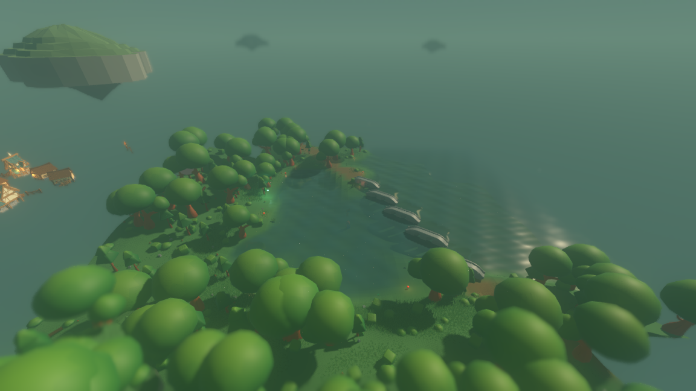
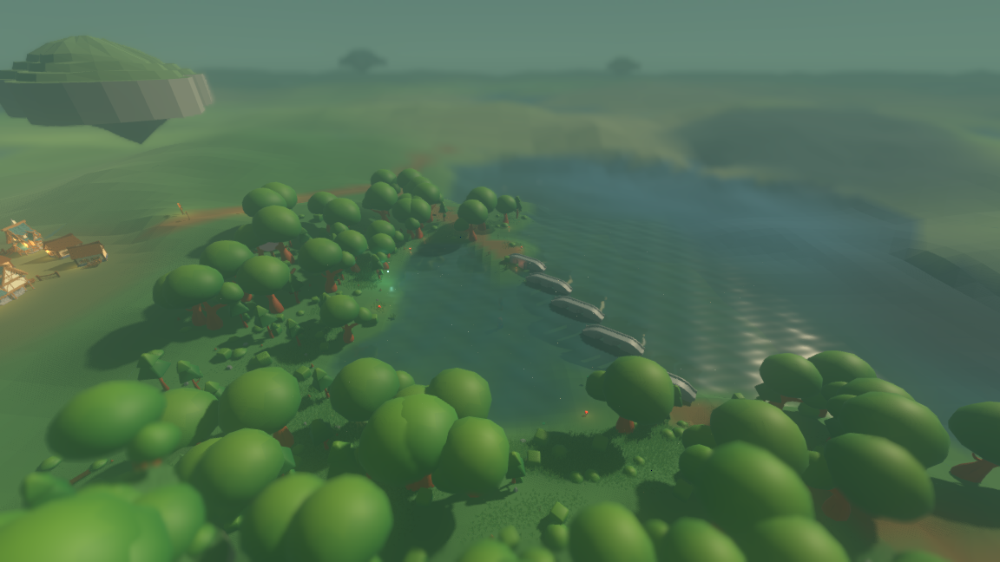
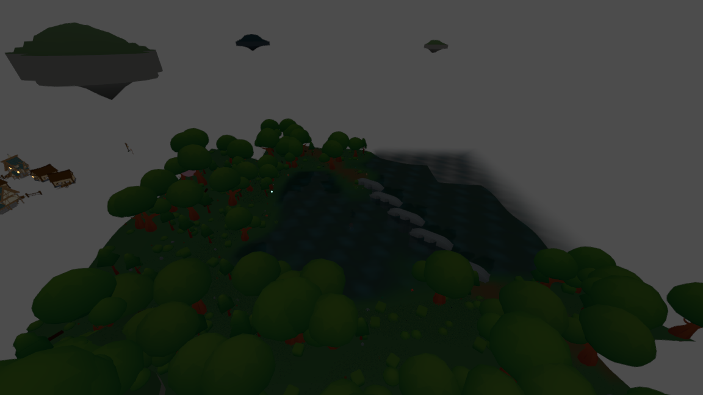
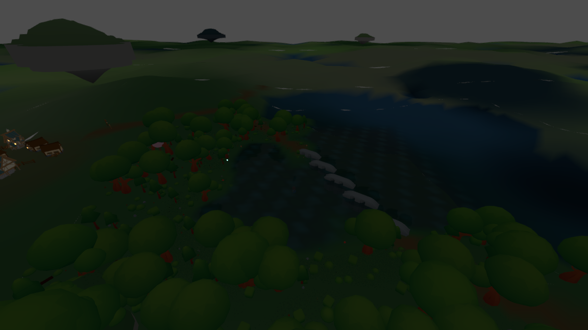
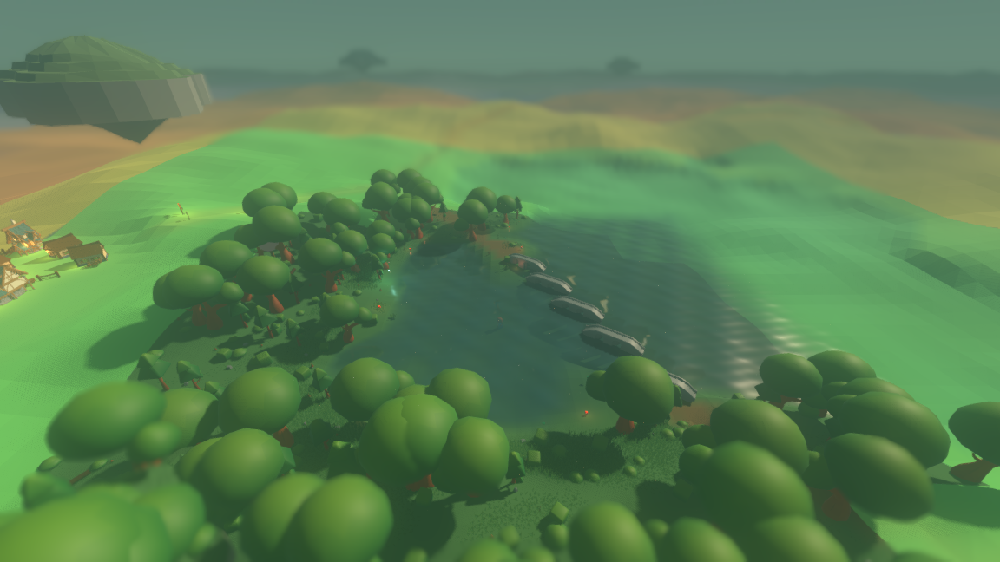

# Coarser ground further out

The ground now reaches the horizon. It used to stop at forty units.



*Before.* The simulation streams a disc of ground about forty units in radius
around whoever is standing there, and that was the whole of what was drawn. Everything
past it was fog with nothing behind it.



*After.* The same seed, the same tick, the same camera. The streamed disc is
untouched — the near ground is the identical geometry, meshed by the identical
code — and past it five rings of progressively coarser tiles carry the ground out
to at least 1024 units, which is where it meets the camera's far plane.

Everything drawn out there is the world's own height function read at a lattice
point. Nothing is painted, nothing is invented, and nothing is remembered by the
world: the simulation has never heard of a level.

---

## 1. What "level of detail" means here

A **tile** is a square of ground meshed as one piece, the way a *chunk* is
today. A **level** is how coarse the tiles at a given distance are: level 1 tiles
are 32 units square, level 5 tiles are 512, and every tile at every level carries
the same 8×8 grid of cells — so the **cell**, the little square that becomes two
triangles, doubles with the level while the triangle count per tile stays at 128.
A **ring** is the block of tiles one level draws: a square of its own tiles
centred on the tile the observer is standing in, minus whatever the finer levels
already cover.

| Level | Tile | Cell | Reaches at least | Tiles drawn | Triangles |
|---|---|---|---|---|---|
| the simulation's chunks | 16 | 2 | 40 | 32 | 4 096 |
| 1 | 32 | 4 | 96 | 45 | 5 824 |
| 2 | 64 | 8 | 128 | 16 | 2 160 |
| 3 | 128 | 16 | 256 | 21 | 2 864 |
| 4 | 256 | 32 | 512 | 21 | 2 864 |
| 5 | 512 | 64 | 1 024 | 21 | 2 864 |

All distances in world units, at seed 1234 with the observer at the origin.
Measured by `./tools/measure_lod.sh`.

The tinted capture below is the same view with each level washed in its own
colour, so the boundaries can be seen: bright green is level 1, yellow level 2,
orange level 3, and the mauve and pink at the back are levels 4 and 5.


---

## 2. The number that ships: 1024 units, and why it is that number

Two ceilings meet at 1024, and the smaller of them is what ships.

**The camera's own reach.** The playing camera sits at `(0, 42, 52)` behind and
above the observer and aims ten units above its head, which points it down
$31.607°$: $\arctan(32/52)$. Its vertical field of view is $75°$ and, at 16:9,
its horizontal field is $107.51°$. Its far plane is at $900$. A patch of ground
straight ahead, $d$ units from the camera horizontally and $42$ below it, sits at
a depth along the view axis of

$$ \text{depth}(d) = d\cos(31.607°) + 42\sin(31.607°) = 0.8515\,d + 22.0 .$$

Setting that to the far plane gives $d = 1031$ units from the camera, and the
camera is 52 units behind the observer, so **979 units from the observer is where
the ground runs out of camera**. Drawing further is drawing nothing.

**What a mountain needs.** A mountain reads as a mountain rather than as a slope
when you can see it whole: its base on both sides, its top, and something behind
it. A landform whose base half-width is $W$, seen from $D$ units away, spans
$2\arctan(W/D)$ of the horizontal field. Asking it to take up no more than half
the $107.51°$ frame gives

$$ D \ge W / \tan(26.9°) = 1.97\,W .$$

The uplift planned for the next item is ridged noise with a period in the several
hundreds. A ridge repeats every period $P$, so one ridge's base half-width is
about $P/4$ and a range of three ridges about $3P/4$. At $P = 600$: a single ridge
needs to be seen from $D \ge 296$ units, **a three-ridge range from $D \ge 886$**.
And you have to see the ground between you and it, or it floats — so the drawn
radius has to be $D$, not merely contain the mountain.

**1024** is the first multiple of the coarsest tile (512 units) past both numbers:
past the 979 at which ground stops being inside the camera, and past the 886 from
which a range of the planned scale fits in the frame. It is not a round number
chosen for looking round; it is two tiles of the outermost ring, which is the
smallest step the scheme can take above 979.

**What that does to the frame.** Screen positions follow from the same numbers.
Writing $\theta$ for the angle above the view axis, a point lands
$\tan\theta/\tan(37.5°)$ half-heights above the centre of the frame, so:

| | angle above view axis | where it lands in frame |
|---|---|---|
| the horizon | $31.61°$ | 9.9% down from the top |
| the drawn ground's edge, before (40 units) | $7.07°$ | 41.9% down |
| the drawn ground's edge, after (979 units) | $29.27°$ | 13.5% down |

So the ground used to stop nearly half way down the frame, leaving 32% of the
picture's height as empty sky between the edge of the world and the horizon. It
now stops 3.6% of the frame's height below the horizon — the last sliver, where
the far plane cuts it off.

**And measured off a frame, not only predicted.** The two captures below are the
same view with the atmosphere switched off (`--no-atmosphere`), so the world and
the sky separate cleanly instead of dissolving into fog. Scanning a 200-pixel
strip through the centre of each for the topmost row in which anything of the
world is drawn:

| | topmost row of the world |
|---|---|
| before | 213 of 648 — **32.9% down the frame** |
| after | 80 of 648 — **12.3% down the frame** |
| the horizon, for reference | 9.9% down |

Both sit higher than the flat-ground arithmetic predicts (41.9% and 13.5%) for
the same reason: the ground is not flat, and what actually cuts the sky is a
hilltop with trees on it rather than the plane the arithmetic assumes. The
measurement is the honest one — it is what a player sees — and it says the same
thing. The world used to end a third of the way down the picture; it now reaches
to within two and a half percent of the horizon.





One number to carry into the uplift item, not settled here: the camera's eye is
42 units above the ground the observer stands on, so **a peak under 42 units tall
never breaks the horizon** and will read as a swell however far out it is drawn.
That is a constraint on the uplift's amplitude, not on this scheme's radius.

---

## 3. The radius grew; the count did not follow it squared

| | radius | pieces drawn | triangles | geometry held |
|---|---|---|---|---|
| before | 40 | 32 chunks | 4 096 | 528 KiB |
| after | 1 024 | 32 chunks + 124 tiles | 20 672 | 2 665 KiB |
| the same reach, meshed at the near cell | 1 024 | 12 867 chunks | 1 646 976 | 212 306 KiB |

The radius grew **25.6×**. The pieces drawn grew **4.9×** and the triangles
**5.0×**. Meshing the same reach uniformly at the streamer's own two-unit cell
would have been **82× more pieces** and **80× more triangles** than the scheme
draws, and would have held **80×** the memory.

That is the whole point of the doubling. Each ring covers four times the area of
the one inside it with tiles four times the area, so **each level costs about the
same fixed handful of tiles however far out it is** — 16 to 21 of them here. The
count grows with the *logarithm* of the radius. Adding a sixth level would double
the reach again for about 21 more tiles and 2 864 more triangles.

---

## 4. Cost, measured

Reproduce with `./tools/measure_lod.sh`. Seed 1234, observer at the origin.

**Building a tile**, cold — in a stretch of world nothing has asked about yet,
which is when a tile is actually built. Milliseconds:

| Level | min | median | mean | max |
|---|---|---|---|---|
| the simulation's own chunks | 6.93 | 9.03 | 32.22 | 284.62 |
| 1 | 5.42 | 7.63 | 21.59 | 399.16 |
| 2 | 7.35 | 13.70 | 20.55 | 90.98 |
| 3 | 6.28 | 12.62 | 23.59 | 84.22 |
| 4 | 3.64 | 4.13 | 4.10 | 4.77 |
| 5 | 3.83 | 4.22 | 4.22 | 4.91 |

A coarse tile costs about what a chunk costs, which is the honest surprise here:
a tile has the same 81 corners whatever it covers, and a corner is the price of
asking the world a question, not of the area it stands for. The long tails
(285 ms, 399 ms) are the first tile to reach into a village or a road that had
not been generated yet — the same tail the streamer has always had. Levels 4 and
5 are five times cheaper per tile, and section 6 says exactly what they give up
to be.

**Filling the whole view** from nothing costs **1.97 seconds** of building. It is
not taken as one stall: the shell spends at most 40 ms of any frame on it and
fills outwards from the observer, so the view is complete after about fifty
frames. The captures in this report are taken at frame 140.

**Walking**, averaged over 200 ticks of an ordinary wandering observer:

| | per tick |
|---|---|
| tiles that arrive on a ring | 0.48 |
| tiles rebuilt because their boundary moved | 0.73 |
| new corners sampled | 27.2 |
| milliseconds spent | 3.47 |

A tick is 50 ms of game time, so the distance costs about 7% of one tick's worth
of wall clock to keep up with. The rebuilds are nearly free because a tile that
is rebuilt because its boundary moved re-uses every corner it already sampled;
only 27 genuinely new samples are taken per tick.

**Frame time**, with the layer and without it, over 110 timed frames after the
view has settled (frames 91–200 of a 200-frame run):

| | coarse tiles | coarse triangles | frame time |
|---|---|---|---|
| with the distant ground | 124 | 16 576 | **133.29 ms** |
| without (`--no-distant-ground`) | 0 | 0 | **133.41 ms** |

The difference is $-0.12$ ms: **the layer does not show up, and if anything it
draws faster**. A second pair of 200-frame runs gives 133.19 with and 133.40
without; three shorter runs (51 timed frames) give 133.41 and 133.33 with, and
133.56 without. Every with-run came out slightly below every without-run, by
about 0.15 ms, which cannot be the cost of 16 576 triangles and is more likely
the opposite effect: distant ground *occludes* sky, and on a software rasteriser
the procedural sky shader is not cheaper per pixel than a flat-shaded triangle.
Either way the honest reading is that this layer is free at this scale — it is
lost in the 266 000 triangles of grass and the full-screen depth-of-field pass
the same frame is already paying for.

**These frame numbers are software rasterisation.** This machine has no GPU, so
the renderer is llvmpipe and every triangle is drawn by the processor. Read them
as a comparison between the two runs, never as a frame rate. Software
rasterisation is also the *harshest* place to add distant triangles, because it
pays per pixel with no hardware behind it — and even here it costs nothing
measurable.

---

## 5. The seam neither cracks nor shimmers

**Why a seam could crack at all.** Two levels meeting share the corners they both
sample — both read the same height function at the same world position — and
disagree in between, because the coarse side draws a straight line across ground
the fine side follows. The worst case is the midpoint of a coarse cell's edge, and
it is arithmetic rather than a guess:

| Level | cell | worst seam it can open | apron hung under it | margin |
|---|---|---|---|---|
| 1 | 4 | 0.702 | 3.2 | 4.6× |
| 2 | 8 | 1.541 | 6.4 | 4.2× |
| 3 | 16 | 2.711 | 12.8 | 4.7× |
| 4 | 32 | 4.242 | 25.6 | 6.0× |
| 5 | 64 | 7.777 | 51.2 | 6.6× |

Worst seam measured over 260 positions × 2 directions across a 3 000-unit sweep
at seed 1234, in world units.

Every emitted cell that has no emitted neighbour drops a vertical apron in the
ground's own colour. `tests/test_terrain_lod.gd` measures the worst disagreement
over a 3000-unit sweep for every level and fails if the apron is not at least
three times deeper than it.

**Why it cannot shimmer.** Every tile is a square of the *world* lattice, not of
the observer, and its geometry is a pure function of `(level, tile, seed)`. So a
tile does not change when the observer moves; only the *set* of drawn tiles does,
and that set is exactly complementary by construction:

* A level-1 tile is exactly 2×2 simulation chunks and a chunk is exactly 4×4
  level-1 cells, so level 1 omits precisely the cells inside chunks the
  simulation has loaded. The coarse ground begins exactly where the streamed
  ground stops, whatever shape that boundary happens to have.
* A level-$\ell$ ring's edges fall on multiples of the level-$(\ell-1)$ tile,
  which is four level-$\ell$ cells, so level $\ell$ omits precisely the cells
  inside the ring below it.

That exactness is checked rather than argued. Over 240 000 sample positions
around each of three standpoints, **every position is drawn by exactly one thing**:
no misses (a hole you could see the sky through) and no doubles (two surfaces
fighting for the same pixels). And it is checked again after every one of 200
steps of a walk, on 240 positions per step spread through every ring, while the
boundaries moved 11 times underneath: still no misses and no doubles.

**At rest.** The tinted capture in section 1 shows where the boundaries are; here
is the same frame untinted, with nothing at any of them:


*(The "after" frame from section 1, repeated here so the tinted and untinted
views of the same boundaries sit side by side.)*

**While a boundary sweeps across the ground.** Walking moves the rings and the
camera together, so a frame before and a frame after are two different views and
cannot be compared. `--lod-centre` moves the rings alone: the capture below is the
identical camera on the identical world with the ring centre displaced 20 units,
which is enough to move **every** level's ring by a whole tile of its own — 32,
64, 128, 256 and 512 units respectively.


Where the boundaries went is visible in the tinted pair — level 1's bright green
now reaches much further and level 3's orange is pushed back:



The numbers under the pictures: the two **tinted** frames differ over 33 220 of
746 496 pixels (4.45% of the frame) by more than 5%, which is where the
boundaries actually moved; the two **untinted** frames differ over 3 845 pixels
(0.52%), RMSE 1.00% against the tinted pair's 1.97%. Every boundary in the frame
moved a whole tile of its own level and the picture barely noticed — and what
did change is the ground being drawn at a different cell, not a crack, because
the coverage checks above say there is never a hole or an overlap to begin with.

---

## 6. What the far levels give up, exactly

Levels 1 to 3 — everything out to at least 256 units — draw the ground as the
whole stack composes it: `TerrainQuery.ground_height_at`, with the villages'
levelled pads and the roads' worn dips in it. Levels 4 and 5 draw the
water-carved land alone, the same fields one layer short.

That is the one place the distant ground is a simplification rather than a copy,
and it is here for a measured reason. Reading the settlement and road layers costs
600–2 500 microseconds a corner where corners are tens of units apart — they are
cached per cell, and a coarse lattice misses every cache — against 25 microseconds
for the land itself. What it buys is a difference of **at most 1.576 units**, at
**4.3% of positions**, measured over a 4 000-unit sweep. Past 384 units, 1.576
units of ground subtends a quarter of a degree.

Colour is cut one level earlier, at level 2: past 128 units the ground takes the
biome blend without the brown of a cart track worn into it. The road's *shape* is
still in the ground out to 256 units; only its colour stops at 128.

Water is the other way round — it is coloured at **every** coarse level, and that
is an addition rather than a cut. The world's one sheet of water reaches 56
units, and past that there is nothing to draw a lake but the ground under it, so a
lake would read as grass. Coarse cells standing in water therefore take the water
field's own colour for that place. The vertex stays at the bed, under where the
sheet would be, so in the 40-to-56 stretch where both are drawn they never fight
for a pixel.

All three — the shape cut past level 3, the colour cut past level 2 and the water
colour added at every level — are drawing decisions, and none of them reaches the
world. `TerrainQuery.ground_height_at` is the height at a position and no level
touches it.

---

## 7. What is not used for anything but drawing

Stated explicitly, because the acceptance asks for it:

* **Collision and the terrain query** are unchanged. `TerrainQuery` has no
  parameter for a level and no caller passes one. Standing, wading, settling onto
  an island's rim and every height the world reports come from the same full
  answer they came from before.
* **The combat lattice** is unchanged. `CombatBoardBuilder` reads the terrain
  query directly, on a 3.0-unit cell, and never sees a tile.
* **The simulation's own chunk streamer** is unchanged: same load radius, same
  unload radius, same chunks, same geometry, same fingerprint. The render shell
  draws all of them and the coarse layer fills in around them.
* **Nothing outside the render shell uses a coarse level for anything.** There is
  no coarse answer anywhere in `sim/` to be used by accident: the whole scheme is
  one file under `render/`.

**No stand-in is used.** The ground is drawn all the way to the far plane by the
ground itself. There is no billboard, no painted range and no silhouette band —
the acceptance's fifth clause is answered by the fact that it does not apply.

Two things do stop before the far plane, and both are pre-existing layers rather
than stand-ins: the water sheet reaches 56 units and the flora, props and villages
reach the streamer's own radius. So a lake past 56 units is drawn as ground in the
water's own colour rather than as a moving, reflecting surface, and there are no
distant trees. Both are the next items' business, not this one's.

---

## 8. Where it lives, and why there

`render/distant_ground.gd`, in the render shell — the same decision the grass
layer made, for a related reason. Every layer of the world so far lives in `sim/`
on the rule that what is in a place is a fact about the place. The coarse ground
is not a second fact about the place; it is a **coarser picture of the same
fact**. Nothing can walk on it, collide with it or read it, because everything
that could is reading `TerrainQuery` instead.

Putting it here is what makes two of the acceptance clauses true by construction
rather than by care:

* *Level of detail is a drawing choice.* There is no level in `sim/` to leak into
  a generation rule.
* *Headless meshes nothing.* A headless process never loads a file under
  `render/`, so there is no distant ground to disable — there is none to make.
  `./run_headless.sh --assets` reports `render-scripts loaded=0`, asked from
  outside the render layer, off the engine's own resource cache.

And the world's fingerprint is the same with the layer and without it, checked by
running the shell both ways and a bare simulation as a third: all three reach the
same digest at the same tick, while the two shell runs differ in the one way they
should (124 tiles against 0). The headless fingerprint on seed 1234 at 100 ticks
is `a6aa8e5776ebfe8c`, the same as before this item.

---

## 9. Running it

```bash
./run_render.sh --seed 1234                       # the ground reaches the horizon
./run_render.sh --seed 1234 --no-distant-ground   # the forty-unit disc it was
./run_render.sh --seed 1234 --lod-levels          # each level in its own colour
./tools/measure_lod.sh                            # the tables in sections 3 and 4
```

The captures in this report:

```bash
xvfb-run -a ./run_render.sh --seed 1234 --paused \
	--screenshot "$PWD/reports/assets/lod-after.png" --screenshot-frame 140
xvfb-run -a ./run_render.sh --seed 1234 --paused --no-distant-ground \
	--screenshot "$PWD/reports/assets/lod-before.png" --screenshot-frame 140
xvfb-run -a ./run_render.sh --seed 1234 --paused --lod-levels \
	--screenshot "$PWD/reports/assets/lod-levels.png" --screenshot-frame 140
xvfb-run -a ./run_render.sh --seed 1234 --paused --lod-centre 0 -20 \
	--screenshot "$PWD/reports/assets/lod-seam-moved.png" --screenshot-frame 140
xvfb-run -a ./run_render.sh --seed 1234 --paused --lod-levels --lod-centre 0 -20 \
	--screenshot "$PWD/reports/assets/lod-levels-moved.png" --screenshot-frame 140
```
