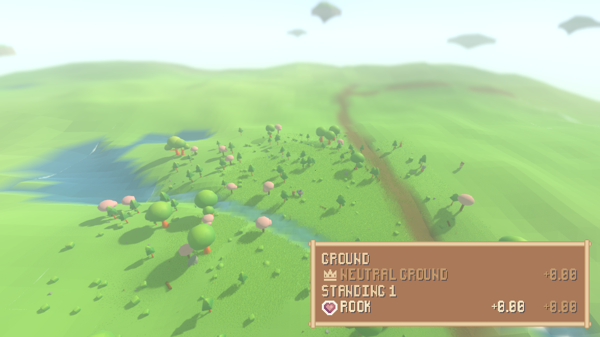
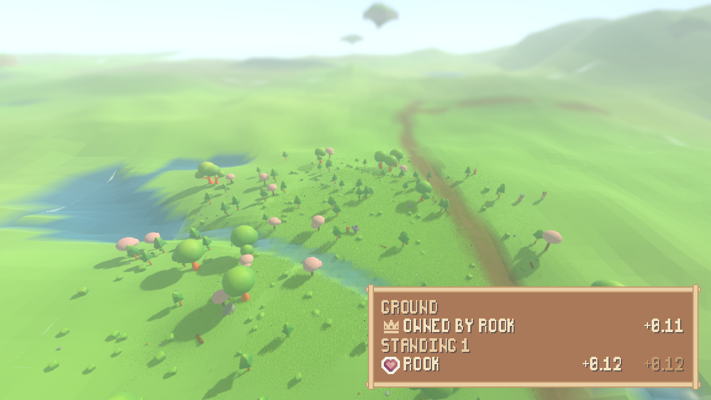

# The goodwill and territory readout

The last panel the interface milestone names, and the only one that had to
wait: a readout of how the followed character stands with the people it knows
of, and of who owns the ground it is standing on. It exists because the
ownership field now does (`sim/ownership_field.gd`, written up in
[reports/territory.md](territory.md)), and it reads that field rather than
keeping any figure of its own.

```
./run_render.sh --territory --scenario market   # the readout over the market run
./run_tests.sh test_ui_territory                # its claims, checked
xvfb-run -a ./tools/measure_ui.sh --panel territory --scenario market --tick 70
```

## 1. What is on it

Two sections, in the pack's frame on the shared theme, bottom-right with the
other reading panels:

* **ground** — who owns the point the followed character is standing on,
  beside the pack's crown: the owner by name, or `neutral ground` (dimmed)
  when the neighbourhood favours nobody enough, with the top claimant's score
  beside it, dimmed while it is not enough to own. The verdict, the name and
  the score are all the simulation's answer on the frame the picture is drawn.
* **standing** — one row per character the followed one knows of (known-of is
  having an edge in the world's relationship graph), each with the pack's
  heart, the other's name, the followed character's sentiment toward them and,
  dimmed, theirs back. Sentiment is the graph's own composite, `familiarity ×
  (trust − fear)`, written signed so indifference reads `+0.00`. A character
  that has met nobody reads `knows nobody yet` rather than going blank.

## 2. Ownership changing on the same ground, photographed

The market scenario at seed 1234, lived through the render shell with the
readout on. Wren (the followed character) walks to the market and stands still
at (−476.1, 416.0) from tick 40 on; Rook meets Wren there, and the trade is
honoured on tick 62. Greeting alone earns familiarity and no trust, so the
sentiment each way is `+0.00` and the ground stays neutral; the honoured trade
moves trust and respect, and on tick 62 the same point flips to owned. One
run, one command, two named moments:

    xvfb-run -a ./run_render.sh --territory --scenario market \
        --screenshot-ticks "55:reports/assets/territory-before.png,70:reports/assets/territory-after.png"

(The shell photographs the first frame on or after each named tick; this run
landed them on ticks 56 and 72, printed as `render-shell screenshot t=...`.)





The flip is the field's own arithmetic doing what
[reports/territory.md](territory.md) measured: one honoured trade between
strangers is exactly what the ownership threshold is pinned to, and the
market's trade clears it once familiarity from the surrounding talk is on the
edge too.

## 3. Every number is read on the frame it is drawn

The panel keeps a handle on the world and the id of the character being read,
and nothing else. There is no ownership map anywhere in the simulation to copy
from — ownership *is* `OwnershipField.at`, a pure reading of the relationship
graph — so `render/ui/territory_source.gd` asks that one function at the
moment the frame is drawn, and the claim that comes back is read, drawn and
dropped. The standings are the graph's own edges, read through
`edges_of`/`sentiment_of` the same way.

Proved the way every panel before it was (`tests/test_ui_territory.gd`):

* the world is lived across the flip **without the panel being told** — the
  panel is built at tick 55, the simulation steps to tick 65 on its own, and
  the panel says `owned by Rook` with the claim's own score on its next
  refresh;
* the panel is then asked for a field of its own called `owner_id`, `claim`,
  `score`, `best`, `edges`, `sentiment`, `ownership` and the rest — it has
  none, and neither does the source;
* every number equals what `OwnershipField.at` and the graph answer when
  asked directly on the same tick;
* neither render file names a constant or a shape of the ownership arithmetic
  (`TEMPERATURE`, `RADIUS`, `THRESHOLD`, `SOFTMIN`, `NEARNESS`,
  `proximity(`, `exp(`, `carry(`), scanned with comments stripped — reading
  the field is asking the one function, never re-deriving it;
* the same seed with and without the readout reaches the same world
  fingerprint.

## 4. The icons, accounted for

The readout draws two icons and both are the pack's:

| icon | where it is on the panel | where it comes from |
|------|--------------------------|---------------------|
| crown | the ground line | the pack's generic icon sheet, `SproutPack.ICON_CROWN` — the same cell the character sheet marks status with |
| heart | each standing row | the pack's heart sheet, `SproutPack.HEART_FULL` — the same cell the combat readout's turn order uses |

Nothing new is drawn, so the drawn-icon table
(`render/ui/pixel_icons.gd`) is unchanged and its closed-table accounting in
`tests/test_ui_panel.gd` still holds. The frame, the font and the three label
styles are the shared theme's; the panel carries no theme, font, size or style
of its own, checked by the same override sweep the other panels go through.

Measured, not eyeballed, the way every panel is: the whole-pixel measurement
run over the shipped after-frame itself (`tools/measure_ui.gd` on
`reports/assets/territory-after.png`, at the rectangle the shell printed on
exit) reads **0 of 69,088 pixels off-palette (0.0000%) and 0 of 6,538 colour
edges off-grid (0.0000%)** — every colour inside the panel is the pack's own
and every edge lands on a whole art pixel. The live path is
`xvfb-run -a ./tools/measure_ui.sh --panel territory --only --scenario market
--tick 70` (`--only` is new: the full five-panel set does not fit a
320-art-pixel-tall window under an open sheet, so the measured panel can now
be requested alone).

## 5. The layer rule, held

Nothing under `sim/` changed for this panel — not one file. The render side
names only what is read-only by construction: `OwnershipField` (a static
function with nothing to hold), `OwnershipClaim` (a verdict built fresh per
call), `Character` (the same handle the sheet reads). The types between the
world and those answers — the roster, the scene, the entities standing in it —
are reached through dynamic hops exactly as `render/ui/fight_source.gd`
reaches the fight, so `tests/layer_check.gd` passes in both directions, and a
headless run loads no UI asset, script or font.
