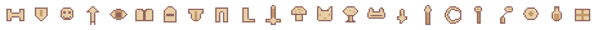
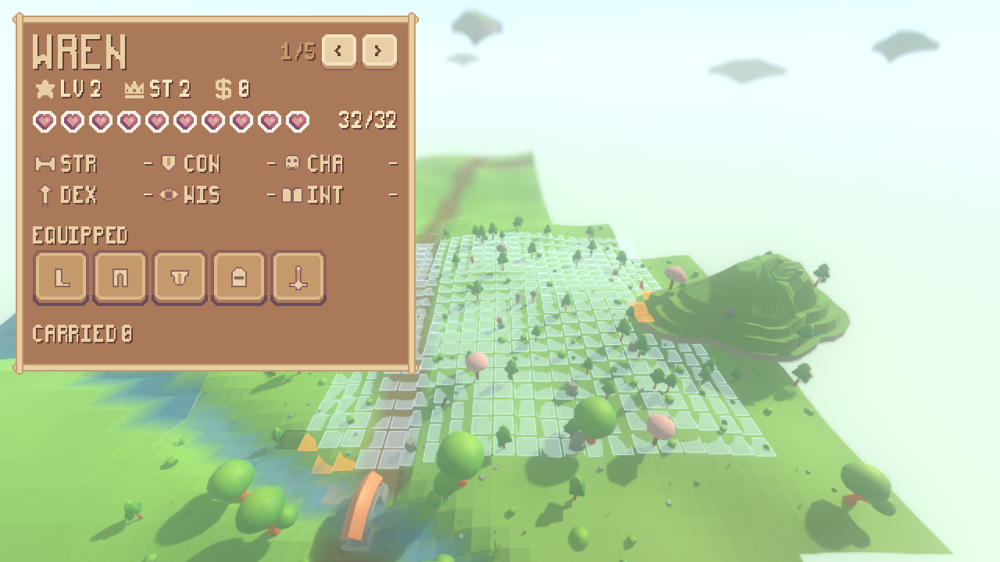

# The pixel interface, proved by one panel

The Sprout Lands UI pack is now a working Godot theme on the render side, and
one panel is built out of it: a character sheet showing a live character's six
ability scores, level, status, health, inventory and equipment, read off the
`Character` the simulation is holding.

```
./tools/extract_sprout_lands.sh                 # unpack the user's zip
./run_render.sh --sheet --scenario encounter    # the panel over the world
xvfb-run -a ./tools/measure_ui.sh               # ...and is it crisp
./run_tests.sh --layers-only                    # ...and is it on the right side
```

The second panel, the combat turn-and-cooldown readout, is built on this
foundation and written up separately in
[reports/combat-readout.md](combat-readout.md).

The sheet described here is a readout with no controls on it. It has since been
given some -- put on, take off, use up, drop, give away -- without gaining a rule
or a cached copy of anything; that is
[reports/player-inventory.md](player-inventory.md).


---

## 1. The pack, and the licence that shapes how it is handled

*Sprout Lands – UI Pack (Basic)* by **Cup Nooble**. 2D pixel art on a 16-pixel
cell with a bundled pixel font on an 8×14 cell: nine-sliceable frames, buttons,
inventory slots, hearts, a generic icon sheet, cursors and emotes. 59 files,
143 KB, still in the zip the user dropped in `assets/`.

Its `read_me.txt`:

> - You can modify the assets.
> - You can not redistribute or resale, even if modified.
> - You can only use these assets in non-commercial projects.

That is stricter than every other pack here — the KayKit models are CC0 and the
JustCreate and Mistage packs are paid but ordinary. Four things follow, and each
is done rather than noted:

| the licence says | what was done |
| --- | --- |
| non-commercial use only | a commercial release would need the paid *Premium* pack, bought from the author. Recorded in the README beside where the other art comes from. |
| no redistribution, even when modified | neither the zip, nor the unpacked copy, nor anything derived from a file in it is committed. `.gitignore` excludes `/assets/*.zip` and `/assets/sprout_lands_ui/`, the same way it excludes `/assets/kaykit_*/` and `/assets/mistage_village/`. Nothing from the pack is attached to a report as a downloadable asset. |
| — | a **screenshot of the running game** showing the interface in use is not redistribution. That is what the images in this report are. |
| it is the user's own download | there is deliberately no `tools/fetch_sprout_lands.sh` beside `tools/fetch_kaykit.sh`. `tools/extract_sprout_lands.sh` unpacks the zip that is already on disk and fails with the pack's itch.io URL if it is not. |

### What the extractor does

It unzips the pack into `assets/sprout_lands_ui/` and then writes six flat
aliases at the pack root — byte-for-byte copies, nothing edited. This is the same
move `tools/extract_mistage.sh` makes when it puts each shipped atlas under the
basename its models ask for, and for the same reason: the pack's own layout is
written for a person browsing it, with spaces everywhere, one misspelt directory
(`Dialouge UI`) and one file whose name ends in a space before its extension.

| alias | the pack file behind it |
| --- | --- |
| `ui_sheet.png` | `Sprite sheets/Sprite sheet for Basic Pack.png` |
| `buttons.png` | `Sprite sheets/buttons/Square Buttons 26x26.png` |
| `icons.png` | `Sprite sheets/Icons/All Icons.png` |
| `hearts.png` | `emojis-free/emoji style ui/Inventory_Herat_Spritesheet.png` |
| `slots.png` | `emojis-free/emoji style ui/Inventory_Blocks_Spritesheet.png` |
| `pixel_font.ttf` | `fonts/pixelFont-7-8x14-sproutLands.ttf` |

`render/ui/sprout_pack.gd` names those six and the rectangle cut from each; it
is the only file under `render/ui/` allowed to name a file on disk, and
`./run_tests.sh --layers-only` enforces that.

---

## 2. The theme: which rectangle of the pack draws what

`render/ui/sprout_theme.gd` builds one `Theme` and the panel's root carries it;
every Control under it inherits, and no Control in the panel sets a style of its
own. For each type it puts on screen, **every** style and colour that type can
draw with is set — including states nothing in this panel triggers, like a
disabled button — because a Control that is missing one still draws, in the
engine's grey.

| part of the panel | pack file | rectangle | how |
| --- | --- | --- | --- |
| the panel frame | `ui_sheet.png` | `153,9 30×30` | nine-sliced, margin 9 (the rails are 8 px of wood plus a pixel of shadow, so 9 leaves a 12×12 middle and keeps every corner knob whole) |
| button, idle | `buttons.png` | `11,59 26×28` | nine-sliced, margin 8. The extra two rows are the pack's own drop shadow |
| button, hovered | `buttons.png` | `11,11 26×28` | the same button lit, not a different button |
| button, pressed | `buttons.png` | `59,59 26×26` | the shadow gone and the label two pixels lower — the pack's own animation, costing one number |
| inventory slot, occupied | `slots.png` | `9,57 30×32` | the light plate |
| inventory slot, empty | `slots.png` | `105,57 30×32` | the dark plate. Something in a slot lightens it, which is the pack's own read |
| the type | `pixel_font.ttf` | — | see §4 |

---

## 3. Every icon in the panel, one by one

Twenty-one things are drawn on the panel. Ten come out of the pack; eleven the
pack has no equivalent for and this project drew.

### From the pack's generic icon sheet

`icons.png` is 18 columns by 3 rows of 16×16: the same eighteen icons in white
(columns 0–5), cream (6–11) and tan (12–17). Cream is the set that reads against
the frame's dark interior, so every one of these is a cream one.

| # | icon | where it is in the sheet | what it marks on the panel |
| --- | --- | --- | --- |
| 1 | star | cream column 5, row 0 | the level |
| 2 | crown | cream column 5, row 1 | the status |
| 3 | coin (`$`) | cream column 1, row 1 | the money |
| 4 | tick | cream column 3, row 2 | a carried thing that is being worn or held |
| 5 | prohibition sign | cream column 5, row 2 | a carried thing that goes in no slot at all |

### From the pack's other art

| # | thing | pack file | where |
| --- | --- | --- | --- |
| 6 | heart, full | `hearts.png` | `0,0 16×16` |
| 7 | heart, half | `hearts.png` | `16,0 16×16` |
| 8 | heart, empty | `hearts.png` | `32,0 16×16` |
| 9 | the frame, the slots, the buttons | see §2 | |
| 10 | the font | `pixel_font.ttf` | |

### Drawn here, in the same sixteen-pixel idiom

`render/ui/pixel_icons.gd`. Same 16-pixel cell as the pack. Same three colours,
**sampled out of the pack's own frame rather than chosen**: `#90625d` for the
edge, `#c49a6c` for a shaded face, `#e8cfa6` for a lit one — the pack's own dark,
its own tan, and the cream its own icon sheet is drawn in. Every shape carries a
one-pixel edge all the way round, which is what makes a pack icon and one of
these sit together.

Each is sixteen rows of sixteen characters of source (`.` nothing, `o` edge, `m`
shade, `l` lit), not a binary, so a change to one shows in a diff as the shape it
changes — and so nothing about them touches the pack's redistribution line: they
are this project's own art, derived from no pack file.



| # | icon | drawn as | why it exists |
| --- | --- | --- | --- |
| 11 | `str` | a barbell | the pack has no ability-score icons at all |
| 12 | `con` | a shield | " |
| 13 | `cha` | a face | " |
| 14 | `dex` | an arrow | " |
| 15 | `wis` | an eye | " |
| 16 | `int` | an open book | " |
| 17 | `helmet` | a great helm | the pack has no equipment-slot icons either |
| 18 | `chestplate` | a breastplate | " |
| 19 | `leggings` | trousers | " |
| 20 | `boots` | a boot | " |
| 21 | `hand` | a sword | the hand slot is what a weapon is held in |

They are keyed by the simulation's own names — `Ability.ALL` and
`Inventory.SLOT_ORDER` — so the panel asks for an icon with the string the sheet
already uses and there is no second vocabulary to keep in step.
`tests/test_ui_panel.gd` checks that there is exactly one icon per score and per
slot, and none spare.

---

## 4. Whole pixels: measured, not asserted

The world is 3D low-poly and the panel is 16-pixel art. That pairing is the point
and it holds only while one pixel of the art is a whole number of pixels on the
screen — half a pixel of art is a blurred edge, and a blurred edge next to a
crisp one is what makes a pixel interface look broken rather than deliberate.

Four things, each of which the engine gets wrong by default:

* **The 2D texture filter.** `project.godot` now sets
  `rendering/textures/canvas_textures/default_texture_filter=0` (nearest). This
  key covers CanvasItem textures only, so the 3D stack — terrain, models, grass,
  water — is untouched by it.
* **The scale.** `render/ui/pixel_ui.gd` lays the interface out in the art's own
  pixels and multiplies by an integer taken from the window height: one step per
  320 pixels of window, never less than one. A 720-pixel window draws at 2, a
  1080-pixel one at 3. Never a fraction.
* **The font's antialiasing and hinting.** Both are on by default in this engine
  (`FONT_ANTIALIASING_GRAY`, `HINTING_LIGHT`). Both are off. Hinting nudges stems
  onto the pixel grid, which helps a typeface with curves and can only *move*
  one whose stems are already exactly on it.
* **The font's oversampling**, pinned to 1.0. Left alone the engine rasterises a
  glyph at whatever size the canvas transform will draw it at; pinned, a glyph is
  always rasterised at its nominal size and the canvas scales it as an image
  through the nearest filter, so one glyph pixel is a whole number of screen
  pixels at any scale by construction.

Sizes are multiples of the font's own 14-pixel cell: **14** for body text and
**28** for the character's name, and nothing between. At 14 a capital is exactly
eight pixels wide, which is the 8×14 cell the font was drawn on;
`tests/test_ui_panel.gd` measures that rather than assuming it.

### The instrument

`tools/measure_ui.sh` renders a real frame of the panel over the real world, then
asks that frame two questions over the panel's interior (inside its frame's
rails, where every pixel is pack art, drawn art or type):

* **off-palette share** — the share of pixels whose colour is in neither the
  pack's own files nor this project's own. The palette is read out of the
  installed files rather than written down, so the answer is about the art that
  is actually there. Antialiasing of any kind invents in-between colours, and
  this is what finds them.
* **off-grid share** — of every place where the colour changes along a row or a
  column, the share that does not fall on a multiple of the interface scale. A
  whole-number scale puts every edge of the art on that grid by construction; a
  fractional one, or a filter that blends, does not.

### The result

```
$ xvfb-run -a ./tools/measure_ui.sh --keep reports/assets/character-sheet.png
render-shell boot seed=1234 chunks=32 far=1 fartris=160 islands=10 grass=12594 motes=588 sheet=2/3 aa=msaa4+fxaa
render-shell sheet scale=2 x=16 y=16 w=520 h=604 sheets=2 showing=0

frame          reports/assets/character-sheet.png (1280x720)
panel          at 16,16 size 520x604, interface scale 2
measured       at 34,34 size 484x568 (inside the frame's rails)
palette        66 colours: the pack's own files plus PixelIcons' three
distinct       16 colours over 274912 pixels
off-palette    0 of 274912 = 0.0000%
edges          25634 changes of colour along rows and columns
off-grid       0 of 25634 = 0.0000%
```

Sixteen colours over a quarter of a million pixels, every one of them the pack's,
and not one edge off the grid. That is what "integer scale with nearest-neighbour
filtering" means when it is true.

The instrument earned its keep on the way here. An earlier draft of the theme
used `#633f36` for the one-pixel shadow under type — a brown that looked right
and that the pack does not contain. It showed up as the panel's only off-palette
colour, 2.64% of the pixels, and was replaced by the pack's own `#645552`. A
comment saying "these are the pack's colours" would not have caught that.

Every colour in it, and where each comes from:

| colour | share | what it is |
| --- | --- | --- |
| `#aa7959` | 75.68% | the frame's interior — the panel's ground |
| `#e8cfa6` | 7.94% | the pack's cream: the rails, the icon sheet, the lit face of a drawn icon |
| `#c49a6c` | 4.00% | the pack's tan: the shaded face of a drawn icon |
| `#f3e5c2` | 3.47% | the pack's lightest cream: body text |
| `#645552` | 2.64% | the pack's dark warm shadow, used as the one-pixel shadow under type |
| `#90625d` | 2.17% | the pack's dark brown: the edge of every drawn icon |
| `#dcb98a` | 1.30% | the slot plates' shaded face |
| `#f3f4e7` | 1.24% | the hearts' white outline |
| `#8a4a70` | 0.41% | an empty heart |
| `#6b4b5b` | 0.38% | the slots' own shadow |

The remaining six are the rest of the hearts' pinks and the buttons' bevels.

---

## 5. It is a view, and it holds nothing

The panel keeps a reference to the `Character` the simulation is holding and
reads every number off it on every frame. There is no cached level, no copy of
the scores, no snapshot of the inventory and no signal to keep in step: a blow
landed on a tick is on the panel on the next frame because the panel is looking
at the object the blow was struck against.

That is not a comment. `tests/test_ui_panel.gd` builds a panel, hands it a
character, and then moves the character *without telling the panel*: levels it
up, assigns it a status, wounds it, spends its money, gives it a cloak and puts
the cloak on. Every one of those shows on the next `refresh()`. Then it asks the
panel for a field of its own called `level`, `status`, `health`, `scores`,
`money`, `inventory`, `equipment` or `carried`, and there is none.

`render/ui/sheet_source.gd` is the one place the interface reaches into the
simulation for a sheet, and it hands over the world's own objects — the test
writes on what came back and reads the change out of the world.

### What the world's characters actually hold, which is less than the sheet can

Worth stating plainly, because it is what the screenshot shows. The panel draws
seven things and the simulation's scenarios do not currently populate all seven
on any one character:

| scenario | name | level, status, health | six scores | inventory & equipment | money |
| --- | --- | --- | --- | --- | --- |
| `encounter` | — (unnamed) | yes | none rolled | boots and a weapon, both worn | none |
| `market`, `quarrel` | Wren, Rook, Bram, Sable, Odo | yes | none rolled | empty | none |

An unrolled score is **not** a zero, and the sheet is explicit about that (zero
is a real score — a character with six of them can wear nothing usefully), so the
panel prints a dash, which is the sheet's own convention in `scores_line()`. The
gap is on the simulation's side and fixing it would be a simulation change, which
this work item forbids: `ScriptedScenario.muster` copies a character's name and
level into the world's roster and starts a fresh sheet, and
`ScriptedEncounter.muster` builds commanders that are geared but unnamed. Raised
as a finding rather than worked around.

The panel does follow the world live, and the encounter shows it: three
characters at tick 0, two by tick 24, because a commander fell and its minions
despawned with it — the design's "character = king" rule, arriving on the panel
with nobody having pushed it there.



`./run_render.sh --sheet --board --scenario quarrel`, at tick 24. Wren is the
first of five, at full health, carrying nothing — which is exactly what the
table above says the `quarrel` scenario leaves in the world.

---

## 6. Which side of the line it is on

The whole interface is `render/ui/` — six files, no simulation change of any
kind. `sim/` came out byte-identical, and so did the whole of
`./run_headless.sh`.

`bin/check_layers.gd` now runs four rules instead of three:

```
$ ./run_tests.sh --layers-only
layer check: OK -- res://sim references nothing in the render layer
combat check: OK -- res://render draws the fight and holds none of it
interface check: OK -- res://render/ui names its art through sprout_pack.gd alone
asset check: OK -- res://sim names asset tags and no asset
```

* The **layer check** grew the vocabulary of an interface — `CanvasLayer`,
  `Control`, `Theme`, `ThemeDB`, `StyleBox`, `Font`, `FontFile`, `SystemFont`,
  `TextServer`, `Label`, `Button`, `Panel`, `TextureRect`, `Image`,
  `AtlasTexture` and the containers — so a simulation file that starts naming
  what a character *looks* like fails the same way one naming a model does.
* The **asset check** grew `.ttf`, `.otf` and `fonts/`: type is art too, and a
  font is a file the simulation must no more name than it names a model.
* The **interface check** is new and covers `render/ui/`: the pack is named in
  `sprout_pack.gd` and in no other file there, and nothing anywhere in it reaches
  for `ThemeDB`, a `SystemFont` or `get_theme_default_font` — the silent ways a
  pixel interface ends up half grey.

Each of the three rules is tested twice in `tests/test_layering.gd`: that it
holds now, and that the checker would notice if it stopped holding.

### A headless run loads none of it

The same resource-cache check that already shows a headless run loads no model
now covers fonts too — `bin/headless_main.gd`'s `VISUAL_EXTENSIONS` gained
`ttf`, `otf`, `woff`, `woff2` and `fnt`, so "a headless run loads no font" is a
claim the report can answer rather than one it is silent about.

```
$ ./run_headless.sh --seed 1234 --ticks 100 --assets
...
assets visual-files found=3390 loaded=0
assets render-scripts found=19 loaded=0
assets sim-scripts found=77 loaded=71 -> res://sim/water_sheet_builder.gd,...
```

The third line is the control: without it, two zeros would be indistinguishable
from a probe that never worked. `tests/test_ui_panel.gd` runs exactly this as a
subprocess, and separately checks that the pack's six files really are on disk
and that `render/ui/` really has scripts in it — otherwise the two zeros would be
about a project with no interface in it.

### And the panel changes nothing about the world

The same seed run three ways — plain, with the encounter set out, and with the
encounter and the panel over it — reaches two worlds, not three: setting the
scenario out changes the world (it puts characters in it) and drawing the panel
over it does not. Both halves are asserted, because a comparison that only
checked the second would pass for a shell that never drew anything.

---

## 7. What is deliberately not here

One panel here. The combat turn-and-cooldown readout is the second, and it is
built on everything above — the same theme, the same pack table, the same
whole-pixel rule and the same measuring instrument, none of it re-decided. See
[reports/combat-readout.md](combat-readout.md).

After those two: no dialogue panel, no trade panel, no menu system, no cursor.
The pack ships art for all of those — dialog boxes in four sizes, a
click-to-continue indicator, six cursors including cat paws, an emote sheet, a
settings frame — and none of it is wired up. Dialogue and trade wait for the
model layer they are about.
