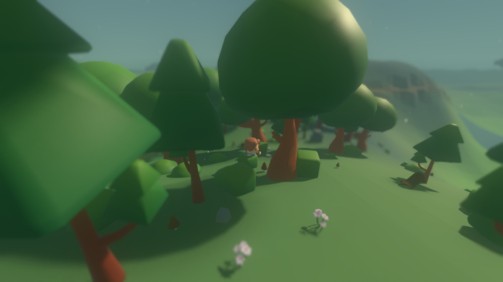
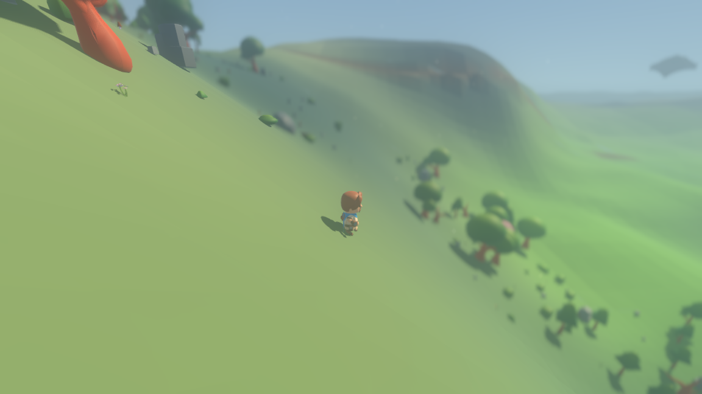

# A walk that happens while it happens

*W-walk-motion, cycle 192. Evidence: [walk-motion-evidence.txt](walk-motion-evidence.txt).*

A `go_to` used to be a teleport with a twenty-tick wind-up. The control loop
charged the character the catalogue's cost for the action and resolved it only
when the span ran out, and `ActionEngine._go_to` then walked the whole distance
inside that one resolution. The trace said it plainly — `t= 1 Pip began
go_to(target=(17.566, 3.927)), 20 ticks`, nineteen ticks of nothing, then
`t= 21 ... walked=18.0 steps=20`. Because the only motion the world reported was
the difference between where a character stood at the start of a tick and the
end of it, `CombatantRoster.snapshot` said `speed: 0.0` on every one of those
ticks, so the animated view never chose a walk clip and the follow camera
inherited the jump.

Now the walk is taken over the ticks it costs, one stride a tick, and the
resolution finishes whatever is left.

## The shape, in four sentences

* **`sim/walk.gd`** is new and small: a `go_to` under way — where it is headed,
  how near it has to get, how far it has got — and `Walk.stride`, the one
  function in the project that carries a character toward somewhere.
* **`ActionEngine`** holds no step arithmetic any more. `_go_to` aims a `Walk`
  (`ActionEngine.aim`, which reads the catalogue's three ways of naming a place)
  and turns `Walk.stride` until it stops returning true. `ActionEngine.advance`
  is the other caller: one stride, for a walk, and nothing at all for the other
  eleven actions.
* **`ControlLoop._serve`** calls `ActionEngine.advance` on every tick a character
  is busy, before it spends the tick. That is the whole of the change to the
  loop, plus `_drop`, which forgets the walk along with the commitment when an
  action is abandoned.
* **`ActionScene.walks`** keeps the half-finished journey between one tick and
  the next, under the character's id, beside `idle_until` and `spent_until`.
  Both callers reach it through `ActionEngine.walk_under_way`, so there is one
  walk per character and not one per caller.

The action's cost in ticks is untouched: what `ActionCatalog` says a `go_to`
costs is what it costs. What changed is when the motion happens inside that
span.

## Why the arrival point cannot drift

The strides taken during the span and the strides taken by the resolution are
the same `Walk.stride` calls, on the same actor, in the same order — the span
simply takes the first *n* of them. So this is not "the same walk to within a
tolerance"; it is the same floating-point arithmetic. `tests/test_walk_motion.gd`
runs one walk through the loop and the same walk through `ActionEngine.resolve`
in a single call, and requires the two `x` values and the two `z` values to be
*equal*, and the two outcome lines to read word for word the same.

Eighteen units at `ActionEngine.STEP` (0.9) is twenty strides, and a `go_to`
costs twenty ticks, so the ordinary wander is walked entirely inside its span
and its `walked=18.0 steps=20` line is unchanged. A walk aimed further than its
span reaches takes twenty strides in the span and the rest in the resolution.

## What it looks like

| tick | before: x, speed, clip | after: x, speed, clip |
|---|---|---|
| 1 | 0.000, 0.000, `Idle_A` | 0.000, 0.000, `Idle_A` |
| 2 | 0.000, 0.000, `Idle_A` | 0.878, 0.900, `Walking_A` |
| 10 | 0.000, 0.000, `Idle_A` | 7.905, 0.900, `Walking_A` |
| 20 | 0.000, 0.000, `Idle_A` | 16.688, 0.900, `Walking_A` |
| 21 | 17.566, 18.000, `Jump_Full_Short` | 17.566, 0.900, `Walking_A` |

Counted over 400 ticks of the seed-1234 world with `./tools/measure_motion.sh`:

| clip | before | after |
|---|---|---|
| `Idle_A` | 382 (95.3%) | 2 (0.5%) |
| `Walking_A` | 0 (0.0%) | 395 (98.5%) |
| `Running_A` | 11 (2.7%) | 0 (0.0%) |
| `Jump_Full_Short` | 8 (2.0%) | 4 (1.0%) |
| top speed seen | 18.000 | 0.900 |

Nothing in the render layer was tuned. `CharacterView.WALK_SPEED` (0.05) and
`RUN_SPEED` (1.30) are where they were; they were chosen against a placeholder
that walked a steady 0.9 units a tick, and the world moves at that rate again.




Six frames of the built shell driven under xvfb, seed 1234, ticks 0–159:
`xvfb-run -a ./tools/grass_film.sh --out reports/assets/walk-frames --frames 6
--stride 24 --warm 120 --seed 1234 --camera 0 7 11 --aim 2 --focus 12`. Nothing
is interpolated on the render side: the position the shell draws is the position
the simulation holds on that tick, and the camera's own motion is
`observer_speed`, which reads 0.900 on every tick of a walk and used to read
18.000 on one tick in twenty.

## An interrupted walk

Giving up on a walk now leaves the character where its strides carried it, which
is what happened. In the five-character scenario Wren sets off for the pile,
is spoken to five ticks in, and sets off again:

```
t=  6  Wren   began go_to(target=6), 20 ticks
t= 11  Wren   interrupted (spoken to), abandoned go_to(target=6) 5/20t
t= 11  Wren   began go_to(target=6), 20 ticks
t= 31  Wren   finished go_to(target=6) -> go_to ok at=(-473.400, 416.000) walked=8.1 steps=9
```

The second walk covers 8.1 units in 9 strides rather than 12.6 in 14, because
the first had already carried her 4.5 — five strides of 0.9. She arrives in the
same place. The abandoned action still never reaches the engine, which is the
property the loop was built on and which the suite still checks.

## One movement implementation, found by scanning

Advancing a combatant across the ground *adds* to its `x` and `z`; putting one
down at a place *sets* them. That distinction is kept on purpose, so "is there a
second implementation of walking?" is a search rather than a list somebody has
to remember to update. `tests/test_walk_motion.gd` reads every `.gd` file under
`sim/`, `render/`, `bin/`, `net/`, `tools/` and `tests/` and finds four lines in
two files:

```
sim/combatant.gd:145  x += cos(heading) * speed     the drift along a heading
sim/combatant.gd:146  z += sin(heading) * speed
sim/walk.gd:131       actor.x += step.x             the stride toward a place
sim/walk.gd:132       actor.z += step.y
```

The scan is then run over a planted line that would break the claim and must
catch it, and over a placement, which it must not.

## Determinism

Two processes on seed 1234 over 200 ticks print byte-identical output
(`cc8bb4bf…`, final fingerprint `efab1f61f1c6689f`). The seed-1234 100-tick
world fingerprint moved from `5014980a58150055` to `baac1b9efedf472a`, because
the cast is somewhere different on every tick of a walk and the ground streamed
around it moves with it.

## What this broke, and did not fix

The checked-in model recording no longer answers the questions the shipped model
run puts. Replaying `./run_agent.sh` against `net/model_recording.gd`:

| | before | after |
|---|---|---|
| recorded rows | 79 | 79 |
| questions the run puts | 71 | 71 |
| questions with a reply recorded for them | **71** | **15** |
| questions with none | 0 | 56 |
| recorded replies never claimed | 8 | 64 |

A reply is matched to a question by the fingerprint of the prompt, and the
prompt carries the character's own position to three decimal places. A world in
which a character stands still for nineteen ticks and then jumps puts one set of
questions; a world in which it walks puts another. The recording was replayable
because the world was not moving.

The visible cost is one failing check in the whole suite — `1 of 51 suites
failed (1 failed check of 196501)`, the `agent` suite's "the run ran out of
recorded replies". The fix is `OPENROUTER_API_KEY=… ./run_record.sh --live`, the
one command in the repository that makes a network call. It replaces the shipped
exchange and drags every report that quotes it — the date, the model, the reply
count, the replies themselves — so it is a deliberate call rather than a side
effect of a movement fix, and it is left to be made.

## Reproducing everything above

```
./tools/measure_walk.sh --ticks 44                     # tick against position
./tools/measure_motion.sh --ticks 400                  # which clip the rule picks
./run_headless.sh --seed 1234 --ticks 200              # twice, and cmp
./run_scenario.sh                                      # the interrupted walk
./run_tests.sh                                         # every suite
./run_tests.sh --layers-only                           # the layer split
./tools/readme_model_numbers.sh                        # the prose against the transcripts

xvfb-run -a ./tools/grass_film.sh --out reports/assets/walk-frames \
    --frames 6 --stride 24 --warm 120 --seed 1234 \
    --camera 0 7 11 --aim 2 --focus 12
```
