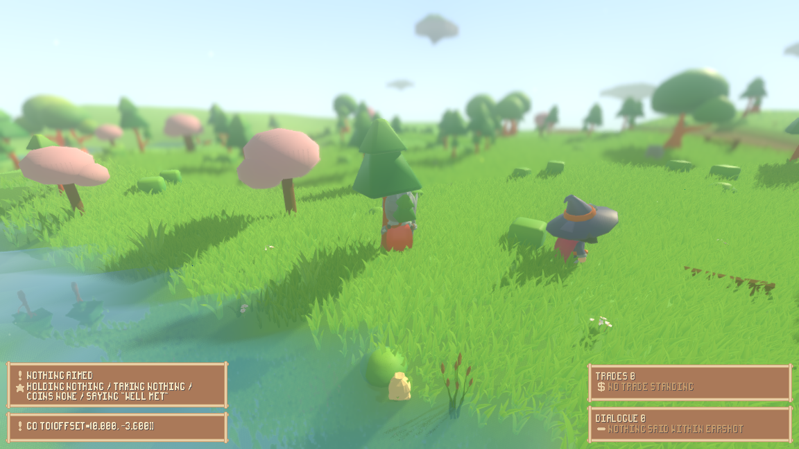
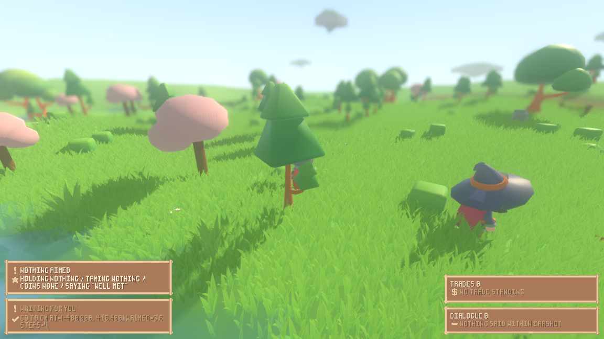

# A person walks at the speed everyone else walks

Pressing **W** used to issue a `go_to` of 3.6 units and be charged twenty ticks
for it — four ticks of walking and sixteen of standing still. Every character
the world drives itself walks 18 units on the same twenty ticks, because the
wandering rule's leg is exactly twenty strides long. So a person moved at 0.18
units a tick against everybody else's 0.90: a ratio of exactly five, measured at
seed 1234 and written down as
[the finding this item closes](../.lab/memory/files/playtest-cycle3656-evidence.md).

The gap was never in the walk, the animation or the follow camera. It was the
action catalogue charging one flat price for a journey of any length.

## The lever: a walk costs the strides it takes

`ActionCatalog.ROWS` still carries one number for `go_to`, and the number is
still twenty. What changed is what it means: it is now the **most** ticks one
walk may occupy, and what a walk actually costs is the strides it has to take.

  * `ActionEngine.strides_for(scene, actor, action)` counts them, in the very
    strides `Walk.stride` then takes — the character's own speed, the last
    stride ending as near as that walk has to get.
  * `ControlLoop.occupies(chosen, scene, actor)` reads that and clamps it into
    `[1, the row's number]`.

This is at the rule, not at the keyboard: `ControlLoop._commit` is the one place
in the project that charges an action a span, so every caller of the catalogue —
a person's key, a wanderer's leg, an enemy's approach, a written-down plan in a
suite — pays the same way. `render/player_controls.gd` is untouched apart from
the comment that used to explain the flat price.

It is the same reading the catalogue already gives a wait, from the other end: a
wait names its own duration and its row is the floor; a walk is as long as the
ground it crosses and its row is the ceiling. An action whose row cannot say
what it costs on its own is charged what it actually takes.

## Measured, at seed 1234, off the same trace lines

The same command as the first measurement, before and after:

```
xvfb-run -a ./run_render.sh --seed 1234 --scenario play --play --journal \
	--camera 0 5 10 --aim 1 --input 6:w --screenshot-ticks 8:...,12:...,16:...,20:...,28:...
```

| | the loop's own line | walked | span | units a tick |
|---|---|---|---|---|
| a person, before | `t=  9  Fen  began go_to(offset=(0.000, -3.600)), 20 ticks` | `walked=3.6 steps=4` at `t= 29` | 20 | **0.18** |
| a person, after | `t=  9  Fen  began go_to(offset=(0.000, -3.600)), 4 ticks` | `walked=3.6 steps=4` at `t= 13` | 4 | **0.90** |
| a self-driven character | `began go_to(target=(17.566, 3.927)), 20 ticks` | `walked=18.0 steps=20` | 20 | **0.90** |

Logs: [before](walk-pace-keyboard-before.log), [after](walk-pace-keyboard-after.log).

**The tolerance.** For this walk none is needed, and that is the point: both
numbers are exact. A stride is `ActionEngine.STEP = 0.9`, the key's step is
`WorldCast.LEG / 5 = 3.6`, and 3.6 is exactly four strides, so the person is
charged four ticks and covers `3.6 / 4 = 0.900` units a tick — the same 0.900
the snapshot reports for a wanderer on every tick of its own leg. The ratio
against the 0.90 a self-driven character walks at is 1.000, and no tolerance is
being spent to say so.

A tolerance is worth stating all the same, for the walks that are *not* a whole
number of strides — a person's `P` or `G` key, which aim at a place somebody
else chose. A walk aimed `d` units off is charged
`k = ceil((d - arrive) / 0.9)` ticks, where `arrive` is half a unit for a bare
position and `ActionEngine.REACH = 2.5` for a thing, and it covers
`min(k × 0.9, d)`. So its rate is exactly 0.900 whenever the last stride is a
full one, and at worst `((k - 1) × 0.9 + arrive) / k` when it is not: **0.80**
units a tick for a four-tick walk to a position, 0.88 for a twenty-tick one. The
floor is the arriving slack and nothing else, it never falls below it, and it
tightens as the walk gets longer.

## What it does to a character the world drives itself

`./tools/measure_walk.sh --seed 1234 --ticks 48` prints the followed character
tick by tick and interleaves the loop's journal. The whole diff, before against
after, is four lines — and none of them is a wanderer:

```
-        | t= 16  Scholar(-1,-1) began go_to(target=(-8.921, -24.363)), 20 ticks
+        | t= 16  Scholar(-1,-1) began go_to(target=(-8.921, -24.363)), 16 ticks
```

That is an enemy closing on somebody it has noticed. Sixteen ticks is sixteen
strides, so the walk is a little over fourteen units — an approach that stops at
`EnemyMind.STANDOFF` of its mark rather than a full wandering leg — and it is
charged the sixteen ticks it takes instead of a flat twenty. Every wanderer's
line is unchanged, byte for byte —

```
t= 21  Pip  finished go_to(target=(17.566, 3.927)) -> go_to ok at=(17.566, 3.927) walked=18.0 steps=20
t= 21  Pip  began go_to(target=(34.154, 10.917)), 20 ticks
```

— because `WorldCast.LEG` is eighteen units and a stride is nine tenths of one,
which is twenty strides exactly. The wandering rule was written against the
twenty-tick price and lands on the same number now that the price is counted
rather than quoted.

Logs: [before](walk-pace-selfdriven-before.log), [after](walk-pace-selfdriven-after.log).

## Walking still happens while it happens

The five frames of the keyboard walk, at the ticks the first measurement used,
measured the way it measured them: mean absolute grey difference over the world
band (rows 100–390, above the panels).

| pair | before | after |
|---|---|---|
| t=8 → t=12 | 19.25 | 19.26 |
| t=12 → t=16 | 2.06 | 1.85 |
| t=16 → t=20 | 1.59 | 1.86 |
| t=20 → t=28 | 1.68 | 0.99 |

The numbers barely move, and that is the finding rather than a disappointment:
it is the same walk, over the same ground, drawn the same way. What moved is
which of those frames are **inside the action**. Before, the span ran from t=10
to t=29, so the three still pairs above are three still pairs *while the action
was still running* — the picture stopped changing after the first four ticks of
a twenty-tick walk. After, the span runs from t=10 to t=13: the only sampled
frame inside it is t=12, the pair that moves, and by t=16 the person is standing
free to press a key again rather than standing out the other sixteen ticks of a
walk that finished.




The per-tick claim is held by the suite rather than by the pictures, because the
shell draws about one frame per 2.7 ticks under software rendering and cannot
show four consecutive ticks as four frames: `tests/test_control_loop.gd`'s
`_a_walk_costs_the_strides_it_takes` walks a person's own key press and requires
a full stride on each of the four ticks it is charged, and
`tests/test_walk_motion.gd`'s first claim requires the same of every tick of a
longer span.

## Where the fingerprint moved, and where it did not

**Unchanged**, all three quoted from the runs above:

| | before | after |
|---|---|---|
| `./run_headless.sh --seed 1234 --ticks 100` | `final=32656f55cc5eeb1c` | `final=32656f55cc5eeb1c` |
| `./tools/measure_walk.sh --seed 1234 --ticks 48` | `digest=0d12df32e51a9edf` | `digest=0d12df32e51a9edf` |
| the play run's stop line at tick 32 | `digest=b042275be0e88d0a` | `digest=b042275be0e88d0a` |

The world's own fingerprint is a fact about the observer and the ground under
it, and the observer walks the wandering rule's twenty-stride leg, which costs
what it always cost. The play run is the striking one: the person's walk now
resolves at t=13 instead of t=29, and by tick 32 it is standing in the very same
place, facing the same way, so the shell stops on the same digest.

**Moved**, each with its reason:

| transcript | before | after | why |
|---|---|---|---|
| `reports/scenario-evidence.txt` | `fingerprint 5a6f0b6962de3d2e` | `fingerprint c78c9c18a8c57e41` | the written-down plan's walks were 3.6 and 8.1 units and were charged twenty ticks each; the run now gets through the same plan 28 ticks sooner. `finished=91`, `changes=0`, `combat began=2` and `spoken to=2` are unchanged — the same actions in the same order. `reviews` falls from 53 to 48, because a review happens every five ticks *inside* an action and there are fewer idle ticks inside a walk to have one in. |
| `reports/check-evidence.txt` | `fingerprint 550e14813932bf8c` | `fingerprint 7d809c8c4e961180` | the difficulty-class run walks to four chests, 3.6 to 6.3 units apiece; the fourth check lands at tick 56 instead of 105. |
| `reports/goodwill-evidence.txt` | `fingerprint 1be825305c6e19fd` | `fingerprint c63f2c54b8085339` | the same: the errand-runner's walks are 2.7 to 4.5 units. One prompt digest moves with it, because the prompt says at which tick a thing was handed over. |

## What it cost elsewhere

Two things had to move with it, and both are named rather than folded in.

**The model recording.** The shipped model run asks its characters for a
decision whenever one is free, so cheaper actions mean more questions in the
same 160 ticks: 64 became 72, against a table of 73 rows, and one character's
fifteenth question found its positional fallback row already spent —
`the recording holds 73 replies and this is question 15, so there is nothing to
answer with`. That is the standing case for a live pass, written down in the
project's own recording decision: *budget a live `./run_record.sh --live` pass
for every change to movement, to action costs, or to servicing order.* One was
spent — `./run_record.sh --live --cast`, 83 replies recorded 2026-09-10 against
the same shipped model, every other table written back unchanged — and
`reports/agent-evidence.txt`, `reports/lesson-evidence.txt` and
`reports/goal-evidence.txt` were regenerated from it. The re-recorded run asks 78
questions and waits on none.

**One fixture.** `ScriptedWorld`'s written-down plan — five stops, each a walk,
a look and a wait — used to fill the orchestrator run's 150 ticks on its own.
It now finishes at tick 99, and the run's whole point is that the character keeps
acting while the world's dungeon master is thinking, so a character standing
about at tick 120 is the claim failing for a reason that has nothing to do with
the claim. The plan's last entry is now a wait as long as the run rather than one
of eight ticks. Nothing else in the fixture moved.

## The checks

```
$ ./run_tests.sh --layers-only
layer check: OK -- res://sim references nothing in the render layer
combat check: OK -- res://render draws the fight and holds none of it
interface check: OK -- res://render/ui names its art through sprout_pack.gd alone
asset check: OK -- res://sim names asset tags and no asset
```

Committed and pushed as `ac63731`. The whole suite is running headless as the
job `walk-pace-suite`, into `reports/walk-pace-full-suite.log`; the suites this
change reaches were run first and pass — control loop (138), walk motion (93),
actions (351), player input (130), turn seam (23), scenario (160), agent (1238),
checks (121), goals (133), goodwill (130), memory (106), orchestrator (282), and
the three that compare a rendered run against a headless one at the same seed:
render shell (58), atmosphere (156), grass (886).

## The one check it broke, and why

That full run came back at 66 of 67 suites: 212358 checks of 212359 pass, and
the one that does not is `test_ui_territory` —

```
FAIL  ui territory   63 checks, 1 failed
        - the ground under Wren did not read neutral before the trade
      expected: neutral ground
      actual:   owned by Rook
```

It is this change's own doing and not a flake. The same suite reads `PASS` in
the previous full run (`reports/window-fit-full-suite.log`) on `d29342c`, the
tip immediately before `ac63731`, and `ac63731` is the only commit since that
touches the simulation.

**The cause, measured rather than assumed.** The suite held two tick numbers
about the seed-1234 market run: `const NEUTRAL_TICK := 55`, "a tick on which
the ground under Wren is still neutral", and a comment saying the honoured
trade flips that same ground "past tick 62". Both are claims about how far a
seeded run has got by a given tick, and a walk that costs the strides it takes
gets that run through its plan sooner. `./tools/seeded_ticks.sh` — added here —
steps the run and asks `OwnershipField` about the ground under the followed
character on every tick, so the flip can be read off instead of remembered:

| | the tick the trade flips the ground under Wren | what `NEUTRAL_TICK := 55` then names |
|---|---|---|
| before, on `d29342c` | 62 | neutral ground, seven ticks of margin |
| after, on `ac63731` | 34 | ground Rook has owned for twenty-one ticks |

```
$ ./tools/seeded_ticks.sh --seed 1234 --scenario market --ticks 60
seeded ticks: seed 1234, scenario market, followed id 1 (Wren)
tick  ground                    best      considered  edges  fight
   1  neutral                   +0.000    5           0      -   <- changed
  34  owned by Rook             +0.108    5           1      -   <- changed
  59  owned by Rook             +0.129    5           1      on   <- changed
```

Nothing about the readout is wrong. The suite's premise had gone out of date,
and no fingerprint compares a number written in a test and no regeneration
rewrites one, which is exactly why this was the last place the knock-on showed.

**The fix is that the suite finds its own tick.** `NEUTRAL_TICK` is gone.
`TestUiTerritory._flip_tick()` steps a market run of its own — same seed, same
scenario, and this project's worlds are deterministic — and returns the first
tick on which the ground under the followed character stops reading neutral.
The check then builds its world one tick short of that and steps `LATER_TICKS`
past it. What is left written down is `SEARCH_TICKS := 240`, a bound on the
looking rather than an answer about the run: a bound cannot go quietly out of
date, because a wrong one fails loudly as "the honoured trade never flips the
ground under Wren".

The same check, before and after the suite change, on the current tip:

```
$ ./run_tests.sh test_ui_territory          # before
FAIL  ui territory   63 checks, 1 failed
        - the ground under Wren did not read neutral before the trade

$ ./run_tests.sh test_ui_territory          # after
PASS  ui territory   64 checks
```

The extra check is the premise itself, now stated. And the fix is at the cause
rather than tuned to the new number: the rewritten suite, dropped into a
worktree at `d29342c` where the flip is still at tick 62, passes the
neutral-ground check there too (its only two failures there are the pack's
icons, which that worktree has not imported).

**Whether any other test writes down a tick about a seeded run.** Checked over
the whole suite rather than left to the next full run to find. Every
`const …TICKS…` in `tests/` was read with its own comment, and they fall in two
groups. Most are *durations with slack* — "long enough for a leg to be chosen,
walked and asked again" — and those fail safe in the direction this change
moves: more happens per tick, so a budget that was long enough still is. Three
are claims about a particular tick of a particular seeded run, and all three
were re-measured:

| where | what it writes down | measured now | standing |
|---|---|---|---|
| `test_ui_territory.gd` | `NEUTRAL_TICK := 55`, "past tick 62" | flip at tick 34 | broken; fixed here by finding its own tick |
| `test_ui_readout.gd` | `FIGHT_TICK := 18`, `LATER_TICKS := 3` | encounter fight on from tick 16 to 23 | holds — 18 and 21 are both inside it |
| `test_ui_fit.gd` | `FIGHT_TICK := 16` | fight begins on tick 16 | holds |

The two that hold are left alone, and both are noted as the same fragility:
they are one action-cost change away from the failure this one had.

Two comments made false by `ac63731` were corrected where they sit, since they
describe the very thing that changed: `test_player_input.gd` and
`test_live_world.gd` each said a leg *costs* `ActionCatalog`'s twenty ticks.
It occupies at most twenty; the durations they justify are unaffected.
