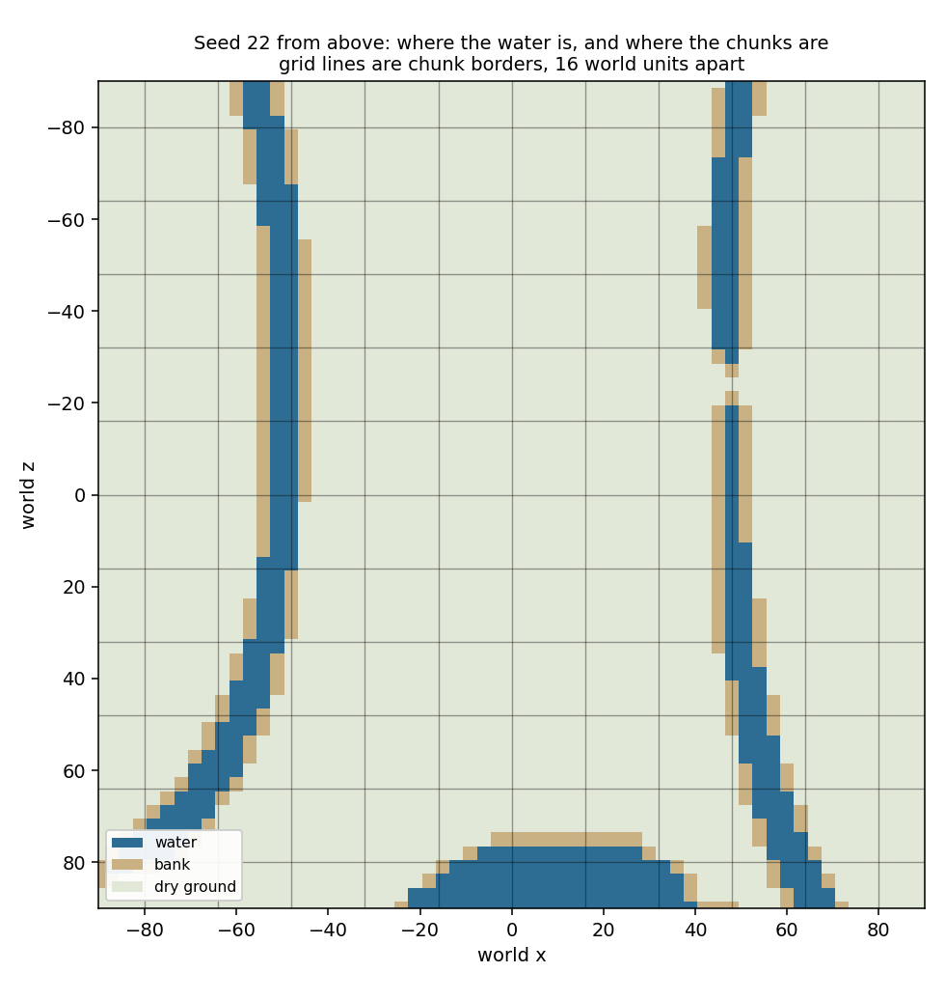

# Water: rivers, ponds and lakes on one world-space sheet

The world's third generation layer, over the ground's height and the biomes.
It carves the water out of the landscape, answers where the water and its banks
are, and draws all of it as a single animated surface with no tile boundary
anywhere inside it.

## What the layer decides

Two surfaces are computed for every world position, together, from that
position and the world seed alone:

* the **bed** — the ground you would stand on, which is the height field with
  the water's channels and basins cut into it;
* the **water surface** — how high standing or running water reaches there.

Everything else is read off those two. The **depth** is the surface above the
bed. Being **water** is having any depth at all. So the shoreline is not a
threshold anyone chose: it is the line where the two surfaces cross, and the
two can never disagree about a position being wet but having no depth.

Water comes from two sources sharing that arithmetic.

**Rivers** are the ridge of a noise field — the set of positions where the field
sits near its middle, which in two dimensions is a long sinuous band rather than
a blob. Along the band the ground is cut into a channel 2.4 units deep, and the
water surface follows the ground downhill a quarter-unit below it, so a river
reads as a stream in a gully however the land tilts. Towards the edge of the
band the surface falls away faster than the bed rises, and where they cross the
water stops — which is why a river tapers into its banks instead of ending at a
wall of water. Rivers thin out above a ground height of 2 and are gone by 7.5,
so summits stay dry and a stream tapers out towards its source.

**Ponds and lakes** are wherever the ground has fallen below the local water
table: a very broad, very smooth level sitting about 8.4 units below the ground's
average, wandering a couple of units either way, and lifted where the land is
wet. That lift is the only place the biome layer reaches into the water — a
marsh gets more standing water than dry country does for the same terrain.
Standing water is flat because the table is what it is level with, and a basin
deepens its own bed by up to 1.6 units so a pond is a pond rather than a puddle.

The numbers were chosen against the ground's own distribution. Over a
420-unit-square sample of seed 1234, water covers **8.3%** of the world — 6.5%
standing, 2% running. Below about 5% water stops being a feature of the
landscape; much above 10% and the land starts to read as an archipelago.

## Where the water is, from above

Seed 22, on the lattice the headless `--water` report prints, with the chunk
grid drawn over it. The two rivers are about ten world units wide and run the
whole height of the reported window; the western one alone occupies twelve
chunk rows, so it crosses **eleven chunk borders** inside this one picture. The
lake at the bottom is a basin the table has filled.



The tan fringe is the **bank**: dry ground with water within two units of it.
It covers 5.5% of this window against the water's 9.2%. Banks are what the
later layers will ask for — reeds and lily pads go on them, and a path that
meets one becomes a bridge — and asking here rather than working it out again in
each layer is what keeps them all agreeing about where the water's edge is.

## The same river, from the ground

The observer at tick 50 of that seed, standing on the western river's bank. The
river runs from the near edge of the built world to the far edge of it, across
six chunk borders in view, as one unbroken surface: no tile joins, no steps in
the water's height, no phase break in the ripples.


## The colour is the biome's

Water is one sheet, so its colour has to come from the position it is drawn at,
which means it belongs on the biome profile alongside the ground tint and the
fog. Each vertex of the sheet carries the blended water colour where it sits, so
water crossing a biome border changes colour the way the ground does.

A highland lake — pale grey-blue in cool, sparse country:


And the same machinery in a twilight marsh pocket, where the water is near-black
teal under dense teal fog:


## Why there is no seam

The sheet is built over a window around the viewer, but its corners sit on a
lattice fixed to the **world origin**, two units apart, and every corner's height
and colour is a function of that corner's world position and the seed. Three
consequences:

* A given world position is always the same corner at the same height, so the
  window can slide without the water moving under it.
* No boundary of anything — chunk, tile, or window — is inside the sheet for a
  seam to appear on. There is one mesh and one material for all the water in
  view.
* Two windows that overlap agree exactly about every corner in the overlap.
  That is the seamlessness stated as arithmetic rather than as a look, and the
  water suite asserts it directly: it builds two windows two steps apart and
  compares every shared corner.

The animation is world-space for the same reason. Every quantity in the water
shader is a function of world position and time, never of anything belonging to
the sheet, so rebuilding the sheet around a walking viewer does not shift the
ripples, and two stretches of one river are two windows onto one moving surface
rather than two animations side by side.

Cells with no water are skipped entirely, which is why a sheet spanning a
hundred and twelve metres of mostly dry country costs almost nothing. Where the
window ends, the water fades out over the outer sixteen units rather than
stopping on a line — beyond that is ground that may not be built yet, and a
straight edge of water lying over the end of the world would look worse than
water stopping a little short.

## What can be asked, and by whom

Everything goes through one `TerrainQuery`, which composes the height, biome and
water fields and is what the mesher, the tests and every later layer read the
ground through:

| Question | Answer |
| --- | --- |
| `ground_height_at(x, z)` | the carved ground — what the terrain is meshed at |
| `base_height_at(x, z)` | the land before water was cut out of it |
| `is_water_at(x, z)` | whether this position is water |
| `is_bank_at(x, z)` | dry ground with water within reach |
| `water_depth_at(x, z)` | the surface above the bed, zero on dry land |
| `water_surface_at(x, z)` | how high the water reaches, below ground when dry |
| `is_passable_at(x, z)` | whether ordinary ground movement can cross |
| `ground_at(x, z)` | all of the above at once, as plain values |

`is_passable_at` is false exactly where `is_water_at` is true. That is the
tactical layer's board-hole, recorded once here rather than twice: a cell most
pieces cannot enter, which the Frog will leap and which a unit on the bank can
be shoved into. The void under a floating island will become the second reason
for this to be false, and nothing that reads it will have to change.

## What the tests hold down

The water suite (`tests/test_water.gd`, 6358 checks) asserts:

* the same position gives the same answer from two fresh queries, from a query
  asked in a different order with four hundred unrelated samples in between,
  from a query whose mesher has built forty chunks, from a world thirty ticks
  into its walk, and from two separate headless processes;
* every wet position is genuinely cut into the height field, and depth is the
  surface above the bed everywhere, wet or dry;
* every bank is dry ground with water in reach, and banks are a small minority
  of dry ground rather than a synonym for it;
* passability follows the water exactly, and the composed `ground_at` agrees
  with each separate answer;
* one sheet spans at least four chunks, two overlapping windows agree on every
  shared corner, and rebuilding a window reproduces it exactly;
* a write into the world's own water moves the world fingerprint, and the same
  write through the sheet a viewer is handed does not.

## Numbers, in one place

| Quantity | Value | Why |
| --- | --- | --- |
| river field period / layers | 300 units / 2 | a river crosses a region rather than defining one; two layers keep the ridge a continuous line |
| river band edge | 0.972 | rivers about ten units wide |
| river channel depth / surface drop | 2.4 / 0.25 units | a gully you can see, with the water just inside it |
| river edge drop | 3.0 units per unit of band | closes the river off at its banks |
| rivers fade out between heights | 2.0 and 7.5 | summits stay dry |
| water table period / layers / swing | 520 units / 2 / ±2.6 | a table that wobbled would put lakes on hillsides |
| water table resting level | −8.4 units | 6.5% of the world as standing water |
| moisture lift | 2.4 units | wet country holds more standing water |
| basin feather / depth | 1.2 / 1.6 units | a pond rather than a puddle |
| bank reach / directions | 2.0 units / 8 | catches a channel from any angle, cheaply |
| sheet lattice / reach / window step | 2.0 / 56 / 16 units | smooth surface, as far as ground ever goes, rebuilt once per seventeen ticks of walking |
| opaque depth / maximum opacity | 1.8 units / 0.9 | shores fade, deep water still shows its bed |

## Reproducing the pictures

```
xvfb-run -a ./run_render.sh --seed 22 \
	--screenshot "$PWD/reports/assets/water-river-meadow.png" --screenshot-tick 50
xvfb-run -a ./run_render.sh --seed 29 \
	--screenshot "$PWD/reports/assets/water-lake-highland.png" --screenshot-tick 20
xvfb-run -a ./run_render.sh --seed 25 \
	--screenshot "$PWD/reports/assets/water-marsh.png" --screenshot-tick 24
./run_headless.sh --seed 22 --ticks 0 --water
```

The map above is that last command's output, drawn with the chunk grid over it.

## What this layer deliberately does not do

No bridges and no bank flora. Both want this layer's queries and neither belongs
in it: bridges are the path layer's, placed where a path meets water; reeds,
cattails and lily pads are the scatter layer's, placed on banks. Both ask
`TerrainQuery` rather than recomputing any of the above.

And no reflection. The water now mirrors the world beside it, but nothing about
that is here: the mirror is `render/water_reflection.gd`, it is a second view of
the scene rather than a fact about the world, and the simulation cannot tell
whether it exists. The one thing it reads from this layer is `table_level_at()`,
because the plane a planar mirror needs is exactly the level that standing water
is defined as being level with — see reports/atmosphere.md section 9.
