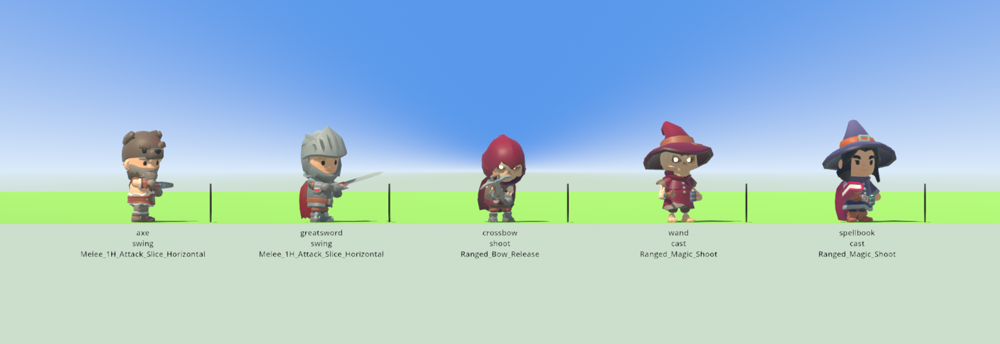

# Five silhouettes become five weapons

The art layer had run ahead of the combat catalogue. Five weapon shapes were
installed, imported and measured — an axe, a two-handed sword, a crossbow, a
wand and a spellbook — and nothing in the simulation could be any of them. The
missing half was never art: a shape is reached by a **word**, and a word with no
attack pattern behind it is a name no item can carry. So a tag added on its own
would have been a hole with a label on it.

This closes the gap from the catalogue side. Each of the five is now a weapon:
its own cells, its own wait in turns, its own motion, its own silhouette, and
the same one power budget behind it that every other item is bought with.

    ./tools/weapon_patterns.sh          # the table, the walk and the run below
    ./run_tests.sh test_weapon_patterns # 3,638 checks

---

## 1. The twelve

The catalogue shipped seven weapons and ships twelve. Read off the simulation by
`./tools/weapon_patterns.sh`; the last five rows are new.

| weapon | attack | cells | wait | share of its own item | movement | sprite | motion | properties |
| --- | --- | ---: | ---: | ---: | --- | --- | --- | --- |
| spear | thrust | 2 | 1 | 100% | instant | point | lunge | |
| dagger | stab | 2 | 1 | 100% | instant | blade | slash | |
| sword | cut | 3 | 1 | 38.46% | instant | blade | slash | |
| sword | cleave | 6 | 3 | 61.54% | instant | blade | swing | |
| bow | loose | 248 | 3 | 100% | projectile | arrow | shoot | |
| staff | fireball | 9 | 5 | 100% | instant | flame | cast | |
| flail | sweep | 8 | 1 | 100% | instant | impact | spin | |
| shield | shove | 1 | 2 | 0% | instant | impact | bash | push=1 |
| **axe** | hew | 6 | 3 | 100% | instant | blade | swing | push=1 |
| **greatsword** | arc | 8 | 3 | 100% | instant | blade | swing | |
| **crossbow** | bolt | 15 | 4 | 100% | projectile | bolt | shoot | |
| **wand** | magic missile | 104 | 3 | 100% | projectile | bolt | cast | split=3 homing=1 |
| **spellbook** | flare | 20 | 5 | 100% | instant | flame | cast | |

Not one new kind of anything. Every row is the same `Attack.compose` call the
first eight are, with different values in fields that already existed — which is
the test of whether section 4's "one composable base" was general enough, and it
passed it: the crossbow needed `projectile`, the axe needed `push`, and the wand
is the `magic_missile` composition that has been in the file since the base
landed, finally carried by a weapon somebody can be handed.

The "share" column is the share of the item's effects axis one blow takes. It
matters more than it looks: **for a weapon carrying one attack, the whole
effects axis goes to that attack whatever the damage column says**, so two
one-attack weapons forged at the same level and rarity deal exactly the same
damage per landing. A new weapon therefore *cannot* be an old one with better
numbers. What is left to differ with is the whole of what a weapon is here —
which cells, how long a wait, whether it has a front, whether it travels,
whether it splits or bends or shoves, and how many attacks one budget is divided
between.

### What reaches each of the five

| word | weapon | forged as | drawn as |
| --- | --- | --- | --- |
| `axe` | axe | common axe | `gear_axe` |
| `greatsword` | greatsword | common greatsword | `gear_greatsword` |
| `crossbow` | crossbow | common crossbow | `gear_crossbow` |
| `wand` | wand | common wand | `gear_wand` |
| `spellbook` | spellbook | common spellbook | `gear_spellbook` |

Three rows per shape, exactly as `gear_dagger` was added: a word in
`Weapon.shaped_like()` that reaches a pattern, a row in `ItemModel.BY_SHAPE`
that says what it is drawn as, a name in `AssetTags` and a model row in
`render/asset_library.gd`. One change of substance beside them: `Weapon.held()`
now records the shape word on the item it forges, so a catalogue weapon dropped,
picked up and equipped comes back as the same pattern instead of as a budget
with nothing to swing.

---

## 2. What each one beats, and what it loses to

Section 3.1 asks for a non-transitive space rather than a ladder, so each new
pattern has to be a trade and not an upgrade. Stated per weapon, and every
sentence below is a check in `tests/test_weapon_patterns.gd`:

**Axe** — the three cells in front, the two beside the wielder, one more up the
haft; three turns; the only blow in the catalogue that wounds and shoves at
once.
*Beats* anything that means to stand in contact: it covers the two flank cells
no sword attack reaches, and it drives what it hits a cell further out, out of
the reach of anything that only reaches one.
*Loses to* the sword on tempo — three cuts land in one axe's wait — and to every
pattern with reach. Its shove is worth a cell of ground and nothing at all when
there is nothing behind the target to be pushed into.

**Greatsword** — a rank of five cells at arm's length and a rank of three behind
it, three turns, one swing.
*Beats* armour. Defence is subtracted from every landing, so a budget arriving
as one blow keeps what the same budget arriving as three loses: against a
defence of five, one landing of 24 is worth 19 and three landings of 8 are worth
9 between them.
*Loses to* tempo and to width. The sword cuts on all three turns of its wait,
and eight cells is eight points of the movement axis for every turn shaved off
that wait, where the cut's three cells cost three.

**Crossbow** — a lane two to sixteen cells ahead, crossed rather than covered,
four turns.
*Beats* the bow at both ends of the range: the ring is five to ten, so a bow
cannot shoot anything closer than five nor reach past ten, and the bolt starts
at two and carries to sixteen.
*Loses to* the bow off the front — a ring is symmetric and an archer never has
to turn — and to anything standing in the lane, because a bolt crosses every
cell on its way and whatever is in the fifteen of them takes it instead.

**Wand** — the magic missile: a ring two to six cells, a projectile that splits
three ways and bends one cell to find something, three turns.
*Beats* a scattered crowd and anybody standing just off the pattern.
*Loses to* armour, by exactly the arithmetic the greatsword wins by, and to
anything that closes: the ring starts two cells out, so a wielder in contact has
nothing at all.

**Spellbook** — everything within two cells of the caster, in every direction,
every fifth turn. The greatsword's arc turned the whole way round.
*Beats* a swarm that has closed: twenty cells and no front to be flanked or
backstabbed around.
*Loses to* distance and to time. It reaches two cells and not one more, so a
staff's fireball at four and a bow's ring at ten are both looking at a caster
who cannot answer; five turns is the longest wait there is, and twenty cells
makes it the dearest wait in the catalogue to buy down.

### The walk, and the one pair that does dominate

Prose is cheap, so the claim is arithmetic. One attack **dominates** another
when it covers at least the same cells, waits at most as long, is worth at least
as much per landing, and shoves at least as far — strictly better on one of the
four. One weapon dominates another when every one of the second's attacks is
dominated by one of the first's, which is the honest unit: a person equips a
weapon, not an attack. All 132 ordered pairs of the twelve are walked:

    the domination walk: 132 ordered pairs of 12 weapons
      flail over dagger

**No pair with one of the five in it dominates, either way.** The one pair that
does is older than this work and is reported rather than patched: a flail sweeps
all eight cells around itself every turn, a dagger stabs two of those same eight
on the same turn, and at equal budget two one-attack weapons deal equal damage —
so there is nothing a dagger does that a flail does not. Fixing it means
changing what a dagger *is*, which moves every seeded scenario that hands one
out, so it is written into the suite as a known answer instead: a sixth weapon
falling into the same hole now fails a test.

Two near misses are worth recording, because they are what the relation was
sharpened on. The greatsword's arc *does* dominate the sword's own cleave —
same cells, same wait, the whole budget instead of sixteen parts of twenty-six —
and the sword survives on its cut, which comes round three times as often. And
the wand's ring covers every cell of the staff's fireball on a shorter wait,
which looked like domination until the split was counted: the missile divides
its damage three ways before any defence is subtracted, so one third of the
budget arrives at a time where the fireball's whole share arrives at once.

---

## 3. The budget, and the frontier

Nothing here adds a way to make an item worth more.

* Every new shape, forged at six levels across all six rarities — 180 items —
  has `movement + defence + effects` equal to `rarity × level` exactly, and
  spends its whole effects axis on its blows with no point lost between them.
* No attack comes round faster than once a turn however much movement is bought.
* A weapon whose blows are worth nothing still divides nothing among them: a
  legendary shield deals 0, a legendary axe does not.
* Section 5's ceiling still holds for all of them, across eight rings: an item
  from ring $d$ is worth at most $C(d) = 32 \times L(d)$, the next ring's
  ceiling is strictly higher, and the best new-shape item of a ring hits that
  ring's ceiling exactly — so the bound is tight rather than generous.

Gear stays bounded by what has been defeated, because a shape spends the budget
and never adds to it.

---

## 4. One seeded run: held, swung, landing

Five commanders on the measured meadow at seed 1234, one new weapon each, in a
west-to-east line six world units apart — two cells of the tactical lattice.

Two cells is chosen, not stumbled on: every one of the five patterns covers the
cell two cardinal steps ahead of its wielder — the near end of the crossbow's
lane and the wand's ring, the far end of the axe's haft, the greatsword's arc
and the spellbook's burst — so everybody can strike a neighbour from where they
are put down and the board's chooser moves nobody. A ring of five, which is how
the seven-weapon run stands, leaves whoever has the shortest reach standing
still all fight with its nearest enemy inside somebody else's pattern and
outside its own: at a radius of ten, four of the five swung and the axe never
once.

    the seeded fight: seed 1234, 240 ticks, began=true, 58 blows
      weapon      swung landed    cells    dealt motion
      axe            13    13        6       54 swing
      greatsword     14    14        8       58 swing
      crossbow       10    10       11       40 shoot
      wand           13    13      104      104 cast
      spellbook       8     8       20       64 cast

Every swing lands, and the cadence is the catalogue's own: the spellbook's five
turns buy it eight blows where the greatsword's three buy fourteen. The
crossbow's lane shows as eleven cells rather than fifteen because the board
clips what falls off its edge, which is the same clipping every pattern gets.

The frames, named: the first blow of each, with the clip the render layer would
have drawn it with — read off `CombatDiorama.placements()` and
`CharacterView.clip_for()`, the two calls the shell itself makes.

| weapon | first blow | motion tag | clip drawn |
| --- | ---: | --- | --- |
| axe | t=1 | `swing` | `Melee_1H_Attack_Slice_Horizontal` |
| greatsword | t=2 | `swing` | `Melee_1H_Attack_Slice_Horizontal` |
| crossbow | t=3 | `shoot` | `Ranged_Bow_Release` |
| wand | t=4 | `cast` | `Ranged_Magic_Shoot` |
| spellbook | t=5 | `cast` | `Ranged_Magic_Shoot` |

And the same run photographed at tick 35, when all five are mid-swing:

    xvfb-run -a ./tools/swing_sheet.sh --patterns --cell 4.6 \
        --screenshot-ticks "35:$PWD/reports/assets/weapon-patterns-tick-35.png"

The armoury scenario holds every catalogue shape in somebody's hands, so it grew
from seven bearers to twelve. `./tools/held_items.sh` reads the sockets off the
snapshot:

    Greatsword common greatsword gear_greatsword gear_greatsword -
    Axe        common axe        gear_axe        gear_axe        -
    Crossbow   common crossbow   gear_crossbow   gear_crossbow   -
    Wand       common wand       gear_wand       gear_wand       -
    Spellbook  common spellbook  gear_spellbook  gear_spellbook  -

    xvfb-run -a "$GODOT" --path . --resolution 1800x700 --fixed-fps 30 -- \
      --seed 1234 --scenario armoury --camera -3 6.5 22 --aim 0.62 \
      --fov 38 --focus 23 --no-grass --screenshot-ticks "6:...armoury.png"

### Five faces for the bag

A shape a person can be carrying is a row in a bag, and a row in a bag has to
have a face: the inventory panel draws a sixteen-by-sixteen icon per gear tag out
of `render/ui/pixel_icons.gd`. Five were drawn — a broad-bladed greatsword, an
axe head on a haft, a crossbow's limbs over its stock, a wand with a lit tip and
a spellbook — each its own sixteen rows rather than a re-use, because telling one
row from another at a glance is the whole job of a face. A wand pointing at the
staff's icon would be the mistake `gear_dagger` was drawn to undo.

---

## 5. The forge still does not draw them, and why that is written down

`ItemForge.HAND_SHAPES` is the list a *randomly forged* held item is drawn from,
and the five are deliberately not in it. This is the recorded reason rather than
an oversight.

Adding a word there changes the shape drawn for **every seeded item in the
world**, because the draw is an index into that list. That renames the items
characters carry — `common buckler` becomes `common axe` — and those names are
written into the observation packets that go to a language model, whose replies
are recorded under the sha256 of the prompt they answered. So the one-line change
invalidates every recorded model run in the project and has to be paid for with
a live pass. It is worth doing and it is not free, so it is named in
`sim/weapon.gd`, in `sim/item_model.gd` and here, rather than smuggled in beside
the patterns.

Until then the five are reached by name — a scenario that hands one out, an item
that records the shape — which is how `gear_draught` has always been reached and
is a real path, not a stub.

---

## 6. What moved, and what did not

* **The seed-1234 world fingerprint is `32656f55cc5eeb1c`, unchanged.** Nothing
  in the default headless run's path was touched: the forge draws what it drew,
  the seven old patterns are the numbers they were, and no scenario the default
  run sets out gained anybody.
* `tests/asset_check.gd` passes unchanged — the simulation still names tags and
  never a model path. All four structure checks are OK: sim names nothing under
  render, render holds none of the fight, the interface names its art through
  one file, and sim names asset tags and no asset.
* The suite gained `tests/test_weapon_patterns.gd` (3,638 checks).
* **The full suite was run with the change in place: 73 suites, 217,363 checks,
  five suites failing.** Two of the five were this work's own bookkeeping and are
  fixed and re-run green — `combat pieces` (the list of which attacks have a
  front: nine now, and the four symmetric ones are named beside them) and
  `ui panel` (the five new faces, and a check that used `gear_axe` as its example
  of *a tag nobody drew*, which it no longer is). The other three predate this
  work; see below. Everything touched after the full run — `pixel_icons.gd` and
  two test files — was re-run suite by suite: combat pieces, ui panel, ui
  readout, ui exchange, ui territory, ui fit, ui digits, panel words and
  character sheet all pass.
* Three numbers other suites compare moved, each for a stated reason:
  `GEAR_ON_A_MODEL` 9 → 14 (five rows that could not be written before),
  `SHIPPED_ITEMS` 49 → 54 (the rack grew by five), and `SHIPPED_FALLBACKS`
  7 → 6 — the volley's wand used to lie on the ground as an anonymous bundle
  because no model row had earned its shape word, and now it lies down as a
  wand. That is the fallback rule retiring a case the only way it ever should.

---

## 7. Three failures this run found and did not cause

The full suite is red, and was before this item started. All three are named here
with what each would cost to fix, because the next two planned items — a playtest
and a review — will walk straight into them.

**`test_scenario`** — the checked-in transcript `reports/scenario-evidence.txt`
is stale. Commit `0db797d` ("A blow struck by hand says what it did, in the
simulation's own words") added the target's name to a resolved attack, so the run
now prints `attack ok target=Bram attack=thrust ...` where the transcript says
`attack ok attack=thrust ...`. Five lines differ and nothing else does; the fix
is to regenerate the transcript from `./run_scenario.sh`, and to note that its
sha256 — quoted in the work result that produced it — moves with it.

**`test_agent`** — the same wording reaches a language model. A character's own
log line goes into its prompt, and `net/model_recording.gd` answers by the
sha256 of the prompt it was asked, so the recorded run now misses: *"Odo: this
reply was recorded for another question: the prompt put here fingerprints
55b5d45199928b02 and the recorded one 960dfa4c11d560df"*. This one cannot be
repaired by regenerating a file. It needs a **live model pass** to re-record, or
the wording change reverted. It is the exact cost that kept the five new shapes
out of the forge's draw list in section 5 — the same trap, sprung two commits
earlier.

**`test_walk_motion`** — the mover scan, which reads every `.gd` file in the
project for anything that *adds to* a character's ground coordinates, now finds
three files instead of two. The third is `tools/measure_ui.gd:500`,
`pen.x += font.get_glyph_advance(0, size, glyph).x` — a text cursor and not a
character, added by commit `9c94d8d`. Either the workbench advances its pen as a
whole vector, or the scan learns that a `pen` is not a person; the check itself
is sound and should keep its teeth.

None of the three is touched here. They belong to the commits that made them and
to a decision about buying a live pass, and quietly folding them into an item
about weapon patterns would hide both.
