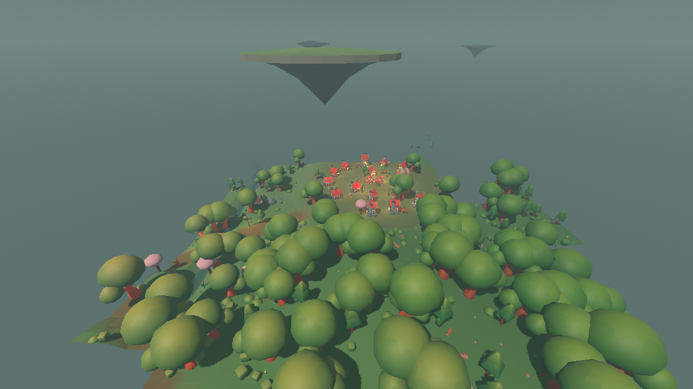

# A lit window on every building

Villages glow again. Every building a settlement lays out carries one or two
`window_glow` — a tag that was in the catalog with nothing placing it — and the
render layer draws each one as a small warm emissive pane with a point light
behind it, through the same glowing-tag path a lantern post and a campfire
already went down.



This is the settlement layer's whole part in the art direction's signature:
*cool ambient punctuated by warm pinpoints*. The village had it while the
buildings were coloured primitives — each placeholder had an emissive amber pane
modelled into it — and installing the KayKit packs took it away, because the pack
buildings have windows drawn but not lit. Same seed, same camera, all three
states:


```
xvfb-run -a ./run_render.sh --seed 1234 --start -100 34 --paused \
	--screenshot "$PWD/reports/assets/world-window-glow-village.png" \
	--screenshot-frame 120
```

The top two panels are `reports/assets/world-before-village.png` and
`reports/assets/world-after-village.png` from the asset-pack work, cropped to the
same rectangle. The lighting is bright daylight in all three: the cool ambient
grade that makes a warm pinpoint *sing* is the atmosphere task's, and this is
what the warm half looks like waiting for it.

---

## The decision

**The simulation decides which wall and where along it. The render layer decides
everything else, including how far off that wall the pane really stands.**

That last clause is the only interesting part, and the reason for it is
measurable rather than a matter of taste.

### What the simulation places

`sim/settlement_field.gd` gained `_place_windows()`. For every building except
the well:

* one window on the **front** face — the one the layout already turned towards
  the green, so a village seen from its middle is all lit windows;
* a second on one **gable end** for a building with at least 7 square units of
  reserved ground, which is half its width times half its depth. A house (7.8), a
  workshop (7.25) and a tavern (14.0) qualify; a cottage (4.4) and a tower (4.4)
  do not, so a village reads as a scatter of warm points rather than a ring of
  evenly spaced pairs;
* placed on that face of the building's own **reserved rectangle**, at a share
  along it rolled from the village's seed, which reaches at most 45% of the way
  out to a corner, so a window is never in one;
* with a `yaw` that is the outward normal of the face it is on — the same "local
  +Z is the way a thing looks" convention every building and prop already uses,
  so whoever draws it knows which way the pane faces without being told
  separately.

That is **20.6 lit windows per village**, measured over 39 villages on eight
seeds, against 5 lantern posts and 1 campfire.

Nothing in that file has seen a model and it cannot: `./run_tests.sh
--layers-only` still prints `asset check: OK -- res://sim names asset tags and no
asset`. A window is a `window_glow`, and what a `window_glow` looks like is one
row in the render layer's table.

The glows live in their own list on `Settlement` rather than among the props,
because a glow is not dressing — it belongs to a building, and each one carries
the index of the building it is on. That index is what lets the render layer fit
the point to the right model without having to guess which building a point in
space belongs to.

### Why the render layer moves it

A reserved rectangle is deliberately roomier than whatever ends up standing in
it — `sim/settlement_field.gd` says so in as many words: *"set a little larger
than the placeholder models so that a swapped-in pack has somewhere to go."* So
a point on the rectangle's facade is not a point on the model's wall. Measured
against the installed models, at first-storey height:

| tag | face | reserved facade at | wall the fit uses | slack |
| --- | --- | --- | --- | --- |
| cottage | front | 2.20 | 1.51 | 0.69 |
| cottage | right | 2.00 | 1.20 | 0.80 |
| cottage | left | 2.00 | 1.20 | 0.80 |
| house | front | 3.00 | 0.88 | 2.12 |
| house | right | 2.60 | 1.41 | 1.19 |
| house | left | 2.60 | 1.46 | 1.14 |
| workshop | front | 2.50 | 0.42 | 2.08 |
| workshop | right | 2.90 | 2.25 | 0.65 |
| workshop | left | 2.90 | 2.39 | 0.51 |
| tavern | front | 3.90 | 1.37 | 2.53 |
| tavern | right | 3.60 | −0.22 | 3.82 |
| tavern | left | 3.60 | 1.95 | 1.65 |
| tower | front | 2.10 | 1.67 | 0.43 |
| tower | right | 2.10 | 1.45 | 0.65 |
| tower | left | 2.10 | 1.45 | 0.65 |

A pane left where generation put it would hang between 0.43 and 3.8 world units
off the side of the building — on a tavern that is wider than a whole cottage of
empty air. There is no single fraction of the footprint that fixes it either: the
wall stands at between −6% and 82% of the reserved reach depending on which tag
and which face.

That negative row is the tavern's right side, and it is worth a sentence because
it is not a mistake. The model is L-shaped, and the only flat piece of wall on
that side is in the inner corner, 0.22 *behind* the building's own middle. The
pane goes there and the check below confirms it can still be seen from outside —
a lit window looking into a courtyard, which is a perfectly ordinary thing for a
tavern to have.

**A facade point on the model cannot be derived from what the settlement layer
knows.** The work item's stop condition anticipated exactly this and asked for it
to be reported rather than papered over by naming a model under `sim/` — so it is
reported here, and the fix keeps the layer split rather than breaking it.

The fix is the split that `natural_height()` already uses. Generation asks in the
units it thinks in — "a fir seven units tall", "a window on this wall, this far
along it" — and the asset table, which is the only file in the project that has
seen a model, does the arithmetic that turns that into where the art goes.
`AssetLibrary.window_glow_point()` takes the building and the glow, recovers the
two things generation really decided (which face, and the share along it), and
puts them on the wall the model actually has there.

## Finding the wall

Naively: take the outermost point of the face and call that the wall. That fails,
and the failure is instructive — a building is not a box. The installed tavern
has a wing standing 1.8 in front of the boards beside it; the house has mullions
0.14 proud of its wall; the tower is round with a canopy over its door; and every
model's bounding box is its *roof*, whose eaves on the house reach 2.06 where the
wall under them is 1.07. Placing a pane on the outermost point put it on the
canopy and left its corners hanging up to 0.55 off the stonework.

So a face is measured as a **depth map**. `AssetLibrary._depth_map()` slices the
face into cells 0.05 across and 0.05 up, over the whole band of heights a window
may sit in, and rasterises every triangle of the model into it, each cell keeping
the outermost surface over it. Rasterising rather than looking at vertices is the
point: a low-poly wall is one quad with four corners and nothing in between, so a
vertex-only measurement finds no wall at all in the middle of one.

A pane may then go where all of its own 9×9 cells are covered and the deepest and
shallowest differ by no more than 0.16, which is "flat wall its own size". 0.16
rather than something tighter because these walls are timbered: at 0.08, eight of
the fifteen faces have no legal spot at all. At 0.16 a pane may lie across
framing, sitting at the framing's own depth with the boards 0.15 behind its
corners — which is what a window in a timber frame looks like anyway.

Two more things fall out of the map:

* **The storey.** The fit tries 1.25, 1.55, 1.85 and 2.15 in that order and takes
  the lowest with anywhere to put a pane, so a cottage is lit at head height and
  the tower — whose ground floor is all canopy — one storey up. The render shell
  lifts the whole node, so the light rises with the pane.
* **The share.** Generation's share does not land on the wall proportionally; it
  picks among the legal spots, in order across the face. A share of −1 is the
  leftmost such place and +1 the rightmost. A wall with one good spot puts every
  window in it rather than sliding some of them onto a beam.

If a face had no flat spot at any storey the least uneven place on it would be
used, rather than leaving the pane where generation put it. As the models stand
that path is never taken: all fifteen tag-faces find real flat wall, fourteen of
them on the first storey and the tower's front — whose ground floor is all
canopy — on the third. The automated check below bounds how bad the fallback
would be allowed to be if a future pack needed it.

The whole measurement is cached per tag and per face, so a village asks it
fifteen times in the life of a process and never again.

## The pane and its light, with the numbers

| | value | why |
| --- | --- | --- |
| pane size | 0.45 × 0.45 | One window of a building four to eight units tall. Small also means it fits flat in more places on a hand-made model, which is what the fit spends its time looking for. |
| pane colour | amber `(1.00, 0.72, 0.36)`, emission 2.4 | The placeholder's own window colour, kept, so the two read as the same thing. |
| standoff | 0.05 | Enough that a flat pane never fights the wall for the same depth, and enough to clear the bulge of a round tower's facets across the pane's width. Not so much that it reads as a sign hung off the wall. |
| light height | 1.25 above the building's floor, riding with the pane | The middle of the pane, so the light comes out of the window rather than from above or below it. |
| light colour | `(1.00, 0.76, 0.42)` | Between the lantern's flame `(1.00, 0.74, 0.40)` and the amber of the pane. Hearth-light through glass is warm but not as orange as an open flame. |
| light energy | 2.0 | The weakest of the four glowing tags — a lantern post is 3.2, a campfire 4.0 — because there are far more of them. Twenty-odd windows at a lantern's strength would wash the green flat. |
| light range | 8.0 | The shortest of the four; a lantern post reaches 12 and a campfire 14. A window should pool on its own wall and the ground under it. It also caps how many windows can reach one surface, which is what the cost below rests on. |

Height, colour, energy and range all live in `render/main.gd`'s `GLOWING_TAGS`,
next to `lantern_post`, `hanging_lantern`, `campfire` and `glowing_orb`, and the
light is hung by the same `_warm_light()` those four go through. Adding the row
is the whole of the render-side lighting change.

## What it costs

`./tools/measure_lights.sh` runs the render shell itself — not a stand-in — waits
for the world to settle, samples 150 frames, then deletes every `window_glow`
node and its light and samples 150 more. The two passes differ by exactly the lit
windows and by nothing else. Three consecutive runs of each:

| | one village (seed 1234) | two villages (seed 101) |
| --- | --- | --- |
| villages loaded | 1 | 2 |
| **lit windows** | **19** | **29** |
| omni lights, with / without | 32 / 13 | 49 / 20 |
| draw calls, with / without | 1450 / 1408 | 1171 / 1097 |
| objects in frame, with / without | 2155 / 2113 | 1858 / 1784 |
| frame ms (median), without | 93.5, 92.9, 93.4 | 77.3, 76.9, 77.1 |
| frame ms (median), with | 96.2, 95.7, 96.0 | 78.6, 78.3, 78.5 |
| **added by the lit windows** | **2.7 ms (+2.9%)** | **1.4 ms (+1.8%)** |

Two honest caveats on those milliseconds. This machine has no GPU: the renderer
is falling back to software rasterisation at about ten frames a second, so the
absolute numbers are not the game's frame rate and the *percentage* is what
carries across. And a point light's real cost is the lit area it covers rather
than the count of lights — which is why 29 windows across two villages cost less
in total than 19 in one. The two-village view is looking at both from further
off, so each window covers fewer pixels; the one-village view is standing in it.
A village walked right into is the expensive case, and it costs about 3% of a
frame.

The count is the number that carries to any machine, and it is the one the
atmosphere stack needs: **a village adds about 21 point lights where it used to
add 6.** The streamer bounds the total. `SettlementStreamer.LOAD_RADIUS` is 90
units and no two villages are closer than 130 apart, and scanning a 20-unit grid
across ten seeds never finds a point with more than **two villages inside the load
radius — 47 lit windows at the worst point found**. So the worst case the
streaming radius allows is a little over **fifty warm point lights in the scene,
about forty of them lit windows**.

That is the budget the atmosphere task inherits before it adds fireflies, drifting
orbs and per-biome fog.

## What is checked automatically

`tests/test_window_glow.gd` — 8487 checks, in `./run_tests.sh`. Two halves, split
the way the layers are.

**What the simulation placed**, checked with no model in sight: every building but
the well lights a window; every window names `window_glow` and a real building of
its own village; every window sits exactly on one of that building's four faces
and no further than 45% of the way out to a corner; the same seed asked twice
lights the same windows; and moving one changes the village's fingerprint, so a
village whose windows moved could not slip past the determinism checks.

**Where it lands on the model**, checked against the installed art. 252 distinct
placements — every catalog building tag, on all three faces a window may go on,
right across each face, plus every placement the 29 villages in the sample
actually produced — are pulled apart against the model's own triangles:

* every corner of the pane is within **0.25** of the model's surface, by
  point-to-triangle distance. Worst measured: **0.201**, at the far end of a
  cottage's side wall, where the pane sits on the corner framing and its outer
  corners overhang the boards behind it.
* a ray coming in along the wall's own normal reaches the pane without hitting
  the model first. That is "not buried in the mesh" asked exactly, by
  ray-triangle intersection, rather than estimated — and it is the check that
  matters, because a pane a hand's breadth *inside* a wall passes a distance test
  and is invisible.

Neither can be passed by accident: a pane in mid-air fails the first, a pane
inside the wall fails the second, and a pane on the roof fails both.

The rest of the evidence:

| Claim | Evidence |
| --- | --- |
| Generation still names tags and no art | `asset check: OK -- res://sim names asset tags and no asset` |
| The simulation still cannot see the render layer | `layer check: OK -- res://sim references nothing in the render layer` |
| The headless world moved, as it must | seed 1234 / 100 ticks: `3fe6b0a686f7e81b` → `aa8a64989a9ae1fd`; seed 7 / 40 ticks: `7956ca8a3d4bf8ff` → `5b7c409772442bc3` |
| ...and reproduces across processes | both new fingerprints identical in two separate runs |
| ...and a village reloads identically | `tests/test_settlements.gd` unloads a village, walks away, comes back and compares fingerprints — which now carry the windows |
| Headless creates no light and no visual | `assets visual-files found=1401 loaded=0`, `assets render-scripts found=4 loaded=0`, with `assets sim-scripts found=28 loaded=28` as the control |
| Every suite passes | 13 suites, 32020 checks |

Seed 7 is quoted at tick 40 rather than at its 50th for a reason worth saying
out loud: at tick 50 that walk has no village within the load radius, so the
world's fingerprint at that instant carries no settlement at all and is unchanged
by this work (`f7cf6841b777071a` before and after). Every tick of that walk that
does have a village loaded moved.

---

## What is still open

* **A village never actually has a workshop.** The wish list asks for one and the
  layout puts it in the slot next to the tavern, where the two footprints always
  overlap and the workshop is dropped by the spacing rule — 0 workshops across 29
  villages on six seeds. That is a layout question and this work was scoped to
  the window glow alone, so it was measured and written down rather than changed.
  The workshop's *model* is still checked by the suite above, so a layout fix
  would not have to revisit the lighting.
* **Interiors are not lit.** A window is a pane on the outside of a solid model.
  Buildings have no interiors by the design, so there is nothing behind the glass
  and nothing to see through it.
* **Daylight.** In the current bright grade a lit window is a small warm speck.
  Cool ambient, dusk and bloom are the atmosphere task's, and they are what turn
  these into the pinpoints the reference images are built around.
* **A window is drawn, not modelled.** The pane goes on flat wall, which may or
  may not be a window the artist drew. Matching a pane to a modelled window
  opening would mean reading the model's texture, not just its geometry.
