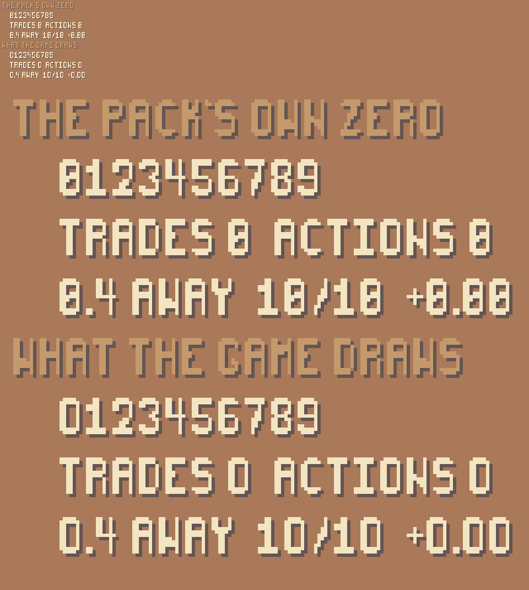
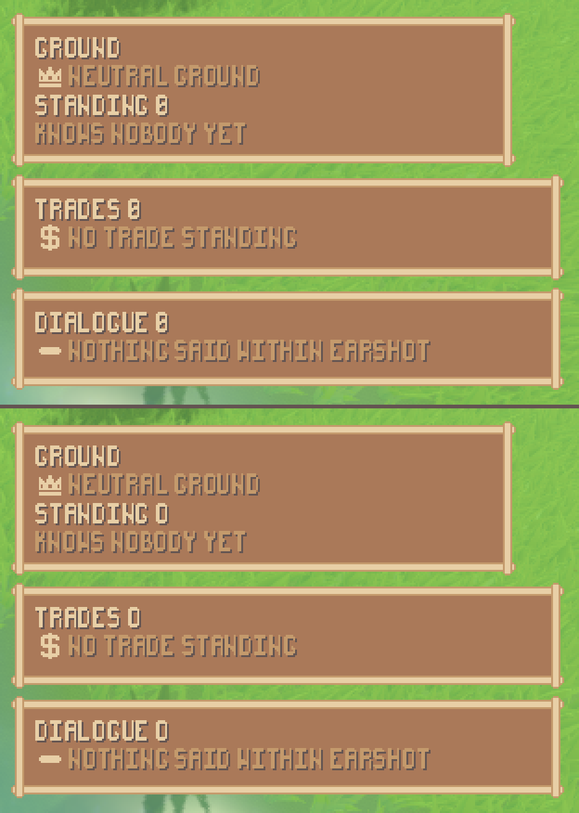

# A zero is not an eight

The interface is drawn with the Sprout Lands pack's own pixel font, and that
font's `0` is a slashed zero whose slash meets both walls of the counter. At the
size the game ships at the middle closes completely: the glyph ends up with two
enclosed holes, which is exactly what an `8` has, and five pixels out of a
hundred and four are all that separate them. Every health total, coin count,
distance and round number in this game is drawn in that font, so every number on
screen was ambiguous. On the frames the second playtest took, `TRADES 0` reads
`TRADES 8` and a pile `0.4 AWAY` reads `8.4 AWAY` — a wrong number rather than a
hard-to-read one.

```
./tools/extract_sprout_lands.sh                                # the pack (the user's own zip)
./tools/measure_ui.sh --digits reports/assets/zero-glyph.png   # the ten digits, before and after
./run_tests.sh test_ui_digits                                  # ...and the check that keeps them
```



The top half is the pack's own zero. `TRADES 0 ACTIONS 0` reads `TRADES 8
ACTIONS 8`, and `0.4 AWAY 10/10 +0.00` reads `8.4 AWAY 18/18 +8.88`. The bottom
half is the same three lines in the same font at the same size, with the one
glyph changed.

---

## 1. What was chosen, out of the three that were open

**A larger whole-number scale does nothing.** The font's `oversampling` is pinned
to 1.0, so a glyph is rasterised once at its nominal size and the canvas
magnifies that bitmap with a nearest-neighbour filter — which is what makes a
pixel of the art a whole number of pixels on the screen at any scale. A bigger
interface is therefore the same closed middle, bigger. Rasterising at a larger
*nominal* size does not help either: the zero has two enclosed holes at 14, 18,
21 and 28 alike, because the slash is drawn touching both walls at every one of
them. And the interface is at scale 1 in the first place because that is what
fits the window the game ships in; going back to 2 would undo the work that got
every panel inside that window.

**A second face from the pack does not exist.** The pack ships one font,
`pixelFont-7-8x14-sproutLands.ttf`, and the bitmap it was drawn from beside it.

**So: a different glyph** — and the glyph is the pack's own. Its capital `O` is,
pixel for pixel, its `0` with the slash lifted off: ten pixels on the artist's
own 8×14 cell, six in the raster the game draws. The unslashed ring was already
in the pack, drawn by the pack's hand, on the pack's grid.
`SproutTheme.unslash_the_zero()` points the digit at it, in the font's own glyph
cache, at both sizes the interface draws at.

Nothing was drawn, so the pack's sixteen-pixel rule has nothing to answer to
here; nothing entered the repository and nothing of the pack's left it, which its
licence forbids even for a modified copy. The text the panels hold still says
`0` — only the pixels it is drawn with change — so nothing the simulation says is
rewritten, and no panel has to remember to call anything. The three switches that
keep a pixel font crisp are untouched: antialiasing off, hinting off,
oversampling pinned, and both sizes still whole multiples of the font's own
fourteen-pixel cell.

The cost is that a zero and a capital `O` are now the same shape. That is the
usual bargain of an unslashed zero and it is the right way round here: this font
maps lowercase to the same glyphs, so the interface is drawn in capitals either
way; a digit and a letter are never in the same slot; and mistaking a `0` for an
`O` loses a reader nothing, where mistaking it for an `8` gives them a wrong
distance to walk.

---

## 2. The measurement

A reader tells round glyphs apart by counting holes long before reading any
curve, so a zero with two holes is an eight however many pixels it differs by.
Both numbers, at the size the interface ships at, from
`./tools/measure_ui.sh --digits`:

| | 0 | 1 | 2 | 3 | 4 | 5 | 6 | 7 | 8 | 9 |
| --- | --- | --- | --- | --- | --- | --- | --- | --- | --- | --- |
| holes, the pack's own | **2** | 0 | 0 | 0 | 0 | 0 | 1 | 0 | **2** | 1 |
| holes, what the game draws | **1** | 0 | 0 | 0 | 0 | 0 | 1 | 0 | **2** | 1 |
| pixels from the `8`, the pack's own | **5** | 38 | 25 | 10 | 32 | 12 | 6 | 39 | — | 8 |
| pixels from the `8`, what the game draws | **7** | 38 | 25 | 10 | 32 | 12 | 6 | 39 | — | 8 |

Of the forty-five pairs of digits, the closest in the pack's own font is the zero
and the eight, at five pixels. After the change the zero is no longer in the
two-hole class at all, and the closest pair is the five and the six at six.

---

## 3. Every panel that draws a number

There is one font, so one change reaches all of them; the point of the list is
that each was looked at rather than the two the playtest photographed. The whole
interface was built, handed a real world to read, laid out at 1152×648 and
walked: these are the lines that came out with a digit in them, and every one of
them resolved to the interface's own font with no override between.

| panel | the numbers on it | what it drew, read off the built interface |
| --- | --- | --- |
| character sheet | page, level, status, coins, health, six ability scores, how many are carried, each item's level | `1/3`, `lv 2`, `st 2`, `20`, `26/32`, `5 4 3 3 3 2`, `carried 4`, `l2 l2 l2 l1` |
| combat readout | the round, the turn order's length, each fighter's hit points, how many actions, how many minions, a cooldown's turns left, `your turn N` | `round 1`, `turn order 2`, `32/32`, `32/32`, `actions 2`, `minions 2` |
| play | how far away the thing aimed at is, the coin dial, what is on offer | `no.2 Hob (character) 6.0 away` |
| answer | the chosen action's own numbers, and how many ticks ago the world answered | `walks 3.5 to the east` |
| territory | how many are known, and the goodwill either way to two places | `standing 0` |
| trade | how many trades stand | `trades 0` |
| dialogue | how many lines have been heard | `dialogue 0` |

Two more places in `render/` put text on screen and neither is the game: the item
contact sheet and the asset contact sheet (`tools/item_sheet.sh`,
`tools/asset_sheet.sh`) draw `Label3D`s and set no font at all, so they are in
the engine's own typeface rather than the pack's and were never part of this.



Both halves are `seed 1234`, scenario `play`, tick 10, and the run printed the
same simulation digest `56a714b313cd1d0a` either way — the world is identical and
only the drawing differs. The "after" half is

```
xvfb-run -a ./run_render.sh --seed 1234 --scenario play --play --dialogue --trade \
    --territory --camera 0 9 14 --aim 1 \
    --screenshot-ticks 10:reports/assets/zero-glyph-frame.png
```

---

## 4. What holds it there

`tests/test_ui_digits.gd`, 137 checks. It asserts the fault is real and in the
pack rather than in this project (the pack's own zero still has two holes, and of
the forty-five pairs the closest is still the zero and the eight); that the font
the game draws with does not (one hole for the zero, two for the eight, no pair
of digits as close as those two were); that the zero the game draws is pixel for
pixel the pack's own capital `O` at every size and that no other glyph moved; and
that every label on every panel that came out carrying a digit resolves to that
font. With `unslash_the_zero()` commented out, seven of those checks fail.
